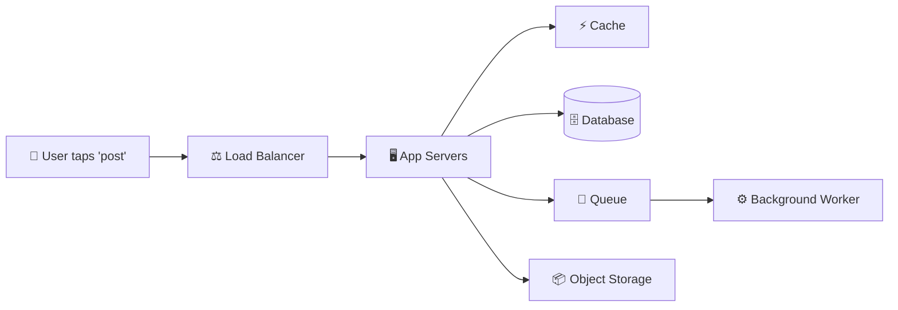
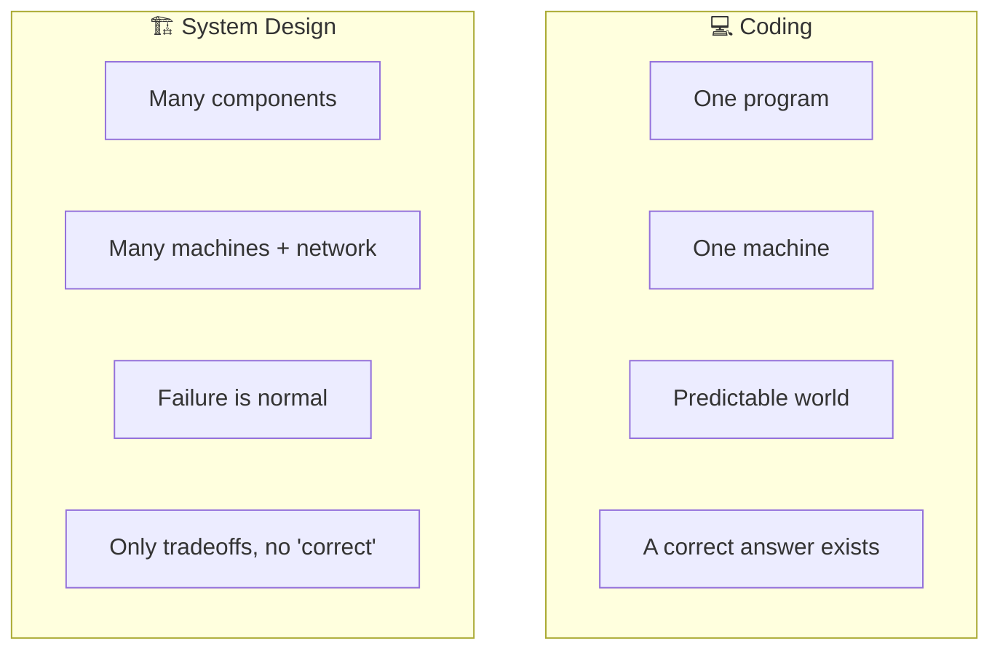

# What Is System Design?

> **Phase:** Foundation → **The Starting Point** → **Read time:** ~45 minutes

---

## Before You Begin

This is the **first document in the entire curriculum** — and it deliberately teaches you *nothing technical.*

That's not an accident. Before you learn how a load balancer works, how a database shards, or why the CAP theorem forces a choice, you need to understand the **game you're actually playing.** Otherwise every technique you learn is a tool with no sense of when — or why — to reach for it.

Most people rush past this. They dive straight into "learn Kafka," "learn microservices," "memorize how to design Twitter," and end up with a pile of disconnected facts. They can *name* a hundred technologies and *design* nothing, because they never learned the one thing underneath all of it:

> **System design is the discipline of making deliberate tradeoffs to build systems that meet real requirements under real constraints.**

Read that again. Not "knowing technologies." Not "drawing boxes." **Making deliberate tradeoffs.** Every chapter after this one is really just a catalog of tradeoffs — and this document is where you learn to *think in tradeoffs* in the first place.

By the end, you'll understand what system design actually is, how it differs from the coding you already know, what "good" even means for a system, and a repeatable way to approach *any* design problem — whether it's a real system at work or a whiteboard interview.

> **The mindset shift:** Programming asks *"how do I make this work?"* System design asks *"how do I make this work for millions of users, across many machines, when things fail — and what am I willing to give up to get there?"*

Welcome. Let's start with the big picture.

---

## Table of Contents

1. [What Is System Design, Really?](#1-what-is-system-design-really)
2. [Coding vs System Design — A Different Kind of Thinking](#2-coding-vs-system-design--a-different-kind-of-thinking)
3. [Requirements — The Foundation of Every Design](#3-requirements--the-foundation-of-every-design)
4. [Thinking in Scale — Back-of-the-Envelope Intuition](#4-thinking-in-scale--back-of-the-envelope-intuition)
5. [The Golden Truth — It's All Tradeoffs](#5-the-golden-truth--its-all-tradeoffs)
6. [The Qualities of a Good System](#6-the-qualities-of-a-good-system)
7. [The Building Blocks — A Map of the Toolkit](#7-the-building-blocks--a-map-of-the-toolkit)
8. [How to Approach Any System Design Problem](#8-how-to-approach-any-system-design-problem)
9. [A Walkthrough — Designing a URL Shortener](#9-a-walkthrough--designing-a-url-shortener)
10. [Final Recap](#10-final-recap)

---

## 1. What Is System Design, Really?

**System design is the process of defining the architecture, components, and data flow of a software system so that it satisfies a specific set of requirements.**

That's the textbook sentence. Here's the intuition behind it.

When you write a function, you're deciding how *one small thing* behaves. System design zooms all the way out. It asks: given a real product — say, a photo-sharing app used by fifty million people — **what are all the pieces, how do they connect, where does the data live, and how does a single user action travel through the whole thing?**

System design is deciding *what those boxes are, why each one exists, and how they talk to each other* — so that the whole system is fast enough, reliable enough, and cheap enough for what the business actually needs.

### It's Architecture, Not Code

An architect designing a building doesn't lay every brick. They decide how many floors, where the load-bearing walls go, how people flow through the space, and how it survives an earthquake. The *materials* (concrete, steel) matter, but the **arrangement and the tradeoffs** are the real work.

System design is exactly that, for software:

- **The components** — servers, databases, caches, queues, load balancers.
- **The connections** — how they communicate (and what happens when a connection fails).
- **The data** — where it's stored, how it's shaped, how it moves.
- **The behavior under stress** — what happens at 10× the traffic, or when a machine dies at 3 a.m.

### There Is No Single "Right" Answer

This is the part that trips up engineers coming from a coding background. A LeetCode problem has a correct answer and a test suite that proves it. **A system design problem does not.** Two senior engineers can design the same product completely differently and *both be right* — because "right" depends entirely on the requirements and constraints they're optimizing for.

> 💡 **Key Insight**
>
> System design isn't about finding *the* answer — it's about making a **defensible set of decisions** for a given context, and being able to explain *why* you chose each one and what you gave up. The skill being tested (in interviews) and used (in real work) is **reasoning**, not recall.

### Quick Recap — What System Design Is

- System design = defining the **architecture, components, and data flow** so a system meets its **requirements**.
- It's about the **whole system** and how pieces connect — not a single function.
- It's **architecture, not code** — the arrangement and the tradeoffs are the work.
- There is **no single correct answer** — only decisions that are defensible for a given context.

---

## 2. Coding vs System Design — A Different Kind of Thinking

You've almost certainly spent more time coding than designing systems, so it helps to name exactly how the two differ. They're related, but they exercise different muscles.

### The Core Difference

**Coding** lives inside one program on (usually) one machine. The world is predictable: memory is reliable, function calls always return, and there's a right answer you can test for.

**System design** lives across many machines, real networks, and real users. The world is *unpredictable*: machines fail, networks drop packets, traffic spikes 100× during a sale, and there's no test suite that says "correct."

### Side by Side

| Dimension | Coding / Algorithms | System Design |
|---|---|---|
| **Scope** | A function, a class, one program | An entire system of cooperating parts |
| **Environment** | One machine, reliable | Many machines, unreliable network |
| **Correctness** | Provable — tests pass or fail | Judgment — "good enough for the requirements" |
| **Main enemy** | Bugs and time complexity | Scale, failure, and tradeoffs |
| **Optimizes for** | Speed and correctness of code | Scalability, reliability, cost, latency |
| **The question** | "How do I make this work?" | "How does this work for millions, when things fail?" |

### You Don't Throw Coding Away

None of this means coding skills are irrelevant — they're the *foundation.* You still need to understand data structures (a hash map is why a cache is fast), complexity (why an unindexed query melts a database), and clean code (why a monolith rots without discipline). System design **builds on top of** coding; it doesn't replace it. It just adds a whole new axis of concerns that only appear once your software has to serve real people at real scale.

> 💡 **Key Insight**
>
> Coding is about making a computer do the right thing. System design is about making *many* computers keep doing a *good-enough* thing for *many* users, *even when parts of it are broken.* The moment you accept that failure and scale are the *normal* operating conditions — not edge cases — you're thinking like a systems engineer.

### Quick Recap — Coding vs System Design

- Coding = **one program, one machine, provable correctness.**
- System design = **many components, many machines, failure as the default, no single correct answer.**
- The guiding question shifts from *"how do I make this work?"* to *"how does this work at scale, under failure — and at what cost?"*
- System design **builds on** coding fundamentals; it doesn't discard them.

---
