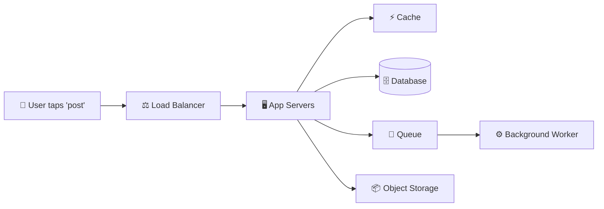
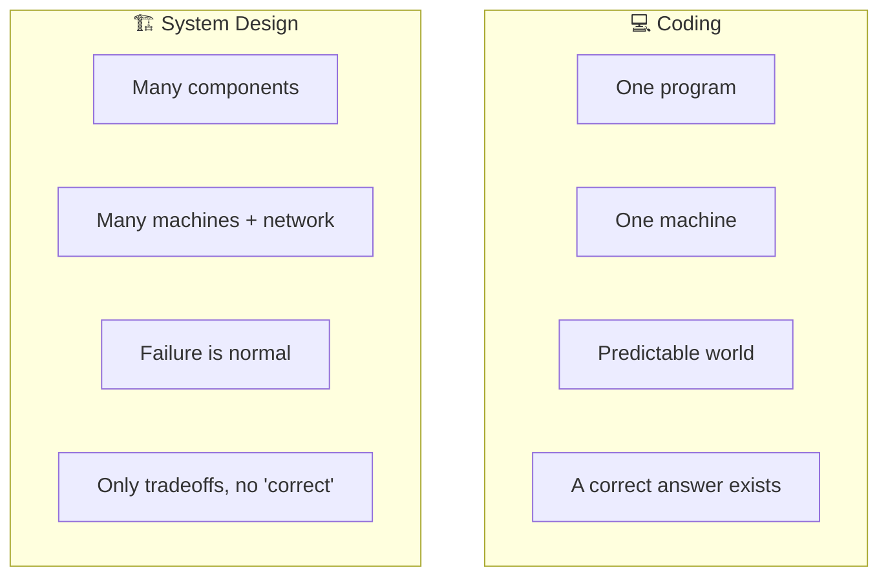
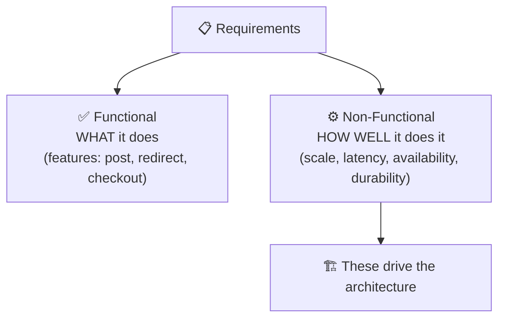
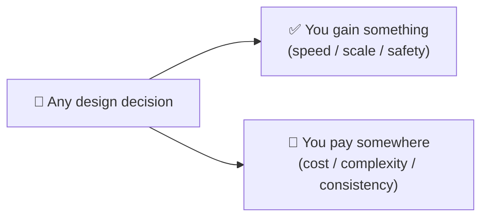

# What Is System Design?

> **Phase:** Foundation → **The Starting Point** → **Read time:** ~45 minutes

---

## Before You Begin

This is the **first document in the entire curriculum** — and it deliberately teaches you *nothing technical.*

That's not an accident. Before you learn how a load balancer works, how a database shards, or why the CAP theorem forces a choice, you need to understand the **game you're actually playing.** Otherwise every technique you learn is a tool with no sense of when — or why — to reach for it.

Most people rush past this. They dive straight into "learn Kafka," "learn microservices," "memorize how to design Twitter," and end up with a pile of disconnected facts. They can *name* a hundred technologies and *design* nothing, because they never learned the one thing underneath all of it:

> **System design is the discipline of making deliberate tradeoffs to build systems that meet real requirements under real constraints.**

Read that again. Not "knowing technologies." Not "drawing boxes." **Making deliberate tradeoffs.** Every chapter after this one is really just a catalog of tradeoffs — and this document is where you learn to *think in tradeoffs* in the first place.

By the end, you'll understand what system design actually is, how it differs from the coding you already know, what "good" even means for a system, and a repeatable way to approach *any* design problem — whether it's a real system at work or a whiteboard interview.

> **The mindset shift:** Programming asks *"how do I make this work?"* System design asks *"how do I make this work for millions of users, across many machines, when things fail — and what am I willing to give up to get there?"*

Welcome. Let's start with the big picture.

---

## Table of Contents

1. [What Is System Design, Really?](#1-what-is-system-design-really)
2. [Coding vs System Design — A Different Kind of Thinking](#2-coding-vs-system-design--a-different-kind-of-thinking)
3. [Requirements — The Foundation of Every Design](#3-requirements--the-foundation-of-every-design)
4. [Thinking in Scale — Back-of-the-Envelope Intuition](#4-thinking-in-scale--back-of-the-envelope-intuition)
5. [The Golden Truth — It's All Tradeoffs](#5-the-golden-truth--its-all-tradeoffs)
6. [The Qualities of a Good System](#6-the-qualities-of-a-good-system)
7. [The Building Blocks — A Map of the Toolkit](#7-the-building-blocks--a-map-of-the-toolkit)
8. [How to Approach Any System Design Problem](#8-how-to-approach-any-system-design-problem)
9. [A Walkthrough — Designing a URL Shortener](#9-a-walkthrough--designing-a-url-shortener)
10. [Final Recap](#10-final-recap)

---

## 1. What Is System Design, Really?

**System design is the process of defining the architecture, components, and data flow of a software system so that it satisfies a specific set of requirements.**

That's the textbook sentence. Here's the intuition behind it.

When you write a function, you're deciding how *one small thing* behaves. System design zooms all the way out. It asks: given a real product — say, a photo-sharing app used by fifty million people — **what are all the pieces, how do they connect, where does the data live, and how does a single user action travel through the whole thing?**



System design is deciding *what those boxes are, why each one exists, and how they talk to each other* — so that the whole system is fast enough, reliable enough, and cheap enough for what the business actually needs.

### It's Architecture, Not Code

An architect designing a building doesn't lay every brick. They decide how many floors, where the load-bearing walls go, how people flow through the space, and how it survives an earthquake. The *materials* (concrete, steel) matter, but the **arrangement and the tradeoffs** are the real work.

System design is exactly that, for software:

- **The components** — servers, databases, caches, queues, load balancers.
- **The connections** — how they communicate (and what happens when a connection fails).
- **The data** — where it's stored, how it's shaped, how it moves.
- **The behavior under stress** — what happens at 10× the traffic, or when a machine dies at 3 a.m.

### There Is No Single "Right" Answer

This is the part that trips up engineers coming from a coding background. A LeetCode problem has a correct answer and a test suite that proves it. **A system design problem does not.** Two senior engineers can design the same product completely differently and *both be right* — because "right" depends entirely on the requirements and constraints they're optimizing for.

> 💡 **Key Insight**
>
> System design isn't about finding *the* answer — it's about making a **defensible set of decisions** for a given context, and being able to explain *why* you chose each one and what you gave up. The skill being tested (in interviews) and used (in real work) is **reasoning**, not recall.

### Quick Recap — What System Design Is

- System design = defining the **architecture, components, and data flow** so a system meets its **requirements**.
- It's about the **whole system** and how pieces connect — not a single function.
- It's **architecture, not code** — the arrangement and the tradeoffs are the work.
- There is **no single correct answer** — only decisions that are defensible for a given context.

---

## 2. Coding vs System Design — A Different Kind of Thinking

You've almost certainly spent more time coding than designing systems, so it helps to name exactly how the two differ. They're related, but they exercise different muscles.

### The Core Difference

**Coding** lives inside one program on (usually) one machine. The world is predictable: memory is reliable, function calls always return, and there's a right answer you can test for.

**System design** lives across many machines, real networks, and real users. The world is *unpredictable*: machines fail, networks drop packets, traffic spikes 100× during a sale, and there's no test suite that says "correct."



### Side by Side

| Dimension | Coding / Algorithms | System Design |
|---|---|---|
| **Scope** | A function, a class, one program | An entire system of cooperating parts |
| **Environment** | One machine, reliable | Many machines, unreliable network |
| **Correctness** | Provable — tests pass or fail | Judgment — "good enough for the requirements" |
| **Main enemy** | Bugs and time complexity | Scale, failure, and tradeoffs |
| **Optimizes for** | Speed and correctness of code | Scalability, reliability, cost, latency |
| **The question** | "How do I make this work?" | "How does this work for millions, when things fail?" |

### You Don't Throw Coding Away

None of this means coding skills are irrelevant — they're the *foundation.* You still need to understand data structures (a hash map is why a cache is fast), complexity (why an unindexed query melts a database), and clean code (why a monolith rots without discipline). System design **builds on top of** coding; it doesn't replace it. It just adds a whole new axis of concerns that only appear once your software has to serve real people at real scale.

> 💡 **Key Insight**
>
> Coding is about making a computer do the right thing. System design is about making *many* computers keep doing a *good-enough* thing for *many* users, *even when parts of it are broken.* The moment you accept that failure and scale are the *normal* operating conditions — not edge cases — you're thinking like a systems engineer.

### Quick Recap — Coding vs System Design

- Coding = **one program, one machine, provable correctness.**
- System design = **many components, many machines, failure as the default, no single correct answer.**
- The guiding question shifts from *"how do I make this work?"* to *"how does this work at scale, under failure — and at what cost?"*
- System design **builds on** coding fundamentals; it doesn't discard them.

---

## 3. Requirements — The Foundation of Every Design

Here's a rule that separates people who *look* good at system design from people who *are* good at it:

> **You cannot design a system until you know what it must do. Every good design starts with requirements, not with technology.**

The weakest instinct — in interviews and in real projects alike — is to jump straight to solutions: "we'll use Kafka and a NoSQL database and microservices." Design *anything* before you understand the requirements and you're just guessing with buzzwords. Requirements are the target; architecture is how you hit it.

Requirements come in two flavors, and the second one matters far more than beginners expect.

### Functional Requirements — *What the System Does*

These are the features — the behaviors a user can see:

- A URL shortener must **turn a long URL into a short one** and **redirect** when someone visits it.
- A chat app must **send a message** and **deliver it** to the recipient.
- An e-commerce site must let users **browse products**, **add to cart**, and **check out**.

Functional requirements are usually the easy part — they're the obvious "what does it do?" list.

### Non-Functional Requirements — *How Well It Does It*

These describe the *qualities* the system must have while doing its job:

- **How many** users and requests? (scale)
- **How fast** must it respond? (latency)
- **How often** can it be down? (availability)
- **Can it ever lose data?** (durability)
- Must everyone see the **same data instantly**, or is a slight delay OK? (consistency)



> 💡 **Key Insight**
>
> **Non-functional requirements are what actually shape the architecture.** "Shorten a URL" (functional) is trivial — you could do it on a laptop. "Shorten a URL for **100 million users** with **<50ms redirects** and **99.99% uptime**" (non-functional) is what forces caching, replication, and global distribution. The *features* tell you what to build; the *numbers and qualities* tell you *how* to build it. Two systems with identical features and different NFRs are completely different designs.

### Ask Before You Answer

Because requirements drive everything, the *first* move in any design problem — especially an interview — is not to design. It's to **ask clarifying questions** until the problem is concrete:

- "How many users? How many requests per second?"
- "Read-heavy or write-heavy?"
- "How important is consistency vs availability here?"
- "What's the acceptable latency? Is downtime ever OK?"

An engineer who starts drawing before asking these is showing they don't understand what drives a design. An engineer who *asks first* has already demonstrated the most important system-design instinct.

### Quick Recap — Requirements

- **Requirements come before technology** — always. Never design before you know the target.
- **Functional** = what the system does (features). Usually the easy part.
- **Non-functional** = how well it does it (scale, latency, availability, durability, consistency).
- **Non-functional requirements drive the architecture** — the numbers decide the design.
- The first move on any problem is to **ask clarifying questions**, not to draw boxes.

---

## 4. Thinking in Scale — Back-of-the-Envelope Intuition

Non-functional requirements are mostly *numbers*, and numbers change designs. So a core system-design skill is being able to do rough math — **back-of-the-envelope estimation** — to turn "a lot of users" into concrete pressure on the system.

You're not looking for precision. You're looking for the **order of magnitude**, because that's what decides architecture. Ten requests per second and ten million requests per second are not the same system — and a quick estimate tells you which one you're building.

### A Simple Example

Say we're designing a service with **100 million** users, and each makes **10 requests per day** on average.

```text
100,000,000 users × 10 requests = 1,000,000,000 requests/day

1,000,000,000 / 86,400 seconds ≈ ~11,500 requests/second (average)
```

And traffic is never flat — there are peaks. A common rule of thumb is that peak load is a few times the average:

```text
Peak ≈ 2–3× average ≈ ~30,000 requests/second
```

Suddenly "100 million users" has become a concrete engineering target: **the system must handle ~30k requests/second at peak.** That single number immediately tells you a single server won't do — you'll need horizontal scaling, load balancing, and caching (all covered in Group 4).

### The Numbers That Matter

You'll estimate a handful of quantities again and again:

| Estimate | Why it matters |
|---|---|
| **Requests/second (QPS)** | Decides how many servers and how much caching you need |
| **Read : Write ratio** | Read-heavy → replicas & caches; write-heavy → sharding |
| **Storage growth** | "1M new records/day × 1KB × 365" → do we need one DB or many? |
| **Bandwidth** | Serving video vs text is a wildly different network bill |

> 💡 **Key Insight**
>
> The point of estimation isn't the exact figure — it's to reveal **where the pressure is.** A read-heavy system pushes you toward caches and replicas; a write-heavy one toward sharding; a storage-heavy one toward partitioning and cheaper storage tiers. The rough numbers tell you *which problem you're actually solving* before you pick a single technology. (Group 4 turns each of these pressures into a specific technique.)

> ⚠️ Don't over-index on perfect math. Interviewers and real designs care that you *can* reason about scale and that your numbers are in the right ballpark — not that you divided by 86,400 flawlessly. Round aggressively; think in powers of ten.

### Quick Recap — Thinking in Scale

- **Back-of-the-envelope estimation** turns vague scale ("lots of users") into concrete targets (QPS, storage, bandwidth).
- Aim for the **order of magnitude**, not precision — powers of ten decide architecture.
- Key estimates: **QPS**, **read:write ratio**, **storage growth**, **bandwidth**.
- Account for **peaks**, not just averages (peak ≈ 2–3× average is a common rule of thumb).
- The numbers reveal **where the pressure is** — and therefore which techniques you'll need.

---

## 5. The Golden Truth — It's All Tradeoffs

If you remember one idea from this entire curriculum, make it this one:

> **There is no perfect design. Every decision in system design is a tradeoff — you gain something and you pay for it somewhere else.**

This is *the* defining truth of the discipline. The reason there's no single correct answer (Section 1) is that every choice sits on a set of scales: push one down and another pops up. The expert isn't the person who avoids tradeoffs — that's impossible. The expert is the person who makes them **consciously**, in favor of what the requirements actually value.

### The "It Depends" That Isn't a Cop-Out

Ask a senior engineer almost any system design question — "SQL or NoSQL?", "cache or not?", "microservices or monolith?" — and the honest answer usually starts with **"it depends."** That's not indecision. It means: *the right choice depends on the requirements, and I need to know them before I can choose.* Learning system design is largely learning **what it depends on** for each decision.

### The Tradeoffs You'll Meet Everywhere

A few tensions show up again and again across the whole curriculum:

| You want more… | …you usually pay in |
|---|---|
| **Consistency** (everyone sees the latest data) | **Availability / latency** (coordination is slow) |
| **Low latency** (fast responses) | **Cost** (more caching, more servers, more regions) |
| **Scalability** (handle huge load) | **Complexity** (distributed systems are hard) |
| **Reliability** (never lose data / never go down) | **Cost & complexity** (replication, redundancy) |
| **Speed of development** (ship fast) | **Long-term maintainability** (shortcuts become debt) |



You'll see these exact scales again with full depth: **consistency vs availability** in the CAP theorem (Group 5), **latency vs cost** in caching and CDNs (Group 4), **simplicity vs independence** in monolith vs microservices (Group 6). This section is just naming the pattern *before* you meet its instances.

> 💡 **Key Insight**
>
> A good system designer doesn't ask *"what's the best option?"* — they ask *"what does this specific system value most, and what can it afford to give up?"* A banking system will sacrifice availability to never show a wrong balance. A social feed will sacrifice consistency to always stay up and fast. **Same question, opposite answers — because their requirements value different things.** Naming your tradeoff out loud, and tying it to a requirement, is the single most senior-sounding thing you can do in a design discussion.

### Quick Recap — It's All Tradeoffs

- **There is no perfect design** — every decision gains something and costs something.
- **"It depends"** is the correct starting answer; learning system design = learning *what* it depends on.
- Recurring tensions: **consistency vs availability, latency vs cost, scalability vs complexity, speed vs maintainability.**
- Experts make tradeoffs **consciously**, aligned to what the requirements value most.
- Always tie a decision back to a requirement — that's what makes it defensible.

---
