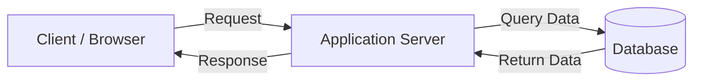
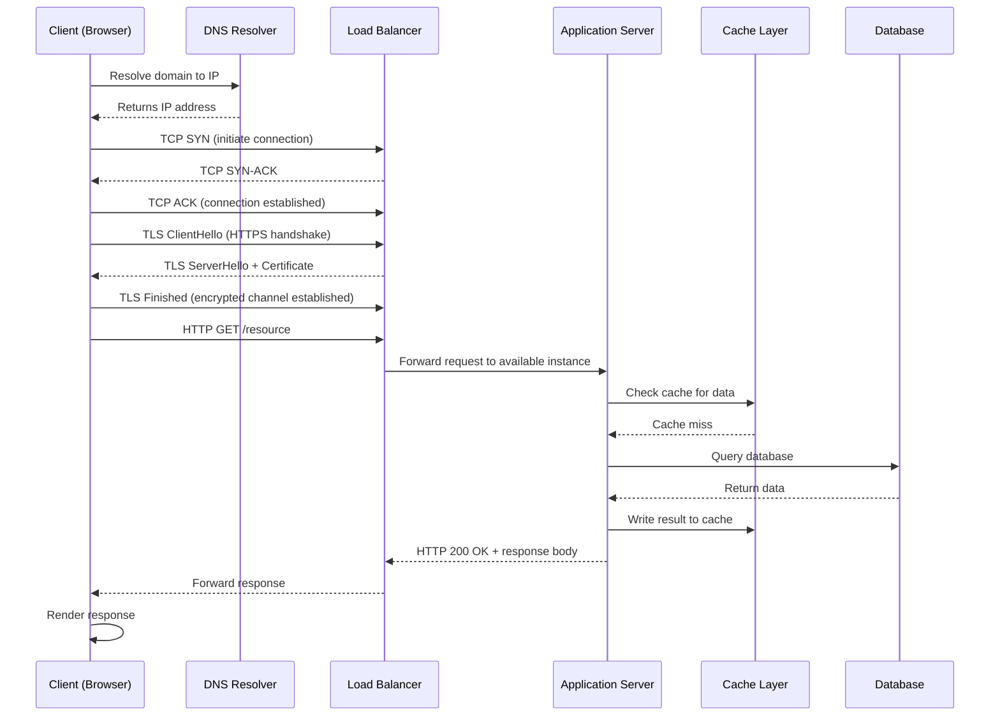
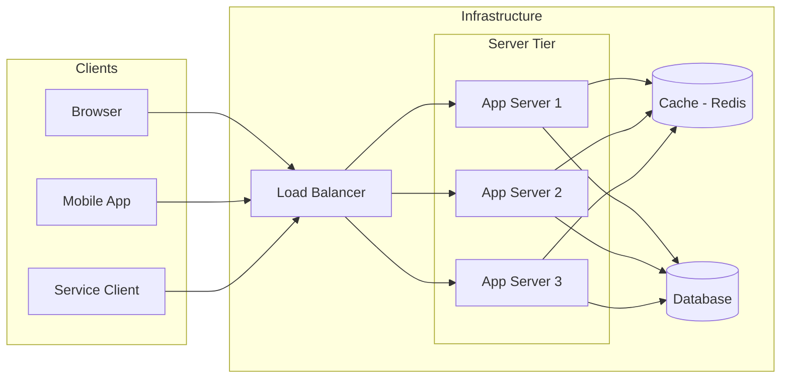
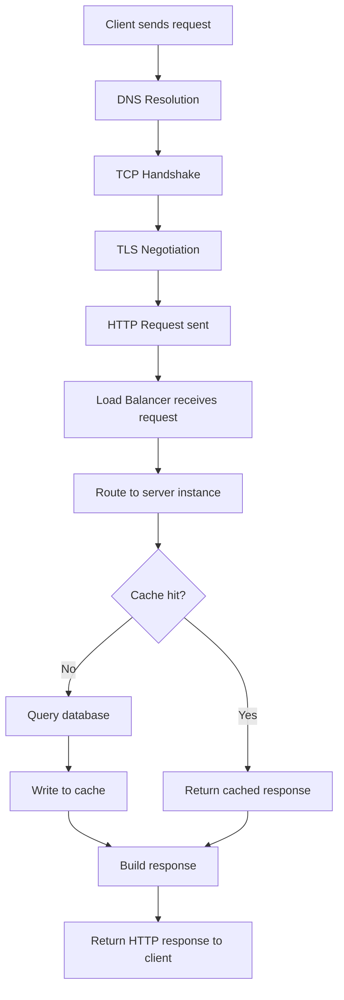
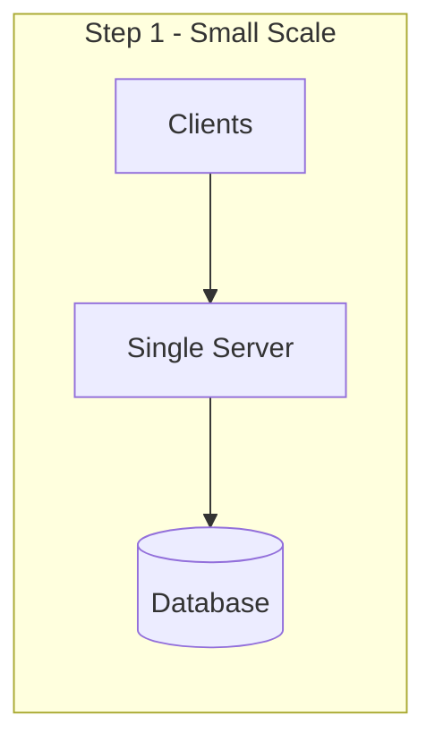
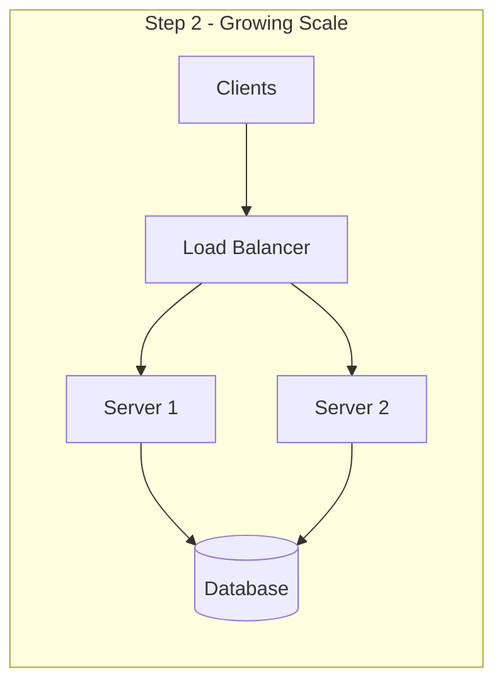

# Client–Server Model

---
<br>




## What You'll Learn

By the end of this document you will understand:

- Why the client-server model was invented and what problem it solved
- The clear roles of client and server — and why the distinction matters
- How a request travels from your browser to a server and back, step by step
- What can go wrong in production and how engineers think about it
- How this model grows from a single server to multiple servers
- How to talk about this topic confidently in interviews

---

## Why This Exists

### The Problem Before Structure

In the early days of networked computing, there was no standard model for how machines should communicate. Any machine could talk to any other machine in any way it wanted. There was no defined role of who initiates communication, who responds, who holds data, and who consumes it.

This created chaos:

- No standard way to share resources across a network
- No clear separation between who requests and who serves
- Business logic, data, and presentation were tangled together
- Systems were impossible to scale independently

Engineers needed a model that answered one fundamental question:

> How should machines on a network divide responsibility?

### The Solution

The client-server model solved this by introducing a clear, asymmetric separation of roles:

- One side **requests** — the client
- One side **responds** — the server

This single architectural decision became the foundation of the internet, every web application, every mobile app, every API, and virtually every networked system in existence today.

When you open Google, your browser is a client. Google's infrastructure is the server. When a microservice calls another microservice, one is a client and the other is a server. The model is universal because the problem it solves — structured, reliable communication between networked processes — is universal.

---

## Intuition & Mental Model

### The Restaurant Analogy

Imagine walking into a restaurant.

You are the **customer**. You sit at a table, look at the menu, and decide what you want. You do not walk into the kitchen yourself. You do not cook the food. You make a **request** — you place an order with the waiter.

The **waiter** carries your request to the **kitchen**. The kitchen is the **server**. It has all the ingredients, equipment, and expertise. It processes your order and prepares the food.

The waiter then delivers the response — your meal — back to you.

Now map this to engineering:

| Restaurant | Engineering |
|---|---|
| Customer | Client (browser, mobile app, service) |
| Menu | API contract |
| Waiter | Network / HTTP protocol |
| Order | Request |
| Kitchen | Server |
| Ingredients and equipment | Database, cache, business logic |
| Meal delivered | Response |

Notice what the customer never does:

- Never enters the kitchen
- Never touches the ingredients
- Never knows the internal recipe
- Never manages the kitchen's capacity

This is exactly how the client-server model works. The client only knows how to make requests and handle responses. The server owns all the complexity internally.

### The Mental Simulation

Close your eyes and simulate this:

You type `https://github.com` into your browser and press Enter.

```
Your browser (client) asks:
  "What is the IP address of github.com?"

DNS responds:
  "It is 140.82.121.4"

Your browser says to that IP:
  "I want to establish a connection"

GitHub's server acknowledges:
  "Connection established"

Your browser says:
  "Please give me the homepage"

GitHub's server processes this, queries its systems, and responds:
  "Here is the HTML for the homepage"

Your browser renders it.
```

Every single website visit follows this flow. Billions of times per second across the internet.

---

## Core Concepts

### Client

A client is any process, application, or device that **initiates a request** to a server and consumes the response.

The word "client" does not mean browser. It does not mean user. It means any entity that is on the **requesting side** of a communication.

Examples:

- A web browser requesting an HTML page
- A mobile application calling a REST API
- A microservice requesting data from another microservice
- A CLI tool querying a remote API
- A cron job calling an internal service endpoint

Key characteristics:

- Clients **initiate** communication — servers never reach out first in standard client-server architecture
- Clients are typically stateless between requests — the server does not remember them unless session management is explicitly implemented
- Clients can be lightweight — they do not need to hold business logic or data

---

### Server

A server is any process, application, or infrastructure component that **listens for incoming requests**, processes them, and returns a response.

A server is not a machine. This is one of the most important distinctions in system design.

A server is a **role**, not hardware. The same physical machine can run multiple servers. A single container can be a server. A serverless function is a server. A process listening on port 8080 is a server.

Key characteristics:

- Servers listen on a specific **port** for incoming connections
- Servers are designed to handle **many concurrent clients**
- Servers own business logic, data access, and processing
- Servers are always running — availability is a core responsibility

---

### Request

A request is a structured message sent from a client to a server asking for an action or resource.

In HTTP, a request contains:

- **Method** — what action is being requested (GET, POST, PUT, DELETE)
- **URL** — what resource is being targeted
- **Headers** — metadata about the request (content type, authorization, encoding)
- **Body** — optional payload containing data (for POST, PUT requests)

---

### Response

A response is the structured message the server returns to the client after processing a request.

In HTTP, a response contains:

- **Status code** — the outcome of the request (200 OK, 404 Not Found, 500 Internal Server Error)
- **Headers** — metadata about the response (content type, caching directives, encoding)
- **Body** — the actual data being returned (HTML, JSON, binary data)

---

### Port

A port is a logical endpoint on a machine that allows multiple services to listen for connections simultaneously.

Think of an IP address as a building address and a port as the specific apartment number inside that building.

Common ports:

| Port | Protocol |
|---|---|
| 80 | HTTP |
| 443 | HTTPS |
| 5432 | PostgreSQL |
| 3306 | MySQL |
| 6379 | Redis |
| 22 | SSH |

---

### Protocol

A protocol is a standardized set of rules that defines how clients and servers communicate — the format of messages, the sequence of exchanges, and how errors are handled.

Without protocols, every application would invent its own communication format, making interoperability impossible.

Common protocols:

- **HTTP/HTTPS** — web communication
- **TCP** — reliable transport layer
- **WebSocket** — persistent bidirectional communication
- **gRPC** — high-performance RPC between services

---

## Step-by-Step Internal Mechanics

### The Complete Request Lifecycle

When a client makes a request to a server, the journey involves multiple layers of the networking stack operating together.



### What Happens at Each Step

**Step 1 — DNS(Domain Name System) Resolution**

Before any connection can be made, the client must translate the human-readable domain name into a machine-routable IP address. The client queries a DNS resolver, which traverses the DNS hierarchy to return the correct IP address.

**Step 2 — TCP(Transmission Control Protocol) Three-Way Handshake**

TCP is the transport layer protocol that guarantees reliable, ordered delivery. Before any data is exchanged, a connection must be established through:

- **SYN** — client signals intent to connect
- **SYN-ACK** — server acknowledges and signals readiness
- **ACK** — client confirms, connection is now open

**Step 3 — TLS(Transport Layer Security) Negotiation (HTTPS)**

For encrypted communication, a TLS handshake occurs after TCP. The client and server negotiate an encryption algorithm, the server presents its certificate for identity verification, and a shared encryption key is established. All subsequent communication is encrypted.

**Step 4 — HTTP Request**

The client sends a structured HTTP request over the now-open, encrypted TCP connection.

**Step 5 — Load Balancer Routing**

In production, the request hits a load balancer before any application server. The load balancer selects an available server instance based on its routing algorithm and forwards the request.

**Step 6 — Application Server Processing**

The application server receives the request, executes business logic, checks cache, and queries the database if necessary.

**Step 7 — Response Traversal**

The response travels back through the same path — server to load balancer to client — and the client processes it.

---

## Visual Architecture

### High-Level Client-Server Architecture



### Internal Request Lifecycle



---

## Production Awareness

### What Commonly Goes Wrong

At this stage you don't need to know how to fix these — just be aware they exist.

- **Network failures** — packets can be lost or delayed; connections can time out if a server is unreachable
- **Server overload** — when too many requests arrive at once, response times increase and some requests may fail
- **Slow dependencies** — if the database is slow, the server waits, and so does the client
- **A server going down** — without redundancy, one crashed server means the entire service is unavailable

### The Key Principle

> Every request depends on a chain of components — DNS, network, load balancer, server, database. Any link in that chain can fail.

This is why production systems add redundancy, timeouts, and health checks. But that is a deep topic for later.

⚠️ We will explore production failure patterns deeply in:
- **Reliability & Fault Tolerance**
- **Distributed Systems**
- **Load Balancers**

---

## Scaling Preview

The client-server model naturally evolves as traffic grows. Here is the progression at a high level — just to plant the mental model:

```
Single server
↓
Traffic grows → one server isn't enough
↓
Multiple servers behind a load balancer
↓
Database becomes the next bottleneck
↓
Caching layer added to reduce database pressure
```





You do not need to understand the full mechanics of each step yet. The important insight is:

> The client-server model is not a static pattern. It scales in layers, and each layer introduces new challenges.

⚠️ We will cover this in depth in:
- **Load Balancers**
- **Caching**
- **Horizontal vs Vertical Scaling**

---

## Tradeoffs

### Why Choose Client-Server

- **Centralized control** — business logic, security, and data governance live server-side, not scattered across clients
- **Independent scalability** — the server tier scales without modifying clients
- **Security** — sensitive logic and data never leave the server
- **Maintainability** — server updates deploy once and apply to all clients immediately
- **Consistency** — all clients interact with the same authoritative data source

### Limitations to Be Aware Of

- **Network dependency** — every client operation requires a functioning network path to the server
- **Single point of failure** — without redundancy, a server crash means complete unavailability
- **Latency overhead** — every operation requires a network round trip; local operations are impossible
- **Scaling cost** — server infrastructure must be provisioned, monitored, and scaled as client count grows

---

## Common Misconceptions

### Misconception 1 — "Server means a physical machine"

**Reality:** A server is a **role**, not hardware. A server is any process that listens for and responds to requests. A single laptop can run ten servers simultaneously on different ports. A containerized microservice is a server. A serverless function is a server. Hardware is irrelevant to the definition.

---

### Misconception 2 — "The client is always a browser or human user"

**Reality:** In the vast majority of production traffic, clients are other **services**. When a payment service calls an authentication service, the payment service is the client. Microservice architectures consist almost entirely of service-to-service client-server relationships with no human involved.

---

### Misconception 3 — "The server always responds immediately"

**Reality:** Servers queue requests. Under load, a request may sit in a queue for hundreds of milliseconds before any processing begins. This queuing latency is often the dominant source of slow responses in production — not the actual processing time.

---

### Misconception 4 — "If the server process is running, the service is healthy"

**Reality:** A server process being alive does not mean the service is healthy. The server may be running but unable to reach its database, out of memory, or accepting connections it cannot actually process. Health checks must validate real end-to-end functionality, not just whether the process exists.

---

## Real-World Examples

### Google Search

When you search on Google, your browser (client) sends an HTTP request to Google's servers. Behind that single request, Google's infrastructure fans out to many internal service-to-service calls — spell checking, index lookup, ranking, ad auctions — all completing within milliseconds before the aggregated response returns to your browser.

### Netflix Video Streaming

The Netflix app (client) communicates with multiple backend services: authentication to verify your identity, a content catalog to retrieve titles, a recommendation service to personalize your homepage, and CDN servers to stream video with minimal latency. Each service is simultaneously a server to the client above it and a client to the services below it.

### WhatsApp Messaging

WhatsApp clients connect to WhatsApp servers via persistent connections. When you send a message, your client sends it to the server. The server stores it and delivers it to the recipient's client. Neither client communicates directly with the other — the server is the central broker.

### GitHub

When you push code to GitHub, your Git client communicates with GitHub's servers over SSH or HTTPS. GitHub's servers receive the push, validate authentication, update the repository, and trigger connected services like CI pipelines — all as server-side processing invisible to your local Git client.

---

## Interview Perspective

### Beginner Questions

**Q: What is the client-server model?**

The client-server model is a distributed communication architecture that divides networked systems into two roles: clients that initiate requests, and servers that process and respond to them. It establishes a clear asymmetry where clients are lightweight consumers and servers are the authoritative owners of business logic and data.

**Q: What is the difference between a client and a server?**

A client initiates communication and consumes responses. A server listens for incoming connections, processes requests, and returns responses. The distinction is about role in communication, not hardware. The same machine can run processes acting as both clients and servers simultaneously.

---

### Intermediate Questions

**Q: What happens when a client makes an HTTP request?**

The client first resolves the domain via DNS to get an IP address. It then performs a TCP three-way handshake to establish a reliable connection. If using HTTPS, a TLS handshake follows to establish encryption. The client sends the HTTP request over the encrypted connection. In production, a load balancer receives the request and routes it to an available server instance. The server processes the request — potentially querying cache and database — and returns an HTTP response that travels back through the load balancer to the client.

**Q: What is a connection timeout and why does it matter?**

A connection timeout is the maximum duration a client will wait for a server to accept a connection. Without timeouts, client threads can block indefinitely on unresponsive servers, which can cause the entire system to degrade. Every production client should configure explicit timeouts.

---

## Terminology Upgrade

| Weak | Professional |
|---|---|
| "The server is slow" | "The application tier is experiencing elevated response latency under increased request load" |
| "Too many users crashed the server" | "Concurrent request volume exceeded the server's capacity, causing request queuing and service degradation" |
| "The app can't connect to the database" | "The application server is unable to acquire a database connection, likely due to connection pool exhaustion" |
| "We added more servers to handle the load" | "We horizontally scaled the application tier and distributed traffic across instances using a load balancer" |
| "The server went down" | "The application instance became unavailable, triggering health check failures and removal from the load balancer's active pool" |
| "Something is wrong with the network" | "The client is experiencing intermittent TCP connection failures, likely caused by packet loss or routing instability" |
| "We cached the data to make it faster" | "We introduced a cache layer to reduce database read pressure and decrease response latency for frequently accessed data" |

---

## Cheat Sheet

| Concept | Key Point |
|---|---|
| Client | Initiates requests — browser, app, or another service |
| Server | Listens and responds — owns logic and data |
| Port | Logical endpoint — HTTP: 80, HTTPS: 443 |
| Protocol | Communication rules — HTTP, TCP, TLS |
| Request lifecycle | DNS → TCP → TLS → HTTP → Load Balancer → Server → DB → Response |
| TCP handshake | SYN → SYN-ACK → ACK |
| Connection timeout | Max wait for server connection — prevents threads from blocking forever |
| Horizontal scaling | More server instances behind a load balancer |
| Server ≠ machine | Server is a role — process, container, or function |
| REST ≠ client-server | REST is one API style that follows the model — not the model itself |

---

## What Comes Next

The client-server model is the foundation. But it immediately raises new questions:

**How does the client know where the server is?**
→ Next: **IP Addresses & DNS** — how domain names resolve to machine addresses

**What rules govern how requests and responses are structured?**
→ Next: **HTTP & HTTPS** — the protocol that powers the web

**What sits between the client and the server in production?**
→ Next: **Proxies & Reverse Proxies** — the intermediaries that add security, caching, and routing

**How does traffic get distributed across multiple servers?**
→ Next: **Load Balancers** — how production systems stay available under high traffic

Each of these topics builds directly on what you just learned. The client-server model is the frame — everything else fits inside it.

---

*Part of the [System Design Mastery](../../../README.md) repository — 01 Introduction / 01 Networking Foundations*