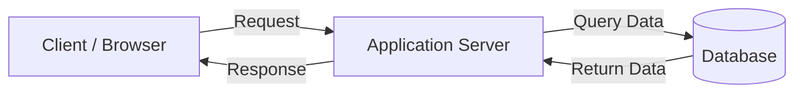
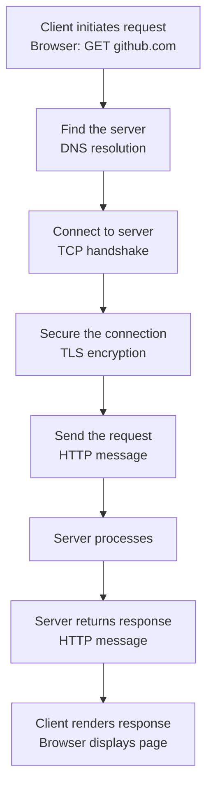

# Client–Server Model

---

## Learning Path

This document is part of a progressive curriculum:

```
Networking Foundations
├── Client–Server Model ← You are here
├── IP Addresses & DNS
├── HTTP & HTTPS
├── Proxies & Reverse Proxies
└── Load Balancers
```

Each topic builds on the previous one.

---

## What You'll Learn

By the end of this document you will understand:

- Why the client-server model was invented and what problem it solved
- The clear roles of client and server — and why the distinction matters
- How a request travels from client to server at a conceptual level
- What can go wrong in production (preview)
- How to talk confidently about this topic in interviews

---

## Visual Overview



---

## Why This Exists

### The Problem Before Structure

In early networked computing, there was no standard model for how machines should communicate. Any machine could talk to any other in any way it wanted. There was no defined role for who initiates communication, who responds, who holds data, and who consumes it.

This created problems:

- No standard way to share resources across a network
- No clear separation of responsibility
- Business logic, data, and presentation were tangled together
- Systems couldn't scale independently

Engineers needed a model that answered one fundamental question:

> How should machines on a network divide responsibility?

### The Solution

The client-server model solved this with a **clear, asymmetric separation of roles**:

- One side **requests** — the client
- One side **responds** — the server

This single architectural decision became the foundation for:

- The entire internet
- Every web application
- Every mobile app
- Every API
- Virtually every networked system

When you open Google, your browser is a client. Google's servers respond. When a microservice calls another microservice, one is the client, the other is the server. The model works because it solves a universal problem: **How do we reliably communicate between networked processes?**

---

## Intuition & Mental Model

### The Restaurant Analogy

Imagine walking into a restaurant.

You are the **customer**. You:
- Look at the menu
- Decide what you want
- Make a **request** (place an order)
- Do NOT cook the food

The **kitchen** is the **server**. It has:
- All the ingredients and equipment
- The expertise to prepare food
- The responsibility to fulfill orders

The waiter carries your request to the kitchen and brings the response (your meal) back.

**Map this to engineering:**

| Restaurant | Engineering |
|---|---|
| Customer | Client (browser, app, service) |
| Menu | API contract |
| Waiter | Network / HTTP |
| Order | Request |
| Kitchen | Server |
| Ingredients & equipment | Database, logic, services |
| Meal delivered | Response |

**Notice what the customer never does:**
- Never enters the kitchen
- Never touches the ingredients
- Never knows the internal recipe
- Never manages the kitchen's capacity

This is exactly how the client-server model works. The client makes requests. The server owns all internal complexity.

### The Mental Simulation

Close your eyes and simulate this:

You type `https://github.com` into your browser and press Enter.

```
Your browser (client) asks:
  "What is the IP address of github.com?"

DNS responds:
  "It is 140.82.121.4"

Your browser says:
  "I want to connect to that address"

GitHub's server says:
  "Connection accepted"

Your browser says:
  "Please give me the homepage"

GitHub's server processes the request and responds:
  "Here is the HTML for the homepage"

Your browser renders it.
```

**Every website visit follows this flow.** Billions of times per second across the internet.

---

## Core Concepts

### Client

A client is any process that **initiates a request** to a server and consumes the response.

The word "client" does not mean browser. It does not mean user. It means any entity on the **requesting side** of communication.

**Examples:**

- A web browser requesting an HTML page
- A mobile app calling a REST API
- A microservice requesting data from another microservice
- A CLI tool querying a remote API
- A cron job calling an internal service

**Key characteristics:**

- Initiates communication — servers don't reach out first
- Typically stateless between requests — unless session management is explicitly implemented
- Can be lightweight — no need for business logic or data storage

---

### Server

A server is any process that **listens for incoming requests**, processes them, and returns a response.

⚠️ **Critical:** A server is not a machine. A server is a **role**.

The same physical machine can run multiple servers. A container is a server. A serverless function is a server. Any process listening on a port is a server.

**Key characteristics:**

- Listens on a specific **port** for incoming connections
- Designed to handle **many concurrent clients**
- Owns business logic, data access, and processing
- Always running — availability is a core responsibility

---

### Request

A request is a structured message from client to server asking for an action or resource.

In HTTP, requests contain:

- **Method** — what action is requested (GET, POST, PUT, DELETE)
- **URL** — what resource is targeted
- **Headers** — metadata (content type, authorization, encoding)
- **Body** — optional data payload (for POST, PUT requests)

---

### Response

A response is the message the server returns after processing a request.

In HTTP, responses contain:

- **Status code** — outcome of the request (200 OK, 404 Not Found, 500 Error)
- **Headers** — metadata about the response (content type, caching rules)
- **Body** — actual data returned (HTML, JSON, binary data)

---

### Port

A port is a logical endpoint on a machine that allows multiple services to listen simultaneously.

Think of it like:
- IP address = building address
- Port = apartment number in that building

**Common ports:**

| Port | Protocol |
|---|---|
| 80 | HTTP |
| 443 | HTTPS |
| 5432 | PostgreSQL |
| 3306 | MySQL |
| 6379 | Redis |
| 22 | SSH |

---

### Protocol

A protocol is a standardized set of rules defining how clients and servers communicate — the format of messages, the order of exchanges, and how errors are handled.

Without protocols, every app would invent its own format, making interoperability impossible.

**Common protocols:**

- **HTTP/HTTPS** — web communication
- **TCP** — reliable, ordered delivery (we'll learn this soon)
- **WebSocket** — persistent two-way communication
- **gRPC** — high-performance service-to-service communication

---

## How It Works: The Request Journey

### Conceptual Overview

When you make a request in your browser, here's the flow:



**The key insight:** Each step (DNS, TCP, TLS) is its own deep topic. For now, just understand they work together to deliver a request reliably.

### What Each Step Does

**Step 1: DNS Resolution**

The client needs to find the server. It translates `github.com` into an IP address (e.g., `140.82.121.4`) so it knows where to send the request.

*We'll dive deep into DNS in the next topic.*

**Step 2: TCP Connection**

The client and server establish a reliable connection using TCP (Transmission Control Protocol). Think of this as "confirming we can talk to each other."

*We'll explore TCP mechanics in the "Reliability" chapter.*

**Step 3: TLS Encryption (HTTPS)**

For secure communication, the client and server negotiate encryption. All subsequent data is encrypted so no one in between can read it.

*We'll cover TLS deeply in the "Security" chapter.*

**Step 4: HTTP Request**

Over the now-open, secure connection, the client sends a structured HTTP request.

**Step 5: Server Processing**

The server receives the request, executes business logic, and prepares a response.

**Step 6: HTTP Response**

The server sends back an HTTP response with the data or result.

**Step 7: Client Rendering**

The client receives the response and processes it (browser renders HTML, app parses JSON, etc.).

---

## Production Reality

### What Can Go Wrong

At this point, you just need to be aware these challenges exist. Future chapters will show how engineers prevent and handle them.

- **Network failures** — connection breaks, packets are lost, or server is unreachable
- **Server is down** — the server crashed or stopped running
- **Server overload** — too many requests arrive at once; response times increase
- **Slow dependencies** — if the database is slow, the client waits
- **Connection timeout** — no response within a time limit

**The key principle:**

> Every request depends on a chain: DNS → network → server → database. Any link can fail.

This is why production systems add redundancy, timeouts, and health checks.

⚠️ **We will explore these patterns deeply in:**
- Reliability & Fault Tolerance
- Distributed Systems
- Load Balancers

---

## Tradeoffs

### Why Choose Client-Server

- **Centralized control** — logic, security, and data live server-side
- **Independent scalability** — servers scale without changing clients
- **Security** — sensitive logic never leaves the server
- **Easy maintenance** — server updates deploy once and apply everywhere
- **Consistency** — all clients see the same authoritative data

### Limitations to Be Aware Of

- **Network dependency** — every operation requires a functioning network path
- **No offline work** — client cannot operate without a server
- **Latency overhead** — every operation requires a network round trip
- **Scaling cost** — server infrastructure must be provisioned and monitored as traffic grows

---

## Common Misconceptions

### Misconception 1: "Server means a physical machine"

**Reality:** A server is a **role**, not hardware. A server is any process that listens for and responds to requests. One laptop can run ten servers on different ports. A containerized service is a server. A serverless function is a server.

---

### Misconception 2: "The client is always a browser or human"

**Reality:** In production, most clients are **other services**. When a payment service calls an authentication service, the payment service is the client. Microservice architectures consist almost entirely of service-to-service client-server relationships with no humans involved.

---

### Misconception 3: "The server always responds immediately"

**Reality:** Servers queue requests. Under load, a request may wait in a queue for hundreds of milliseconds before processing even begins. This queuing latency is often the dominant source of slow responses — not the processing time itself.

---

### Misconception 4: "If the server process is running, the service is healthy"

**Reality:** A running process doesn't mean the service is healthy. The server may be unable to reach its database, out of memory, or accepting connections it can't process. Real health checks validate end-to-end functionality, not just process existence.

---

### Misconception 5: "Client-server means REST APIs"

**Reality:** Client-server is a fundamental architecture pattern. REST is one style of API design that uses it. You can build client-server systems with WebSockets, gRPC, message queues, or any protocol. Don't confuse the pattern with a specific implementation.

---

## Real-World Examples

### Google Search

You type a query in your browser (client). Your browser sends a request to Google's servers. Behind that single request, Google's internal services fan out — spell checking, index lookup, ranking, ad matching — all completing within milliseconds before the response returns to your browser.

### Netflix App

The Netflix app (client) communicates with multiple backend services: authentication (verifies who you are), catalog (retrieves titles), recommendations (personalizes your homepage), and CDN (streams video). Each service is both a server to the client above it and a client to the services below it.

---

## Interview Questions

### Beginner Level

**Q: What is the client-server model?**

A: It's an architecture that divides systems into two roles: clients initiate requests, and servers listen and respond. The distinction establishes clear separation of responsibility — clients are lightweight, servers own logic and data.

**Q: What's the difference between a client and a server?**

A: A client initiates communication. A server listens and responds. The distinction is about role in communication, not hardware. The same machine can run both simultaneously.

**Q: Why is a server not a machine?**

A: Because "server" describes a role, not hardware. A server is any process listening for requests on a port. One physical machine can run multiple servers. A container is a server. A serverless function is a server.

---

### Intermediate Level

**Q: Describe what happens when you visit github.com in your browser.**

A: The browser resolves the domain via DNS to get an IP address. It then establishes a connection (TCP handshake) and secures it (TLS encryption). It sends an HTTP GET request over the encrypted connection. GitHub's server receives it, processes the request, and returns an HTTP response with the homepage. The browser renders it.

**Q: What is a connection timeout and why does it matter?**

A: A connection timeout is the maximum time a client waits for a server to accept a connection. Without timeouts, client threads can block indefinitely on unresponsive servers, degrading the entire system. Every production client needs explicit timeouts.

---

## Terminology Upgrade

| Weak Phrasing | Professional |
|---|---|
| "The server is slow" | "The application tier is experiencing elevated response latency" |
| "Too many users crashed the server" | "Request volume exceeded server capacity, causing queue buildup and degradation" |
| "The app can't reach the database" | "The application server cannot acquire a database connection from the pool" |
| "We added more servers" | "We horizontally scaled by deploying additional instances behind a load balancer" |
| "The server went down" | "The instance became unavailable, triggering health check failures and removal from the load balancer" |
| "Something is wrong with the network" | "The client is experiencing TCP connection failures, likely due to packet loss or routing instability" |
| "We cached the data to make it faster" | "We introduced a cache layer to reduce database read pressure and decrease response latency" |

---

## Cheat Sheet

| Concept | Definition |
|---|---|
| **Client** | Initiates requests — browser, app, or another service |
| **Server** | Listens and responds — owns logic and data |
| **Port** | Logical endpoint — HTTP: 80, HTTPS: 443 |
| **Protocol** | Communication rules — HTTP, TCP, TLS |
| **Request** | Structured message asking for action or resource |
| **Response** | Structured message returned from server |
| **DNS Resolution** | Translating domain name to IP address |
| **TCP Handshake** | Establishing a reliable connection |
| **TLS Encryption** | Securing communication |
| **Server ≠ Machine** | Server is a role, not hardware |
| **Horizontal scaling** | More server instances behind load balancer |

---

## What Comes Next

The client-server model is the foundation. But it immediately raises new questions:

**How does the client know where the server is?**
→ **IP Addresses & DNS** — translating names to machine addresses

**What rules govern request and response structure?**
→ **HTTP & HTTPS** — the protocol powering the web

**What sits between client and server in production?**
→ **Proxies & Reverse Proxies** — adding security, caching, and routing

**How does traffic distribute across many servers?**
→ **Load Balancers** — keeping systems available under high traffic

Each topic builds directly on this foundation. The client-server model is the frame — everything else fits inside it.

---

*Part of the [System Design Mastery](../../../README.md) repository — 01 Introduction / 01 Networking Foundations*