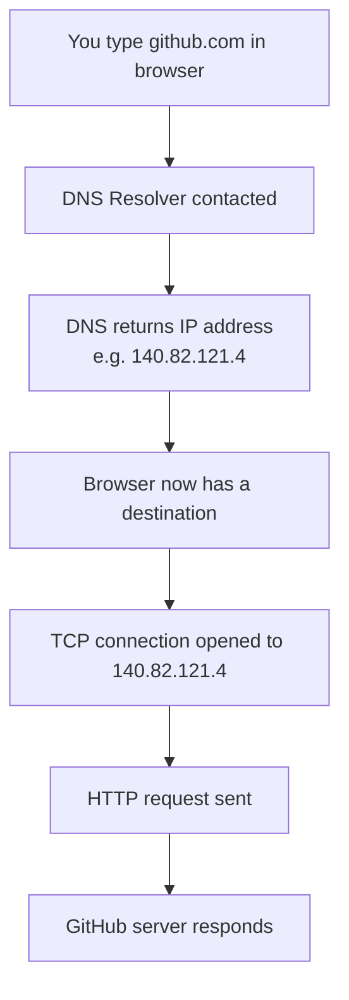
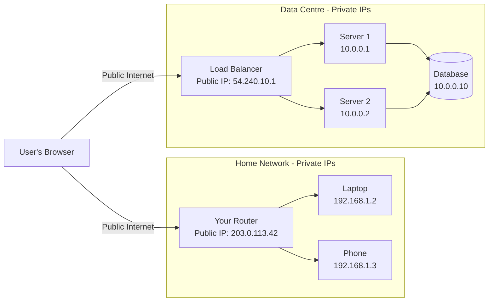

# IP Addresses

## What You'll Learn

By the end of this document you will understand:

- What an IP address is and why every device on a network needs one
- The difference between IPv4 and IPv6 and why both exist today
- The difference between public and private IP addresses
- What static and dynamic IPs are and when each is used
- How IP addresses connect to everything you already know about the client-server model

---

## Why This Exists

### The Problem

In the client-server model, a client needs to find the server. But how?

Imagine you want to send a letter to someone. You need their address — a specific, unique location that the postal system can route to. Without an address, the letter has nowhere to go.

Networks have exactly the same problem. When your browser wants to reach a server, the network needs to know **where** that server is. It needs an address.

This is what an IP address solves.

### The Solution

IP stands for **Internet Protocol**. An IP address is a unique numerical label assigned to every device connected to a network. It is the address the network uses to route data from one machine to another.

Without IP addresses:
- Packets of data would have no destination
- Routers would have no way to forward traffic
- The client-server model would have no way to locate servers

Every request you learned about in the Client-Server Model — the DNS lookup, the TCP handshake, the HTTP request — all of it depends on IP addresses being resolved and routed correctly.

---

## Intuition & Mental Model

### The Street Address Analogy

Think of the internet as a city with millions of buildings.

Every building has a unique street address. When you send a package, the courier looks at the address, finds the right street, finds the right building, and delivers it.

IP addresses work exactly the same way:

| Real World | Networking |
|---|---|
| City | The Internet |
| Building | A device (server, computer, phone) |
| Street address | IP address |
| Courier | Router |
| Package | Data packet |
| Postal system | Internet Protocol |

Just like two buildings cannot share the same address in the same city, two devices on the same network cannot share the same IP address — it would cause a routing collision, and packets would go to the wrong place.

### What an IP Address Looks Like

An IPv4 address looks like this:

```
192.168.1.1
```

Four numbers separated by dots. Each number is between 0 and 255.

That's it. Simple to read, but packed with meaning — it identifies exactly one device on a network.

---

## Core Concepts

### IPv4

IPv4 is the original IP addressing system, introduced in 1983 and still the most widely used today.

An IPv4 address is **32 bits** long, written as four groups of numbers:

```
192.168.0.1
203.0.113.42
8.8.8.8        ← Google's public DNS server
```

Because each group is 8 bits (0–255), IPv4 can theoretically address **~4.3 billion unique devices**.

That sounds like a lot. But with smartphones, laptops, servers, smart TVs, and billions of IoT devices all needing addresses — the world ran out.

This is what pushed the creation of IPv6.

---

### IPv6

IPv6 is the modern addressing system designed to replace IPv4 — though both coexist on the internet today.

An IPv6 address is **128 bits** long, written in eight groups of hexadecimal values:

```
2001:0db8:85a3:0000:0000:8a2e:0370:7334
```

128 bits provides **340 undecillion addresses** — enough for every grain of sand on Earth to have billions of addresses. The shortage problem is solved.

You will see IPv6 more frequently as the internet transitions, but IPv4 remains dominant in most systems you will build early in your career.

The important thing to understand now: **IPv4 and IPv6 are the same idea — a unique address for a device — just different sizes and formats.**

---

### Public vs Private IP Addresses

Not all IP addresses are visible on the internet. This is one of the most important distinctions to understand.

#### Public IP Address

A public IP address is **globally unique and routable on the internet**. Any device on the internet can send a packet to a public IP and it will be routed there correctly.

Examples:
- Your home router's IP address (assigned by your ISP)
- A cloud server's IP address (like an AWS EC2 instance)
- Google's DNS server: `8.8.8.8`

When a client makes a request to `github.com`, it ultimately reaches GitHub's **public IP address**.

#### Private IP Address

A private IP address is **only valid within a local network** — your home, your office, your data centre's internal network. It is not routable on the public internet.

Reserved private IP ranges:

| Range | Common Use |
|---|---|
| `10.0.0.0 – 10.255.255.255` | Large private networks |
| `172.16.0.0 – 172.31.255.255` | Medium private networks |
| `192.168.0.0 – 192.168.255.255` | Home and small office networks |

Your laptop right now likely has an address like `192.168.1.5`. That address means nothing outside your home network. Only your router's public IP is visible to the internet.

**The mental model:**

```
Internet
    ↓
Your Router (Public IP: 203.0.113.42)   ← visible to the world
    ↓
Your Home Network
    ├── Laptop     (Private IP: 192.168.1.2)
    ├── Phone      (Private IP: 192.168.1.3)
    └── Smart TV   (Private IP: 192.168.1.4)
```

The router acts as a gateway. Devices inside share one public IP address to the world, while having their own private addresses internally. This mechanism is called **NAT (Network Address Translation)** — we will not go deep on it here, but now you know it exists.

---

### Static vs Dynamic IP Addresses

#### Static IP

A static IP address is **permanently assigned** to a device. It never changes.

Servers use static IPs. If a server's IP address changed every day, clients would never be able to find it reliably.

Examples of static IPs in production:
- A web server that clients connect to
- A database server that application servers connect to
- A load balancer's entry point

#### Dynamic IP

A dynamic IP address is **temporarily assigned** and can change over time. A protocol called **DHCP** (Dynamic Host Configuration Protocol) automatically assigns dynamic IPs to devices when they join a network.

Your phone, laptop, and home devices use dynamic IPs. Every time your laptop connects to a Wi-Fi network, DHCP assigns it an available IP address from a pool.

| | Static IP | Dynamic IP |
|---|---|---|
| Changes? | Never | Can change |
| Used by | Servers, infrastructure | End-user devices |
| Configured by | Manually or reserved | DHCP automatically |

---

## Visual Architecture

### How IP Addresses Fit Into the Request Lifecycle

From the Client-Server Model, you learned the request lifecycle starts with DNS resolution. Here is where IP addresses live in that flow:



The IP address is the **output of DNS** and the **input to the TCP connection**. It is the bridge between a human-readable name and a routable network location.

---

### Public vs Private in a Production System



Notice that in a production data centre, the servers and databases use **private IPs** and are never directly exposed to the internet. Only the load balancer has a public IP. This is standard security practice.

---

## Production Awareness

### What Engineers Think About with IPs

- **Hardcoding IP addresses is dangerous.** If a server's IP changes, every service that hardcoded that IP breaks. This is why DNS and service discovery exist — you refer to names, not addresses.

- **IP addresses alone don't identify a service.** A server running multiple services uses **ports** to separate them. IP gets you to the machine; the port gets you to the right process. You already saw this in the Client-Server Model.

- **Cloud servers get new IPs on restart.** On AWS and other cloud platforms, a server that is stopped and restarted often gets a new public IP. Engineers use **Elastic IPs** (reserved static IPs) or DNS names to avoid this problem.

- **IPv4 exhaustion is real.** Cloud providers charge for public IPv4 addresses because the supply is genuinely constrained. Engineers are careful about how many public IPs a system uses.

⚠️ We will explore IP routing, NAT, and network-level architecture more deeply in:
- **Proxy vs Reverse Proxy**
- **Load Balancers**
- **DNS**

---

## Tradeoffs

### Static vs Dynamic — The Core Tension

| | Static IP | Dynamic IP |
|---|---|---|
| **Advantage** | Reliable, always findable | Flexible, no manual management |
| **Disadvantage** | Must be managed manually, costs more in cloud | Not suitable for services others need to find |
| **Use when** | Running a server, database, or load balancer | End-user devices, short-lived compute |

### IPv4 vs IPv6 — Where Things Stand Today

| | IPv4 | IPv6 |
|---|---|---|
| **Address space** | ~4.3 billion | 340 undecillion |
| **Format** | Simple, human-readable | Longer, less familiar |
| **Adoption** | Universal | Growing but incomplete |
| **Use today** | Still dominant | Increasingly required |

Most systems you build today will use IPv4, but you will encounter IPv6 — especially in cloud infrastructure and mobile networks.

---

## Common Misconceptions

### Misconception 1 — "My IP address identifies me personally"

**Reality:** Your public IP address identifies your **router**, not you or your device. Everyone in your home shares the same public IP. Your ISP knows which customer account maps to that IP, but the IP itself only identifies the router's connection — not the person or device behind it.

---

### Misconception 2 — "IP addresses are always permanent"

**Reality:** Most IP addresses are dynamic and change regularly. Your phone gets a new private IP every time it joins a network. Cloud servers often get new public IPs on restart. Only deliberately configured static IPs stay constant.

---

### Misconception 3 — "A server needs one IP address"

**Reality:** A single server can have **multiple IP addresses** assigned to it — one per network interface, or multiple virtual IPs for different services. Conversely, many servers can sit behind a **single public IP** using a load balancer.

---

### Misconception 4 — "Private IPs are less real than public IPs"

**Reality:** Private IPs are fully functional within their network. Inside a data centre, servers communicate entirely over private IPs. Private addressing is not a workaround — it is standard, intentional architecture that adds a layer of security by keeping internal infrastructure off the public internet.

---

## Real-World Examples

### Google's `8.8.8.8`

Google operates a public DNS resolver at the IP address `8.8.8.8`. This is a deliberately chosen, permanently reserved static public IP. Millions of devices worldwide send DNS queries to this single address. Google routes all that traffic globally to the nearest available resolver — but the address never changes.

### AWS EC2 Instances

When you launch a server on AWS, it gets a private IP automatically (within AWS's internal network) and optionally a public IP. If you stop and restart the instance, the public IP changes — unless you attach an Elastic IP, which is a reserved static public IP that stays yours until you release it.

### Your Home Network

Right now, every device in your home has a private IP like `192.168.1.x`. Your router has one public IP from your ISP. All traffic from all your devices leaves the router using that single public IP — the router keeps track of which internal device each packet belongs to using NAT.

---

## Interview Perspective

### Beginner Questions

**Q: What is an IP address?**

An IP address is a unique numerical label assigned to every device on a network. It serves as the network-level address that allows routers to forward packets from a source to a destination. Without IP addresses, there would be no way to route data across a network.

**Q: What is the difference between IPv4 and IPv6?**

IPv4 uses 32-bit addresses (about 4.3 billion possible addresses) and is the current standard. IPv6 uses 128-bit addresses and was created to solve IPv4 exhaustion. Both coexist on the internet today. IPv4 looks like `192.168.1.1`; IPv6 looks like `2001:0db8::7334`.

---

### Intermediate Questions

**Q: What is the difference between a public and private IP address?**

A public IP is globally unique and routable on the internet — it is how the outside world reaches a device. A private IP is only valid within a local network and is not directly reachable from the internet. In production, servers use private IPs internally and expose only a load balancer or gateway with a public IP, keeping internal infrastructure off the public internet.

**Q: Why would a server use a static IP?**

Servers need to be reliably reachable. If a server's IP changed, all clients — other services, DNS records, load balancers — would lose the ability to find it. Static IPs guarantee the address stays constant. Dynamic IPs are fine for end-user devices that do not need to be found by others.

---

## Terminology Upgrade

| Weak | Professional |
|---|---|
| "The server's address" | "The server's public IP address" |
| "My computer's IP" | "The device's private IP assigned by DHCP" |
| "The IP changed" | "The dynamic IP lease was reassigned by DHCP" |
| "We gave the server a fixed IP" | "We assigned a static IP to the server to ensure consistent addressability" |
| "The server is hidden" | "The server operates behind a load balancer using a private IP, not exposed to the public internet" |
| "IPv6 is the new version" | "IPv6 is the 128-bit successor to IPv4, designed to address exhaustion of the 32-bit address space" |

---

## Cheat Sheet

| Concept | Key Point |
|---|---|
| IP address | Unique network address for every device |
| IPv4 | 32-bit, `x.x.x.x` format, ~4.3B addresses |
| IPv6 | 128-bit, hex format, virtually unlimited addresses |
| Public IP | Globally routable — visible on the internet |
| Private IP | Local network only — not reachable from internet |
| Static IP | Fixed — never changes — used by servers |
| Dynamic IP | Assigned by DHCP — can change — used by devices |
| Private ranges | `10.x.x.x`, `172.16–31.x.x`, `192.168.x.x` |
| IP in the lifecycle | DNS resolves a name → returns an IP → TCP connects to that IP |
| Servers use private IPs | Only the entry point (load balancer) has a public IP |

---

## What Comes Next

You now know that clients find servers using IP addresses. But there is an obvious problem:

**Nobody types `140.82.121.4` into a browser. They type `github.com`.**

Something has to translate that human-readable name into an IP address. That is exactly what the next topic covers.

→ **DNS — Domain Name System** — how names resolve to IP addresses, what happens when DNS is slow or wrong, and why it is one of the most critical pieces of internet infrastructure

After DNS, the natural next step is understanding the rules that govern how the request actually travels — the protocol layer:

→ **HTTP & HTTPS** — the structure of requests and responses, and how encryption works

Every topic from here builds on one simple foundation: a client needs an IP address to reach a server. Everything else is about making that process fast, reliable, and secure.

---

*Part of the [System Design Mastery](../../../README.md) repository — 02 Networking / 01 IP Addresses*