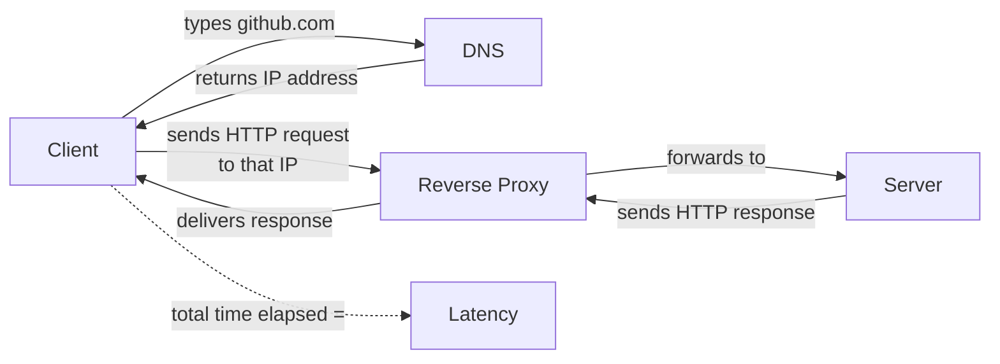
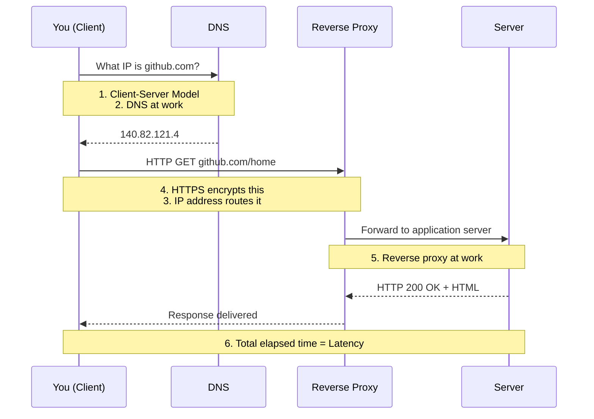
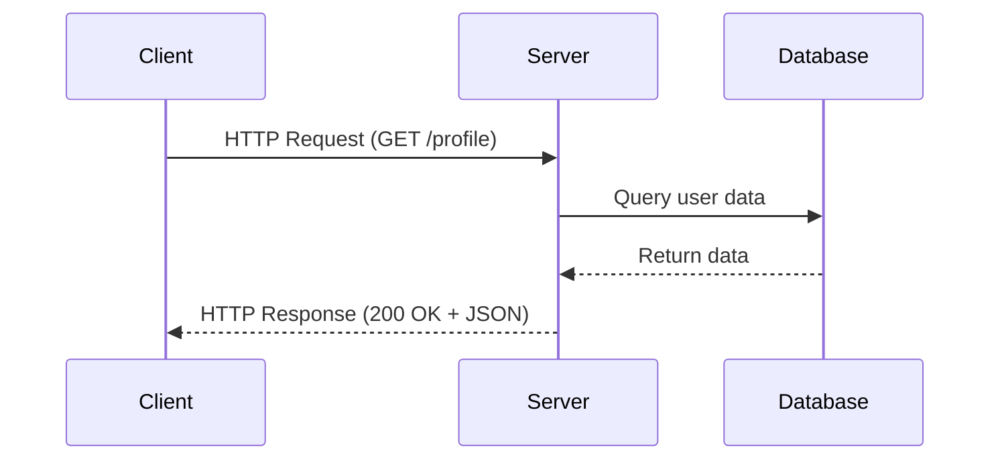
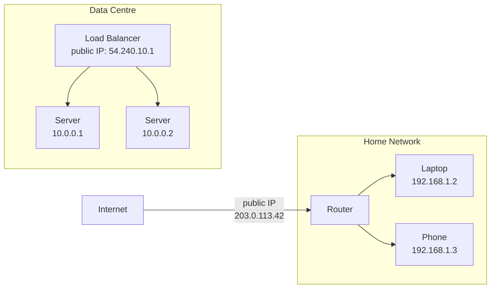
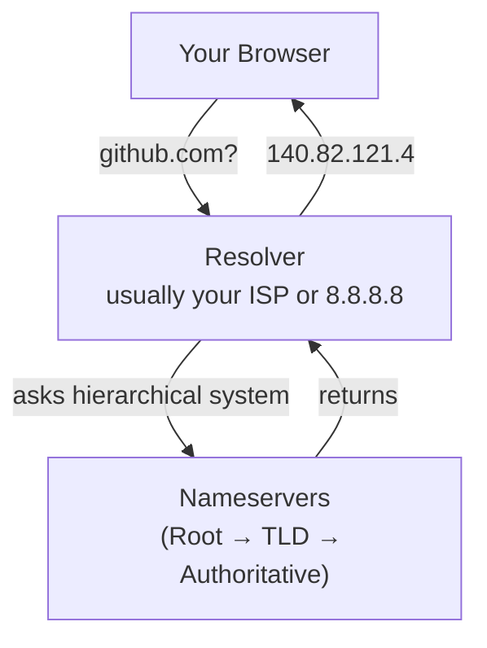
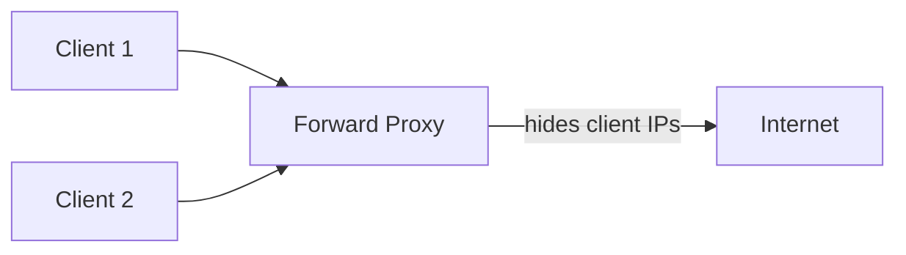
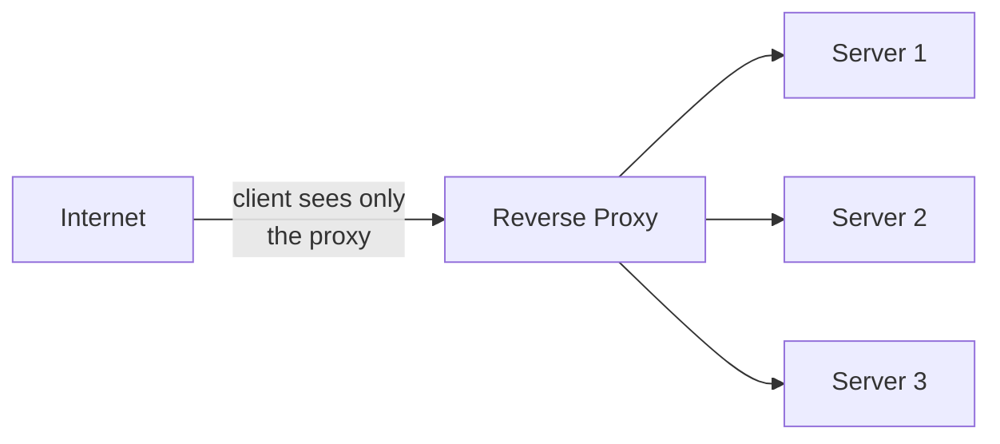

# Networking Foundations

> Group 1 of 6 — Top 30 Must-Know System Design Concepts

---

## What You'll Learn

Every system you will ever design runs on a network. Before databases, before scaling, before microservices — there is a wire, a protocol, and two machines trying to talk to each other.

This document covers the six networking concepts that every other system design topic assumes you already know:

- How responsibility is divided between the machine that asks and the machine that answers
- How machines find each other across billions of devices
- How requests are structured and routed
- What sits between a client and a server in production
- Why speed of communication is a design constraint, not just a nice-to-have

By the end, these six concepts will feel like one connected picture — not six separate things to memorise.

---

## The Big Picture First

Before the details, here is how these six concepts form a chain:



Every web request follows this exact path. Each box is one of the six concepts in this document. None of them exist in isolation — they are a chain, and understanding how they connect is more valuable than memorising each one individually.

---

## How All Six Connect

Here is the complete flow of a single browser request, mapped to all six concepts:



Nothing in this diagram is separate. The **client-server model** defines who asks and who answers. The **IP address** is how the request is routed to the right machine. **DNS** is how the IP is discovered from a human name. **HTTP/HTTPS** is the language the request and response are written in. The **reverse proxy** is the first thing the request actually hits before the application server. **Latency** is the measure of how long the entire chain takes.

---

## 1. Client–Server Model

### The Problem It Solved

In the early days of networked computing, there were no rules about how machines should communicate. Any machine could reach out to any other machine in any format it wanted. The result was chaos — no standard way to share data, no separation of who does what, no way to scale anything independently.

Engineers needed one foundational answer:

> How should two machines on a network divide responsibility?

### The Model

The client-server model answered this by assigning two clear, asymmetric roles:

- The **client** initiates — it asks for something
- The **server** listens and responds — it owns the logic, the data, and the processing

This asymmetry is the key insight. The client does not need to know how the server works internally. The server does not need to know anything about the client's device or setup. They communicate through a defined contract — a request and a response.

💡 **Key Insight**

The asymmetry is the entire point.

The client doesn't know how the server works. The server doesn't know about the client's device. This separation enables scaling, security, and independent development.

### The Restaurant Analogy

Think of a restaurant. You are the customer — you look at the menu, place an order, and wait. You never walk into the kitchen. You never touch the ingredients. The kitchen (the server) receives your order, prepares the food using its own internal process, and delivers the result back to you.

| Restaurant | System Design |
|---|---|
| Customer | Client |
| Menu | API contract |
| Waiter | Network / protocol |
| Order | Request |
| Kitchen | Server |
| Meal delivered | Response |

### What "Client" and "Server" Actually Mean

This is where most beginners get confused.

A **server is not a machine**. It is a role. Any process that listens for requests and sends back responses is a server — whether it runs on a physical rack, a cloud instance, a container, or a laptop. The same machine can run five servers at once on different ports.

A **client is not a browser**. It is any process that initiates a request. A mobile app is a client. A microservice calling another microservice is a client. A script running a cron job that hits an API is a client.

In a microservices architecture, every service is simultaneously a server to the services above it and a client to the services below it.

### How a Request Flows



The client sees none of what happens inside the server. It sends a request and receives a response. That separation of concerns is the entire point.

### What Can Break (Preview)

Understanding what breaks now will help you appreciate every solution later:

- **Server overload** — too many clients requesting at once causes queuing and slow responses
- **Network failure** — if the path between client and server breaks, communication stops
- **Single point of failure** — one server going down means all clients lose access

These problems drive every major system design decision that comes later: load balancers, redundancy, caching, and scaling.

⚠️ **We will explore how to prevent and handle these in future chapters:**
- Scaling & Load Balancers
- Reliability & Redundancy
- Distributed Systems

### Quick Recap: Client-Server Model

- Clients request. Servers respond.
- Role, not hardware. A machine can run many servers.
- The separation of concerns is the power.

---

**This raises a natural question:**

If every device has a role, how does a client find a server across billions of devices?

You can't just type `"140.82.121.4"` into a browser. You type `"github.com"`.

Something must translate names into machine addresses.

→ **Next: IP Addresses**

---

## 2. IP Address — How Machines Find Each Other

### The Problem It Solved

Once you have clients and servers, there is an immediate question: how does a client know where to find a server? On a network with billions of devices, every device needs a unique, routable address — otherwise there is no way to direct traffic to the right destination.

### What an IP Address Is

An IP address is a unique numerical label assigned to every device on a network. It is what routers use to forward packets from a source to a destination.

Think of it like a postal address. The internet is a city. Every device is a building. An IP address is the building's street address. Without it, no data can be delivered.

💡 **Key Insight**

Humans remember names. Machines route addresses. DNS bridges the gap.

### IPv4 — The Standard (For Now)

**IPv4** is the dominant protocol today:

```
140.82.121.4       ← GitHub's IP
8.8.8.8            ← Google's DNS server
192.168.1.1        ← A typical home router
```

Four numbers (0–255), separated by dots. 32 bits total — about 4.3 billion possible addresses.

That sounds like a lot until you account for every phone, laptop, server, smart TV, and IoT device on earth. IPv4 addresses are nearly exhausted.

**IPv6** was created as the long-term solution (128 bits, virtually unlimited addresses), but adoption is still slow. For most early system design work, understand IPv4 — IPv6 is the future that's still arriving.

### Public vs Private IPs

Not all IP addresses are visible on the internet.

A **public IP** is globally routable. Any device on the internet can try to send traffic to it. Your cloud server, your home router, and Google's DNS all have public IPs.

A **private IP** only works within a local network. Your laptop right now has a private IP like `192.168.1.5`. That address means nothing outside your home network — routers actively block it.



In production, servers live on private IPs inside a data centre. Only the entry point — a load balancer or gateway — has a public IP. This keeps internal infrastructure off the public internet for both security and operational reasons.

### Static vs Dynamic IPs

A **static IP** never changes. Servers use static IPs — if a server's address changed suddenly, nothing could find it.

A **dynamic IP** is assigned temporarily and can change. Your home devices use dynamic IPs, assigned automatically by DHCP (a protocol we won't detail here) when they join a network.

You don't need to understand the cloud-specific details yet (elastic IPs, reserved addresses, etc.). Just understand: servers need permanent addresses, clients can use temporary ones.

### Quick Recap: IP Address

- IP = unique address for every device
- Public IPs route on the internet
- Private IPs only work within a network
- Servers use static IPs; clients use dynamic IPs

---

**But here's the catch:**

Humans don't remember IP addresses. Nobody types `140.82.121.4`. We remember names: `github.com`, `google.com`, `example.com`.

Something must translate those names into addresses.

→ **Next: DNS**

---

## 3. DNS — Domain Name System

### The Problem It Solved

IP addresses solve the routing problem. But nobody types `140.82.121.4` into a browser. Humans need names. Machines need numbers. Something has to translate between them reliably, at internet scale, in milliseconds.

### What DNS Is

DNS stands for Domain Name System. It is the distributed system that translates human-readable domain names into IP addresses.

When you type `github.com`:

```
Your browser asks: what is the IP address for github.com?
DNS answers:       140.82.121.4
Your browser uses: 140.82.121.4 to open a connection
```

This lookup happens before any request reaches the server. It is invisible, takes under 50ms in most cases, and happens billions of times per second across the internet.

The analogy is a phone book — you search by name, it gives you the number.

💡 **Key Insight**

DNS is the phone book of the internet.

But unlike a phone book, it's:
- Distributed (no single point of failure)
- Cached (results remembered at every step)
- Programmable (engineers can redirect traffic by changing DNS)

This is why DNS is powerful for system design.

### How DNS Resolution Works (Conceptually)

DNS is not a single server. It is a system of servers working together in a hierarchy:



In practice, results are **cached** at multiple levels:
- Your browser caches DNS results
- Your operating system caches them
- The resolver caches them
- ISP caches them

This means most lookups skip most of these steps and return in single-digit milliseconds.

**You don't need to understand the full nameserver hierarchy yet.** Just know: you ask for a name, DNS gives back an IP. The distributed system handles the complexity behind the scenes.

⚠️ **Deeper dive into DNS internals comes in the dedicated DNS chapter.**

### Why DNS Matters for System Design

DNS failures are invisible to most users but catastrophic to systems. If DNS goes down, even healthy servers become unreachable — clients cannot get the IP address to connect to.

DNS is also where engineers control traffic routing at a global level. By changing what IP a domain resolves to, engineers can redirect millions of users to a different data centre, a backup region, or a CDN — without changing anything in the application.

This is why understanding DNS is essential before studying load balancers, failover, and multi-region architecture.

### Quick Recap: DNS

- Translates domain names (github.com) to IP addresses (140.82.121.4)
- Works through a distributed hierarchy of nameservers
- Results are cached at multiple levels
- Critical for availability — DNS failure = total outage

---

**Now we know how clients find servers. But what language do they speak?**

When a client reaches a server's IP address, how does it structure a request? How does the server know what the client wants? How are responses formatted?

There must be a shared protocol.

→ **Next: HTTP & HTTPS**

---

## 4. HTTP & HTTPS — The Language of the Web

### The Problem They Solved

Clients and servers needed a shared language — a standardised format for requests and responses that every browser, every server, and every programming language could implement and understand.

Without a shared protocol, every application would invent its own format. Nothing would interoperate.

### What HTTP Is

HTTP (HyperText Transfer Protocol) is the protocol that defines how clients and servers structure and exchange messages on the web. It is the language of the internet.

Every time your browser loads a page, it is sending HTTP requests and receiving HTTP responses.

**An HTTP request has four parts:**

```
GET /home HTTP/1.1
Host: github.com
Authorization: Bearer abc123

(empty body for GET requests)
```

| Part | What it carries |
|---|---|
| **Method** | The action being requested — GET (read), POST (create), PUT (update), DELETE (remove) |
| **URL** | The specific resource being targeted |
| **Headers** | Metadata — authentication, content type, encoding |
| **Body** | Optional data payload — used for POST and PUT |

**An HTTP response has three parts:**

```
HTTP/1.1 200 OK
Content-Type: application/json

{"user": "muhammed", "plan": "pro"}
```

| Part | What it carries |
|---|---|
| **Status code** | The outcome — 200 (success), 404 (not found), 500 (error) |
| **Headers** | Metadata — content type, caching rules, encoding |
| **Body** | The actual returned data — HTML, JSON, binary, etc. |

### Common Status Codes

| Code | Meaning | When it happens |
|---|---|---|
| 200 | OK | Request succeeded |
| 301 | Moved Permanently | Resource moved to new location |
| 400 | Bad Request | Client sent invalid data |
| 401 | Unauthorized | Authentication required |
| 404 | Not Found | Resource doesn't exist |
| 500 | Server Error | Something broke server-side |

There are many more status codes, but these cover 95% of what you'll encounter. You don't need to memorise them — just develop intuition: 2xx = success, 4xx = client error, 5xx = server error.

### HTTPS — HTTP with Encryption

HTTPS is HTTP wrapped in a TLS (Transport Layer Security) encryption layer. Every message is encrypted before it leaves the client and decrypted only when it reaches the server.

Without HTTPS:
- Anyone on the network path (router, ISP, bad actor on the same Wi-Fi) can read passwords, personal data, payment info
- Messages can be tampered with undetectably

With HTTPS:
- Data is encrypted end-to-end
- The server's identity is verified
- Tampering is detectable

All modern websites use HTTPS. Browsers show a lock icon for HTTPS and warn users about HTTP-only sites. For any system handling user data, HTTPS is non-negotiable.

You don't need to understand TLS internals yet. Just understand: HTTPS = encrypted HTTP. It's essential for security.

⚠️ **Deep dive into TLS encryption comes in the Security chapter.**

### Quick Recap: HTTP & HTTPS

- HTTP = request-response protocol
- Requests contain: method, URL, headers, body
- Responses contain: status code, headers, body
- HTTPS = HTTP + encryption (required for security)

---

**Now requests can travel from client to server. But in production systems, something sits between them.**

The reverse proxy.

→ **Next: Proxies & Reverse Proxies**

---

## 5. Proxy vs Reverse Proxy

### The Problem They Solved

As systems grew, engineers needed intermediary layers — servers that sit between clients and servers to add capabilities neither side should own directly: security, caching, traffic control, anonymity, and routing.

Two patterns emerged, depending on which side the intermediary serves.

### Forward Proxy — On the Client Side

A **forward proxy** sits in front of clients. It intercepts outbound requests from clients and forwards them to the internet on the clients' behalf.



The server on the internet sees the proxy's IP — not the original client's.

**Real-world example:**

You connect to an airport Wi-Fi. The airport runs a forward proxy that:
- Scans for malware
- Blocks certain sites
- Logs which clients connected
- Throttles bandwidth per user

From your perspective, you're making requests normally. The proxy is transparent — but it's observing everything. This is why some workplaces use forward proxies for monitoring and security.

### Reverse Proxy — On the Server Side

A **reverse proxy** sits in front of servers. It intercepts incoming requests from clients and forwards them to internal servers on the servers' behalf.



The client sees only the reverse proxy's IP — never the internal servers' IPs.

**Common uses:**

- **Load balancing** — distributing requests across multiple servers to prevent overload
- **SSL termination** — handling HTTPS encryption so application servers don't have to
- **Caching** — serving cached responses without touching the application server
- **Security** — hiding internal infrastructure from the public internet

**Real-world examples:**

**Nginx**, **HAProxy**, and **Cloudflare** are all reverse proxies used in production at massive scale. Every major website uses a reverse proxy.

### The Key Distinction

| | Forward Proxy | Reverse Proxy |
|---|---|---|
| Sits in front of | Clients | Servers |
| Hides | Client identity | Server identity |
| Serves | Clients | Servers |
| Common use | Filtering, privacy | Load balancing, security, caching |

**Important:** When engineers say "proxy" without qualification in a system design conversation, they almost always mean a **reverse proxy**. It's far more common in production infrastructure.

### Quick Recap: Proxy vs Reverse Proxy

- Forward proxy: in front of clients, hides client identity
- Reverse proxy: in front of servers, hides server identity
- Reverse proxies are far more common in production
- Usually used for load balancing and security

---

**Now requests flow through the whole system. But how fast do they flow?**

How long does each step take? What's a good response time? What causes slowness?

→ **Next: Latency**

---

## 6. Latency — Why Speed Matters

### The Problem It Names

Every request takes time. Time to travel across a network. Time for the server to process. Time for the response to travel back. This total elapsed time — from the moment a client sends a request to the moment it receives the response — is **latency**.

Latency is not a bug. It is a physical property of networked systems. But how much latency exists, and where it comes from, is something engineers can measure, analyse, and reduce.

💡 **Key Insight**

Latency isn't a bug. It's a physical constraint.

Light travels ~300,000 km/second.

A request from New York to London is ~5,500 km = ~18ms minimum,
just for the speed of light. There's no way around it.

Good system design accepts this and works within it.

### Where Latency Comes From

Latency has multiple components:

| Source | What it is |
|---|---|
| **Network latency** | Time for data to physically travel between client and server — limited by the speed of light and distance |
| **Processing latency** | Time the server spends computing a response — database queries, business logic |
| **Queue latency** | Time a request waits before processing begins — caused by the server being busy |
| **Transmission latency** | Time to push data onto the network — affected by packet size and bandwidth |

In most web applications, **network latency** and **database query time** dominate.

### How Engineers Measure Latency

Average latency is almost useless as a metric.

**Scenario:** 99% of requests complete in 20ms, but 1% take 10 seconds.

Average = 110ms. Looks acceptable. But 1% of requests are degraded — thousands per minute.

Engineers use **percentile latency**:

- **P50** — the median. Half of requests are faster, half slower.
- **P95** — 95% of requests complete within this time.
- **P99** — 99% of requests complete within this time. The slowest users.

**Why P99 matters:** It shows the experience of your slowest users — the ones most likely to churn. Optimising average latency while ignoring P99 means ignoring the users most likely to leave.

You don't need to master percentile metrics yet. Just understand: we care about worst-case experience, not just average.

⚠️ **Deeper dive into latency metrics and monitoring comes in the Performance Engineering chapter.**

### Latency in System Design Decisions

Latency is the reason engineers make specific architectural choices:

- **Caching** reduces latency by serving data from memory instead of querying a database
- **CDNs** reduce latency by serving static content from a server geographically close to the user
- **Connection pooling** reduces latency by reusing established database connections
- **Load balancers** reduce latency by routing requests to available capacity

Every major performance optimisation in system design is ultimately about reducing one or more components of latency.

### A Latency Reference

These are rough orders of magnitude to build intuition:

| Operation | Latency |
|---|---|
| RAM access | ~100 nanoseconds |
| SSD read | ~100 microseconds |
| Network round trip (same data centre) | ~1 millisecond |
| Network round trip (cross-continent) | ~100 milliseconds |

**The key insight:** In-memory access is ~1,000,000x faster than network access. This is why caching is so powerful — it replaces slow network/disk operations with fast memory operations.

### Quick Recap: Latency

- Latency = total time from request to response
- Network + processing + queue latency all contribute
- P99 (worst case) matters more than average
- In-memory is vastly faster than network — why caching works

---

## Complete Request Flow

Now let's see how all six concepts work together in a single request:

```
1. You type github.com into your browser (Client initiates)

2. Browser asks DNS: "What IP is github.com?"
   DNS answers: 140.82.121.4
   
3. Browser opens connection to 140.82.121.4 using IP address routing
   
4. Browser sends HTTP GET request encrypted with HTTPS
   
5. Request hits a reverse proxy (load balancer)
   Proxy forwards to one of many backend servers
   
6. Server processes the request, queries database, builds response
   
7. Response travels back through proxy to browser
   
8. Browser renders the HTML
   
Total time = Latency (usually 100ms–500ms)
```

Everything depends on everything else. Client-server architecture requires IP addressing. IP addressing requires DNS. HTTP structures the messages. The reverse proxy distributes load. Latency measures it all.

---

## Cheat Sheet

| Concept | What it is | Why it matters |
|---|---|---|
| **Client–Server Model** | Client requests, server responds | The foundational pattern of every networked system |
| **IP Address** | Unique numerical address for every device | How routers know where to send data |
| **DNS** | Translates domain names to IP addresses | What makes human-readable URLs work |
| **Forward Proxy** | Sits in front of clients | Hides client identity, filters outbound traffic |
| **Reverse Proxy** | Sits in front of servers | Load balancing, security, caching for servers |
| **Latency** | Time from request to response | The key performance metric for user experience |
| **HTTP** | Protocol defining request/response structure | The universal language of web communication |
| **HTTPS** | HTTP with TLS encryption | Protects data in transit — required for security |

---

## What Comes Next

These six concepts are the wire-level foundation. Every topic from here assumes you understand them deeply.

The natural next questions are:

- **"How do services talk to each other?"** → Group 2: APIs & Communication (REST, GraphQL, WebSockets)
- **"How do we handle failures?"** → Group 3: Reliability & Fault Tolerance
- **"How do we scale systems?"** → Group 4: Scaling & Load Balancers
- **"How do we secure systems?"** → Group 5: Security & Encryption
- **"How do we measure performance?"** → Group 6: Performance & Observability

Each group builds directly on the foundation you've just built. The client-server model is the frame — everything else fits inside it.

---

*Part of the [System Design Mastery](../../../../README.md) repository — 01 Introduction / 02 Top 30 Concepts / Group 1: Networking Foundations*