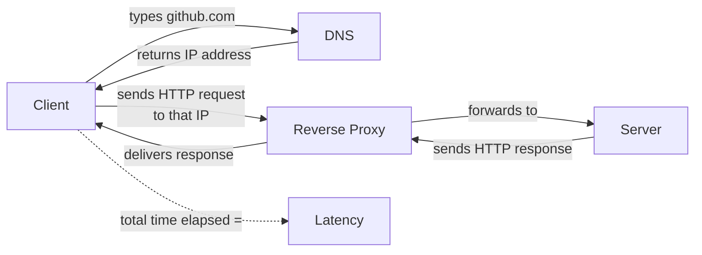
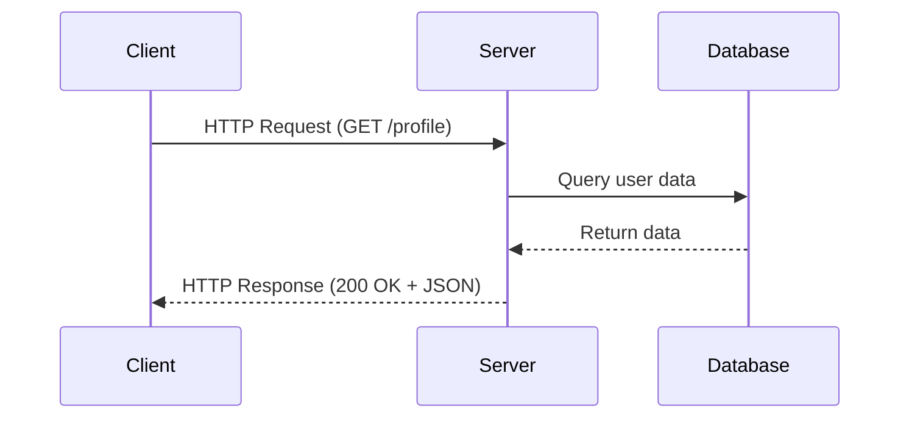
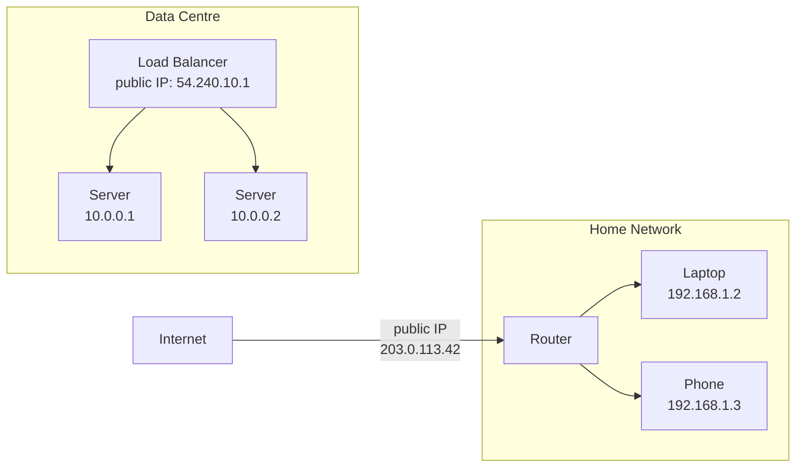
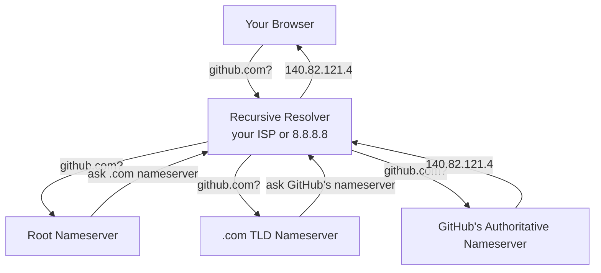
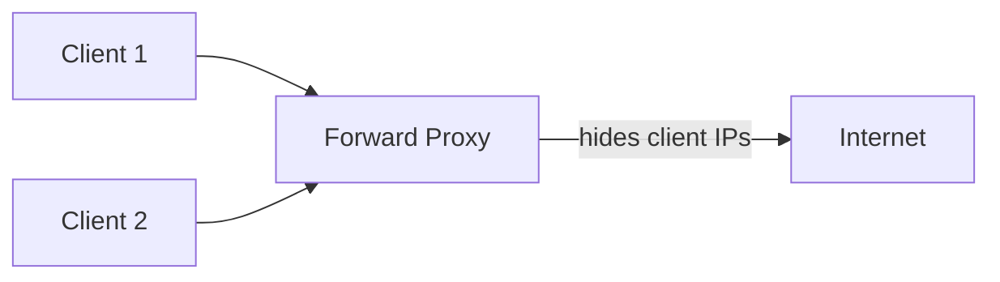
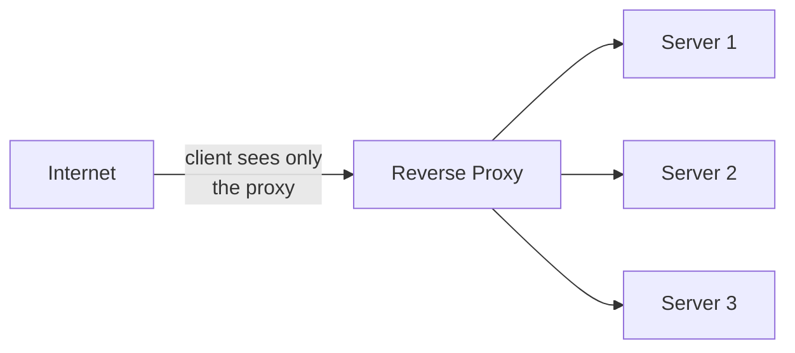
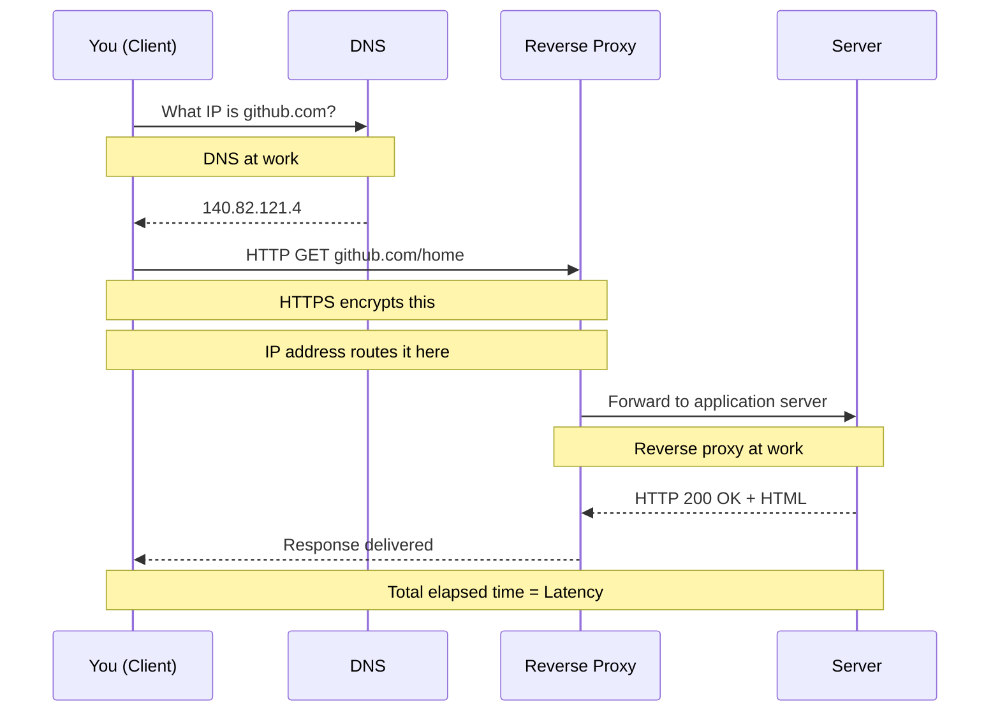

# Networking Foundations

> Group 1 of 6 — Top 30 Must-Know System Design Concepts

---

## What You'll Learn

Every system you will ever design runs on a network. Before databases, before scaling, before microservices — there is a wire, a protocol, and two machines trying to talk to each other.

This document covers the six networking concepts that every other system design topic assumes you already know:

- How responsibility is divided between the machine that asks and the machine that answers
- How machines find each other across billions of devices
- How requests are structured and routed
- What sits between a client and a server in production
- Why speed of communication is a design constraint, not just a nice-to-have

By the end, these six concepts will feel like one connected picture — not six separate things to memorise.

---

## The Big Picture First

Before the details, here is how these six concepts form a chain:



Every web request follows this exact path. Each box is one of the six concepts in this document. None of them exist in isolation — they are a chain, and understanding how they connect is more valuable than memorising each one individually.

---

## 1. Client–Server Model

### The Problem It Solved

In the early days of networked computing, there were no rules about how machines should communicate. Any machine could reach out to any other machine in any format it wanted. The result was chaos — no standard way to share data, no separation of who does what, no way to scale anything independently.

Engineers needed one foundational answer to the question:

> How should two machines on a network divide responsibility?

### The Model

The client-server model answered this by assigning two clear, asymmetric roles:

- The **client** initiates — it asks for something
- The **server** listens and responds — it owns the logic, the data, and the processing

This asymmetry is the key insight. The client does not need to know how the server works internally. The server does not need to know anything about the client's device or setup. They communicate through a defined contract — a request and a response.

### The Restaurant Analogy

Think of a restaurant. You are the customer — you look at the menu, place an order, and wait. You never walk into the kitchen. You never touch the ingredients. The kitchen (the server) receives your order, prepares the food using its own internal process, and delivers the result back to you.

| Restaurant | System Design |
|---|---|
| Customer | Client |
| Menu | API contract |
| Waiter | Network / protocol |
| Order | Request |
| Kitchen | Server |
| Meal delivered | Response |

### What "Client" and "Server" Actually Mean

This is where most beginners get it wrong.

A **server is not a machine**. It is a role. Any process that listens for requests and sends back responses is a server — whether it runs on a physical rack, a cloud instance, a container, or a laptop. The same machine can run five servers at once on different ports.

A **client is not a browser**. It is any process that initiates a request. A mobile app is a client. A microservice calling another microservice is a client. A script running a cron job that hits an API is a client.

In a microservices architecture, every service is simultaneously a server to the services above it and a client to the services below it.

### How a Request Flows



The client sees none of what happens inside the server. It sends a request and receives a response. That separation of concerns is the entire point.

### What Breaks

- **Server overload** — too many clients requesting at once causes queuing and slow responses
- **Network failure** — if the path between client and server breaks, communication stops
- **Single point of failure** — one server going down means all clients lose access

These problems drive every major system design decision that comes later: load balancers, redundancy, caching, and scaling.

---

## 2. IP Address

### The Problem It Solved

Once you have clients and servers, there is an immediate question: how does a client know where to find a server? On a network with billions of devices, every device needs a unique, routable address — otherwise there is no way to direct traffic to the right destination.

### What an IP Address Is

An IP address is a unique numerical label assigned to every device on a network. It is what routers use to forward packets from a source to a destination.

Think of it like a postal address. The internet is a city. Every device is a building. An IP address is the building's street address. Without it, no data can be delivered.

**IPv4** is the original standard, still dominant today:

```
140.82.121.4       ← GitHub's IP
8.8.8.8            ← Google's DNS server
192.168.1.1        ← A typical home router
```

Four numbers, each between 0 and 255, separated by dots. 32 bits total — giving about 4.3 billion possible addresses. That sounds like a lot until you account for every phone, laptop, server, smart TV, and IoT device on earth. IPv4 addresses ran out.

**IPv6** was created to solve this. It uses 128 bits, giving a virtually unlimited address space:

```
2001:0db8:85a3:0000:0000:8a2e:0370:7334
```

Both coexist on the internet today. Most systems you build early in your career will use IPv4.

### Public vs Private IPs

Not all IP addresses are visible on the internet.

A **public IP** is globally unique and routable — any device on the internet can send traffic to it. Your cloud server, your home router, and Google's DNS all have public IPs.

A **private IP** only works within a local network. Your laptop right now has a private IP like `192.168.1.5`. That address means nothing outside your home network.



In production, servers live on private IPs inside a data centre. Only the entry point — a load balancer or gateway — has a public IP. This keeps internal infrastructure off the public internet, which is both a security and an organisational practice.

### Static vs Dynamic

A **static IP** never changes. Servers use static IPs — if a server's address changed, nothing could find it reliably.

A **dynamic IP** is assigned temporarily and can change. Your home devices use dynamic IPs, assigned automatically by a protocol called DHCP when they join a network. Cloud servers also get dynamic public IPs by default — which is why engineers use reserved static IPs (like AWS Elastic IPs) for anything that needs to be consistently reachable.

---

## 3. DNS — Domain Name System

### The Problem It Solved

IP addresses solve the routing problem. But nobody types `140.82.121.4` into a browser. Humans need names. Machines need numbers. Something has to translate between them reliably, at internet scale, in milliseconds.

### What DNS Is

DNS stands for Domain Name System. It is the distributed system that translates human-readable domain names into IP addresses.

When you type `github.com`:

```
Your browser asks: what is the IP address for github.com?
DNS answers:       140.82.121.4
Your browser uses: 140.82.121.4 to open a TCP connection
```

This lookup happens before any request reaches the server. It is invisible, takes under 50ms in most cases, and happens billions of times per second across the internet.

The analogy is a phone book — you search by name, it gives you the number.

### How DNS Resolution Works

DNS is not a single server. It is a hierarchy of servers that work together:



In practice, results are **cached** at multiple levels. Your browser caches DNS results. Your operating system caches them. The recursive resolver caches them. This means most lookups skip most of these steps and return in single-digit milliseconds.

### Why DNS Matters for System Design

DNS failures are invisible to most users but catastrophic to systems. If DNS goes down, even healthy servers become unreachable — clients cannot get the IP address to connect to.

DNS is also where engineers control traffic routing at a global level. By changing what IP a domain resolves to, engineers can redirect millions of users to a different data centre, a backup region, or a CDN — without changing anything in the application.

This is why understanding DNS is essential before studying load balancers, failover, and multi-region architecture.

---

## 4. Proxy vs Reverse Proxy

### The Problem They Solved

As systems grew, engineers needed intermediary layers — servers that sit between clients and servers to add capabilities neither side should own directly: security, caching, traffic control, anonymity, and routing.

Two patterns emerged, depending on which side the intermediary serves.

### Forward Proxy — On the Client Side

A **forward proxy** sits in front of clients. It intercepts outbound requests from clients and forwards them to the internet on the clients' behalf.



The server on the internet sees the proxy's IP — not the original client's. Common uses:

- Corporate networks routing all employee traffic through a proxy for monitoring and filtering
- Privacy tools that hide a user's real IP
- Caching frequently accessed content so multiple clients benefit from one fetch

### Reverse Proxy — On the Server Side

A **reverse proxy** sits in front of servers. It intercepts incoming requests from clients and forwards them to internal servers on the servers' behalf.



The client sees only the reverse proxy's IP — never the internal servers. Common uses:

- **Load balancing** — distributing requests across multiple servers
- **SSL termination** — handling HTTPS encryption so application servers do not have to
- **Caching** — serving cached responses without touching the application server
- **Security** — hiding internal infrastructure from the public internet

**Nginx**, **HAProxy**, and **Cloudflare** are all reverse proxies used in production at massive scale.

### The Key Distinction

| | Forward Proxy | Reverse Proxy |
|---|---|---|
| Sits in front of | Clients | Servers |
| Hides | Client identity from servers | Server identity from clients |
| Serves | Clients | Servers |
| Common use | Corporate filtering, privacy | Load balancing, security, caching |

When engineers say "proxy" in a system design conversation without qualification, they almost always mean a **reverse proxy**. It is the far more common pattern in production infrastructure.

---

## 5. Latency

### The Problem It Names

Every request takes time. Time to travel across a network. Time for the server to process. Time for the response to travel back. This total elapsed time — from the moment a client sends a request to the moment it receives the response — is **latency**.

Latency is not a bug. It is a physical property of networked systems. But how much latency exists, and where it comes from, is something engineers can measure, analyse, and reduce.

### Where Latency Comes From

Latency has multiple components:

| Source | What it is |
|---|---|
| **Network latency** | Time for data to physically travel between client and server — limited by the speed of light and the distance between them |
| **Processing latency** | Time the server spends computing a response — database queries, business logic, external calls |
| **Queue latency** | Time a request spends waiting before any processing begins — caused by the server being busy with other requests |
| **Transmission latency** | Time to push the data onto the network — affected by packet size and bandwidth |

In most web applications, **network latency** and **database query time** dominate.

### How Engineers Measure Latency

Average latency is almost useless as a metric. If 99% of requests complete in 20ms but 1% take 10 seconds, the average looks fine while thousands of users per minute are experiencing severe degradation.

Engineers use **percentile latency**:

- **P50** — the median response time. Half of requests are faster, half are slower.
- **P95** — 95% of requests complete within this time. Shows near-worst-case.
- **P99** — 99% of requests complete within this time. Shows tail latency — the experience of your slowest users.

> **P99 is the number that matters most for user experience.** Optimising average latency while ignoring P99 means you are ignoring the users most likely to churn.

### Latency in System Design Decisions

Latency is the reason engineers make specific architectural choices:

- **Caching** reduces latency by serving data from memory instead of querying a database
- **CDNs** reduce latency by serving static content from a server geographically close to the user
- **Connection pooling** reduces latency by reusing established database connections rather than opening new ones for every request
- **Load balancers** reduce latency by routing requests to servers with available capacity rather than overloaded ones

Every major performance optimisation in system design is ultimately about reducing one or more components of latency.

### A Latency Reference

These are rough numbers to build intuition:

| Operation | Approximate Latency |
|---|---|
| L1 cache reference | ~1 nanosecond |
| RAM access | ~100 nanoseconds |
| SSD read | ~100 microseconds |
| Network round trip (same data centre) | ~1 millisecond |
| Network round trip (cross-continent) | ~100 milliseconds |
| HDD seek | ~10 milliseconds |

The gap between in-memory access and network access is enormous. This is why caching works — it replaces a slow network or disk operation with a fast memory operation.

---

## 6. HTTP & HTTPS

### The Problem They Solved

Clients and servers needed a shared language — a standardised format for requests and responses that every browser, every server, and every programming language could implement and understand.

Without a shared protocol, every application would invent its own format. Nothing would interoperate.

### What HTTP Is

HTTP (HyperText Transfer Protocol) is the protocol that defines how clients and servers structure and exchange messages on the web. It is the language of the internet.

Every time your browser loads a page, it is sending HTTP requests and receiving HTTP responses.

**An HTTP request has four parts:**

```
GET /home HTTP/1.1
Host: github.com
Authorization: Bearer abc123

(empty body for GET requests)
```

| Part | What it carries |
|---|---|
| **Method** | The action being requested — GET (read), POST (create), PUT (update), DELETE (remove) |
| **URL** | The specific resource being targeted |
| **Headers** | Metadata — who is asking, what format they expect, authentication tokens |
| **Body** | Optional data payload — used for POST and PUT requests |

**An HTTP response has three parts:**

```
HTTP/1.1 200 OK
Content-Type: application/json

{"user": "muhammed", "plan": "pro"}
```

| Part | What it carries |
|---|---|
| **Status code** | The outcome — 200 (success), 404 (not found), 500 (server error) |
| **Headers** | Metadata — content type, caching rules, encoding |
| **Body** | The actual returned data — HTML, JSON, binary, etc. |

### Common Status Codes

| Code | Meaning |
|---|---|
| 200 | OK — success |
| 201 | Created — resource was created |
| 301 | Moved Permanently — redirect |
| 400 | Bad Request — client sent invalid data |
| 401 | Unauthorised — authentication required |
| 403 | Forbidden — authenticated but not allowed |
| 404 | Not Found — resource does not exist |
| 429 | Too Many Requests — rate limited |
| 500 | Internal Server Error — server-side failure |
| 503 | Service Unavailable — server overloaded or down |

### HTTPS — HTTP with Encryption

HTTPS is HTTP with a TLS (Transport Layer Security) layer added. Every message is encrypted before it leaves the client and decrypted only when it reaches the server.

Without HTTPS, anyone on the network path between client and server — a router, an ISP, a bad actor on the same Wi-Fi — can read the raw HTTP messages, including passwords and personal data.

With HTTPS:
- Data is encrypted end-to-end
- The server's identity is verified via a certificate
- Tampering with messages in transit is detectable

All modern websites use HTTPS. Browsers show a lock icon for HTTPS sites and actively warn users about HTTP-only sites. For any system that handles user data, HTTPS is non-negotiable.

### HTTP Versions

| Version | Key Characteristic |
|---|---|
| HTTP/1.1 | One request per connection at a time — still widely used |
| HTTP/2 | Multiple requests over one connection simultaneously — faster |
| HTTP/3 | Built on UDP instead of TCP — lower latency, especially on mobile |

For most early system design discussions, HTTP/1.1 and HTTP/2 are what you need to understand. The version affects performance but not the fundamental request-response model.

---

## How All Six Connect

Here is the complete flow of a single browser request, mapped to all six concepts:



Nothing in this diagram is separate. The **client-server model** defines who asks and who answers. The **IP address** is how the request is routed to the right machine. **DNS** is how the IP is discovered from a human name. **HTTP/HTTPS** is the language the request and response are written in. The **reverse proxy** is the first thing the request actually hits before the application server. **Latency** is the measure of how long the entire chain takes.

---

## Cheat Sheet

| Concept | What it is | Why it matters |
|---|---|---|
| Client–Server Model | Client requests, server responds — clear divided roles | The foundational pattern of every networked system |
| IP Address | Unique numerical address for every device on a network | How routers know where to send data |
| DNS | Translates domain names to IP addresses | What makes human-readable URLs work |
| Forward Proxy | Intermediary in front of clients | Hides client identity, filters outbound traffic |
| Reverse Proxy | Intermediary in front of servers | Load balancing, security, caching for servers |
| Latency | Time from request to response | The key performance metric for user experience |
| P99 Latency | 99th percentile response time | Shows the worst user experiences, not just the average |
| HTTP | Protocol defining web request/response structure | The universal language of client-server communication |
| HTTPS | HTTP with TLS encryption | Protects data in transit — required for all modern systems |

---

## What Comes Next

These six concepts are the wire-level foundation. Every topic from here assumes you understand them.

The next group builds directly on top:

→ **Group 2: APIs & Communication** — now that you know how requests travel, learn how services structure and design the data they exchange: REST, GraphQL, WebSockets, Webhooks

After all six groups, the full curriculum begins. Core system properties — scalability, availability, reliability — are where the real system design thinking starts.

---

*Part of the [System Design Mastery](../../../../README.md) repository — 01 Introduction / 02 Top 30 Concepts / Group 1: Networking Foundations*