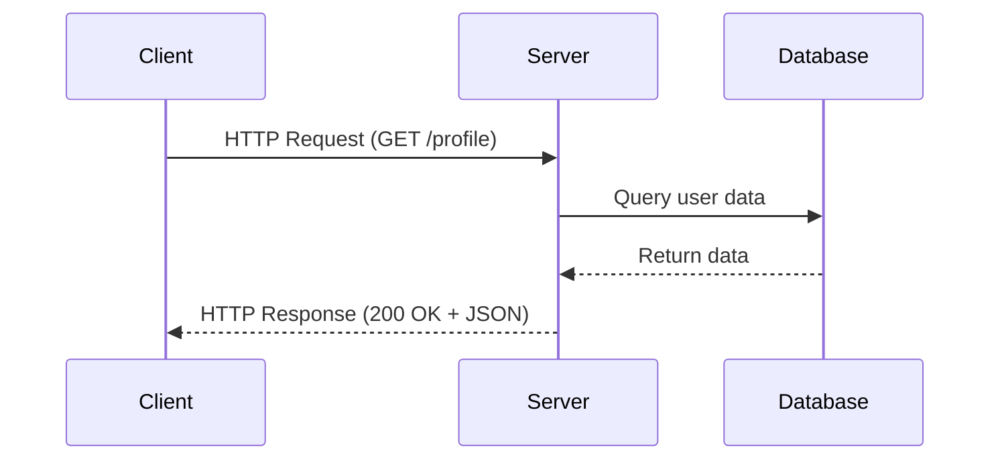
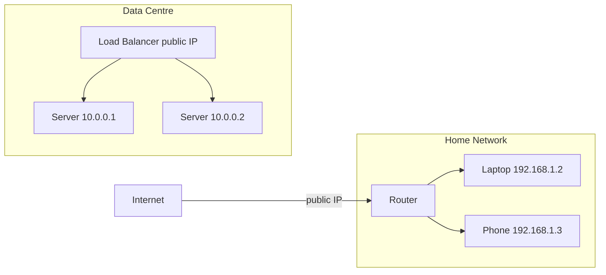
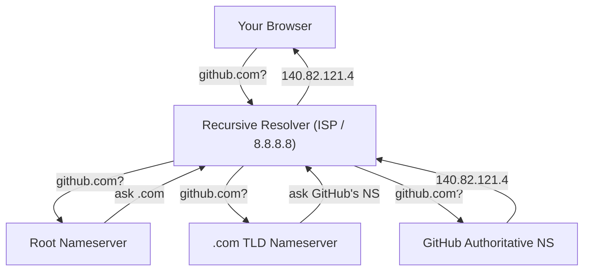
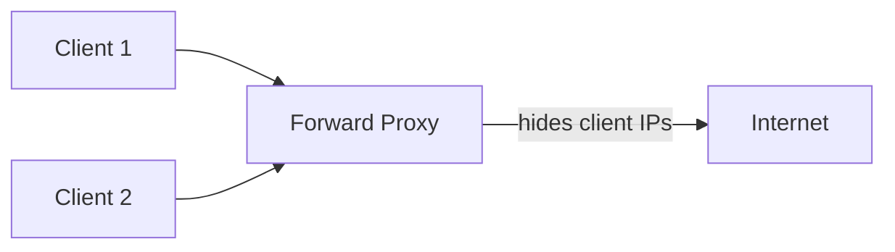
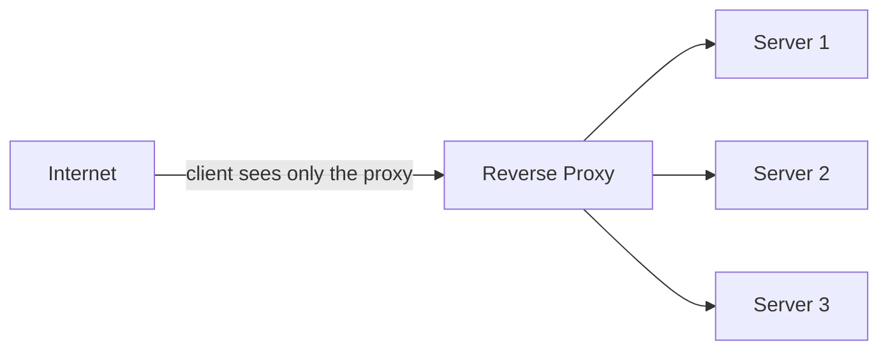

# Group 1 — Networking Foundations

> **Phase:** Foundation → **Group:** 1 of 6 → **Read time:** ~35 minutes

---

## Before You Begin

You just finished *What Is System Design?* — the mental model for the whole discipline: requirements first, everything is a tradeoff, and you compose systems from a small toolkit of building blocks. This group is where we start filling that model with **depth**, and we begin at the very bottom of the stack: **how machines actually talk to each other.**

Here's why networking comes first. Every box you will ever draw — load balancers, API gateways, databases, caches, microservices — is really just *a program on a machine that other programs reach across a network.* Before you can reason about any of them, you need to understand the wire underneath: who asks, who answers, how they find each other, what language they speak, and why distance quietly sets the speed limit on everything above.

> **The mindset shift:** stop thinking of "the internet" as magic that just works, and start seeing it as a **chain of deliberate, understandable steps** — a name lookup, a route to an address, a proxy, a request, a response — each of which an engineer can measure, move, or break on purpose.

This group covers the six networking concepts every later topic silently assumes you already know. By the end, they'll feel like one connected picture, not six things to memorize.

---

## Table of Contents

1. [Client–Server Model](#1-clientserver-model)
2. [IP Addressing](#2-ip-addressing)
3. [DNS — The Domain Name System](#3-dns--the-domain-name-system)
4. [Proxy vs Reverse Proxy](#4-proxy-vs-reverse-proxy)
5. [Latency](#5-latency)
6. [HTTP & HTTPS](#6-http--https)
7. [Putting It All Together](#putting-it-all-together)
8. [Final Recap](#final-recap)

---

## 1. Client–Server Model

### The Problem It Solved

In the early days of networked computing, there were no rules about how machines should communicate. Any machine could reach any other in any format it wanted. The result was chaos — no standard way to share data, no separation of responsibility, no way to scale anything independently. Engineers needed one foundational answer:

> How should two machines on a network divide responsibility?

### The Model

The client–server model answers this by assigning two clear, asymmetric roles:

- The **client** initiates — it asks for something.
- The **server** listens and responds — it owns the logic, the data, and the processing.

This asymmetry is the key insight. The client doesn't need to know how the server works internally; the server doesn't need to know anything about the client's device. They communicate through a defined contract — a request and a response.

Think of a restaurant. You (the customer) read the menu, place an order, and wait. You never walk into the kitchen. The kitchen (the server) receives your order, prepares it using its own process, and delivers the result.

| Restaurant | System Design |
|---|---|
| Customer | Client |
| Menu | API contract |
| Waiter | Network / protocol |
| Order | Request |
| Kitchen | Server |
| Meal delivered | Response |

### What "Client" and "Server" Actually Mean

This is where beginners get it wrong. A **server is not a machine** — it's a *role*. Any process that listens for requests and returns responses is a server, whether it runs on a rack, a cloud instance, a container, or a laptop. One machine can run five servers at once on different ports.

A **client is not a browser** — it's any process that initiates a request. A mobile app is a client. A microservice calling another microservice is a client. A cron script hitting an API is a client. In a microservices architecture, every service is simultaneously a server to those above it and a client to those below it.



### What Breaks

- **Server overload** — too many clients at once causes queuing and slow responses.
- **Network failure** — if the path between client and server breaks, communication stops.
- **Single point of failure** — one server going down means every client loses access.

These three failure modes drive every major decision later in the curriculum: load balancers, redundancy, caching, and horizontal scaling.

---

## 2. IP Addressing

### The Problem It Solved

Once you have clients and servers, an immediate question follows: how does a client *find* a server? On a network with billions of devices, each one needs a unique, routable address — otherwise there's no way to direct traffic to the right destination.

### What an IP Address Is

An IP address is a unique numerical label assigned to every device on a network. It's what routers use to forward packets from a source to a destination — like a postal address for a building in a city.

**IPv4** is the original standard, still dominant:

```
140.82.121.4       ← GitHub
8.8.8.8            ← Google's public DNS
192.168.1.1        ← a typical home router
```

Four numbers, each 0–255, 32 bits total — about 4.3 billion addresses. That ran out once every phone, laptop, server, and IoT device joined the internet. **IPv6** fixes this with 128 bits and a virtually unlimited space (`2001:0db8:85a3::8a2e:0370:7334`). Both coexist today; most early-career work uses IPv4.

### Public vs Private

A **public IP** is globally unique and routable — anything on the internet can reach it. A **private IP** works only inside a local network (`192.168.x.x`, `10.x.x.x`) and means nothing outside it.



In production, servers live on private IPs inside a data centre; only the entry point (a load balancer or gateway) has a public IP. This keeps internal infrastructure off the public internet — a security and organizational practice.

### Static vs Dynamic

A **static IP** never changes — servers need this, because if a server's address moved, nothing could find it reliably. A **dynamic IP** is assigned temporarily (via DHCP) and can change; home devices use these, and cloud servers get dynamic public IPs by default — which is why engineers reserve static IPs (e.g. AWS Elastic IPs) for anything that must stay reachable.

---

## 3. DNS — The Domain Name System

### The Problem It Solved

IP addresses solve routing, but nobody types `140.82.121.4` into a browser. Humans need names; machines need numbers. Something must translate between them reliably, at internet scale, in milliseconds.

### What DNS Is

DNS is the distributed system that translates human-readable domain names into IP addresses — the phone book of the internet.

```
Your browser asks: what is the IP for github.com?
DNS answers:       140.82.121.4
Your browser uses: 140.82.121.4 to open a connection
```

This lookup happens *before* any request reaches the server, usually in under 50ms.

### How Resolution Works

DNS isn't one server — it's a hierarchy that cooperates:



Results are **cached** at every level — browser, OS, resolver — so most lookups skip most steps and return in single-digit milliseconds.

### Why It Matters for System Design

DNS failures are invisible to users but catastrophic: if DNS is down, even healthy servers become unreachable. DNS is also where engineers steer traffic globally — changing what IP a domain resolves to redirects millions of users to a different region, a backup, or a CDN without touching the application. That's why DNS underpins load balancing, failover, and multi-region design.

---

## 4. Proxy vs Reverse Proxy

### The Problem They Solved

As systems grew, engineers needed intermediary layers between clients and servers to add capabilities neither side should own directly — security, caching, traffic control, anonymity, routing. Two patterns emerged, depending on which side the intermediary serves.

### Forward Proxy — Client Side

A **forward proxy** sits in front of *clients* and forwards their outbound requests to the internet on their behalf. The destination server sees the proxy's IP, not the client's.



Common uses: corporate traffic monitoring/filtering, privacy tools, shared caching.

### Reverse Proxy — Server Side

A **reverse proxy** sits in front of *servers* and forwards incoming client requests to internal servers. The client sees only the reverse proxy's IP.



Common uses: **load balancing**, **SSL/TLS termination**, **caching**, **security** (hiding internal infrastructure). Nginx, HAProxy, and Cloudflare are reverse proxies at massive scale.

| | Forward Proxy | Reverse Proxy |
|---|---|---|
| Sits in front of | Clients | Servers |
| Hides | Client identity from servers | Server identity from clients |
| Serves | Clients | Servers |
| Common use | Corporate filtering, privacy | Load balancing, security, caching |

When engineers say "proxy" in a design discussion without qualification, they almost always mean a **reverse proxy** — it's the far more common production pattern.

---

## 5. Latency

### The Problem It Names

Every request takes time — to travel to the server, to be processed, and to travel back. That total elapsed time, from send to receive, is **latency**. It isn't a bug; it's a physical property of networked systems. But *how much* latency there is, and *where* it comes from, is something engineers can measure and reduce.

### Where It Comes From

| Source | What it is |
|---|---|
| **Network latency** | Time for data to physically travel — bounded by the speed of light and distance |
| **Processing latency** | Time the server spends computing — queries, logic, external calls |
| **Queue latency** | Time a request waits before processing begins — the server is busy |
| **Transmission latency** | Time to push data onto the network — packet size and bandwidth |

In most web apps, **network latency** and **database query time** dominate.

### Measuring It — Percentiles

Average latency is nearly useless: if 99% of requests take 20ms and 1% take 10s, the average looks fine while thousands of users suffer. Engineers use **percentiles**:

- **P50** — the median; half of requests are faster.
- **P95** — 95% complete within this; near-worst-case.
- **P99** — 99% complete within this; the *tail* — your slowest users' experience.

P99 is the number that matters most for user experience; optimizing the average while ignoring P99 ignores the users most likely to churn.

### A Latency Reference

| Operation | Approximate latency |
|---|---|
| L1 cache reference | ~1 ns |
| RAM access | ~100 ns |
| SSD read | ~100 µs |
| Network round trip (same data centre) | ~1 ms |
| HDD seek | ~10 ms |
| Network round trip (cross-continent) | ~100 ms |

The gap between memory and network access is enormous — which is exactly *why caching works:* it replaces a slow network or disk hop with a fast memory read. Every major performance optimization later (caching, CDNs, connection pooling, load balancing) is ultimately about reducing one of these latency components.

---

## 6. HTTP & HTTPS

### The Problem They Solved

Clients and servers needed a shared language — a standard format for requests and responses that every browser, server, and language could implement. Without one, nothing would interoperate.

### What HTTP Is

HTTP (HyperText Transfer Protocol) defines how clients and servers structure and exchange messages on the web.

**A request has four parts:**

```
GET /home HTTP/1.1
Host: github.com
Authorization: Bearer abc123

(empty body for GET)
```

| Part | Carries |
|---|---|
| **Method** | The action — GET (read), POST (create), PUT (update), DELETE (remove) |
| **URL** | The resource being targeted |
| **Headers** | Metadata — who's asking, expected format, auth tokens |
| **Body** | Optional payload — used by POST/PUT |

**A response has three parts** — status code, headers, body:

```
HTTP/1.1 200 OK
Content-Type: application/json

{"user": "muhammed", "plan": "pro"}
```

### Common Status Codes

| Code | Meaning |
|---|---|
| 200 / 201 | OK / Created |
| 301 | Moved Permanently (redirect) |
| 400 / 401 / 403 / 404 | Bad Request / Unauthorized / Forbidden / Not Found |
| 429 | Too Many Requests (rate limited) |
| 500 / 503 | Internal Server Error / Service Unavailable |

### HTTPS — HTTP with Encryption

HTTPS is HTTP with a TLS layer: every message is encrypted before it leaves the client and decrypted only at the server. Without it, anyone on the network path — a router, an ISP, someone on the same Wi-Fi — can read raw messages including passwords. With HTTPS: data is encrypted in transit, the server's identity is verified via a certificate, and tampering is detectable. It's non-negotiable for any system handling user data.

### HTTP Versions

| Version | Key characteristic |
|---|---|
| HTTP/1.1 | One request at a time per connection — still widely used |
| HTTP/2 | Many requests multiplexed over one connection — faster |
| HTTP/3 | Runs on UDP (QUIC) — lower latency, especially on mobile |

The version affects performance, not the fundamental request–response model.

---

## Putting It All Together

_A single browser request, traced through all six concepts — filled in the complete pass._

---

## Final Recap

_Concept · Core Insight · Biggest Tradeoff table + The One Thing to Remember — filled in the complete pass._

---

## What's Next

_Hook into Group 2 — APIs & Communication — filled in the complete pass._
