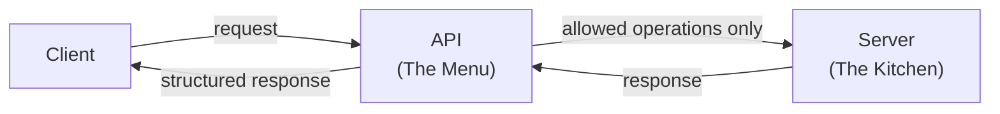
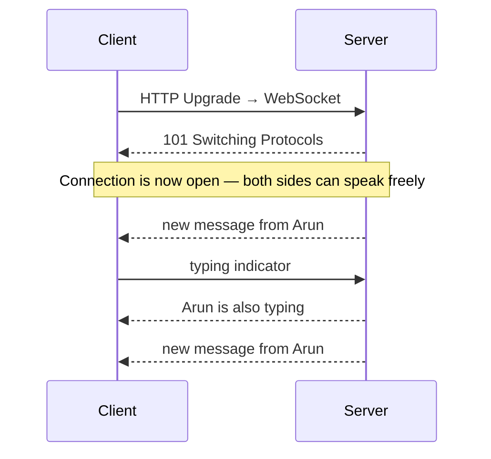
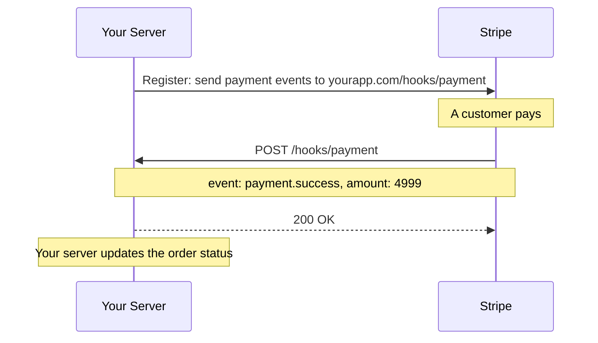
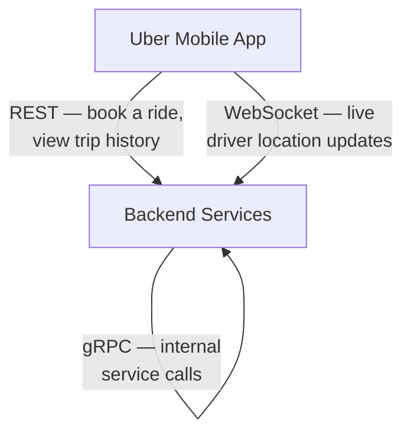

# APIs & Communication

> Group 2 of 6 — Top 30 Must-Know System Design Concepts

---

## What You'll Learn

In Group 1, you learned how data physically travels across a network — IP addresses, DNS, HTTP, and the wire-level plumbing that gets a request from A to B.

But reaching a server is only half the problem.

Once two services can find each other, they still need to agree on something deeper:

> **What can be asked? How is data exchanged? Who speaks first?**

This group answers those questions.

By the end, you will understand the communication pattern behind every major system you use daily — and more importantly, **why engineers choose different patterns for different problems.**

---

## The Story of This Group

These five concepts do not exist independently. They evolved to solve a sequence of increasingly complex problems:

```
Two services need to exchange data
→ They need a contract
→ That contract is an API

The simplest style: client asks, server answers
→ REST API

REST works — but frontends need flexible data
→ GraphQL

Request–response is not enough for real-time
→ WebSockets

Sometimes the server needs to notify you, not the other way around
→ Webhooks
```

Each concept is the natural answer to a limitation in the previous one. Read them in order and the progression will feel obvious.

---

## 1. APIs — The Contract Between Services

### The Problem

When two separate systems need to share data or trigger actions, they need a defined contract. Without one, every integration becomes a custom one-off — brittle, undocumented, and impossible to maintain as systems grow.

### What an API Is

**API** stands for Application Programming Interface.

An API is a **boundary** — it defines exactly what one system exposes to the outside world, and hides everything else.

The best analogy is a restaurant menu.

The menu tells you what you can order, what format to use, and what you will receive. You never see the kitchen. You never touch the ingredients. What happens inside is completely hidden from you — and that is intentional.



The kitchen can change its recipes entirely — new chef, new equipment, new process — and as long as the menu stays the same, every customer is unaffected.

This is exactly why APIs matter in system design. The internal implementation can change completely. As long as the contract holds, every client continues to work.

💡 **Key Insight**

An API is a promise. The server promises: "Send me a request in this format, and I will always respond in that format." Everything internal is irrelevant to the caller.

### Why Engineers Care About API Design

A well-designed API is a stable foundation that other teams and systems build on top of.

A poorly designed one causes breaking changes, integration bugs, and maintenance debt that compounds over time. In large organisations, a bad API decision made today can cost months of engineering work years later.

---

## 2. REST API — The Default Standard

Now that you understand what an API is, the next question is: **what style should it follow?**

The most widely used answer in the world is REST.

### What REST Is

**REST** (Representational State Transfer) is not a technology or a protocol. It is a set of design principles for building web APIs that use HTTP naturally and predictably.

The core idea: treat everything as a **resource** — a user, a post, an order. Give each resource a URL. Use HTTP methods to express what you want to do.

```
GET    /users/42        → read user 42
POST   /users           → create a new user
PUT    /users/42        → update user 42
DELETE /users/42        → delete user 42
```

The URL says **what**. The HTTP method says **what to do with it**. The response carries the data, almost always as JSON.

### The Stateless Principle

The most important property of REST is that it is **stateless**.

Every request must carry all the information needed to process it. The server remembers nothing between requests. If you need authentication, your token goes in the request — not in server memory from a previous login.

Why does this matter? Because statelessness is what makes REST easy to scale.

If the server holds no memory of individual clients, any server instance can handle any request. You can run ten servers, a hundred servers — each one is interchangeable. This is a critical scaling property you will see referenced again and again throughout this curriculum.

💡 **Key Insight**

REST's statelessness is not a limitation — it is a deliberate design choice that makes horizontal scaling straightforward. No server needs to remember you.

### What REST Does Well and Where It Struggles

REST works beautifully for simple, stable data operations. But it has two friction points that become real problems at scale:

**Over-fetching** — an endpoint returns more data than the client needs. A mobile app loading a user profile might only need a name and photo, but gets fifty fields back.

**Under-fetching** — one endpoint does not have everything the client needs. Loading a dashboard might require three separate API calls, each adding latency.

These are not theoretical problems — they were exactly the problems Facebook hit when building their mobile app. Which is exactly why they built what comes next.

---

## 3. GraphQL — Let the Client Decide

### The Problem REST Could Not Solve

Facebook's mobile app had hundreds of different screens, each needing a different combination of data. With REST, this meant either bloated endpoints returning everything, or many round trips to fetch different resources.

In 2012, Facebook built GraphQL internally to solve this. In 2015, they open-sourced it.

### What GraphQL Is

GraphQL is a **query language for APIs**. Instead of the server defining fixed endpoints with fixed data shapes, the client describes exactly what it needs — and the server returns precisely that.

```graphql
query {
  user(id: "42") {
    name
    posts(last: 3) {
      title
      likes
    }
  }
}
```

Response:

```json
{
  "data": {
    "user": {
      "name": "Muhammed",
      "posts": [
        { "title": "System Design Notes", "likes": 142 },
        { "title": "Django Tips", "likes": 87 },
        { "title": "Python Patterns", "likes": 63 }
      ]
    }
  }
}
```

One request. Exactly the right data. No extra fields. No extra round trips.

💡 **Key Insight**

REST: the server decides what data you get.
GraphQL: the client decides what data it needs.

### REST vs GraphQL — When to Choose Which

You do not need to master GraphQL right now. You need to know when engineers reach for it.

| Situation | Better Choice |
|---|---|
| Simple API, stable data shapes | REST |
| Public API, wide audience | REST |
| Complex frontend, many screens | GraphQL |
| Multiple clients needing different shapes | GraphQL |
| Mobile apps where bandwidth matters | GraphQL |

GraphQL adds complexity — a schema to define and maintain, a resolver layer, more sophisticated caching. For most straightforward APIs, REST is still the right default.

> You don't need to master GraphQL syntax yet. The deep-dive chapter covers it fully. For now, just understand the problem it solves and when engineers choose it.

---

## 4. WebSockets — When Request–Response Is Not Enough

REST and GraphQL share the same fundamental pattern: the client asks, the server answers, the exchange ends.

But now a different problem appears.

**What if the server needs to push updates to the client continuously — without the client asking every time?**

A live chat message. A stock price ticking. A driver moving on a map. A collaborative document updating in real time.

With HTTP, the only way to simulate this is polling — the client asks "any updates?" every second. It works, but it is wasteful, laggy, and does not scale.

WebSockets solve this elegantly.

### What WebSockets Are

A WebSocket is a **persistent, bidirectional communication channel** between client and server.

After an initial handshake over HTTP, the connection upgrades and stays open — indefinitely. Both sides can send messages to the other at any time, without waiting to be asked.



Think of HTTP as sending letters — you send one, wait for a reply, then send another. WebSockets are a phone call — the line stays open and both sides can speak whenever they want.

💡 **Key Insight**

REST asks. WebSockets listen.

Use REST when the client needs data on demand. Use WebSockets when data arrives continuously and the client must react immediately.

### The Tradeoff to Know

WebSockets introduce **statefulness**. The server must maintain an open connection per connected client — which makes scaling more complex than the stateless REST model.

This is a real engineering tradeoff, not a flaw. Real-time capability costs something. You will understand exactly how to handle this when the dedicated scaling and distributed systems chapters arrive.

> ⚠️ WebSocket scaling patterns are covered in depth in the Scaling and Distributed Systems modules.

---

## 5. Webhooks — The Server Calls You

WebSockets solved the problem of continuous real-time updates between two connected parties. But there is one more scenario neither REST nor WebSockets handles cleanly.

**What if an event happens in a completely separate system — and that system needs to notify yours?**

A payment completes in Stripe. A code push triggers a CI pipeline. An order is placed in Shopify. These events happen in external systems you do not control. You cannot keep a WebSocket open to all of them. Polling each one is impractical.

Webhooks solve this.

### What Webhooks Are

A Webhook is an **event-driven HTTP callback**.

Instead of your system asking another service "did anything happen?", you give that service a URL. When a specific event occurs on their side, they POST the event data to your URL. Your server receives it and acts.



The key shift: **you stop asking. They start telling.**

💡 **Key Insight**

REST: you ask, they answer.
WebSocket: you both talk on an open line.
Webhook: they call you when something happens.

### Real-World Webhook Uses

| Service | What they notify you about |
|---|---|
| Stripe | Payment success, failure, refund |
| GitHub | Code pushed, PR opened, build triggered |
| Shopify | Order placed, inventory updated |
| Twilio | SMS delivered, call ended |

---

## A Note on Other Styles

Two other communication styles appear in real systems. You will encounter them — you do not need to master them now.

**gRPC** — built by Google for high-performance internal service communication. Instead of JSON, it uses a compact binary format (Protocol Buffers). Much faster than REST for service-to-service calls inside a data centre. Poor browser support makes it unsuitable for public-facing APIs.

**SOAP** — an older XML-based protocol, dominant before REST. Still found in banking, government, and legacy enterprise systems. Verbose and complex. For any new system, REST or GraphQL is the right choice.

---

## How All Five Work Together

No production system uses just one communication style. Here is how a system like Uber uses all of them at once:



Each pattern serves a different need. REST for structured data operations. WebSocket for real-time location. Webhook for external payment events. gRPC for fast internal calls.

**Recognising which pattern fits which need is a core system design skill.**

---

## Quick Decision Guide

```
Need to fetch or submit data?
→ REST

Need flexible queries from a complex frontend?
→ GraphQL

Need continuous real-time updates?
→ WebSockets

Need an external service to notify you when something happens?
→ Webhooks

Need high-performance internal service calls?
→ gRPC
```

---

## Cheat Sheet

| Pattern | Who speaks first | Connection | Best for |
|---|---|---|---|
| REST | Client | Per request | CRUD, public APIs |
| GraphQL | Client | Per request | Complex frontends, flexible data |
| WebSocket | Either | Persistent | Real-time, live updates |
| Webhook | Server (external) | Per event | Event notifications from third parties |
| gRPC | Client | Per request | Fast internal service calls |

| Concept | Remember this |
|---|---|
| API | A contract — hides internals, exposes only what callers need |
| REST | Stateless, resource-based — any server handles any request |
| GraphQL | Client defines the shape — eliminates over and under-fetching |
| WebSocket | Open line — both sides push messages freely |
| Webhook | Reverse call — the server contacts you when an event fires |

---

## What Comes Next

You now understand how services communicate — the contracts they use, the styles they follow, and when to choose each one.

But communication is only useful if you have somewhere to store and retrieve data.

→ **Group 3: Data Storage** — where data lives, how it is organised, and how engineers keep it accessible and fast as systems grow

---

*Part of the [System Design Mastery](../../../../README.md) repository — 01 Introduction / 02 Top 30 Concepts / Group 2: APIs & Communication*