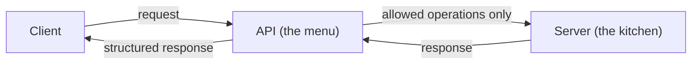
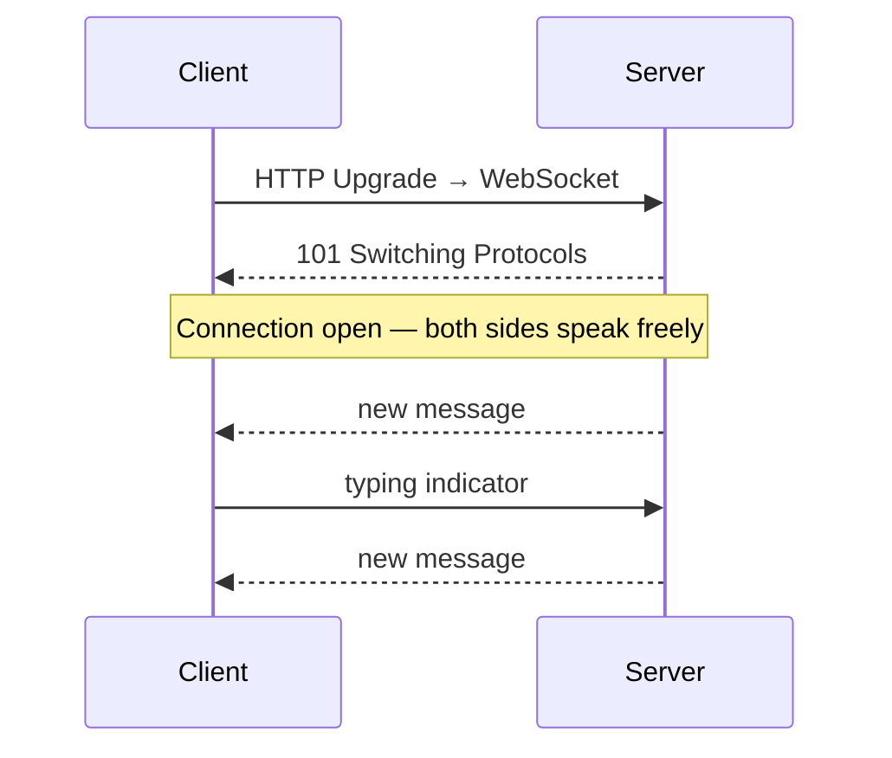
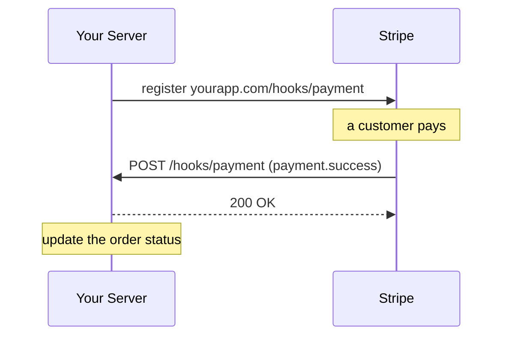
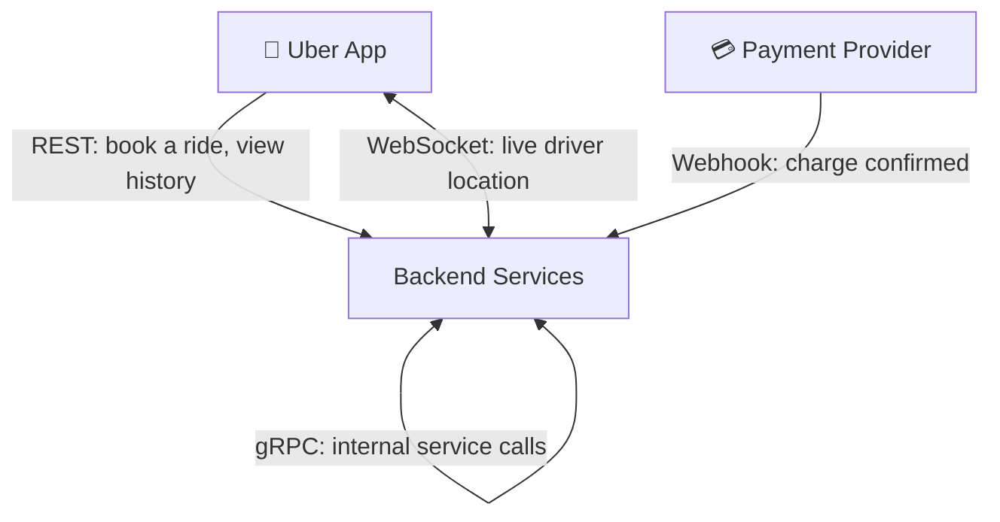

# Group 2 — APIs & Communication Foundations

> **Phase:** Foundation → **Group:** 2 of 6 → **Read time:** ~35 minutes

---

## Before You Begin

In Group 1 you learned how data physically *travels* — IP addresses, DNS, the reverse proxy front door, HTTP, and the latency of every hop. That answered one question: **how does a message get from one machine to another?**

But reaching a server is only half the problem. Once two programs can find each other, they still have to agree on something deeper:

> **What can be asked? How is the data shaped? Who is allowed to speak first?**

That agreement is an **API** — and the different *shapes* that agreement can take (REST, GraphQL, WebSockets, Webhooks, gRPC) are what this group is about. Each one exists because the previous one hit a wall: REST couldn't give mobile clients exactly the data they needed, request–response couldn't push live updates, and neither could let an outside system notify *you*.

> **The mindset shift:** stop asking "which API style is best?" and start asking "**who needs to talk to whom, how often, and who initiates?**" Every style here is the right answer to a *specific* version of that question — and recognizing which is a core system-design skill.

By the end, you'll understand the communication pattern behind every major system you use daily, and — more importantly — *why* engineers choose different patterns for different problems.

---

## Table of Contents

1. [APIs — The Contract Between Services](#1-apis--the-contract-between-services)
2. [REST — The Default Standard](#2-rest--the-default-standard)
3. [GraphQL — Let the Client Decide](#3-graphql--let-the-client-decide)
4. [WebSockets — Beyond Request–Response](#4-websockets--beyond-requestresponse)
5. [Webhooks — The Server Calls You](#5-webhooks--the-server-calls-you)
6. [Other Styles: gRPC & SOAP](#6-other-styles-grpc--soap)
7. [Putting It All Together](#putting-it-all-together)
8. [Final Recap](#final-recap)

---

## 1. APIs — The Contract Between Services

### The Problem

When two separate systems need to share data or trigger actions, they need a defined contract. Without one, every integration becomes a custom, brittle, undocumented one-off — impossible to maintain as systems grow.

### What an API Is

**API** stands for Application Programming Interface. An API is a **boundary**: it defines exactly what one system exposes to the outside world and hides everything else.

The best analogy is a restaurant menu. The menu tells you what you can order, in what format, and what you'll receive. You never see the kitchen or touch the ingredients — and that's intentional.



The kitchen can change its recipes entirely — new chef, new equipment — and as long as the menu stays the same, every customer is unaffected. That's exactly why APIs matter: the internal implementation can change completely, and as long as the contract holds, every client keeps working.

### Why Engineers Care About API Design

A well-designed API is a stable foundation other teams build on. A poorly designed one causes breaking changes, integration bugs, and maintenance debt that compounds — in large organizations, a bad API decision today can cost months of work years later.

> 💡 **Key Insight**
>
> An API is a **promise**: "send me a request in this format, and I'll always respond in that format." Everything internal is the caller's non-concern. This is the same *hide-the-internals-behind-a-contract* idea you met with the reverse proxy in Group 1 — and it's why APIs are the seams along which large systems are split into independently-owned services. The contract is the product; the implementation is replaceable.

### Quick Recap — APIs

- An API is a **contract/boundary**: it exposes a defined set of operations and hides all internals.
- Its value is **stability** — implementations can change freely as long as the contract holds.
- APIs are the **seams** that let large systems split into independently-owned services.
- Good API design compounds into a stable foundation; bad design compounds into years of migration pain.

---

## 2. REST — The Default Standard

Now that you know *what* an API is, the next question is: **what style should it follow?** The most widely used answer in the world is REST.

### What REST Is

**REST** (Representational State Transfer) isn't a technology or protocol — it's a set of design principles for building web APIs that use HTTP naturally. The core idea: treat everything as a **resource** (a user, a post, an order), give each a URL, and use HTTP methods to say what you want to do.

```
GET    /users/42     → read user 42
POST   /users        → create a new user
PUT    /users/42     → update user 42
DELETE /users/42     → delete user 42
```

The URL says **what**; the method says **what to do with it**; the response carries the data, almost always as JSON.

### The Stateless Principle

REST's most important property is that it's **stateless**: every request carries all the information needed to process it, and the server remembers nothing between requests. Your auth token travels *in the request*, not in server memory. This is what makes REST easy to scale — if no server holds memory of a client, any server can handle any request, so you can run ten or a hundred interchangeable instances.

### Where REST Struggles

REST works beautifully for simple, stable operations, but has two friction points at scale:

- **Over-fetching** — an endpoint returns more than the client needs (a mobile profile screen needs a name and photo but gets fifty fields).
- **Under-fetching** — one endpoint isn't enough, so a screen needs three calls, each adding latency.

These were exactly the problems Facebook hit building their mobile app — which is why they built what comes next.

> 💡 **Key Insight**
>
> REST's statelessness isn't a limitation — it's a deliberate choice that makes horizontal scaling almost free: no server needs to remember you, so a load balancer can send your next request to any instance. That's the direct payoff of HTTP being stateless (Group 1). Remember this the moment you meet **stateless services** in the Scaling group — REST is where the principle first earns its keep.

### Quick Recap — REST

- REST models everything as **resources** with URLs, acted on by **HTTP methods** (GET/POST/PUT/DELETE).
- It's **stateless** — each request self-contains everything needed, which is what makes it scale horizontally.
- It's the right **default** for simple, stable, public APIs.
- Its weaknesses are **over-fetching and under-fetching**, which bite hardest on complex, bandwidth-sensitive frontends.

---

## 3. GraphQL — Let the Client Decide

### The Problem REST Couldn't Solve

Facebook's app had hundreds of screens, each needing a different combination of data. REST meant either bloated endpoints or many round trips. In 2012 Facebook built GraphQL internally to fix this; in 2015 they open-sourced it.

### What GraphQL Is

GraphQL is a **query language for APIs**. Instead of the server defining fixed endpoints with fixed shapes, the client describes exactly what it needs and the server returns precisely that.

```graphql
query {
  user(id: "42") {
    name
    posts(last: 3) { title likes }
  }
}
```

One request, exactly the right data, no extra fields, no extra round trips.

> 💡 **Key Insight**
>
> The whole shift is about **who decides the shape of the response**. In REST, the *server* decides what each endpoint returns; in GraphQL, the *client* declares exactly what it needs. That flexibility is powerful for many-screen frontends — but it moves complexity onto the server (resolvers, query cost analysis) and breaks the simple per-URL HTTP caching that makes REST cheap at the edge. Flexibility for the client is paid for in complexity on the server.

The trade: GraphQL adds a schema to maintain, a resolver layer, and more sophisticated caching. For most straightforward APIs, REST is still the right default.

| Situation | Better choice |
|---|---|
| Simple API, stable data shapes | REST |
| Public API, wide audience | REST |
| Complex frontend, many screens | GraphQL |
| Multiple clients needing different shapes | GraphQL |
| Mobile apps where bandwidth matters | GraphQL |

### Quick Recap — GraphQL

- GraphQL is a **query language** where the **client declares the exact shape** of the response.
- It eliminates **over- and under-fetching** — one request returns precisely what's needed.
- It shines for **complex, many-screen frontends** and multiple clients with different data needs.
- The cost is **server-side complexity** (schema, resolvers) and the loss of simple per-URL edge caching.

---

## 4. WebSockets — Beyond Request–Response

REST and GraphQL share one pattern: the client asks, the server answers, the exchange ends. But what if the **server** needs to push updates continuously — a chat message, a stock tick, a driver moving on a map — without the client asking each time?

With plain HTTP the only option is polling ("any updates?" every second) — wasteful, laggy, and it doesn't scale. WebSockets solve this.

### What WebSockets Are

A WebSocket is a **persistent, bidirectional channel**. After an initial HTTP handshake, the connection upgrades and stays open indefinitely; both sides can send messages at any time.



HTTP is like sending letters; WebSockets are a phone call — the line stays open and either side can talk.

> ⚠️ **Real-time capability isn't free — it costs statefulness.** A REST server holds nothing between requests, so any instance serves any call. A WebSocket server must keep an *open connection per client* in memory, so a user is now tied to a specific server — which complicates load balancing, deploys (you can't just restart a box), and horizontal scaling. This is why chat and live-location systems need the dedicated fan-out and connection-management patterns you'll meet in the Scaling and Distributed Systems groups.

The tradeoff in one line: **REST asks, WebSockets listen** — reach for REST when the client needs data on demand, and WebSockets when data arrives continuously and the client must react immediately.

### Quick Recap — WebSockets

- A WebSocket is a **persistent, bidirectional** channel opened by upgrading an HTTP connection.
- Either side can **push messages at any time** — ideal for chat, live location, tickers, collaboration.
- It replaces wasteful **polling** with a single always-open connection.
- The cost is **statefulness**: one open connection per client, which makes scaling and deploys harder.

---

## 5. Webhooks — The Server Calls You

WebSockets handle continuous updates between two connected parties. But what if an event happens in a *completely separate* system you don't control — a payment in Stripe, a push to GitHub, an order in Shopify — and it needs to notify you? You can't hold a WebSocket open to all of them, and polling each is impractical.

### What Webhooks Are

A Webhook is an **event-driven HTTP callback**. Instead of asking "did anything happen?", you give the other service a URL; when an event occurs, *they* POST the event to your URL and your server acts.



The key shift: **you stop asking; they start telling.**

| Service | Notifies you about |
|---|---|
| Stripe | Payment success, failure, refund |
| GitHub | Push, PR opened, build triggered |
| Shopify | Order placed, inventory updated |
| Twilio | SMS delivered, call ended |

> 💡 **Key Insight**
>
> Line the three up by *who initiates*: **REST** — you ask, they answer. **WebSocket** — you both talk on an open line. **Webhook** — they call you when something happens. Webhooks invert control, which is exactly why they're the backbone of integrations between systems you don't own — but it also means you must treat incoming calls defensively: verify the sender's signature, and expect the same event to arrive more than once (deliveries retry). "Who speaks first" quietly decides your whole design.

### Quick Recap — Webhooks

- A Webhook is an **event-driven HTTP callback** — you register a URL and the other service POSTs events to it.
- It **inverts control**: you stop polling, and the external system notifies you when something happens.
- It's the standard for **third-party integrations** (Stripe, GitHub, Shopify) you don't control.
- Because delivery **retries**, receivers must be **idempotent** and **verify signatures** — the same event may arrive twice.

---

## 6. Other Styles: gRPC & SOAP

Two more styles show up in real systems; you'll meet them, but don't need to master them yet.

**gRPC** — built by Google for high-performance *internal* service-to-service calls. Instead of JSON it uses a compact binary format (Protocol Buffers) over HTTP/2, making it much faster than REST inside a data centre. Poor browser support makes it unsuitable for public-facing APIs.

**SOAP** — an older, XML-based protocol that predates REST. Verbose and complex, still found in banking, government, and legacy enterprise systems. For any new system, REST or GraphQL is the right choice.

### Quick Recap — Other Styles

- **gRPC** uses compact binary (Protocol Buffers) over HTTP/2 — fast **internal** service-to-service calls, weak browser support.
- **SOAP** is a verbose, legacy XML protocol you'll mostly meet in old enterprise systems.
- Default to **REST or GraphQL** for anything new and public-facing; reach for gRPC inside the data centre when performance matters.

---

## Putting It All Together

No real system picks *one* communication style — a serious product uses several at once, each where it fits. Trace a single ride through **Uber** and every pattern in this group shows up, each answering a different version of "who talks to whom, how often, and who initiates?"



- **REST** — you tap *Book*: a plain request/response operation. The client asks, the server answers, done. Stateless, cacheable, simple.
- **WebSocket** — the car crawls across your map in real time. The server *pushes* location continuously over an open connection; polling every second would be wasteful and laggy.
- **Webhook** — the payment clears in a provider you don't control (Stripe/Adyen). *They* call Uber's backend when the charge settles. Uber stops asking; the provider tells.
- **gRPC** — behind the scenes, dozens of internal services (pricing, matching, ETA) call each other thousands of times per ride. Compact binary over HTTP/2 keeps those internal hops fast.

The lesson isn't "Uber is complex." It's that **each pattern is the correct answer to a specific communication need** — on-demand data (REST), continuous push (WebSocket), external notification (Webhook), fast internal calls (gRPC). Recognizing which need you're facing, and reaching for the matching pattern, is the whole skill this group is teaching.

---

## Final Recap

| Concept | Core Insight | Biggest Tradeoff |
|---|---|---|
| **API** | A contract that exposes operations and hides internals | Stability of the contract vs the discipline required to design and evolve it well |
| **REST** | Stateless, resource-based operations over HTTP | Simplicity and easy scaling vs over-/under-fetching on complex frontends |
| **GraphQL** | The client declares the exact response shape | No wasted data vs added server complexity and loss of simple edge caching |
| **WebSockets** | A persistent, bidirectional, real-time channel | Instant push vs statefulness — one open connection per client complicates scaling |
| **Webhooks** | An event-driven callback that inverts control | Zero polling vs receivers must handle retries/duplicates and verify senders |
| **gRPC** | Fast binary RPC for internal service calls | Speed inside the data centre vs poor browser support and less human-readable payloads |

### The One Thing to Remember

> **There is no "best" API style — only the right one for a specific communication need. Ask *who initiates, how often, and who's on each end*: on-demand data is REST, flexible client-driven queries are GraphQL, continuous push is WebSockets, external notifications are Webhooks, and fast internal calls are gRPC. Matching the pattern to the need is the skill.**

---

## What's Next

> **Group 3 — Data Storage**

You now understand how services *communicate* — the contracts they expose and the patterns they use to talk. But communication is only useful if there's something to talk *about*: data that must be stored, retrieved, and kept correct and fast as the system grows.

The next group goes to where that data lives: SQL vs NoSQL, data modeling, transactions and ACID, indexing, and how storage begins to strain under scale. You've learned how the conversation happens; now let's learn what the conversation is about.

