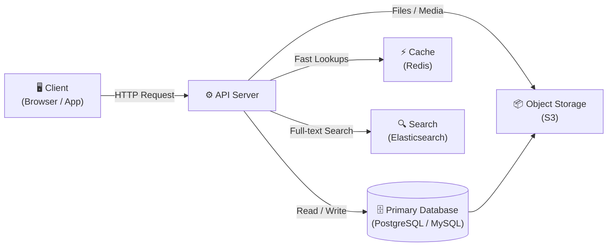
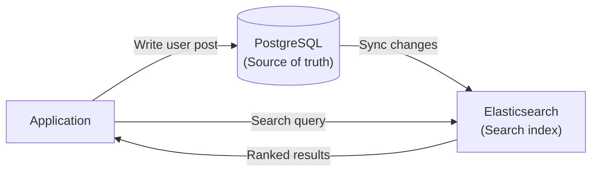
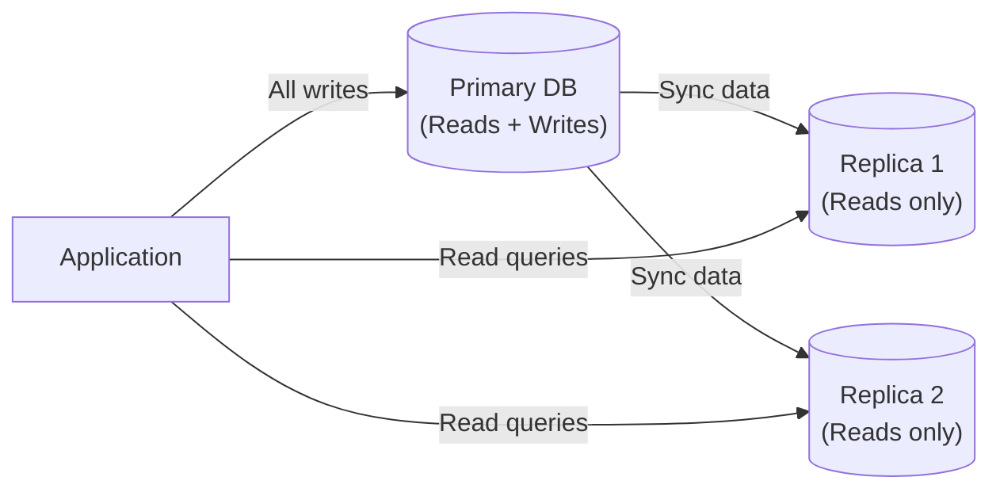
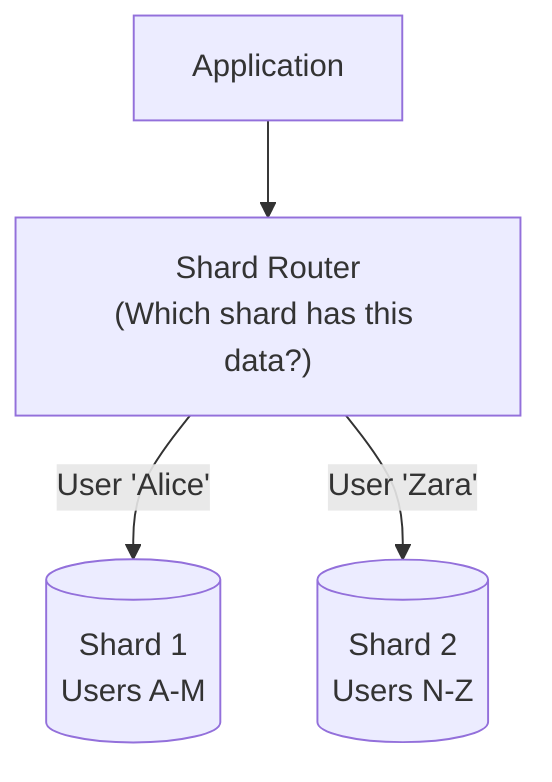
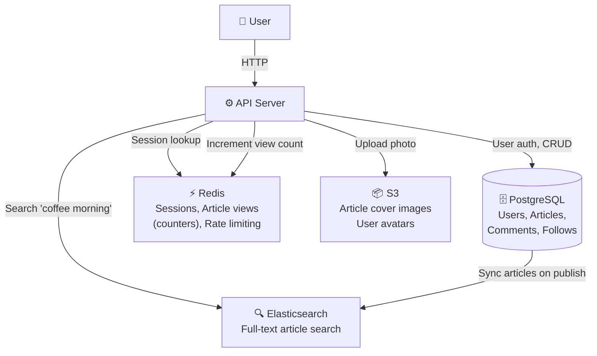

# Group 3 — Data Storage Foundations

> **Phase:** Foundation → **Group:** 3 of 6 → **Read time:** ~50 minutes

---

## Before You Begin

In Group 1, you learned how clients talk to servers across a network.  
In Group 2, you saw how APIs structure that communication.

Now a new question appears — one that every system must eventually answer:

> **Where does the data actually live?**

A server can receive a request, process it, and send a response.  
But if it forgets everything the moment it turns off, it's useless.

Real systems need **storage** — and storage is where most system design decisions get hard.

This document will teach you how engineers think about storing data: why different databases exist, how to choose between them, how data gets structured, what transactions protect you from, and why scaling storage is genuinely difficult.

By the end, you won't just know *what* these things are — you'll understand *why* they exist.

---

## Table of Contents

1. [Big Picture — Where Does Data Live?](#1-big-picture--where-does-data-live)
2. [Database Types — Why One Is Never Enough](#2-database-types--why-one-is-never-enough)
3. [SQL vs NoSQL — Why the Debate Exists](#3-sql-vs-nosql--why-the-debate-exists)
4. [Data Modeling Fundamentals](#4-data-modeling-fundamentals)
5. [What Is a Database Transaction?](#5-what-is-a-database-transaction)
6. [ACID — The Four Guarantees](#6-acid--the-four-guarantees)
7. [Indexing — Why Fast Reads Need Structure](#7-indexing--why-fast-reads-need-structure)
8. [Search Systems — Why Databases Are Bad at Search](#8-search-systems--why-databases-are-bad-at-search)
9. [Scaling Storage — A Preview](#9-scaling-storage--a-preview)
10. [Putting It All Together](#10-putting-it-all-together)

---

## 1. Big Picture — Where Does Data Live?

Imagine you're building a social media app. A user creates a post. Someone likes it. Someone else comments.

Where do those posts, likes, and comments go?

They go to **storage** — and in real systems, "storage" is not one thing. It's a collection of specialized systems, each solving a different problem.

Here's the big picture of how storage fits into a typical architecture:



Each layer has a job:

| Layer | Stores | Optimized For |
|---|---|---|
| **Primary Database** | Core business data (users, orders, posts) | Structured queries, consistency |
| **Cache** | Frequently read data | Speed (microseconds) |
| **Search** | Indexed content | Text search, fuzzy matching |
| **Object Storage** | Files, images, videos | Durability, cheap large storage |

> 💡 **Key Insight**
>
> Most engineers start by thinking "I need a database." Senior engineers think "I need *these specific storage systems* for *these specific problems*." Understanding the landscape is the first step.

You don't need to understand every one of these deeply yet. But by the end of this document, you'll have the intuition to reason about all of them.

---

But now a new problem appears:

Should every kind of data be stored the same way?

Would you store banking transactions, chat messages, profile photos, and recommendation relationships in the same database?

Probably not.

→ This is why different database types exist.

---

## 2. Database Types — Why One Is Never Enough

Here's a question that trips up beginners:

> "Should I just use one database for everything?"

On the surface, it sounds reasonable. One database, simple architecture. But databases are like tools — a hammer works well for nails but terribly for screws. The best engineers pick the right tool for each job.

Let's walk through the major database types and understand *why* each one was invented.

---

### 2.1 Relational Databases

**The problem they solve:**

Early applications needed to store data that had *structure* and *relationships*. A customer has orders. An order has line items. A product belongs to a category. This data is deeply connected, and it needs to stay consistent.

**Mental model:**

Think of a relational database as a collection of spreadsheets (called **tables**) that can reference each other. Every row in a table has the same columns. Relationships between tables are expressed through **foreign keys** — one table referencing a row in another.

```
Users Table              Orders Table
┌────┬──────────┐        ┌────┬──────────┬─────────┐
│ id │ name     │        │ id │ user_id  │ total   │
├────┼──────────┤        ├────┼──────────┼─────────┤
│  1 │ Alice    │◄───────│  1 │    1     │ $49.99  │
│  2 │ Bob      │        │  2 │    1     │ $12.50  │
└────┴──────────┘        │  3 │    2     │ $99.00  │
                         └────┴──────────┴─────────┘
```

You can ask: *"Show me all orders placed by Alice."* The database joins the tables and returns exactly that.

**Best use cases:**

- Financial systems (banking, payments, accounting)
- E-commerce (orders, inventory, customers)
- HR and admin platforms
- Any system where data relationships matter and consistency is critical

**Tradeoffs:**

| Strength | Weakness |
|---|---|
| Strong consistency | Harder to scale horizontally |
| Powerful queries (SQL + joins) | Schema changes require migrations |
| ACID transactions | Struggles with very high write throughput |
| Mature, battle-tested | Tables with 100M+ rows get slower |

**Real-world examples:** PostgreSQL, MySQL, SQLite

**When engineers choose it:**

When the data has clear structure and relationships, when consistency matters more than raw speed, and when the team needs powerful ad-hoc queries.

---

### 2.2 Document Databases

**The problem they solve:**

Sometimes your data doesn't fit neatly into rigid rows and columns. A blog post might have 0 tags or 20 tags. A user profile might have optional social links, custom fields, or nested objects. Forcing this into a relational schema gets awkward fast.

**Mental model:**

Think of a document database as a filing cabinet full of folders. Each folder (document) can hold *any* information — it doesn't have to match the structure of other folders. Documents are usually stored as JSON or a similar format.

```json
// Document 1
{
  "id": "user_001",
  "name": "Alice",
  "bio": "Engineer @ Startup",
  "social": {
    "twitter": "@alice",
    "github": "alice-codes"
  },
  "tags": ["python", "distributed-systems"]
}

// Document 2 — completely different shape, same collection
{
  "id": "user_002",
  "name": "Bob"
  // No bio, no social, no tags — perfectly valid
}
```

Each document is self-contained. No joins required.

**Best use cases:**

- Content management (blogs, articles, product catalogs)
- User profiles with variable structure
- Real-time apps where schema evolves frequently
- Mobile backends

**Tradeoffs:**

| Strength | Weakness |
|---|---|
| Flexible schema | Harder to express complex relationships |
| Natural fit for hierarchical data | No native joins (must do it in application code) |
| Scales horizontally | Weaker consistency guarantees by default |
| Fast reads for self-contained objects | Can lead to data duplication |

**Real-world example:** MongoDB

**When engineers choose it:**

When the data structure is flexible or rapidly changing, when each record is largely self-contained, and when horizontal scalability is needed from the start.

---

### 2.3 Key-Value Databases

**The problem they solve:**

Sometimes you don't need complex queries at all. You just need to store something and retrieve it instantly by a known key. Think of a session token — when a user logs in, you generate a token and store their info under it. When they make a request, you look up that token and get their info back in microseconds.

**Mental model:**

It's literally a dictionary or hashmap that persists on disk (or in memory).

```
key                 → value
─────────────────────────────────
"session:abc123"  → { userId: 42, role: "admin" }
"rate:user_42"    → 47
"cache:post_99"   → { title: "Hello", body: "..." }
```

Set a key. Get a key. That's almost all you do.

**Best use cases:**

- Session storage
- Caching (storing expensive computation results)
- Rate limiting
- Real-time leaderboards and counters
- Feature flags

**Tradeoffs:**

| Strength | Weakness |
|---|---|
| Extremely fast (microseconds) | No complex queries |
| Simple mental model | No relationships between data |
| Scales easily | Not for primary business data |
| Low latency at scale | Data often lives in memory (costly) |

**Real-world example:** Redis

**When engineers choose it:**

When speed is the absolute priority, the data access pattern is simple (get/set by key), and you don't need to query across multiple records.

---

### 2.4 Graph Databases

**The problem they solve:**

Some data is fundamentally about *relationships*. In a social network, you care about "friends of friends." In a recommendation system, you care about "people who bought this also bought that." In a fraud detection system, you care about "accounts connected through the same device."

Relational databases can technically handle this with joins, but when relationships are 5 or 6 levels deep, the joins become painfully slow.

**Mental model:**

Think of nodes (things) and edges (connections). A person is a node. "Is friends with" is an edge. A product is a node. "Was purchased by" is an edge.

```
        Alice ──── friends ────► Bob
          │                       │
       works at              follows
          │                       │
       Acme Co.              Carol ──── reviewed ──► Product X
```

Graph databases are optimized to *traverse* this web of connections quickly.

**Best use cases:**

- Social networks (friend suggestions, feed ranking)
- Fraud detection (identifying connected bad actors)
- Recommendation engines
- Knowledge graphs and ontologies

**Tradeoffs:**

| Strength | Weakness |
|---|---|
| Fast multi-hop relationship queries | Niche — not general purpose |
| Natural data model for connected data | Harder to scale than relational DBs |
| Powerful for pattern matching | Smaller ecosystem |

**Real-world example:** Neo4j

**When engineers choose it:**

When the core product is about relationships — not just storing data, but traversing connections between entities.

---

So far we've discussed databases optimized for structured or queryable data.

But what about files?

Profile photos, videos, PDFs, backups, ML models — these aren't rows or documents.

This is where object storage enters.

### 2.5 Object Storage

**The problem they solve:**

Databases are great for structured data — rows, columns, documents. But what about files? A user's profile photo. A video upload. A PDF invoice. A trained ML model. These are **blobs** — large, unstructured binary data. Forcing them into a database is wasteful and slow.

**Mental model:**

Think of an infinitely large hard drive in the cloud. You upload a file, you get a URL back. Anyone with the right permissions can download it later. It's not a database — you can't query inside a file. But it's incredibly cheap and durable for storing large objects.

**Best use cases:**

- User-uploaded media (images, videos, documents)
- Static website assets (CSS, JS, fonts)
- Database backups
- ML training data and model artifacts
- Log archives

**Tradeoffs:**

| Strength | Weakness |
|---|---|
| Extremely cheap per GB | Not queryable |
| Unlimited scale | High latency compared to databases |
| Highly durable (multiple copies) | No structured access patterns |
| Works globally with CDNs | Not for transactional data |

**Real-world example:** Amazon S3, Google Cloud Storage

**When engineers choose it:**

When storing large binary files that are identified by a name or URL, not queried by content.

---

### Quick Recap — Database Types

| Database Type | Mental Model | Best For | Examples |
|---|---|---|---|
| Relational | Spreadsheets with relationships | Structured, consistent, relational data | PostgreSQL, MySQL |
| Document | Flexible JSON folders | Variable-structure records | MongoDB |
| Key-Value | Giant hashmap | Caching, sessions, counters | Redis |
| Graph | Nodes and edges | Connected relationship data | Neo4j |
| Object Storage | Cloud hard drive | Files, media, blobs | S3 |

---

Now we know that different databases exist for different purposes.

But a deeper question remains:

> When should you use a traditional SQL database vs a "modern" NoSQL one?

This debate comes up in nearly every system design interview — and it's often misunderstood.

---

## 3. SQL vs NoSQL — Why the Debate Exists

Here's the honest truth about the SQL vs NoSQL debate: **it's not really a war between old and new**. It's a set of engineering tradeoffs that became tribal over time.

To understand why NoSQL emerged, we need a bit of history.

---

### 3.1 Why NoSQL Emerged

In the mid-2000s, companies like Google, Amazon, and Facebook hit a wall. Their relational databases couldn't keep up with:

- **Massive write throughput** — millions of events per second
- **Unpredictable data shapes** — user-generated content doesn't fit rigid schemas
- **Horizontal scale** — adding more servers is cheaper than buying a bigger one

The relational model was designed for consistency and correctness — not for "store 10 million events per minute across 1,000 servers."

So engineers built new databases optimized for scale. These eventually got grouped under the umbrella term **NoSQL** (originally meaning "Not Only SQL").

The key insight is this:

> NoSQL databases trade some of SQL's guarantees (consistency, joins, transactions) in exchange for flexibility, throughput, and horizontal scalability.

That tradeoff is sometimes worth it. Sometimes it's not.

---

### 3.2 SQL vs NoSQL — Side by Side

| | SQL | NoSQL |
|---|---|---|
| **Data shape** | Rigid schema (tables, columns) | Flexible (documents, key-value, graphs) |
| **Consistency** | Strong by default (ACID) | Often eventual consistency |
| **Joins** | Native, powerful | Usually handled in application code |
| **Transactions** | Multi-table, multi-operation | Often limited to single-document |
| **Scale** | Vertical (bigger server) + careful sharding | Horizontal (add more servers) |
| **Query power** | Extremely expressive (SQL) | Limited to access patterns |
| **Schema changes** | Require migrations | Usually schema-less or versioned |

> 💡 **Quick Mental Model**
>
> SQL = correctness first
>
> NoSQL = scale and flexibility first
>
> Neither is universally better.
>
> They're optimized for different problems.

---

### 3.3 How Engineers Actually Choose

The question is never *"SQL or NoSQL?"* — it's always:

> **"What does this specific data need, and what tradeoffs can I accept?"**

Here's a practical framework:

```
Is the data highly structured with clear relationships?
  └─ Yes → Consider SQL (PostgreSQL, MySQL)

Is flexibility and schema evolution more important than strict consistency?
  └─ Yes → Consider Document DB (MongoDB)

Do I need sub-millisecond access by a known key?
  └─ Yes → Key-Value (Redis)

Is the core problem about traversing relationships?
  └─ Yes → Graph DB (Neo4j)

Am I storing large binary files?
  └─ Yes → Object Storage (S3)
```

**Real-world decision examples:**

| Use Case | Database Choice | Why |
|---|---|---|
| Payment processing | PostgreSQL | ACID, consistency, no money lost |
| User sessions | Redis | Microsecond reads, simple key lookup |
| E-commerce catalog | MongoDB | Variable product attributes |
| Social graph | Neo4j | Multi-hop friend relationships |
| Analytics event log | Cassandra / BigQuery | High write throughput, time-series |
| Profile photos | S3 | Binary files, cheap storage |

> 💡 **Key Insight**
>
> Production systems almost always use *multiple* databases. Instagram uses PostgreSQL for core data, Redis for caching, and Cassandra for activity feeds. The question isn't "which one" — it's "which one for which job."

> **You don't need to master NoSQL internals yet.** For now, develop the instinct: *What problem does this database type solve? What does it sacrifice?*

---

### Quick Recap — SQL vs NoSQL

- SQL (relational) databases excel at structured, consistent, relational data with powerful queries
- NoSQL emerged to solve scale, throughput, and schema flexibility problems that SQL struggled with
- Neither is universally better — the choice depends on your data's shape and your system's requirements
- Real systems use multiple database types together

---

So far we've covered *types* of databases. But how do you actually organize the data *inside* them?

This is where **data modeling** comes in — and it's one of the most practical skills you can develop.

---

## 4. Data Modeling Fundamentals

Data modeling is the art of deciding how to represent real-world things and their relationships in a database. Bad data models make systems slow, buggy, and painful to change. Good data models make queries natural and systems resilient.

Let's build intuition through real examples.

---

### 4.1 Entities and Relationships

Every system has **entities** — the core "things" it cares about.

For Instagram:
- `User`
- `Post`
- `Comment`
- `Like`
- `Follower`

For an e-commerce store:
- `Customer`
- `Product`
- `Order`
- `OrderItem`
- `Category`

Once you've identified entities, you model the **relationships** between them.

---

### 4.2 One-to-Many Relationships

The most common relationship: **one thing has many of another**.

> One `User` has many `Posts`.  
> One `Order` has many `OrderItems`.  
> One `Post` has many `Comments`.

In a relational database, this is represented with a **foreign key** — the "many" side references the "one" side.

```
Users                     Posts
┌────┬──────────┐         ┌────┬──────────────────┬─────────┐
│ id │ name     │         │ id │ content          │ user_id │
├────┼──────────┤         ├────┼──────────────────┼─────────┤
│  1 │ Alice    │◄────────│  1 │ "Hello world"    │    1    │
│  2 │ Bob      │         │  2 │ "My first post"  │    1    │
└────┴──────────┘         │  3 │ "Good morning"   │    2    │
                          └────┴──────────────────┴─────────┘
```

The `user_id` column in `Posts` links each post to its author.

---

### 4.3 Many-to-Many Relationships

More complex: **many things relate to many other things**.

> A `User` can follow many other `Users`.  
> A `Post` can have many `Tags`, and a `Tag` can belong to many `Posts`.  
> A `Student` can enroll in many `Courses`, and a `Course` has many `Students`.

This requires a **join table** (also called a junction table) — a third table that stores the pairings.

```
Posts          PostTags (join table)     Tags
┌────┬──────┐  ┌─────────┬────────┐     ┌────┬───────────┐
│ id │ ...  │  │ post_id │ tag_id │     │ id │ name      │
├────┼──────┤  ├─────────┼────────┤     ├────┼───────────┤
│  1 │ ...  │  │    1    │    1   │     │  1 │ python    │
│  2 │ ...  │  │    1    │    2   │     │  2 │ backend   │
└────┴──────┘  │    2    │    2   │     └────┴───────────┘
               └─────────┴────────┘
```

Post 1 has tags "python" and "backend". Post 2 has tag "backend". A single query can find all posts tagged "python."

---

### 4.4 Schema Thinking

Before writing a line of code, engineers think about their **schema** — the structure of their tables.

Let's model a simple messaging system:

Don't worry if this feels like a lot at first. Real systems rarely start this way — they grow into it. We're showing a slightly more realistic schema so you can begin seeing how engineers break systems into entities and relationships.

```sql
-- Users: who can send messages
CREATE TABLE users (
    id         SERIAL PRIMARY KEY,
    username   VARCHAR(50) UNIQUE NOT NULL,
    email      VARCHAR(255) UNIQUE NOT NULL,
    created_at TIMESTAMP DEFAULT NOW()
);

-- Conversations: a thread between participants
CREATE TABLE conversations (
    id         SERIAL PRIMARY KEY,
    created_at TIMESTAMP DEFAULT NOW()
);

-- Participants: who is in each conversation (many-to-many)
CREATE TABLE participants (
    conversation_id INTEGER REFERENCES conversations(id),
    user_id         INTEGER REFERENCES users(id),
    PRIMARY KEY (conversation_id, user_id)
);

-- Messages: the actual content
CREATE TABLE messages (
    id              SERIAL PRIMARY KEY,
    conversation_id INTEGER REFERENCES conversations(id),
    sender_id       INTEGER REFERENCES users(id),
    content         TEXT NOT NULL,
    sent_at         TIMESTAMP DEFAULT NOW()
);
```

Notice the thinking:
- A conversation is separate from its messages (allows metadata on conversations)
- Participants is a join table — two users can share one conversation
- Messages reference both the conversation and the sender

This kind of schema thinking is what separates engineers who build systems that scale from those who scramble to fix data problems later.

---

### 4.5 Normalization vs Denormalization

Two opposing forces in data modeling.

**Normalization** means organizing data to minimize duplication. Each piece of information lives in exactly one place. If an author's name changes, you update one row — everything that references it sees the change.

**Denormalization** means intentionally duplicating data to make reads faster. Instead of joining across three tables, the data you need is already in one place.

```
Normalized (less duplication, slower reads):
Messages table → references user_id → must JOIN users to get the username

Denormalized (more duplication, faster reads):
Messages table includes sender_username directly — no JOIN needed
```

**The tradeoff:**

| | Normalized | Denormalized |
|---|---|---|
| **Storage** | Less | More |
| **Read speed** | Slower (joins needed) | Faster (data ready) |
| **Write speed** | Faster | Slower (update all copies) |
| **Consistency** | Easy to maintain | Must sync copies manually |
| **Best for** | Write-heavy, consistency-critical | Read-heavy, high-traffic |

> 💡 **Key Insight**
>
> Start normalized. Denormalize deliberately when you have measured a performance problem. Premature denormalization creates consistency bugs that are miserable to debug.

---

### Quick Recap — Data Modeling

- **Entities** are the core "things" your system cares about
- **One-to-many** is modeled with a foreign key on the "many" side
- **Many-to-many** requires a join table
- **Normalization** reduces duplication but may require joins
- **Denormalization** speeds up reads by trading consistency and storage for performance

---

Now that data has structure, we need to talk about something critical — what happens when a database operation goes partially wrong?

---

## 5. What Is a Database Transaction?

Consider this scenario: you're building a banking app. A user wants to transfer $500 from their savings account to their checking account.

In code, that's two operations:

1. Subtract $500 from savings
2. Add $500 to checking

Here's the nightmare question:

**What if the server crashes after step 1 but before step 2?**

The money vanished from savings. It never arrived in checking. You just lost $500 that nobody has.

Or the reverse — what if the server adds $500 to checking before subtracting from savings, and crashes in between? Now there's $500 that didn't exist before.

This is the problem that **database transactions** were invented to solve.

---

### The All-or-Nothing Principle

A transaction groups multiple operations into a **single atomic unit**. Either *all* of them succeed, or *none* of them do. There is no "partially done."

```
BEGIN TRANSACTION;

  UPDATE accounts SET balance = balance - 500 WHERE user_id = 1;  -- Subtract
  UPDATE accounts SET balance = balance + 500 WHERE user_id = 2;  -- Add

COMMIT;  -- Both operations land together

-- If anything fails between BEGIN and COMMIT:
ROLLBACK;  -- Both operations are reversed, as if they never happened
```

The database guarantees that a transaction is atomic. If your server crashes after the subtract but before the add — the database *rolls back* the subtract automatically when it recovers. No money lost.

This "all-or-nothing" guarantee is the core of what a transaction does.

> 💡 **Key Insight**
>
> Transactions exist because real-world operations are rarely single steps. Any time you have "do A, then B, then C — and all three must succeed together," you need a transaction.

**Other real-world examples that need transactions:**

- Creating an order and deducting inventory simultaneously
- Publishing a post and sending notifications together
- Booking a seat and charging a credit card atomically
- Transferring points between user accounts in a game

Without transactions, any multi-step operation is vulnerable to partial failures that leave data in a broken state.

---

## 6. ACID — The Four Guarantees

Transactions come with a set of formal guarantees. Engineers call them **ACID** — an acronym for the four properties that make database transactions reliable.

You'll hear ACID in almost every system design conversation about databases. Let's make it intuitive.

---

### A — Atomicity

*All or nothing.*

Every operation in a transaction either fully succeeds or fully fails. There's no "halfway." If anything goes wrong mid-transaction, the database rolls back to its state before the transaction started.

**Real consequence without it:** Money disappears mid-transfer.

---

### C — Consistency

*The database is always valid.*

A transaction can only bring the database from one valid state to another valid state. Rules you define — like "account balance can't go below zero" or "email must be unique" — are enforced at all times.

**Real consequence without it:** You could create two users with the same email. An order could reference a product that doesn't exist.

---

### I — Isolation

*Concurrent transactions don't interfere with each other.*

If 1,000 users are reading and writing at the same time, each transaction behaves as if it's the only one running. One user's in-progress changes are invisible to others until committed.

**Real consequence without it:** Two users simultaneously buying the last item in stock — both see "1 item available," both buy it, but only one can have it.

---

### D — Durability

*Committed data survives crashes.*

Once a transaction is committed, it's permanent. Even if the server loses power one millisecond after the commit, the data is safe. Databases achieve this by writing to disk (or a transaction log) before acknowledging success.

**Real consequence without it:** "I placed the order!" — server crashes — order is gone.

---

### Putting ACID Together

| Property | Guarantee | Protects Against |
|---|---|---|
| **Atomicity** | All or nothing | Partial failures |
| **Consistency** | Only valid states | Broken business rules |
| **Isolation** | No interference | Race conditions |
| **Durability** | Committed = permanent | Data loss from crashes |

You don't need to memorize ACID immediately.

For now, just remember: ACID = the guarantees that prevent databases from behaving unpredictably when things fail.

> 💡 **Key Insight**
>
> ACID is why PostgreSQL is trusted to run banks. Not every database provides full ACID guarantees — many NoSQL databases sacrifice some of these properties in exchange for speed and scale. That tradeoff is sometimes fine (analytics events don't need bank-grade ACID). Sometimes it's catastrophic (payments absolutely do).

> **You don't need to understand isolation levels or locking internals yet.** The key insight is: ACID is a set of guarantees. When a database claims ACID compliance, it's promising these four things. When it doesn't, you need to handle the tradeoffs yourself.

---

### Quick Recap — Transactions and ACID

- Transactions group multiple operations into an all-or-nothing unit
- ACID provides four guarantees: Atomicity, Consistency, Isolation, Durability
- These guarantees are what makes relational databases trustworthy for critical business data
- NoSQL databases often sacrifice some ACID properties for speed and scale — a tradeoff that's sometimes acceptable and sometimes dangerous

---

Now our data is safely stored and protected. But a new problem emerges:

> **What happens when the database grows to 100 million rows and queries start taking 10 seconds?**

This is where **indexing** enters the picture.

---

## 7. Indexing — Why Fast Reads Need Structure

Imagine a physical phonebook with 10 million names. You want to find "Alice Johnson."

Without any organization, you'd read every single entry until you found her. That could take forever.

But phonebooks are alphabetically sorted. You flip to the "J" section, narrow to "Jo," and find "Johnson" in seconds.

A database index works the same way — it's a separate data structure that helps the database find rows quickly without scanning the entire table.

---

### The Problem Without Indexes

Consider a `messages` table with 50 million rows:

```sql
SELECT * FROM messages WHERE sender_id = 42;
```

Without an index, the database has to read *every single row* — all 50 million — to find the ones where `sender_id = 42`. This is called a **full table scan**, and it gets slower as the table grows.

With an index on `sender_id`, the database can jump directly to the right rows. Instead of 50 million reads, it might take 10.

---

### Mental Model: The Book Index

Think of the index at the back of a textbook. You want to find "B-tree" — instead of reading every page, you check the index:

```
B
  B-tree ............. 142, 201, 388
  Binary search ........ 89, 134
```

The database index works similarly. It maintains a separate, sorted structure that maps column values to the rows that contain them.

```
Index on sender_id:
  sender_id → row locations
  ──────────────────────────
  1  → [row 3, row 11, row 44, ...]
  42 → [row 2, row 8, row 91, ...]
  99 → [row 5, row 17, ...]
```

When you query for `sender_id = 42`, the database checks the index, gets the row locations, and goes directly to them.

---

### The Tradeoff — Indexes Are Not Free

Here's what beginners miss: **indexes speed up reads but slow down writes**.

Every time you insert, update, or delete a row, the database must also update every index on that table. More indexes = more work per write.

```
INSERT INTO messages (sender_id, content) VALUES (42, 'Hello');

Without indexes: 1 write operation
With 3 indexes:  1 write + 3 index updates = 4 operations
```

**When indexes help:**

- Columns you frequently filter by (`WHERE user_id = ...`)
- Columns you sort by (`ORDER BY created_at`)
- Columns used in joins (`JOIN orders ON orders.user_id = users.id`)

**When indexes hurt:**

- Tables that are written to far more than they're read
- Very small tables (a full scan is often faster)
- Too many indexes on the same table (write overhead compounds)

> 💡 **Key Insight**
>
> An index is a trade: you pay more on every write to make reads faster. Engineers add indexes when reads are the bottleneck. They remove or avoid indexes when write throughput matters more.

> ⚠️ We'll deep-dive into index internals (B-trees, hash indexes, composite indexes, partial indexes) in a later group. For now, the mental model is the important part: **indexes are like book indexes — they cost space and write effort, but make lookups dramatically faster**.

---

### Quick Recap — Indexing

- Without indexes, the database scans every row (full table scan) — slow on large tables
- Indexes maintain a sorted, separate structure mapping column values to row locations
- Reading is faster; writing is slower — each write must update all relevant indexes
- Add indexes on columns you frequently filter, sort, or join on
- Too many indexes can hurt write-heavy workloads

---

Indexes help you find rows fast when you know what you're looking for. But what if you want to *search* — find rows that *contain* a word somewhere, even misspelled?

Databases are genuinely bad at this. Here's why.

---

## 8. Search Systems — Why Databases Are Bad at Search

Try to search for posts containing the word "coffee" in a relational database:

```sql
SELECT * FROM posts WHERE content LIKE '%coffee%';
```

This seems to work — until your table has 10 million rows. Then it's catastrophically slow.

**Why?** Because `LIKE '%coffee%'` — with the `%` wildcard at the *beginning* — cannot use an index. The database doesn't know where "coffee" might appear in the string, so it must read *every single row and scan the entire text*.

This is called a **full table scan** plus **string scanning**. It's database kryptonite at scale.

---

### What Real Search Needs

Beyond slowness, databases also can't handle these search requirements:

- **Typo tolerance** — "coffe" should find "coffee"
- **Relevance ranking** — results most relevant to the query should appear first
- **Synonyms** — "car" should match "automobile"
- **Multi-field search** — search title, body, and tags at once, ranked by relevance
- **Stemming** — "running" should match "run"

None of this is what relational databases are designed for.

---

### The Inverted Index — How Search Actually Works

Search systems use a completely different data structure called an **inverted index**.

Think of the back of a non-fiction book — an index listing every important term and the pages where it appears. An inverted index is the same idea, applied to documents.

```
Term         → Documents containing it
─────────────────────────────────────
"coffee"     → [doc_1, doc_4, doc_7, doc_12]
"morning"    → [doc_1, doc_3, doc_7]
"espresso"   → [doc_4, doc_7]
```

When you search for "coffee morning," the search engine:
1. Looks up "coffee" → finds [doc_1, doc_4, doc_7, doc_12]
2. Looks up "morning" → finds [doc_1, doc_3, doc_7]
3. Intersects them → [doc_1, doc_7] (contain both words)
4. Ranks by relevance (how many times each word appears, how important they are)

This is *orders of magnitude* faster than scanning raw text.

---

### Why Elasticsearch Exists

Elasticsearch is a search engine built on top of Apache Lucene, which implements inverted indexes. Engineers use it when:

- Users need to search across large bodies of text
- Relevance ranking matters
- Typo tolerance is expected
- Queries span multiple fields simultaneously



PostgreSQL stores the real data. Elasticsearch gets a copy of the searchable fields, builds its inverted index, and handles search queries. When someone finds a result and clicks on it, the app fetches the full data from PostgreSQL.

> 💡 **Key Insight**
>
> Search is a different problem from storage. Databases are optimized for exact lookups and structured queries. Search engines are optimized for relevance, fuzzy matching, and text analysis. Using a database for search is like using a hammer to drive a screw — technically possible, but not the right tool.

> ⚠️ We won't cover Lucene internals, analyzers, tokenizers, or query DSL here. That's for later. The key intuition: **full-text search requires a different data structure (inverted index) than a database uses, which is why dedicated search systems exist**.

---

### Quick Recap — Search Systems

- `LIKE '%text%'` queries can't use indexes — they scan every row and every character
- Real search needs relevance ranking, typo tolerance, and stemming — none of which databases do
- Search engines use an **inverted index** — a mapping from terms to the documents containing them
- Elasticsearch is the dominant choice — it runs alongside a primary database, not instead of it
- Write to the primary database; sync to Elasticsearch for searches

---

We've covered how to store data, model it, protect it with transactions, speed it up with indexes, and search it with dedicated engines.

Now the biggest question of all:

> **What happens when one database isn't enough?**

---

## 9. Scaling Storage — A Preview

A single database server has limits. Eventually your data grows too large, your read traffic becomes too heavy, or your write rate exceeds what one machine can handle.

Scaling storage is one of the hardest problems in distributed systems. We'll cover it deeply in Group 4. For now, let's build the intuition.

---

### 9.1 Replication

**The problem:** A single database is a single point of failure. If it goes down, the entire system goes down. And one machine can only handle so many reads.

**The solution:** **Replication** — running multiple copies of the database.



Writes go to one **primary** database. Changes are replicated to **replicas**. Read queries are distributed across replicas, reducing load on the primary.

**Benefit:** More read capacity, fault tolerance.  
**Tradeoff:** Replicas may lag slightly behind the primary — a read might see slightly stale data (called **replication lag**).

---

### 9.2 Sharding

**The problem:** What if the data itself is too large for any one machine? Instagram has billions of photos. Twitter has billions of tweets. You can't fit that on one server.

**The solution:** **Sharding** — splitting data across multiple database servers.



Each shard holds a *subset* of the data. The application (or a middleware layer) routes queries to the correct shard based on a **shard key** (like user ID or username).

**Benefit:** Horizontal scale — add more shards as data grows.  
**Tradeoffs:** Queries across shards become complex. Rebalancing when adding shards is painful. Choosing the wrong shard key causes "hot spots" where one shard handles most of the traffic.

---

### 9.3 Partitioning

Related to sharding but often used *within* a single database: **partitioning** splits a large table into smaller physical pieces based on a rule.

A common example — partition a `messages` table by month:

```
messages_2024_01  (January messages)
messages_2024_02  (February messages)
messages_2024_03  (March messages)
...
```

Queries for "show me messages from last week" only touch recent partitions — not the entire table. Archiving old data is as simple as dropping an old partition.

**Benefit:** Faster queries on large tables, simpler archiving.  
**Tradeoff:** More complex schema management.

---

### Why Scaling Storage Is Hard

Scaling is where the real complexity of distributed systems lives. A few hints at what makes it difficult:

- **Consistency vs availability:** When the primary goes down during replication, which replica becomes the new primary? Do you accept stale reads or pause writes?
- **Hot spots:** A bad shard key means 90% of traffic hits one shard.
- **Cross-shard transactions:** ACID across multiple shards requires complex distributed protocols.
- **Schema changes:** Migrating a schema on a sharded database is far more complex than on a single machine.

> 💡 **Key Insight**
>
> Scaling storage is not just "add more servers." Each technique — replication, sharding, partitioning — solves one problem while introducing new ones. The skill is understanding *when* you actually need to scale and *which* technique fits your specific bottleneck.

> ⚠️ **Group 4 will cover all of this in depth.** For now, know that these techniques exist, why they're needed, and what problems they trade off.

---

### Quick Recap — Scaling Storage

- **Replication** copies data to multiple servers for fault tolerance and read scale
- **Sharding** splits data across multiple servers for write scale and large data sets
- **Partitioning** splits a large table into pieces within a single database
- Each technique introduces tradeoffs in consistency, complexity, and operational overhead

---

## 10. Putting It All Together

Let's zoom out and see how everything in this document connects through a single real-world example.

**You're building a platform like Medium** — a publishing platform where writers publish articles and readers can search and read them.

Here's how you'd think about storage:



**The storage decisions:**

| Need | Solution | Why |
|---|---|---|
| Store users, articles, follows | PostgreSQL | Relational, consistent, ACID |
| User sessions | Redis | Sub-millisecond lookup by session token |
| Article view counters | Redis | Fast increments, no need for ACID |
| Search articles by keyword | Elasticsearch | Inverted index, relevance ranking |
| Article cover photos | S3 | Cheap, durable binary storage |

**The data model choices:**

- `users` → `articles` is **one-to-many** (one user, many articles)
- `users` → `followers` is **many-to-many** (modeled with a `follows` join table)
- Articles are **normalized** (author info stored in `users`, referenced by ID)
- View counts are **denormalized into Redis** for fast increment without locking PostgreSQL

**The transaction that matters most:**

When a user publishes an article, you'd want to atomically:
1. Mark the article as `published = true` in PostgreSQL
2. Sync the article to Elasticsearch

If step 2 fails, PostgreSQL should reflect that the sync hasn't happened yet, so it can be retried. This is a classic eventual consistency pattern.

**What breaks at scale:**

- When articles grow to 100 million rows, add indexes on `author_id` and `created_at`
- When PostgreSQL read traffic grows, add read replicas
- When the articles table becomes a bottleneck, partition by `created_at` (time-based)
- If Medium expands globally, shard users by region

---

This is how engineers think. Not "what database should I use?" but "what does each part of this system need, and which storage solution fits that need best?"

---

## Final Recap — Data Storage Foundations

| Topic | Core Insight | Biggest Tradeoff |
|---|---|---|
| **Storage Landscape** | Systems use multiple specialized storage layers, not just one database | More systems = more operational complexity |
| **Relational DBs** | Structured, consistent, powerful queries — use when data is relational and ACID matters | Harder to scale horizontally |
| **Document DBs** | Flexible schema, self-contained documents — use when structure is variable | Weaker consistency; no native joins |
| **Key-Value** | Extremely fast by-key lookup — use for caching, sessions, counters | No complex queries; limited expressiveness |
| **Graph DBs** | Optimized for multi-hop relationship traversal — use for social graphs, fraud detection | Niche; smaller ecosystem; harder to scale |
| **Object Storage** | Cheap, durable binary storage — use for files, media, backups | Not queryable; high latency vs databases |
| **SQL vs NoSQL** | Not a war — a set of tradeoffs. Choose based on data shape, consistency needs, and scale | Wrong choice is expensive to undo |
| **Data Modeling** | Identify entities, model relationships, start normalized, denormalize only when measured | Premature denormalization creates consistency bugs |
| **Transactions** | All-or-nothing operations that protect multi-step writes from partial failures | Performance cost; can cause contention at scale |
| **ACID** | Four guarantees: Atomicity, Consistency, Isolation, Durability | Full ACID limits horizontal scalability |
| **Indexing** | Speed up reads at the cost of write overhead — add indexes on frequently queried columns | Each index slows writes; too many hurts throughput |
| **Search Systems** | Full-text search needs inverted indexes, not `LIKE` queries — Elasticsearch fills this gap | Sync lag between DB and search index |
| **Scaling Storage** | Replication for fault tolerance and read scale; sharding for data volume and write scale | Each technique trades consistency for scale |

---

## What's Next

> **Group 4 — Scaling Foundations**

Now that you understand the *what* and *why* of storage, Group 4 builds the intuition for making a whole system survive under load:

- Vertical vs horizontal scaling — bigger machines vs more machines
- Statelessness — the property that unlocks horizontal scaling
- Load balancing — spreading traffic across many servers
- Scaling the database — read replicas, sharding, and partitioning in more depth
- Caching and CDNs — the highest-leverage ways to shed load

You've built the storage foundation. Group 4 is where you learn to make it handle real traffic. *(The consistency tradeoffs those techniques create — CAP, leader election, failover — get their own treatment in Group 5, Distributed Systems.)*

---

*Group 3 of 6 — System Design Mastery — Foundation Phase*