# Group 4 — Scaling Foundations

> **Phase:** Foundation → **Group:** 4 of 6 → **Read time:** ~45 minutes

---

## Before You Begin

In Group 1, you learned how clients talk to servers across a network.
In Group 2, you saw how APIs structure that communication.
In Group 3, you learned where data lives and why storage is hard.

Every system you've built so far assumed one comfortable thing:

> **One server is enough.**

For a while, it is. Your app runs on a single machine, talks to a single database, and serves every user just fine.

Then something changes. Users arrive. Traffic climbs. The database that answered in 2 milliseconds now takes 800. Requests start timing out. Pages hang. At 3 a.m., the server runs out of memory and dies — and with it, your entire product.

This is the moment every real system reaches: **the point where one machine can no longer keep up.**

**Scaling** is how engineers push past that ceiling. But scaling is not "add more servers and hope." It's a discipline — a way of finding *where* a system breaks under load and applying the *specific* technique that fixes *that* bottleneck without creating three new ones.

By the end of this group, you'll understand the core scaling toolkit — vertical vs horizontal scaling, statelessness, load balancing, database scaling, caching, and CDNs — and, more importantly, *when* to reach for each. These concepts get full deep-dives later. Here, you build the intuition that makes those deep-dives easy.

> **The mindset shift:** Scaling is not about making things faster. It's about finding the *next* bottleneck before it finds you.

---

## Table of Contents

1. [Big Picture — Why Systems Need to Scale](#1-big-picture--why-systems-need-to-scale)
2. [Vertical vs Horizontal Scaling](#2-vertical-vs-horizontal-scaling)
3. [Stateless vs Stateful — The Key That Unlocks Horizontal Scaling](#3-stateless-vs-stateful--the-key-that-unlocks-horizontal-scaling)
4. [Load Balancing — Spreading the Work](#4-load-balancing--spreading-the-work)
5. [Scaling the Database](#5-scaling-the-database)
6. [Caching — The Highest-Leverage Technique](#6-caching--the-highest-leverage-technique)
7. [CDNs — Scaling Across Geography](#7-cdns--scaling-across-geography)
8. [Consistent Hashing — Scaling Without Reshuffling](#8-consistent-hashing--scaling-without-reshuffling)
9. [Putting It All Together — Scaling a System Through Growth](#9-putting-it-all-together--scaling-a-system-through-growth)
10. [Final Recap](#10-final-recap)

---

## 1. Big Picture — Why Systems Need to Scale

Every server has limits. Not vague, philosophical limits — hard, physical ones:

| Resource | What runs out | Symptom when it does |
|---|---|---|
| **CPU** | Compute cycles | Requests queue up; latency climbs |
| **Memory (RAM)** | Working space | Swapping, then out-of-memory crashes |
| **Disk** | Storage + I/O throughput | Slow reads/writes; "disk full" errors |
| **Network** | Bandwidth + connections | Dropped connections; saturated links |

When a system is small, none of these are near their limit — you have headroom. **Scaling is the art of adding headroom before you run out.**

There are two fundamentally different pressures that force you to scale:

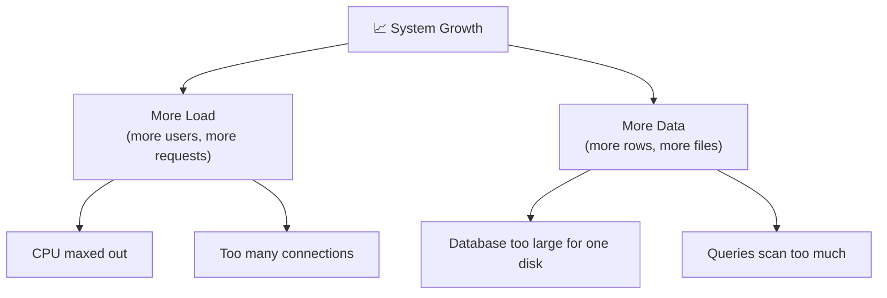

- **More load** → you need more *compute* to handle concurrent requests.
- **More data** → you need more *storage* and smarter data distribution.

These two pressures need different solutions. Confusing them is the most common scaling mistake — throwing more app servers at a problem that's actually a database bottleneck, or sharding a database when a single cache would have fixed everything.

> 💡 **Key Insight**
>
> Scaling always starts with one question: **what, specifically, is the bottleneck?** Not "the system is slow" — but *which resource, on which component, is saturated.* You cannot scale what you have not measured.

### The Golden Rule of Scaling

> **Find the bottleneck → fix that bottleneck → find the next one.**

A scaled system is never "done." You relieve one pressure point and the load moves to the next weakest link. Scaling is iterative by nature. The engineer's skill is knowing which technique relieves which bottleneck — which is exactly what the rest of this group teaches.

### Quick Recap — Why Scale

- Every server has hard limits: CPU, memory, disk, and network.
- Two distinct pressures force scaling: **more load** (compute) and **more data** (storage).
- Scaling is iterative: relieve one bottleneck and the next appears.
- You cannot scale what you have not measured.

---

## 2. Vertical vs Horizontal Scaling

When one machine isn't enough, you have exactly two options.

### Vertical Scaling (Scale Up) — Buy a Bigger Machine

Replace your server with a more powerful one: more CPU cores, more RAM, faster disks.

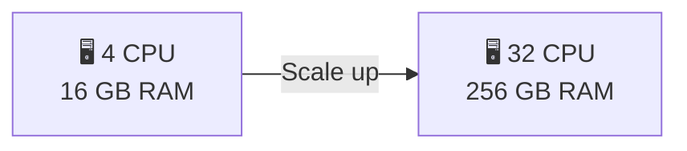

**Pros:**
- **Simple** — no code changes. Your app doesn't even know it's on a bigger box.
- No distributed-systems complexity: still one machine, one source of truth.

**Cons:**
- **There's a ceiling.** The biggest machine money can buy still has a limit.
- **Cost grows non-linearly.** A machine twice as powerful often costs far more than twice as much.
- **It's still a single point of failure.** One big server dying is worse than one of many small ones dying.

### Horizontal Scaling (Scale Out) — Add More Machines

Keep your machines the same size, but run *many* of them and split the work.

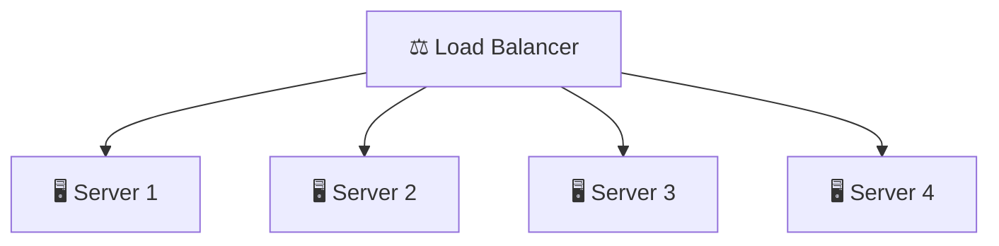

**Pros:**
- **Near-limitless scale** — need more capacity? Add another machine.
- **Fault tolerance** — if one server dies, the others keep serving.
- **Cost-efficient at scale** — many commodity machines beat one supercomputer.

**Cons:**
- **Complexity.** Now you need a load balancer, and your app must be designed to run as many copies at once (see Section 3).
- **Coordination problems.** State, sessions, and data consistency get harder — this is where distributed systems begin.

### Side by Side

| Dimension | Vertical (Scale Up) | Horizontal (Scale Out) |
|---|---|---|
| How | Bigger machine | More machines |
| Ceiling | Hard limit (biggest box) | Effectively unlimited |
| Complexity | Low | Higher (needs coordination) |
| Fault tolerance | Poor (single machine) | Good (redundancy built in) |
| Cost curve | Expensive at the top end | Linear with commodity hardware |
| Code changes | None | App must be stateless-friendly |

### How Engineers Actually Choose

It's not either/or. Real systems do both:

1. **Start vertical.** It's simple and buys you a lot of runway. Most systems never outgrow a well-sized single machine.
2. **Go horizontal when you must** — when you hit the ceiling, need fault tolerance, or need to scale beyond what one box can do.
3. **Databases are often the exception.** They're frequently scaled *up* first (they're stateful and hard to distribute) while the *stateless application tier* is scaled *out* freely.

> 💡 **Key Insight**
>
> Vertical scaling buys you *time*. Horizontal scaling buys you *headroom*. Smart teams scale up to stay simple as long as possible, then scale out when simplicity stops paying off.

### Quick Recap — Vertical vs Horizontal

- **Vertical** = bigger machine: simple, but has a hard ceiling and is a single point of failure.
- **Horizontal** = more machines: near-limitless and fault-tolerant, but adds coordination complexity.
- Start vertical; go horizontal when you hit the ceiling or need redundancy.
- The stateless app tier scales out easily; the stateful database is the hard part.

---

## 3. Stateless vs Stateful — The Key That Unlocks Horizontal Scaling

Horizontal scaling sounds simple: run many copies of your app behind a load balancer. But it only works if your app copies are *interchangeable*. And that depends entirely on one thing: **where the state lives.**

### What Is "State"?

**State** is any data a server remembers between requests: a logged-in user's session, items in a shopping cart, a partially uploaded file, an in-memory counter.

### The Problem With Stateful Servers

Imagine a server that stores each user's login session **in its own memory**:

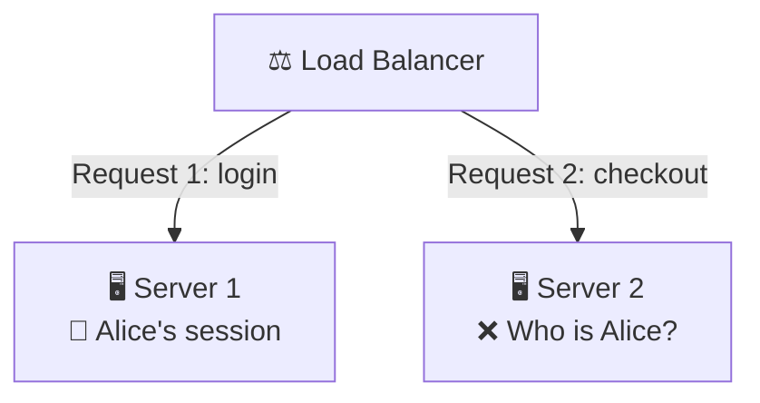

- Alice logs in → the load balancer sends her to **Server 1**, which stores her session in memory.
- Alice clicks "checkout" → the load balancer sends her to **Server 2**, which has *never heard of her*.
- Alice is logged out. Chaos.

Because the servers aren't interchangeable, you're forced into ugly workarounds like **sticky sessions** (pinning each user to one server) — which breaks fault tolerance (if that server dies, so does the session) and ruins load distribution.

### The Solution — Stateless Servers

Make the servers hold **no** per-user state. Push all state into shared, external storage:

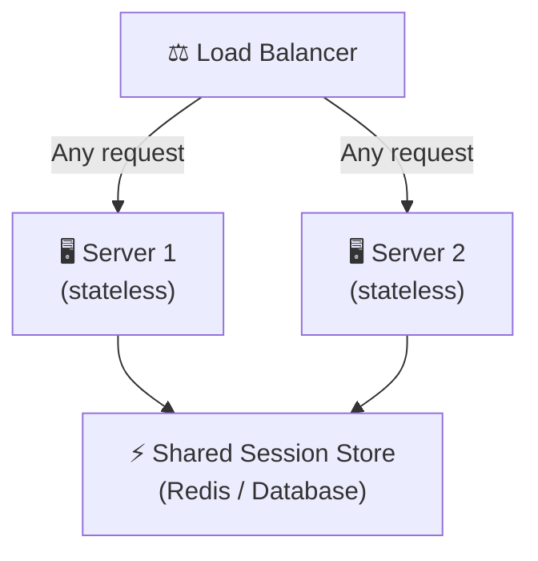

Now **any** server can handle **any** request, because the state lives in a shared store (like Redis) that all servers read from. Servers become interchangeable cattle, not precious pets.

> 💡 **Key Insight**
>
> **Statelessness is the single most important property for horizontal scaling.** A stateless service can be cloned infinitely, load-balanced freely, and restarted without losing anything. The state doesn't disappear — it *moves* to a shared store built to hold it.

### Where Does the State Go?

| State | Where it moves |
|---|---|
| User sessions | Redis / shared session store |
| Shopping carts | Database or Redis |
| Uploaded files | Object storage (S3) |
| In-memory counters | Redis / a database |

### Quick Recap — Stateless vs Stateful

- **State** is anything a server remembers between requests.
- **Stateful servers** aren't interchangeable → they force sticky sessions, which break fault tolerance and load distribution.
- **Stateless servers** hold no per-user state → any server can handle any request.
- The state doesn't vanish — it moves to a shared external store (Redis, DB, object storage).
- Statelessness is the precondition that makes horizontal scaling actually work.

---

## 4. Load Balancing — Spreading the Work

Once you run many app servers, one question appears immediately: **which server should each incoming request go to?** The answer is a **load balancer** — a component that sits in front of your servers and distributes traffic across them.

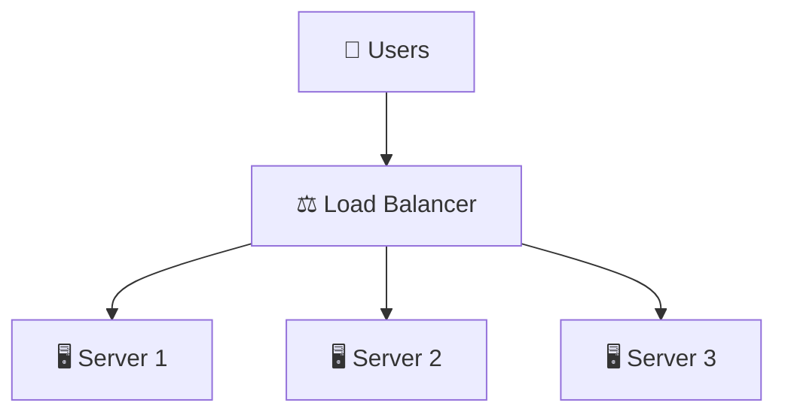

A load balancer does more than spread requests. It:

- **Distributes traffic** so no single server is overwhelmed.
- **Runs health checks** — if a server stops responding, the balancer stops sending it traffic.
- **Enables zero-downtime deploys** — drain one server, update it, return it to the pool, repeat.
- **Hides the fleet** — clients see one address; the pool behind it can grow or shrink freely.

### Load Balancing Algorithms (Intuition Level)

How does the balancer decide *which* server gets the next request? A few common strategies:

| Algorithm | How it decides | Best when |
|---|---|---|
| **Round Robin** | Next server in rotation | Servers are equal, requests are similar |
| **Least Connections** | Server with fewest active requests | Request durations vary a lot |
| **Weighted** | Bigger servers get more traffic | Servers have unequal capacity |
| **Hash-based** | Route by a key (e.g. user ID) | You need the same user to hit the same server |

Round robin is the sensible default. Least-connections shines when some requests are much slower than others.

### L4 vs L7 — Two Layers of Balancing

You'll hear load balancers described as "Layer 4" or "Layer 7" (the transport and application layers — Phase 03's TCP vs UDP topic covers what lives at each):

- **L4 (transport level)** — routes based on IP address and port. Fast, simple, doesn't look inside the request.
- **L7 (application level)** — reads the actual HTTP request. Can route by URL path, headers, or cookies (e.g. send `/api/*` to one pool and `/images/*` to another). More powerful, slightly more overhead.

> ⚠️ **The load balancer can become a single point of failure.** If all traffic flows through one balancer and it dies, everything dies. Production systems run **redundant load balancers** (and often DNS-level balancing in front of them) so there's no single choke point. We'll cover this fully in the Networking deep-dives.

### Quick Recap — Load Balancing

- A **load balancer** distributes incoming requests across many servers.
- It also does health checks, enables zero-downtime deploys, and hides the fleet behind one address.
- Common algorithms: **round robin** (default), **least connections** (varied request times), **weighted** (unequal servers), **hash-based** (stickiness).
- **L4** routes by IP/port; **L7** routes by inspecting the HTTP request.
- The balancer itself must be made redundant, or it becomes a single point of failure.

---

## 5. Scaling the Database

Here's the uncomfortable truth of scaling: **the app tier is easy, the database is hard.**

App servers are stateless — clone them and load-balance them all day. The database is *stateful*: it's the single source of truth, and you can't just run 10 independent copies that each accept writes without them disagreeing. This is why the database is almost always the *real* bottleneck.

Group 3 previewed the three core techniques. Here we go one level deeper into *when* to use each.

### 5.1 Read Replicas — Scaling Reads

Most applications read far more than they write (think 100:1 for a typical web app). If reads are your bottleneck, **replication** is the answer: one **primary** handles writes, and multiple **read replicas** serve reads.

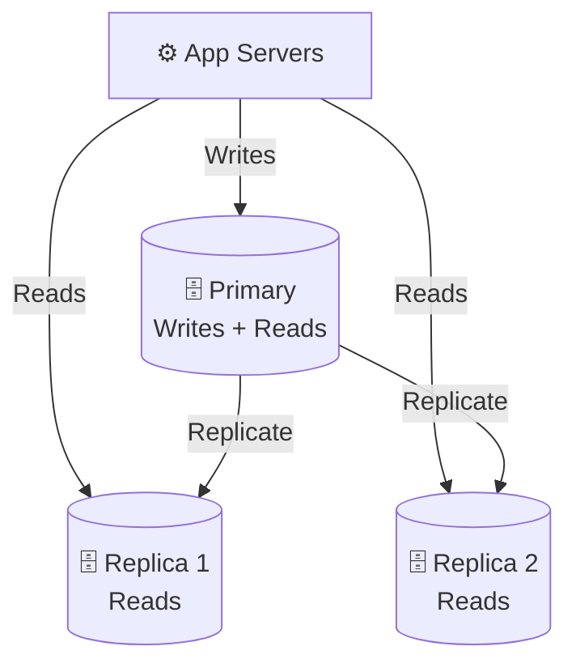

**Solves:** read-heavy load. Add replicas → add read capacity.
**Tradeoff:** **replication lag.** A replica may be a few milliseconds behind the primary, so a read right after a write might return stale data. Fine for a timeline; dangerous for "did my payment go through?"

### 5.2 Sharding — Scaling Writes and Data Volume

Replication doesn't help if the problem is **too many writes** or **too much data for one machine**. Every replica still holds the *entire* dataset and every write still hits the single primary. The answer is **sharding**: split the data across multiple databases, each holding a *subset*.

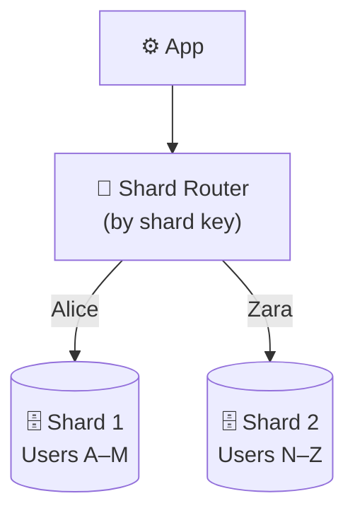

Each shard is an independent database handling its own reads *and* writes for its slice of the data. Ten shards ≈ ten times the write capacity and ten times the data ceiling.

**Solves:** write scale and datasets too big for one machine.
**Tradeoffs:**
- **Choosing the shard key is critical.** A bad key creates **hot spots** — one shard gets 90% of the traffic while the rest sit idle.
- **Cross-shard queries are painful.** "List all users sorted by signup date" now has to touch every shard and merge results.
- **Rebalancing hurts.** Adding a shard can mean moving huge amounts of data (Section 8 shows how to reduce this pain).

### 5.3 Partitioning — Splitting a Big Table

**Partitioning** splits one large table into smaller physical pieces within a single database — often by time:

```
orders_2026_q1   orders_2026_q2   orders_2026_q3 ...
```

A query for "orders this quarter" only touches the recent partition instead of scanning the whole table, and archiving old data is as cheap as dropping an old partition.

**Solves:** slow queries on huge tables; easy archival.
**Tradeoff:** more schema-management complexity.

### Which Technique for Which Bottleneck?

| Your bottleneck | Reach for |
|---|---|
| Too many **reads** | Read replicas |
| Too many **writes** | Sharding |
| **Dataset too large** for one machine | Sharding |
| Slow queries on one **huge table** | Partitioning |
| Need **fault tolerance** on the DB | Replication (with failover) |

> 💡 **Key Insight**
>
> Don't shard until you have to. Sharding multiplies operational complexity and is hard to undo. The usual order is: **add indexes → add read replicas → add caching → and only then shard.** Most systems get very far without ever sharding.

### Quick Recap — Scaling the Database

- The **database is the hard part** of scaling because it's stateful.
- **Read replicas** scale reads; the tradeoff is **replication lag** (possible stale reads).
- **Sharding** scales writes and data volume; the tradeoffs are shard-key choice, hot spots, and cross-shard queries.
- **Partitioning** splits one big table for faster queries and easy archival.
- Match the technique to the bottleneck — and delay sharding as long as you can.

---

## 6. Caching — The Highest-Leverage Technique

If there's one scaling technique that gives the most benefit for the least effort, it's **caching.** The idea is simple: store the result of an expensive operation so you don't have to redo it.

> **The core principle:** the fastest work is the work you never do.

A cache is a small, fast store (usually in memory, like Redis) that sits *in front of* something slow (usually a database or an expensive computation).

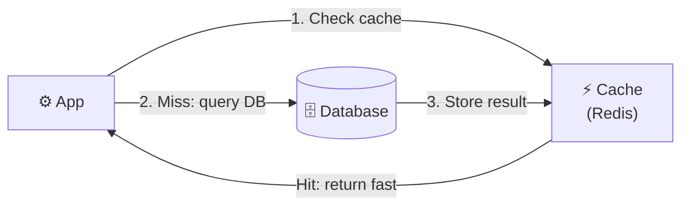

- **Cache hit** — the data is in the cache → return it in sub-millisecond time, database untouched.
- **Cache miss** — not in the cache → fetch from the database, store a copy, then return it.

If 95% of requests are cache hits, your database only handles 5% of the read traffic. That's often the difference between a database that's melting and one that's bored.

### Caching Lives at Every Layer

Caching isn't one thing in one place — it's a mindset applied all the way down the stack:

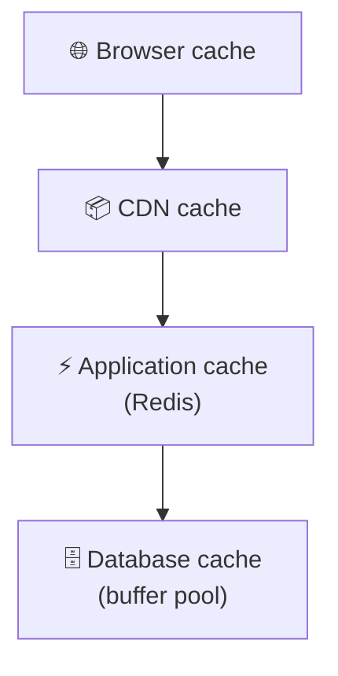

Each layer catches requests before they reach the slower layer beneath it.

### The Hard Part — Invalidation

Caching's benefit is obvious; its difficulty is hidden:

> **"There are only two hard things in computer science: cache invalidation and naming things."**

If the underlying data changes but the cache still holds the old value, users see **stale data.** Managing this is the real work of caching:

- **TTL (time to live)** — entries expire automatically after N seconds. Simple, but data can be stale until it expires.
- **Explicit invalidation** — delete or update the cache entry the moment the data changes. Accurate, but harder to get right everywhere.

> ⚠️ **Caching introduces a second copy of your data — and two copies can disagree.** Every cache is a bet that slightly-stale data is an acceptable price for speed. Usually it is. Sometimes (balances, inventory) it isn't. Cache deliberately, not everywhere. The specific strategies (write-through, write-back, cache-aside) and eviction policies (LRU, LFU) get their own deep-dive later.

### Quick Recap — Caching

- A **cache** stores expensive results in a fast store (e.g. Redis) to avoid redoing work.
- **Hit** = served fast from cache; **miss** = fetched from the source and then cached.
- A high hit rate can shield the database from the vast majority of read traffic.
- Caching exists at every layer: browser → CDN → application → database.
- The hard part is **invalidation** — keeping the cache from serving stale data (TTL vs explicit invalidation).

---

## 7. CDNs — Scaling Across Geography

Everything so far assumed the bottleneck is *capacity*. But there's another limit you can't fix with more servers: **the speed of light.**

If your server is in Virginia and a user is in Singapore, every request makes a ~15,000 km round trip. No amount of CPU makes physics faster — that's a fixed latency tax on every request.

A **Content Delivery Network (CDN)** solves this by putting copies of your content on servers (called **edge locations** or **PoPs**) physically close to users all over the world.

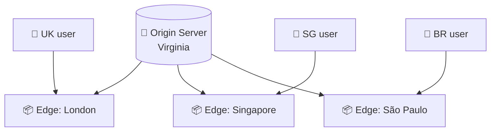

A user in Singapore is served from the Singapore edge — a few hundred kilometers away instead of fifteen thousand. This does two things at once:

1. **Slashes latency** — content travels a short distance.
2. **Offloads the origin** — the edge serves the content, so your origin server barely sees the traffic.

### What Belongs on a CDN?

CDNs shine for **static content** that's the same for everyone:

- Images, videos, fonts
- CSS and JavaScript files
- Downloadable files

They can also cache **dynamic content** at the edge with care, but the classic, high-value use is static assets — often the majority of the bytes a page loads.

> 💡 **Key Insight**
>
> A CDN is really just **caching applied to geography.** Same principle as Section 6 — serve a copy from somewhere faster than the source — but the "somewhere faster" is *physically closer* rather than *in memory*. It's the one scaling technique that beats a problem (distance) that more servers alone cannot.

### Quick Recap — CDNs

- Some latency comes from **physical distance**, not server capacity — the speed of light is fixed.
- A **CDN** caches content at **edge locations** near users worldwide.
- Result: **lower latency** for users and **less load** on the origin server.
- Ideal for **static assets** (images, video, CSS, JS); dynamic content needs more care.
- A CDN is caching applied to geography.

---

## 8. Consistent Hashing — Scaling Without Reshuffling

Sharding and distributed caches both face the same nasty problem: **how do you decide which node holds which piece of data — and what happens when you add or remove a node?**

### The Naïve Approach and Why It Breaks

The obvious method: `server = hash(key) % N`, where `N` is the number of servers.

It works — until `N` changes. Add one server (go from 4 to 5), and `% 4` becomes `% 5`, which changes the assignment for **almost every key**. Suddenly nearly your entire cache is invalid and every shard's data is in the wrong place. For a cache, that means a **near-total cache miss storm** that hammers your database exactly when you were trying to scale.

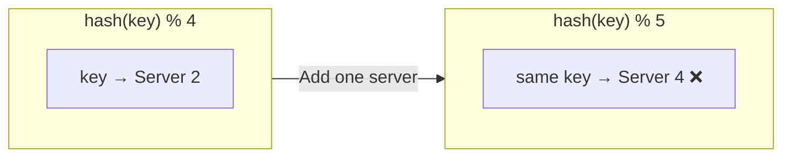

### The Idea Behind Consistent Hashing

**Consistent hashing** arranges both servers and keys around an imaginary **ring**. Each key belongs to the next server clockwise around the ring.

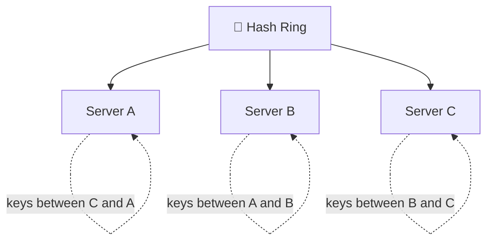

The magic: when you add or remove a server, **only the keys in that server's immediate arc move** — not everything. Adding a 5th server to 4 disturbs roughly **1/5 of the keys**, not all of them.

> 💡 **Key Insight**
>
> Consistent hashing is what makes distributed caches (like Memcached clusters) and many sharded databases *elastic* — you can add and remove nodes with minimal disruption. It turns "add a node" from a catastrophe into a routine operation. This is a light introduction; the algorithm (and refinements like **virtual nodes** to keep load even) gets a full deep-dive later.

### Quick Recap — Consistent Hashing

- Naïve `hash(key) % N` remaps **almost every key** whenever `N` changes → cache-miss storms and mass data movement.
- **Consistent hashing** places servers and keys on a **ring**; each key maps to the next server clockwise.
- Adding/removing a node moves only a **small fraction** of keys.
- It's what makes distributed caches and sharded stores elastic.

---

## 9. Putting It All Together — Scaling a System Through Growth

The best way to internalize scaling is to watch one system grow. Let's follow a startup — call it **Snaply**, a photo-sharing app — from launch to millions of users. Notice how at each stage a *new* bottleneck appears and a *specific* technique relieves it.

### Stage 0 — Launch: One Server

Everything on a single machine: app + database + file storage.

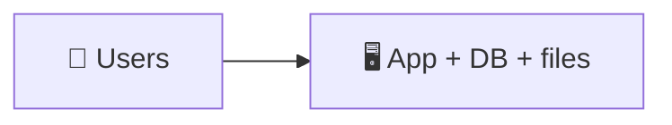

Simple, cheap, perfect for the first users. **Bottleneck: none yet.**

### Stage 1 — Separate the Database

The app and database compete for the same CPU and memory. Split them onto separate machines so each can be sized and scaled independently.

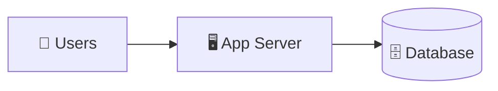

**Fixed:** resource contention. **Technique:** separation of concerns.

### Stage 2 — Add a Cache

The database is doing the same expensive read-queries over and over (popular photos, user profiles). Add Redis in front of it.

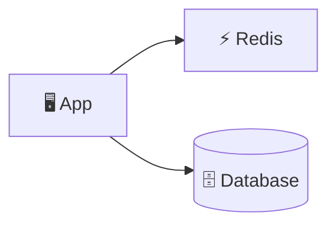

**Fixed:** repeated read load. **Technique:** caching. *(Highest leverage per dollar — usually the first thing to reach for.)*

### Stage 3 — Scale the App Tier Horizontally

One app server can't handle the traffic. Make the app **stateless** (sessions move to Redis), run several copies, and put a **load balancer** in front.

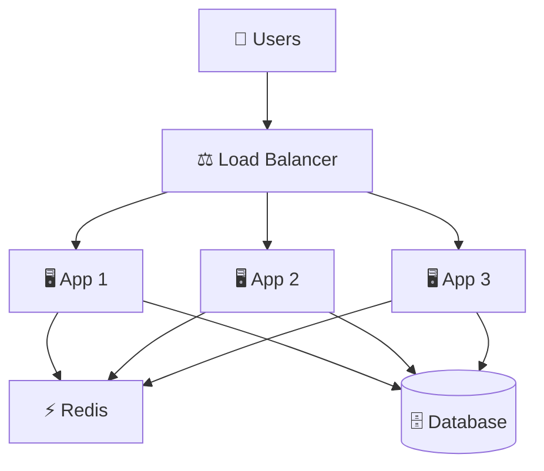

**Fixed:** app-tier compute limit. **Techniques:** statelessness + horizontal scaling + load balancing.

### Stage 4 — Add Read Replicas

Now the database is the bottleneck, and it's read-heavy. Add **read replicas** and send reads to them, writes to the primary.

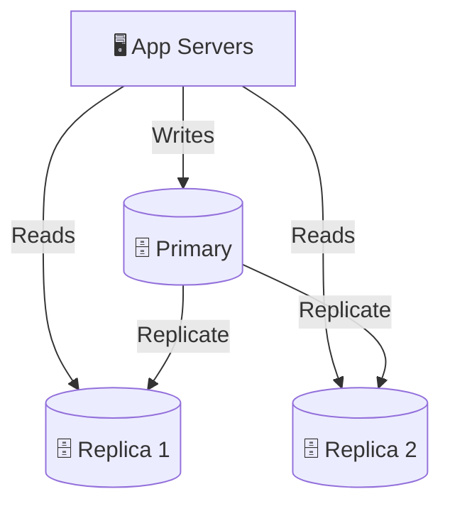

**Fixed:** read load on the DB. **Technique:** replication. *(Tradeoff accepted: minor replication lag.)*

### Stage 5 — Add a CDN and Object Storage

Photos are huge and users are global. Move image files to **object storage (S3)** and serve them through a **CDN** so users worldwide get them from a nearby edge — and the app servers stop wasting bandwidth on files.

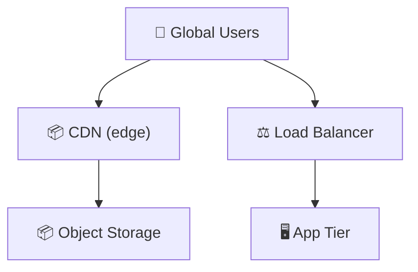

**Fixed:** global latency + bandwidth. **Techniques:** CDN + object storage.

### Stage 6 — Shard the Database

Success! Now there are so many writes and so much data that even the primary can't keep up and the dataset won't fit on one machine. Time to **shard** — split users across multiple independent databases, routed by a shard key. (Distributed caches use **consistent hashing** to stay elastic here too.)

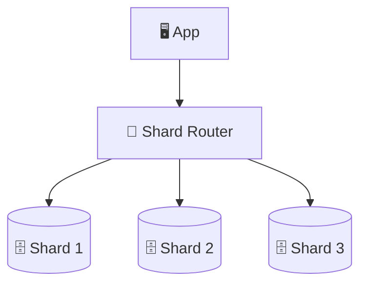

**Fixed:** write scale + data volume. **Technique:** sharding. *(The last resort — because it's the most complex and hardest to undo.)*

### The Pattern

Look back at the journey. At every stage the recipe was identical:

> **Find the bottleneck → apply the technique that relieves it → the load moves to the next weakest link.**

Notice the *order*, too — it's the order of increasing complexity: separate concerns → cache → scale the stateless tier → replicate → CDN → shard. You reach for the simplest, highest-leverage tool first and save the hard, irreversible ones for last.

> 💡 **The Meta-Insight**
>
> Nobody designs Stage 6 on day one. Over-engineering a photo app for a billion users before you have a thousand is its own kind of failure — wasted effort, wasted money, and complexity you don't need. **Scale for the problem you have, with an eye on the problem you'll have next.** Good scaling is just-in-time, not just-in-case.

---

## 10. Final Recap

| Concept | Core Insight | Biggest Tradeoff |
|---|---|---|
| **Why Scale** | Every server has hard limits (CPU, memory, disk, network); find the bottleneck before it finds you | Scaling is never "done" — the load just moves |
| **Vertical Scaling** | Bigger machine — simple, no code changes | Hard ceiling; single point of failure; costly at the top |
| **Horizontal Scaling** | More machines — near-limitless and fault-tolerant | Adds coordination and distributed-systems complexity |
| **Stateless Design** | Move state to a shared store so any server can serve any request | Requires an external store (Redis/DB) for state |
| **Load Balancing** | Distribute traffic across servers; health-check and hide the fleet | The balancer itself must be made redundant |
| **Read Replicas** | Scale reads by copying data to read-only replicas | Replication lag → possible stale reads |
| **Sharding** | Scale writes and data volume by splitting data across DBs | Shard-key choice, hot spots, hard cross-shard queries |
| **Partitioning** | Split one big table for faster queries and easy archival | More schema-management complexity |
| **Caching** | The fastest work is the work you never do; shield the DB from repeated reads | Cache invalidation → risk of stale data |
| **CDN** | Caching applied to geography — serve content from near the user | Best for static content; dynamic caching is tricky |
| **Consistent Hashing** | Add/remove nodes while moving only a fraction of keys | Needs virtual nodes to keep load even |

### The One Thing to Remember

> **Scaling is not about adding servers. It's about relentlessly finding the *next* bottleneck and applying the *simplest* technique that relieves it — no sooner than you must, and no more than you need.**

---

## What's Next

> **Group 5 — Distributed Systems Foundations**

You now know how to make a system handle more load. But the moment you spread a system across many machines — replicas, shards, caches, load-balanced servers — a deeper question appears:

> **What happens when those machines disagree, or when the network between them fails?**

Group 5 tackles the truths that scaling forces on you:

- Why a network of machines can never be perfectly consistent *and* perfectly available at the same time (the **CAP theorem**)
- **Consistency models** — strong vs eventual, and why "the database is always right" stops being true
- How machines agree on anything at all — **consensus**, **leader election**, and **replication** revisited
- What "failure" really means when there's no single machine to blame

You've learned to scale a system. Group 5 is where you learn to keep it *correct* while it's scaled.

---
