# Group 5 — Distributed Systems Foundations

> **Phase:** Foundation → **Group:** 5 of 6 → **Read time:** ~50 minutes

---

## Before You Begin

In Group 4, you learned to scale a system: run many app servers, add read replicas, shard the database, cache aggressively, push content to the edge.

Every one of those techniques did the same thing — it spread your system across **more than one machine.**

And the moment your system lives on more than one machine, you've crossed a line. You are no longer building a program; you are building a **distributed system.** A new class of problem appears — one that has nothing to do with speed or capacity:

> **What happens when those machines disagree, or when the network between them fails?**

On a single machine, this never happens. There's one clock, one memory, one source of truth. If a function is called, it runs. If a value is written, it's there.

Across a network, none of that holds. Messages get lost. A machine that looks dead is just slow. Two replicas of the same data hold two different values. There is no shared clock to say which write happened "first." Failure is no longer all-or-nothing — parts of the system work while others don't, at the same time.

This group is about that world. You'll learn what a distributed system actually is, why it's fundamentally hard, and the core ideas engineers use to reason about it — **consistency models**, the **CAP theorem**, how machines **coordinate**, and how systems **survive failure**.

These are the ideas that separate "I can build a feature" from "I can design a system that stays correct when things go wrong." They get full deep-dives later. Here, you build the mental model that makes those deep-dives click.

> **The mindset shift:** On one machine, you reason about *logic*. Across many machines, you reason about *failure*. Distributed systems design is failure-first thinking.

---

## Table of Contents

1. [Big Picture — What Is a Distributed System?](#1-big-picture--what-is-a-distributed-system)
2. [Why Distributed Systems Are Hard — The Fallacies](#2-why-distributed-systems-are-hard--the-fallacies)
3. [Consistency Models — What "Consistent" Even Means](#3-consistency-models--what-consistent-even-means)
4. [The CAP Theorem — The Central Tradeoff](#4-the-cap-theorem--the-central-tradeoff)
5. [PACELC — Beyond CAP](#5-pacelc--beyond-cap)
6. [How Machines Coordinate](#6-how-machines-coordinate)
7. [Handling Failure Gracefully](#7-handling-failure-gracefully)
8. [Putting It All Together](#8-putting-it-all-together)
9. [Final Recap](#9-final-recap)

---

## 1. Big Picture — What Is a Distributed System?

A **distributed system** is a group of independent computers that cooperate to appear, to the user, as a single coherent system.

You already use dozens of them. When you open a web app, your request might touch a load balancer, five app servers, three database replicas, a cache cluster, and a CDN edge node — across multiple data centers on multiple continents. You experience "one website." It is, in reality, hundreds of machines pretending to be one.

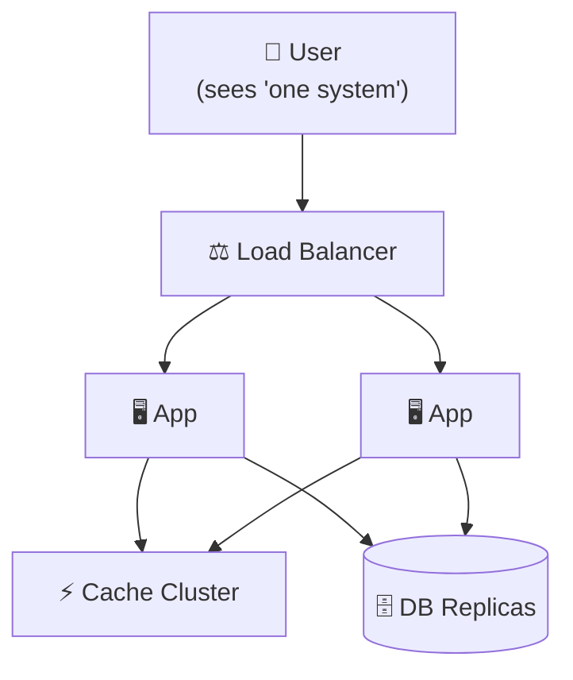

### Why Do We Even Build Them?

Nobody chooses distributed systems for fun — they're harder in every way. We're *forced* into them for exactly the reasons you saw in Group 4:

| Reason | What forces it |
|---|---|
| **Scale** | One machine can't handle the load or hold the data |
| **Fault tolerance** | If one machine dies, the system must keep running |
| **Low latency** | Users are global; you must be physically near them |

Every distributed system is a trade: you accept enormous complexity in exchange for scale, resilience, and reach that a single machine can never provide.

### The Two Truths That Change Everything

Almost every hard problem in distributed systems traces back to just two facts that don't exist on a single machine:

**1. The network is unreliable.**
Messages can be lost, delayed, duplicated, or reordered. And critically — when you send a request and hear nothing back, **you cannot tell why.** Did the request never arrive? Did it succeed but the *reply* got lost? Is the other machine just slow? From the outside, a crashed machine and a slow machine look *identical*. This single ambiguity is the source of most distributed-systems pain.

**2. There is no shared clock.**
Each machine has its own clock, and they drift. So there is no universal "now," and no reliable way to say which of two events on two machines happened *first*. "Order" — something you take completely for granted on one CPU — becomes a genuinely hard problem.

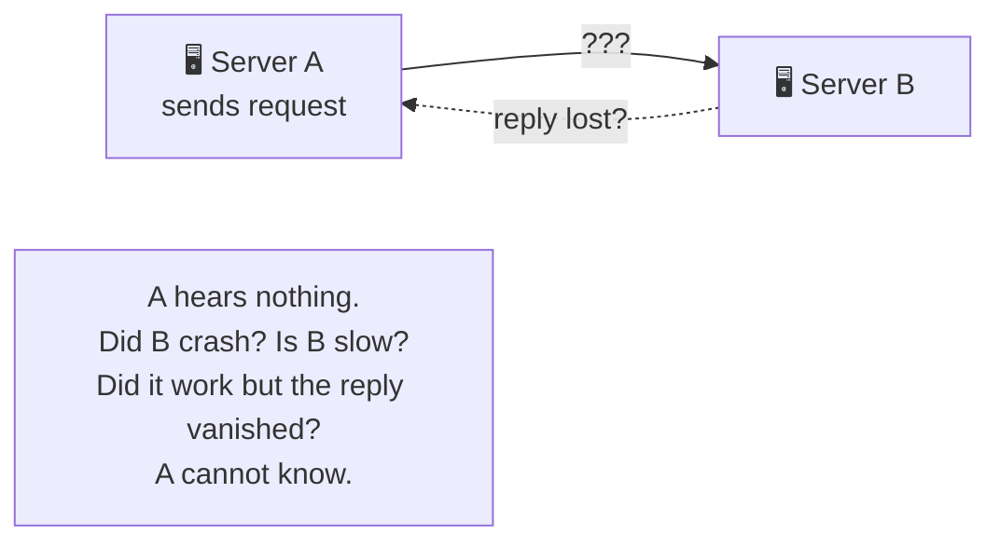

> 💡 **Key Insight**
>
> **Partial failure** is the defining feature of a distributed system. On one machine, either everything works or everything crashes. Across a network, *some* parts work while *others* fail — silently, at the same time — and you often can't tell which. Designing for that ambiguity is the entire discipline.

### Quick Recap — What Is a Distributed System

- A **distributed system** is many independent machines cooperating to look like one.
- We build them (despite the pain) for **scale**, **fault tolerance**, and **low latency**.
- Two facts change everything: the **network is unreliable**, and there is **no shared clock**.
- A crashed machine and a slow machine look identical from the outside.
- **Partial failure** — some parts working while others fail — is the core challenge.

---

## 2. Why Distributed Systems Are Hard — The Fallacies

In the 1990s, engineers at Sun Microsystems noticed that newcomers to distributed systems kept making the *same* wrong assumptions — assumptions that are perfectly true on one machine and dangerously false across a network. They wrote them down as **The Fallacies of Distributed Computing.**

Every one of them is a comfortable belief that will eventually cause an outage.

| # | The Fallacy ("we assume…") | The Reality |
|---|---|---|
| 1 | **The network is reliable** | Packets drop; connections fail. Design for it. |
| 2 | **Latency is zero** | A remote call is thousands of times slower than a local one. |
| 3 | **Bandwidth is infinite** | Links saturate; large payloads clog the pipe. |
| 4 | **The network is secure** | Anything on the wire can be seen or tampered with. |
| 5 | **Topology doesn't change** | Machines come and go; IPs change; nodes are added and removed. |
| 6 | **There is one administrator** | Many systems, many owners, many failure sources. |
| 7 | **Transport cost is zero** | Serialization, bandwidth, and infrastructure all cost. |
| 8 | **The network is homogeneous** | Different machines, protocols, and versions must interoperate. |

You don't need to memorize the list. You need the *pattern* behind it:

> **Every convenience you rely on within a single process — instant calls, guaranteed delivery, a shared truth — quietly disappears the moment a network is involved.**

### Why This Matters in Practice

Consider one innocent line of code: `user = getUser(id)`.

- **On one machine**, it's a function call. It returns in nanoseconds. It always returns.
- **Across a network**, that same line is a remote request. It might take 200ms. It might time out. It might succeed but the response gets lost. It might return *stale* data from a lagging replica.

The code looks identical. The reality is worlds apart. Distributed systems are hard precisely because the *hardest problems are invisible in the code* — they live in the gaps between the machines.

> ⚠️ **The most dangerous assumption is #1.** Beginners write code as if the network always works, test it on one machine where it always does, and ship it. Then in production — at 3 a.m., under load — a packet drops, and behavior nobody designed for takes over. Assume failure from line one.

### Quick Recap — Why They're Hard

- The **Fallacies of Distributed Computing** are the false-but-comfortable assumptions newcomers make.
- The unifying pattern: guarantees you get for free *within* a process vanish *across* a network.
- The same line of code means something completely different locally vs remotely.
- The hardest bugs are invisible in the code — they live between the machines.
- Assume the network will fail, from the very first line.

---

## 3. Consistency Models — What "Consistent" Even Means

The moment you keep **more than one copy** of data — a database and its replicas, a cache in front of a database, shards syncing state — a question appears that never existed on a single machine:

> **If two copies can disagree, what does the user actually see?**

The answer is a choice, not an accident. A **consistency model** is the contract a system makes about *when* a write becomes visible and *which* value a reader gets. It sits on a spectrum, and the two ends anchor everything in between.

### Strong Consistency

**The guarantee:** the instant a write succeeds, *every* subsequent read — from any replica — returns that new value. The system behaves as if there were only one copy.

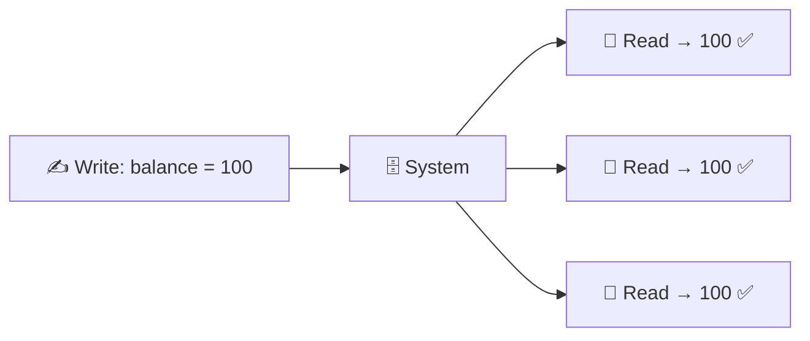

- **Feels like:** a single, always-correct machine. Intuitive and safe.
- **Cost:** the system must coordinate across replicas *before* confirming the write — which means more latency, and if replicas can't be reached, the write may have to **block or fail**.
- **Use when:** correctness is non-negotiable — bank balances, inventory counts, "did my payment go through?"

### Eventual Consistency

**The guarantee:** if writes stop, all copies will *eventually* converge to the same value. But for a short window, different readers may see different (stale) values.

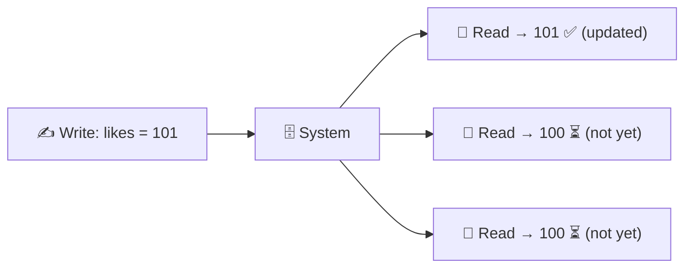

- **Feels like:** occasionally out-of-date, but fast and always available.
- **Cost:** the application must tolerate temporarily stale reads.
- **Use when:** availability and speed matter more than instant accuracy — like counts, view counters, social feeds, DNS.

### The Real-World Spectrum

Strong and eventual are the endpoints; production systems live all along the line, often with useful middle grounds:

| Model | Guarantee | Classic example |
|---|---|---|
| **Strong** | Every read sees the latest write | Bank account balance |
| **Read-your-writes** | *You* always see your own writes (others may lag) | Editing your own profile |
| **Causal** | Related events are seen in order (cause before effect) | Comment appears after the post it replies to |
| **Eventual** | All copies converge... eventually | Like counts, view counts |

> 💡 **Key Insight**
>
> "Consistent" is not one thing — it's a **dial**, and turning it is a business decision, not just a technical one. A like counter that's stale for two seconds is fine; a bank balance that's stale for two seconds is a lawsuit. Engineers pick the *weakest* model the use case can tolerate, because weaker consistency buys speed and availability.

### Quick Recap — Consistency Models

- With multiple copies of data, you must choose **when** a write becomes visible.
- **Strong consistency** = every read sees the latest write; safe but slower and less available.
- **Eventual consistency** = copies converge over time; fast and available but temporarily stale.
- Real systems use a **spectrum** (read-your-writes, causal, …) between the two.
- Pick the **weakest** model the use case can safely tolerate.

---

## 4. The CAP Theorem — The Central Tradeoff

Why can't a distributed system just be strongly consistent *and* always available? The **CAP theorem** explains why — and it's the single most important idea in this group.

It says that a distributed system can offer at most **two** of these three properties at the same time:

- **C — Consistency:** every read sees the most recent write (the strong consistency from Section 3).
- **A — Availability:** every request gets a (non-error) response, even if some machines are down.
- **P — Partition tolerance:** the system keeps working even when the network between machines is broken (a **partition**).

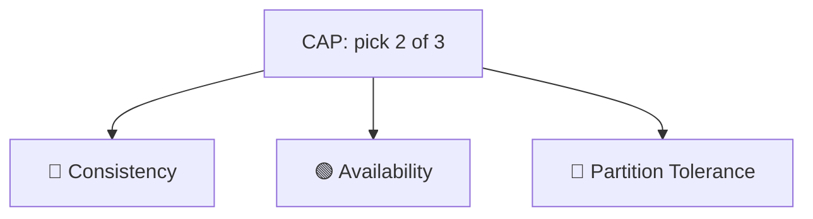

### The Catch — P Is Not Optional

Here's what makes CAP a *real* decision rather than an academic one: **in a distributed system, network partitions are a fact of life.** Cables get cut, switches fail, data centers lose connectivity. You *cannot* choose to not have partitions — so you *must* tolerate them.

That collapses "pick 2 of 3" into a much sharper choice. **When a partition happens, you get exactly one decision:**

> **Do you sacrifice Consistency, or sacrifice Availability?**

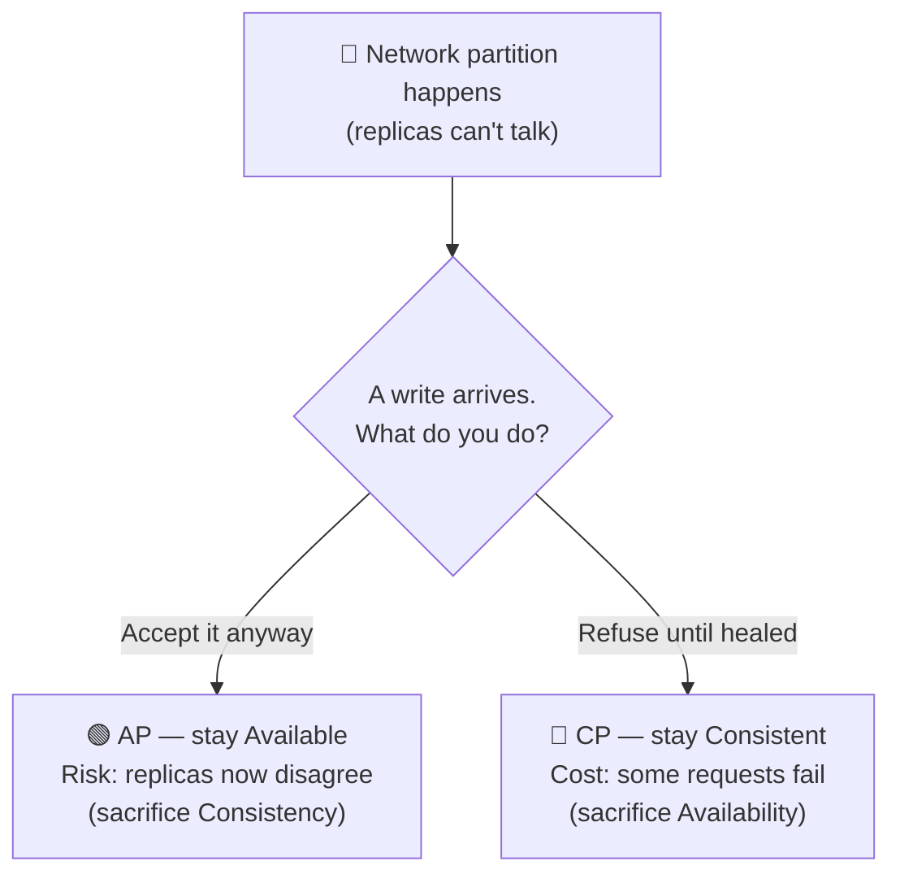

- **CP (Consistency + Partition tolerance):** during a partition, refuse requests you can't safely serve. The system may return errors, but it **never gives a wrong answer.** → *banking, inventory, anything where wrong ≫ unavailable.*
- **AP (Availability + Partition tolerance):** during a partition, keep answering with whatever data you have. The system **stays up** but may return **stale or conflicting** data (reconciled later). → *social feeds, shopping carts, DNS — anything where "up" ≫ "perfectly correct."*

### It's Not All-or-Nothing

CAP describes behavior **during a partition** — which is rare. The rest of the time (the vast majority), a well-built system can be both consistent *and* available. CAP isn't a permanent label on your system; it's the answer to *"when the network splits, which way do you fall?"*

> 💡 **Key Insight**
>
> CAP is not about picking a database brand — it's about a promise you make to your users for the worst moment. "When I can't guarantee correctness, do I go *down* (CP) or go *wrong* (AP)?" Amazon famously chose **AP** for shopping carts: better to let you keep adding items (and reconcile later) than to show an error and lose the sale.

### Quick Recap — CAP Theorem

- A distributed system can guarantee at most **two** of **C**onsistency, **A**vailability, **P**artition tolerance.
- Partitions are unavoidable, so **P is mandatory** — the real choice is **C vs A during a partition**.
- **CP** systems stay correct but may reject requests (banking, inventory).
- **AP** systems stay up but may serve stale/conflicting data (feeds, carts, DNS).
- The tradeoff only bites *during* a partition; otherwise you can have both.

---

## 5. PACELC — Beyond CAP

CAP has a blind spot: it only describes what happens **during a partition.** But partitions are rare. What governs your system the other 99.9% of the time?

**PACELC** extends CAP to answer that. Read it as a sentence:

> **If** there is a **P**artition, choose between **A**vailability and **C**onsistency —
> **E**lse (normal operation), choose between **L**atency and **C**onsistency.

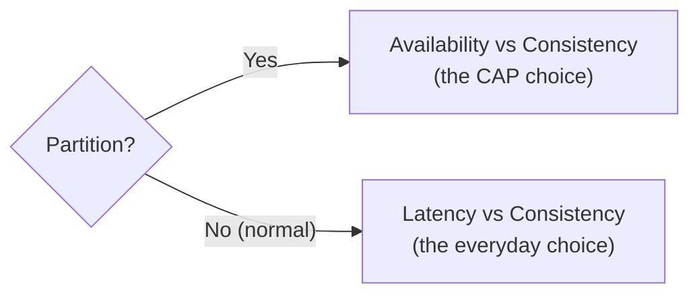

The second half is the insight most people miss: **even when the network is perfectly healthy, strong consistency still costs latency.** To guarantee every read sees the latest write, replicas must coordinate on every operation — and coordination takes time. So a system that insists on strong consistency pays a *latency tax on every single request*, partition or not.

That's why many high-scale systems relax consistency **even in normal operation** — not because they fear partitions, but because they refuse to pay that latency tax billions of times a day.

| System style | During partition | Normal operation |
|---|---|---|
| **PA/EL** (e.g. Dynamo-style, Cassandra) | Availability | Low latency (relax consistency) |
| **PC/EC** (e.g. traditional RDBMS) | Consistency | Consistency (accept the latency) |

> 💡 **Key Insight**
>
> CAP asks "what about the disaster?" PACELC adds "...and what about *every ordinary Tuesday*?" The everyday **latency vs consistency** tradeoff shapes far more of a system's design than the rare partition ever will.

### Quick Recap — PACELC

- CAP only covers the (rare) partition case; **PACELC** adds the normal case.
- **If Partition:** Availability vs Consistency. **Else:** Latency vs Consistency.
- Strong consistency costs latency **even when the network is healthy** — coordination isn't free.
- Many systems relax consistency in normal operation to avoid paying that tax constantly.

---

## 6. How Machines Coordinate

If there's no shared clock and the network can fail, how does a group of machines ever *agree* on anything — which one is in charge, which value is correct, who's even still alive? This is the **coordination** problem, and a handful of core patterns solve it. Here's the intuition for each.

### Heartbeats — "Are You Still Alive?"

Machines can't tell a crashed peer from a slow one (Section 1). So they don't try to — instead, every machine periodically sends a small **heartbeat** message: *"I'm still here."* Miss a few in a row, and the others declare that machine dead and route around it.

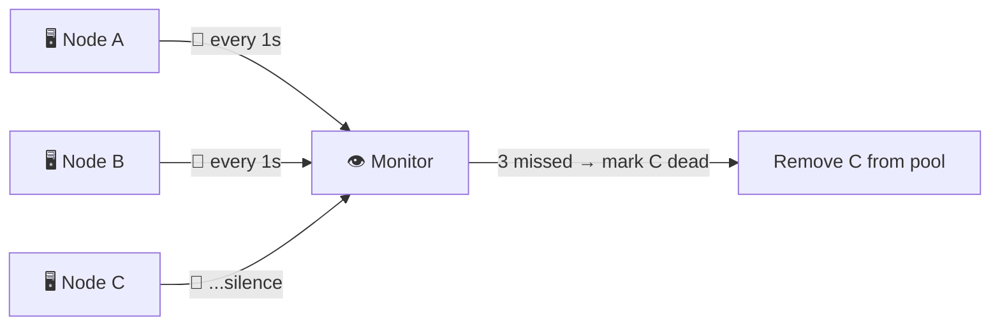

The catch: set the timeout too short and you'll declare healthy-but-slow machines dead (false alarms); too long and you're slow to react to real failures. That tension never fully goes away.

### Leader Election — "Who's in Charge?"

Many problems get dramatically simpler if *one* machine is the designated decision-maker (the **leader**), and the rest are **followers**. A single leader means one place where writes are ordered — no disagreement about what happened first.

But what if the leader dies? The remaining machines run a **leader election** to promote a new one, so the system heals itself without a human.

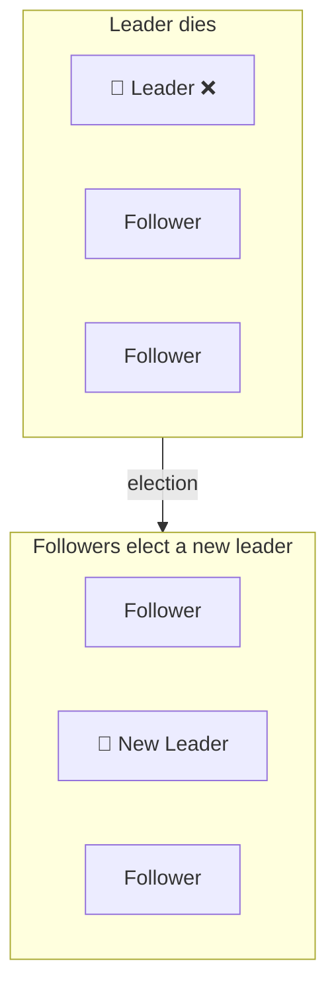

### Consensus — "Let's All Agree, Even If Some Fail"

Sometimes a group must **agree on a single value** — the next leader, the order of writes, whether a transaction committed — and the agreement must survive machines crashing and messages getting lost. This is **consensus**, the hardest and most fundamental coordination problem.

The key idea most consensus systems use is a **quorum**: don't wait for *everyone* to agree (one dead machine would freeze you forever) — wait for a **majority**. With 5 machines, get 3 to agree and you can proceed. Because any two majorities overlap, no two conflicting decisions can ever both win.

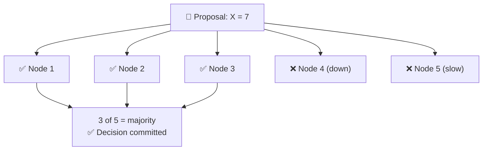

Algorithms like **Raft** and **Paxos** make this reliable. You don't need their internals yet — just the mental model: **majority agreement, so the system decides even when a minority fails.** (Full deep-dive comes later.)

### Replication, Revisited

Group 4 introduced replication for *scale* (read replicas) and *fault tolerance* (copies survive a crash). Now you can see its hidden cost clearly: **every replica is another copy that can disagree.** Replication and consistency are two sides of one coin — the more you replicate for safety and speed, the harder you must work to keep the copies in agreement. That's the tension the whole rest of this group is about.

> 💡 **Key Insight**
>
> Coordination is expensive — every heartbeat, election, and quorum vote is network traffic and waiting. So the golden rule is: **coordinate as little as possible.** The best distributed designs find ways for machines to act independently and only synchronize when they truly must. Cheap coordination is fast; unavoidable coordination is where the latency lives.

### Quick Recap — Coordination

- **Heartbeats** detect failure by periodic "I'm alive" messages (with false-alarm vs slow-detection tension).
- **Leader election** designates one decision-maker and auto-promotes a new one when it dies.
- **Consensus** gets machines to agree on one value despite crashes, using a **majority quorum**.
- **Replication** buys scale and safety but multiplies the copies that can disagree.
- Coordination is costly — the best designs minimize it.

---

## 7. Handling Failure Gracefully

In a distributed system, failure isn't an exception — it's the *normal operating condition*. At any moment, *something* is slow, restarting, or unreachable. A well-designed system doesn't try to prevent failure (impossible); it's built to **absorb** it. A few foundational patterns do most of that work.

### Timeouts — Never Wait Forever

Because a dead machine and a slow one look identical, you must never wait indefinitely for a response. A **timeout** puts a ceiling on the wait: *"if I don't hear back in 2 seconds, I'll stop waiting and handle it."* Without timeouts, one stuck dependency can freeze every thread and take down the whole system.

### Retries + Backoff — Try Again, But Politely

Many failures are *transient* — a blip, a moment of overload. A **retry** simply attempts the request again. But naïve retries are dangerous: if a service is struggling and *everyone* retries immediately, the flood of retries finishes the job and kills it (a **retry storm**).

The fix is **exponential backoff with jitter**: wait a little before the first retry, then double the wait each time (1s, 2s, 4s…), plus a small random offset so clients don't all retry in sync.

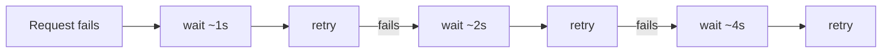

### Idempotency — Make Retries Safe

Retries create a subtle danger. Remember Section 1: a request might *succeed* but its reply gets lost. You retry — and now the operation runs **twice.** If that operation is "charge the customer $50," you've charged them $100.

The answer is **idempotency**: design operations so that doing them multiple times has the same effect as doing them once (often via a unique request ID the server remembers). Idempotency is what makes retries *safe* — and retries are what make a system *resilient*. You can't have one without the other.

### Circuit Breakers — Stop Kicking a Dead Machine

If a downstream service is clearly failing, hammering it with requests (and retries) only makes things worse and ties up your own resources waiting for timeouts. A **circuit breaker** watches the failure rate and, once it crosses a threshold, "trips" — it stops sending requests and **fails fast** for a while, giving the struggling service room to recover before cautiously trying again.

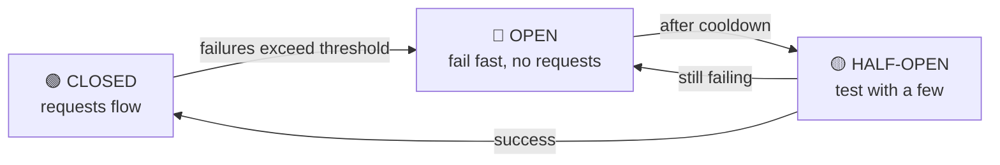

### Graceful Degradation — Bend, Don't Break

When something fails, a good system **degrades** instead of collapsing: show cached (slightly stale) data if the database is down; hide the recommendations panel if that service is unavailable, but still let people check out. The user gets a *diminished* experience instead of an *error page*. A shopping site that can't show "you may also like" but still takes orders has failed *gracefully*.

> 💡 **Key Insight**
>
> These patterns share one philosophy: **isolate failure so it can't spread.** The nightmare of distributed systems is the **cascading failure** — one slow service fills up its callers' threads, which stall *their* callers, and the whole system topples like dominoes. Timeouts, circuit breakers, and graceful degradation are all firewalls that stop one failure from becoming an outage.

### Quick Recap — Handling Failure

- **Timeouts** stop you waiting forever on a dead-or-slow machine.
- **Retries with exponential backoff + jitter** recover from transient failures without causing a retry storm.
- **Idempotency** makes retries safe by ensuring repeats have no extra effect.
- **Circuit breakers** fail fast when a dependency is down, giving it room to recover.
- **Graceful degradation** offers a reduced experience instead of a total failure.
- The goal of all of them: **contain failure and prevent cascades.**

---

## 8. Putting It All Together

Let's watch every idea in this group work together in one story. **A user posts a comment** on a globally distributed social app, and someone across the world reads it.

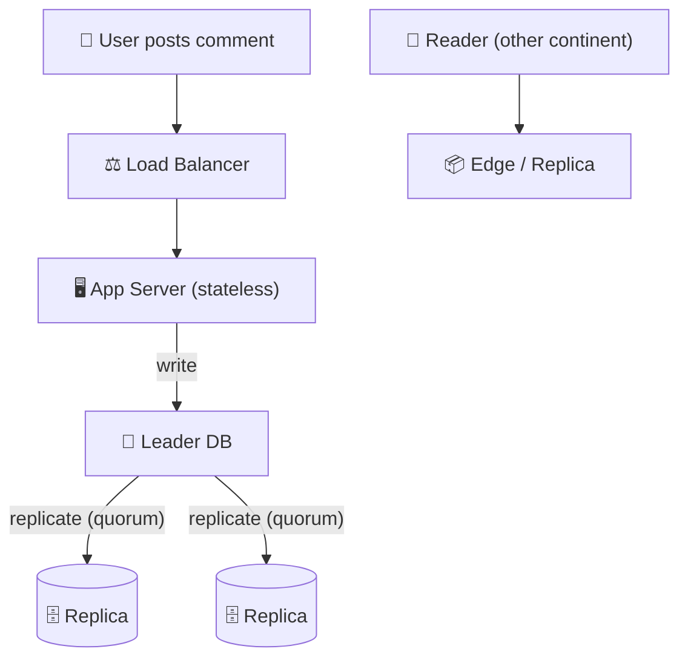

Follow the decisions an engineer makes at each step — every one is a concept from this group:

1. **The write goes to the leader.** There's a single **leader** (Section 6) so all writes are ordered in one place — no disagreement about what came first.

2. **The leader replicates to a quorum.** It waits for a **majority** of replicas to acknowledge (Section 6) before confirming success — so the comment survives even if one replica dies moments later.

3. **A consistency choice is made.** Should the leader wait for *all* replicas (strong, slower) or confirm after a quorum and sync the rest lazily (eventual, faster)? For a comment, **eventual consistency** (Section 3) is the right call — a half-second of lag is invisible to users, and speed matters more.

4. **A partition strikes.** Mid-write, the network splits and the leader can't reach some replicas. Now the **CAP** choice (Section 4) is forced: this is a social feed, so the system chooses **AP** — accept the comment and reconcile later, rather than show the user an error.

5. **The reader, far away, gets a fast answer.** Their read is served from a nearby **replica/edge** (Section 6, and Group 4's CDN). It might be a few hundred milliseconds behind — **eventual consistency** in action — but it's fast and always available. This is the **PACELC** "else" branch (Section 5): in normal operation, the system trades consistency for latency.

6. **Something fails — and the system bends, not breaks.** A replica is briefly unreachable, so the app **times out** and **retries with backoff** (Section 7). The write is **idempotent** (Section 7), so the retry can't double-post the comment. If the whole comment service is down, the page **degrades gracefully** (Section 7) — it still shows the post, just without the latest comments.

**The takeaway:** not one of these decisions existed on a single machine. Every step is a conscious trade between **consistency, availability, latency, and resilience** — and making those trades *deliberately*, with eyes open, is exactly what distributed systems design *is*.

---

## 9. Final Recap

| Concept | Core Insight | Biggest Tradeoff |
|---|---|---|
| **Distributed System** | Many machines cooperating to look like one; built for scale, fault tolerance, and low latency | Enormous complexity; partial failure is unavoidable |
| **The Two Truths** | The network is unreliable and there's no shared clock — a crashed node looks like a slow one | You must design for ambiguity you can't resolve |
| **The Fallacies** | Guarantees you get free within a process vanish across a network | The hardest bugs are invisible in the code |
| **Consistency Models** | "Consistent" is a dial from strong to eventual, not a yes/no | Stronger = safer but slower and less available |
| **CAP Theorem** | During a partition, you must choose Consistency *or* Availability | CP goes *down*; AP goes *(temporarily) wrong* |
| **PACELC** | Even without partitions, strong consistency costs latency | Coordination is never free |
| **Coordination** | Heartbeats, leader election, and majority-quorum consensus let machines agree | Coordination is expensive — minimize it |
| **Replication** | Copies give scale and safety but can disagree | More copies = harder consistency |
| **Failure Handling** | Timeouts, retries+backoff, idempotency, circuit breakers, graceful degradation | Every safeguard adds complexity |
| **Failure-First Design** | Contain failure so it can't cascade across services | You optimize for the bad day, not the good one |

### The One Thing to Remember

> **In a distributed system, failure is not an edge case — it's the default. You don't design to prevent it; you design so that when parts fail (and they will), the system stays correct, available, or fast — knowing you often can't have all three at once.**

---

## What's Next

> **Group 6 — Architecture Patterns**

You've now built the full foundation: networking (G1), APIs (G2), storage (G3), scaling (G4), and the distributed-systems reality that ties them together (G5). You understand the *building blocks* and the *hard truths*.

Group 6 — the final foundational group — assembles them into the **architectural patterns** real systems are built from:

- **Monolith vs microservices** — one big app vs many small services, and the real tradeoffs
- **Event-driven architecture** — services communicating through events instead of direct calls
- **Serverless** — running code without managing servers
- **How to choose** — matching an architecture to the problem, not the hype

You've learned how the pieces work and how they fail. Group 6 is where you learn how to *arrange* them into a whole system — and it completes the Top 30 foundations.

---
