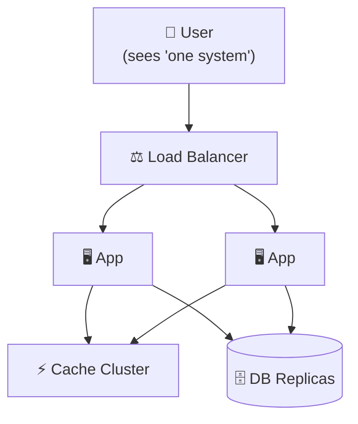
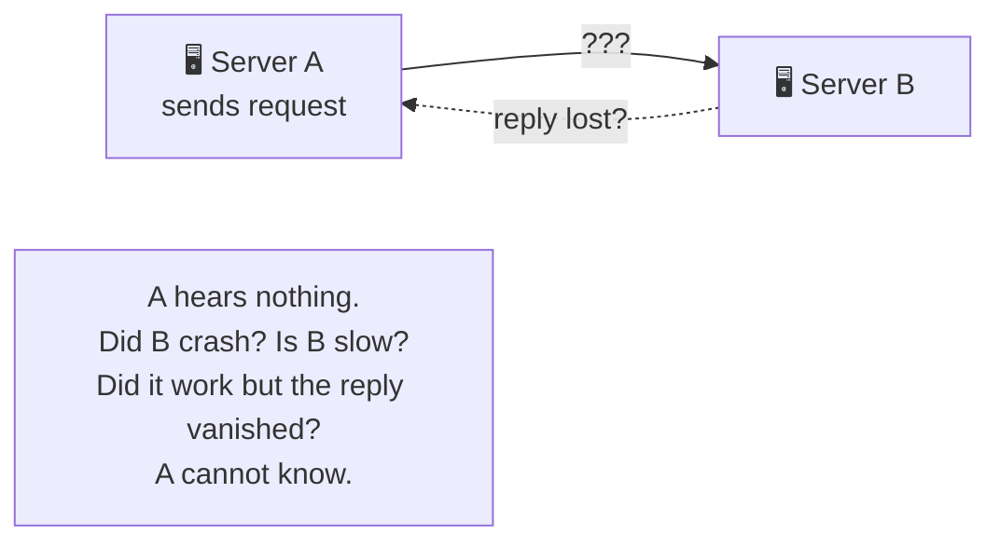

# Group 5 — Distributed Systems Foundations

> **Phase:** Foundation → **Group:** 5 of 6 → **Read time:** ~50 minutes

---

## Before You Begin

In Group 4, you learned to scale a system: run many app servers, add read replicas, shard the database, cache aggressively, push content to the edge.

Every one of those techniques did the same thing — it spread your system across **more than one machine.**

And the moment your system lives on more than one machine, you've crossed a line. You are no longer building a program; you are building a **distributed system.** A new class of problem appears — one that has nothing to do with speed or capacity:

> **What happens when those machines disagree, or when the network between them fails?**

On a single machine, this never happens. There's one clock, one memory, one source of truth. If a function is called, it runs. If a value is written, it's there.

Across a network, none of that holds. Messages get lost. A machine that looks dead is just slow. Two replicas of the same data hold two different values. There is no shared clock to say which write happened "first." Failure is no longer all-or-nothing — parts of the system work while others don't, at the same time.

This group is about that world. You'll learn what a distributed system actually is, why it's fundamentally hard, and the core ideas engineers use to reason about it — **consistency models**, the **CAP theorem**, how machines **coordinate**, and how systems **survive failure**.

These are the ideas that separate "I can build a feature" from "I can design a system that stays correct when things go wrong." They get full deep-dives later. Here, you build the mental model that makes those deep-dives click.

> **The mindset shift:** On one machine, you reason about *logic*. Across many machines, you reason about *failure*. Distributed systems design is failure-first thinking.

---

## Table of Contents

1. [Big Picture — What Is a Distributed System?](#1-big-picture--what-is-a-distributed-system)
2. [Why Distributed Systems Are Hard — The Fallacies](#2-why-distributed-systems-are-hard--the-fallacies)
3. [Consistency Models — What "Consistent" Even Means](#3-consistency-models--what-consistent-even-means)
4. [The CAP Theorem — The Central Tradeoff](#4-the-cap-theorem--the-central-tradeoff)
5. [PACELC — Beyond CAP](#5-pacelc--beyond-cap)
6. [How Machines Coordinate](#6-how-machines-coordinate)
7. [Handling Failure Gracefully](#7-handling-failure-gracefully)
8. [Putting It All Together](#8-putting-it-all-together)
9. [Final Recap](#9-final-recap)

---

## 1. Big Picture — What Is a Distributed System?

A **distributed system** is a group of independent computers that cooperate to appear, to the user, as a single coherent system.

You already use dozens of them. When you open a web app, your request might touch a load balancer, five app servers, three database replicas, a cache cluster, and a CDN edge node — across multiple data centers on multiple continents. You experience "one website." It is, in reality, hundreds of machines pretending to be one.

### Why Do We Even Build Them?

Nobody chooses distributed systems for fun — they're harder in every way. We're *forced* into them for exactly the reasons you saw in Group 4:

| Reason | What forces it |
|---|---|
| **Scale** | One machine can't handle the load or hold the data |
| **Fault tolerance** | If one machine dies, the system must keep running |
| **Low latency** | Users are global; you must be physically near them |

Every distributed system is a trade: you accept enormous complexity in exchange for scale, resilience, and reach that a single machine can never provide.

### The Two Truths That Change Everything

Almost every hard problem in distributed systems traces back to just two facts that don't exist on a single machine:

**1. The network is unreliable.**
Messages can be lost, delayed, duplicated, or reordered. And critically — when you send a request and hear nothing back, **you cannot tell why.** Did the request never arrive? Did it succeed but the *reply* got lost? Is the other machine just slow? From the outside, a crashed machine and a slow machine look *identical*. This single ambiguity is the source of most distributed-systems pain.

**2. There is no shared clock.**
Each machine has its own clock, and they drift. So there is no universal "now," and no reliable way to say which of two events on two machines happened *first*. "Order" — something you take completely for granted on one CPU — becomes a genuinely hard problem.

> 💡 **Key Insight**
>
> **Partial failure** is the defining feature of a distributed system. On one machine, either everything works or everything crashes. Across a network, *some* parts work while *others* fail — silently, at the same time — and you often can't tell which. Designing for that ambiguity is the entire discipline.

### Quick Recap — What Is a Distributed System

- A **distributed system** is many independent machines cooperating to look like one.
- We build them (despite the pain) for **scale**, **fault tolerance**, and **low latency**.
- Two facts change everything: the **network is unreliable**, and there is **no shared clock**.
- A crashed machine and a slow machine look identical from the outside.
- **Partial failure** — some parts working while others fail — is the core challenge.

---

## 2. Why Distributed Systems Are Hard — The Fallacies

In the 1990s, engineers at Sun Microsystems noticed that newcomers to distributed systems kept making the *same* wrong assumptions — assumptions that are perfectly true on one machine and dangerously false across a network. They wrote them down as **The Fallacies of Distributed Computing.**

Every one of them is a comfortable belief that will eventually cause an outage.

| # | The Fallacy ("we assume…") | The Reality |
|---|---|---|
| 1 | **The network is reliable** | Packets drop; connections fail. Design for it. |
| 2 | **Latency is zero** | A remote call is thousands of times slower than a local one. |
| 3 | **Bandwidth is infinite** | Links saturate; large payloads clog the pipe. |
| 4 | **The network is secure** | Anything on the wire can be seen or tampered with. |
| 5 | **Topology doesn't change** | Machines come and go; IPs change; nodes are added and removed. |
| 6 | **There is one administrator** | Many systems, many owners, many failure sources. |
| 7 | **Transport cost is zero** | Serialization, bandwidth, and infrastructure all cost. |
| 8 | **The network is homogeneous** | Different machines, protocols, and versions must interoperate. |

You don't need to memorize the list. You need the *pattern* behind it:

> **Every convenience you rely on within a single process — instant calls, guaranteed delivery, a shared truth — quietly disappears the moment a network is involved.**

### Why This Matters in Practice

Consider one innocent line of code: `user = getUser(id)`.

- **On one machine**, it's a function call. It returns in nanoseconds. It always returns.
- **Across a network**, that same line is a remote request. It might take 200ms. It might time out. It might succeed but the response gets lost. It might return *stale* data from a lagging replica.

The code looks identical. The reality is worlds apart. Distributed systems are hard precisely because the *hardest problems are invisible in the code* — they live in the gaps between the machines.

> ⚠️ **The most dangerous assumption is #1.** Beginners write code as if the network always works, test it on one machine where it always does, and ship it. Then in production — at 3 a.m., under load — a packet drops, and behavior nobody designed for takes over. Assume failure from line one.

### Quick Recap — Why They're Hard

- The **Fallacies of Distributed Computing** are the false-but-comfortable assumptions newcomers make.
- The unifying pattern: guarantees you get for free *within* a process vanish *across* a network.
- The same line of code means something completely different locally vs remotely.
- The hardest bugs are invisible in the code — they live between the machines.
- Assume the network will fail, from the very first line.

---
