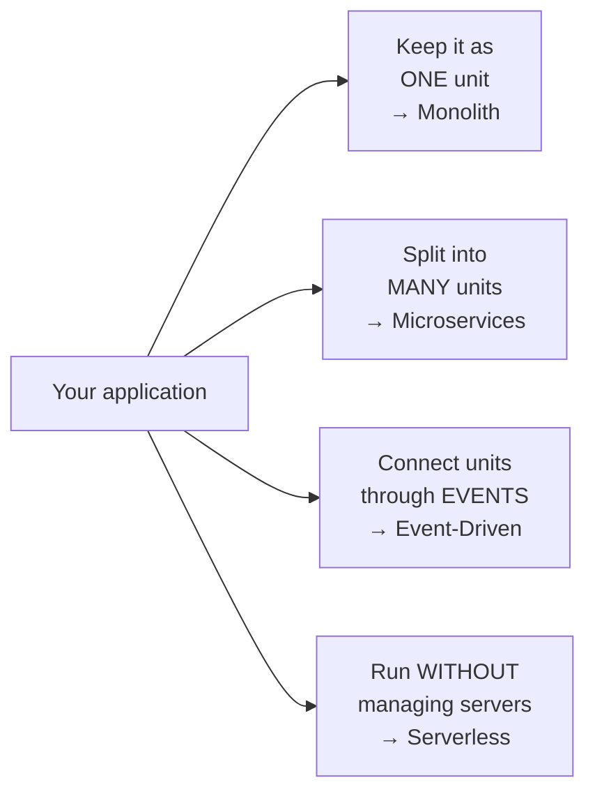
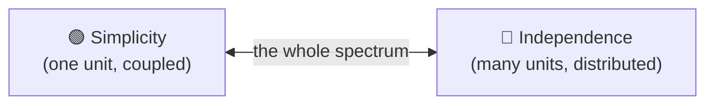
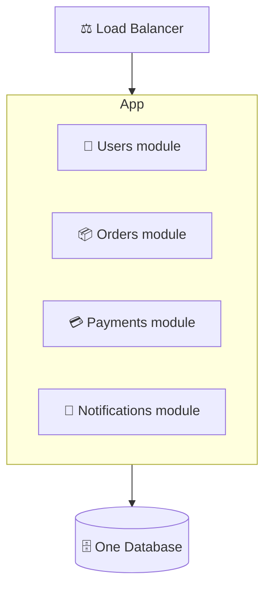
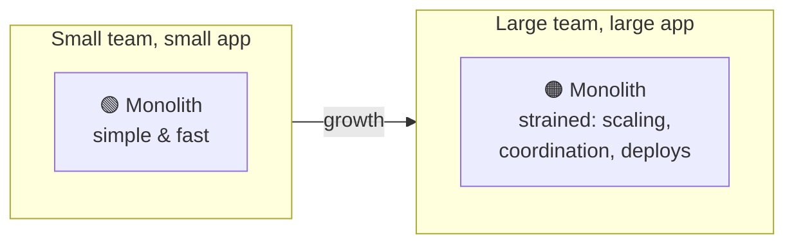

# Group 6 — Architecture Patterns

> **Phase:** Foundation → **Group:** 6 of 6 → **Read time:** ~50 minutes

---

## Before You Begin

Look at how far you've come.

- **Group 1** taught you how clients and servers talk across a network.
- **Group 2** structured that conversation into APIs.
- **Group 3** showed you where data lives and why storage is hard.
- **Group 4** taught you to scale a system past one machine.
- **Group 5** revealed the hard truths of life across many machines — consistency, CAP, coordination, failure.

You now hold every **building block** a real system is made of: servers, load balancers, databases, caches, queues, replicas, edges. You know how each one works and how each one fails.

This final group asks a different question — not *how does each piece work*, but:

> **How do you arrange all these pieces into a whole system?**

That arrangement is called the system's **architecture.** It's the shape of the thing: how you slice your application into parts, how those parts talk, how they deploy, and how they scale and fail *as a unit*. Two systems can use the exact same building blocks and be completely different systems depending on how they're arranged — the same way the same bricks can build a bungalow or a skyscraper.

There's no single "best" architecture, and that's the whole point of this group. There are **patterns** — the monolith, microservices, event-driven systems, serverless — each with a personality, a set of strengths, and a set of costs. The skill isn't knowing which is "most advanced." It's knowing which one fits *your* team, *your* scale, and *your* problem — and knowing when to change your mind as those things grow.

> **The mindset shift:** Up to now you've been an engineer choosing *components*. Architecture is where you become an engineer choosing *tradeoffs at the level of the whole system*. There is no free lunch — every architecture buys you something and charges you for it.

This group completes the Top 30 foundational concepts. After this, you don't just know the pieces — you know how to assemble them.

---

## Table of Contents

1. [Big Picture — Architecture Is About Arrangement](#1-big-picture--architecture-is-about-arrangement)
2. [The Monolith — One Deployable Unit](#2-the-monolith--one-deployable-unit)
3. [Microservices — Many Small Services](#3-microservices--many-small-services)
4. [Monolith vs Microservices — The Real Tradeoffs](#4-monolith-vs-microservices--the-real-tradeoffs)
5. [How Services Talk — Sync, Async & the API Gateway](#5-how-services-talk--sync-async--the-api-gateway)
6. [Event-Driven Architecture — Communicating Through Events](#6-event-driven-architecture--communicating-through-events)
7. [Serverless — Code Without Servers](#7-serverless--code-without-servers)
8. [Choosing the Right Architecture](#8-choosing-the-right-architecture)
9. [Putting It All Together](#9-putting-it-all-together)
10. [Final Recap](#10-final-recap)

---

## 1. Big Picture — Architecture Is About Arrangement

Every application does two things: it holds some **code** (the logic) and it talks to some **data** (the state). Architecture is the set of decisions about *how you divide that code and data across deployable units, and how those units communicate.*

That's it. Strip away the buzzwords and every architecture pattern is an answer to three questions:

1. **How many pieces** do I split my application into? (One? A handful? Dozens?)
2. **How do those pieces talk** to each other? (Direct calls? Messages? Events?)
3. **How do they deploy and scale** — together as one unit, or independently?

### There Is No "Best" — Only "Best For"

Here's the trap almost every engineer falls into early: believing architectures form a ladder, with the monolith at the bottom (beginner) and microservices at the top (advanced). **This is wrong, and believing it causes real damage.**

Architectures are not a ladder — they're a **toolbox.** A monolith isn't a "beginner mistake" you graduate from; it's the *correct* choice for a huge number of systems, including many at large companies. Microservices aren't a "trophy" you earn by being sophisticated; they're a heavy tool that solves specific problems and creates others.

> 💡 **Key Insight**
>
> The question is never "which architecture is best?" It's **"which architecture is best for this team, this scale, and this problem — right now?"** The best architecture is the one that lets your team ship reliably today while leaving room to change tomorrow. Chasing the "advanced" option you don't need is one of the most expensive mistakes in software.

### The Central Tension: Simplicity vs Independence

Nearly every architecture decision in this group trades along a single axis:

- **Fewer, bigger units** → **simpler** to build, test, deploy, and reason about — but everything is coupled together and scales together.
- **More, smaller units** → **independent** — teams, deploys, and scaling decouple — but you've traded that simplicity for the full weight of a *distributed system* (everything you learned in Group 5).

Every pattern in this group is a different point on that line. Keep this tension in your head — it's the thread that ties the whole group together.

### Quick Recap — Architecture Is Arrangement

- **Architecture** = how you divide code and data into deployable units and how those units communicate.
- Every pattern answers three questions: **how many pieces, how do they talk, how do they deploy/scale.**
- Architectures are a **toolbox, not a ladder** — there's no "best," only "best for this team, scale, and problem."
- The central tension is **simplicity (fewer, coupled units) vs independence (more, distributed units).**

---

## 2. The Monolith — One Deployable Unit

A **monolithic architecture** is the simplest arrangement: your entire application — every feature, every module — lives in a **single codebase** and ships as a **single deployable unit.** One process, one deployment, usually one database.

"Monolith" sounds primitive, but don't be fooled: it just means *unified*, not *messy*. A well-built monolith is cleanly divided **inside** — into modules for users, orders, payments, notifications — they just all run in the same process and deploy together.

### Why (Almost) Everything Should Start Here

When you're starting out, a monolith is not just acceptable — it's usually the *smart* choice. The strengths are real:

| Strength | Why it matters |
|---|---|
| **Simple to build** | One codebase, one language, one place for everything. New engineers get productive fast. |
| **Simple to test** | Run the whole app locally; no network, no mocking a dozen services. |
| **Simple to deploy** | One artifact to ship. One thing to roll back if it breaks. |
| **Fast internal calls** | A call between modules is a *function call* — nanoseconds, and it never fails over the network. |
| **Easy transactions** | One database means one ACID transaction can span users, orders, and payments atomically (Group 3). |

That last two points are quietly huge. Remember Group 5: the moment you split across machines, function calls become *network* calls (slow, unreliable) and a single transaction across services becomes a *distributed* transaction (genuinely hard). **A monolith gives you all of that for free** — because it isn't distributed at all.

### Where the Monolith Strains

A monolith doesn't fail because it's "old-fashioned." It strains for concrete, mechanical reasons — and only once the system and the team grow large:

- **Everything scales together.** If only the image-processing module is CPU-hungry, you still have to scale the *entire* app to give it more power — you can't scale just one part.
- **One codebase, many hands.** With 5 engineers, a shared codebase is easy. With 200 engineers committing to the same repo, merge conflicts, coordination, and stepping on each other's work become a daily tax.
- **Deploys become high-stakes.** Everything ships together, so a tiny change to the notifications module requires redeploying the *whole* application — and a bug anywhere can take the whole thing down.
- **One technology stack.** The whole app is (usually) one language and framework. You can't use Python for the ML module and Go for the high-throughput module — it's all or nothing.
- **Tight coupling creep.** Without discipline, modules reach into each other's internals until the "clean divisions" blur into a **big ball of mud** that's terrifying to change.

> ⚠️ **The "big ball of mud" is a discipline failure, not a monolith failure.** A monolith going bad is almost always because module boundaries weren't respected — not because "monoliths don't scale." A well-modularized monolith (sometimes called a **modular monolith**) stays healthy far longer than people expect, and it's often the ideal middle ground: clean internal boundaries, but still one simple deployment.

> 💡 **Key Insight**
>
> The monolith's superpower is that **it is not a distributed system.** Every hard problem from Group 5 — network failure, partial failure, distributed transactions, eventual consistency — simply doesn't exist inside one process. You should give that superpower up only when the pain of *keeping* it (scaling and team friction) finally outweighs the pain of *losing* it.

### Quick Recap — The Monolith

- A **monolith** = the whole app in one codebase, shipped as one deployable unit, usually one database.
- "Monolith" means **unified, not messy** — a good one is cleanly modular inside.
- Strengths: **simple to build, test, and deploy; fast in-process calls; easy single-database transactions.**
- Strains at scale: **everything scales/deploys together, team coordination gets hard, locked to one stack.**
- Its superpower: **it isn't a distributed system** — give that up only when the pain justifies it.

---
