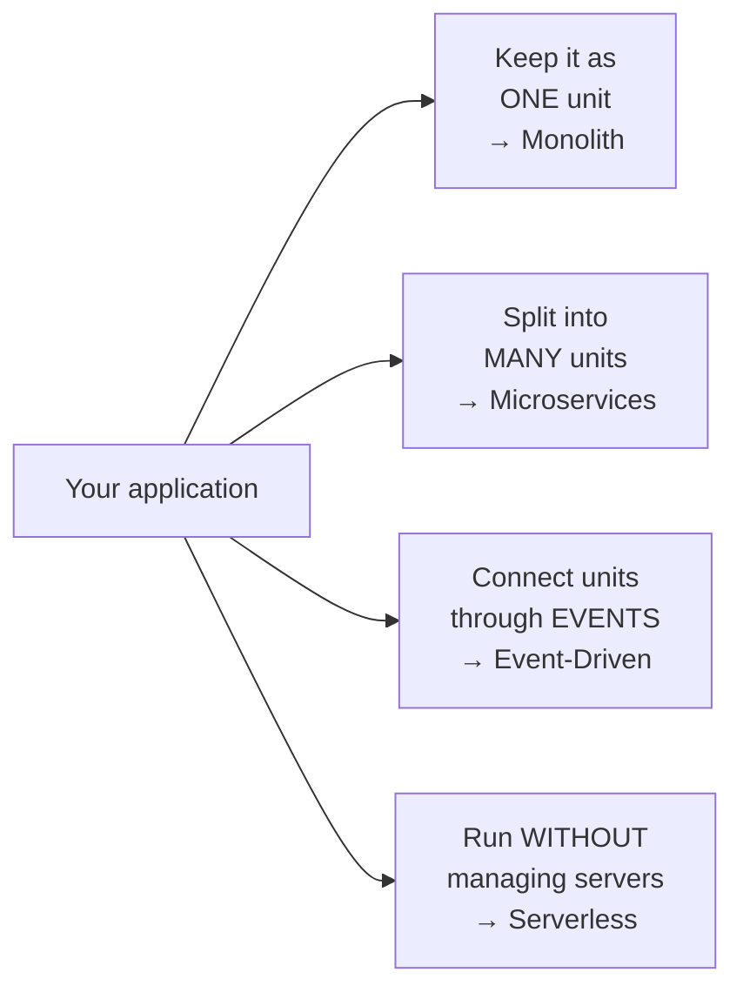
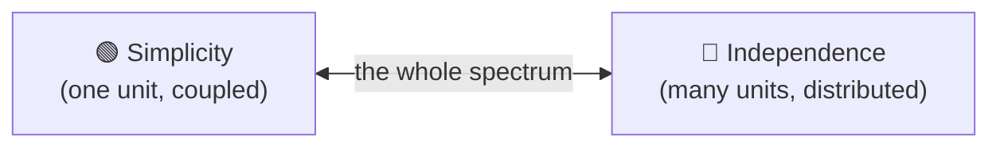
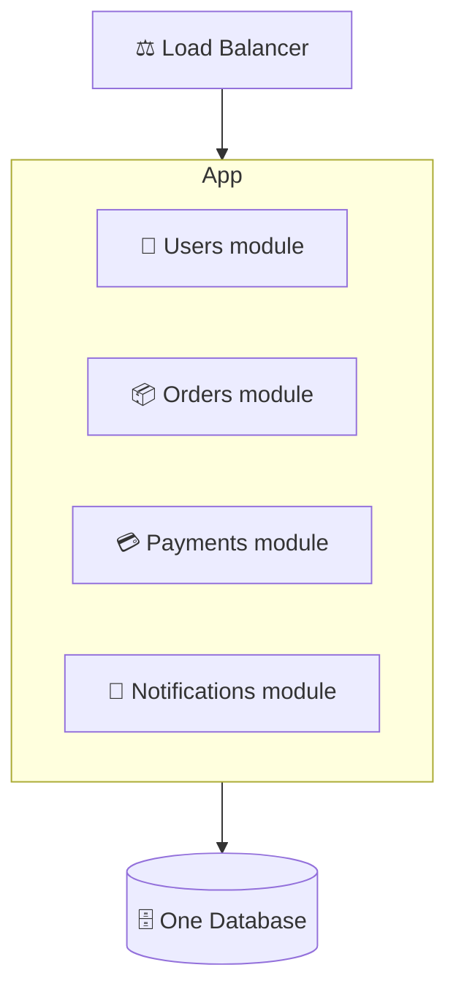
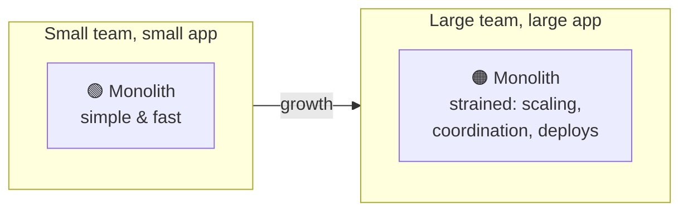
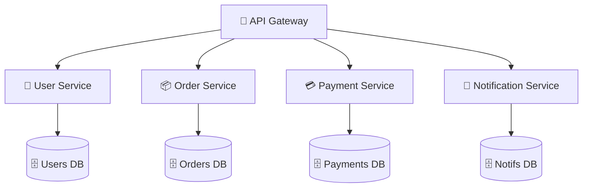
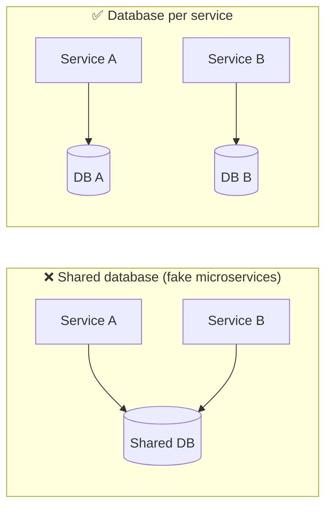
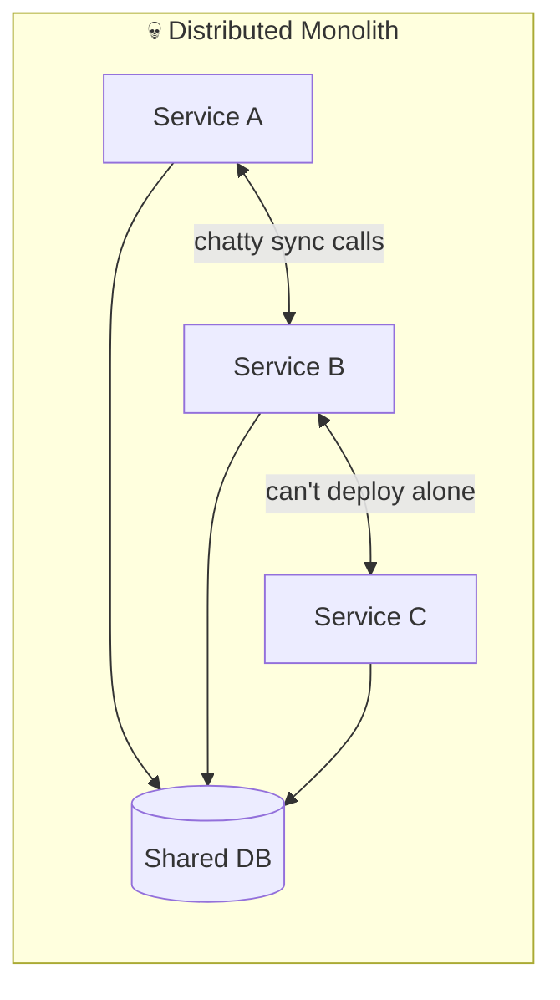
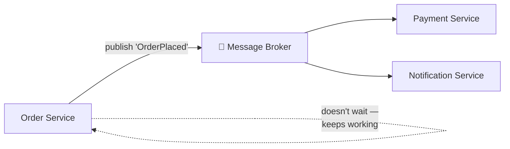
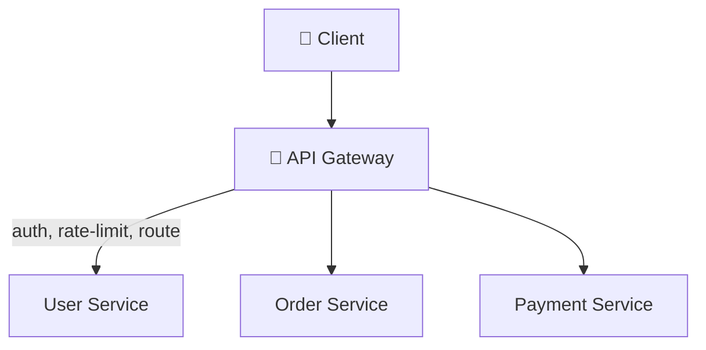

# Group 6 — Architecture Patterns

> **Phase:** Foundation → **Group:** 6 of 6 → **Read time:** ~50 minutes

---

## Before You Begin

Look at how far you've come.

- **Group 1** taught you how clients and servers talk across a network.
- **Group 2** structured that conversation into APIs.
- **Group 3** showed you where data lives and why storage is hard.
- **Group 4** taught you to scale a system past one machine.
- **Group 5** revealed the hard truths of life across many machines — consistency, CAP, coordination, failure.

You now hold every **building block** a real system is made of: servers, load balancers, databases, caches, queues, replicas, edges. You know how each one works and how each one fails.

This final group asks a different question — not *how does each piece work*, but:

> **How do you arrange all these pieces into a whole system?**

That arrangement is called the system's **architecture.** It's the shape of the thing: how you slice your application into parts, how those parts talk, how they deploy, and how they scale and fail *as a unit*. Two systems can use the exact same building blocks and be completely different systems depending on how they're arranged — the same way the same bricks can build a bungalow or a skyscraper.

There's no single "best" architecture, and that's the whole point of this group. There are **patterns** — the monolith, microservices, event-driven systems, serverless — each with a personality, a set of strengths, and a set of costs. The skill isn't knowing which is "most advanced." It's knowing which one fits *your* team, *your* scale, and *your* problem — and knowing when to change your mind as those things grow.

> **The mindset shift:** Up to now you've been an engineer choosing *components*. Architecture is where you become an engineer choosing *tradeoffs at the level of the whole system*. There is no free lunch — every architecture buys you something and charges you for it.

This group completes the Top 30 foundational concepts. After this, you don't just know the pieces — you know how to assemble them.

---

## Table of Contents

1. [Big Picture — Architecture Is About Arrangement](#1-big-picture--architecture-is-about-arrangement)
2. [The Monolith — One Deployable Unit](#2-the-monolith--one-deployable-unit)
3. [Microservices — Many Small Services](#3-microservices--many-small-services)
4. [Monolith vs Microservices — The Real Tradeoffs](#4-monolith-vs-microservices--the-real-tradeoffs)
5. [How Services Talk — Sync, Async & the API Gateway](#5-how-services-talk--sync-async--the-api-gateway)
6. [Event-Driven Architecture — Communicating Through Events](#6-event-driven-architecture--communicating-through-events)
7. [Serverless — Code Without Servers](#7-serverless--code-without-servers)
8. [Choosing the Right Architecture](#8-choosing-the-right-architecture)
9. [Putting It All Together](#9-putting-it-all-together)
10. [Final Recap](#10-final-recap)

---

## 1. Big Picture — Architecture Is About Arrangement

Every application does two things: it holds some **code** (the logic) and it talks to some **data** (the state). Architecture is the set of decisions about *how you divide that code and data across deployable units, and how those units communicate.*

That's it. Strip away the buzzwords and every architecture pattern is an answer to three questions:

1. **How many pieces** do I split my application into? (One? A handful? Dozens?)
2. **How do those pieces talk** to each other? (Direct calls? Messages? Events?)
3. **How do they deploy and scale** — together as one unit, or independently?

### There Is No "Best" — Only "Best For"

Here's the trap almost every engineer falls into early: believing architectures form a ladder, with the monolith at the bottom (beginner) and microservices at the top (advanced). **This is wrong, and believing it causes real damage.**

Architectures are not a ladder — they're a **toolbox.** A monolith isn't a "beginner mistake" you graduate from; it's the *correct* choice for a huge number of systems, including many at large companies. Microservices aren't a "trophy" you earn by being sophisticated; they're a heavy tool that solves specific problems and creates others.

> 💡 **Key Insight**
>
> The question is never "which architecture is best?" It's **"which architecture is best for this team, this scale, and this problem — right now?"** The best architecture is the one that lets your team ship reliably today while leaving room to change tomorrow. Chasing the "advanced" option you don't need is one of the most expensive mistakes in software.

### The Central Tension: Simplicity vs Independence

Nearly every architecture decision in this group trades along a single axis:

- **Fewer, bigger units** → **simpler** to build, test, deploy, and reason about — but everything is coupled together and scales together.
- **More, smaller units** → **independent** — teams, deploys, and scaling decouple — but you've traded that simplicity for the full weight of a *distributed system* (everything you learned in Group 5).

Every pattern in this group is a different point on that line. Keep this tension in your head — it's the thread that ties the whole group together.

### Quick Recap — Architecture Is Arrangement

- **Architecture** = how you divide code and data into deployable units and how those units communicate.
- Every pattern answers three questions: **how many pieces, how do they talk, how do they deploy/scale.**
- Architectures are a **toolbox, not a ladder** — there's no "best," only "best for this team, scale, and problem."
- The central tension is **simplicity (fewer, coupled units) vs independence (more, distributed units).**

---

## 2. The Monolith — One Deployable Unit

A **monolithic architecture** is the simplest arrangement: your entire application — every feature, every module — lives in a **single codebase** and ships as a **single deployable unit.** One process, one deployment, usually one database.

"Monolith" sounds primitive, but don't be fooled: it just means *unified*, not *messy*. A well-built monolith is cleanly divided **inside** — into modules for users, orders, payments, notifications — they just all run in the same process and deploy together.

### Why (Almost) Everything Should Start Here

When you're starting out, a monolith is not just acceptable — it's usually the *smart* choice. The strengths are real:

| Strength | Why it matters |
|---|---|
| **Simple to build** | One codebase, one language, one place for everything. New engineers get productive fast. |
| **Simple to test** | Run the whole app locally; no network, no mocking a dozen services. |
| **Simple to deploy** | One artifact to ship. One thing to roll back if it breaks. |
| **Fast internal calls** | A call between modules is a *function call* — nanoseconds, and it never fails over the network. |
| **Easy transactions** | One database means one ACID transaction can span users, orders, and payments atomically (Group 3). |

That last two points are quietly huge. Remember Group 5: the moment you split across machines, function calls become *network* calls (slow, unreliable) and a single transaction across services becomes a *distributed* transaction (genuinely hard). **A monolith gives you all of that for free** — because it isn't distributed at all.

### Where the Monolith Strains

A monolith doesn't fail because it's "old-fashioned." It strains for concrete, mechanical reasons — and only once the system and the team grow large:

- **Everything scales together.** If only the image-processing module is CPU-hungry, you still have to scale the *entire* app to give it more power — you can't scale just one part.
- **One codebase, many hands.** With 5 engineers, a shared codebase is easy. With 200 engineers committing to the same repo, merge conflicts, coordination, and stepping on each other's work become a daily tax.
- **Deploys become high-stakes.** Everything ships together, so a tiny change to the notifications module requires redeploying the *whole* application — and a bug anywhere can take the whole thing down.
- **One technology stack.** The whole app is (usually) one language and framework. You can't use Python for the ML module and Go for the high-throughput module — it's all or nothing.
- **Tight coupling creep.** Without discipline, modules reach into each other's internals until the "clean divisions" blur into a **big ball of mud** that's terrifying to change.

> ⚠️ **The "big ball of mud" is a discipline failure, not a monolith failure.** A monolith going bad is almost always because module boundaries weren't respected — not because "monoliths don't scale." A well-modularized monolith (sometimes called a **modular monolith**) stays healthy far longer than people expect, and it's often the ideal middle ground: clean internal boundaries, but still one simple deployment.

> 💡 **Key Insight**
>
> The monolith's superpower is that **it is not a distributed system.** Every hard problem from Group 5 — network failure, partial failure, distributed transactions, eventual consistency — simply doesn't exist inside one process. You should give that superpower up only when the pain of *keeping* it (scaling and team friction) finally outweighs the pain of *losing* it.

### Quick Recap — The Monolith

- A **monolith** = the whole app in one codebase, shipped as one deployable unit, usually one database.
- "Monolith" means **unified, not messy** — a good one is cleanly modular inside.
- Strengths: **simple to build, test, and deploy; fast in-process calls; easy single-database transactions.**
- Strains at scale: **everything scales/deploys together, team coordination gets hard, locked to one stack.**
- Its superpower: **it isn't a distributed system** — give that up only when the pain justifies it.

---

## 3. Microservices — Many Small Services

A **microservices architecture** takes the opposite bet from the monolith. Instead of one big unit, you split the application into **many small, independent services** — each owning **one business capability**, running as its **own deployable unit**, usually with its **own database.**

Compare this to the monolith diagram in Section 2. Same four capabilities — but now each is a *separate program*, deployed on its own, talking over the *network* instead of via function calls, and holding its *own* data.

### Split by Business Capability, Not by Layer

The single most important rule of microservices: **split along business boundaries, not technical layers.** A service should own a *whole vertical slice* of a capability — its API, its logic, and its data.

- ✅ **Good:** a `Payments` service that owns everything about payments.
- ❌ **Bad:** a "database service," a "logic service," and a "UI service." That just slices your monolith horizontally and forces every feature to cross all three — you get the network cost of microservices with none of the independence.

This idea maps directly to **Domain-Driven Design**: each service is a *bounded context* with a clear responsibility and a clear boundary nobody else reaches across.

### The Two Rules That Give Microservices Their Power

1. **Own your data.** Each service has its *private* database that no other service touches directly. Want the Order service's data? You *ask* the Order service through its API — you never reach into its tables. This is what makes a service truly independent: it can change its schema, or even its whole database technology, without breaking anyone.

2. **Deploy independently.** Because each service ships on its own, a team can deploy the Payment service ten times a day without touching — or risking — anything else.

### What This Buys You

| Benefit | Why it happens |
|---|---|
| **Independent scaling** | The CPU-hungry image service scales to 50 instances while the rest stay at 2. You scale *only the bottleneck* (recall the monolith couldn't). |
| **Independent deploys** | Small, frequent, low-risk releases per service — no giant coordinated launch. |
| **Team autonomy** | Each team owns a service end-to-end and moves at its own pace. This is why microservices scale *organizations*, not just traffic. |
| **Technology freedom** | Payments in Java, ML in Python, real-time in Go — each service picks the right tool. |
| **Fault isolation** | If the Notification service crashes, orders still work (if you designed for it). One failure ≠ total outage. |

### The Bill Comes Due

Every one of those benefits is paid for with the hardest currency in software — **distributed-systems complexity.** You didn't escape Group 5; you *signed up for all of it*:

- **The network is now in the middle of everything.** Every inter-service call can be slow, fail, or time out (Fallacies, Group 5). A function call that never failed is now a network request that can.
- **No more easy transactions.** "Charge the card *and* create the order" was one database transaction in the monolith. Across two services with two databases, it's a **distributed transaction** — you need patterns like **SAGA** and must accept **eventual consistency** (Group 5).
- **Operational explosion.** One app becomes 40 services: 40 deploy pipelines, 40 dashboards, service discovery, and distributed tracing just to answer "why was this request slow?" You *need* real observability, not as a nicety but to survive.
- **Harder to debug.** A single user action might touch eight services. When it fails, the bug is somewhere in the gaps between them.

> ⚠️ **Microservices trade code complexity for operational complexity.** The code in each service gets simpler; the *system* gets dramatically harder to run. You need mature CI/CD, monitoring, and on-call *before* microservices help rather than hurt. A small team without that infrastructure will drown.

> 💡 **Key Insight**
>
> Microservices are primarily a solution to a **people problem**, not a technology problem. Their killer feature is letting *many teams* work and ship *independently* without tripping over each other. If you have one team of five, you get almost none of that benefit — and pay the full distributed-systems cost. That's why "start with microservices" is usually the wrong call.

### Quick Recap — Microservices

- **Microservices** = many small, independently deployable services, each owning one business capability and its own data.
- **Split by business capability, not technical layer** — each service is a full vertical slice.
- Two power rules: **own your data** (private DB) and **deploy independently.**
- Buys: independent **scaling, deploys, team autonomy, tech freedom, fault isolation.**
- Costs: **the full weight of distributed systems** — network failures, distributed transactions, operational explosion.
- They mainly solve a **people/organization problem**; small teams rarely benefit enough to justify the cost.

---

## 4. Monolith vs Microservices — The Real Tradeoffs

This is the debate every engineer eventually has — and it's usually argued badly, as if one side is simply "better." It isn't. They sit at opposite ends of the simplicity-vs-independence axis from Section 1, and the right answer depends entirely on your situation.

### Side by Side

| Dimension | 🟢 Monolith | 🔵 Microservices |
|---|---|---|
| **Codebase** | One | Many |
| **Deployment** | One unit, all at once | Per service, independently |
| **Scaling** | Whole app together | Each service separately |
| **Data** | One shared database, easy transactions | DB per service, distributed transactions |
| **Internal calls** | Function calls (fast, reliable) | Network calls (slow, can fail) |
| **Team fit** | Small teams, one codebase | Many teams, autonomous |
| **Tech stack** | Usually one | Many, per service |
| **Failure blast radius** | A bug can take down everything | Isolated (if designed well) |
| **Operational burden** | Low | High (needs strong DevOps/observability) |
| **Where complexity lives** | In the code | In the system between services |

### The Anti-Pattern to Fear: The Distributed Monolith

There's a failure mode worse than either pure option — and it's alarmingly common. You split into microservices but the services are still **tightly coupled**: they call each other constantly and synchronously, share a database, and can't deploy without one another.

This is the **worst of both worlds**: the operational complexity and network fragility of microservices, plus the coupling and coordinated-deploy pain of a monolith — with none of the independence that was the whole point. If your services must all deploy together to work, you didn't build microservices; you built a monolith that also fails over the network.

### How Experienced Teams Actually Decide

The industry has largely converged on one piece of advice:

> **Start with a (well-modularized) monolith. Extract services only when a specific, real pain forces you to.**

The triggers that justify extracting a service are concrete, not aspirational:

- A part of the system needs to **scale very differently** from the rest.
- A **team** has grown big enough that the shared codebase is a genuine bottleneck.
- A component needs a **different technology** the monolith can't provide.
- One module's failures keep **taking down** unrelated features.

Notice what's *not* on that list: "microservices are more modern," "big companies use them," or "it'll look good in the architecture diagram." Those are how teams end up with a distributed monolith and a team that ships slower than when they had one boring, reliable app.

> 💡 **Key Insight**
>
> **Monolith-first is the default for a reason: it's much easier to split a well-organized monolith later than to merge a tangle of premature microservices back together.** You can always extract a service when the pain is real and the boundary is obvious. Start simple; earn your complexity. Even engineers at companies famous for microservices (Amazon, Netflix) reached them by *evolving* from monoliths under real pressure — not by starting there.

### Quick Recap — Monolith vs Microservices

- They're **opposite ends of one axis** (simplicity vs independence), not better-vs-worse.
- Monolith: complexity lives **in the code**; microservices: complexity lives **in the system between services.**
- Beware the **distributed monolith** — tightly coupled services that must deploy together: the worst of both worlds.
- Default advice: **start with a modular monolith, extract services when a concrete pain forces it.**
- Extract for **real triggers** (differing scale, team size, tech needs, failure isolation) — never for hype.

---

## 5. How Services Talk — Sync, Async & the API Gateway

The moment you have more than one service, a new question dominates the design: **how do services communicate?** This choice shapes how coupled, how resilient, and how fast your system is. There are two fundamental styles.

### Synchronous — Request / Response

The caller sends a request and **waits** for the response before continuing — exactly like the REST and gRPC calls from Group 2, just now *between* your own services.

- **Feels natural** — it's just a function call over the network.
- **Simple to reason about** — you get the answer immediately, in order.
- **Danger — temporal coupling:** the caller is only as available as the callee. If the User service is down or slow, the Order service is *stuck waiting* too. Chain enough synchronous calls and one slow service stalls the whole chain — the **cascading failure** from Group 5. This is exactly where **timeouts, retries, and circuit breakers** (Group 5) become mandatory, not optional.

### Asynchronous — Messaging / Events

The caller sends a message to a **queue or broker** and moves on **without waiting.** The receiver processes it whenever it's ready. This is the message-queue and pub/sub intuition you'll deep-dive later, applied between services.

- **Decoupled in time:** the Payment service can be down for a minute; messages wait safely in the queue and get processed when it recovers. The Order service never even notices.
- **Resilient & absorbs spikes:** the queue acts as a **buffer** — a traffic burst fills the queue instead of overwhelming the consumer.
- **Cost:** more moving parts (a broker to run), and the result isn't immediate — you get **eventual consistency** (Group 5) and must handle out-of-order or duplicate messages (hello again, **idempotency**).

### Choosing Between Them

| Use **synchronous** when… | Use **asynchronous** when… |
|---|---|
| You need the answer *now* to continue (e.g. "is this user allowed?") | The work can happen in the background (e.g. send a receipt email) |
| The operation is a simple read | You want to decouple services and absorb spikes |
| Simplicity matters more than resilience | Resilience and independence matter most |

A healthy system uses **both**: synchronous for "I need an answer to proceed," asynchronous for "go do this, I'll trust it gets done."

### The API Gateway — One Front Door

If the outside world had to call 40 services directly, clients would need to know every service's address, and every service would have to re-implement auth, rate limiting, and TLS. Instead, you put a single **API Gateway** in front of everything — the one public entrance to your system.

The gateway handles the **cross-cutting concerns** so individual services don't have to:

- **Routing** — send each request to the right service.
- **Authentication & authorization** — verify identity once, at the edge.
- **Rate limiting & throttling** — protect services from abuse (Group 2).
- **TLS termination**, request aggregation, logging, and metrics.

It's the same *reverse-proxy* idea from Group 1, elevated into the organizing front door of a microservices system.

### And How Do Services *Find* Each Other?

In a monolith, modules find each other by function name. Across a fleet of services whose instances constantly come, go, and change IP addresses (recall the "topology changes" fallacy), you need **service discovery** — a registry where services register themselves and look each other up by *name* instead of hard-coded address. Think of it as DNS for your internal services. (It gets a full deep-dive later; for now, just know the problem exists and has a name.)

> 💡 **Key Insight**
>
> The communication style *is* the coupling. **Synchronous calls couple services in time** (yours is down when mine is), which is simple but fragile. **Asynchronous messaging decouples them** at the cost of immediacy. Much of microservices design is really the art of choosing, per interaction, how tightly to couple — and defaulting to *looser* coupling wherever the business can tolerate it.

### Quick Recap — How Services Talk

- **Synchronous (request/response):** wait for the answer — simple but creates **temporal coupling** and cascade risk.
- **Asynchronous (messaging/events):** fire-and-forget via a broker — **decoupled and resilient**, but eventually consistent.
- Real systems use **both**, matched to whether the caller truly needs an immediate answer.
- An **API Gateway** is the single front door: routing, auth, rate limiting, TLS — so services don't each reinvent them.
- **Service discovery** lets services find each other by name as instances come and go (DNS for internal services).

---
