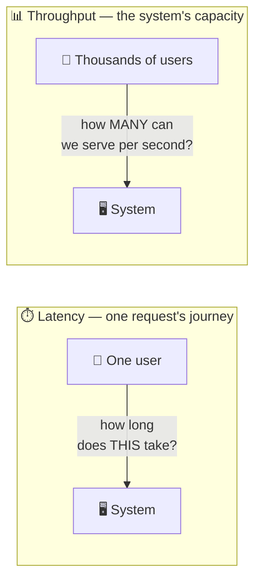
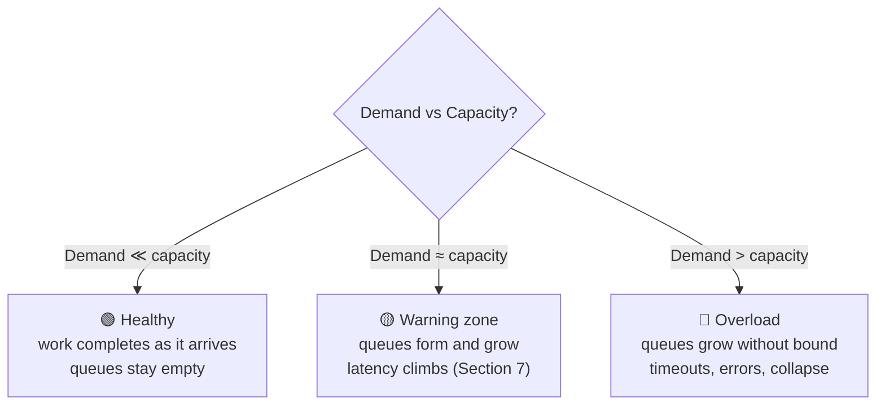
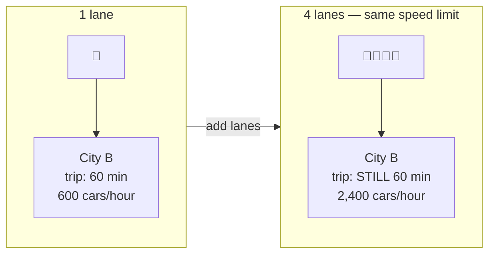
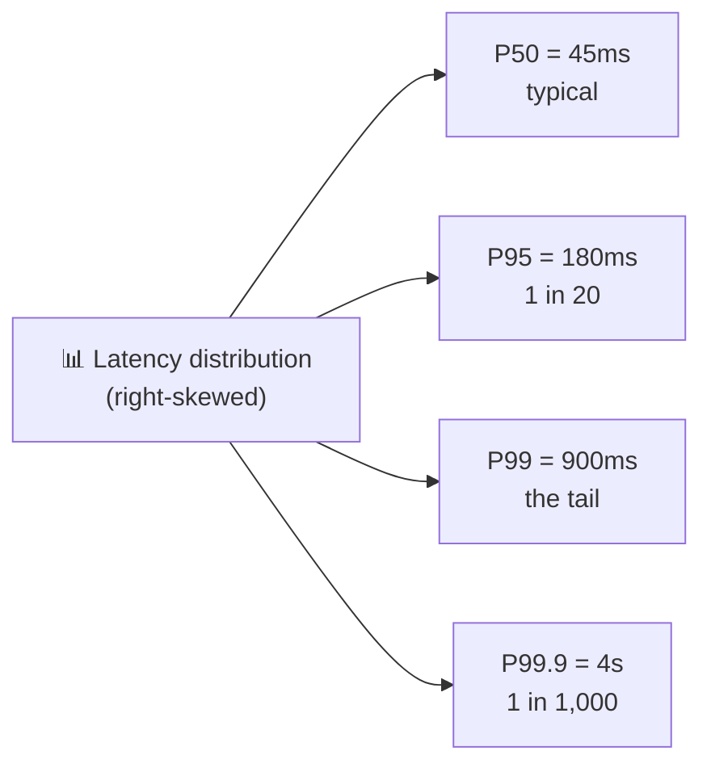
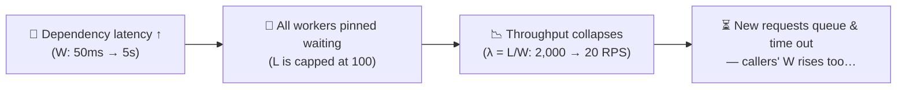
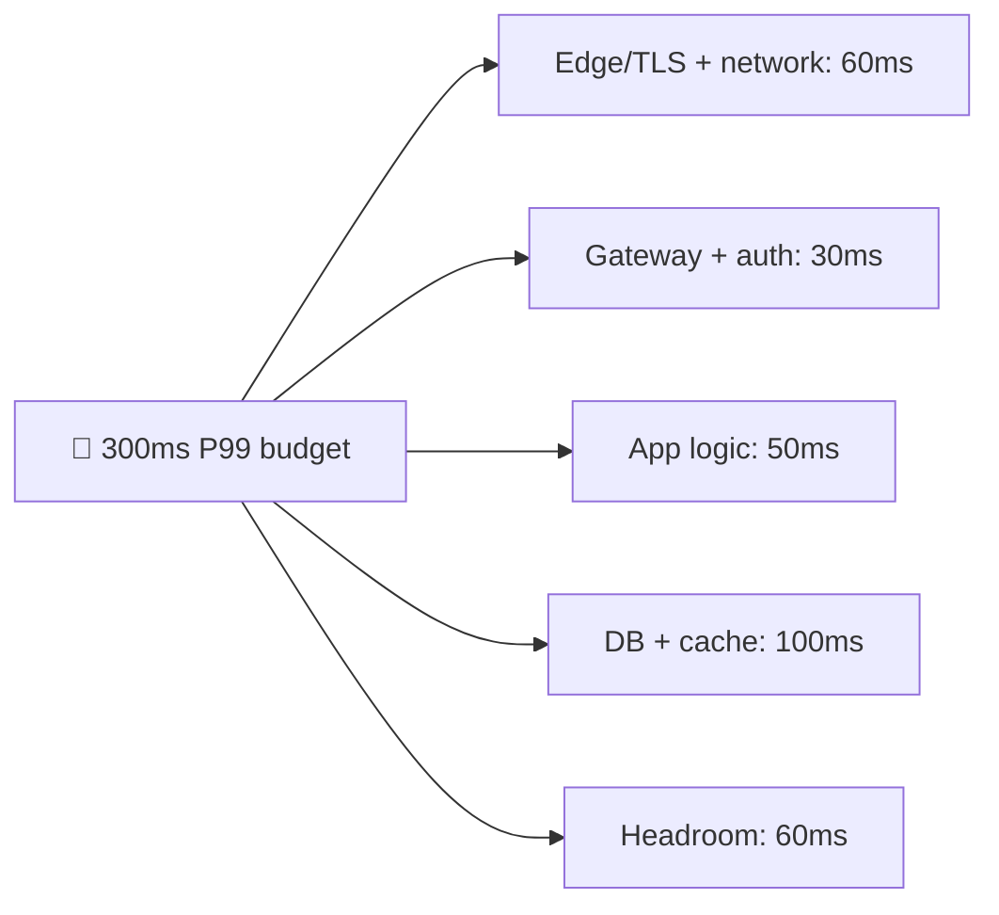

# Latency vs Throughput

> **Phase:** Core System Properties → **Topic:** 1 of 5 → **Read time:** ~45 minutes

---

## Before You Begin

Welcome to Phase 02. The Foundation phase gave you the *building blocks* — networking, APIs, storage, scaling, distributed systems, architecture. This phase gives you something different: the **yardsticks**. The five Core System Properties are the vocabulary every design conversation is conducted in, and the dimensions every design decision is measured against. Group 6 promised them; here they are.

We start with the pair that gets confused more than any other: **latency and throughput.**

You've already met both, briefly. *What Is System Design?* (§6) warned you they're not the same thing. Group 1 (§5) showed you where a request's time goes and introduced percentiles. Group 4 taught you to hunt bottlenecks. This document is where those seeds grow into the full skill: defining performance precisely, measuring it honestly, and reasoning about it the way senior engineers do.

Here's why this matters so much. When someone says *"the system is slow,"* that sentence contains almost no engineering information. Slow *how*? One user's request takes too long? Or the system can't handle enough requests at once? Those are **two completely different diseases with two completely different cures** — and mixing them up leads to expensive mistakes: doubling your server count to fix a problem more servers cannot touch, or micro-optimizing response times when the real crisis is capacity.

By the end of this document, you'll never say "it's slow" again. You'll say *which* number is bad, *at which percentile*, *under what load* — and you'll know what that implies about the fix.

> **The mindset shift:** stop asking *"is it fast?"* — start asking *"fast for **whom**, at **which percentile**, under **what load**?"* Performance is not one number. It's a distribution under a demand.

---

## Table of Contents

1. [Big Picture — Two Different Questions](#1-big-picture--two-different-questions)
2. [Latency — The Anatomy of One Request's Time](#2-latency--the-anatomy-of-one-requests-time)
3. [Throughput — The System's Capacity](#3-throughput--the-systems-capacity)
4. [Why They're Not the Same Axis](#4-why-theyre-not-the-same-axis)
5. [Measuring Latency — Percentiles and the Tail](#5-measuring-latency--percentiles-and-the-tail)
6. [Little's Law — The Equation That Connects Them](#6-littles-law--the-equation-that-connects-them)
7. [The Utilization–Latency Curve](#7-the-utilizationlatency-curve)
8. [When They Trade Against Each Other](#8-when-they-trade-against-each-other)
9. [Production Reasoning — Budgets, Peaks, and Measurement Traps](#9-production-reasoning--budgets-peaks-and-measurement-traps)
10. [Putting It All Together — A Flash Sale](#10-putting-it-all-together--a-flash-sale)
11. [Final Recap](#11-final-recap)

---

## 1. Big Picture — Two Different Questions

Every performance conversation is secretly about one of two questions:

> **Latency:** how long does **one** request take?
> **Throughput:** how **many** requests can the system handle per unit of time?

They sound related — and they are, in ways Sections 6 and 7 will make precise — but they are **different axes**. One is measured in *time* (milliseconds); the other in *rate* (requests per second). One is experienced by a single user; the other is a property of the whole system.



### The Same Word, Two Diseases

Consider two systems that both get called "slow":

- **System A:** every request completes in 4 seconds, even at 3 a.m. with one user online. Traffic is light; the servers are bored. **This is a latency problem.** Something in the request's path — a missing index, a chatty sequence of network calls, an oversized payload — takes too long, every single time. Adding servers changes *nothing*: ten bored servers each still take 4 seconds.
- **System B:** requests complete in 80ms all morning — then the lunchtime spike hits, and suddenly they take 9 seconds or time out. **This is a throughput problem.** The system's capacity is smaller than the demand, requests pile up in queues, and the pile-up is what users feel. Optimizing a single request's code path barely helps; the system needs more capacity (or less work per request).

Same complaint. Opposite causes. Opposite fixes. An engineer who can't tell these apart will reach for the wrong tool — and the wrong tool at scale is expensive.

### Both Have a Direction

Keep the "good direction" straight from day one:

| Property | Measures | Units | You want it |
|---|---|---|---|
| **Latency** | Time for one request | ms (milliseconds) | **Low** |
| **Throughput** | Completed requests per unit time | RPS / QPS (requests/queries per second) | **High** |

> 💡 **Key Insight**
>
> "The system is slow" is a symptom, not a diagnosis. The first professional move in any performance conversation is to split it: **is one request too slow (latency), or are there too many requests for the system (throughput)?** Everything else in this document builds on being able to make that split instantly.

### Quick Recap — Two Different Questions

- **Latency** = time for one request (ms, lower is better). **Throughput** = requests completed per second (RPS, higher is better).
- They are **different axes**: one is a *time*, the other a *rate*.
- A latency problem and a throughput problem produce the same complaint ("slow") but need **opposite cures**.
- More servers fix throughput problems, not latency problems; code-path optimization fixes latency problems, not capacity ones.

---

## 2. Latency — The Anatomy of One Request's Time

Group 1 introduced latency as the total time from sending a request to receiving its response. Now let's dissect it — because you can't reduce a number you can't decompose.

### The Four Components

Every request's total latency is a *sum*. Four kinds of time contribute:

| Component | What it is | Governed by |
|---|---|---|
| **Network time** | Data physically traveling between machines | Distance (speed of light), number of round trips |
| **Queue time** | The request *waiting* before anyone works on it | How busy the server is (Section 7!) |
| **Processing time** | The server actually computing — logic, DB queries, downstream calls | Code, queries, algorithms |
| **Transmission time** | Pushing the bytes onto the wire | Payload size ÷ bandwidth |


Two of these deserve special attention, because beginners consistently underestimate them:

**Queue time** is the silent killer. Processing time is usually stable — the same query takes roughly the same time at midnight and at noon. But queue time *explodes with load*: an idle server has zero queue time; a busy one can make requests wait far longer than the work itself takes. This is why the same endpoint can be fast at 3 a.m. and terrible at lunch — the *work* didn't change; the *waiting* did. Section 7 is devoted to this.

**Round trips**, not bandwidth, dominate network time for typical API traffic. A cross-continent round trip costs ~100ms *whether you send 1 KB or nothing at all* — that's physics, not congestion. A request path that makes 5 sequential cross-region calls has paid half a second before doing any work. This is why "chatty" designs (N+1 queries, call chains) are latency poison, and why the biggest network-latency wins come from making *fewer* trips, not fatter pipes.

### The Latency Ladder — Numbers Worth Knowing

You met a short version in Group 1. Here's the fuller ladder every engineer should have a feel for — not memorized to the digit, but as *orders of magnitude*:

| Operation | Approximate time | Scale intuition |
|---|---|---|
| L1 cache reference | ~1 ns | 1 second |
| RAM access | ~100 ns | ~2 minutes |
| SSD random read | ~100 µs | ~28 hours |
| Round trip, same data centre | ~0.5–1 ms | ~2 weeks |
| SSD sequential read, 1 MB | ~1 ms | ~2 weeks |
| HDD seek | ~10 ms | ~4 months |
| Round trip, same continent | ~10–40 ms | months |
| Round trip, cross-continent | ~100–150 ms | ~8 years |

(The right column rescales everything so an L1 cache hit takes "1 second" — it makes the gaps visceral.)

Look at the chasm between memory (~100 ns) and any network hop (~1 ms same-DC — **ten thousand times slower**). That single gap explains half of system design: it's why caching works (Group 4), why databases fight to keep hot data in RAM, and why every extra network hop in a request path is a real decision, not a free abstraction.

> 💡 **Key Insight**
>
> Latency is a **sum you can itemize.** When a request takes 800ms, that's not a fact — it's an unopened receipt. 300ms of round trips + 400ms of one bad query + 100ms of queueing is a *diagnosis*, and each line item has a different fix. Engineers who "optimize performance" without itemizing first are guessing. (This is bottleneck-hunting from Group 4, applied inside a single request.)

### Quick Recap — Anatomy of Latency

- Total latency = **network + queue + processing + transmission** time — always itemize before optimizing.
- **Queue time** is the component that explodes under load; processing time usually stays stable.
- **Round trips dominate** network time — chatty designs pay the distance tax repeatedly; fewer trips beat fatter pipes.
- The memory-vs-network gap (~10,000×) is the physical fact behind caching and most performance architecture.

---

## 3. Throughput — The System's Capacity

Latency looks at one request under a microscope. **Throughput** zooms all the way out and asks the system-level question:

> **How much work does the whole system complete per unit of time?**

For a web backend that's **requests per second** (RPS, or QPS for queries). For a message pipeline it's events per second; for a data job, rows or megabytes per second. Same concept, different units: **completed work ÷ time.**

### Capacity vs Demand

Throughput only becomes meaningful next to its counterpart, **demand** (also called *offered load*) — how much work is *arriving* per second. Three regimes fall out immediately:



The crucial fact: **a system's throughput has a ceiling.** Some resource — CPU, a database's write capacity, a connection pool, a downstream API's rate limit, a single lock everyone waits on — saturates first, and it caps what the whole system can complete regardless of how much arrives. That resource is the **bottleneck** (Group 4's central word), and the system's maximum throughput *is* the bottleneck's throughput.

That's worth reading twice: your system is exactly as fast, in the throughput sense, as its narrowest component. A fleet of 50 app servers in front of a database that can commit 2,000 writes/second is a 2,000-writes/second system. The other capacity is decoration.

### Bandwidth vs Throughput vs Goodput

Three terms get blurred in casual conversation. Keeping them separate is a cheap way to sound (and be) precise:

| Term | Means | Analogy |
|---|---|---|
| **Bandwidth** | The theoretical *maximum* rate a link or component could carry | How wide the pipe is |
| **Throughput** | The rate you *actually achieve* | How much water actually flows |
| **Goodput** | The rate of *useful* work — excluding retries, duplicates, overhead, failed responses | Water that reaches the glass |

The gaps between them are diagnostic. Throughput far below bandwidth means something upstream is limiting flow. Goodput far below throughput is more insidious — the system looks busy but much of the work is *waste*: retried requests, redelivered messages, responses that time out after the work was done. A retry storm (Group 5) is exactly this failure: throughput stays high, goodput collapses to nothing.

> ⚠️ **Measure completed useful work, not effort.** A dashboard proudly showing "45,000 requests/second" during an incident may be counting timeouts and retries of the same doomed request. Users experience *goodput*. When throughput is high and users are still failing, waste is eating the difference.

### Quick Recap — Throughput

- **Throughput** = completed work per unit time (RPS/QPS); it's a **system-level** property.
- It matters relative to **demand**: demand exceeding capacity → queues grow → overload.
- Every system has a throughput **ceiling set by its bottleneck** — the narrowest component caps everything.
- **Bandwidth** (theoretical max) ≥ **throughput** (achieved) ≥ **goodput** (useful) — the gaps tell you where waste and limits live.

---

## 4. Why They're Not the Same Axis

Now put the two side by side properly — because the single most common performance misconception is that they're one dial: "make it faster."

### The Highway Mental Model

Picture a highway between two cities:

- **Latency** is *one car's travel time* — how long it takes you, personally, to get from A to B.
- **Throughput** is *cars arriving per hour* — how many vehicles the road delivers.

Now watch what different "improvements" actually do:

| Change | Latency (one car's trip) | Throughput (cars/hour) |
|---|---|---|
| **Add lanes** (more servers) | Unchanged — your car doesn't drive faster | ⬆️ Much higher |
| **Raise the speed limit** (faster code path, fewer round trips) | ⬇️ Lower | ⬆️ Somewhat higher too |
| **Move the cities closer** (CDN/edge, Group 4) | ⬇️ Much lower | Mostly unchanged |
| **Carpooling** (batching — more per vehicle) | ⬆️ *Higher* (you wait to fill the car) | ⬆️ Higher |



Adding lanes is exactly what horizontal scaling (Group 4) does: it multiplies *capacity* without making any individual request faster. If a user complains their page takes 4 seconds, adding six more servers gives you seven servers that each take 4 seconds.

### Two Dials, Four Corners

Because they're independent axes, all four combinations exist in the wild — and naming which quadrant you're in tells you what to do:

| | **High throughput** | **Low throughput** |
|---|---|---|
| **Low latency** | 🏆 The goal — fast *and* high-capacity | Fine for small systems — fast but low-traffic (a healthy internal tool) |
| **High latency** | A batch pipeline: processes millions of records/hour, each taking minutes | 🚨 The worst of both — slow *and* can't handle load |

The batch-pipeline corner is the one that surprises beginners: a nightly analytics job with *terrible* latency (results take an hour) and *spectacular* throughput (terabytes processed) — and that's a **correct design**, because nobody is waiting on any single record. Which quadrant you should aim for is a *requirements* question (doc 00), not a universal ranking.

### The Coupling Preview

Independent axes — but not *unrelated*. Two connections tie them together, and they're the subject of the next three sections:

1. **A capacity link:** latency and concurrency determine achievable throughput (**Little's Law**, Section 6).
2. **A congestion link:** pushing throughput near the ceiling makes latency explode (**the utilization curve**, Section 7).

> 💡 **Key Insight**
>
> Latency and throughput are **independent enough that you must diagnose them separately, and coupled enough that you must design them together.** The professional pattern: *diagnose* on separate axes ("which number is bad?"), then *design* with the coupling in mind ("if I fix this by batching, what happens to the other axis?"). Treating them as one dial called "performance" guarantees you'll eventually turn it the wrong way.

### Quick Recap — Not the Same Axis

- Highway model: latency = **one car's travel time**; throughput = **cars per hour**.
- **Adding lanes** (horizontal scaling) raises throughput but does nothing for a single request's latency.
- All four latency/throughput quadrants exist — a high-latency, high-throughput batch pipeline is a *correct* design for its requirements.
- The axes are independent for **diagnosis** but coupled for **design** — via Little's Law (§6) and the utilization curve (§7).

---

## 5. Measuring Latency — Percentiles and the Tail

You can't reason about what you measure wrong — and latency is the most commonly mis-measured number in engineering. The mistake is always the same one: **averaging.**

### Why Averages Lie

Latency is not one number; it's a **distribution**. Every request takes a different amount of time, and the shape of that spread — not its center — is what your users experience. Worse, latency distributions are almost never bell-shaped. They're **skewed with a long right tail**: most requests are quick, but a minority take much, much longer (a cache miss, a GC pause, a lock, a slow replica).

Averages are exactly the wrong tool for that shape:

```text
100 requests: 99 take 20ms, 1 takes 10 seconds.

Average:  (99 × 20ms + 10,000ms) / 100  ≈  120ms   ← "looks fine"
Reality:  1% of your users just waited TEN SECONDS.
```

The average says 120ms — a number that describes *no actual request*. Nobody experienced 120ms: they experienced 20ms or ten seconds. The average blends two populations into a fiction. And it moves in misleading ways: cutting off the slowest 1% of users entirely (they gave up) *improves* your average.

### Percentiles — Reading the Distribution Honestly

Engineers describe latency with **percentiles**: "PN" is the value that N% of requests complete within.

| Percentile | Reads as | What it tells you |
|---|---|---|
| **P50** (median) | Half of requests are faster than this | The *typical* experience |
| **P95** | 95% are faster; 1 in 20 is slower | The *bad-day* experience — common enough that every user hits it regularly |
| **P99** | 99% are faster; 1 in 100 is slower | The **tail** — your slowest users, and (as you'll see) your busiest ones |
| **P99.9** | 1 in 1,000 is slower | What your biggest customers hit constantly at their volume |



A healthy latency report is a *set* of percentiles, and the gaps between them are as informative as the values: P50 = 45ms with P99 = 900ms says "the typical path is fine, but something intermittent — cache misses, contention, a slow dependency — is savaging one request in a hundred." That's a *lead*, not just a grade.

### Why the Tail Matters More Than It Seems

"Who cares about 1 in 100?" — two answers, and they're the difference between junior and senior reasoning:

**1. Heavy users hit the tail constantly.** One request in 100 sounds rare — until you notice a single page load fires dozens of requests, and your most engaged users make hundreds of page loads a day. At 100 requests per session, an "1 in 100" P99 event happens roughly **every session**. The tail isn't rare users; it's *every* user, regularly — and disproportionately your **most valuable, highest-activity** ones, because they issue the most requests.

**2. Fan-out amplifies the tail.** Group 1 planted this; here's the full form. Modern pages aggregate many backend calls. If a page fans out to *n* parallel calls and waits for all of them, the page is slow whenever **any one** call is slow:

```text
P(page hits the tail) = 1 − (0.99)ⁿ      (each call has a 1% chance of a P99 event)

n = 1   →   1%      of page loads are slow
n = 10  →  ~10%
n = 50  →  ~39%
n = 100 →  ~63%
```

At 100 backend calls — completely ordinary for a large product page or social feed — the *backend's* P99 becomes the *page's* median-ish experience. **Your users experience your dependencies' tail, multiplied.** This is why large systems obsess over P99 and P99.9: at high fan-out, the tail *is* the product.

> ⚠️ **You cannot average percentiles.** The P99 of ten servers is *not* the mean of their ten P99s — percentiles don't compose that way (a mostly-idle server's great P99 doesn't cancel a hot server's terrible one; traffic isn't spread evenly). To get a fleet-wide percentile you must merge the underlying distributions (histograms), not their summaries. Dashboards that average percentiles across hosts are quietly lying to you.

> 💡 **Key Insight**
>
> The percentile you optimize is a **product decision disguised as a math choice.** P50 describes your typical user's good day; P99 describes your best customers' every day. Systems serving high-fan-out pages or high-volume API clients live and die by their tail — which is why "we improved average latency 30%" can coexist with "our biggest customer is threatening to leave."

### Quick Recap — Percentiles and the Tail

- Latency is a **skewed distribution**, not a number — averages describe no real request and hide the tail entirely.
- Report **P50 / P95 / P99 (and P99.9)**; the *gaps* between them point at intermittent causes.
- The tail is not rare: heavy users hit it **every session**, and they're your most valuable users.
- **Fan-out amplifies the tail**: at n parallel calls, 1 − 0.99ⁿ of composite requests are slow — at n=100, that's ~63%.
- **Never average percentiles** across servers — merge histograms instead.

---

## 6. Little's Law — The Equation That Connects Them

Sections 1–5 treated latency and throughput as separate axes. Now for the first of the two links between them — a result from queueing theory so simple and so universal that it's worth engraving:

> **L = λ × W**
>
> **Concurrency = Throughput × Latency**

In system terms: the number of requests **in flight** at any moment (L, concurrency) equals the rate they arrive/complete (λ, throughput) multiplied by how long each one stays in the system (W, latency). It holds for *any* stable system — a web server, a database, a queue, a coffee shop — with no assumptions about traffic patterns or processing order.

A coffee shop makes it concrete: customers arrive at 2 per minute (λ), each spends 5 minutes inside ordering and waiting (W). How many customers are in the shop at any moment? **2 × 5 = 10.** Always. If each customer instead took 10 minutes, the same arrival rate would fill the shop with 20.

### Why Engineers Care — Rearranged Forms

The law's power is that knowing any two numbers gives you the third. Each rearrangement answers a real capacity question:

| Form | Question it answers |
|---|---|
| **L = λ × W** | "At 2,000 RPS and 50ms latency, how many requests are in flight?" → 2,000 × 0.05 = **100 concurrent requests** |
| **λ = L / W** | "With 100 worker threads and 50ms per request, what's my max throughput?" → 100 / 0.05 = **2,000 RPS** |
| **W = L / λ** | "There are 500 messages in the queue and we process 100/sec — how stale is the newest one by the time it's handled?" → **5 seconds** |

That middle form — **λ = L / W** — is the one that predicts incidents. Achievable throughput is *concurrency divided by latency*. Concurrency is always bounded: thread pools, connection pools, memory. So:

> **If latency rises and concurrency is capped, throughput must fall.**

### Slow Requests Eat Capacity

This is the mechanism behind one of the most common production incidents. Say your service has 100 worker threads and calls a downstream dependency:

```text
Healthy:  downstream answers in 50ms  → λ = 100 / 0.05  = 2,000 RPS capacity
Degraded: downstream slows to 5s      → λ = 100 / 5     =     20 RPS capacity
```

Nothing crashed. No traffic spike. A dependency got **100× slower**, and Little's Law converted that into a **100× throughput collapse** — every worker thread sits pinned, waiting, and new requests find nobody free. This is precisely why Group 5's **timeouts** are non-negotiable: a timeout is a cap on W, and capping W is *defending your own throughput*. It's also why one slow service stalls its callers, and their callers — the cascading failure, now with its equation attached.



> 💡 **Key Insight**
>
> Little's Law is why **latency is a capacity problem, not just an experience problem.** Every millisecond a request lingers, it occupies a thread, a connection, memory — resources no one else can use. Fast requests don't just please users; they *free capacity*. When you see throughput mysteriously drop during an incident, ask first: **what got slower?**

### Quick Recap — Little's Law

- **Concurrency = Throughput × Latency** (L = λW) — true for any stable system, no assumptions needed.
- Know two, derive the third: capacity planning, queue-delay estimates, and max-throughput math all fall out of it.
- With **bounded concurrency** (threads, connections), rising latency **mathematically forces** falling throughput.
- A 100× slower dependency = a 100× throughput collapse with zero crashes — this is why timeouts defend capacity, not just UX.

---

## 7. The Utilization–Latency Curve

Little's Law was the first link: latency limits throughput. The second link runs the other way — **pushing throughput toward the ceiling destroys latency** — and it produces the single most senior-flavored insight in this document.

### The Intuition — Why Queues Form Before "Full"

Suppose a server can process 100 RPS, and 80 RPS arrive. Utilization is 80% — comfortably below capacity. So requests never wait, right?

Wrong — because arrivals are **random, not evenly spaced.** "80 RPS" is an average; real traffic arrives in clumps. Some 100ms window brings 15 requests, the next brings 3. During every clump, arrivals temporarily exceed what the server can drain, and a queue forms; during every lull, it drains. The busier the server, the less slack remains to absorb clumps, the longer the queues — and remember from Section 2 that **queue time is a latency component.**

The result is one of the most important curves in engineering:

```text
  Latency
     │                                    ╭─ 💥
     │                                   ╭╯
     │                                  ╭╯
     │                               ╭──╯
     │                          ╭────╯
     │                  ╭───────╯
     │        ╭─────────╯
     ├────────╯
     └────────┬─────────┬─────────┬────────┬──→ Utilization
             25%       50%       70%      90%
```

Latency stays nearly flat through low utilization, rises noticeably past ~70%, and past ~80–90% turns into a **hockey stick** — small increases in load produce enormous increases in waiting. Queueing theory makes it precise (for random arrivals, wait time grows like **1 / (1 − utilization)**: at 50% busy the multiplier is 2×; at 90%, 10×; at 99%, 100×) — but the shape is what you must internalize, not the formula.

### "The CPU Isn't Maxed" ≠ Fine

This curve is why a seasoned engineer hears alarm bells at numbers a beginner finds reassuring:

- *"Utilization is only 85%, we have headroom"* — no: at 85% you're on the steep part of the curve. Latency has already multiplied, and the **tail percentiles felt it first** (P99 lives in the worst queueing moments — the clumps). This is a big part of why P99 degrades long before P50 does.
- *"We'll scale when CPU hits 95%"* — by then, latency is catastrophic and the system is one traffic clump away from the vertical part of the curve.

It also closes the loop with Little's Law into a genuinely vicious cycle: high utilization → queues → **latency rises** → (bounded concurrency) → **effective throughput falls** → utilization rises further. This is **congestion collapse** — the busier the system gets, the less useful work it completes. Highways do exactly this: past a critical density, *more cars means fewer cars getting through*. Stampeding retries (Group 5) pour fuel on it, which is why backoff exists.

> ⚠️ **Headroom is not waste — it's the price of low latency.** Production systems deliberately run at 50–70% utilization not because engineers can't count, but because the *slack is what keeps queues short*. Running "hot" to save money is spending your latency budget (and your absorb-a-spike margin) on hardware costs. When someone proposes pushing fleet utilization to 95%, the curve is the counter-argument.

> 💡 **Key Insight**
>
> **Latency is a function of load.** The same system that answers in 40ms at 30% utilization answers in 900ms at 90% — no code changed, no bug appeared. This is why "fast" is meaningless without "under what load" (the mindset shift from page one), why load tests must test *realistic* load, and why capacity planning is really *latency* planning: you provision not for the load you can survive, but for the load at which you're still fast.

### Quick Recap — The Utilization–Latency Curve

- Traffic arrives in **random clumps**, so queues form well before 100% utilization.
- Latency vs utilization is a **hockey stick**: flat until ~70%, explosive past ~80–90% (wait ∝ 1/(1−utilization)).
- **Tail percentiles degrade first** — P99 is the early-warning line on the curve.
- High utilization + bounded concurrency can spiral into **congestion collapse** (more load, less useful work).
- Deliberate **headroom (run at ~50–70%)** is what buys low latency and spike tolerance — it is not waste.

---

## 8. When They Trade Against Each Other

So far the coupling has been adversarial-by-accident: congestion and slow dependencies hurting both axes. But there's a family of techniques where engineers **deliberately spend one axis to buy the other.** Recognizing this trade — and choosing a side on purpose — is a core design skill (it's doc 00's tradeoff principle, specialized).

### Batching — The Classic Trade

Most work has **per-operation overhead**: a network round trip, a disk flush, a transaction commit. Doing items one at a time pays that overhead every time. **Batching** amortizes it — collect items briefly, then process them together:

```text
One-at-a-time:  1,000 inserts × (1 round trip + 1 commit each)   → slow overall, but each item lands instantly
Batched (100):  10 batches   × (1 round trip + 1 commit each)    → far higher throughput…
                                                                    …but item #1 WAITED for 99 others to arrive
```

Throughput goes up dramatically. But the first item in every batch pays a new latency cost: **waiting for the batch to fill.** That waiting isn't waste — it's *purchased throughput*.

The same shape appears everywhere once you see it:

| Technique | Throughput gain | Latency cost |
|---|---|---|
| **Batching** (DB writes, message consumption, API bulk endpoints) | Amortizes per-op overhead | Items wait for the batch to fill/flush |
| **Buffering** (write buffers, group commit) | Absorbs bursts; fewer expensive flushes | Data sits in the buffer before landing |
| **Pipelining / queues** (Group 6's async messaging) | Producer never waits; consumers drain at their own pace | End-to-end result arrives later — this is *eventual consistency's* performance twin |
| **Compression** | More effective bytes through the same pipe | CPU time added to every request |

And the reverse direction exists too: to *minimize latency* you send each item immediately, pre-allocate resources, keep connections warm, and refuse to wait for company — paying per-item overhead (lower efficiency, lower max throughput) for immediacy.

### System Personalities

Push either preference to its limit and you get two recognizable system archetypes:

| | **Latency-optimized** | **Throughput-optimized** |
|---|---|---|
| Cares about | Each individual operation, *now* | Total work per hour |
| Waiting is | Unacceptable | The whole strategy (batch and amortize) |
| Utilization | Deliberately low (headroom, §7) | Deliberately high (efficiency) |
| Examples | Trading systems, gaming, autocomplete, payment authorization | Analytics/ETL pipelines, log ingestion, ML training, billing runs |
| A "slow" unit of work | An incident | Invisible — nobody waits on one record |

Neither personality is "better" — they're the two ends the requirements choose between. A stock exchange that batched orders for efficiency would be broken; an analytics pipeline that processed events one-by-one for low latency would be absurdly wasteful. Most real products contain **both**: the user-facing request path is latency-optimized, while behind it, queues feed throughput-optimized background workers (Group 6's sync/async split, restated in performance terms).

> 💡 **Key Insight**
>
> When latency and throughput conflict, the tiebreaker is one question: **is anyone waiting on this specific piece of work?** A human staring at a spinner → optimize latency. A pipeline where only the aggregate matters → optimize throughput. Answer that per *workload*, not per *system* — the skill is drawing the line through your architecture in the right place.

### Quick Recap — Trading One for the Other

- **Batching, buffering, and pipelining** buy throughput by *adding* latency — the wait is purchased capacity, not waste.
- Minimizing latency pays the reverse cost: per-item overhead and lower efficiency.
- **Latency-optimized** (trading, gaming, checkout) and **throughput-optimized** (ETL, ingestion, training) are personalities set by requirements.
- The tiebreaker question: **"is anyone waiting on this specific piece of work?"** — decided per workload, not per system.

---

## 9. Production Reasoning — Budgets, Peaks, and Measurement Traps

You now have the concepts. This section is about *wielding* them the way production engineers do — three practices and two traps.

### Latency Budgets — Itemizing Before You Build

Section 2 said latency is a sum you can itemize; mature teams itemize it **in advance.** Given a target ("checkout responds in 300ms at P99"), you divide it across the request path like a financial budget:



The budget turns vague hopes into enforceable engineering: every component team knows its allowance; a proposed new call into the path must *fit the budget* or displace something; and when the total is breached, the itemization tells you exactly who overspent. Note the explicit **headroom line** — a budget with no slack is already broken (§7 taught you why).

Two structural facts make budgets non-trivial:

- **Sequential calls add; parallel calls don't** — but parallel fan-out inherits the *worst* of its branches, and at high fan-out that means the branches' tail (§5). Parallelism buys you time but spends your percentiles.
- **Budgets are consumed by percentiles, not averages.** Sum the components' P99s and you'll over-count (they rarely all go slow together); sum their P50s and you'll under-count. In practice teams budget against a high percentile per component and validate against the real end-to-end distribution.

### Provision for Peaks, Not Averages

Doc 00's estimation section said peak ≈ 2–3× average traffic. Now you can see *why that number is the one that matters*: the utilization curve is nonlinear. A system sized for **average** load runs at ~100%+ utilization during every peak — the vertical part of the hockey stick, daily, by design. Capacity planning that uses average RPS isn't approximate; it's *wrong in the direction that hurts*.

### The Traps — How Measurement Lies to You

**Trap 1 — Coordinated omission.** Most load-testing tools send a request, *wait for the response*, then send the next. See the flaw? When the system stalls for 10 seconds, the tool politely stops generating load — so the stall appears in the results as *one* slow request instead of the *hundreds* that real, non-polite users would have fired into that window and had stalled. The tool's latency report ends up wildly optimistic exactly where it matters (the tail). Real traffic doesn't wait for your system to recover; load tests must be **open-loop** (send at a fixed rate regardless of responses) to tell the truth.

**Trap 2 — Cold vs warm numbers.** The first requests after a deploy or idle period hit cold caches, unopened connection pools, JIT-uncompiled code — and can be 10–100× slower than steady state. Benchmarks that ignore warm-up overstate latency; production percentile dashboards that *blend* a deploy's cold spike into the hour's numbers understate steady-state health. Know which regime you're measuring.

> ⚠️ **A latency claim without its conditions is not a claim.** "The API does 50ms" means nothing until you pin down: at which percentile? Under what load (where on the §7 curve)? Warm or cold? Measured open-loop or closed-loop? From the client or the server? Engineers who state their conditions are believed; numbers without conditions get people paged at 3 a.m.

### The Bridge to SLOs

One thread leads directly into the next document: once you can state performance precisely — *"P99 checkout latency below 300ms over a rolling 28 days"* — you can **promise** it. Formalized, such promises become **SLOs** (Service Level Objectives), the machinery behind availability targets, error budgets, and the "nines" you've seen quoted. Latency percentiles are where that machinery gets its parts; the Availability doc picks up the story.

### Quick Recap — Production Reasoning

- A **latency budget** divides a P99 target across the request path — with an explicit headroom line — making performance enforceable per component.
- Sequential calls add latency; parallel calls inherit their **worst branch's tail**.
- **Provision for peak** (2–3× average): sizing for average means living on the hockey stick daily.
- **Coordinated omission** makes closed-loop load tests lie about the tail — test open-loop.
- Separate **cold and warm** measurements; a latency number without its conditions is not a claim.

---

*(Sections 10–11 continue in subsequent commits.)*
