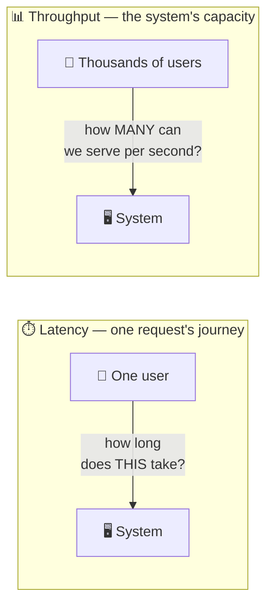
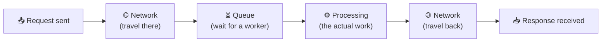

# Latency vs Throughput

> **Phase:** Core System Properties → **Topic:** 1 of 5 → **Read time:** ~45 minutes

---

## Before You Begin

Welcome to Phase 02. The Foundation phase gave you the *building blocks* — networking, APIs, storage, scaling, distributed systems, architecture. This phase gives you something different: the **yardsticks**. The five Core System Properties are the vocabulary every design conversation is conducted in, and the dimensions every design decision is measured against. Group 6 promised them; here they are.

We start with the pair that gets confused more than any other: **latency and throughput.**

You've already met both, briefly. *What Is System Design?* (§6) warned you they're not the same thing. Group 1 (§5) showed you where a request's time goes and introduced percentiles. Group 4 taught you to hunt bottlenecks. This document is where those seeds grow into the full skill: defining performance precisely, measuring it honestly, and reasoning about it the way senior engineers do.

Here's why this matters so much. When someone says *"the system is slow,"* that sentence contains almost no engineering information. Slow *how*? One user's request takes too long? Or the system can't handle enough requests at once? Those are **two completely different diseases with two completely different cures** — and mixing them up leads to expensive mistakes: doubling your server count to fix a problem more servers cannot touch, or micro-optimizing response times when the real crisis is capacity.

By the end of this document, you'll never say "it's slow" again. You'll say *which* number is bad, *at which percentile*, *under what load* — and you'll know what that implies about the fix.

> **The mindset shift:** stop asking *"is it fast?"* — start asking *"fast for **whom**, at **which percentile**, under **what load**?"* Performance is not one number. It's a distribution under a demand.

---

## Table of Contents

1. [Big Picture — Two Different Questions](#1-big-picture--two-different-questions)
2. [Latency — The Anatomy of One Request's Time](#2-latency--the-anatomy-of-one-requests-time)
3. [Throughput — The System's Capacity](#3-throughput--the-systems-capacity)
4. [Why They're Not the Same Axis](#4-why-theyre-not-the-same-axis)
5. [Measuring Latency — Percentiles and the Tail](#5-measuring-latency--percentiles-and-the-tail)
6. [Little's Law — The Equation That Connects Them](#6-littles-law--the-equation-that-connects-them)
7. [The Utilization–Latency Curve](#7-the-utilizationlatency-curve)
8. [When They Trade Against Each Other](#8-when-they-trade-against-each-other)
9. [Production Reasoning — Budgets, Peaks, and Measurement Traps](#9-production-reasoning--budgets-peaks-and-measurement-traps)
10. [Putting It All Together — A Flash Sale](#10-putting-it-all-together--a-flash-sale)
11. [Final Recap](#11-final-recap)

---

## 1. Big Picture — Two Different Questions

Every performance conversation is secretly about one of two questions:

> **Latency:** how long does **one** request take?
> **Throughput:** how **many** requests can the system handle per unit of time?

They sound related — and they are, in ways Sections 6 and 7 will make precise — but they are **different axes**. One is measured in *time* (milliseconds); the other in *rate* (requests per second). One is experienced by a single user; the other is a property of the whole system.

### The Same Word, Two Diseases

Consider two systems that both get called "slow":

- **System A:** every request completes in 4 seconds, even at 3 a.m. with one user online. Traffic is light; the servers are bored. **This is a latency problem.** Something in the request's path — a missing index, a chatty sequence of network calls, an oversized payload — takes too long, every single time. Adding servers changes *nothing*: ten bored servers each still take 4 seconds.
- **System B:** requests complete in 80ms all morning — then the lunchtime spike hits, and suddenly they take 9 seconds or time out. **This is a throughput problem.** The system's capacity is smaller than the demand, requests pile up in queues, and the pile-up is what users feel. Optimizing a single request's code path barely helps; the system needs more capacity (or less work per request).

Same complaint. Opposite causes. Opposite fixes. An engineer who can't tell these apart will reach for the wrong tool — and the wrong tool at scale is expensive.

### Both Have a Direction

Keep the "good direction" straight from day one:

| Property | Measures | Units | You want it |
|---|---|---|---|
| **Latency** | Time for one request | ms (milliseconds) | **Low** |
| **Throughput** | Completed requests per unit time | RPS / QPS (requests/queries per second) | **High** |

> 💡 **Key Insight**
>
> "The system is slow" is a symptom, not a diagnosis. The first professional move in any performance conversation is to split it: **is one request too slow (latency), or are there too many requests for the system (throughput)?** Everything else in this document builds on being able to make that split instantly.

### Quick Recap — Two Different Questions

- **Latency** = time for one request (ms, lower is better). **Throughput** = requests completed per second (RPS, higher is better).
- They are **different axes**: one is a *time*, the other a *rate*.
- A latency problem and a throughput problem produce the same complaint ("slow") but need **opposite cures**.
- More servers fix throughput problems, not latency problems; code-path optimization fixes latency problems, not capacity ones.

---

## 2. Latency — The Anatomy of One Request's Time

Group 1 introduced latency as the total time from sending a request to receiving its response. Now let's dissect it — because you can't reduce a number you can't decompose.

### The Four Components

Every request's total latency is a *sum*. Four kinds of time contribute:

| Component | What it is | Governed by |
|---|---|---|
| **Network time** | Data physically traveling between machines | Distance (speed of light), number of round trips |
| **Queue time** | The request *waiting* before anyone works on it | How busy the server is (Section 7!) |
| **Processing time** | The server actually computing — logic, DB queries, downstream calls | Code, queries, algorithms |
| **Transmission time** | Pushing the bytes onto the wire | Payload size ÷ bandwidth |

Two of these deserve special attention, because beginners consistently underestimate them:

**Queue time** is the silent killer. Processing time is usually stable — the same query takes roughly the same time at midnight and at noon. But queue time *explodes with load*: an idle server has zero queue time; a busy one can make requests wait far longer than the work itself takes. This is why the same endpoint can be fast at 3 a.m. and terrible at lunch — the *work* didn't change; the *waiting* did. Section 7 is devoted to this.

**Round trips**, not bandwidth, dominate network time for typical API traffic. A cross-continent round trip costs ~100ms *whether you send 1 KB or nothing at all* — that's physics, not congestion. A request path that makes 5 sequential cross-region calls has paid half a second before doing any work. This is why "chatty" designs (N+1 queries, call chains) are latency poison, and why the biggest network-latency wins come from making *fewer* trips, not fatter pipes.

### The Latency Ladder — Numbers Worth Knowing

You met a short version in Group 1. Here's the fuller ladder every engineer should have a feel for — not memorized to the digit, but as *orders of magnitude*:

| Operation | Approximate time | Scale intuition |
|---|---|---|
| L1 cache reference | ~1 ns | 1 second |
| RAM access | ~100 ns | ~2 minutes |
| SSD random read | ~100 µs | ~28 hours |
| Round trip, same data centre | ~0.5–1 ms | ~2 weeks |
| SSD sequential read, 1 MB | ~1 ms | ~2 weeks |
| HDD seek | ~10 ms | ~4 months |
| Round trip, same continent | ~10–40 ms | months |
| Round trip, cross-continent | ~100–150 ms | ~8 years |

(The right column rescales everything so an L1 cache hit takes "1 second" — it makes the gaps visceral.)

Look at the chasm between memory (~100 ns) and any network hop (~1 ms same-DC — **ten thousand times slower**). That single gap explains half of system design: it's why caching works (Group 4), why databases fight to keep hot data in RAM, and why every extra network hop in a request path is a real decision, not a free abstraction.

> 💡 **Key Insight**
>
> Latency is a **sum you can itemize.** When a request takes 800ms, that's not a fact — it's an unopened receipt. 300ms of round trips + 400ms of one bad query + 100ms of queueing is a *diagnosis*, and each line item has a different fix. Engineers who "optimize performance" without itemizing first are guessing. (This is bottleneck-hunting from Group 4, applied inside a single request.)

### Quick Recap — Anatomy of Latency

- Total latency = **network + queue + processing + transmission** time — always itemize before optimizing.
- **Queue time** is the component that explodes under load; processing time usually stays stable.
- **Round trips dominate** network time — chatty designs pay the distance tax repeatedly; fewer trips beat fatter pipes.
- The memory-vs-network gap (~10,000×) is the physical fact behind caching and most performance architecture.

---

*(Sections 3–11 continue in subsequent commits.)*
