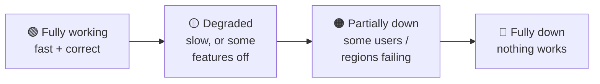
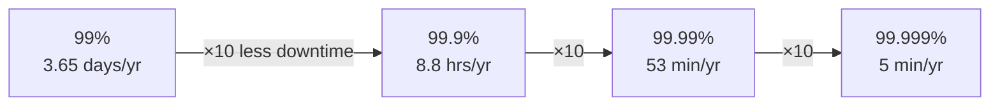
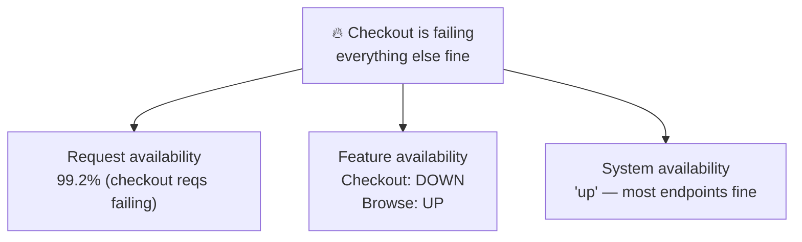
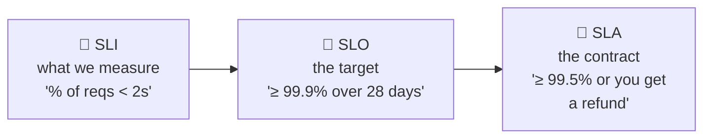
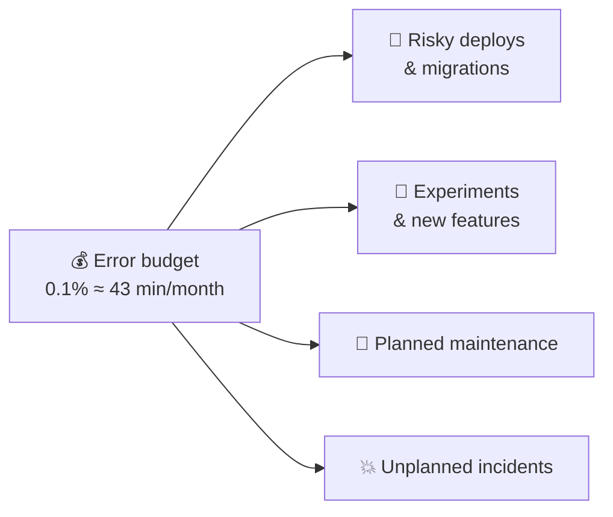
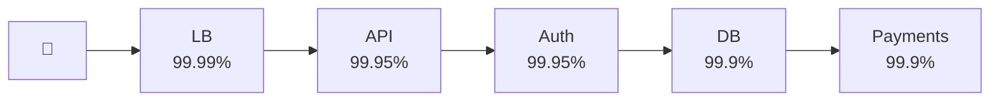
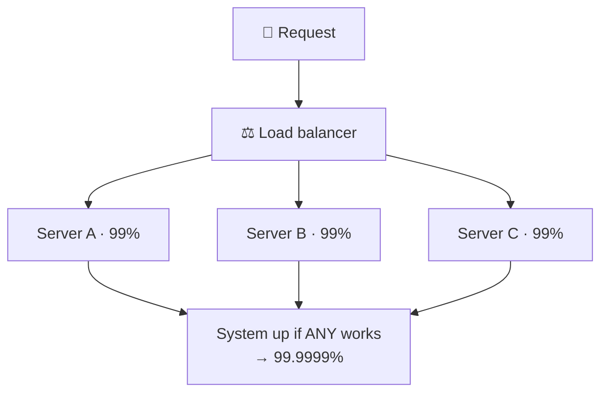
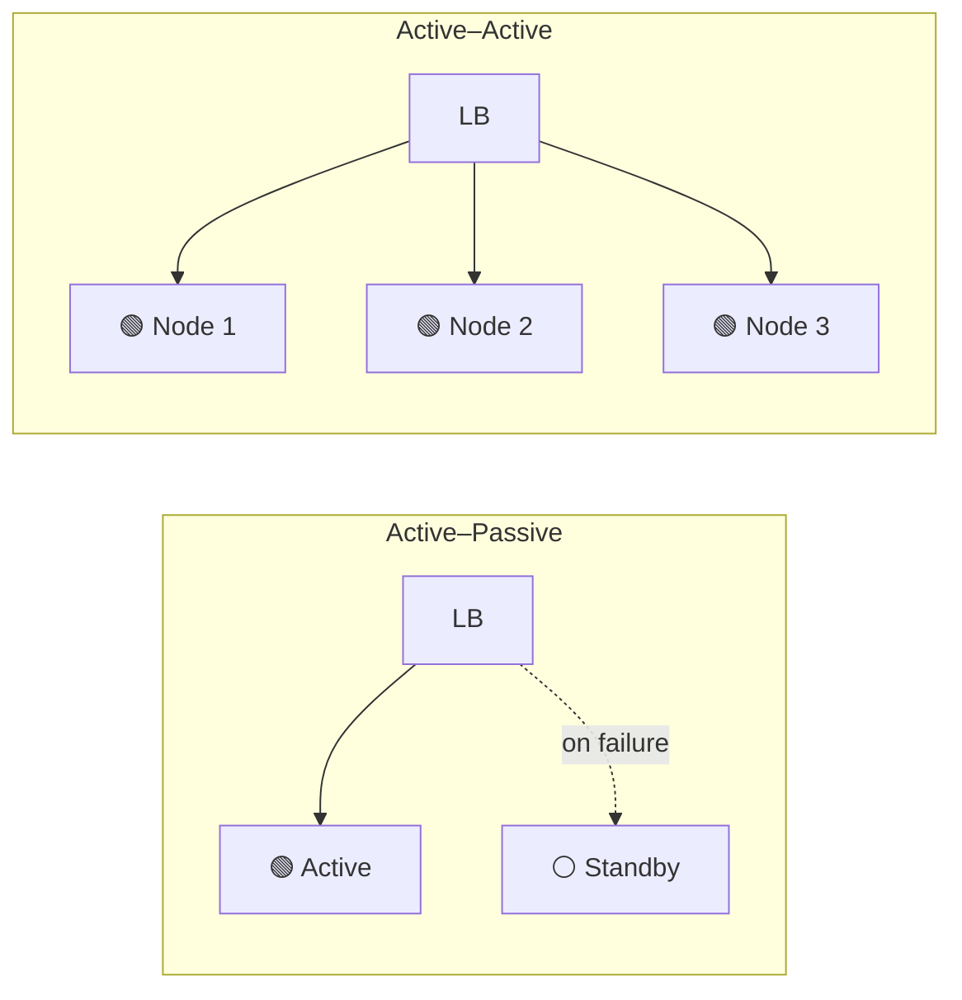
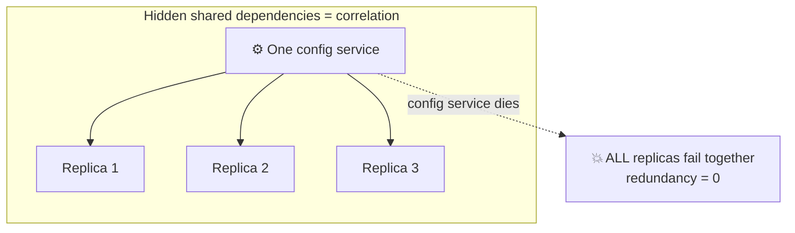
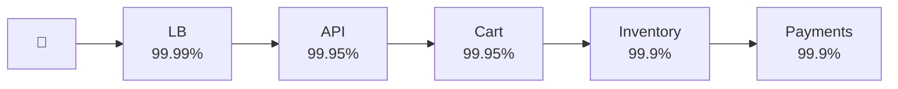

# Availability

> **Phase:** Core System Properties → **Topic:** 2 of 5 → **Read time:** ~50 minutes

---

## Before You Begin

The previous document taught you to measure *speed* — how long one request takes, how many the system handles, and how to state both with precision (percentiles, load, conditions). It ended on a promise: once you can describe performance precisely, you can *promise* it — and formalized promises are called **SLOs**. This document is where that thread gets pulled all the way through.

But first, a more primitive question than "how fast?" — one that has to be answered before speed even matters:

> **Is the system there at all?**

That sounds binary and obvious. It is neither. By the end of this document you'll see that "up" is a spectrum, not a switch; that a system answering every request in 30 seconds may be worse than one that's cleanly *offline*; and that the single most quoted reliability metric in the industry — "the nines" — hides more than it reveals until you know exactly what's being counted.

You already have the pieces you need. Group 5 taught you that distributed systems fail **partially** — not all-or-nothing, but one node here, one dependency there. Group 4 taught you **redundancy** — running more than one of everything. This document fuses them into a single measurable property and gives you the vocabulary teams actually use to argue about it: SLI, SLO, SLA, error budgets, and the availability math that decides how many nines you can honestly claim.

Here's the trap this document exists to disarm. "Is it up?" feels like a yes/no question a monitoring dashboard can answer. But *up for whom?* The user in another region seeing timeouts, while your dashboard is green? *Up doing what?* Serving the homepage but failing every checkout? *Up over what window?* 100% this second, but down for two hours last Tuesday? Every one of those is an availability question, and "yes, it's up" answers none of them.

> **The mindset shift:** stop asking *"is it up?"* — start asking *"available **to whom**, measured **how**, over **what window** — and is **degraded** the same as **down**?"* Availability is not a light switch. It's a *ratio*, over a *window*, against a *definition of working* you had to choose.

---

## Table of Contents

1. [What "Available" Actually Means](#1-what-available-actually-means)
2. [The Nines — Availability as a Number](#2-the-nines--availability-as-a-number)
3. [What Counts as Down? — Defining the SLI](#3-what-counts-as-down--defining-the-sli)
4. [SLI · SLO · SLA — The Vocabulary of Promises](#4-sli--slo--sla--the-vocabulary-of-promises)
5. [Error Budgets — Spending Unreliability Wisely](#5-error-budgets--spending-unreliability-wisely)
6. [The Math of Availability — Serial vs Parallel](#6-the-math-of-availability--serial-vs-parallel)
7. [Redundancy and Failover — Buying Nines](#7-redundancy-and-failover--buying-nines)
8. [The Cost of Nines — Diminishing Returns](#8-the-cost-of-nines--diminishing-returns)
9. [Production Reasoning — Windows, Correlation, and Blast Radius](#9-production-reasoning--windows-correlation-and-blast-radius)
10. [Putting It All Together — Brimble Sets an SLO](#10-putting-it-all-together--brimble-sets-an-slo)
11. [Final Recap](#11-final-recap)

---

## 1. What "Available" Actually Means

Start with the definition most people carry, then break it — because it's wrong in a way that matters.

**The naive definition:** "available" = "the server is running." The process is up, the port answers, the health check is green. Done.

**The problem:** none of that is what a *user* means by available. A user calls the system available when it **does useful work for them, at the moment they need it.** The server being alive is necessary but nowhere near sufficient. Consider all the ways a "running" system is unavailable to a real person:

- The process is up, but every request times out after 30 seconds (overloaded — remember the utilization curve from the latency doc).
- The homepage loads, but checkout returns 500 for everyone.
- It works perfectly — in the US datacenter, while the entire EU is cut off by a network partition.
- It returns *instantly* — the wrong data, a cached error, a "try again later" page.

In each case a naive health check says 🟢 and the user says "it's down." That gap — between *the system thinks it's fine* and *the user cannot do the thing* — is where availability actually lives.

> **Availability** is the probability that the system can successfully do what a user asks, **when** they ask it. It is measured from the user's side of the request, not the server's.

### Up Is a Spectrum

The deepest reframing in this whole topic: **"up" is not binary.** Between "perfect" and "totally offline" lies a wide band of *degraded* states, and a mature engineer thinks in that band, not at its endpoints:



This spectrum is *good news for engineers*, and it's the thread that runs through this entire document. If availability were binary, your only defense against failure would be "never fail" — impossible. Because it's a spectrum, you have a vastly richer toolkit: when something breaks, you can **degrade instead of collapse** — turn off the recommendations panel but keep checkout alive, serve slightly stale data instead of an error, drop to read-only instead of fully down. Group 5 called this *graceful degradation*; here you can see *why* it's possible at all — because "available" has a middle.

> 💡 **Key Insight**
>
> The question is never just "is it up?" — it's "**how much** of it is up, **for whom**, doing **what**?" Systems rarely die all at once; they *degrade*. Teams that only instrument "up/down" are blind to the entire middle of the spectrum — which is exactly where most real incidents live, and where the cheapest wins are found.

### Availability vs Its Cousins

Three words get used as if they're synonyms. This phase separates them, one document each — keep the distinction straight from the start:

| Property | The question it answers |
|---|---|
| **Availability** (this doc) | Is it **there and responding** usefully when I need it? |
| **Reliability** (next doc) | Does it do the **correct** thing, consistently, over time? |
| **Fault tolerance** (Group 5) | Can it **keep working when a part fails**? |

They're related but not the same: a system can be *available* but unreliable (always answers, sometimes wrong), or *reliable* but unavailable (always correct when it answers, but often down). This document is strictly about the first — being **there**. The next one takes on being **right**.

### Quick Recap — What Available Means

- Availability is measured from the **user's side**: can they do the thing, when they ask? "Server running" is not the same as "available."
- **"Up" is a spectrum**, not a binary — fully working → degraded → partially down → fully down.
- The spectrum is what makes **graceful degradation** possible: degrade instead of collapse.
- Availability (*there?*) is distinct from reliability (*correct?*) and fault tolerance (*survives a part failing?*).

---

## 2. The Nines — Availability as a Number

You cannot manage what you cannot measure, so availability gets turned into a number: the fraction of time (or of requests) the system was working, over some window.

```text
              uptime                        good requests
Availability = ───────────────────   or    ─────────────
              uptime + downtime             total requests
```

Expressed as a percentage, it's almost always very close to 100% — so the interesting information is in the *nines* after the decimal point. "Three nines" means 99.9%. And the single most important skill in this section is translating an abstract percentage into **concrete allowed downtime**, because that's where the number stops sounding impressive and starts sounding like an on-call schedule.

### The Table Worth Memorizing

| Availability | "Nines" | Downtime / year | Downtime / month | Downtime / day |
|---|---|---|---|---|
| 99% | two nines | ~3.65 days | ~7.2 hours | ~14 min |
| 99.9% | three nines | ~8.76 hours | ~43 min | ~1.4 min |
| 99.95% | | ~4.38 hours | ~22 min | ~43 s |
| 99.99% | four nines | ~52.6 min | ~4.3 min | ~8.6 s |
| 99.999% | five nines | ~5.26 min | ~26 s | ~0.86 s |

Read that table slowly, because it reshapes intuition. **99.9% sounds excellent** — and it allows *nearly nine hours of downtime a year*. **99.99%** — one more nine — cuts that to under an hour. **Five nines** ("carrier grade") leaves you **five minutes for the entire year** — which means no human can be in the recovery loop; a single bad deploy or a five-minute cloud blip blows the whole annual budget. Each nine you add cuts allowed downtime by **10×** — a fact Section 8 turns into a statement about *cost*.

These aren't abstract figures — they're the numbers the cloud you build on actually commits to. The major providers publish SLAs right in this range: compute instances are typically promised around **99.99%**, managed storage and databases around **99.9%–99.99%**, with **service credits** (not refunds — §4's SLA teeth) when they miss. When you build on a dependency that promises 99.99%, you've just met the ceiling Section 6 is about: *your* availability can't exceed your dependencies' unless you add redundancy across them.



### More Nines Is Not "Better" — It's a Choice

The beginner instinct is that five nines is the goal and everything else is settling. **Wrong**, and expensively so. More nines is not a quality ranking; it's a *requirements decision* with a steep price (doc 00's tradeoff thinking, applied to uptime):

- A **payment or emergency system** may genuinely need four or five nines — an outage means lost money or lost lives.
- An **internal analytics dashboard** at 99.9% (or even 99%) is completely fine — nobody is harmed if it's down for an hour during a quiet weekend, and the money to make it five-nines would be pure waste.

The right number is set by **what a minute of downtime actually costs** *this* system's users — not by how impressive the number looks in a slide. Section 8 makes the economics explicit; for now, internalize that chasing nines you don't need is one of the most common and costly over-engineering mistakes there is.

> ⚠️ **A nines figure with no window and no definition is marketing, not engineering.** "We're 99.99% available" means almost nothing until you know: measured over what window (a good year can hide a catastrophic month), counting what as "down" (all requests? checkout only?), and for whom (globally? per region?). The next two sections make those the *first* questions you ask — before you believe any availability number, including your own.

### Quick Recap — The Nines

- Availability = uptime ÷ total time (or good ÷ total requests) — the useful information is in the **nines**.
- Translate nines to **downtime**: 99.9% ≈ 8.8 hrs/year, 99.99% ≈ 53 min/year, 99.999% ≈ 5 min/year.
- Each added nine cuts allowed downtime **10×** — and (Section 8) costs roughly 10× more.
- **More nines isn't "better"** — the target is a requirements decision set by the cost of downtime, not a quality score.
- A nines number is meaningless without its **window**, **definition of down**, and **audience**.

---

## 3. What Counts as Down? — Defining the SLI

Section 2 handed you a formula with a term quietly hiding all the difficulty: *good* requests, or *up*time. Who decides what "good" and "up" mean? This is the hardest and most-skipped question in the whole topic — and getting it wrong makes every nine you report a fiction.

### The Measurement Problem

Imagine your service returns a response in **28 seconds**. Was that request "available"? Technically it succeeded — status 200, correct data. But the user gave up at second 4 and left. Or: a request returns instantly with `200 OK` and a body that says `{"error": "temporarily unavailable"}`. Status code says up; the user got nothing. Or: half your servers are serving fine and half are returning 503 — are you "up"?

There is no universe-given answer. **You have to define it** — and the definition is an engineering decision with real consequences. This is why the industry invented a precise term for "the thing we actually measure":

> **SLI — Service Level Indicator:** a specific, quantitative measurement of one aspect of the service's behavior. It is the *definition of "working"*, made concrete enough to compute.

### Slow Is a Kind of Down

Here the previous document pays off directly. That 28-second response is the bridge: **latency and availability are not separate concerns — past some threshold, slow simply *is* down.** A response nobody waits for is functionally a failure, whatever its status code. So mature availability SLIs almost always fold latency in:

> *"A request is **good** if it returns a non-error status **within 2 seconds**."*

That single sentence quietly unifies the two properties. A request that's correct but takes 30 seconds fails the SLI — counted as unavailable, exactly as the user experienced it. This is why the latency doc insisted you nail down percentiles and thresholds first: **your availability number is built on top of a latency threshold you chose.** Change "2 seconds" to "10 seconds" and your availability improves without a single line of code changing — which should make you suspicious of any availability figure whose latency threshold you don't know.

### Three Common SLI Shapes

Most availability SLIs are one of these, and picking among them is itself a decision:

| SLI type | "Good" means | Best when |
|---|---|---|
| **Availability (success rate)** | Non-5xx response | The basic "did it work?" signal |
| **Latency** | Response within threshold (e.g. P99 < 2s) | Slow = down; user-facing paths |
| **Quality / correctness** | Full response, not a degraded fallback | You serve partial results under stress (§1's spectrum) |

The third one is subtle and senior: if under load you drop the recommendations panel to keep checkout alive, is that request "good"? Checkout worked — but the user got a lesser experience. Whether you count degraded responses as available is a *product* judgment, and writing it into the SLI forces you to make it on purpose rather than by accident.

### Whose Availability? Request vs System vs Feature

"Available" needs a subject. Three different subjects give three very different numbers from the same incident:



A dashboard reporting **system** availability can show a reassuring 99.95% while your **checkout feature** — the one that makes money — is completely down for an hour. This is why aggregate, system-wide availability is often a *comforting lie*: it averages your critical path together with your health-check endpoint. Senior teams measure availability **per critical user journey** (checkout, login, search), not as one blended site-wide number, because the blend hides exactly the failures that matter most.

> 💡 **Key Insight**
>
> Before you can improve availability, you must *define* it — and the definition is where the real decisions hide. What status counts as failure, what latency counts as down, whether degraded counts as up, and *which* user journey you're measuring: change any of those and the number moves without the system changing at all. An availability figure is only as honest as the SLI beneath it.

### Quick Recap — Defining the SLI

- An **SLI** is the concrete, computable *definition of "working"* — you must choose it; the universe won't.
- **Slow is a kind of down**: good availability SLIs fold in a latency threshold (the latency doc, cashed in).
- Common SLI shapes: **success rate**, **latency**, and **quality/correctness** (does degraded count as good?).
- Availability has a **subject** — request vs feature vs system — and system-wide numbers hide dead critical paths. Measure **per user journey**.

---

## 4. SLI · SLO · SLA — The Vocabulary of Promises

You now have the *measurement* (the SLI). Turning a measurement into a managed property takes two more terms — and the three together are the single most useful vocabulary in this document. They form a ladder: **measure → target → promise.**



| Term | Full name | What it is | Audience |
|---|---|---|---|
| **SLI** | Service Level *Indicator* | The metric — what you actually measure (§3) | Internal (engineers) |
| **SLO** | Service Level *Objective* | The **target** for that metric — the line between "fine" and "not fine" | Internal (the team's goal) |
| **SLA** | Service Level *Agreement* | A **contract** with customers, with **consequences** (refunds, credits) if breached | External (legal/commercial) |

### The Distinctions That Matter

**SLI → SLO** is measurement → goal. The SLI says "99.94% of requests were good over the last 28 days"; the SLO says "we promise ourselves ≥ 99.9%." The SLO is the *decision about how good is good enough* — and, as the next section shows, it's the thing that governs how the team behaves day to day.

**SLO → SLA** is goal → contract, and the gap between them is deliberate and important:

> ⚠️ **Your SLA should always be *looser* than your SLO.** You promise customers 99.5% (SLA) while targeting 99.9% internally (SLO). Why the gap? Because the SLA has *teeth* — money changes hands when you miss it — so you build in a safety margin. The SLO is your early-warning line; you want to be alerting and scrambling (SLO breached) *long before* you're paying refunds (SLA breached). A team whose SLA equals its SLO has no margin between "we're worried" and "we owe money."

Two more practical truths:

- **Not everything needs an SLA.** SLAs are commercial instruments — you write them for paying customers who demand guarantees. Internal services and free tiers often have SLOs (targets the team holds itself to) with no SLA at all.
- **100% is never the target.** No SLO is ever 100%, and no SLA promises it, because 100% is both impossible and — as the next section argues — *undesirable*. This is where availability stops being an aspiration ("stay up!") and becomes a managed budget.

> 💡 **Key Insight**
>
> SLI, SLO, SLA are **measure → target → promise**, aimed at three different audiences. The most common mistakes are conflating the target with the contract (leaving no safety margin before penalties) and writing an SLA for something that never needed one. Get the ladder straight and most availability conversations suddenly have precise words to happen in.

### Quick Recap — SLI · SLO · SLA

- **SLI** = the metric you measure; **SLO** = the internal target for it; **SLA** = the external contract with consequences.
- Keep the **SLA looser than the SLO** — the gap is your safety margin between "worried" and "paying refunds."
- **Not every service needs an SLA**; many have SLOs only.
- **No SLO is 100%** — which turns availability from an aspiration into a *budget* (next section).

---

## 5. Error Budgets — Spending Unreliability Wisely

Section 4 ended on a claim that sounds almost heretical: **100% availability is not the goal.** This section is why — and it contains the single most behavior-changing idea in the whole topic. It's the concept that turns availability from a vague virtue ("try not to break things") into a *currency teams actively spend*.

### Why 100% Is the Wrong Target

Three independent reasons, each sufficient on its own:

1. **It's impossible.** Hardware fails, networks partition, dependencies go down, deploys go wrong. Physics and other people's systems guarantee you cannot hit 100%.
2. **The user can't tell.** If the user's own network, phone, or ISP is 99.9% reliable, the difference between your 99.99% and your 100% is *invisible to them* — it's drowned out by everything between your servers and their eyes. Paying to eliminate failures no user can perceive is spending real money for zero delivered value.
3. **It would freeze the system.** The only way to approach 100% is to *never change anything* — no deploys, no new features, no experiments. But shipping change is the entire point of a product. **Perfect availability and progress are in direct conflict.**

That third reason is the important one, and it reframes everything:

> 💡 **Key Insight**
>
> The tension isn't "availability vs. laziness" — it's **availability vs. velocity.** Every deploy, migration, and feature risks availability; refusing to ship protects availability but kills the product. So the real question is never "how do we never fail?" It's "**how much failure can we afford** — and how do we spend it on the changes worth making?" That budget has a name.

### The Error Budget

If your SLO is 99.9%, you are *promising* 99.9% — which means you are explicitly declaring the other **0.1% is allowed to fail.** That 0.1% is not a shameful accident to drive to zero. It's a **resource you are permitted to spend.**

> **Error budget = 100% − SLO.** It is the amount of unreliability you've *pre-approved* for the window — a currency the team gets to spend on risk.

For a 99.9% monthly SLO, the budget is 0.1% of the month ≈ **43 minutes** of allowed downtime. That 43 minutes is *yours to allocate*:



### How a Budget Changes Behavior

The magic is what an error budget does to the age-old fight between the team that wants to *ship* and the team that wants *stability*. Instead of a values argument ("move fast!" vs. "be careful!"), it becomes a **data question about the remaining balance** — and that resolves the classic tension the way few things in engineering do:

- **Budget healthy (lots left):** ship aggressively, take risks, run experiments, push deploys. You're being *too* conservative if you're not spending it — unused reliability budget is shipped features you didn't build.
- **Budget spent (SLO breached):** the calculus flips automatically. Feature work pauses; the team's priority becomes reliability — fix the fragility, add redundancy, improve testing — until the budget refills over the next window.

This is the mechanism famously formalized by Google's SRE practice: the error budget makes "should we ship this risky change?" an objective decision instead of a personality clash. Reliability and velocity stop being enemies and become two sides of one account.

### Burn Rate — Reading the Budget in Real Time

One refinement makes budgets operational: you watch not just *how much* is left but *how fast it's draining* — the **burn rate**. Spending your monthly budget evenly is fine; spending half of it in ten minutes is an emergency in progress. Burn-rate alerts fire on the *slope*, not just the level: "at this rate you'll exhaust the month's budget in 45 minutes" pages someone *now*, while there's still budget left to protect — the same early-warning philosophy the latency doc applied to P99.

> ⚠️ **An unspent error budget is not a trophy — it's a signal.** A team that ends every month at 100% availability isn't winning; it's very likely shipping too slowly and being too cautious. The budget exists to be *spent* on progress. Consistently leaving it untouched means your SLO is probably too lax, or your team is leaving product velocity on the table out of misplaced fear.

### Quick Recap — Error Budgets

- **100% is the wrong target**: impossible, imperceptible to users, and only reachable by freezing all change.
- The real tradeoff is **availability vs. velocity** — every change risks uptime, but not changing kills the product.
- **Error budget = 100% − SLO** — pre-approved unreliability, a *currency* to spend on deploys, experiments, and risk.
- It turns ship-vs-stability from a values fight into a **balance check**: spend freely when healthy, freeze features when exhausted.
- Watch **burn rate** (the slope) for early warning; a chronically *unspent* budget means you're shipping too cautiously.

---

## 6. The Math of Availability — Serial vs Parallel

Time for the result that reorganizes how you see every architecture diagram. Availability *composes* — the availability of a whole system is a function of its parts' availabilities — and it composes in two opposite directions depending on whether parts are arranged **in series** or **in parallel.** This is the mathematical heart of the topic.

### Series — Dependencies Multiply (and It's Brutal)

When a request must pass through several components and **every one must work**, they're in *series*. The system works only if component A **and** B **and** C all work — and probabilities of independent "and" conditions **multiply**:

```text
A_total = A_1 × A_2 × A_3 × … × A_n
```

Multiplying numbers below 1 always gives something *smaller than any of them.* A chain is **less available than its weakest link** — and far less available than intuition expects. Watch how fast it decays even with excellent parts:



| Services in series (each 99.9%) | Combined availability | Downtime / year |
|---|---|---|
| 1 | 99.9% | ~8.8 hrs |
| 5 | 99.5% | ~1.8 days |
| 10 | 99.0% | ~3.6 days |
| 30 | 97.0% | ~11 days |
| 50 | 95.1% | ~18 days |

Thirty "three-nines" services in a chain produce a **97%** system — barely two nines. This is one of the most important and least intuitive facts in system design, and it explains a defining pain of microservices (Group 6): decomposing a monolith into 30 services means a single user request may now traverse 30 independently-failing hops, and their availabilities *multiply downward*. **You cannot build a highly-available system by chaining many mediocre parts** — the math forbids it.

> ⚠️ **Every dependency you add to the critical path drags total availability *down*, multiplicatively.** Before adding a synchronous call to another service into a request, ask: does this belong on the critical path at all? Each hop there spends availability you can't easily get back. This is a core reason to push non-essential work *off* the request path and into async processing (Group 6) — work that isn't in the chain can't lower the chain's availability.

### Parallel — Redundancy Multiplies the *Failures*

Now the opposite arrangement — and the only escape from the series problem. When you run **redundant copies** and the system works if **any one** of them works, they're in *parallel*. Here it's easier to reason about *failure*: the system is down only if **all** copies are down simultaneously, and those failure probabilities multiply:

```text
Unavailability_total = (1 − A) ^ n
A_total = 1 − (1 − A) ^ n
```

Because unavailabilities are small numbers below 1, multiplying them makes them *tiny* — redundancy adds nines fast:

| Redundant copies (each 99%) | Combined availability | Downtime / year |
|---|---|---|
| 1 | 99% | ~3.65 days |
| 2 | 99.99% | ~53 min |
| 3 | 99.9999% | ~32 s |

Two 99% components in parallel yield **99.99%** — the same jump that costs a fortune to buy inside a single component (Section 8) comes almost free from a second cheap copy. This is *why* redundancy is the universal availability tool: series drags you down, parallel lifts you back up, and real systems are a constant interplay of both.



> 💡 **Key Insight**
>
> Availability composes in two directions: **series multiplies availabilities** (every dependency drags the total *down* — a chain is weaker than its weakest link), while **parallel multiplies failure probabilities** (every redundant copy lifts the total *up*, fast). Reading any architecture, your eye should now split it instinctually into "what's in series here (risk stacking up) and what's in parallel (risk cancelling out)?"

### Quick Recap — Serial vs Parallel

- **Series (all must work):** availabilities *multiply* → total is **below the weakest link**; 30 × 99.9% ≈ 97%.
- Every **critical-path dependency** lowers availability multiplicatively — keep non-essential work off the request path.
- **Parallel (any can work):** *unavailabilities* multiply → redundancy adds nines cheaply; 2 × 99% ≈ 99.99%.
- Real systems interleave both — train your eye to see which parts stack risk and which cancel it.

---

## 7. Redundancy and Failover — Buying Nines

Section 6 proved *that* parallelism buys availability. This section is the *mechanism* — how redundancy actually works in practice, and the costs the clean math hides. (True to the Phase 02 charter, this is the intuition, not a build guide — the deep mechanics live in the Scaling and Distributed Systems phases.)

### Redundancy Needs a Switch

A spare copy is useless unless traffic can actually move to it when the primary dies. Redundancy therefore always has two parts: **replicas** (the spare capacity) and **failover** (the mechanism that detects failure and redirects). The two dominant arrangements:

| Model | How it works | Tradeoff |
|---|---|---|
| **Active–Passive** (standby) | One live node serves; a standby waits, ready to take over | Simpler, but the standby is idle capacity you pay for and rarely test |
| **Active–Active** | All nodes serve traffic simultaneously; losing one just sheds load onto the rest | Full use of capacity + instant failover, but harder — state, balancing, consistency |



### Failover Time Is Its Own Downtime

Here's what Section 6's tidy formula quietly ignored: **failover is not instant.** Between the primary failing and the replica serving, there's a gap — detect the failure (health checks must notice), promote the standby, reroute traffic, warm caches and connection pools (cold-start, from the latency doc). That gap is *real downtime*, and it caps the availability redundancy can actually deliver:

- Failover in **milliseconds** (active-active behind a load balancer): the math nearly holds.
- Failover in **minutes** (detect + promote a database replica): you've *reduced* downtime, not eliminated it — and if failover is flaky or needs a human, your real availability is far below what the parallel formula promised.

> ⚠️ **Untested failover is not redundancy — it's a hope.** The standby that has never actually taken traffic, the replica promotion nobody has rehearsed, the "automatic" failover that silently broke three deploys ago — these routinely fail at the exact moment they're needed, turning your paper 99.99% into a real outage. This is why teams practice failure on purpose (chaos engineering, from Group 5): the only redundancy that counts is the kind you've *watched* work.

### The Ceiling: Correlated Failure and SPOF

The parallel formula assumes failures are **independent** — that's what lets you multiply them. Reality rarely cooperates, and this is the crack that Section 9 widens: two servers in the *same rack* share a power supply; two replicas in the *same datacenter* share a network and a cooling system; two services sharing *one config system* fail together when it does. When copies fail *together*, the `(1−A)ⁿ` math evaporates — you weren't running `n` independent copies, you were running one copy with `n` faces.

The extreme case has a name you'll meet as a full topic soon: a **Single Point of Failure (SPOF)** — a single component with no redundancy whose failure takes the whole system down, no matter how much redundancy surrounds it. The load balancer in front of your beautifully redundant server fleet, if there's only one of it, is a SPOF that caps the entire system at *its* availability. Finding and eliminating SPOFs is Topic 5 of this phase; for now, note that **redundancy only helps where failures are genuinely independent** — and making them independent (spreading across racks, zones, regions, providers) is most of the actual work.

> 💡 **Key Insight**
>
> Redundancy buys nines only to the degree that failures are *independent* and failover is *fast and tested*. The clean `1−(1−A)ⁿ` is an **upper bound** you approach but never reach — eroded by failover time, correlated failure, and the SPOFs hiding in shared infrastructure. Diminishing returns set in hard: going from one copy to two is transformative; from three to four often buys almost nothing, because by then correlated failure, not lack of copies, is your real ceiling.

### Quick Recap — Redundancy and Failover

- Redundancy = **replicas + failover**; the switch matters as much as the spare.
- **Active-passive** (simple, idle standby) vs **active-active** (efficient, instant failover, harder).
- **Failover time is downtime** — a slow, flaky, or human-in-the-loop switch undercuts the parallel-availability math.
- The formula assumes **independent** failures; **correlated failure** and **SPOFs** (shared racks/zones/configs) are the real ceiling — and the reason returns diminish fast past two copies.

---

## 8. The Cost of Nines — Diminishing Returns

Every prior section has hinted at a price. This one names it — and it's the senior-level insight of the topic, the availability analogue to the latency doc's utilization curve: **the relationship between availability and cost is not linear. It's exponential.**

### Each Nine Costs Roughly 10× the Last

Recall from Section 2 that each nine cuts allowed downtime tenfold. The mirror fact is that each nine *costs* roughly tenfold to achieve — because eliminating each successive order of magnitude of downtime requires attacking failure modes the previous level let you ignore:

| Target | What it typically takes |
|---|---|
| **99%** | A single well-run server; restart it when it breaks |
| **99.9%** | Redundancy, load balancing, automated deploys, basic monitoring |
| **99.99%** | Multi-zone redundancy, fast automated failover, on-call rotation, no single points of failure |
| **99.999%** | Multi-region active-active, no human in the recovery loop, chaos testing, redundant *everything* — and an org built around reliability |


The jump from 99% to 99.9% might be a weekend of load-balancer work. The jump from 99.99% to 99.999% can mean a multi-region active-active rebuild and reorganizing the company around reliability — for **~47 fewer minutes of downtime a year**. Whether those 47 minutes are worth a multi-million-dollar program is *exactly* the question, and it has different answers for a stock exchange and a recipe blog.

### The Curve, and Where to Stop

Plot availability against cost and you get a hockey stick — flat and cheap at first, then near-vertical:

```text
  Cost
    │                                        ╭─ 99.999%
    │                                       ╱
    │                                    ╭─╯
    │                              ╭─────╯ 99.99%
    │                    ╭─────────╯
    │        ╭───────────╯ 99.9%
    ├────────╯ 99%
    └──────────────────────────────────────────→ Availability
```

The engineering skill is knowing **where on this curve to stop** — and the answer comes from the economics, not from ambition:

> **Target availability ≈ the point where the cost of one more nine exceeds the cost of the downtime it prevents.**

Put the two numbers side by side. If an hour of downtime costs you \$1,000 in lost revenue and goodwill, spending \$5M to eliminate 45 minutes a year is deranged. If you're a payment processor losing \$500K per *minute*, five nines is a bargain and you buy more. Same curve, opposite decisions — because the *cost of downtime*, not the beauty of the number, sets the target. This is doc 00's "requirements drive design" and the latency doc's "fast for whom, at what cost" wearing a reliability hat.

> 💡 **Key Insight**
>
> Availability is bought in exponentially expensive increments, so "as available as possible" is never the right answer — "**as available as the downtime cost justifies**" is. The mature move is to *deliberately* pick a target lower than the maximum achievable, because the money saved buys more user value spent elsewhere (features, latency, new products). Choosing *not* to chase another nine is a sign of engineering judgment, not of cutting corners.

### Availability Trades Against the Other Properties

Nines don't just cost money — they're spent against the other yardsticks in this phase, and naming the trades keeps you honest:

- **Availability vs. consistency:** during a network partition you must often choose — stay available and risk serving stale/divergent data, or stay consistent and refuse to answer. This is the **CAP theorem** (Group 5), and it's coming as its own deep topic. You cannot have both when the network splits.
- **Availability vs. latency:** redundancy across distant regions adds availability but also adds network distance (the latency doc's speed-of-light tax) — the copy that survives a regional outage is farther from some users.
- **Availability vs. cost/simplicity:** every nine adds moving parts, and moving parts are their own failure sources. Past a point, complexity added in the name of availability starts *reducing* it.

### Quick Recap — The Cost of Nines

- Each nine cuts downtime 10× and **costs ~10× more** — availability vs. cost is an exponential curve.
- **Stop where the next nine costs more than the downtime it prevents** — set the target by the *cost of downtime*, not by ambition.
- Deliberately choosing a *lower* target to spend the savings elsewhere is **good judgment**, not corner-cutting.
- Availability **trades against** consistency (CAP), latency (distant redundancy), and simplicity (complexity as its own risk).

---

## 9. Production Reasoning — Windows, Correlation, and Blast Radius

You have the concepts. This section is how practitioners avoid fooling themselves with them — because availability, even more than latency, is a number that lies when you're not careful.

### The Measurement Window Changes Everything

An availability number is meaningless without the window it's computed over, and *which* window you pick can flatter or damn the same system:

- **Rolling vs. calendar:** a rolling 28-day window (today minus 28 days, recomputed continuously) is honest — it can't hide a bad patch behind a calendar boundary. A "per calendar month" window resets on the 1st, so an outage spanning month-end gets *split* across two budgets and looks smaller in each.
- **Long windows launder outages.** A single catastrophic 8-hour outage violates a 99.9% *monthly* SLO outright, but against a *yearly* window it's diluted by eleven good months to a survivable-looking figure. The same incident, "99.98% for the year" or "SLO breached in March," depending only on the window. Attackers of your dashboard — including your honest self — should always ask *over what window?* first.

### Planned vs. Unplanned Downtime

Not all downtime is equal, and how you count planned maintenance is a real decision. Maintenance windows announced in advance, at low-traffic hours, hurt users far less than a surprise 3 p.m. outage — and many SLAs explicitly *exclude* announced maintenance. But beware the trap: excluding "planned" downtime too generously lets a team keep a green dashboard while users still can't use the system. If a user can't check out, they do not care that the outage was on your calendar. The honest SLI counts what the *user* experienced; the SLA may carve out negotiated exceptions.

### Correlated Failure — The Independence Lie

Section 7 warned that the parallel-availability math assumes independent failures. In production, **independence is the exception, not the rule** — and correlated failure is where most "but we had redundancy!" outages are born:



The ways "independent" copies secretly fail together:

- **Shared infrastructure:** same rack, power, network switch, availability zone, or cloud region.
- **Shared dependencies:** all replicas hit the same database, config service, DNS, or auth provider — that shared thing is the real SPOF.
- **Shared code and deploys:** the same bad deploy or poisoned config rolls out to *all* replicas at once. Your redundancy is perfect against hardware failure and useless against a bad `git push` — which is why progressive/canary rollouts exist.
- **Correlated load:** a traffic spike or a retry storm (the latency doc's goodput collapse) hits every replica simultaneously; they fall like dominoes.

> ⚠️ **Redundancy protects only against the failures that are actually independent.** Three replicas behind one config service, one database, or one deploy pipeline are *not* three-times-available — they're one component wearing three hats. Before trusting a redundancy story, hunt the shared dependency: "what single thing, if it failed, takes all of these down at once?" That question is the seed of the SPOF topic — and the most valuable one to ask about any "highly available" design.

The industry's largest outages are almost all correlated-failure stories, not "we didn't have enough copies" stories. The recurring pattern in public cloud post-mortems is a *shared control plane* letting go — one region's core networking, DNS, or a central metadata/config service fails, and every "redundant" service depending on it goes down together, often cascading as retries pile on (the latency doc's goodput collapse). Thousands of independently-architected companies discover simultaneously that their redundancy shared a floor. The lesson repeats: **redundancy across things that share a hidden dependency is one component with extra copies of its faces** — real independence means spreading across zones, regions, and sometimes providers, which is expensive and is exactly why §8's nines cost what they do.

### Blast Radius and the User's-Eye View

Two final production instincts:

- **Blast radius** — when something fails, *how much* fails with it? A design where one bad shard degrades 5% of users is dramatically healthier than one where any failure is total. Limiting blast radius (bulkheads, cells, sharding — later phases) means failures degrade the system (§1's spectrum) instead of dropping it. Availability engineering is often less about *preventing* failure than about *containing* it.
- **Component vs. user-perceived availability** — the number that ultimately matters is the one measured at the user's eyeballs, end to end, including their network, DNS, CDN, and client. Every internal component can report green while users still can't log in. Instrument the **real user journey** (synthetic probes, real-user monitoring), not just the pieces you find easy to measure.

### Quick Recap — Production Reasoning

- Always ask **"over what window?"** — long/calendar windows launder outages that a rolling 28-day window exposes.
- Distinguish **planned vs. unplanned** downtime, but count what the *user* felt — don't let "planned" carve-outs green-wash real pain.
- **Correlated failure** (shared infra, dependencies, deploys, load) breaks the independence the redundancy math assumes — hunt the shared SPOF.
- Engineer the **blast radius** (contain failures into the §1 spectrum) and measure **user-perceived**, end-to-end availability, not just green components.

---

## 10. Putting It All Together — Brimble Sets an SLO

Meet **Brimble** again — the e-commerce site that survived a flash sale in the latency document. That was a *performance* fire drill. This is a slower, more deliberate exercise: Brimble has never had a real availability target, incidents are handled by vibes and heroics, and the business wants to sell an "enterprise" plan whose customers will demand an SLA. You're asked to put availability on an engineering footing. Walk it like a pro, one section per tool.

### Step 1 — Define "Down" Before Measuring (§1, §3)

The first meeting isn't about servers; it's about *definitions*. "Is Brimble up?" is refused as a question. Instead: **which user journeys matter, and what counts as good for each?** The team lands on three critical journeys and writes an SLI for each — folding in latency, because a checkout that takes 30 seconds is down (the latency doc, cashed in):

- **Checkout** (the money path): *good* = completes with a non-error response in < 3s.
- **Browse/search:** *good* = returns results in < 1s.
- **Homepage:** *good* = loads in < 2s.

Crucially they measure these **per journey**, not as one blended site-wide number — so a checkout outage can never hide behind a healthy homepage (§3's comforting lie).

### Step 2 — Pick Targets by the Cost of Downtime (§2, §8)

Not every journey deserves the same nines. The team sizes each target by *what an hour down actually costs* (§8), refusing the temptation to slap five nines on everything:

| Journey | SLO | Why |
|---|---|---|
| **Checkout** | 99.95% | Directly loses money and trust when down — but five nines isn't worth a multi-region rebuild yet |
| **Browse** | 99.9% | Important, but a brief blip is survivable |
| **Homepage** | 99.9% | Front door; degraded is acceptable |

Checkout's 99.95% ≈ **22 minutes** of allowed downtime a month — the error budget the rest of the plan spends against.

### Step 3 — Do the Series Math, and Recoil (§6)

Now the sobering part. The team maps checkout's *actual* dependency chain and multiplies (§6):



```text
0.9999 × 0.9995 × 0.9995 × 0.999 × 0.999  ≈  0.9969  →  99.69%
```

Checkout's real availability is **99.69%** — *below* the 99.95% target, before a single extra feature is added. The chain is weaker than its weakest link, exactly as §6 warned. Two offenders stand out: the single load balancer (a **SPOF**, §7) and the third-party **payments** provider at 99.9%, sitting right on the critical path.

### Step 4 — Buy Back Availability with Parallel (§7)

The team applies §6's parallel escape and §7's mechanics, targeting the weak links rather than gold-plating everything:

- **Load balancer SPOF → redundant LBs** across two zones with fast failover: 99.99% → ~99.999%, and the single-point-of-failure is gone.
- **Payments SPOF → a second payment provider** as failover. Two 99.9% providers in parallel: 1 − (0.001 × 0.001) ≈ **99.9999%** — the payments hop essentially stops being a risk.
- **Inventory** gets a read replica so a primary blip degrades to read-only (§1's spectrum) instead of failing checkout.

Re-running the multiplication with the weak links hardened lifts checkout above the 99.95% target — *with margin*. Note the judgment: they spent redundancy money on the two worst links, not uniformly (§8's diminishing returns).

### Step 5 — Turn the Budget into Behavior (§5)

With checkout at ~99.96% measured, the ~22-minute monthly error budget becomes the team's operating currency (§5). They wire it into how they work: **budget healthy → ship features and risky deploys freely; budget burning fast → a burn-rate alert pages on-call; budget exhausted → checkout feature-freeze until it refills.** The perennial ship-vs-stability argument is now a balance check, not a shouting match.

### Step 6 — Set the SLA Looser, and Watch Honestly (§4, §9)

For the new enterprise plan, Brimble promises customers **99.9%** checkout availability (SLA) while targeting **99.95%** internally (SLO) — the deliberate gap (§4) so alerts fire well before refunds do. And they instrument it honestly (§9): a **rolling 28-day** window (no calendar-boundary laundering), measured at the **user's eyeballs** with synthetic checkout probes from multiple regions, and a standing question in every design review — *"what single shared thing takes all of this down at once?"* (§9's correlated-failure hunt).

### The Payoff — An Outage That Isn't a Crisis

Two months later, the **primary payment provider has a two-hour regional outage.** In the old world, that's checkout down for two hours and the enterprise deal dead. Now: failover to the second provider kicks in within seconds (§7), checkout stays up, the error budget takes a small, survivable dent, and the SLA is never breached. The incident is a footnote in a channel, not an all-hands fire. **Nothing exotic saved them** — just definitions chosen on purpose, math done honestly, redundancy placed where it paid, and a budget that turned reliability into a daily decision.

---

## 11. Final Recap

| Concept | Core Insight | Biggest Tradeoff |
|---|---|---|
| **Availability** | Can the user do the thing, when they ask? Measured from *their* side, not the server's | Being "there" is distinct from being correct (reliability) |
| **Up as a Spectrum** | Systems degrade, they don't just die — there's a wide middle | Instrumenting only up/down blinds you to where incidents live |
| **The Nines** | Each nine cuts allowed downtime 10× (99.9% ≈ 8.8 hrs/yr) | Each nine also costs ~10× more |
| **SLI** | The *definition of working* — you must choose it (status, latency, quality) | Move the threshold and the number moves without the system changing |
| **SLO / SLA** | Internal target vs external contract with consequences | SLA must stay looser than SLO, or there's no margin before penalties |
| **Error Budget** | 100% − SLO = pre-approved unreliability to *spend* on velocity | The real fight is availability vs. shipping speed |
| **Series Math** | Dependencies *multiply* — a chain is weaker than its weakest link (30 × 99.9% ≈ 97%) | Every critical-path hop drags availability down |
| **Parallel Math** | Redundant copies multiply *failures* away — nines get cheap (2 × 99% ≈ 99.99%) | Only works when failures are independent |
| **Failover** | Redundancy needs a fast, *tested* switch | Failover time is itself downtime; untested failover is a hope |
| **Cost of Nines** | Availability vs. cost is exponential — stop where the next nine costs more than the downtime it prevents | Chasing unneeded nines is expensive over-engineering |
| **Correlated Failure** | Shared infra/deps/deploys make "independent" copies fail together | Your redundancy is only as real as your independence |

### The One Thing to Remember

> **Availability isn't "is it up?" — it's a *ratio*, over a *window*, against a *definition of working you chose*, spent as a *budget*. Series dependencies multiply availability *down* (a chain is weaker than its weakest link); parallel redundancy multiplies failure *away* — but only as far as failures are independent and failover is tested. And 100% is never the target: pick the nines the cost of downtime justifies, then spend the rest on progress.**

---

## What's Next

> **Topic 3 — Reliability**

You can now reason about whether a system is **there**. The next property asks a sharper question that availability alone can't answer:

> **When it *is* there and answers — does it do the *right thing*?**

A system can be beautifully available and deeply unreliable: it responds to every request, on time, with the *wrong* answer — a double-charged card, a lost write, a corrupted order. Availability counts the response; **reliability** asks whether the response was *correct*, and whether it stays correct over time and under failure. You've already brushed against the boundary — the SLI's "quality/correctness" flavor (§3), the degraded-but-answering states (§1) — and Reliability is where that boundary becomes the whole subject, pulling in Group 5's fault-tolerance thread. The yardsticks keep sharpening.

---
