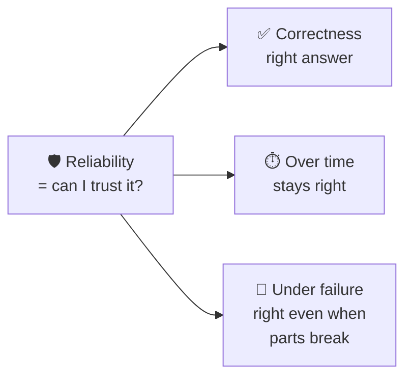
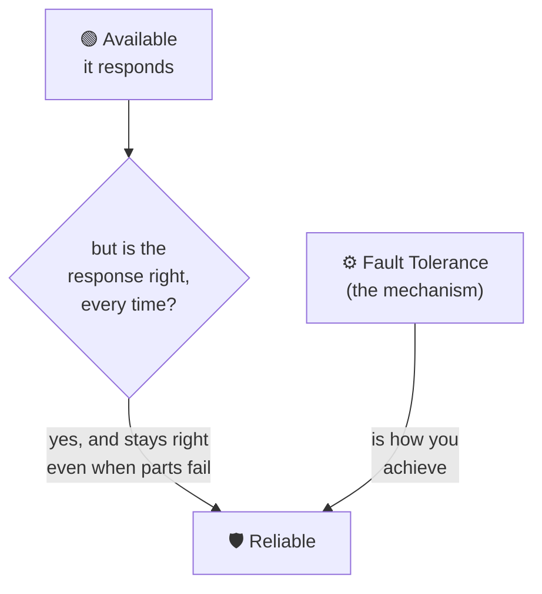
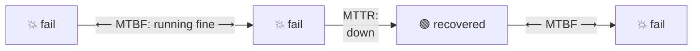
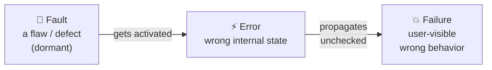
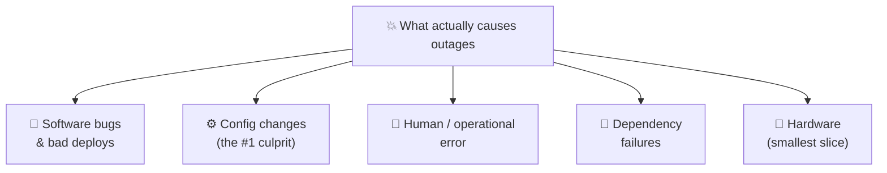
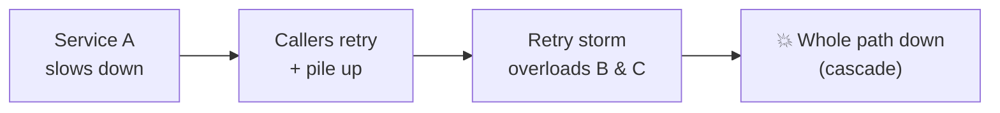
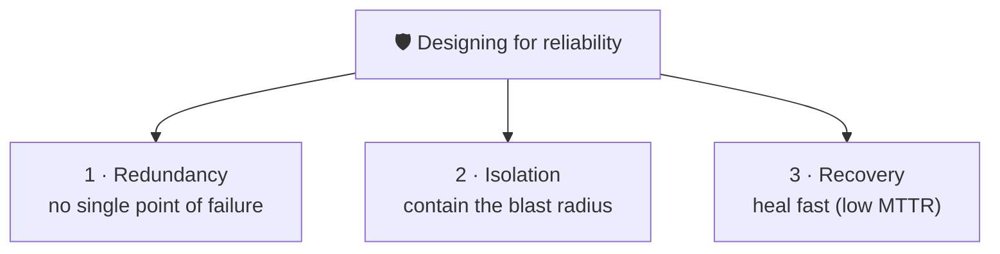
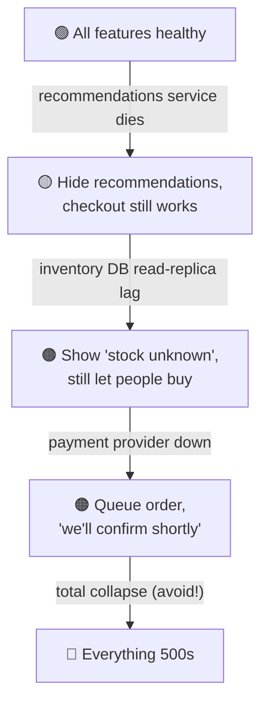
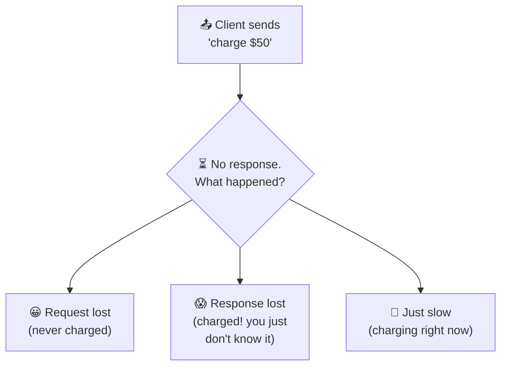
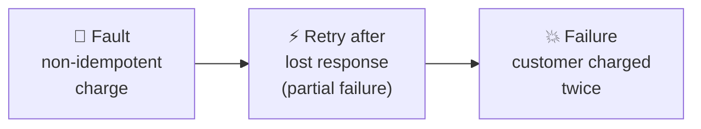

# Reliability

> **Phase:** Core System Properties → **Topic:** 3 of 5 → **Read time:** ~50 minutes

---

## Before You Begin

The previous document taught you to ask whether a system is **there** — available, responding, measured from the user's side over a window against a definition of "working" you chose. But it deliberately left a crack open. Availability counts the *response*; it does not check the *answer*. A system can be flawlessly available and quietly, catastrophically wrong.

That crack is this document's whole subject:

> **When the system is there and answers — does it do the *right thing*?**

You already brushed against the boundary. The Availability doc's SLI had a "quality/correctness" flavor (§3) — is a *degraded* response still "good"? Its failure spectrum (§1) had a wide middle between perfect and dead. And its Brimble story ended with a payment *failover* that kept checkout alive during an outage. This document asks the harder question that failover raises: **the request succeeded — but did the customer get charged once, or twice?** Availability said "checkout responded." Reliability asks "was the response *correct* — and will it stay correct next week, and when the next component fails?"

You have the pieces. Group 5 taught you that distributed systems fail **partially** — one node, one dependency, one dropped message at a time — and introduced **fault tolerance**. The Availability doc gave you the language of SLIs, error budgets, and the availability math. This document fuses them into the property engineers actually mean when they say a system is *solid*: it does the right thing, consistently, over time, even as parts of it break.

Here's the trap it exists to disarm. "Reliable" gets used as a vague compliment — "our system is really reliable" — the way "fast" and "up" did before you learned to interrogate them. It's just as empty until you pin it down. Reliable at *doing what*? Correct *how often*? Recovering *how fast* when it breaks? Under *which* failures? By the end, "reliable" will decompose in your hands into measurable, designable parts.

> **The mindset shift:** stop asking *"is it up?"* — start asking *"does it do the **right thing**, **consistently**, **over time**, and **when parts fail**?"* Availability is being *there*. Reliability is being *right* — and *staying* right while the world breaks around you.

---

## Table of Contents

1. [What Reliability Actually Means](#1-what-reliability-actually-means)
2. [Reliability vs Availability vs Fault Tolerance](#2-reliability-vs-availability-vs-fault-tolerance)
3. [Measuring Reliability — MTBF, MTTR, Failure Rate](#3-measuring-reliability--mtbf-mttr-failure-rate)
4. [Faults, Errors, Failures — The Precise Vocabulary](#4-faults-errors-failures--the-precise-vocabulary)
5. [Why Systems Really Fail](#5-why-systems-really-fail)
6. [Designing for Reliability — Redundancy, Isolation, Recovery](#6-designing-for-reliability--redundancy-isolation-recovery)
7. [Failure Modes and Graceful Degradation](#7-failure-modes-and-graceful-degradation)
8. [Reliability in Distributed Systems — Partial Failure and Idempotency](#8-reliability-in-distributed-systems--partial-failure-and-idempotency)
9. [The Human and Operational Side](#9-the-human-and-operational-side)
10. [Putting It All Together — Brimble's Double-Charge](#10-putting-it-all-together--brimbles-double-charge)
11. [Final Recap](#11-final-recap)

---

## 1. What Reliability Actually Means

Start, as always, with the naive definition and then sharpen it.

**The naive definition:** "reliable" = "doesn't go down much." People use it as a synonym for available — a system that's up is a system that's reliable.

**The problem:** uptime says nothing about *correctness*. Picture a system that answers every single request, instantly, with 100% uptime — and silently double-charges 2% of payments, loses one write in a thousand, and occasionally ships an order to the wrong address. Its availability dashboard is a perfect wall of green. Is it reliable? Absolutely not. It is *available* and *untrustworthy* — arguably the most dangerous combination there is, because nothing looks wrong until the damage is done.

So reliability is a bigger, stricter property than availability. It bundles three things together:

> **Reliability** is the probability that a system performs its function **correctly** — *for how long you need it*, and *even when parts fail*. It's not "is it up?" — it's "can I **trust** it?"

Three ingredients hide in that sentence, and pulling them apart is the foundation of the whole topic:

| Ingredient | The question | Failure looks like |
|---|---|---|
| **Correctness** | Does it produce the *right* result? | Wrong total, lost write, double charge |
| **Consistency over time** | Does it *keep* doing so — not just today? | Works at launch, degrades/leaks/rots over weeks |
| **Resilience under failure** | Does it stay correct *when parts break*? | One dependency dies → wrong answers, not just slowness |



### Correctness Is the Part Availability Forgets

The heart of the distinction: **availability counts responses; reliability judges them.** A response is an *event* — it happened or it didn't. Reliability asks whether that event was *the right one*, and a wrong answer delivered promptly is, for reliability, a failure — even though availability happily counted it as a success. This is why a reliability incident is often *scarier* than an outage: an outage is loud and everyone knows; a correctness bug is silent, and you may discover it only when a customer's bank statement does the discovering for you.

> 💡 **Key Insight**
>
> An outage announces itself; a reliability failure hides. A down system pages you in seconds — a system that's up but *wrong* can corrupt data for hours before anyone notices, and the cleanup (refunds, reconciliation, apologies, trust) costs far more than the downtime would have. "Available but wrong" is not a lesser problem than "down" — it is frequently a worse one.

### Quick Recap — What Reliability Means

- Reliability = **correctness + consistency over time + resilience under failure** — "can I *trust* it?", not just "is it up?"
- **Availability counts responses; reliability judges them** — a prompt *wrong* answer is a reliability failure that availability records as success.
- "Available but untrustworthy" is often **more dangerous** than "down," because correctness failures are silent and their damage compounds before detection.

---

## 2. Reliability vs Availability vs Fault Tolerance

Three words orbit each other constantly and get used interchangeably. Separating them cleanly is one of the highest-leverage things in this phase — get it straight once and a hundred design conversations get clearer.



| Property | The question | Nature |
|---|---|---|
| **Availability** | Is it **there** and responding? | An *outcome* — measured as uptime / good-request ratio |
| **Reliability** | Does it do the **right thing**, over time, under failure? | An *outcome* — the stricter one, includes correctness |
| **Fault tolerance** | Can it **keep working when a part fails**? | A *mechanism* — the means, not the end |

### The Four Combinations

Because availability and reliability are different properties, all four combinations exist — and naming which one you're looking at is diagnostic:

| | **Reliable (correct)** | **Unreliable (wrong)** |
|---|---|---|
| **Available (responds)** | 🏆 The goal — up *and* trustworthy | 🚨 The silent killer — always answers, sometimes wrong |
| **Unavailable (often down)** | Correct when it answers, but frequently isn't there — a flaky-but-honest system | 💀 The worst — down *and* wrong when up |

The dangerous quadrant is top-right: **available but unreliable.** It's dangerous precisely because monitoring built around availability (Group 5, the Availability doc) shows all green while the system quietly does the wrong thing. Most teams instrument "is it up?" far better than "is it *right*?" — which is exactly why correctness failures run longer before detection.

### Fault Tolerance Is the *How*, Not the *What*

The subtlest distinction: **fault tolerance is a mechanism; reliability is the outcome it buys.** Redundancy, retries, failover, circuit breakers, replication — these are *fault-tolerance techniques*. You apply them in order to *achieve* reliability (and availability). Confusing the two leads people to say "we added retries, so we're reliable" — but a retry applied to a non-idempotent operation (§8) can *destroy* reliability by double-applying an effect, even as it improves availability. The mechanism served one outcome and wrecked the other.

This is the Phase 02 boundary in action: this document is about the *outcome* — defining, measuring, and reasoning about reliability. The *mechanisms* (how retries, circuit breakers, bulkheads, and consensus actually work) are Group 5's territory and the deep-dive phases'. Here we treat them as the levers reliability pulls, and focus on *when and why* to pull them.

### Where Durability Fits

One more cousin worth placing: **durability** — once the system says data is saved, it stays saved (survives crashes, power loss, disk failure). Durability is *reliability applied to stored state over time*. A system that acknowledges a write and then loses it has failed reliably-store-my-data, even if it never "goes down." Storage phases treat durability in depth; keep it in mind here as the persistence-flavored corner of reliability.

> 💡 **Key Insight**
>
> **Availability and reliability are outcomes; fault tolerance is a mechanism.** You *want* reliability; you *build* fault tolerance to get it. Keeping this straight stops the two classic errors: measuring only availability and calling it reliability, and adding a mechanism (like blind retries) that helps one outcome while silently breaking the other.

### Quick Recap — The Trio

- **Availability** (there?) and **reliability** (right, over time, under failure?) are distinct *outcomes*; **fault tolerance** is the *mechanism* that buys them.
- All four available/reliable combinations exist; **available-but-unreliable** is the silent killer green dashboards hide.
- A mechanism can help one outcome and hurt the other — blind **retries** raise availability but can wreck reliability (§8).
- **Durability** is reliability applied to stored state — "once saved, stays saved."

---

## 3. Measuring Reliability — MTBF, MTTR, Failure Rate

You cannot manage what you cannot measure, and the Availability doc already gave you one lens: SLIs and error budgets apply to reliability too (define "correct," measure the fraction of correct outcomes, budget the rest). But reliability has its own classic pair of metrics, and they reveal something the availability ratio hides: **it's not just how *often* you fail, but how *fast* you recover.**

### The Two Numbers

> **MTBF — Mean Time Between Failures:** on average, how long the system runs correctly before something breaks. *Higher is better* (failures are rare).
>
> **MTTR — Mean Time To Recovery:** on average, how long it takes to detect, diagnose, and restore service once something breaks. *Lower is better* (you bounce back fast).



Here's the equation that ties this entire topic back to the previous one — availability *falls out of* these two reliability numbers:

```text
              MTBF
Availability = ───────────────
              MTBF + MTTR
```

Read what that says. Availability — the nines you spent all of the last document on — is just *the fraction of time you're between failures rather than recovering from one*. You can reach the same availability two completely different ways: **fail rarely** (huge MTBF) or **recover instantly** (tiny MTTR). A system that fails once a year and takes 8 hours to fix, and a system that fails weekly but self-heals in seconds, can post the *same* availability number — while being very different systems to operate and trust.

### Why MTTR Often Matters More Than MTBF

The instinct is to chase MTBF — *prevent* all failures. But at scale, with thousands of components and other people's dependencies, **failure is not preventable; it's a certainty.** The mature shift is to stop trying to make failures impossible and start making them *survivable and brief*:

- **Chasing MTBF** (never fail) hits a wall — you cannot out-engineer entropy, bad deploys, and dependency outages. Each additional nine of "never fails" costs exponentially (the Availability doc's §8 curve).
- **Chasing low MTTR** (recover fast) is often cheaper and more achievable — good monitoring (detect fast), clear runbooks (diagnose fast), automated rollback and failover (restore fast). Halving MTTR improves availability exactly as much as doubling MTBF, and is usually the better investment.

> 💡 **Key Insight**
>
> Since failure is inevitable at scale, **reliability engineering is less about preventing failures than about surviving them quickly.** MTTR is the more actionable lever: you can't guarantee nothing breaks, but you *can* guarantee you notice in seconds and recover in minutes. "Fail rarely" and "recover instantly" buy the same availability — but only one of them is fully in your control.

> ⚠️ **A great MTBF can hide a terrible MTTR — and vice versa.** "We hardly ever go down" sounds wonderful until the once-a-year outage lasts nine hours because nobody has practiced recovery. Measure *both*: rare-but-catastrophic and frequent-but-trivial are different reliability profiles that a single availability number blends into an indistinguishable blur.

### Quick Recap — Measuring Reliability

- **MTBF** (time between failures, higher better) and **MTTR** (time to recover, lower better) are the classic reliability metrics.
- **Availability = MTBF / (MTBF + MTTR)** — the nines are just the fraction of time you're *not* recovering.
- The same availability is reachable by **failing rarely** *or* **recovering fast** — very different systems.
- At scale, failure is inevitable, so **MTTR is usually the more actionable lever** — make failures brief, not impossible.

---

## 4. Faults, Errors, Failures — The Precise Vocabulary

Engineers use "fault," "error," and "failure" interchangeably in casual talk. In reliability they are three *distinct* things in a causal chain, and the distinction is not pedantry — it's the entire strategy, because you can intervene at each stage to stop a small problem becoming a user-visible disaster.

### The Chain



| Term | What it is | Example |
|---|---|---|
| **Fault** | The underlying *defect* or flaw — may lie dormant | A null-pointer bug; a disk with a bad sector; a mistyped config value |
| **Error** | The fault *activated* — the system is now in a wrong internal state | The code path hits the bug and computes a wrong value in memory |
| **Failure** | The error *reaches the user* — observable wrong behavior | The customer sees a wrong balance, or gets double-charged |

The critical realization: **a fault does not have to become a failure.** The chain can be *broken* at every arrow, and that's precisely where reliability engineering happens:

- **Prevent the fault:** testing, code review, type systems, config validation — stop the defect existing.
- **Stop fault → error:** redundancy means a faulty component's activation doesn't corrupt state (a healthy replica serves instead).
- **Stop error → failure:** error detection, validation, checksums, and graceful handling catch the wrong state *before* the user sees it — return a safe fallback instead of a wrong answer.

A reliable system is not one with no faults (impossible). It's one that **stops faults from propagating into failures.**

### A Taxonomy of Faults

Faults aren't all alike, and the *kind* determines the defense. Two axes matter.

**By behavior** — how the component misbehaves (in rough order of nastiness):

| Fault type | The component… | Why it matters |
|---|---|---|
| **Crash** | …stops entirely (fail-stop) | The *easiest* to handle — it's obviously gone; detect and fail over |
| **Omission** | …drops some requests/responses silently | Harder — it looks alive but loses things |
| **Timing** | …responds too slowly (or too fast) | Slow = down (the latency doc) — a timing fault becomes an availability one |
| **Byzantine** | …behaves arbitrarily/inconsistently — wrong answers, lies, different answers to different observers | The *hardest* — the component is actively confusing; needs voting/quorums |

> A "crash" fault is a gift compared to a Byzantine one: a dead node is easy to route around, but a node returning *plausible wrong answers* can poison the whole system before anyone suspects it. Much of distributed-systems theory (consensus, quorums — later phases) exists to tolerate the Byzantine end of this spectrum.

**By persistence** — how it behaves over time:

- **Transient:** happens once and vanishes (a dropped packet, a blip). A *retry* fixes it — this is what retries are *for*.
- **Intermittent:** flickers unpredictably (a loose connection, a race condition under load). The maddening kind — hard to reproduce, hard to catch.
- **Permanent:** stays until fixed (a dead disk, a logic bug). No amount of retrying helps; you must repair or replace.

This persistence axis is quietly crucial for the *next* topics: **retries are the right medicine for transient faults and exactly the wrong one for permanent faults.** Blindly retrying a permanent fault just hammers a broken thing (and can cause the retry storms the latency doc warned about). Knowing *which* kind you face determines whether "try again" helps or harms.

> 💡 **Key Insight**
>
> Reliability is the art of **breaking the fault → error → failure chain before it reaches the user.** You will never eliminate faults; you *can* stop them propagating. Every reliability technique — redundancy, validation, retries, circuit breakers, graceful degradation — is really a claim about *which arrow it breaks* and *which kind of fault it's meant for*. Match the defense to the fault, or the defense becomes the next fault.

### Quick Recap — Faults, Errors, Failures

- **Fault** (dormant defect) → **error** (activated, wrong internal state) → **failure** (user sees wrong behavior) — a causal chain.
- Reliability = **breaking that chain** at any arrow; a reliable system has faults but stops them becoming failures.
- Fault *behaviors*: crash (easiest) → omission → timing → **Byzantine** (hardest, needs quorums).
- Fault *persistence*: **transient** (retry helps) · **intermittent** (maddening) · **permanent** (retry harms — repair needed). Match the defense to the fault.

---

## 5. Why Systems Really Fail

Ask a beginner what threatens reliability and you'll hear "hardware failure — a server dies, a disk crashes." That instinct is decades out of date, and correcting it reshapes where you spend your reliability effort. To design against failure, you first have to know *where failure actually comes from* — and the real distribution is deeply counterintuitive.

### It's (Mostly) Not the Hardware

Modern datacenters *assume* hardware fails and route around it automatically — redundant disks, power, and network are standard. Hardware failure is real but largely *solved* as a surprise. The failures that actually take down modern systems come from somewhere else:



Study after study and public post-mortem points the same way: the dominant causes of large outages are **software changes, configuration changes, and human/operational error** — not spontaneous hardware death. The single most common trigger in practice is a **change** the team made itself: a deploy, a config push, a migration, a scaling operation. The system was fine; someone changed it, and the change was the fault. The pattern is remarkably consistent across the industry's public incident reports — the largest cloud and platform outages of recent years trace overwhelmingly to a bad configuration push or a routine change gone wrong, cascading through systems that were otherwise healthy, rather than to hardware failing.

This flips the naive mental model on its head:

> ⚠️ **The biggest threat to a running system is usually *you deploying to it*.** Most outages don't strike out of a clear sky — they're triggered by an intentional change. This is exactly why the Availability doc's error budget (§5) governs *deploy velocity*, why progressive/canary rollouts exist, and why "have you changed anything recently?" is the first question in every incident. Reliability is dominated by how you *manage change*, not by hardware quality.

### Failures Compound — Cascades and Correlation

The other reason production failures are worse than intuition expects: they don't stay contained. Two amplifiers turn a small fault into a large failure — both of which you met in earlier docs, now converging:

- **Cascading failure:** one component's failure *overloads* the others. A service dies → its callers retry → the retries (the latency doc's goodput collapse) hammer the recovering service and its dependencies → they fall too. Failure propagates *along the dependency graph* like dominoes. The initial fault was small; the blast was systemic.
- **Correlated failure:** the "independent" copies you counted on (the Availability doc's §9) fail *together* because they shared something hidden — a config service, a deploy pipeline, an availability zone. Your redundancy silently evaporates at the worst moment.



Put together: the typical serious outage is a *change* that activates a latent *fault*, which produces *errors* that *cascade* across *correlated* components faster than a human can react. Every word in that sentence is from this phase — and it's why reliability is a systems property, not a component one.

### The Long Tail of Failure Modes

A final humbling truth: systems fail in ways nobody predicted. The failures you designed for are handled; the ones that hurt are the *unanticipated* combinations — a rare input meeting a full disk meeting a slow dependency meeting a retry loop. You cannot enumerate them all in advance. This is *why* the operational practices in §9 exist — chaos engineering, observability, blameless postmortems — because if you can't predict every failure mode, you must instead get very good at *detecting and recovering* from the ones you didn't (back to MTTR, §3).

> 💡 **Key Insight**
>
> Design your reliability effort against the failures that *actually happen* — changes, config, humans, dependencies, and cascades — not the Hollywood image of a server bursting into flames. The highest-leverage reliability investments are usually **safe deployment (canary, rollback), change management, dependency isolation, and fast detection** — not more redundant hardware. You're defending against your own next deploy far more than against entropy.

### Quick Recap — Why Systems Really Fail

- The dominant causes of outages are **software bugs, config changes, and human/operational error** — *not* hardware, which datacenters already route around.
- The most common trigger is a **change you made** — a deploy, config push, or migration — which is why error budgets govern deploy velocity.
- Small faults become large failures via **cascades** (retry storms overloading neighbors) and **correlated failure** (hidden shared dependencies).
- Failures come from an unpredictable **long tail** — so invest in *detecting and recovering* (MTTR), not just predicting.

---

## 6. Designing for Reliability — Redundancy, Isolation, Recovery

Now the constructive turn. Given that faults are inevitable (§4) and mostly come from change and cascades (§5), how do you build a system that stays *right* anyway? Nearly every reliability technique falls into **three families**, each attacking a different part of the problem. True to the Phase 02 charter, this is the *strategy* — the mechanisms themselves (how a circuit breaker or bulkhead actually works) live in Group 5 and the deep-dive phases.



### Family 1 — Redundancy: Remove Single Points of Failure

The first line of defense, straight from the Availability doc's parallel math (§6–7): run more than one of everything so no *single* component's failure takes the system down. Redundant servers, replicated data, multiple availability zones. The reliability framing adds a sharpened question — the one that becomes Topic 5 of this phase:

> **"What single thing, if it failed right now, would break the system?"** That's a **Single Point of Failure (SPOF)**, and finding/eliminating them is the core of redundancy work.

The Availability doc's warning carries straight over: redundancy only helps against *independent* failures. Redundancy is necessary but not sufficient — it handles the "a part died" fault beautifully and does *nothing* for a bad deploy that poisons every replica at once (§5). Which is why you need the other two families.

### Family 2 — Isolation: Contain the Blast Radius

If you can't prevent every failure, prevent it from *spreading*. Isolation limits how much breaks when something does — turning a total outage into a partial, survivable one (the Availability doc's failure spectrum, §1). The key patterns (mechanisms detailed later):

| Pattern | Idea | Contains |
|---|---|---|
| **Bulkheads** | Partition resources so one workload can't consume them all (named after a ship's watertight compartments) | One flooded compartment doesn't sink the ship |
| **Circuit breakers** | Stop calling a failing dependency after N failures; fail fast instead of piling on | Cascading failure (§5) — breaks the retry-storm loop |
| **Cells / shards** | Split users across independent slices of the system | A failure hits one cell → a fraction of users, not all |
| **Timeouts** | Cap how long you wait on anything (the latency doc's W) | One slow dependency stalling all your threads |

The unifying idea: **failure is a fluid that spreads unless you build walls.** Isolation is how you make failures *partial by design*, so the blast radius is a slice instead of the whole.

### Family 3 — Recovery: Heal Fast (Attack MTTR)

Since failure is certain (§3), the third family accepts breakage and optimizes *getting back to correct* — directly lowering MTTR:

- **Automatic failover** — traffic reroutes to a healthy replica without a human (fast MTTR).
- **Retries with backoff** — for *transient* faults only (§4); backoff + jitter avoids the retry storm.
- **Self-healing** — health checks kill and replace sick instances automatically (restart the crashed process, reschedule the dead container).
- **Rollback** — the fastest recovery from a bad deploy (the #1 cause, §5) is often *undo the deploy*, not debug it live.

> 💡 **Key Insight**
>
> Reliability is not one trick — it's three complementary bets: **redundancy** (so a part failing isn't the *system* failing), **isolation** (so a failure stays *small*), and **recovery** (so a failure stays *brief*). Redundancy alone is the beginner's answer and it's incomplete — it's useless against the change-induced, cascading, correlated failures that actually dominate (§5). A system is reliable when all three are present: no SPOF, contained blast radius, and fast healing.

### Quick Recap — Designing for Reliability

- **Redundancy** removes SPOFs — necessary but only handles *independent* part failures; useless against a bad deploy hitting every replica.
- **Isolation** (bulkheads, circuit breakers, cells, timeouts) contains the **blast radius** — failure becomes partial by design.
- **Recovery** (failover, backoff retries, self-healing, rollback) attacks **MTTR** — accept failure, get back to correct fast.
- A reliable system uses **all three**; the mechanisms themselves are Group 5 / deep-dive territory.

---

## 7. Failure Modes and Graceful Degradation

Redundancy, isolation, and recovery decide *whether* you survive a fault. This section is about *how you behave in the moment of failure itself* — because when something breaks, the system does *something*, and choosing that something deliberately is a core reliability decision. A system that fails in a *safe, predictable* way is far more reliable than one that fails unpredictably, even if they fail equally often.

### How to Fail — Choosing a Failure Mode

When a component can't do its job, it has a choice of posture. The three classic ones, and they are genuinely different decisions:

| Failure mode | Behavior on failure | Right when… |
|---|---|---|
| **Fail-fast** | Stop immediately, return a clear error | A wrong answer is dangerous — better to error visibly than proceed on bad state |
| **Fail-safe** | Fall back to a safe default and keep going | A sensible default exists — serve stale/cached data, hide the broken widget |
| **Fail-silent** | Fail *without* corrupting or emitting garbage — go quiet, don't crash neighbors | You'd rather lose a feature than propagate a fault |

The one to *avoid* is the unnamed fourth: **fail-ugly** — corrupting data, returning plausible-but-wrong answers (the Byzantine fault, §4), or crashing in a way that takes down neighbors. The entire point of choosing a failure mode is to never fail that way.

> ⚠️ **The worst failure is a *silent, plausible-looking* wrong answer.** A loud error gets noticed and fixed; a component that quietly returns wrong-but-believable data (a stale price, a mis-summed total) corrupts everything downstream while every dashboard stays green. When in doubt, **fail loud and safe, not quiet and wrong** — a visible error is a reliability *feature*, not a bug.

### Graceful Degradation — Using the Spectrum

Here the Availability doc's most important idea (§1: "up" is a spectrum, not a binary) pays off fully. Because failure has a middle, a well-designed system responds to a broken part by **degrading, not collapsing** — shedding function to protect its core:



The design skill is deciding, *in advance*, the **priority order in which features shed** — what's essential (checkout) versus what's sacrificial (recommendations, reviews, related items). Under stress, the system sheds the sacrificial to protect the essential. This is the reliability twin of the latency doc's flash-sale move (drop the recommendations panel to protect checkout) — same instinct, now generalized: **a reliable system knows what to sacrifice.**

Two supporting techniques worth naming:

- **Load shedding:** when overloaded, deliberately reject *some* requests early (fail-fast) so the rest succeed — better to cleanly serve 90% than to collapse and serve 0% (the latency doc's utilization cliff).
- **Default responses:** when the real answer is unavailable, a sensible fallback (cached data, a generic recommendation, a conservative estimate) keeps the user moving instead of blocking on an error.

> 💡 **Key Insight**
>
> Failure is not binary, so your *response* to failure shouldn't be either. The reliability question is never just "will it fail?" but "**how** will it fail, and **what will it sacrifice** to protect what matters?" Design the failure modes and the shed-order deliberately — a system that degrades gracefully under partial failure is dramatically more reliable *in the ways users feel* than one that's either perfect or dead.

### Quick Recap — Failure Modes and Degradation

- Choose a **failure mode** on purpose: **fail-fast** (error clearly), **fail-safe** (safe default), **fail-silent** (go quiet, don't corrupt) — never **fail-ugly** (wrong-but-plausible).
- **Fail loud and safe, not quiet and wrong** — a visible error is a feature; a silent wrong answer is the worst outcome.
- **Graceful degradation** uses the availability spectrum: shed sacrificial features to protect essential ones; decide the shed-order *in advance*.
- **Load shedding** and **default responses** keep the core alive under stress — serve most, cleanly, rather than all, catastrophically.

---

## 8. Reliability in Distributed Systems — Partial Failure and Idempotency

Everything so far applies to any system. This section is where reliability gets genuinely *hard* — the distributed case Group 5 introduced, where the failure modes are strange and the most important reliability tool in all of backend engineering lives. If you remember one *technique* from this document, make it this one.

### The Root Difficulty — Partial Failure

On a single machine, operations mostly succeed or fail cleanly. Across a network, a third outcome appears and ruins everything: **you don't know.** You send a request; you get no response. What happened?



This is **partial failure**, and its cruelty is the *ambiguity*: a lost request and a lost *response* look identical to the sender — silence — but they mean opposite things (nothing happened vs. it happened and you don't know). The Availability doc's Brimble failover lived exactly here: when the payment provider seemed unresponsive and Brimble failed over, *had the first provider already charged the card?*

### The Naive Fix Makes It Worse

The obvious response to "no response" is **retry** — and for the *transient* faults of §4, retrying is correct and is what keeps distributed systems working. But retry collides head-on with partial failure:

> If the original request *did* succeed but its response was lost, retrying **does the thing twice.** Charge the card twice. Ship the order twice. Apply the credit twice.

This is the precise mechanism by which a *fault-tolerance* technique (retry, which raises availability) *destroys reliability* (correctness) — the exact trap §2 warned about. Availability said "get a successful response"; the retry got one — by charging the customer a second time. You cannot have reliable distributed operations by retrying naively. You need the operations themselves to be safe to repeat.

### Idempotency — The Cornerstone

> **Idempotency:** an operation is *idempotent* if performing it multiple times has the **same effect as performing it once.** Retry it ten times — the outcome is identical to one time.

This single property dissolves the partial-failure dilemma. If your operations are idempotent, "I don't know if it succeeded, so I'll retry" becomes *safe* — worst case, you harmlessly repeat something already done. Idempotency is what makes retries (and therefore fault tolerance in distributed systems) compatible with correctness.

How it's achieved in practice (mechanism detail is later phases; the *idea* is essential now):

- **Idempotency keys:** the client attaches a unique ID to the operation (`charge #abc-123`). The server records processed IDs and, on a duplicate, returns the *original* result instead of doing the work again. Every serious payments API works this way — Stripe, PayPal, and the like expose an explicit `Idempotency-Key` header for exactly the double-charge reason above; it is not an optional nicety but the load-bearing mechanism that lets a client safely retry a payment it isn't sure went through.
- **Naturally idempotent design:** prefer operations that are safe by nature — "set balance to \$50" (idempotent) over "add \$50" (not). "Ensure this row exists" over "insert a row."

### The "Exactly-Once" Illusion

A myth worth killing directly, because it clarifies the whole area. True **exactly-once delivery** across an unreliable network is effectively impossible — you cannot guarantee a message is delivered once and only once when any packet can vanish. What real systems build instead is:

```text
at-least-once delivery  +  idempotent processing  ≈  effectively-once
       (keep retrying             (duplicates are           (correct end state,
        until acked)               harmless)                 the goal you wanted)
```

You *retry until you're sure it arrived* (at-least-once, which may cause duplicates), and you make duplicates *harmless* (idempotency). The combination gives you the correctness people *mean* when they say "exactly once" — without the impossible delivery guarantee. This is one of the most important patterns in all of distributed systems, and it rests entirely on idempotency.

> 💡 **Key Insight**
>
> In a distributed system, **"did it work?" is often unanswerable — so build operations whose answer doesn't matter.** Idempotency is that property: it makes retrying safe, which makes at-least-once delivery correct, which gives you effectively-once behavior over an unreliable network. Chase "exactly-once delivery" and you chase a ghost; build "idempotent + retry" and you get the reliability you actually wanted.

### Quick Recap — Distributed Reliability

- **Partial failure** adds a third outcome — *"you don't know"* — where a lost request and a lost response look identical but mean opposite things.
- **Naive retries** collide with partial failure: if the original succeeded but its response was lost, retrying **does the thing twice** (double-charge) — a mechanism that raises availability while destroying reliability.
- **Idempotency** (same effect however many times applied) makes retries safe — via **idempotency keys** or naturally-idempotent operations.
- **Exactly-once delivery is a myth**; real systems use **at-least-once + idempotent = effectively-once**.

---

## 9. The Human and Operational Side

A final, humbling truth that ties the topic together: **most reliability does not come from your architecture. It comes from how you operate.** §5 already showed that most failures are changes, config, and human error — which means most reliability *gains* live in the same place: process, not code. A beautifully redundant system operated carelessly is unreliable; a modest system operated with discipline can be remarkably solid.

### Reliability Is Mostly Operations

The highest-leverage reliability work is often unglamorous and entirely operational:

| Practice | Reliability payoff | Ties to |
|---|---|---|
| **Safe deployments** (canary, blue-green, gradual rollout, instant rollback) | Defuses the #1 cause of outages — bad changes (§5) | Error budgets (Availability §5) |
| **Observability** (metrics, logs, traces, alerts) | You can't recover what you can't *see* — cuts detection time, the biggest MTTR component | MTTR (§3) |
| **Runbooks & practiced on-call** | Diagnose and act fast under pressure instead of improvising | MTTR (§3) |
| **Chaos engineering** | Inject failure *on purpose* to find weaknesses before they find you | The long tail (§5); tests failover is real (Availability §7) |
| **Change management** (review, staging, feature flags) | Catch faults before they reach production | Break fault→failure (§4) |

### Observability: You Can't Fix What You Can't See

Worth isolating because it's the multiplier on everything else. Recall MTTR = detect + diagnose + repair (§3). In real incidents, **detection and diagnosis usually dominate** — the fix is often quick *once you understand it*; the hours are lost figuring out *what* broke and *why*. Observability attacks exactly that: good metrics tell you *something's* wrong fast, good traces tell you *where*, good logs tell you *why*. A system you can see into has a low MTTR almost automatically; a black box, however well-built, does not — because every incident starts with a scramble to understand it.

### Chaos Engineering: Rehearse Failure

The Availability doc warned that untested failover is just a hope (§7). Chaos engineering is the discipline of removing the hope: deliberately inject failures into production-like (or production) systems — kill instances, add latency, sever dependencies — to *verify* the redundancy, isolation, and recovery you designed actually work, and to surface long-tail failure modes (§5) while you're watching, rather than at 3 a.m. You only truly know a system is reliable when you've *watched* it survive failure.

### Blameless Postmortems: Reliability Compounds

The practice that makes reliability *improve* over time. After every incident, a **blameless postmortem** asks *what in the system and process* allowed this — not *who to blame*. The distinction is not soft-heartedness; it's cold engineering pragmatism:

> ⚠️ **Blame makes systems *less* reliable.** Punish people for incidents and they hide problems, avoid touching fragile areas, and stop reporting near-misses — starving you of exactly the information reliability improvement runs on. A blameless culture treats each failure as a *free lesson the system paid for*, turning incidents into permanent fixes. Reliability is a compounding process, and blame is what breaks the compounding.

> 💡 **Key Insight**
>
> You cannot architect your way to reliability and stop there. The system that stays reliable is the one that's *operated* well — deployed safely, observed deeply, rehearsed against failure, and improved after every incident without blame. Reliability is less a property you *build* than a discipline you *practice*: most of the nines live in the operations, not the diagram.

### Quick Recap — The Human and Operational Side

- Most failures — and most reliability *gains* — are **operational**: deploys, config, process, people.
- **Safe deployment** (canary/rollback) defuses the #1 outage cause; **observability** slashes MTTR by cutting detect+diagnose time.
- **Chaos engineering** verifies your redundancy/recovery actually work and surfaces long-tail modes on your terms.
- **Blameless postmortems** make reliability *compound*; blame makes systems less reliable by hiding problems.

---

## 10. Putting It All Together — Brimble's Double-Charge

Back to **Brimble**. In the Availability document, its story was a triumph: a second payment provider let checkout *survive* a two-hour outage of the primary. Availability: saved. But that very save planted a reliability bug — and this is the incident where it detonates. Watch every concept in this document appear in one real-feeling failure.

### The Incident

Three weeks after the failover was deployed, support tickets spike: **customers are being charged twice.** The site is flawlessly available — 100% uptime, fast responses, every dashboard green. And it is quietly corrupting people's bank statements. This is §1's nightmare exactly: **available but unreliable**, the silent-killer quadrant of §2.

### Tracing the Chain (§4, §8)

The on-call engineer walks the fault → error → failure chain (§4):

- **The fault (dormant):** the checkout → payment call was **not idempotent** (§8). It said "charge \$50," not "charge \$50 *for order #123, once*." Harmless for weeks — a latent defect waiting.
- **The activation (partial failure, §8):** under load, the primary provider gets slow. Brimble's **timeout** (its isolation, §6) fires and it **retries** against the second provider. But the first charge had *already succeeded* — only its *response* was lost in the slowness. Classic partial failure: silence meant "done," not "not done."
- **The error → failure:** the retry charges a second time. The error (a duplicate charge in the ledger) propagates straight to the user as a failure (two line items on their statement). The very failover that bought *availability* cost *reliability*, because a fault-tolerance mechanism (retry) met a non-idempotent operation — the trap of §2, sprung.



### Detect, Recover, Measure (§3, §9)

Because availability monitoring was green, **detection came from customers, not systems** — the worst way, and a direct hit on MTTR (§3): detection time was *days*. The team's first move is recovery, not root-cause: a **fail-safe** stopgap (§7) — pause the automatic payment retry (accept slightly lower availability to stop the correctness bleed) — then reconcile and refund the duplicate charges. Note the deliberate trade: they spend availability to buy back reliability, because a wrong charge is worse than a slow checkout (§1's "available but wrong is worse than down").

### The Real Fix — Idempotency (§8)

The permanent fix is the cornerstone of §8: attach an **idempotency key** to every payment — `charge for order #123`. The payment path now records processed order IDs; a retry of an already-charged order returns the *original* result instead of charging again. Retries become *safe*, so Brimble regains the failover's availability **without** the double-charge — **at-least-once retry + idempotent processing = effectively-once** (§8). The availability win and the reliability guarantee finally coexist.

### Hardening — All Three Families + Operations (§6, §9)

The blameless postmortem (§9 — *what allowed this*, not *who retried*) turns one incident into permanent gains across every family:

| Fix | Family / practice |
|---|---|
| Idempotency keys on all mutating operations | Correctness under retry (§8) |
| A **reconciliation job** that flags duplicate charges within minutes | Observability → MTTR (§3, §9) — never let *customers* be the detector again |
| Alert on business metrics ("charge-to-order ratio > 1"), not just uptime | Detect *reliability* failure, not just availability (§2) |
| A **chaos drill** that kills the primary provider in staging to prove the fix | Rehearse failure (§9); verify failover is reliable, not hopeful |

### The Payoff

A month later, the primary provider blips again. Failover fires; some orders get retried against the backup; **every duplicate is silently absorbed by the idempotency keys.** The reconciliation job reports a clean charge-to-order ratio. Checkout stayed *available* (the Availability doc's win) **and** every customer was charged exactly once (this document's win). The two properties, once in conflict, now hold together — because the team learned to ask not just "did it respond?" but "**did it do the right thing?**"

---

## 11. Final Recap

| Concept | Core Insight | Biggest Tradeoff |
|---|---|---|
| **Reliability** | Doing the *right thing*, over time, under failure — "can I *trust* it?", not "is it up?" | Correctness costs more than mere uptime to build and verify |
| **vs Availability** | Availability counts responses; reliability *judges* them — available-but-wrong is the silent killer | Green dashboards hide correctness failures |
| **Fault Tolerance** | The *mechanism*; reliability is the *outcome* it buys | A mechanism (retry) can help availability and wreck reliability |
| **MTBF / MTTR** | Availability = MTBF / (MTBF + MTTR) — fail rarely *or* recover fast | At scale, low **MTTR** beats high MTBF — failure is inevitable |
| **Fault → Error → Failure** | Reliability = breaking the chain before it reaches the user | You stop *propagation*, not the existence of faults |
| **Why systems fail** | Mostly change, config, and humans — *not* hardware | Your biggest threat is your own next deploy |
| **Redundancy / Isolation / Recovery** | Three bets: no SPOF · contain blast radius · heal fast | Redundancy alone is incomplete against cascades and bad deploys |
| **Failure modes** | Fail fast/safe/silent — never fail-ugly (wrong-but-plausible) | Fail loud+safe may sacrifice a feature to protect correctness |
| **Graceful degradation** | Shed sacrificial features to protect essential ones | Requires deciding the shed-order in advance |
| **Idempotency** | Same effect however many times applied — makes retries safe | Requires designing operations (keys, set-not-add) deliberately |
| **Operations** | Most reliability is *operated*, not architected — observe, rehearse, postmortem blamelessly | Reliability is a discipline you practice, not a feature you ship |

### The One Thing to Remember

> **Availability asks "did it respond?" — reliability asks "did it do the *right thing*, and will it keep doing so when parts fail?" You can't prevent faults, so reliability is breaking the fault→error→failure chain before users see it: remove single points of failure, contain the blast radius, recover fast, and make operations idempotent so retries are safe. And remember where the nines actually come from — not from perfect hardware, but from how you deploy, observe, and learn from failure.**

---

## What's Next

> **Topic 4 — Scalability**

You can now reason about a system being *there* (availability) and being *right* (reliability). The next property adds the dimension that breaks both as a system grows:

> **Does it stay fast *and* correct *and* available as load increases — and where does growth actually hurt?**

Everything you've learned gets harder under scale. Reliability is easy with ten users and brutal with ten million — more components mean more faults, more partial failures, more cascades, more correlated blast radius. **Scalability** is the property of holding latency, availability, *and* reliability steady while demand multiplies — and it's where the flash-sale spikes of the latency doc, the redundancy math of the availability doc, and the idempotency of this one all get stress-tested at once. The yardsticks are about to meet their real adversary: growth.

---
