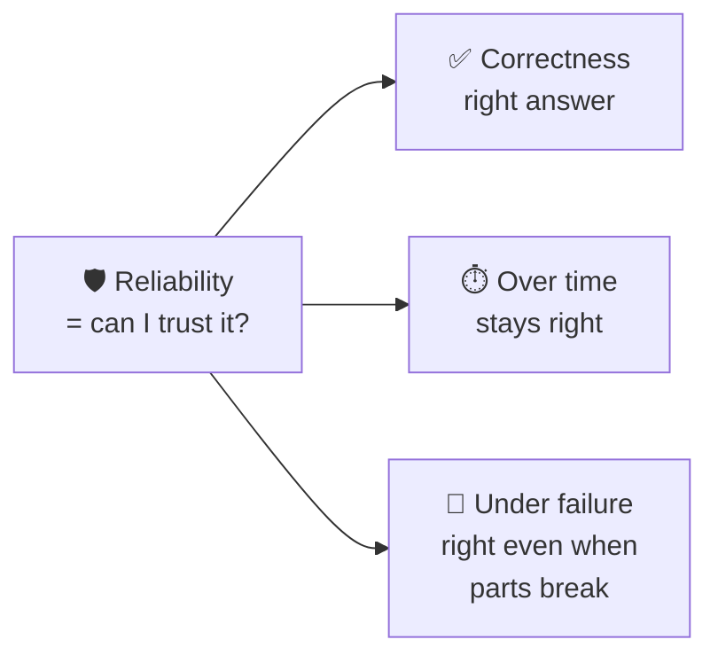
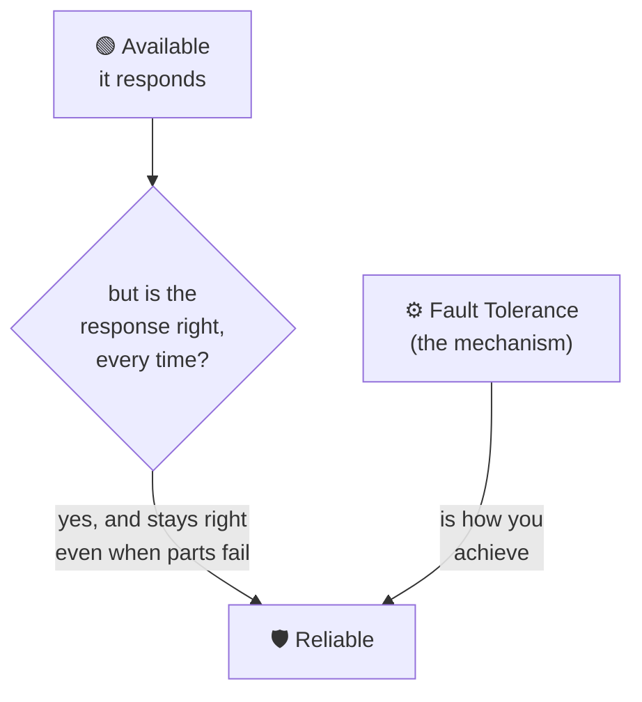
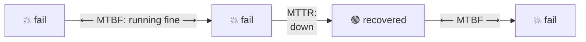
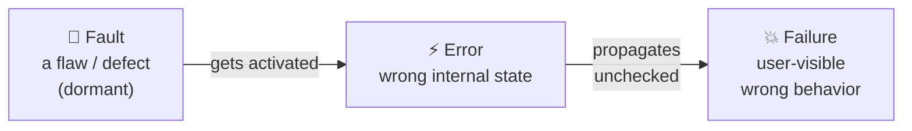

# Reliability

> **Phase:** Core System Properties → **Topic:** 3 of 5 → **Read time:** ~50 minutes

---

## Before You Begin

The previous document taught you to ask whether a system is **there** — available, responding, measured from the user's side over a window against a definition of "working" you chose. But it deliberately left a crack open. Availability counts the *response*; it does not check the *answer*. A system can be flawlessly available and quietly, catastrophically wrong.

That crack is this document's whole subject:

> **When the system is there and answers — does it do the *right thing*?**

You already brushed against the boundary. The Availability doc's SLI had a "quality/correctness" flavor (§3) — is a *degraded* response still "good"? Its failure spectrum (§1) had a wide middle between perfect and dead. And its Brimble story ended with a payment *failover* that kept checkout alive during an outage. This document asks the harder question that failover raises: **the request succeeded — but did the customer get charged once, or twice?** Availability said "checkout responded." Reliability asks "was the response *correct* — and will it stay correct next week, and when the next component fails?"

You have the pieces. Group 5 taught you that distributed systems fail **partially** — one node, one dependency, one dropped message at a time — and introduced **fault tolerance**. The Availability doc gave you the language of SLIs, error budgets, and the availability math. This document fuses them into the property engineers actually mean when they say a system is *solid*: it does the right thing, consistently, over time, even as parts of it break.

Here's the trap it exists to disarm. "Reliable" gets used as a vague compliment — "our system is really reliable" — the way "fast" and "up" did before you learned to interrogate them. It's just as empty until you pin it down. Reliable at *doing what*? Correct *how often*? Recovering *how fast* when it breaks? Under *which* failures? By the end, "reliable" will decompose in your hands into measurable, designable parts.

> **The mindset shift:** stop asking *"is it up?"* — start asking *"does it do the **right thing**, **consistently**, **over time**, and **when parts fail**?"* Availability is being *there*. Reliability is being *right* — and *staying* right while the world breaks around you.

---

## Table of Contents

1. [What Reliability Actually Means](#1-what-reliability-actually-means)
2. [Reliability vs Availability vs Fault Tolerance](#2-reliability-vs-availability-vs-fault-tolerance)
3. [Measuring Reliability — MTBF, MTTR, Failure Rate](#3-measuring-reliability--mtbf-mttr-failure-rate)
4. [Faults, Errors, Failures — The Precise Vocabulary](#4-faults-errors-failures--the-precise-vocabulary)
5. [Why Systems Really Fail](#5-why-systems-really-fail)
6. [Designing for Reliability — Redundancy, Isolation, Recovery](#6-designing-for-reliability--redundancy-isolation-recovery)
7. [Failure Modes and Graceful Degradation](#7-failure-modes-and-graceful-degradation)
8. [Reliability in Distributed Systems — Partial Failure and Idempotency](#8-reliability-in-distributed-systems--partial-failure-and-idempotency)
9. [The Human and Operational Side](#9-the-human-and-operational-side)
10. [Putting It All Together — Brimble's Double-Charge](#10-putting-it-all-together--brimbles-double-charge)
11. [Final Recap](#11-final-recap)

---

## 1. What Reliability Actually Means

Start, as always, with the naive definition and then sharpen it.

**The naive definition:** "reliable" = "doesn't go down much." People use it as a synonym for available — a system that's up is a system that's reliable.

**The problem:** uptime says nothing about *correctness*. Picture a system that answers every single request, instantly, with 100% uptime — and silently double-charges 2% of payments, loses one write in a thousand, and occasionally ships an order to the wrong address. Its availability dashboard is a perfect wall of green. Is it reliable? Absolutely not. It is *available* and *untrustworthy* — arguably the most dangerous combination there is, because nothing looks wrong until the damage is done.

So reliability is a bigger, stricter property than availability. It bundles three things together:

> **Reliability** is the probability that a system performs its function **correctly** — *for how long you need it*, and *even when parts fail*. It's not "is it up?" — it's "can I **trust** it?"

Three ingredients hide in that sentence, and pulling them apart is the foundation of the whole topic:

| Ingredient | The question | Failure looks like |
|---|---|---|
| **Correctness** | Does it produce the *right* result? | Wrong total, lost write, double charge |
| **Consistency over time** | Does it *keep* doing so — not just today? | Works at launch, degrades/leaks/rots over weeks |
| **Resilience under failure** | Does it stay correct *when parts break*? | One dependency dies → wrong answers, not just slowness |



### Correctness Is the Part Availability Forgets

The heart of the distinction: **availability counts responses; reliability judges them.** A response is an *event* — it happened or it didn't. Reliability asks whether that event was *the right one*, and a wrong answer delivered promptly is, for reliability, a failure — even though availability happily counted it as a success. This is why a reliability incident is often *scarier* than an outage: an outage is loud and everyone knows; a correctness bug is silent, and you may discover it only when a customer's bank statement does the discovering for you.

> 💡 **Key Insight**
>
> An outage announces itself; a reliability failure hides. A down system pages you in seconds — a system that's up but *wrong* can corrupt data for hours before anyone notices, and the cleanup (refunds, reconciliation, apologies, trust) costs far more than the downtime would have. "Available but wrong" is not a lesser problem than "down" — it is frequently a worse one.

### Quick Recap — What Reliability Means

- Reliability = **correctness + consistency over time + resilience under failure** — "can I *trust* it?", not just "is it up?"
- **Availability counts responses; reliability judges them** — a prompt *wrong* answer is a reliability failure that availability records as success.
- "Available but untrustworthy" is often **more dangerous** than "down," because correctness failures are silent and their damage compounds before detection.

---

## 2. Reliability vs Availability vs Fault Tolerance

Three words orbit each other constantly and get used interchangeably. Separating them cleanly is one of the highest-leverage things in this phase — get it straight once and a hundred design conversations get clearer.



| Property | The question | Nature |
|---|---|---|
| **Availability** | Is it **there** and responding? | An *outcome* — measured as uptime / good-request ratio |
| **Reliability** | Does it do the **right thing**, over time, under failure? | An *outcome* — the stricter one, includes correctness |
| **Fault tolerance** | Can it **keep working when a part fails**? | A *mechanism* — the means, not the end |

### The Four Combinations

Because availability and reliability are different properties, all four combinations exist — and naming which one you're looking at is diagnostic:

| | **Reliable (correct)** | **Unreliable (wrong)** |
|---|---|---|
| **Available (responds)** | 🏆 The goal — up *and* trustworthy | 🚨 The silent killer — always answers, sometimes wrong |
| **Unavailable (often down)** | Correct when it answers, but frequently isn't there — a flaky-but-honest system | 💀 The worst — down *and* wrong when up |

The dangerous quadrant is top-right: **available but unreliable.** It's dangerous precisely because monitoring built around availability (Group 5, the Availability doc) shows all green while the system quietly does the wrong thing. Most teams instrument "is it up?" far better than "is it *right*?" — which is exactly why correctness failures run longer before detection.

### Fault Tolerance Is the *How*, Not the *What*

The subtlest distinction: **fault tolerance is a mechanism; reliability is the outcome it buys.** Redundancy, retries, failover, circuit breakers, replication — these are *fault-tolerance techniques*. You apply them in order to *achieve* reliability (and availability). Confusing the two leads people to say "we added retries, so we're reliable" — but a retry applied to a non-idempotent operation (§8) can *destroy* reliability by double-applying an effect, even as it improves availability. The mechanism served one outcome and wrecked the other.

This is the Phase 02 boundary in action: this document is about the *outcome* — defining, measuring, and reasoning about reliability. The *mechanisms* (how retries, circuit breakers, bulkheads, and consensus actually work) are Group 5's territory and the deep-dive phases'. Here we treat them as the levers reliability pulls, and focus on *when and why* to pull them.

### Where Durability Fits

One more cousin worth placing: **durability** — once the system says data is saved, it stays saved (survives crashes, power loss, disk failure). Durability is *reliability applied to stored state over time*. A system that acknowledges a write and then loses it has failed reliably-store-my-data, even if it never "goes down." Storage phases treat durability in depth; keep it in mind here as the persistence-flavored corner of reliability.

> 💡 **Key Insight**
>
> **Availability and reliability are outcomes; fault tolerance is a mechanism.** You *want* reliability; you *build* fault tolerance to get it. Keeping this straight stops the two classic errors: measuring only availability and calling it reliability, and adding a mechanism (like blind retries) that helps one outcome while silently breaking the other.

### Quick Recap — The Trio

- **Availability** (there?) and **reliability** (right, over time, under failure?) are distinct *outcomes*; **fault tolerance** is the *mechanism* that buys them.
- All four available/reliable combinations exist; **available-but-unreliable** is the silent killer green dashboards hide.
- A mechanism can help one outcome and hurt the other — blind **retries** raise availability but can wreck reliability (§8).
- **Durability** is reliability applied to stored state — "once saved, stays saved."

---

## 3. Measuring Reliability — MTBF, MTTR, Failure Rate

You cannot manage what you cannot measure, and the Availability doc already gave you one lens: SLIs and error budgets apply to reliability too (define "correct," measure the fraction of correct outcomes, budget the rest). But reliability has its own classic pair of metrics, and they reveal something the availability ratio hides: **it's not just how *often* you fail, but how *fast* you recover.**

### The Two Numbers

> **MTBF — Mean Time Between Failures:** on average, how long the system runs correctly before something breaks. *Higher is better* (failures are rare).
>
> **MTTR — Mean Time To Recovery:** on average, how long it takes to detect, diagnose, and restore service once something breaks. *Lower is better* (you bounce back fast).



Here's the equation that ties this entire topic back to the previous one — availability *falls out of* these two reliability numbers:

```text
              MTBF
Availability = ───────────────
              MTBF + MTTR
```

Read what that says. Availability — the nines you spent all of the last document on — is just *the fraction of time you're between failures rather than recovering from one*. You can reach the same availability two completely different ways: **fail rarely** (huge MTBF) or **recover instantly** (tiny MTTR). A system that fails once a year and takes 8 hours to fix, and a system that fails weekly but self-heals in seconds, can post the *same* availability number — while being very different systems to operate and trust.

### Why MTTR Often Matters More Than MTBF

The instinct is to chase MTBF — *prevent* all failures. But at scale, with thousands of components and other people's dependencies, **failure is not preventable; it's a certainty.** The mature shift is to stop trying to make failures impossible and start making them *survivable and brief*:

- **Chasing MTBF** (never fail) hits a wall — you cannot out-engineer entropy, bad deploys, and dependency outages. Each additional nine of "never fails" costs exponentially (the Availability doc's §8 curve).
- **Chasing low MTTR** (recover fast) is often cheaper and more achievable — good monitoring (detect fast), clear runbooks (diagnose fast), automated rollback and failover (restore fast). Halving MTTR improves availability exactly as much as doubling MTBF, and is usually the better investment.

> 💡 **Key Insight**
>
> Since failure is inevitable at scale, **reliability engineering is less about preventing failures than about surviving them quickly.** MTTR is the more actionable lever: you can't guarantee nothing breaks, but you *can* guarantee you notice in seconds and recover in minutes. "Fail rarely" and "recover instantly" buy the same availability — but only one of them is fully in your control.

> ⚠️ **A great MTBF can hide a terrible MTTR — and vice versa.** "We hardly ever go down" sounds wonderful until the once-a-year outage lasts nine hours because nobody has practiced recovery. Measure *both*: rare-but-catastrophic and frequent-but-trivial are different reliability profiles that a single availability number blends into an indistinguishable blur.

### Quick Recap — Measuring Reliability

- **MTBF** (time between failures, higher better) and **MTTR** (time to recover, lower better) are the classic reliability metrics.
- **Availability = MTBF / (MTBF + MTTR)** — the nines are just the fraction of time you're *not* recovering.
- The same availability is reachable by **failing rarely** *or* **recovering fast** — very different systems.
- At scale, failure is inevitable, so **MTTR is usually the more actionable lever** — make failures brief, not impossible.

---

## 4. Faults, Errors, Failures — The Precise Vocabulary

Engineers use "fault," "error," and "failure" interchangeably in casual talk. In reliability they are three *distinct* things in a causal chain, and the distinction is not pedantry — it's the entire strategy, because you can intervene at each stage to stop a small problem becoming a user-visible disaster.

### The Chain



| Term | What it is | Example |
|---|---|---|
| **Fault** | The underlying *defect* or flaw — may lie dormant | A null-pointer bug; a disk with a bad sector; a mistyped config value |
| **Error** | The fault *activated* — the system is now in a wrong internal state | The code path hits the bug and computes a wrong value in memory |
| **Failure** | The error *reaches the user* — observable wrong behavior | The customer sees a wrong balance, or gets double-charged |

The critical realization: **a fault does not have to become a failure.** The chain can be *broken* at every arrow, and that's precisely where reliability engineering happens:

- **Prevent the fault:** testing, code review, type systems, config validation — stop the defect existing.
- **Stop fault → error:** redundancy means a faulty component's activation doesn't corrupt state (a healthy replica serves instead).
- **Stop error → failure:** error detection, validation, checksums, and graceful handling catch the wrong state *before* the user sees it — return a safe fallback instead of a wrong answer.

A reliable system is not one with no faults (impossible). It's one that **stops faults from propagating into failures.**

### A Taxonomy of Faults

Faults aren't all alike, and the *kind* determines the defense. Two axes matter.

**By behavior** — how the component misbehaves (in rough order of nastiness):

| Fault type | The component… | Why it matters |
|---|---|---|
| **Crash** | …stops entirely (fail-stop) | The *easiest* to handle — it's obviously gone; detect and fail over |
| **Omission** | …drops some requests/responses silently | Harder — it looks alive but loses things |
| **Timing** | …responds too slowly (or too fast) | Slow = down (the latency doc) — a timing fault becomes an availability one |
| **Byzantine** | …behaves arbitrarily/inconsistently — wrong answers, lies, different answers to different observers | The *hardest* — the component is actively confusing; needs voting/quorums |

> A "crash" fault is a gift compared to a Byzantine one: a dead node is easy to route around, but a node returning *plausible wrong answers* can poison the whole system before anyone suspects it. Much of distributed-systems theory (consensus, quorums — later phases) exists to tolerate the Byzantine end of this spectrum.

**By persistence** — how it behaves over time:

- **Transient:** happens once and vanishes (a dropped packet, a blip). A *retry* fixes it — this is what retries are *for*.
- **Intermittent:** flickers unpredictably (a loose connection, a race condition under load). The maddening kind — hard to reproduce, hard to catch.
- **Permanent:** stays until fixed (a dead disk, a logic bug). No amount of retrying helps; you must repair or replace.

This persistence axis is quietly crucial for the *next* topics: **retries are the right medicine for transient faults and exactly the wrong one for permanent faults.** Blindly retrying a permanent fault just hammers a broken thing (and can cause the retry storms the latency doc warned about). Knowing *which* kind you face determines whether "try again" helps or harms.

> 💡 **Key Insight**
>
> Reliability is the art of **breaking the fault → error → failure chain before it reaches the user.** You will never eliminate faults; you *can* stop them propagating. Every reliability technique — redundancy, validation, retries, circuit breakers, graceful degradation — is really a claim about *which arrow it breaks* and *which kind of fault it's meant for*. Match the defense to the fault, or the defense becomes the next fault.

### Quick Recap — Faults, Errors, Failures

- **Fault** (dormant defect) → **error** (activated, wrong internal state) → **failure** (user sees wrong behavior) — a causal chain.
- Reliability = **breaking that chain** at any arrow; a reliable system has faults but stops them becoming failures.
- Fault *behaviors*: crash (easiest) → omission → timing → **Byzantine** (hardest, needs quorums).
- Fault *persistence*: **transient** (retry helps) · **intermittent** (maddening) · **permanent** (retry harms — repair needed). Match the defense to the fault.

---

*(Sections 5–11 continue in subsequent commits.)*
