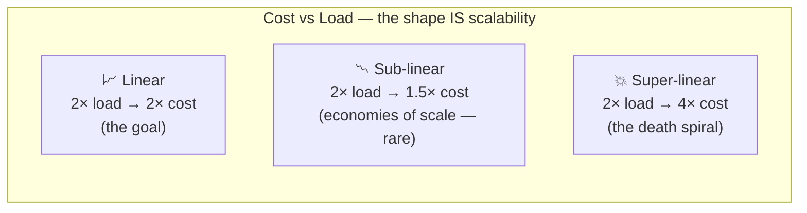
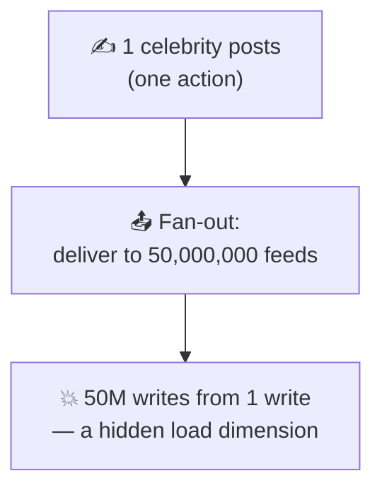
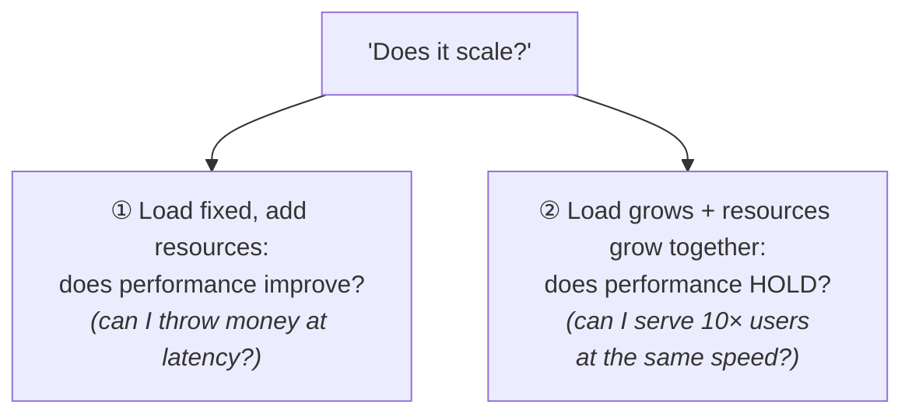
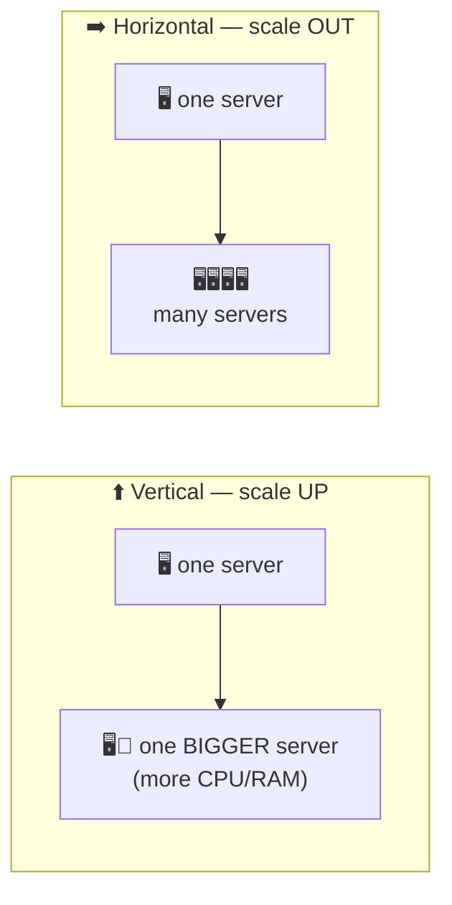
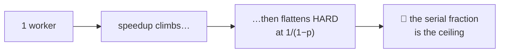
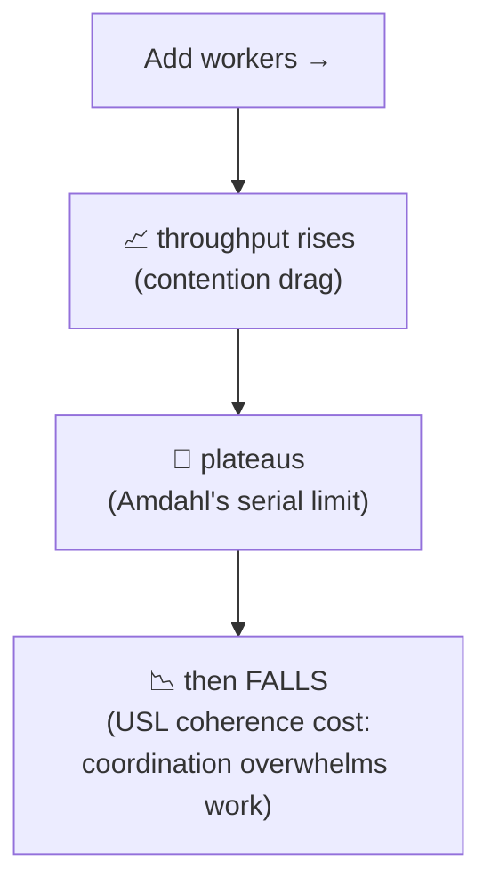
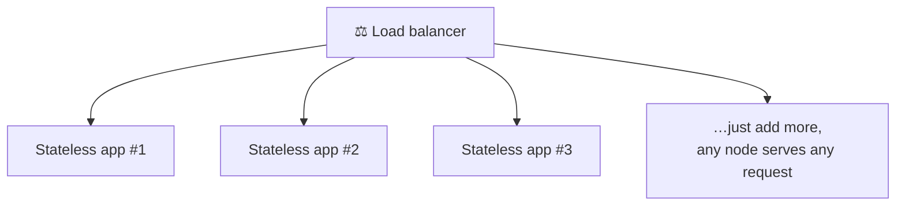
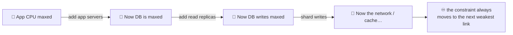
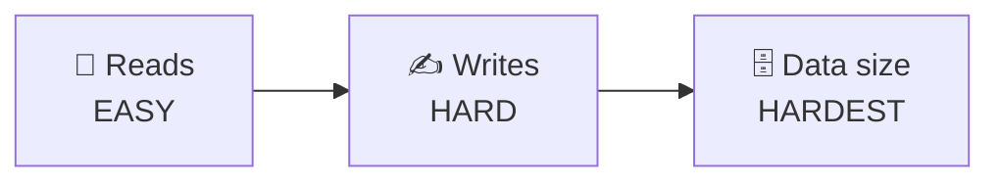
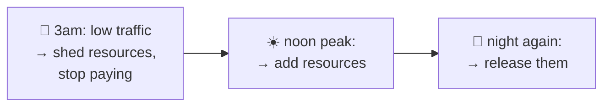

# Scalability

> **Phase:** Core System Properties → **Topic:** 4 of 5 → **Read time:** ~50 minutes

---

## Before You Begin

Three properties down. You can now reason about whether a system is **fast** (latency/throughput), **there** (availability), and **right** (reliability). Each was measured under some *given* load. This document removes that comfort and asks what happens when the load itself **grows** — 10×, 100×, 1000× — because a system that's fast, available, and reliable for a thousand users can quietly become none of those things for ten million.

> **As load grows, does the system keep up — and what does it cost to make it?**

That is **scalability**, and it's the property that quietly governs whether a product can *become successful without collapsing under its own success.* The cruel irony of systems is that the reward for building something people love is a traffic curve that destroys naive designs. Scalability is how you earn the right to grow.

You already have every tool you need to reason about it — you just haven't pointed them at *growth* yet:

- **Little's Law and the utilization curve** (Latency doc) told you concurrency, throughput, and latency are linked, and that latency explodes as you approach capacity. Scaling is the art of raising that capacity ceiling — and of understanding why raising it is harder than it looks.
- **The redundancy math** (Availability doc) showed how adding parallel copies changes a system. Scaling *out* is that same instinct aimed at capacity instead of uptime.
- **Failure multiplies under scale** (Reliability doc) — more components mean more faults, more partial failures, more correlated blast radius. Growth is an adversary of reliability, not just performance.
- **Bottleneck thinking** (Group 4) is the master skill here: a system scales exactly as far as its *narrowest shared resource*, and no further.

One scoping note, so this document stays in its lane. This is the **property** of scalability — what it *is*, how to reason about it, the vocabulary and the laws. The *techniques* for achieving it — horizontal scaling mechanics, sharding, replication, caching, load balancing, auto-scaling — get their proper, deep treatment in **Group 4** (intro) and the later **Scaling & Performance** phase. Here they appear only as *named pointers*. We're building the yardstick, not the toolbox.

Here's the trap. Beginners equate "scalable" with "fast," or think scalability is a feature you can bolt on later ("we'll make it scale when we need to"). Both are wrong, and expensively so. Scalability isn't speed, and it isn't a switch — it's a *property of how your system's cost and performance respond to growth*, largely determined by structural decisions made early. By the end, you'll see scalability not as "handling lots of traffic" but as a **slope**: the relationship between load and cost.

> **The mindset shift:** stop asking *"is it fast?"* — start asking *"as load grows 10×, does cost grow **10× or 100×** — and what **breaks first**?"* Scalability is not a speed. It's the *shape of the curve* relating load to the resources needed to serve it.

---

## Table of Contents

1. [What Scalability Actually Means](#1-what-scalability-actually-means)
2. [Load and the Dimensions of Scale](#2-load-and-the-dimensions-of-scale)
3. [Scalability vs Performance vs Capacity](#3-scalability-vs-performance-vs-capacity)
4. [Vertical vs Horizontal Scaling](#4-vertical-vs-horizontal-scaling)
5. [The Limits of Scaling — Amdahl and the USL](#5-the-limits-of-scaling--amdahl-and-the-usl)
6. [Why Scaling Is Hard — State](#6-why-scaling-is-hard--state)
7. [Bottlenecks and the Shifting Constraint](#7-bottlenecks-and-the-shifting-constraint)
8. [Scaling Reads, Writes, and Data](#8-scaling-reads-writes-and-data)
9. [Elasticity, Cost, and the Economics of Scale](#9-elasticity-cost-and-the-economics-of-scale)
10. [Putting It All Together — Brimble Grows 100×](#10-putting-it-all-together--brimble-grows-100)
11. [Final Recap](#11-final-recap)

---

## 1. What Scalability Actually Means

As always, start with the definition most people carry, then break it.

**The naive definition:** "scalable" = "handles a lot of traffic" or, worse, "fast." A system that serves 100,000 users must be scalable; a slow system must be unscalable.

**The problem:** speed and scale are different properties, and conflating them hides the whole idea. A blisteringly fast system can be *completely* unscalable, and a rather slow one can scale beautifully:

- A trading system answers in 50 microseconds — but only because everything lives on one enormous machine, and there is *no way to add a second*. Fast, and utterly unscalable. Growth has a hard wall.
- A batch analytics pipeline takes *hours* per job — but double the machines and it does twice the work, forever. Slow, and perfectly scalable.

So scalability is not about how the system performs *right now*. It's about how performance and cost **respond to growth**:

> **Scalability** is the ability of a system to handle increased load by adding resources — ideally with cost growing *proportionally* to load, not faster. It's a property of the **slope**, not the starting point.

### It's a Slope, Not a Number

This is the reframing that makes everything else click. Picture load on the x-axis and the resources (cost) needed to serve it on the y-axis. Scalability is the *shape of that line*:



- **Linear:** double the load, double the cost. Boring — and *excellent*. You can grow forever by writing proportionally larger cheques.
- **Sub-linear:** cost grows *slower* than load (economies of scale). Rare and wonderful.
- **Super-linear:** cost grows *faster* than load — 2× the users needs 4× the machines. This is a **death spiral**: growth becomes more expensive per user the bigger you get, until success itself bankrupts you. Most naive architectures are secretly super-linear, and don't discover it until the traffic arrives.

> 💡 **Key Insight**
>
> Scalability is not "how much can it handle?" — it's "**how does the cost of handling more grow?**" A system is scalable when load can increase and you have a *proportional, affordable* answer (add resources), not a *rewrite*. The question is never the absolute number on the machine today; it's the **slope** of the curve you're standing on. Fast tells you where you start; scalable tells you where the line goes.

### Quick Recap — What Scalability Means

- Scalability ≠ speed and ≠ "handles lots of traffic" — a fast system can be unscalable and a slow one perfectly scalable.
- It's the ability to absorb growth by **adding resources**, with cost ideally growing *proportionally* to load.
- Think of it as a **slope**: **linear** (goal), **sub-linear** (rare, economies of scale), **super-linear** (death spiral — most naive designs).
- The right question is not "how much?" but "**how does cost grow as load grows?**"

---

## 2. Load and the Dimensions of Scale

Before you can reason about handling *more* load, you have to answer a question beginners skip: **more of what, exactly?** "Load" sounds like one number. It never is — and the mistake of treating it as one is why systems get blindsided by a kind of growth they never measured.

### Load Is a Vector, Not a Scalar

A system is stressed along *many independent axes* at once. These are its **load parameters**, and which one grows determines what breaks:

| Load parameter | "More" means… | What it stresses first |
|---|---|---|
| **Request rate** (RPS/QPS) | More requests per second | Compute, throughput ceiling (Latency doc) |
| **Concurrent users/connections** | More sessions open at once | Memory, connection pools, Little's Law's *L* |
| **Data volume** | More total stored data | Storage, index size, query time |
| **Request complexity / fan-out** | Each request does more work or touches more services | Downstream capacity, the tail (Latency doc §5) |
| **Read/write ratio** | The *mix* shifts | Very different — reads and writes scale differently (§8) |
| **Payload size** | Bigger requests/responses | Bandwidth, transmission time |

The crucial consequence: **these grow independently, and a system can scale wonderfully on one axis while collapsing on another.** A system tuned for many small requests can be destroyed by a few enormous ones. A design that's fine with a billion rows can melt when concurrent *connections* spike, even if request rate is flat. "Will it scale?" is meaningless until you ask "*along which dimension?*"

### The Classic Trap — Fan-Out

The most famous example of a *hidden* load dimension, worth burning into intuition. Consider a social feed. Two operations:

- A user **posts** — write one row.
- A user **loads their feed** — read recent posts from everyone they follow.

Now an ordinary user has 200 followers; a celebrity has 50 million. When the celebrity posts, *delivering* that single post to 50 million feeds is a **fan-out** of 50 million writes from one action. The load parameter that explodes isn't "posts per second" — it's *followers per poster*, a dimension nobody thinks to put on the dashboard until a celebrity joins and the feed system falls over.



The lesson isn't about social feeds; it's that **the dimension that kills you is usually the one you weren't measuring.** Real scalability analysis starts by *enumerating* the load parameters and asking which are growing and how fast — a direct application of the estimation discipline from *What Is System Design?* (§4).

> 💡 **Key Insight**
>
> "Scale" is multi-dimensional. Before asking whether a system scales, ask **which load parameter is growing** — request rate, data, concurrency, fan-out, or the read/write mix. Systems fail on the axis nobody instrumented. The senior habit is to name the dimensions *first*, estimate which will grow fastest, and design for *that* — not for a vague blob called "traffic."

### Quick Recap — Dimensions of Scale

- **Load is a vector**, not a scalar — request rate, concurrency, data volume, fan-out, read/write mix, payload size all grow *independently*.
- A system can scale on one dimension and **collapse on another** — "will it scale?" requires "*along which axis?*"
- **Fan-out** is the classic hidden dimension: one action causing millions of downstream operations (the celebrity-post problem).
- Real analysis starts by **enumerating and estimating** the load parameters — the killer is usually the one you didn't measure.

---

## 3. Scalability vs Performance vs Capacity

Three words travel together and blur constantly: performance, capacity, scalability. Pulling them apart sharpens exactly what you're asking when a system is "under strain," and stops the classic error of trying to fix a *scalability* problem with a *performance* tweak.

| Term | The question | Snapshot or slope? |
|---|---|---|
| **Performance** | How well does it behave *right now, at the current load*? (latency, throughput) | A **snapshot** at one point |
| **Capacity** | How much load can it handle *before it breaks*, as currently built? | A **single point** — the ceiling |
| **Scalability** | How do performance and cost **change as load grows** and you add resources? | The **slope** — the whole curve |

The relationship: **performance is a point, capacity is the edge of the cliff, and scalability is the shape of the road toward it — and whether you can build more road.** You can improve performance (make each request faster) without improving scalability (the system still hits a wall at the same relative point). And you can improve scalability (add the ability to grow) without improving raw performance (each request is no faster — there are just more lanes).

### The Two Scaling Questions

"Does it scale?" actually hides two distinct questions, and confusing them causes real design mistakes:



- **Question 1 — Speedup:** hold the work fixed, add resources — does it get *faster*? (Give the batch job 10× machines; does it finish in 1/10 the time?) This is where Amdahl's Law (§5) rules.
- **Question 2 — Scale-out:** grow the load *and* the resources together — does performance *stay constant*? (10× users on 10× servers — same latency, or worse?) This is the question production systems actually live or die by.

A system can ace one and fail the other. The distinction matters because the *answer* tells you what kind of scaling you can even do — and §5 shows why both questions have hard mathematical ceilings.

> 💡 **Key Insight**
>
> **Performance is a snapshot; scalability is the derivative.** Making something faster (performance) and making something *grow-able* (scalability) are different investments with different techniques — and one does not imply the other. When a system struggles under growth, the first diagnostic move is to ask which you actually lack: is each request too slow (performance), or does adding resources fail to help (scalability)? They have opposite fixes — exactly like the latency-vs-throughput split, one level up.

### Quick Recap — Scalability vs Performance vs Capacity

- **Performance** = behavior now (a snapshot); **capacity** = the breaking point (a single ceiling); **scalability** = how both change with growth (the slope).
- You can raise performance without raising scalability, and vice versa — they're different investments.
- "Does it scale?" splits into **speedup** (fixed work + more resources → faster?) and **scale-out** (more load + more resources → performance holds?).
- Diagnose which you lack before fixing — slow-request (performance) and won't-grow (scalability) have opposite cures.

---

## 4. Vertical vs Horizontal Scaling

There are exactly two ways to add resources, and they define the entire vocabulary of scaling. This section is about *what they are and their tradeoffs* — the intuition. The *mechanics* of doing them (load balancers, orchestration, sharding) belong to Group 4 and the Scaling & Performance phase; here we're naming the two roads and where each one ends.



### Scale Up vs Scale Out

> **Vertical scaling (scale up):** make the machine *bigger* — more CPU, RAM, faster disk. One beefier box.
>
> **Horizontal scaling (scale out):** add *more* machines — many boxes sharing the load.

They could not be more different in character, and the tradeoffs decide most architectures:

| | **Vertical (scale up)** | **Horizontal (scale out)** |
|---|---|---|
| **How** | Bigger box | More boxes |
| **Simplicity** | ✅ Simple — no code changes, no distribution | ❌ Complex — needs distribution, coordination |
| **Ceiling** | ❌ **Hard limit** — biggest machine that exists | ✅ Effectively unbounded — keep adding nodes |
| **Failure** | ❌ The one big box is a **SPOF** (Topic 5) | ✅ One node dies, others carry on (Availability doc) |
| **Cost curve** | Super-linear — top-end hardware costs a *premium* per unit | Roughly linear — commodity boxes |

### Why Real Scale Is Horizontal — and Why It Costs You

Vertical scaling is the *tempting* first move: it's simple, requires no architectural change, and for a long time is the right call (don't distribute before you must). But it has a **hard ceiling** — there is a biggest machine money can buy, and once you're on it, growth stops dead. It's also a single point of failure (Topic 5, next) and priced at a premium.

Horizontal scaling is the path to *real* scale — its ceiling is effectively unlimited, and it doubles as fault tolerance (the redundancy of the Availability doc). But it imports a tax you'll spend the rest of the curriculum learning to pay:

> ⚠️ **Scaling out turns your program into a distributed system — and everything gets harder.** The moment "add another machine" is your growth strategy, you inherit Group 5's entire world: partial failure, network unreliability, coordination, and consistency. Data must be split or replicated; requests must be balanced; nodes must agree. Horizontal scaling doesn't *remove* the scaling problem — it *trades* a hardware ceiling for a coordination cost. The next section is the mathematics of exactly that cost.

The senior framing: **vertical scaling buys you time; horizontal scaling buys you a future — at the price of distributed-systems complexity.** Most real systems do both: scale up until it's uneconomical or hits the SPOF/ceiling problem, then scale out. Knowing *when* to switch is a judgment call the later phases equip you for.

> 💡 **Key Insight**
>
> The two scaling directions aren't just "bigger" vs "more" — they're a choice between a **simplicity-with-a-ceiling** and an **unbounded-ceiling-with-complexity.** Vertical is a better *starting* answer than beginners think (simplicity has real value); horizontal is the only *ending* answer for large scale — and its true cost isn't the extra machines, it's the distributed-systems tax stamped onto everything you build afterward.

### Quick Recap — Vertical vs Horizontal

- **Vertical (up):** bigger box — simple, no code changes, but a **hard ceiling**, a SPOF, and premium cost.
- **Horizontal (out):** more boxes — effectively unbounded and fault-tolerant, but imports **distributed-systems complexity**.
- Real scale is **horizontal**; its real price is not hardware but the **coordination tax** (partial failure, consistency, balancing).
- Most systems scale **up first, then out** — the skill is knowing when the ceiling/SPOF forces the switch.

---

## 5. The Limits of Scaling — Amdahl and the USL

Here is the senior-level heart of the topic — the scalability analogue to the latency doc's utilization curve. Beginners imagine scaling out is linear: 10 machines do 10× the work, 100 do 100×, forever. **It never works that way**, and two laws explain exactly why. Understanding them is the difference between promising your boss "we'll just add servers" and knowing where that promise breaks.

### Amdahl's Law — The Serial Fraction Caps You

Almost no workload is *fully* parallelizable. Some fraction of it is inherently **serial** — it must happen in sequence, on one worker, no matter how many you add. Coordinating, merging results, a shared step everything waits on. Amdahl's Law says that serial fraction sets a hard ceiling on speedup:

```text
                    1
Speedup(N) = ─────────────────────
             (1 − p) + (p / N)

  p = the parallelizable fraction     N = number of workers
  (1 − p) = the stubborn serial fraction
```

The consequence is brutal and counterintuitive. Suppose 95% of your work parallelizes (p = 0.95) — sounds great. Take N to infinity — infinite machines:

```text
Max speedup = 1 / (1 − 0.95) = 1 / 0.05 = 20×
```

With *infinite* machines, a 95%-parallel workload can go at most **20× faster.** The 5% serial part becomes the entire wall. Add this table to your intuition:

| Serial fraction | Max speedup (∞ workers) |
|---|---|
| 1% serial | 100× |
| 5% serial | 20× |
| 10% serial | 10× |
| 25% serial | 4× |



> The lesson: **the serial fraction, not the machine count, is your ceiling.** Beyond a point, adding workers does essentially nothing — you're paying for hardware that sits waiting on the one part that can't parallelize. To scale further you must *shrink the serial fraction* (remove the shared step, the global lock, the coordination point) — which is exactly the hard architectural work scaling really is.

### The Universal Scalability Law — It Can Get *Worse*

Amdahl says extra workers stop *helping*. Reality is often nastier: extra workers start actively *hurting*. The **Universal Scalability Law (USL)** adds a second penalty Amdahl ignores — **coherence**: the cost of workers *coordinating with each other*. Every node that joins must sometimes synchronize, share state, or agree with the others — and that cross-talk grows with the *number of pairs* of nodes, faster than the workers you're adding.



So the real-world scalability curve doesn't just flatten — it **rises, peaks, and then declines.** Past some node count, adding machines makes the system *slower*, because the workers spend more time coordinating than working. You've felt the human version: one person builds a wall in 10 days; ten people build it faster; but a *thousand* people just trip over each other and the wall goes up slower than with ten. Software does this too — database connection pools, distributed locks, chatty microservices, consensus groups all have a peak past which "more" is worse.

> ⚠️ **Adding capacity can *reduce* it.** This is the trap that stuns people the first time: the system is slow, so you add servers — and it gets *slower*, because the bottleneck was coordination, not compute, and you just added more things to coordinate. The famous production version is the "thundering herd" on a shared resource, or a database that grinds to a halt as you add app servers all contending for the same locks. When scaling *out* makes things *worse*, USL coherence is your suspect.

> 💡 **Key Insight**
>
> Linear scaling is a fantasy; the real curve **flattens (Amdahl's serial fraction) and can even bend downward (USL coordination cost).** The practical takeaways are permanent: (1) the path to scale is *removing serialization and coordination*, not adding hardware; (2) there is a point past which more nodes hurt, so "just add servers" has a mathematically guaranteed expiry date. The most scalable systems are the ones that make workers share and coordinate as *little* as possible — which is the deep reason §6's lesson about **state** is the crux of the whole topic.

### Quick Recap — The Limits of Scaling

- **Amdahl's Law:** the **serial fraction** caps speedup — 5% serial means ≤ 20× even with infinite workers; the fix is *shrinking serialization*, not adding machines.
- **Universal Scalability Law:** adds **coherence** (coordination cost) — the curve rises, peaks, then *declines*; past a point more nodes make it *slower*.
- "Just add servers" has a **mathematically guaranteed ceiling** — and beyond it, negative returns.
- The route to real scale is **minimizing shared state and coordination** — which is why state (§6) is the central difficulty.

---

## 6. Why Scaling Is Hard — State

Section 5 ended on a hint: scaling is about minimizing what workers *share*. This section names the thing they share that makes scaling hard. If you take one idea from this entire document, take this one:

> **Scaling compute is easy. Scaling *state* is the whole problem.**

### Stateless Scales Trivially

A component is **stateless** if it remembers nothing between requests — every request carries everything needed to handle it, and any instance can serve any request identically. Stateless components scale *beautifully*, almost for free:



Need more capacity? Clone the instance, add it behind the load balancer, done. There's nothing to coordinate because there's nothing shared — which, per Amdahl and the USL (§5), means *no serial fraction and no coherence cost from these nodes*. This is why the **application/compute tier** of most systems is the *easy* part to scale: keep it stateless and it scales horizontally almost linearly. Horizontal scaling and statelessness are two sides of one coin.

### Stateful Is Where It All Gets Hard

The trouble is that a system has to remember things *somewhere* — user accounts, orders, balances, the shopping cart. That **state** has to be consistent no matter which node you talk to, and *that* requirement is the enemy of easy scaling. The instant two nodes must agree on shared mutable data, you're back in the serial/coordination world of §5.

Watch where the difficulty concentrates. Push state *out* of the stateless tier and it doesn't vanish — it piles up in whatever holds it:

| Where state hides | Why it resists scaling |
|---|---|
| **The database** | The classic wall — everyone reads/writes one source of truth; the hardest thing to scale (§8) |
| **Session state in memory** | Ties a user to one server (can't freely add/replace nodes); the fix is to externalize it |
| **Locks / shared counters** | Every worker contends on one hot spot — pure USL coherence cost |
| **Caches** | Help enormously, but introduce their own consistency problem (which phase 06 tackles) |

> 💡 **Key Insight**
>
> The reason "just add servers" works for the app tier and *fails* for the database is **state.** Stateless things clone freely; stateful things must stay consistent, and consistency requires coordination, and coordination is the serial fraction that caps scaling (§5). The master pattern of scalable design is therefore: **push state out of the compute path, keep as much as possible stateless, and isolate the unavoidable shared state into as small and specialized a component as you can** — because that component will be your scaling ceiling.

### The Bridge to Consistency (and SPOF)

This is also where two of the biggest themes in the curriculum announce themselves. That "one source of truth everyone must agree on" is the seed of **consistency** (how do distributed copies of state agree? — the CAP/consistency topics ahead) and of **Single Points of Failure** (that shared stateful component is often both your scaling ceiling *and* the thing whose failure takes everything down — Topic 5, next). State is where scalability, consistency, and availability all collide. Hold that thought; the next topic walks straight into it.

### Quick Recap — Why Scaling Is Hard

- **Stateless components scale trivially** — clone them behind a balancer; any node serves any request, nothing to coordinate.
- **State is the hard part**: shared mutable data must stay consistent, and consistency demands the coordination that caps scaling (§5).
- Pushing state out of compute concentrates it in the **database, sessions, locks, caches** — whichever holds it becomes the ceiling.
- The scalable-design pattern: **maximize statelessness, minimize and isolate shared state** — and that shared state links straight to consistency and SPOF (Topic 5).

---

## 7. Bottlenecks and the Shifting Constraint

Group 4 taught you to hunt bottlenecks. Scalability is where that skill becomes a *way of seeing*, because scaling is nothing but a long game of finding and moving the current bottleneck — over and over, forever.

### A System Scales Only As Far As Its Bottleneck

At any moment, exactly *one* resource is the constraint — the thing that saturates first and caps the whole system's throughput (Latency doc: the narrowest component sets the ceiling). No amount of surplus elsewhere helps:

> A system's scalability at any instant is **the scalability of its current bottleneck.** Ten idle app servers in front of a maxed-out database is a database-limited system. The rest is decoration.

This means scaling work is *targeted*, not general. "Make it scale" is meaningless; "find what saturates first and relieve *that*" is the actual job. Adding resources anywhere *except* the bottleneck buys you nothing but a bigger bill — a classic and expensive beginner mistake.

### The Bottleneck Always Moves

Here's the part that makes scaling a *process* rather than a fix: **relieve one bottleneck and the constraint doesn't disappear — it moves to the next-weakest resource.** You never "finish" scaling; you chase a constraint that keeps relocating.



Each fix reveals the next wall. Scale the app tier, and load slams into the database. Add read replicas, and the write master becomes the limit. Shard the writes, and cross-shard queries or the network become the constraint. This is *whack-a-mole*, and it's not a sign of doing it wrong — it *is* scaling. The senior mindset accepts it: you're not eliminating the bottleneck, you're deciding *which bottleneck you want to have next*, and how far each move buys you.

> ⚠️ **Optimizing anything but the current bottleneck is wasted effort — sometimes worse than wasted.** Speeding up a non-bottleneck component makes it finish its work faster only to wait longer at the real constraint, and (per §5's USL) *adding* capacity away from the bottleneck can even increase coordination cost. Before any scaling change, answer one question: *what saturates first right now?* If your change doesn't move **that**, it's not a scaling change — it's a cost increase.

> 💡 **Key Insight**
>
> Scaling is **iterative bottleneck relocation.** There is always a current constraint; you relieve it; a new one appears; repeat. This reframes the whole activity: the question is never "is it scalable?" (nothing is, infinitely) but "**where is the bottleneck now, how far will relieving it get me, and what becomes the bottleneck after that?**" A roadmap of your next three bottlenecks is worth more than any single optimization.

### Quick Recap — The Shifting Constraint

- A system scales **only as far as its current bottleneck** — surplus capacity elsewhere is decoration.
- Scaling work is **targeted**: find what saturates first and relieve *that*; optimizing non-bottlenecks just raises cost.
- Relieving a bottleneck **moves it** to the next-weakest resource — scaling is whack-a-mole *by nature*, not by mistake.
- The senior question is never "is it scalable?" but "**where's the bottleneck now, and what's the next one?**"

---

## 8. Scaling Reads, Writes, and Data

Section 6 said state is the wall and the database is where it piles up. But "scaling the database" isn't one problem — it's *three*, of wildly different difficulty. Knowing which one you face tells you how hard your life is about to be. (This is intuition and vocabulary; the *mechanisms* — replication, partitioning, sharding — are the Storage & Databases phase's job.)

### The Difficulty Ladder: Reads → Writes → Data



**Reads are (relatively) easy.** A read doesn't change anything, so you can make *copies* of the data and spread reads across them — more copies, more read capacity. Two families of pointer (mechanisms later): **replicas** (read-only copies of the database) and **caching** (keep hot answers close). Because reads don't mutate, adding read capacity is close to the "clone it" ease of stateless compute. Most read-heavy systems scale reads a long way without deep pain.

**Writes are hard.** A write *changes* the source of truth, and every copy now has to agree with it. You can't just clone your way out — the whole point of a write is that there's *one* correct outcome everyone must converge on. Scaling writes means either funneling them through one master (which caps you at that master's capacity — a bottleneck and a SPOF) or *splitting* the data so different writes hit different owners (**partitioning/sharding**), which then makes anything spanning partitions hard. Writes are where the serial fraction (§5) and the state problem (§6) meet in one place.

**Data volume is the hardest.** Even setting throughput aside, sheer *size* eventually exceeds one machine's storage, forcing you to split data across many — and the moment data is split, everything that was trivially simple on one machine (a query, a join, a transaction, keeping things consistent) becomes a distributed problem. Big data doesn't just strain the database; it *fractures* the assumptions the rest of your system was built on.

| What you're scaling | Why it's that hard | Named pointer (later phases) |
|---|---|---|
| **Reads** | Copies don't need to agree with each other, only catch up | Replicas, caching |
| **Writes** | One source of truth everyone must converge on | Sharding/partitioning, write masters |
| **Data size** | Splitting data breaks single-machine guarantees | Partitioning, distributed storage |

> ⚠️ **"Just scale the database" is where naive architectures go to die.** The database is usually the hardest thing to scale precisely because it holds the shared, consistent state everything depends on (§6). This is why so much of system design — read replicas, caches, sharding, denormalization, eventual consistency, event-driven designs — exists essentially to *take pressure off the database*. When someone waves a hand and says "we'll scale the DB later," they're deferring the single hardest problem in the system.

> 💡 **Key Insight**
>
> Not all scaling is equal: **reads scale by copying, writes scale by splitting, and data scales by fracturing your assumptions.** The read/write *ratio* (a load parameter from §2) therefore tells you a lot about how hard your scaling will be — a 99%-read system has an easy road; a write-heavy one is staring straight at the hardest problem in the field. Know your ratio before you promise anyone a timeline.

### Quick Recap — Scaling Reads, Writes, Data

- **Reads scale by copying** (replicas, caches) — copies needn't agree, only catch up; relatively easy.
- **Writes scale by splitting** — one source of truth must converge, so you funnel (bottleneck/SPOF) or shard (cross-partition pain).
- **Data size is hardest** — splitting data *fractures* single-machine guarantees (queries, joins, transactions, consistency).
- Much of system design exists to **relieve the database**; the **read/write ratio** predicts how hard your scaling will be.

---

## 9. Elasticity, Cost, and the Economics of Scale

The final reframing, and the one that separates engineers from *senior* engineers: **scalability is ultimately an economic property.** Section 1 said it's a slope of cost versus load — this section takes that seriously, because a system that "scales" by spending infinite money doesn't really scale at all.

### The Real Metric — Cost per Unit of Work

Raw capacity ("we can handle a million users!") is a vanity number. The metric that actually matters is **cost per request** (or per user, per transaction) — and crucially, *how it changes as you grow*. This is §1's slope, made concrete:

```text
             total cost
Cost/request = ──────────────
             total requests
```

- **Flat or falling cost/request as you grow** → linear or sub-linear scaling → a healthy, sustainable business.
- **Rising cost/request as you grow** → super-linear scaling → the death spiral: each new user is more expensive than the last, and growth eventually eats you alive.

> A system that needs 4× the machines for 2× the users has a *rising* cost per request. It may pass every load test and still be a failing business — because it gets *less* efficient exactly as it succeeds. Scalability that ignores cost/request is measuring the wrong thing.

### Elasticity — Scaling Down Is Half the Job

Beginners think scaling is about handling *peaks*. But traffic isn't flat — it has daily cycles, weekly rhythms, seasonal spikes (the flash sale from the Latency doc). **Elasticity** is the ability to scale *both directions*: add resources for the peak **and give them back in the trough.**



Elasticity is what makes cloud economics work: you pay for the capacity you *use*, not the peak you *provisioned*. A system that can only scale *up* (and never down) wastes enormous money running peak-sized hardware at 3 a.m. — and note the tension with the Latency doc's headroom lesson (§7 there): you need slack for spikes *and* you don't want to pay for idle metal, so elasticity is the reconciliation — provision headroom *dynamically*.

### The Economic Tradeoffs

Scalability is bought, and the currency isn't only dollars:

| You spend… | To buy… |
|---|---|
| **Money** (more machines) | The simplest capacity — but watch cost/request |
| **Complexity** (distribution, sharding, coordination) | Higher ceilings — but distributed-systems tax (§4) and USL risk (§5) |
| **Consistency** (eventual instead of strong) | Easier scaling of writes/data — but weaker guarantees (consistency topics ahead) |
| **Latency** (batching, async) | Higher throughput per dollar — the Latency doc's §8 trade, at fleet scale |

There's no free scaling. Every technique that raises the ceiling charges you in money, complexity, consistency, or latency — which is precisely why scalability is not a switch but a *series of deliberate tradeoffs*, made against the growth you actually expect (doc 00's requirements thinking, one last time).

> 💡 **Key Insight**
>
> The mature measure of scalability is **cost per request as load grows**, not peak capacity — and the mature *capability* is **elasticity** (scaling down as readily as up). A system "scales" only if growth stays *affordable*: flat-or-falling cost/request, resources that follow demand in both directions, and tradeoffs chosen on purpose. Vanity capacity numbers impress in a demo; the cost slope is what determines whether success is survivable.

### Quick Recap — The Economics of Scale

- Scalability is **economic**: the true metric is **cost per request as load grows**, not raw peak capacity.
- **Falling/flat cost per request** = healthy (linear/sub-linear); **rising** = the super-linear death spiral, a failing business even if load tests pass.
- **Elasticity** (scale *down* as well as up) is half the job — it reconciles spike-headroom with not paying for idle metal.
- Scaling is **bought** with money, complexity, consistency, or latency — never free; choose the tradeoffs against expected growth.

---

*(Sections 10–11 continue in subsequent commits.)*
