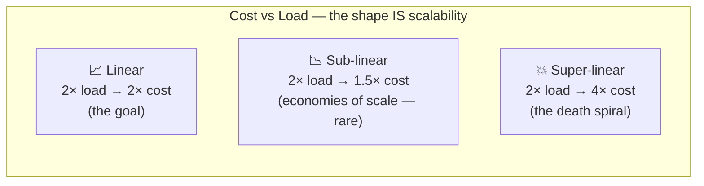
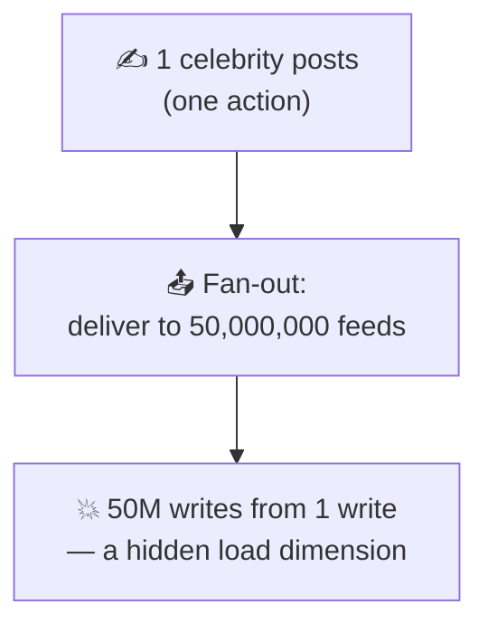
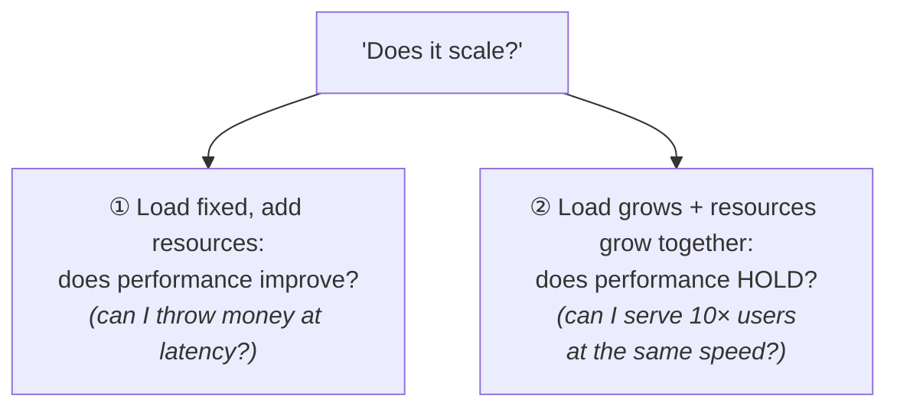
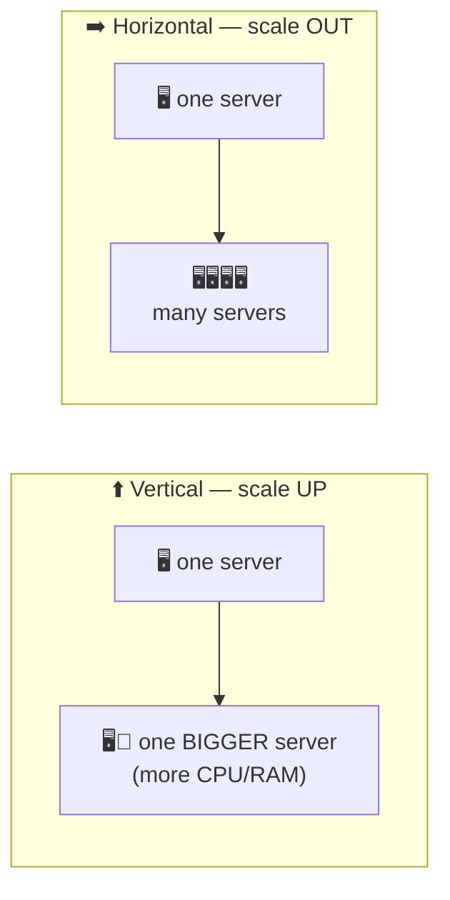

# Scalability

> **Phase:** Core System Properties → **Topic:** 4 of 5 → **Read time:** ~50 minutes

---

## Before You Begin

Three properties down. You can now reason about whether a system is **fast** (latency/throughput), **there** (availability), and **right** (reliability). Each was measured under some *given* load. This document removes that comfort and asks what happens when the load itself **grows** — 10×, 100×, 1000× — because a system that's fast, available, and reliable for a thousand users can quietly become none of those things for ten million.

> **As load grows, does the system keep up — and what does it cost to make it?**

That is **scalability**, and it's the property that quietly governs whether a product can *become successful without collapsing under its own success.* The cruel irony of systems is that the reward for building something people love is a traffic curve that destroys naive designs. Scalability is how you earn the right to grow.

You already have every tool you need to reason about it — you just haven't pointed them at *growth* yet:

- **Little's Law and the utilization curve** (Latency doc) told you concurrency, throughput, and latency are linked, and that latency explodes as you approach capacity. Scaling is the art of raising that capacity ceiling — and of understanding why raising it is harder than it looks.
- **The redundancy math** (Availability doc) showed how adding parallel copies changes a system. Scaling *out* is that same instinct aimed at capacity instead of uptime.
- **Failure multiplies under scale** (Reliability doc) — more components mean more faults, more partial failures, more correlated blast radius. Growth is an adversary of reliability, not just performance.
- **Bottleneck thinking** (Group 4) is the master skill here: a system scales exactly as far as its *narrowest shared resource*, and no further.

One scoping note, so this document stays in its lane. This is the **property** of scalability — what it *is*, how to reason about it, the vocabulary and the laws. The *techniques* for achieving it — horizontal scaling mechanics, sharding, replication, caching, load balancing, auto-scaling — get their proper, deep treatment in **Group 4** (intro) and the later **Scaling & Performance** phase. Here they appear only as *named pointers*. We're building the yardstick, not the toolbox.

Here's the trap. Beginners equate "scalable" with "fast," or think scalability is a feature you can bolt on later ("we'll make it scale when we need to"). Both are wrong, and expensively so. Scalability isn't speed, and it isn't a switch — it's a *property of how your system's cost and performance respond to growth*, largely determined by structural decisions made early. By the end, you'll see scalability not as "handling lots of traffic" but as a **slope**: the relationship between load and cost.

> **The mindset shift:** stop asking *"is it fast?"* — start asking *"as load grows 10×, does cost grow **10× or 100×** — and what **breaks first**?"* Scalability is not a speed. It's the *shape of the curve* relating load to the resources needed to serve it.

---

## Table of Contents

1. [What Scalability Actually Means](#1-what-scalability-actually-means)
2. [Load and the Dimensions of Scale](#2-load-and-the-dimensions-of-scale)
3. [Scalability vs Performance vs Capacity](#3-scalability-vs-performance-vs-capacity)
4. [Vertical vs Horizontal Scaling](#4-vertical-vs-horizontal-scaling)
5. [The Limits of Scaling — Amdahl and the USL](#5-the-limits-of-scaling--amdahl-and-the-usl)
6. [Why Scaling Is Hard — State](#6-why-scaling-is-hard--state)
7. [Bottlenecks and the Shifting Constraint](#7-bottlenecks-and-the-shifting-constraint)
8. [Scaling Reads, Writes, and Data](#8-scaling-reads-writes-and-data)
9. [Elasticity, Cost, and the Economics of Scale](#9-elasticity-cost-and-the-economics-of-scale)
10. [Putting It All Together — Brimble Grows 100×](#10-putting-it-all-together--brimble-grows-100)
11. [Final Recap](#11-final-recap)

---

## 1. What Scalability Actually Means

As always, start with the definition most people carry, then break it.

**The naive definition:** "scalable" = "handles a lot of traffic" or, worse, "fast." A system that serves 100,000 users must be scalable; a slow system must be unscalable.

**The problem:** speed and scale are different properties, and conflating them hides the whole idea. A blisteringly fast system can be *completely* unscalable, and a rather slow one can scale beautifully:

- A trading system answers in 50 microseconds — but only because everything lives on one enormous machine, and there is *no way to add a second*. Fast, and utterly unscalable. Growth has a hard wall.
- A batch analytics pipeline takes *hours* per job — but double the machines and it does twice the work, forever. Slow, and perfectly scalable.

So scalability is not about how the system performs *right now*. It's about how performance and cost **respond to growth**:

> **Scalability** is the ability of a system to handle increased load by adding resources — ideally with cost growing *proportionally* to load, not faster. It's a property of the **slope**, not the starting point.

### It's a Slope, Not a Number

This is the reframing that makes everything else click. Picture load on the x-axis and the resources (cost) needed to serve it on the y-axis. Scalability is the *shape of that line*:

- **Linear:** double the load, double the cost. Boring — and *excellent*. You can grow forever by writing proportionally larger cheques.
- **Sub-linear:** cost grows *slower* than load (economies of scale). Rare and wonderful.
- **Super-linear:** cost grows *faster* than load — 2× the users needs 4× the machines. This is a **death spiral**: growth becomes more expensive per user the bigger you get, until success itself bankrupts you. Most naive architectures are secretly super-linear, and don't discover it until the traffic arrives.

> 💡 **Key Insight**
>
> Scalability is not "how much can it handle?" — it's "**how does the cost of handling more grow?**" A system is scalable when load can increase and you have a *proportional, affordable* answer (add resources), not a *rewrite*. The question is never the absolute number on the machine today; it's the **slope** of the curve you're standing on. Fast tells you where you start; scalable tells you where the line goes.

### Quick Recap — What Scalability Means

- Scalability ≠ speed and ≠ "handles lots of traffic" — a fast system can be unscalable and a slow one perfectly scalable.
- It's the ability to absorb growth by **adding resources**, with cost ideally growing *proportionally* to load.
- Think of it as a **slope**: **linear** (goal), **sub-linear** (rare, economies of scale), **super-linear** (death spiral — most naive designs).
- The right question is not "how much?" but "**how does cost grow as load grows?**"

---

## 2. Load and the Dimensions of Scale

Before you can reason about handling *more* load, you have to answer a question beginners skip: **more of what, exactly?** "Load" sounds like one number. It never is — and the mistake of treating it as one is why systems get blindsided by a kind of growth they never measured.

### Load Is a Vector, Not a Scalar

A system is stressed along *many independent axes* at once. These are its **load parameters**, and which one grows determines what breaks:

| Load parameter | "More" means… | What it stresses first |
|---|---|---|
| **Request rate** (RPS/QPS) | More requests per second | Compute, throughput ceiling (Latency doc) |
| **Concurrent users/connections** | More sessions open at once | Memory, connection pools, Little's Law's *L* |
| **Data volume** | More total stored data | Storage, index size, query time |
| **Request complexity / fan-out** | Each request does more work or touches more services | Downstream capacity, the tail (Latency doc §5) |
| **Read/write ratio** | The *mix* shifts | Very different — reads and writes scale differently (§8) |
| **Payload size** | Bigger requests/responses | Bandwidth, transmission time |

The crucial consequence: **these grow independently, and a system can scale wonderfully on one axis while collapsing on another.** A system tuned for many small requests can be destroyed by a few enormous ones. A design that's fine with a billion rows can melt when concurrent *connections* spike, even if request rate is flat. "Will it scale?" is meaningless until you ask "*along which dimension?*"

### The Classic Trap — Fan-Out

The most famous example of a *hidden* load dimension, worth burning into intuition. Consider a social feed. Two operations:

- A user **posts** — write one row.
- A user **loads their feed** — read recent posts from everyone they follow.

Now an ordinary user has 200 followers; a celebrity has 50 million. When the celebrity posts, *delivering* that single post to 50 million feeds is a **fan-out** of 50 million writes from one action. The load parameter that explodes isn't "posts per second" — it's *followers per poster*, a dimension nobody thinks to put on the dashboard until a celebrity joins and the feed system falls over.

The lesson isn't about social feeds; it's that **the dimension that kills you is usually the one you weren't measuring.** Real scalability analysis starts by *enumerating* the load parameters and asking which are growing and how fast — a direct application of the estimation discipline from *What Is System Design?* (§4).

> 💡 **Key Insight**
>
> "Scale" is multi-dimensional. Before asking whether a system scales, ask **which load parameter is growing** — request rate, data, concurrency, fan-out, or the read/write mix. Systems fail on the axis nobody instrumented. The senior habit is to name the dimensions *first*, estimate which will grow fastest, and design for *that* — not for a vague blob called "traffic."

### Quick Recap — Dimensions of Scale

- **Load is a vector**, not a scalar — request rate, concurrency, data volume, fan-out, read/write mix, payload size all grow *independently*.
- A system can scale on one dimension and **collapse on another** — "will it scale?" requires "*along which axis?*"
- **Fan-out** is the classic hidden dimension: one action causing millions of downstream operations (the celebrity-post problem).
- Real analysis starts by **enumerating and estimating** the load parameters — the killer is usually the one you didn't measure.

---

## 3. Scalability vs Performance vs Capacity

Three words travel together and blur constantly: performance, capacity, scalability. Pulling them apart sharpens exactly what you're asking when a system is "under strain," and stops the classic error of trying to fix a *scalability* problem with a *performance* tweak.

| Term | The question | Snapshot or slope? |
|---|---|---|
| **Performance** | How well does it behave *right now, at the current load*? (latency, throughput) | A **snapshot** at one point |
| **Capacity** | How much load can it handle *before it breaks*, as currently built? | A **single point** — the ceiling |
| **Scalability** | How do performance and cost **change as load grows** and you add resources? | The **slope** — the whole curve |

The relationship: **performance is a point, capacity is the edge of the cliff, and scalability is the shape of the road toward it — and whether you can build more road.** You can improve performance (make each request faster) without improving scalability (the system still hits a wall at the same relative point). And you can improve scalability (add the ability to grow) without improving raw performance (each request is no faster — there are just more lanes).

### The Two Scaling Questions

"Does it scale?" actually hides two distinct questions, and confusing them causes real design mistakes:

- **Question 1 — Speedup:** hold the work fixed, add resources — does it get *faster*? (Give the batch job 10× machines; does it finish in 1/10 the time?) This is where Amdahl's Law (§5) rules.
- **Question 2 — Scale-out:** grow the load *and* the resources together — does performance *stay constant*? (10× users on 10× servers — same latency, or worse?) This is the question production systems actually live or die by.

A system can ace one and fail the other. The distinction matters because the *answer* tells you what kind of scaling you can even do — and §5 shows why both questions have hard mathematical ceilings.

> 💡 **Key Insight**
>
> **Performance is a snapshot; scalability is the derivative.** Making something faster (performance) and making something *grow-able* (scalability) are different investments with different techniques — and one does not imply the other. When a system struggles under growth, the first diagnostic move is to ask which you actually lack: is each request too slow (performance), or does adding resources fail to help (scalability)? They have opposite fixes — exactly like the latency-vs-throughput split, one level up.

### Quick Recap — Scalability vs Performance vs Capacity

- **Performance** = behavior now (a snapshot); **capacity** = the breaking point (a single ceiling); **scalability** = how both change with growth (the slope).
- You can raise performance without raising scalability, and vice versa — they're different investments.
- "Does it scale?" splits into **speedup** (fixed work + more resources → faster?) and **scale-out** (more load + more resources → performance holds?).
- Diagnose which you lack before fixing — slow-request (performance) and won't-grow (scalability) have opposite cures.

---

## 4. Vertical vs Horizontal Scaling

There are exactly two ways to add resources, and they define the entire vocabulary of scaling. This section is about *what they are and their tradeoffs* — the intuition. The *mechanics* of doing them (load balancers, orchestration, sharding) belong to Group 4 and the Scaling & Performance phase; here we're naming the two roads and where each one ends.

### Scale Up vs Scale Out

> **Vertical scaling (scale up):** make the machine *bigger* — more CPU, RAM, faster disk. One beefier box.
>
> **Horizontal scaling (scale out):** add *more* machines — many boxes sharing the load.

They could not be more different in character, and the tradeoffs decide most architectures:

| | **Vertical (scale up)** | **Horizontal (scale out)** |
|---|---|---|
| **How** | Bigger box | More boxes |
| **Simplicity** | ✅ Simple — no code changes, no distribution | ❌ Complex — needs distribution, coordination |
| **Ceiling** | ❌ **Hard limit** — biggest machine that exists | ✅ Effectively unbounded — keep adding nodes |
| **Failure** | ❌ The one big box is a **SPOF** (Topic 5) | ✅ One node dies, others carry on (Availability doc) |
| **Cost curve** | Super-linear — top-end hardware costs a *premium* per unit | Roughly linear — commodity boxes |

### Why Real Scale Is Horizontal — and Why It Costs You

Vertical scaling is the *tempting* first move: it's simple, requires no architectural change, and for a long time is the right call (don't distribute before you must). But it has a **hard ceiling** — there is a biggest machine money can buy, and once you're on it, growth stops dead. It's also a single point of failure (Topic 5, next) and priced at a premium.

Horizontal scaling is the path to *real* scale — its ceiling is effectively unlimited, and it doubles as fault tolerance (the redundancy of the Availability doc). But it imports a tax you'll spend the rest of the curriculum learning to pay:

> ⚠️ **Scaling out turns your program into a distributed system — and everything gets harder.** The moment "add another machine" is your growth strategy, you inherit Group 5's entire world: partial failure, network unreliability, coordination, and consistency. Data must be split or replicated; requests must be balanced; nodes must agree. Horizontal scaling doesn't *remove* the scaling problem — it *trades* a hardware ceiling for a coordination cost. The next section is the mathematics of exactly that cost.

The senior framing: **vertical scaling buys you time; horizontal scaling buys you a future — at the price of distributed-systems complexity.** Most real systems do both: scale up until it's uneconomical or hits the SPOF/ceiling problem, then scale out. Knowing *when* to switch is a judgment call the later phases equip you for.

> 💡 **Key Insight**
>
> The two scaling directions aren't just "bigger" vs "more" — they're a choice between a **simplicity-with-a-ceiling** and an **unbounded-ceiling-with-complexity.** Vertical is a better *starting* answer than beginners think (simplicity has real value); horizontal is the only *ending* answer for large scale — and its true cost isn't the extra machines, it's the distributed-systems tax stamped onto everything you build afterward.

### Quick Recap — Vertical vs Horizontal

- **Vertical (up):** bigger box — simple, no code changes, but a **hard ceiling**, a SPOF, and premium cost.
- **Horizontal (out):** more boxes — effectively unbounded and fault-tolerant, but imports **distributed-systems complexity**.
- Real scale is **horizontal**; its real price is not hardware but the **coordination tax** (partial failure, consistency, balancing).
- Most systems scale **up first, then out** — the skill is knowing when the ceiling/SPOF forces the switch.

---

*(Sections 5–11 continue in subsequent commits.)*
