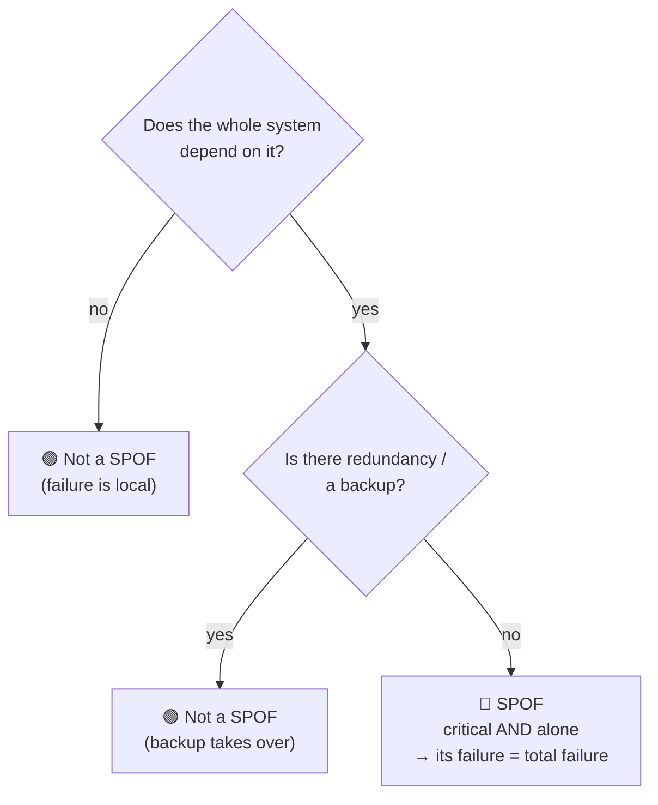
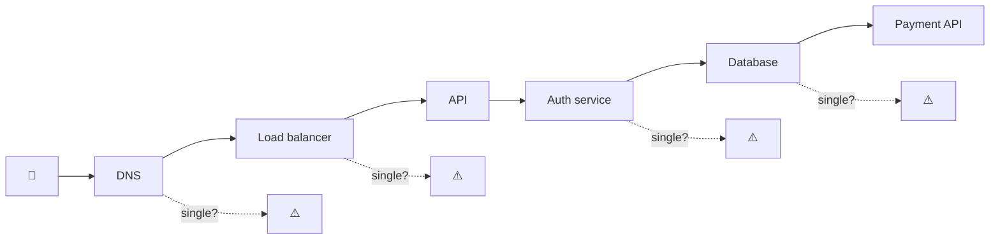

# Single Point of Failure (SPOF)

> **Phase:** Core System Properties → **Topic:** 5 of 5 → **Read time:** ~50 minutes

---

## Before You Begin

This is the **last** of the five core properties — and it's less a new idea than the place where the other four converge. You've spent four documents building yardsticks: **latency/throughput** (is it fast?), **availability** (is it there?), **reliability** (is it right?), **scalability** (does it survive growth?). This document is about the single structural flaw that can quietly violate *all four at once*:

> **Which single component, if it failed right now, would take the *whole system* down with it?**

That component is a **Single Point of Failure** — a SPOF — and hunting them is one of the most valuable habits a systems engineer can build. It's the capstone the whole phase has been pointing toward. You've already met SPOFs in every prior document, by other names:

- The **single load balancer** in front of a beautifully redundant server fleet (Availability §7) — one box whose death caps the entire system's availability.
- The **shared config service** that all your "independent" replicas secretly depend on (Reliability §9) — where correlated failure is born.
- The **write master** / single source of truth that both bottlenecks your scaling *and* has no backup (Scalability §6, §8).

Each time, the same shape recurred: *one thing everything depends on, with no redundancy.* This document makes that shape the entire subject — how to define it, find it, reason about it, and decide what to do about each one.

One scoping note, consistent with the Scalability doc. This is the **concept** — what a SPOF is and how to think about it. The *techniques* for removing them (redundancy mechanics, failover, load balancing, multi-region, leader election, consensus) get their deep treatment in the Availability material and the later distributed-systems and scaling phases. Here they appear only as *named pointers*. We're learning to **see** SPOFs; the toolbox for removing them comes later.

Here's the trap this document disarms. Beginners reason about failure one component at a time — "what if the cache fails? what if a server dies?" — and design local handling for each. But they miss the *structural* question: is there a component whose failure isn't local at all, but *total*? SPOFs are invisible on a good day and catastrophic on a bad one, and the worst ones aren't even drawn on the architecture diagram. You don't feel a SPOF until it fails — and then you feel nothing else, because everything is down.

> **The mindset shift:** stop asking *"what if this component fails?"* — start asking *"what single thing, if it failed **right now**, takes **everything** down — and do I even know where it is?"* A SPOF isn't a weak component. It's a component with **no backup that everything depends on** — and finding it is worth more than optimizing ten things that aren't it.

---

## Table of Contents

1. [What a SPOF Actually Is](#1-what-a-spof-actually-is)
2. [How to Find SPOFs](#2-how-to-find-spofs)
3. [Why SPOFs Exist — The Anatomy](#3-why-spofs-exist--the-anatomy)
4. [Obvious vs Hidden SPOFs](#4-obvious-vs-hidden-spofs)
5. [SPOF — The Collision Point of All Five Properties](#5-spof--the-collision-point-of-all-five-properties)
6. [Eliminating SPOFs — Redundancy and Its Limits](#6-eliminating-spofs--redundancy-and-its-limits)
7. [The SPOF You Can't Remove](#7-the-spof-you-cant-remove)
8. [Correlated Failure — The Hidden SPOF Multiplier](#8-correlated-failure--the-hidden-spof-multiplier)
9. [Beyond Infrastructure — Organizational and Process SPOFs](#9-beyond-infrastructure--organizational-and-process-spofs)
10. [Putting It All Together — Brimble's SPOF Hunt](#10-putting-it-all-together--brimbles-spof-hunt)
11. [Final Recap and Phase Synthesis](#11-final-recap-and-phase-synthesis)

---

## 1. What a SPOF Actually Is

Start with the definition, then sharpen the part beginners miss.

> **A Single Point of Failure is a component whose failure causes the *entire system* to fail — because everything depends on it and it has no redundancy.**

Two conditions must *both* hold, and that conjunction is the whole idea:

1. **Everything (or something critical) depends on it** — it sits on the critical path; work cannot complete without it.
2. **It has no redundancy** — there's exactly one of it; if it dies, there's no backup to take over.

Miss either condition and it's not a SPOF. A component everything depends on but which is *redundant* (three load balancers) is fine — lose one, the others carry on. A component with *no* redundancy that nothing critical depends on (a single non-essential analytics box) is fine — lose it, the system shrugs. It's the **intersection** — critical *and* alone — that's lethal.

### Sharper Than "Weakest Link"

The old proverb says a chain is only as strong as its weakest link. A SPOF is sharper and more dangerous than that: it's a link **with no parallel link beside it.** The Availability doc's serial-vs-parallel math (§6) is the precise language — a SPOF is a component in *series* with the whole system (everything flows through it) and *not* in parallel with anything (no redundant copy). Its availability becomes a hard ceiling on the entire system's availability, exactly as that math predicted: total availability can't exceed the availability of any single series component.

### The Blast Radius Is Total

What makes a SPOF categorically worse than an ordinary failure is the **blast radius** (Reliability §9). Most failures are *partial* — one shard, one feature, one region degrades, and the system lives in the availability spectrum's middle (Availability §1). A SPOF failure is *not* partial. It's the whole system, all users, all at once:

| Ordinary component failure | SPOF failure |
|---|---|
| Partial — some users/features affected | **Total** — everyone, everything |
| System degrades (spectrum) | System **collapses** (binary) |
| Blast radius contained | Blast radius = the entire system |
| Buys time to recover | No time — you're fully down instantly |

> 💡 **Key Insight**
>
> A SPOF is defined by a *conjunction*: **critical dependency AND no redundancy.** That's what makes it different from a merely fragile component — its failure isn't a degradation, it's a total collapse, because there's nothing in parallel to catch it. The entire discipline of this document is training your eye to spot components sitting in that lethal intersection *before* they fail — because after they fail, they announce themselves very clearly.

### Quick Recap — What a SPOF Is

- A SPOF = a component that is **both** critical (everything depends on it) **and** un-redundant (no backup) — the lethal *intersection*.
- Sharper than "weakest link": it's a link **in series with everything and parallel to nothing** — its availability caps the whole system's (Avail §6).
- Its **blast radius is total** — not a partial degradation but a full, all-users-at-once collapse.
- Remove either condition (add redundancy, or remove the dependency) and it stops being a SPOF.

---

## 2. How to Find SPOFs

A SPOF you've found is a manageable engineering problem. A SPOF you *haven't* found is an outage waiting for its moment. So the central skill isn't fixing SPOFs — redundancy (§6) mostly handles that — it's **finding** them, especially the ones nobody drew on the diagram.

### The One Question

There is a single question that surfaces SPOFs, and it should become reflexive — asked in every design review, every architecture diagram, every incident retro:

> **"What single thing, if it failed right now, would take everything down?"**

Ask it of *every* component in the system, one at a time. For each, run the thought experiment: *imagine this dies this instant — what survives?* If the answer is "nothing" or "the critical path," you've found a SPOF. This is deliberately a *destructive* imagination — you're mentally killing each box and watching what falls with it.

### Method 1 — Trace One Request End to End

The most reliable way to surface SPOFs is to follow a single critical request through the whole system and list *everything* it touches — because everything on that path is, by definition, something the request depends on:

For each hop, ask the two SPOF conditions: *is it on the critical path?* (yes — the request touches it) and *is it redundant?* Every hop that's on the path **and** has only one instance is a SPOF. This "trace a request" method is powerful because it forces you past the components you *think* about (servers, database) to the ones you *forget* — DNS, the certificate, the auth service, the config everyone loads at startup.

### Method 2 — Walk the Dependency Graph

Zoom out from one request to the whole **dependency graph**: draw what depends on what. SPOFs are the **nodes with no redundancy that have many inbound edges** — the choke points everything funnels through. A component that fifty services depend on, with one instance, is the highest-value SPOF in the system: its failure is fifty failures.

> ⚠️ **The SPOF that gets you is the one you didn't know was a dependency.** Teams confidently list their "important" components and make those redundant — then get taken down by DNS, a shared certificate that expired, an internal config service, or a "temporary" script that quietly became load-bearing. The dangerous SPOFs aren't the ones you're watching; they're the *implicit* dependencies nobody remembers relying on. Finding them requires actively tracing dependencies, not listing the components you happen to think are important.

> 💡 **Key Insight**
>
> SPOF-hunting is a *practice*, not a one-time audit — because systems constantly grow new dependencies (a new shared service, a new third-party API, a new "temporary" fix). Make the one question — *"what single thing, if it failed now, takes everything down?"* — a standing part of design reviews and incident retros. The goal is to find each SPOF while it's a whiteboard discussion, not a 3 a.m. page. You cannot fix what you haven't found, and the finding is the hard part.

### Quick Recap — Finding SPOFs

- The reflexive question: **"what single thing, if it failed right now, takes everything down?"** — asked of every component.
- **Trace one request end-to-end** and list everything it touches — each single-instance hop on the path is a SPOF (surfaces DNS, certs, auth, config).
- **Walk the dependency graph** — SPOFs are un-redundant nodes with many inbound edges (choke points).
- The dangerous SPOFs are the **implicit dependencies** you forgot you had — finding is harder (and more valuable) than fixing.

---

*(Sections 3–11 continue in subsequent commits.)*
