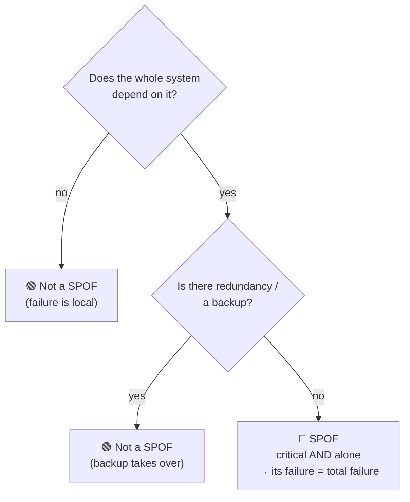
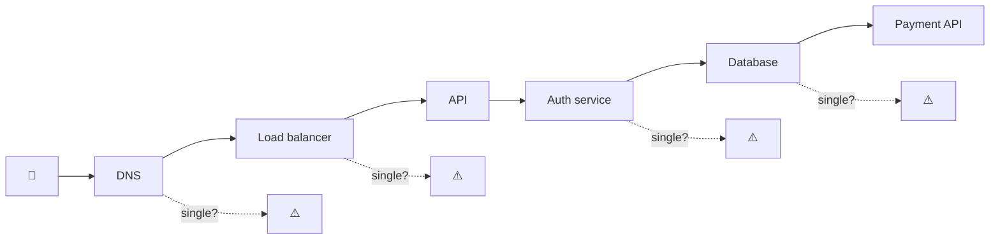
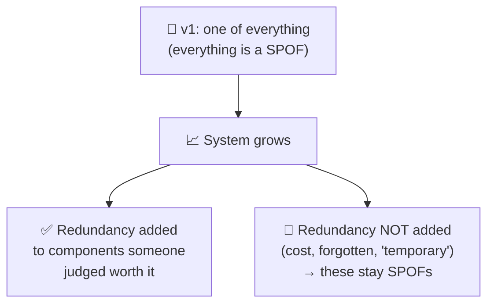
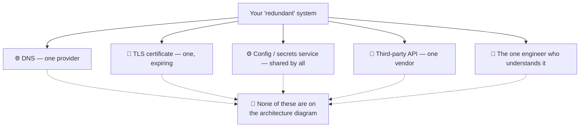
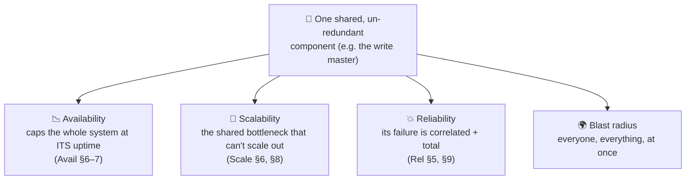
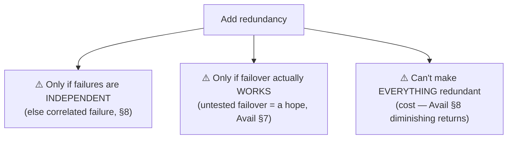
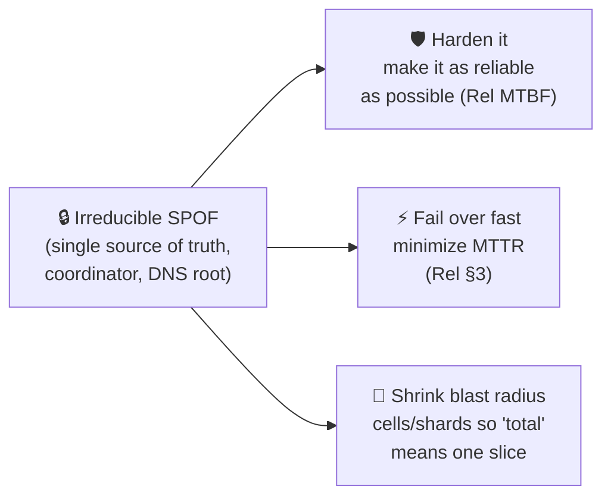
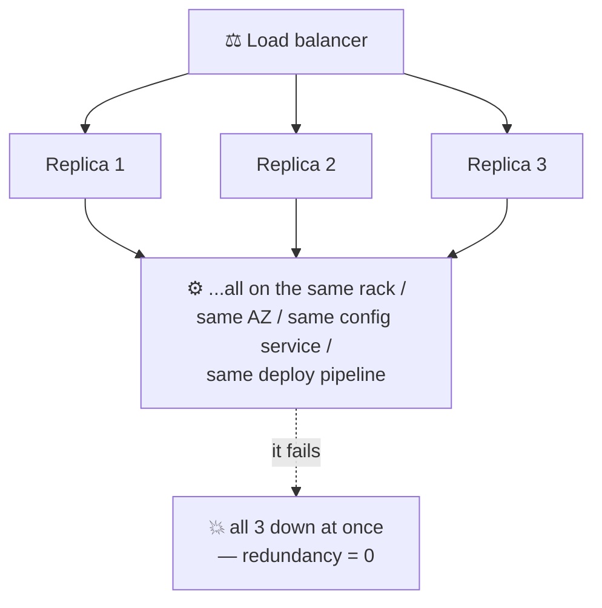
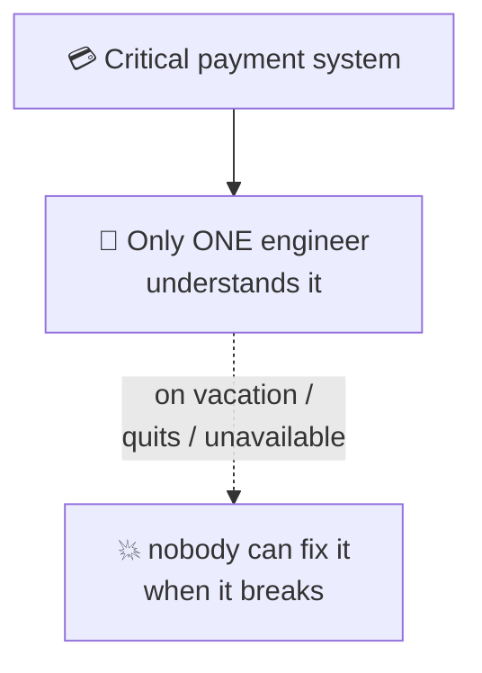
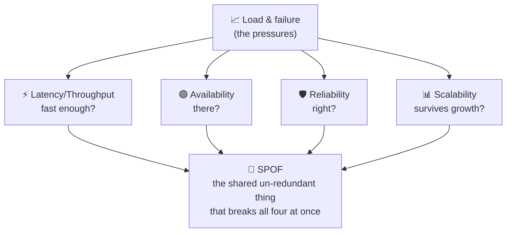

# Single Point of Failure (SPOF)

> **Phase:** Core System Properties → **Topic:** 5 of 5 → **Read time:** ~50 minutes

---

## Before You Begin

This is the **last** of the five core properties — and it's less a new idea than the place where the other four converge. You've spent four documents building yardsticks: **latency/throughput** (is it fast?), **availability** (is it there?), **reliability** (is it right?), **scalability** (does it survive growth?). This document is about the single structural flaw that can quietly violate *all four at once*:

> **Which single component, if it failed right now, would take the *whole system* down with it?**

That component is a **Single Point of Failure** — a SPOF — and hunting them is one of the most valuable habits a systems engineer can build. It's the capstone the whole phase has been pointing toward. You've already met SPOFs in every prior document, by other names:

- The **single load balancer** in front of a beautifully redundant server fleet (Availability §7) — one box whose death caps the entire system's availability.
- The **shared config service** that all your "independent" replicas secretly depend on (Reliability §5) — where correlated failure is born.
- The **write master** / single source of truth that both bottlenecks your scaling *and* has no backup (Scalability §6, §8).

Each time, the same shape recurred: *one thing everything depends on, with no redundancy.* This document makes that shape the entire subject — how to define it, find it, reason about it, and decide what to do about each one.

One scoping note, consistent with the Scalability doc. This is the **concept** — what a SPOF is and how to think about it. The *techniques* for removing them (redundancy mechanics, failover, load balancing, multi-region, leader election, consensus) get their deep treatment in the Availability material and the later distributed-systems and scaling phases. Here they appear only as *named pointers*. We're learning to **see** SPOFs; the toolbox for removing them comes later.

Here's the trap this document disarms. Beginners reason about failure one component at a time — "what if the cache fails? what if a server dies?" — and design local handling for each. But they miss the *structural* question: is there a component whose failure isn't local at all, but *total*? SPOFs are invisible on a good day and catastrophic on a bad one, and the worst ones aren't even drawn on the architecture diagram. You don't feel a SPOF until it fails — and then you feel nothing else, because everything is down.

> **The mindset shift:** stop asking *"what if this component fails?"* — start asking *"what single thing, if it failed **right now**, takes **everything** down — and do I even know where it is?"* A SPOF isn't a weak component. It's a component with **no backup that everything depends on** — and finding it is worth more than optimizing ten things that aren't it.

---

## Table of Contents

1. [What a SPOF Actually Is](#1-what-a-spof-actually-is)
2. [How to Find SPOFs](#2-how-to-find-spofs)
3. [Why SPOFs Exist — The Anatomy](#3-why-spofs-exist--the-anatomy)
4. [Obvious vs Hidden SPOFs](#4-obvious-vs-hidden-spofs)
5. [SPOF — The Collision Point of All Five Properties](#5-spof--the-collision-point-of-all-five-properties)
6. [Eliminating SPOFs — Redundancy and Its Limits](#6-eliminating-spofs--redundancy-and-its-limits)
7. [The SPOF You Can't Remove](#7-the-spof-you-cant-remove)
8. [Correlated Failure — The Hidden SPOF Multiplier](#8-correlated-failure--the-hidden-spof-multiplier)
9. [Beyond Infrastructure — Organizational and Process SPOFs](#9-beyond-infrastructure--organizational-and-process-spofs)
10. [Putting It All Together — Brimble's SPOF Hunt](#10-putting-it-all-together--brimbles-spof-hunt)
11. [Final Recap and Phase Synthesis](#11-final-recap-and-phase-synthesis)

---

## 1. What a SPOF Actually Is

Start with the definition, then sharpen the part beginners miss.

> **A Single Point of Failure is a component whose failure causes the *entire system* to fail — because everything depends on it and it has no redundancy.**

Two conditions must *both* hold, and that conjunction is the whole idea:

1. **Everything (or something critical) depends on it** — it sits on the critical path; work cannot complete without it.
2. **It has no redundancy** — there's exactly one of it; if it dies, there's no backup to take over.

Miss either condition and it's not a SPOF. A component everything depends on but which is *redundant* (three load balancers) is fine — lose one, the others carry on. A component with *no* redundancy that nothing critical depends on (a single non-essential analytics box) is fine — lose it, the system shrugs. It's the **intersection** — critical *and* alone — that's lethal.

### Sharper Than "Weakest Link"

The old proverb says a chain is only as strong as its weakest link. A SPOF is sharper and more dangerous than that: it's a link **with no parallel link beside it.** The Availability doc's serial-vs-parallel math (§6) is the precise language — a SPOF is a component in *series* with the whole system (everything flows through it) and *not* in parallel with anything (no redundant copy). Its availability becomes a hard ceiling on the entire system's availability, exactly as that math predicted: total availability can't exceed the availability of any single series component.

### The Blast Radius Is Total

What makes a SPOF categorically worse than an ordinary failure is the **blast radius** (Reliability §6). Most failures are *partial* — one shard, one feature, one region degrades, and the system lives in the availability spectrum's middle (Availability §1). A SPOF failure is *not* partial. It's the whole system, all users, all at once:

| Ordinary component failure | SPOF failure |
|---|---|
| Partial — some users/features affected | **Total** — everyone, everything |
| System degrades (spectrum) | System **collapses** (binary) |
| Blast radius contained | Blast radius = the entire system |
| Buys time to recover | No time — you're fully down instantly |

> 💡 **Key Insight**
>
> A SPOF is defined by a *conjunction*: **critical dependency AND no redundancy.** That's what makes it different from a merely fragile component — its failure isn't a degradation, it's a total collapse, because there's nothing in parallel to catch it. The entire discipline of this document is training your eye to spot components sitting in that lethal intersection *before* they fail — because after they fail, they announce themselves very clearly.

### Quick Recap — What a SPOF Is

- A SPOF = a component that is **both** critical (everything depends on it) **and** un-redundant (no backup) — the lethal *intersection*.
- Sharper than "weakest link": it's a link **in series with everything and parallel to nothing** — its availability caps the whole system's (Avail §6).
- Its **blast radius is total** — not a partial degradation but a full, all-users-at-once collapse.
- Remove either condition (add redundancy, or remove the dependency) and it stops being a SPOF.

---

## 2. How to Find SPOFs

A SPOF you've found is a manageable engineering problem. A SPOF you *haven't* found is an outage waiting for its moment. So the central skill isn't fixing SPOFs — redundancy (§6) mostly handles that — it's **finding** them, especially the ones nobody drew on the diagram.

### The One Question

There is a single question that surfaces SPOFs, and it should become reflexive — asked in every design review, every architecture diagram, every incident retro:

> **"What single thing, if it failed right now, would take everything down?"**

Ask it of *every* component in the system, one at a time. For each, run the thought experiment: *imagine this dies this instant — what survives?* If the answer is "nothing" or "the critical path," you've found a SPOF. This is deliberately a *destructive* imagination — you're mentally killing each box and watching what falls with it.

### Method 1 — Trace One Request End to End

The most reliable way to surface SPOFs is to follow a single critical request through the whole system and list *everything* it touches — because everything on that path is, by definition, something the request depends on:

For each hop, ask the two SPOF conditions: *is it on the critical path?* (yes — the request touches it) and *is it redundant?* Every hop that's on the path **and** has only one instance is a SPOF. This "trace a request" method is powerful because it forces you past the components you *think* about (servers, database) to the ones you *forget* — DNS, the certificate, the auth service, the config everyone loads at startup.

### Method 2 — Walk the Dependency Graph

Zoom out from one request to the whole **dependency graph**: draw what depends on what. SPOFs are the **nodes with no redundancy that have many inbound edges** — the choke points everything funnels through. A component that fifty services depend on, with one instance, is the highest-value SPOF in the system: its failure is fifty failures.

> ⚠️ **The SPOF that gets you is the one you didn't know was a dependency.** Teams confidently list their "important" components and make those redundant — then get taken down by DNS, a shared certificate that expired, an internal config service, or a "temporary" script that quietly became load-bearing. The dangerous SPOFs aren't the ones you're watching; they're the *implicit* dependencies nobody remembers relying on. Finding them requires actively tracing dependencies, not listing the components you happen to think are important.

> 💡 **Key Insight**
>
> SPOF-hunting is a *practice*, not a one-time audit — because systems constantly grow new dependencies (a new shared service, a new third-party API, a new "temporary" fix). Make the one question — *"what single thing, if it failed now, takes everything down?"* — a standing part of design reviews and incident retros. The goal is to find each SPOF while it's a whiteboard discussion, not a 3 a.m. page. You cannot fix what you haven't found, and the finding is the hard part.

### Quick Recap — Finding SPOFs

- The reflexive question: **"what single thing, if it failed right now, takes everything down?"** — asked of every component.
- **Trace one request end-to-end** and list everything it touches — each single-instance hop on the path is a SPOF (surfaces DNS, certs, auth, config).
- **Walk the dependency graph** — SPOFs are un-redundant nodes with many inbound edges (choke points).
- The dangerous SPOFs are the **implicit dependencies** you forgot you had — finding is harder (and more valuable) than fixing.

---

## 3. Why SPOFs Exist — The Anatomy

If SPOFs are so dangerous, why does every system have them? Because they are not *added* — they are what you get by *default*. SPOFs are the natural resting state of a system; redundancy is the thing you have to work (and pay) to add. Understanding *why* they appear is what lets you anticipate them instead of discovering them.

### They Are the Default, Not the Exception

Every system starts as a SPOF. Version one is one server, one database, one of everything — because that's the simplest thing that works, and simplicity is the right call early (the Scalability doc's "scale up first" wisdom). Redundancy is *added later*, deliberately, to the components someone decided were worth it. Which means:

> Every component is a SPOF **until someone spends effort and money to make it redundant.** SPOFs aren't bugs that crept in — they're the absence of work that was never done.

This reframing matters: you don't hunt SPOFs by looking for mistakes, but by looking for *where redundancy hasn't been added yet* — which is everywhere you haven't explicitly looked.

### The Forces That Create Them

Four recurring pressures manufacture SPOFs, and naming them helps you predict where they'll be:

| Force | How it creates a SPOF |
|---|---|
| **Cost** | Redundancy means running (and paying for) N copies of things — the cheap choice is one |
| **Simplicity** | One of something is easier to reason about, deploy, and operate than a coordinated cluster |
| **Convenience / "temporary"** | A quick single-instance solution ships to meet a deadline — and "temporary" becomes permanent and load-bearing |
| **Implicit growth** | New features quietly add a shared dependency (one config service, one queue, one auth) that everything gradually comes to rely on |

The most insidious is the last two. The "temporary" single-instance script that becomes critical, and the shared service that *accretes* dependents until it silently sits under everything — these create SPOFs that nobody consciously *decided* to have. They formed by drift.

> ⚠️ **Systems drift *toward* SPOFs over time unless actively resisted.** Entropy is on the SPOF's side: every new shared component, every deadline-driven shortcut, every "we'll make it redundant later" adds risk that compounds silently. Without a standing practice of hunting them (§2), a system accumulates hidden SPOFs the way it accumulates technical debt — invisibly, until one fails. The absence of a recent SPOF audit is itself a warning sign.

### Quick Recap — Why SPOFs Exist

- SPOFs are the **default state** — every component is one until redundancy is deliberately added; they're *missing work*, not *added bugs*.
- Four forces create them: **cost**, **simplicity**, **"temporary" convenience**, and **implicit growth** of shared dependencies.
- The worst form by **drift** — "temporary" single instances that become load-bearing, shared services that accrete dependents.
- Systems trend *toward* SPOFs over time unless a standing hunt (§2) actively resists the drift.

---

## 4. Obvious vs Hidden SPOFs

Not all SPOFs are equally hard to see, and the distinction is where most real outages live. The obvious ones get found and fixed early; the *hidden* ones are what actually take companies down — because you can't add redundancy to a dependency you don't know you have.

### The Obvious Ones

These are visible on the architecture diagram, and any competent review catches them:

- The **single database** every request reads and writes.
- The **single load balancer** in front of the fleet.
- The **single application server** (in a tiny deployment).

They're "obvious" because they're *drawn*, they're *known* dependencies, and the fix is well-understood (add redundancy — §6). Mature systems have usually handled these. They're real, but they're not where the danger concentrates.

### The Hidden Ones — Where Outages Actually Come From

The dangerous SPOFs share one trait: **they're dependencies you didn't consciously realize you had.** They rarely appear on the architecture diagram because nobody thinks of them as "components":

| Hidden SPOF | Why it's missed | How it bites |
|---|---|---|
| **DNS** | "It just works" — not thought of as a component | DNS fails → nobody can *find* you, however healthy your servers |
| **TLS certificate** | A config detail, not a "system" | Cert expires → every connection rejected, globally, at once |
| **Shared config/secrets service** | Infrastructure, not application | It dies → every service can't start or reload — the correlated-failure engine (§8) |
| **Third-party API** | "That's their problem" | Their outage is your outage if you have one provider and no fallback |
| **The human SPOF** | Not a machine at all | One person is the only one who understands a critical system (§9) |

The **certificate** example is a perennial, almost ritual outage: everything is redundant, healthy, scaled — and the whole system goes dark because a single certificate nobody was tracking expired, and TLS rejects every connection simultaneously. There was no server failure, no bug — just one silent, shared, un-redundant dependency reaching its expiry. That is a SPOF in its purest form — and it has taken down some of the largest, most sophisticated operators in the world, from telecom networks that dropped millions of users for a day to widely-used platforms felled by a single lapsed cert. The lesson recurs precisely *because* the victims were otherwise excellent at redundancy; the cert simply wasn't thought of as a component.

> 💡 **Key Insight**
>
> The SPOFs that cause the worst outages are almost never the ones on the diagram — they're the **implicit, shared, "not really a component" dependencies**: DNS, certificates, config services, a single vendor, a single person. This is why §2's advice was to *trace actual dependencies*, not list known components: the deadliest SPOF is precisely the one you'd never write down, because you never think of it as something that could fail. Hunt the invisible, not the obvious.

### Quick Recap — Obvious vs Hidden

- **Obvious SPOFs** (single DB/LB/server) are drawn, known, and usually already fixed in mature systems.
- **Hidden SPOFs** — DNS, TLS certs, shared config/secrets, single vendors, single humans — cause the worst outages because they're *unrecognized* dependencies.
- The expiring **certificate** outage is the archetype: total failure, no bug, one silent shared dependency.
- Find them by tracing *real* dependencies (§2), not by listing components you already consider important.

---

## 5. SPOF — The Collision Point of All Five Properties

This is the capstone section — the reason SPOF is the *last* core property rather than just another item on a list. A Single Point of Failure isn't a separate concern from the other four properties; it's the place where **all of them fail at the same time, for the same reason.** Understanding this is understanding why the five properties form one connected picture rather than five isolated checkboxes.

### One Component, Four Violations

Take a single un-redundant component that everything depends on, and watch it violate every yardstick you've learned:

- **It caps availability.** The Availability doc's series math (§6) proved a system can't be more available than any single component every request depends on. A SPOF *is* that component — its nines become the system's ceiling, no matter how redundant everything around it is. The single load balancer (Avail §7) was this exactly.
- **It caps scalability.** The Scalability doc showed the shared, stateful component — the write master, the one source of truth (§6, §8) — is both the scaling wall *and*, usually, un-redundant. The thing you can't scale out is very often the same thing that has no backup. Scaling ceilings and SPOFs are frequently the *same component*.
- **It wrecks reliability.** A SPOF failure is the opposite of graceful — no partial degradation, no spectrum (Rel/Avail), just total collapse. And SPOFs are where **correlated failure** (Rel §5, §9) concentrates: the shared thing everything depends on is the thing whose failure is everything's failure.
- **Its blast radius is the whole system.** Every other failure mode can be *contained* (bulkheads, cells, isolation — Rel §6). A SPOF, by definition, cannot — containment requires an alternative, and a SPOF is the absence of an alternative.

### Why It's the Capstone

The other four properties are, in a sense, all *about avoiding SPOFs* — or about what happens when you can't:

> A SPOF is the single structural flaw that makes a system simultaneously **un-available, un-scalable, and un-reliable**, with **total blast radius**. Conversely, *eliminating* SPOFs — adding redundancy so no single failure is total — is one action that improves availability, scalability, *and* reliability at once. It's the highest-leverage structural move in system design, which is why it's the property the whole phase converges on.

This is the unifying lesson of Phase 02: **the five properties are not independent.** They share a common enemy (single points of failure), a common cure (redundancy, isolation, no shared un-redundant dependencies), and a common root question (*what happens when a part fails?*). Latency has its utilization cliff, availability its nines, reliability its fault chains, scalability its shared-state wall — and underneath all of them sits the same structural question SPOF makes explicit.

> 💡 **Key Insight**
>
> SPOF is where the five core properties stop being a checklist and become a *system*. One un-redundant critical component caps availability, caps scalability, destroys reliability, and guarantees total blast radius — four violations from one flaw. That's why SPOF-elimination is the highest-leverage structural work there is: a single redundancy investment pays out across every property at once. See the SPOF, and you see all five yardsticks in one place.

### Quick Recap — The Collision Point

- A SPOF violates **four properties from one flaw**: caps availability (series math), caps scalability (shared bottleneck), wrecks reliability (correlated + total), and guarantees **total blast radius**.
- The scaling ceiling and the SPOF are frequently the **same shared, un-redundant component**.
- Eliminating a SPOF improves availability, scalability, *and* reliability **simultaneously** — the highest-leverage structural move.
- Phase 02's unifying lesson: the five properties share a common enemy (SPOFs), cure (redundancy/isolation), and root question (*what happens when a part fails?*).

---

## 6. Eliminating SPOFs — Redundancy and Its Limits

Finding SPOFs is the hard part (§2); the *fix* is conceptually simple and you already know it. This section names it and — more importantly — its limits, because "just add redundancy" is a half-truth that lulls teams into false confidence. (Consistent with the phase charter, the *mechanics* of redundancy live in the Availability material and later phases; here's the reasoning.)

### The Cure: Remove One of the Two Conditions

A SPOF needs *both* conditions (§1): critical dependency **and** no redundancy. Break either one:

| Approach | What it does | Example |
|---|---|---|
| **Add redundancy** | Kill condition 2 — give it a backup so failure isn't total | Multiple load balancers, DB replicas, multi-AZ |
| **Remove the dependency** | Kill condition 1 — make the system not *need* it on the critical path | Push non-essential work off the request path (async); cache so a dependency's outage degrades instead of kills |

The first is the usual move (redundancy = the Availability doc's parallel math, §6: copies in parallel multiply failure probability *away*). The second is subtler and often better: the best way to survive a component's failure is sometimes to *not depend on it* for the critical path in the first place (graceful degradation, Rel §7 — if the recommendations service is a SPOF, make the page work *without* it).

### Why "Just Add Redundancy" Is a Half-Truth

Redundancy is necessary but comes with three caveats you already learned — and forgetting them is how teams get outages *despite* redundancy:

- **Independence.** Two copies that fail together aren't redundancy — they're one SPOF wearing two faces. This is important enough to get its own section (§8).
- **Failover must work.** Redundancy that doesn't fail *over* — a replica that's never been promoted, a standby never tested — is decorative. Untested failover is a hope (Avail §7), and hopes fail at 3 a.m.
- **You can't afford infinite redundancy.** Every redundant copy costs money and complexity (Avail §8's exponential cost-of-nines). You make the *critical* things redundant and consciously accept SPOF risk on the rest — which means SPOF elimination is a *prioritization* exercise, not a "fix them all" one.

> 💡 **Key Insight**
>
> The fix for a SPOF is to break one of its two conditions — add redundancy (a backup) *or* remove the dependency (don't need it on the critical path). But "add redundancy" only counts if the copies fail **independently** and the **failover is tested** — otherwise you've spent money to keep a SPOF. And since you can't afford to make everything redundant, SPOF work is really about *ranking*: which single failures would be total, and which of those can you afford to leave standing?

### Quick Recap — Eliminating SPOFs

- Break either SPOF condition: **add redundancy** (a backup) or **remove the dependency** (don't need it on the critical path).
- Redundancy only works with **independent failures** (§8) and **tested failover** (Avail §7) — otherwise it's decorative.
- You **can't afford infinite redundancy** (Avail §8) — SPOF elimination is *prioritization*: harden the total-failure risks you can't accept.
- Sometimes the better fix is *not depending* on the component (async, caching, graceful degradation — Rel §7).

---

## 7. The SPOF You Can't Remove

Sometimes you trace the dependencies, find the SPOF, reach for redundancy — and discover you *can't* eliminate it. Some single points are irreducible: the system genuinely needs *one* of something. Mature engineering isn't "zero SPOFs" (often impossible); it's *knowing* your remaining SPOFs and managing them deliberately. This is the realistic senior stance the topic builds toward.

### Why Some SPOFs Are Irreducible

A few things resist redundancy by their very nature — usually because *correctness requires a single authority*:

- **A single source of truth.** Consistency (the topic waiting in the distributed-systems phases) often *requires* one authoritative owner of a piece of data. The moment you have two writable copies, they can disagree — so for strongly-consistent data, "one owner" is not an oversight, it's a *requirement*. (You can replicate for failover, but the *authority* is singular at any instant.)
- **A single coordinator.** Some jobs need exactly one thing in charge — one leader, one lock holder, one sequencer. Redundancy here means *electing a replacement* (leader election — later phases), not running two at once, because two coordinators is a contradiction.
- **DNS, and the root of any lookup chain.** Something has to be the entry point clients resolve first; that root is hard to fully de-SPOF (you mitigate with multiple providers, but the *concept* of "where do I start" is singular).

### When You Can't Eliminate, You *Manage*

If a SPOF can't be removed, you shrink the danger along three axes — the same tools from the Reliability doc, aimed at the irreducible core:

| Lever | What it does | From |
|---|---|---|
| **Harden** | Pour reliability effort into the one thing that can't have a backup — highest MTBF you can buy | Rel §3 |
| **Fast failover / recovery** | If it *does* fail, minimize how long (promote a replica in seconds, not hours) — attack MTTR | Rel §3, Avail §7 |
| **Shrink the blast radius** | Partition so the "single" point is single *per cell*, not for the whole system — a failure hits 1/N users | Rel §6 (cells/bulkheads) |

That last move is the clever one: if you can't avoid a single point, make it a single point for a *small slice* rather than for everything. Sharding/cells (a scaling technique) doubles as SPOF containment — the per-shard coordinator failing takes down one shard's users, not all of them. The blast radius shrinks from "total" to "partial," dragging the failure back into the survivable middle of the availability spectrum.

> ⚠️ **"Zero SPOFs" is usually neither achievable nor the goal — *knowing* your SPOFs is.** The failure isn't having an irreducible single point; it's having one you haven't identified, hardened, or planned recovery for. A documented, hardened, fast-failover SPOF with a contained blast radius is a managed risk. An unknown SPOF is an unscheduled outage. The senior deliverable is an honest list of "here are our remaining single points and here's what we do when each fails," not an impossible claim of having none.

> 💡 **Key Insight**
>
> Some SPOFs are irreducible because *correctness needs a single authority* (one source of truth, one coordinator). For these, the goal shifts from **eliminate** to **manage**: harden it (raise MTBF), fail over fast (cut MTTR), and shrink its blast radius (cells, so "total" means one slice). Maturity is a *known and managed* SPOF list — not the fantasy of zero.

### Quick Recap — The SPOF You Can't Remove

- Some SPOFs are **irreducible** — a single source of truth, a single coordinator, the DNS root — because correctness needs one authority.
- When you can't eliminate, **manage**: **harden** (MTBF), **fail over fast** (MTTR), and **shrink the blast radius** (cells/shards).
- Sharding doubles as containment: make the single point single *per slice*, so failure is partial not total.
- The goal is a **known, managed** SPOF list — not "zero SPOFs" (usually impossible); an *unknown* SPOF is the real danger.

---

## 8. Correlated Failure — The Hidden SPOF Multiplier

This is the most dangerous SPOF of all, because it *looks* like it isn't one. You added redundancy — three replicas, multiple servers, "no single point of failure" on the diagram — and yet a single event takes them all down together. The redundancy was an illusion, and the thing that made it an illusion is a **hidden shared dependency**. You met this as correlated failure in the Availability (§9) and Reliability (§5) docs; here it earns its place as the SPOF class that fools the most people.

### "Redundant" Copies That Share a Secret

Redundancy only multiplies away failure *if the copies fail independently* (§6). When they secretly share something, that shared thing is the real SPOF — and your N copies are one component wearing N faces:

The usual hidden dependencies that turn "redundant" into "SPOF in disguise":

| Shared thing | Why the redundancy is fake |
|---|---|
| **Same rack / power / switch** | One power or network failure takes all copies |
| **Same availability zone or region** | A zone/region outage drops every "redundant" copy together |
| **Same config / secrets service** | It dies → all copies can't start or reload simultaneously |
| **Same deploy pipeline** | One bad deploy or poisoned config rolls out to *all* copies at once |
| **Same dependency downstream** | All copies call the same database/auth/API — that's the real SPOF |

### The Deploy SPOF — Redundancy's Blind Spot

Reread the Reliability doc's lesson (§5): most outages come from *changes*, not hardware. Correlated failure is why. Your three replicas are perfect protection against *one server dying* — and zero protection against a *bad deploy*, because the deploy hits all three identically and simultaneously. The deploy pipeline is a SPOF that no amount of *runtime* redundancy addresses; the mitigation is a different axis entirely — progressive/canary rollout (deploy to one copy first, watch, then proceed), which is really "don't let the change be a single simultaneous event."

> ⚠️ **Redundancy on paper is not redundancy in reality until failures are independent.** Three replicas in one availability zone are *one* SPOF (the zone). Three services sharing one config system are *one* SPOF (the config). The industry's largest outages are overwhelmingly this pattern — a shared control plane, a single region's core networking, one config push — where thousands of "redundant" systems discover at the same instant that they shared a floor. Achieving genuine *independence* (spreading across racks, zones, regions, providers, and rollout stages) is most of the real work of removing SPOFs — and it's invisible on a diagram that just shows "3 replicas."

> 💡 **Key Insight**
>
> The deadliest SPOF is the **hidden shared dependency** beneath "redundant" components — because it passes every casual review ("we have three replicas!") and fails catastrophically. When you see redundancy, don't check the *count* of copies; check what they **share**: rack, zone, region, config, pipeline, downstream dependency. Redundancy is only real to the degree the copies can fail *independently* — and independence, not multiplicity, is what actually removes the SPOF.

### Quick Recap — Correlated Failure

- Redundancy removes a SPOF **only if copies fail independently**; a hidden shared dependency makes N copies *one* SPOF wearing N faces.
- Common culprits: same **rack/power**, **AZ/region**, **config/secrets service**, **deploy pipeline**, or shared **downstream dependency**.
- The **deploy pipeline** is a SPOF runtime redundancy can't fix — canary/progressive rollout is the different-axis mitigation.
- Don't count copies — check what they **share**; genuine **independence** (spread across racks/zones/regions/providers) is the real work.

---

## 9. Beyond Infrastructure — Organizational and Process SPOFs

The final expansion, and one beginners almost always miss: **a SPOF doesn't have to be a machine.** The same structural pattern — one thing everything depends on, with no backup — applies to *people, processes, and knowledge*. And these are frequently the most severe SPOFs in a whole organization, precisely because nobody thinks to draw them on an architecture diagram at all.

### The Human SPOF

The classic: **one person is the only one who understands a critical system.** Only Dana knows how the payment reconciliation works; only Sam can deploy to production; only one engineer understands the legacy order pipeline. That person is a SPOF as real as any single database — and the failure modes are human: they go on vacation, get sick, leave the company, or are simply asleep during an incident.

This is often called the **bus factor** (bluntly: how many people would have to be hit by a bus before the project is in serious trouble). A bus factor of one is a human SPOF. The fix mirrors the infrastructure fix exactly — *add redundancy*, but of **knowledge**: documentation, pairing, runbooks (Rel §9), shared ownership, deliberately spreading understanding so no single person is irreplaceable.

### Process and Credential SPOFs

Beyond people, the same pattern hides in processes and access:

| Organizational SPOF | The single point | Failure mode |
|---|---|---|
| **The one deploy pipeline** | All releases flow through it | It breaks → nobody can ship (or worse, ship a fix during an incident) |
| **The lone build server** | Everything builds in one place | It dies → no new artifacts |
| **A single credential / signing key** | One secret unlocks a critical system | Lost → locked out; leaked → compromised |
| **One vendor / one account** | Whole business on a single provider or account | Account suspended or vendor down → total outage |
| **Bus factor = 1** | One person's knowledge | Unavailable → unrecoverable |

The connection to the Reliability doc (§9) is direct: reliability is largely *operational*, not just architectural — and so is SPOF elimination. A perfectly redundant infrastructure operated by a single irreplaceable human, deployed through a single fragile pipeline, is *not* a system without single points of failure. It just moved them off the diagram.

> 💡 **Key Insight**
>
> SPOFs aren't only boxes on a diagram — they're anywhere the pattern *"one thing everything depends on, with no backup"* appears, including **people (bus factor), pipelines, credentials, and vendors.** These are often the most severe and least-noticed SPOFs, because SPOF-hunting instinctively looks at infrastructure. The same cure applies: add redundancy — of knowledge (docs, shared ownership), of process (multiple deploy paths), of access (key rotation, backups), of vendors. Ask the SPOF question about your *team and processes*, not just your servers.

### Quick Recap — Organizational SPOFs

- A SPOF needn't be a machine — the pattern (one critical thing, no backup) applies to **people, processes, knowledge, credentials, vendors**.
- The **human SPOF / bus factor of 1**: one person is the only one who understands a critical system — fix with *knowledge* redundancy (docs, pairing, shared ownership).
- **Process/credential SPOFs**: the lone deploy pipeline, single build server, single signing key, single vendor/account.
- SPOF elimination is **operational too** (Rel §9) — ask the SPOF question about your team and processes, not just your servers.

---

## 10. Putting It All Together — Brimble's SPOF Hunt

One last visit to **Brimble** — and this time the story closes the whole phase. Brimble is now big and successful: fast (Latency doc), with availability SLOs (Availability doc), correct under retries (Reliability doc), and scaled 100× (Scalability doc). After a competitor suffers a humiliating day-long outage from an expired certificate, Brimble's team runs a formal **SPOF audit** before it happens to them. Watch every section of this document become a checklist item.

### Step 1 — Trace a Request, List Every Dependency (§2)

They take the checkout request and trace it end to end (§2's method), writing down *everything* it touches — not the components they think about, but every actual dependency:

### Step 2 — Sort Into Obvious, Hidden, and Human (§3, §4, §9)

They classify each dependency by whether it's redundant and how visible it was:

| Dependency | SPOF? | Type |
|---|---|---|
| Load balancer | ✅ Already fixed (redundant, Avail doc) | Obvious — handled |
| Payment provider | ✅ Already fixed (second provider, Avail doc) | Obvious — handled |
| **Config/secrets service** | 🔴 One instance, every service reads it at startup | **Hidden** (§4) — correlated-failure engine (§8) |
| **DNS** | 🔴 Single provider | **Hidden** (§4) |
| **TLS certificate** | 🔴 One cert, manual renewal, no expiry alert | **Hidden** (§4) — the competitor's exact killer |
| **Single region** | 🔴 Everything in one cloud region | **Hidden/correlated** (§8) |
| **Payment knowledge** | 🔴 Only one engineer understands the payment integration | **Human** (§9) — bus factor 1 |

The audit's value is instantly clear: the *obvious* SPOFs were already handled by the prior docs' work. Every *remaining* SPOF is a **hidden or human** one (§4, §9) — exactly as the theory predicted. The dangerous ones were never on the architecture diagram.

### Step 3 — Decide Per SPOF: Eliminate, Harden, or Accept (§6, §7)

Rather than "fix everything" (impossible — §6's cost limit), they triage each against the *cost of its failure* (Avail §8 economics):

- **Config service → eliminate** (§6): make it redundant *and* have services cache last-known-good config so a config outage degrades instead of kills. Correlated failure (§8) defused.
- **DNS → eliminate** (§6): add a second DNS provider. Cheap, high-value.
- **TLS certificate → eliminate the *process* SPOF** (§9): automate renewal and add expiry alerting. The competitor's outage can't happen here now.
- **Single region → manage, not yet eliminate** (§7): full multi-region is expensive (Avail §8). They *harden* (fast intra-region failover) and *shrink blast radius* (put the groundwork for cells), documenting it as a *known, accepted* SPOF with a plan — not an unknown one.
- **Payment knowledge → add knowledge redundancy** (§9): document the integration, pair a second engineer onto it, write the runbook. Bus factor goes from 1 to 3.

### Step 4 — Make It a Practice, Not an Event (§2, §3)

The final and most important decision: the SPOF audit becomes a **standing part of design review** (§2), and the region SPOF goes on a roadmap with a trigger ("multi-region when we cross X revenue"). They've internalized that systems *drift toward SPOFs* (§3) — so the hunt is now continuous, not a one-off.

### The Payoff — and the Whole Phase, Closed

Six months later a cloud provider has a regional networking incident — the kind that takes down thousands of "redundant" companies via correlated failure (§8). Brimble degrades (its config caching and fast failover hold the core path) but doesn't collapse, its team calmly follows the documented region-failure plan (not one panicked person — §9), and no certificate silently expires. Brimble is now fast, available, reliable, scalable, **and** has no unmanaged single point of failure. **The five yardsticks are all green — and this last one is what tied them together.**

---

## 11. Final Recap and Phase Synthesis

| Concept | Core Insight | Biggest Tradeoff |
|---|---|---|
| **What a SPOF is** | Critical dependency **AND** no redundancy — the lethal intersection | Its blast radius is *total*, not partial |
| **Finding SPOFs** | Trace one request / walk the dependency graph; ask "what single thing takes everything down?" | The dangerous ones are the dependencies you forgot you had |
| **Why they exist** | The default state — every component is a SPOF until redundancy is *added* | Systems drift toward SPOFs unless actively hunted |
| **Obvious vs hidden** | The worst SPOFs (DNS, certs, config, humans) aren't on the diagram | You can't add redundancy to a dependency you don't know about |
| **Collision point** | One SPOF violates availability, scalability, *and* reliability at once | ...so eliminating it improves all three — highest leverage |
| **Eliminating** | Add redundancy *or* remove the dependency | Only real if failures are independent + failover tested |
| **Irreducible SPOFs** | Some single points can't be removed (source of truth, coordinator) | Then *manage*: harden, fail over fast, shrink blast radius |
| **Correlated failure** | "Redundant" copies sharing a hidden dependency are one SPOF | Independence, not copy-count, is what removes the SPOF |
| **Organizational SPOFs** | People (bus factor), pipelines, keys, vendors are SPOFs too | The cure is knowledge/process redundancy, not just servers |

### The One Thing to Remember

> **A Single Point of Failure is one thing everything depends on with no backup — and its failure isn't a degradation, it's a total collapse. Finding them is harder and more valuable than fixing them, because the deadly ones (DNS, certificates, shared config, the one engineer who knows) are never on the diagram. You can't eliminate every SPOF, so maturity isn't "zero SPOFs" — it's a *known, hardened, managed* list, hunted continuously, because systems drift toward single points unless you resist.**

### Phase 02 Synthesis — The Five Properties Are One Picture

You've now completed all five core properties, and SPOF reveals why they were always one connected idea rather than five checkboxes:

| Property | The question | Its failure mode |
|---|---|---|
| **Latency / Throughput** | Fast enough, and how much? | Slow, or capacity-capped |
| **Availability** | Is it there? | Down (measured in nines) |
| **Reliability** | Is it right, over time, under failure? | Wrong answers, silently |
| **Scalability** | Does it survive growth? | Cost explodes, hits a wall |
| **SPOF** | What single thing breaks *everything*? | Total collapse |

They share one root question — **what happens when a part fails or load grows?** — and one family of answers: **no shared un-redundant dependencies, contain the blast radius, and know your tradeoffs.** Latency's utilization cliff, availability's redundancy math, reliability's fault chains, scalability's shared-state wall, and SPOF's single points are five views of the same underlying truth: *systems are defined by how they behave at their limits and under failure.* That is the vocabulary the rest of the curriculum is spoken in.

> 💡 **The One Thing to Remember (whole phase):** these five properties are the **yardsticks every future design is measured against.** From here on, every technology, pattern, and architecture you study is really an *answer* to one or more of them — a way to be faster, more available, more reliable, more scalable, or to remove a single point of failure. You now have the questions. The rest of the curriculum is the answers.

---

## What's Next

> **Phase 03 — Networking Deep Dives**

Phase 02 gave you the **properties** — the yardsticks. But every one of them, traced to its root, ran into the same physical substrate: the **network.** Latency was dominated by round trips; availability by whether packets reach you; SPOFs hid in DNS and load balancers; distributed reliability lived and died on partial network failure.

Phase 01's Group 1 gave you networking *intuition*. Phase 03 goes *deep*: DNS, TCP/UDP, TLS, HTTP's evolution, load balancers and proxies — the wire-level machinery underneath every property you just learned. You'll stop treating the network as a magic arrow between boxes and start understanding what actually happens on it — because you can't reason about latency, availability, or SPOFs without understanding the medium they all depend on.

The yardsticks are built. Now we go beneath them, to the wire.

---
