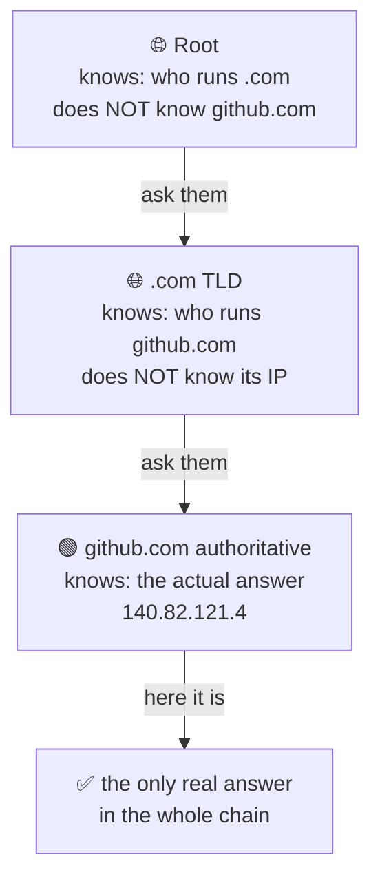
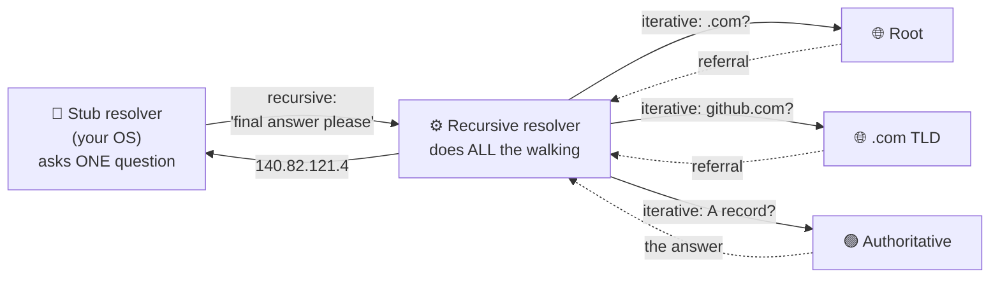
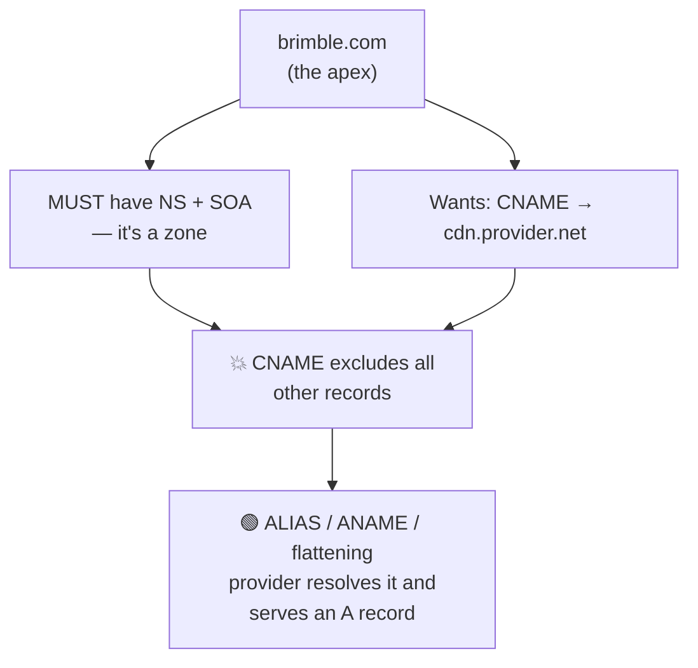

# DNS — The Domain Name System

> **Phase:** Networking Deep Dives → **Topic:** 1 of 7 → **Read time:** ~50 minutes

---

## Before You Begin

This is the **first** deep-dive of Phase 03, and it starts where Foundations §3 stopped. You already know the shape: DNS turns `github.com` into `140.82.121.4`, it's a cached hierarchy (resolver → root → TLD → authoritative), most lookups return in single-digit milliseconds, and every answer carries a **TTL**. None of that gets re-taught here. This document assumes it and goes underneath it, to answer one question:

> **What is DNS actually — as a *system* — and why does the thing in front of every request you will ever make behave so unlike the lookup you think it is?**

Because DNS is not a lookup. It's a **globally distributed, hierarchically delegated, aggressively cached, eventually consistent database** that happens to answer questions about names. Every one of those five words is a source of surprise, and every surprise shows up in production as an outage, a slow failover, or a migration that "should have been instant" and wasn't.

You've already met the consequences of that, scattered across four earlier documents, without meeting the cause:

- The Scaling doc pointed at **DNS-level balancing** in front of your load balancers (Scaling §5) and promised the mechanism would come later. It comes here (§6).
- The SPOF doc listed **DNS** as the archetypal *hidden* SPOF — "it just works," until nobody can find you however healthy your servers are (SPOF §4) — and called the resolution root **irreducible** (SPOF §7). Both are settled here (§8).
- The Distributed Systems doc used **DNS as its worked example of an AP system** — the canonical case of "up ≫ perfectly correct." That's not a curiosity; it's the reason half this document exists (§1, §7).
- Foundations §3 warned that **"just update DNS" is never instant**. §7 explains why the word everyone uses for it — *propagation* — describes something that does not happen.

One scoping note. This is DNS the *system*: how it resolves, caches, steers, and fails. The neighbors get their own documents and appear here only as **named pointers**: load balancer mechanics and algorithms are §05–§06 of this phase, TLS and certificates are §02, CDN and edge strategy are Phase 06, and internal service discovery — "DNS for your own services," promised by Architecture Patterns — is Phase 09.

Here's the trap this document disarms. DNS is the one piece of infrastructure engineers believe they already understand, because they've *used* it — they've edited a record, waited, and watched it work. That familiarity is the danger. It teaches you DNS as a control panel you type into, and hides the fact that you are writing to a database with **millions of independent replicas you do not own, cannot enumerate, and cannot invalidate**. You don't control DNS. You make suggestions to it, with an expiry date.

> **The mindset shift:** stop thinking of DNS as *a lookup that returns an address* — start thinking of it as *a globally replicated cache you can write to but never invalidate*. Every hard DNS problem — slow failover, migrations that drag for days, a provider outage that takes your healthy servers offline, traffic that ignores your steering — comes from that one sentence. You are not changing what a name means; you are **waiting for the world to forget what it used to mean.**

---

## Table of Contents

1. [What DNS Actually Is — Beyond the Phonebook](#1-what-dns-actually-is--beyond-the-phonebook)
2. [The Resolution Path](#2-the-resolution-path)
3. [Caching, TTL, and the Layers](#3-caching-ttl-and-the-layers)
4. [The Record Types That Matter](#4-the-record-types-that-matter)
5. [DNS as a Latency Cost](#5-dns-as-a-latency-cost)
6. [DNS as Traffic Control](#6-dns-as-traffic-control)
7. [Propagation Is a Myth](#7-propagation-is-a-myth)
8. [DNS as a SPOF](#8-dns-as-a-spof)
9. [How DNS Fails](#9-how-dns-fails)
10. [Putting It All Together — Brimble's DNS Migration](#10-putting-it-all-together--brimbles-dns-migration)
11. [Final Recap](#11-final-recap)

---

## 1. What DNS Actually Is — Beyond the Phonebook

Foundations §3 called DNS "the phone book of the internet." That analogy is a good on-ramp and a bad model, and the gap between them is this section.

A phone book is **one book**. It's complete — every listing is in it. It's **static** — printed once, identical for everyone holding a copy. And it's **consistent** — your copy and mine agree, because they're the same edition.

DNS is none of those things. Nothing about it is one book.

> **DNS is a globally distributed, hierarchically delegated, aggressively cached, eventually consistent database.**

Five words, five surprises. Take them one at a time, because the rest of this document is just their consequences.

### Nobody Has the Whole Database

This is the part the phonebook analogy actively conceals. There is no complete copy of DNS anywhere on Earth. No server holds "the mapping." The root nameservers — the top of the hierarchy, the thing everything starts at — **do not know** what `github.com` resolves to. They have never known. They cannot tell you.

What the root knows is one thing: *who to ask about `.com`*. And the `.com` TLD servers don't know `github.com`'s address either — they know *who to ask about `github.com`*. Only at the bottom, at GitHub's own **authoritative** nameservers, does an actual answer exist.

That's **delegation**, and it's the organizing principle of the entire system:

Each level knows only **one level down**, and knows it as a *referral*, not an answer. The database isn't distributed in the sense of "copied around." It's distributed in the sense of **nobody is in charge of more than their own slice** — which is exactly why DNS scales to every name on the internet without any organization needing to hold the whole thing, and exactly why *authority* is the concept that matters (§4's `NS` and `SOA` records are how delegation is written down).

### It Is Eventually Consistent — and That's the Whole Story

The Distributed Systems doc already told you this, and it's worth quoting the frame it used: DNS is its worked example of an **AP system** (Dist §4) — availability and partition tolerance, chosen over consistency. "Up ≫ perfectly correct."

Sit with what that means. When you change a DNS record, there is a window — often hours — where **the internet disagrees with itself** about what your name means. One user's resolver has the new answer. Another's has the old one. Both are behaving correctly. Neither is broken. There is no mechanism to reconcile them faster, because there is no mechanism to *reach* them at all.

This isn't a flaw in DNS. It's the trade DNS deliberately made, and it bought something enormous: DNS keeps answering during partitions, outages, and provider failures, because caches everywhere hold answers that are *probably still good*. Strong consistency would mean checking with authority on every lookup — which would make DNS slow (§5), fragile (§8), and dependent on the authoritative server being reachable by everyone, always.

DNS chose to be *always up and sometimes stale*. Every frustration in this document is the bill for that choice.

> 💡 **Key Insight**
>
> The phonebook analogy fails because a phonebook is complete, static, and consistent — and DNS is **partial** (nobody holds the whole database, only referrals), **dynamic** (answers change under you), and **eventually consistent** (the world disagrees for a while, on purpose). Every DNS problem you will ever debug lives in one of those three gaps. You're not querying a directory; you're asking millions of independent caches what they last heard, and hoping they heard it recently.

### Quick Recap — What DNS Actually Is

- DNS is a **distributed, delegated, cached, eventually consistent database** — not a lookup table and not a phone book.
- **Nobody holds the whole database.** The root doesn't know your IP; it knows who to ask. Each level stores *referrals*, and only the authoritative server at the bottom holds a real answer.
- It's the canonical **AP system** (Dist §4): always answering, sometimes stale — a deliberate trade, not a bug.
- That trade is the source of **every** hard DNS problem: slow failover, dragging migrations, and steering that clients ignore (§6, §7).

---

## 2. The Resolution Path

Foundations §3 drew the walk: browser → recursive resolver → root → TLD → authoritative. That picture is correct and incomplete in one important way — it doesn't say **who does the work**. That's this section, because it's where the labor is unevenly divided in a way that explains the caching layers (§3) and the latency (§5).

### Two Kinds of Query, and Almost Everyone Does the Lazy One

There are two ways to ask a DNS question, and the difference is *who chases the referrals*:

| | **Recursive query** | **Iterative query** |
|---|---|---|
| The ask | "Give me the final answer. I'll wait." | "Tell me what you know — a referral is fine." |
| Who chases referrals | The server you asked | **You** — the asker |
| Who does it | Your device → its resolver | The resolver → root, TLD, authoritative |
| Round trips for the asker | **One** | As many as the chain is deep |

Your laptop runs a **stub resolver** — a deliberately minimal client that knows how to do exactly one thing: ask a configured recursive resolver a *recursive* question and wait for a complete answer. It does not walk the hierarchy. It has no idea the hierarchy exists.

The **recursive resolver** (your ISP's, or a public one like `8.8.8.8`) is where the real work happens. It accepts the recursive question, then turns around and asks a series of **iterative** questions — root, then TLD, then authoritative — chasing each referral itself:

The asymmetry is the point. **One** query leaves your machine; **three or more** leave the resolver. This is why the resolver's cache is the most valuable cache in the system (§3) — it absorbs the entire walk on behalf of every client it serves, and there may be millions of them.

### The Chicken-and-Egg Problem, and Glue

Here's a puzzle the referral model creates. The `.com` servers answer "ask `ns1.github.com`" — a **name**. But to contact `ns1.github.com`, you need its IP. So you look up `ns1.github.com`… which is a `.com` domain… whose nameserver is `ns1.github.com`. You need the answer to get the answer.

DNS breaks the loop with **glue records**: when a TLD hands back a referral to a nameserver that lives *inside the zone being delegated*, it attaches that nameserver's IP address directly to the referral. Not because it's authoritative for it — it isn't — but because the resolution is otherwise impossible. Glue is the system admitting that pure delegation has a bootstrap problem and patching it with a hint.

### The Root Is Not Thirteen Machines

The hierarchy has exactly **13 root server addresses** — a number fixed by an old packet-size constraint — and this fact routinely misleads people into thinking the internet's naming layer rests on thirteen computers. It doesn't. Those 13 *addresses* are served by **hundreds of physical servers** across the globe using **anycast**: many machines announce the same IP, and the network routes you to the topologically nearest one.

This matters for §8. "The root" sounds like a catastrophic SPOF, and structurally it is a single logical entity — but anycast means the failure of any given root instance is invisible; traffic simply routes to another. It's the clearest example in this document of the SPOF doc's distinction (SPOF §1): critical, yes — but *not alone*, and therefore not a SPOF.

> 💡 **Key Insight**
>
> The labor is deliberately lopsided: your device asks **one** recursive question and waits; the resolver does **all** the iterative walking. That's why the resolver — not your browser, not the authoritative server — is the load-bearing cache of the entire system, and why a resolver outage (§9) feels like DNS itself is down. You never talk to the root. You have almost certainly never sent a packet to a root server in your life; your resolver did it for you, and probably not recently, because the answer was cached.

### Quick Recap — The Resolution Path

- **Recursive query** = "give me the final answer" (what your device asks). **Iterative query** = "a referral is fine" (what the resolver asks everyone else).
- Your **stub resolver** is deliberately dumb — one question, one wait. The **recursive resolver** does all the real walking and absorbs it for millions of clients.
- **Glue records** solve the bootstrap loop when a zone's nameserver lives inside the zone it serves.
- The **13 root addresses** are hundreds of machines behind **anycast** — critical, but not alone, and therefore not a SPOF (SPOF §1).

---

## 3. Caching, TTL, and the Layers

Foundations §3 said answers are cached "at every level — browser, OS, resolver." True, and far too gentle. That sentence describes the single most consequential fact about operating DNS, and it deserves to be stated as what it is:

> **When you publish a DNS record, you are writing to millions of caches you do not own, cannot list, cannot reach, and cannot invalidate. Your only control is a number attached to the answer — the TTL — which is a *request*, not a command.**

Everything in §6 and §7 falls out of that.

### The Stack Is Deeper Than You Think

A single lookup can be served — and *stopped* — at any of these:

| Layer | Lives in | Do you control it? | Notes |
|---|---|---|---|
| **Application** | Browser, JVM, runtime | ❌ | Browsers cache ~60s regardless of TTL; some JVMs historically cached **forever** |
| **OS** | `nscd`, `systemd-resolved`, Windows client | ❌ | Survives your app restarting |
| **Recursive resolver** | ISP / `8.8.8.8` | ❌ | The big one — serves millions, absorbs the whole walk (§2) |
| **Forwarders** | Corporate/campus middle boxes | ❌ | Where TTLs go to be reinterpreted |
| **Authoritative** | Your provider | ✅ | The *only* layer you actually control |

Read that column of ❌s again. **You control exactly one layer**, and it's the one furthest from the user — the one that only gets consulted when every cache above it has already given up. That's the operational reality of DNS, and it's why "I changed the record" and "users see the change" are separated by hours.

### TTL Is a Suggestion

Here's the part that surprises people who've only read the spec. **TTL is advisory.** Nothing forces a cache to honor it, and in practice plenty don't:

- Resolvers commonly **clamp** TTLs — enforcing a floor (ignoring your aggressive 30s, using 300s) to protect themselves from load, or a ceiling to avoid serving ancient data.
- Browsers cache on their **own** schedule, often ~60 seconds, largely independent of what you published.
- Some runtimes have historically cached DNS **for the life of the process** — the classic "our app kept hammering the dead IP for three days until we restarted it."

So the honest mental model is not "my TTL is 300s, therefore the world updates in 300 seconds." It's **"300 seconds is the *earliest* the world may start updating, and the long tail is somebody else's decision."** Plan for the tail, not the number.

### Negative Caching — The Failure That Sticks Around

One layer of this that bites hard and gets skipped everywhere: **failures are cached too.**

When a name doesn't exist, the authoritative server returns `NXDOMAIN` — and that "no" gets cached like any other answer. Its lifetime is governed not by the record's TTL (there is no record) but by a field in the zone's **`SOA` record** (§4).

The operational consequence is nasty and counterintuitive: **publish a name *after* someone has already looked it up, and they may keep getting "doesn't exist" long after it exists.** The classic version is a deploy where DNS is created a few seconds late — the health check fires early, gets `NXDOMAIN`, caches the "no," and the service stays invisible for the full negative-cache window even though the record is live. The record is fine. The *absence* is what's cached.

> ⚠️ **The layer you control is the layer that matters least.** You own the authoritative server, and it's the last thing anyone asks. Every layer above it — resolver, forwarder, OS, browser — is a cache belonging to someone else, honoring your TTL at their discretion. This is why DNS changes cannot be *pushed*, only *waited out*, and why the only real lever you have is one you must pull **before** you need it (§7).

### Quick Recap — Caching, TTL, and the Layers

- A lookup can be answered at **five layers**, and you control exactly **one** — the authoritative server, the last one anyone asks.
- **TTL is advisory, not binding** — resolvers clamp it, browsers ignore it, some runtimes cache forever. It's the *earliest* update time, not the actual one.
- **Negative answers are cached too** (`NXDOMAIN`, governed by the `SOA`), so a name can stay "nonexistent" after it exists.
- DNS changes are never *pushed* — they're **waited out**, which makes TTL a lever you must pull in advance (§7).

---

## 4. The Record Types That Matter

Foundations §3 gave you `A`, `AAAA`, and `CNAME` — enough to point a domain somewhere. This section covers the ones that carry the *system* behavior: who's authoritative, how delegation is written down, how negative caching is configured, and the one constraint that has shaped more real architectures than any other DNS detail.

### The Working Set

| Record | Answers | Why it matters here |
|---|---|---|
| `A` / `AAAA` | Name → IPv4 / IPv6 | The actual answer. Multiple `A` records = the crude load balancing of §6 |
| `CNAME` | Name → **another name** | Alias. Costs an extra resolution; constrained at the apex (below) |
| `NS` | Who is authoritative for this zone | **Delegation itself** (§1) — this is how the hierarchy is written down |
| `SOA` | Zone metadata: serial, primary, **negative-cache TTL** | Governs `NXDOMAIN` lifetime (§3); the serial drives replication |
| `MX` | Where mail goes | Has **priorities** — DNS's one native failover mechanism |
| `TXT` | Arbitrary strings | Domain-ownership proofs, SPF/DKIM — the "misc" slot, load-bearing in practice |

Two of these deserve more than a table row.

**`NS` is not a pointer — it *is* the delegation.** When §1 said each level knows only who to ask next, `NS` records are that knowledge, physically. And they exist in **two places at once**: at the parent (the `.com` TLD's referral) and in your own zone. When those disagree, resolution gets non-deterministic in ways that are genuinely miserable to debug — and this exact split is the mechanism that makes the dual-provider migration of §10 possible.

**`MX` quietly has what the rest of DNS lacks.** `MX` records carry a **priority**: try 10 first, fall back to 20. That's real, native, in-protocol failover — and it exists for mail and essentially nowhere else. `A` records have no such thing. This asymmetry is worth noticing, because it's the clearest evidence for §6's central claim: DNS was never designed as a failover mechanism, and the one place it *does* do failover properly is a special case built for email in the 1980s.

### The CNAME-at-Apex Problem

This is the DNS constraint most likely to shape your architecture, and it starts from a rule that sounds like trivia:

> **A `CNAME` cannot coexist with any other record for the same name.**

The reason is coherence. `CNAME` means "this name *is* another name — go ask about that one instead." If `brimble.com` were a `CNAME`, that instruction would apply to *every* query for `brimble.com`, including its `NS` and `SOA`. But the apex **must** have `NS` and `SOA` — that's what makes it a zone at all (§1). So the apex can never be a `CNAME`. Not by convention. By construction.

Now the practical bite. Your CDN or load balancer hands you a *name*, never an IP — deliberately, because that's the indirection that lets them move infrastructure without telling you (Foundations §3's "change the mapping, not the callers"). So `www.brimble.com` → `CNAME` → the provider's name works fine. But `brimble.com` — the bare domain, the one on the business card — **cannot** be a `CNAME`. And hardcoding the provider's IP in an `A` record forfeits the entire reason they gave you a name.

The industry's answer is **ALIAS** / **ANAME** / **CNAME flattening**: a non-standard, provider-specific record that *looks* like a `CNAME` at the apex but is resolved by the provider at query time and served as a plain `A`. The resolver never sees a `CNAME`; the rule is never violated. It works — and it quietly locks you to a provider that implements it, which is exactly the kind of dependency §8 teaches you to notice.

> 💡 **Key Insight**
>
> Record types aren't a vocabulary list — they encode the system's structure. `NS` **is** delegation. `SOA` governs how long "no" lasts. And the apex `CNAME` rule isn't trivia: it's a coherence constraint that forces every organization wanting a bare domain on a CDN into a **non-standard, provider-specific** feature. The most consequential DNS rules are the ones that quietly narrow your options long before you notice you were choosing.

### Quick Recap — The Record Types That Matter

- `NS` **is** delegation written down (§1) — and it lives in two places (parent and zone), which is what makes dual-provider migration work (§10).
- `SOA` carries the **negative-cache TTL** — the field that decides how long `NXDOMAIN` sticks (§3).
- `MX` **priorities** are DNS's only native failover — evidence that everything else in DNS wasn't built to fail over (§6).
- A `CNAME` **cannot coexist with other records**, so the apex can never be one — forcing the non-standard ALIAS/ANAME workaround and a quiet provider dependency (§8).
