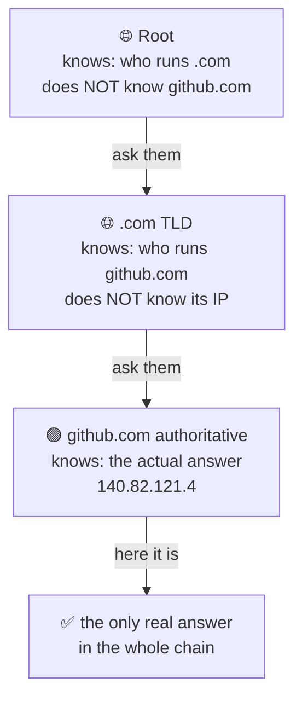
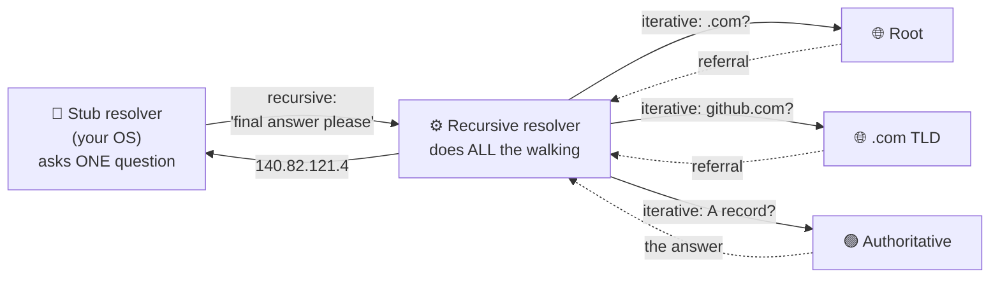
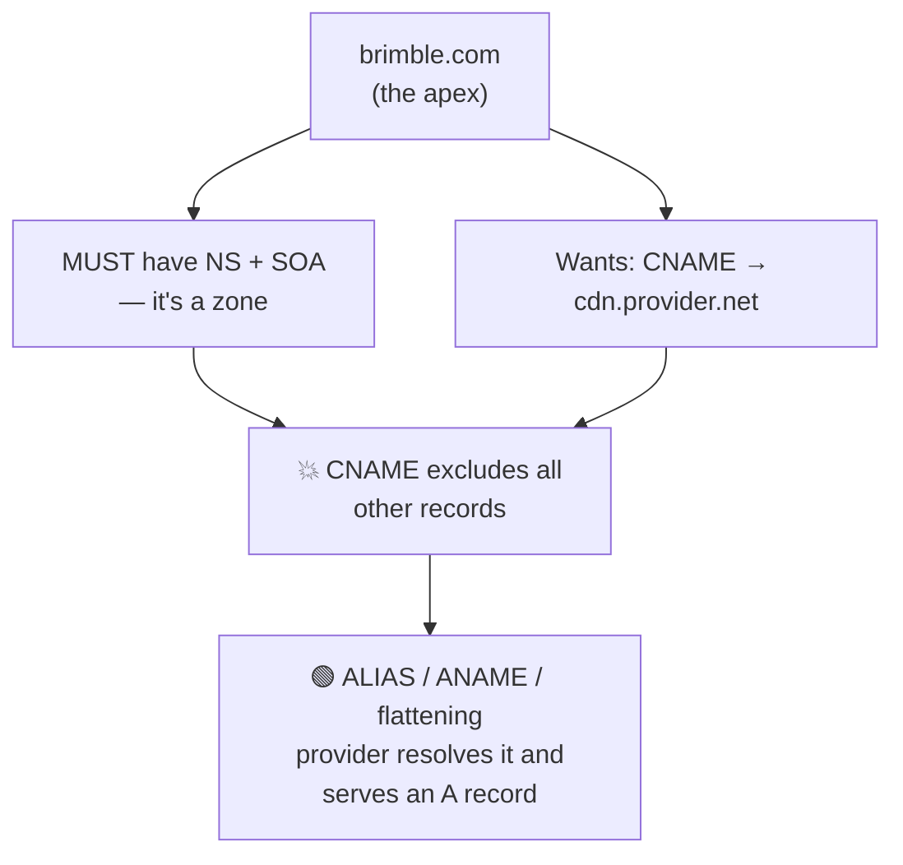
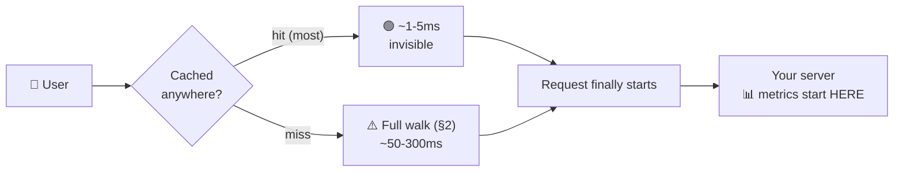
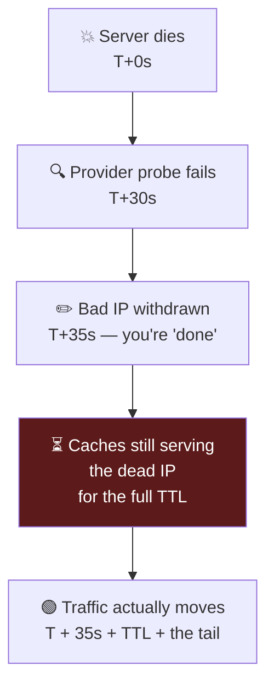
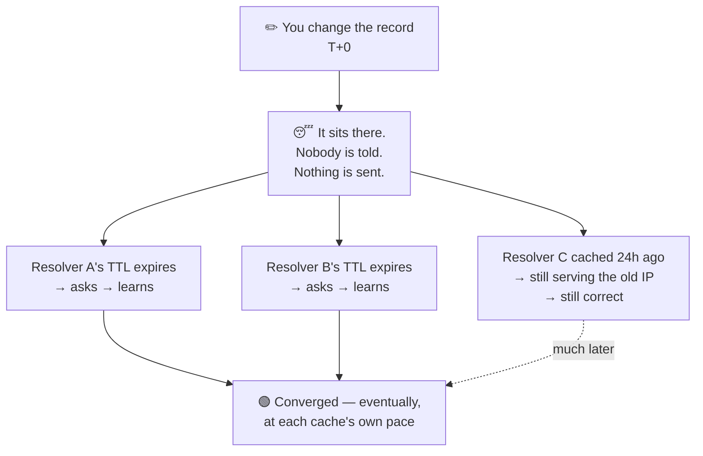
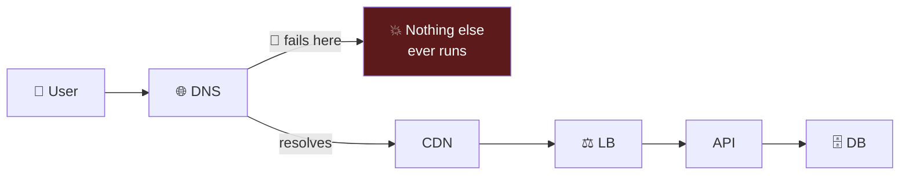
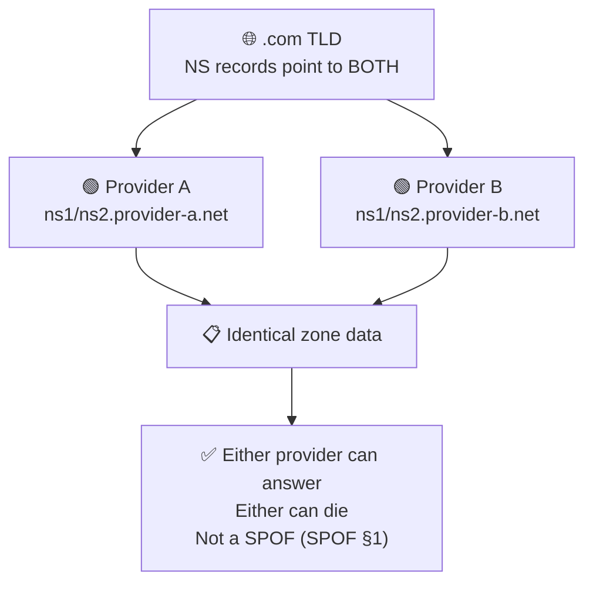

# DNS — The Domain Name System

> **Phase:** Networking Deep Dives → **Topic:** 1 of 7 → **Read time:** ~50 minutes

---

## Before You Begin

This is the **first** deep-dive of Phase 03, and it starts where Foundations §3 stopped. You already know the shape: DNS turns `github.com` into `140.82.121.4`, it's a cached hierarchy (resolver → root → TLD → authoritative), most lookups return in single-digit milliseconds, and every answer carries a **TTL**. None of that gets re-taught here. This document assumes it and goes underneath it, to answer one question:

> **What is DNS actually — as a *system* — and why does the thing in front of every request you will ever make behave so unlike the lookup you think it is?**

Because DNS is not a lookup. It's a **globally distributed, hierarchically delegated, aggressively cached, eventually consistent database** that happens to answer questions about names. Every one of those five words is a source of surprise, and every surprise shows up in production as an outage, a slow failover, or a migration that "should have been instant" and wasn't.

You've already met the consequences of that, scattered across four earlier documents, without meeting the cause:

- The Scaling doc pointed at **DNS-level balancing** in front of your load balancers (Scaling §5) and promised the mechanism would come later. It comes here (§6).
- The SPOF doc listed **DNS** as the archetypal *hidden* SPOF — "it just works," until nobody can find you however healthy your servers are (SPOF §4) — and called the resolution root **irreducible** (SPOF §7). Both are settled here (§8).
- The Distributed Systems doc used **DNS as its worked example of an AP system** — the canonical case of "up ≫ perfectly correct." That's not a curiosity; it's the reason half this document exists (§1, §7).
- Foundations §3 warned that **"just update DNS" is never instant**. §7 explains why the word everyone uses for it — *propagation* — describes something that does not happen.

One scoping note. This is DNS the *system*: how it resolves, caches, steers, and fails. The neighbors get their own documents and appear here only as **named pointers**: load balancer mechanics and algorithms are §05–§06 of this phase, TLS and certificates are §02, CDN and edge strategy are Phase 06, and internal service discovery — "DNS for your own services," promised by Architecture Patterns — is Phase 09.

Here's the trap this document disarms. DNS is the one piece of infrastructure engineers believe they already understand, because they've *used* it — they've edited a record, waited, and watched it work. That familiarity is the danger. It teaches you DNS as a control panel you type into, and hides the fact that you are writing to a database with **millions of independent replicas you do not own, cannot enumerate, and cannot invalidate**. You don't control DNS. You make suggestions to it, with an expiry date.

> **The mindset shift:** stop thinking of DNS as *a lookup that returns an address* — start thinking of it as *a globally replicated cache you can write to but never invalidate*. Every hard DNS problem — slow failover, migrations that drag for days, a provider outage that takes your healthy servers offline, traffic that ignores your steering — comes from that one sentence. You are not changing what a name means; you are **waiting for the world to forget what it used to mean.**

---

## Table of Contents

1. [What DNS Actually Is — Beyond the Phonebook](#1-what-dns-actually-is--beyond-the-phonebook)
2. [The Resolution Path](#2-the-resolution-path)
3. [Caching, TTL, and the Layers](#3-caching-ttl-and-the-layers)
4. [The Record Types That Matter](#4-the-record-types-that-matter)
5. [DNS as a Latency Cost](#5-dns-as-a-latency-cost)
6. [DNS as Traffic Control](#6-dns-as-traffic-control)
7. [Propagation Is a Myth](#7-propagation-is-a-myth)
8. [DNS as a SPOF](#8-dns-as-a-spof)
9. [How DNS Fails](#9-how-dns-fails)
10. [Putting It All Together — Brimble's DNS Migration](#10-putting-it-all-together--brimbles-dns-migration)
11. [Final Recap](#11-final-recap)

---

## 1. What DNS Actually Is — Beyond the Phonebook

Foundations §3 called DNS "the phone book of the internet." That analogy is a good on-ramp and a bad model, and the gap between them is this section.

A phone book is **one book**. It's complete — every listing is in it. It's **static** — printed once, identical for everyone holding a copy. And it's **consistent** — your copy and mine agree, because they're the same edition.

DNS is none of those things. Nothing about it is one book.

> **DNS is a globally distributed, hierarchically delegated, aggressively cached, eventually consistent database.**

Five words, five surprises. Take them one at a time, because the rest of this document is just their consequences.

### Nobody Has the Whole Database

This is the part the phonebook analogy actively conceals. There is no complete copy of DNS anywhere on Earth. No server holds "the mapping." The root nameservers — the top of the hierarchy, the thing everything starts at — **do not know** what `github.com` resolves to. They have never known. They cannot tell you.

What the root knows is one thing: *who to ask about `.com`*. And the `.com` TLD servers don't know `github.com`'s address either — they know *who to ask about `github.com`*. Only at the bottom, at GitHub's own **authoritative** nameservers, does an actual answer exist.

That's **delegation**, and it's the organizing principle of the entire system:



Each level knows only **one level down**, and knows it as a *referral*, not an answer. The database isn't distributed in the sense of "copied around." It's distributed in the sense of **nobody is in charge of more than their own slice** — which is exactly why DNS scales to every name on the internet without any organization needing to hold the whole thing, and exactly why *authority* is the concept that matters (§4's `NS` and `SOA` records are how delegation is written down).

### It Is Eventually Consistent — and That's the Whole Story

The Distributed Systems doc already told you this, and it's worth quoting the frame it used: DNS is its worked example of an **AP system** (Dist §4) — availability and partition tolerance, chosen over consistency. "Up ≫ perfectly correct."

Sit with what that means. When you change a DNS record, there is a window — often hours — where **the internet disagrees with itself** about what your name means. One user's resolver has the new answer. Another's has the old one. Both are behaving correctly. Neither is broken. There is no mechanism to reconcile them faster, because there is no mechanism to *reach* them at all.

This isn't a flaw in DNS. It's the trade DNS deliberately made, and it bought something enormous: DNS keeps answering during partitions, outages, and provider failures, because caches everywhere hold answers that are *probably still good*. Strong consistency would mean checking with authority on every lookup — which would make DNS slow (§5), fragile (§8), and dependent on the authoritative server being reachable by everyone, always.

DNS chose to be *always up and sometimes stale*. Every frustration in this document is the bill for that choice.

> 💡 **Key Insight**
>
> The phonebook analogy fails because a phonebook is complete, static, and consistent — and DNS is **partial** (nobody holds the whole database, only referrals), **dynamic** (answers change under you), and **eventually consistent** (the world disagrees for a while, on purpose). Every DNS problem you will ever debug lives in one of those three gaps. You're not querying a directory; you're asking millions of independent caches what they last heard, and hoping they heard it recently.

### Quick Recap — What DNS Actually Is

- DNS is a **distributed, delegated, cached, eventually consistent database** — not a lookup table and not a phone book.
- **Nobody holds the whole database.** The root doesn't know your IP; it knows who to ask. Each level stores *referrals*, and only the authoritative server at the bottom holds a real answer.
- It's the canonical **AP system** (Dist §4): always answering, sometimes stale — a deliberate trade, not a bug.
- That trade is the source of **every** hard DNS problem: slow failover, dragging migrations, and steering that clients ignore (§6, §7).

---

## 2. The Resolution Path

Foundations §3 drew the walk: browser → recursive resolver → root → TLD → authoritative. That picture is correct and incomplete in one important way — it doesn't say **who does the work**. That's this section, because it's where the labor is unevenly divided in a way that explains the caching layers (§3) and the latency (§5).

### Two Kinds of Query, and Almost Everyone Does the Lazy One

There are two ways to ask a DNS question, and the difference is *who chases the referrals*:

| | **Recursive query** | **Iterative query** |
|---|---|---|
| The ask | "Give me the final answer. I'll wait." | "Tell me what you know — a referral is fine." |
| Who chases referrals | The server you asked | **You** — the asker |
| Who does it | Your device → its resolver | The resolver → root, TLD, authoritative |
| Round trips for the asker | **One** | As many as the chain is deep |

Your laptop runs a **stub resolver** — a deliberately minimal client that knows how to do exactly one thing: ask a configured recursive resolver a *recursive* question and wait for a complete answer. It does not walk the hierarchy. It has no idea the hierarchy exists.

The **recursive resolver** (your ISP's, or a public one like `8.8.8.8`) is where the real work happens. It accepts the recursive question, then turns around and asks a series of **iterative** questions — root, then TLD, then authoritative — chasing each referral itself:



The asymmetry is the point. **One** query leaves your machine; **three or more** leave the resolver. This is why the resolver's cache is the most valuable cache in the system (§3) — it absorbs the entire walk on behalf of every client it serves, and there may be millions of them.

### The Chicken-and-Egg Problem, and Glue

Here's a puzzle the referral model creates. The `.com` servers answer "ask `ns1.github.com`" — a **name**. But to contact `ns1.github.com`, you need its IP. So you look up `ns1.github.com`… which is a `.com` domain… whose nameserver is `ns1.github.com`. You need the answer to get the answer.

DNS breaks the loop with **glue records**: when a TLD hands back a referral to a nameserver that lives *inside the zone being delegated*, it attaches that nameserver's IP address directly to the referral. Not because it's authoritative for it — it isn't — but because the resolution is otherwise impossible. Glue is the system admitting that pure delegation has a bootstrap problem and patching it with a hint.

### The Root Is Not Thirteen Machines

The hierarchy has exactly **13 root server addresses** — a number fixed by an old packet-size constraint, back when a response had to fit in a single 512-byte UDP packet — and this fact routinely misleads people into thinking the internet's naming layer rests on thirteen computers. It doesn't. Those 13 *addresses* are served by **well over a thousand physical servers** in hundreds of locations worldwide, using **anycast**: many machines announce the same IP, and the network routes you to the topologically nearest one. Thirteen is a count of *addresses*, not machines — the operators behind them run large, independent, globally distributed fleets.

This matters for §8. "The root" sounds like a catastrophic SPOF, and structurally it is a single logical entity — but anycast means the failure of any given root instance is invisible; traffic simply routes to another. It's the clearest example in this document of the SPOF doc's distinction (SPOF §1): critical, yes — but *not alone*, and therefore not a SPOF.

> 💡 **Key Insight**
>
> The labor is deliberately lopsided: your device asks **one** recursive question and waits; the resolver does **all** the iterative walking. That's why the resolver — not your browser, not the authoritative server — is the load-bearing cache of the entire system, and why a resolver outage (§9) feels like DNS itself is down. You never talk to the root. You have almost certainly never sent a packet to a root server in your life; your resolver did it for you, and probably not recently, because the answer was cached.

### Quick Recap — The Resolution Path

- **Recursive query** = "give me the final answer" (what your device asks). **Iterative query** = "a referral is fine" (what the resolver asks everyone else).
- Your **stub resolver** is deliberately dumb — one question, one wait. The **recursive resolver** does all the real walking and absorbs it for millions of clients.
- **Glue records** solve the bootstrap loop when a zone's nameserver lives inside the zone it serves.
- The **13 root addresses** are hundreds of machines behind **anycast** — critical, but not alone, and therefore not a SPOF (SPOF §1).

---

## 3. Caching, TTL, and the Layers

Foundations §3 said answers are cached "at every level — browser, OS, resolver." True, and far too gentle. That sentence describes the single most consequential fact about operating DNS, and it deserves to be stated as what it is:

> **When you publish a DNS record, you are writing to millions of caches you do not own, cannot list, cannot reach, and cannot invalidate. Your only control is a number attached to the answer — the TTL — which is a *request*, not a command.**

Everything in §6 and §7 falls out of that.

### The Stack Is Deeper Than You Think

A single lookup can be served — and *stopped* — at any of these:

| Layer | Lives in | Do you control it? | Notes |
|---|---|---|---|
| **Application** | Browser, JVM, runtime | ❌ | Browsers cache ~60s regardless of TTL; some JVMs historically cached **forever** |
| **OS** | `nscd`, `systemd-resolved`, Windows client | ❌ | Survives your app restarting |
| **Recursive resolver** | ISP / `8.8.8.8` | ❌ | The big one — serves millions, absorbs the whole walk (§2) |
| **Forwarders** | Corporate/campus middle boxes | ❌ | Where TTLs go to be reinterpreted |
| **Authoritative** | Your provider | ✅ | The *only* layer you actually control |

Read that column of ❌s again. **You control exactly one layer**, and it's the one furthest from the user — the one that only gets consulted when every cache above it has already given up. That's the operational reality of DNS, and it's why "I changed the record" and "users see the change" are separated by hours.


### TTL Is a Suggestion

Here's the part that surprises people who've only read the spec. **TTL is advisory.** Nothing forces a cache to honor it, and in practice plenty don't:

- Resolvers commonly **clamp** TTLs — enforcing a floor (ignoring your aggressive 30s, using 300s) to protect themselves from load, or a ceiling to avoid serving ancient data.
- Browsers cache on their **own** schedule, often ~60 seconds, largely independent of what you published.
- Some runtimes have historically cached DNS **for the life of the process** — the classic "our app kept hammering the dead IP for three days until we restarted it."

So the honest mental model is not "my TTL is 300s, therefore the world updates in 300 seconds." It's **"300 seconds is the *earliest* the world may start updating, and the long tail is somebody else's decision."** Plan for the tail, not the number.

### Negative Caching — The Failure That Sticks Around

One layer of this that bites hard and gets skipped everywhere: **failures are cached too.**

When a name doesn't exist, the authoritative server returns `NXDOMAIN` — and that "no" gets cached like any other answer. Its lifetime is governed not by the record's TTL (there is no record) but by a field in the zone's **`SOA` record** (§4).

The operational consequence is nasty and counterintuitive: **publish a name *after* someone has already looked it up, and they may keep getting "doesn't exist" long after it exists.** The classic version is a deploy where DNS is created a few seconds late — the health check fires early, gets `NXDOMAIN`, caches the "no," and the service stays invisible for the full negative-cache window even though the record is live. The record is fine. The *absence* is what's cached.

> ⚠️ **The layer you control is the layer that matters least.** You own the authoritative server, and it's the last thing anyone asks. Every layer above it — resolver, forwarder, OS, browser — is a cache belonging to someone else, honoring your TTL at their discretion. This is why DNS changes cannot be *pushed*, only *waited out*, and why the only real lever you have is one you must pull **before** you need it (§7).

### Quick Recap — Caching, TTL, and the Layers

- A lookup can be answered at **five layers**, and you control exactly **one** — the authoritative server, the last one anyone asks.
- **TTL is advisory, not binding** — resolvers clamp it, browsers ignore it, some runtimes cache forever. It's the *earliest* update time, not the actual one.
- **Negative answers are cached too** (`NXDOMAIN`, governed by the `SOA`), so a name can stay "nonexistent" after it exists.
- DNS changes are never *pushed* — they're **waited out**, which makes TTL a lever you must pull in advance (§7).

---

## 4. The Record Types That Matter

Foundations §3 gave you `A`, `AAAA`, and `CNAME` — enough to point a domain somewhere. This section covers the ones that carry the *system* behavior: who's authoritative, how delegation is written down, how negative caching is configured, and the one constraint that has shaped more real architectures than any other DNS detail.

### The Working Set

| Record | Answers | Why it matters here |
|---|---|---|
| `A` / `AAAA` | Name → IPv4 / IPv6 | The actual answer. Multiple `A` records = the crude load balancing of §6 |
| `CNAME` | Name → **another name** | Alias. Costs an extra resolution; constrained at the apex (below) |
| `NS` | Who is authoritative for this zone | **Delegation itself** (§1) — this is how the hierarchy is written down |
| `SOA` | Zone metadata: serial, primary, **negative-cache TTL** | Governs `NXDOMAIN` lifetime (§3); the serial drives replication |
| `MX` | Where mail goes | Has **priorities** — DNS's one native failover mechanism |
| `TXT` | Arbitrary strings | Domain-ownership proofs, SPF/DKIM — the "misc" slot, load-bearing in practice |

Two of these deserve more than a table row.

**`NS` is not a pointer — it *is* the delegation.** When §1 said each level knows only who to ask next, `NS` records are that knowledge, physically. And they exist in **two places at once**: at the parent (the `.com` TLD's referral) and in your own zone. When those disagree, resolution gets non-deterministic in ways that are genuinely miserable to debug — and this exact split is the mechanism that makes the dual-provider migration of §10 possible.

**`MX` quietly has what the rest of DNS lacks.** `MX` records carry a **priority**: try 10 first, fall back to 20. That's real, native, in-protocol failover — and it exists for mail and essentially nowhere else. `A` records have no such thing. This asymmetry is worth noticing, because it's the clearest evidence for §6's central claim: DNS was never designed as a failover mechanism, and the one place it *does* do failover properly is a special case built for email in the 1980s.

### The CNAME-at-Apex Problem

This is the DNS constraint most likely to shape your architecture, and it starts from a rule that sounds like trivia:

> **A `CNAME` cannot coexist with any other record for the same name.**

The reason is coherence. `CNAME` means "this name *is* another name — go ask about that one instead." If `brimble.com` were a `CNAME`, that instruction would apply to *every* query for `brimble.com`, including its `NS` and `SOA`. But the apex **must** have `NS` and `SOA` — that's what makes it a zone at all (§1). So the apex can never be a `CNAME`. Not by convention. By construction.



Now the practical bite. Your CDN or load balancer hands you a *name*, never an IP — deliberately, because that's the indirection that lets them move infrastructure without telling you (Foundations §3's "change the mapping, not the callers"). So `www.brimble.com` → `CNAME` → the provider's name works fine. But `brimble.com` — the bare domain, the one on the business card — **cannot** be a `CNAME`. And hardcoding the provider's IP in an `A` record forfeits the entire reason they gave you a name.

The industry's answer is **ALIAS** / **ANAME** / **CNAME flattening**: a non-standard, provider-specific record that *looks* like a `CNAME` at the apex but is resolved by the provider at query time and served as a plain `A`. The resolver never sees a `CNAME`; the rule is never violated. It works — and it quietly locks you to a provider that implements it, which is exactly the kind of dependency §8 teaches you to notice.

> 💡 **Key Insight**
>
> Record types aren't a vocabulary list — they encode the system's structure. `NS` **is** delegation. `SOA` governs how long "no" lasts. And the apex `CNAME` rule isn't trivia: it's a coherence constraint that forces every organization wanting a bare domain on a CDN into a **non-standard, provider-specific** feature. The most consequential DNS rules are the ones that quietly narrow your options long before you notice you were choosing.

### Quick Recap — The Record Types That Matter

- `NS` **is** delegation written down (§1) — and it lives in two places (parent and zone), which is what makes dual-provider migration work (§10).
- `SOA` carries the **negative-cache TTL** — the field that decides how long `NXDOMAIN` sticks (§3).
- `MX` **priorities** are DNS's only native failover — evidence that everything else in DNS wasn't built to fail over (§6).
- A `CNAME` **cannot coexist with other records**, so the apex can never be one — forcing the non-standard ALIAS/ANAME workaround and a quiet provider dependency (§8).

---

## 5. DNS as a Latency Cost

Foundations §7 made DNS **Step 1** of the request walkthrough, and the Latency doc broke a request's time into its components (Latency §2). Put those together and you get the fact this section is about:

> **DNS latency is time the user waits before your system has received a single byte — and it is invisible in every metric your servers produce.**

Your p99 can be immaculate. Your dashboards can be entirely green. And users can still be waiting, because the wait happened before the request existed.

### Cold and Warm Are Different Systems

The spread between a cached lookup and an uncached one is not a detail — it's two orders of magnitude:

| | **Warm** (cached) | **Cold** (full walk) |
|---|---|---|
| Who answers | Resolver, from memory | Root → TLD → authoritative (§2) |
| Round trips | 1 | 4+ |
| Typical | **~1–5 ms** | **~50–300 ms** |
| How often | The overwhelming majority | The unlucky minority |

Foundations §3's "single-digit milliseconds" describes the *warm* case, and it's right — most lookups are warm, because the resolver absorbs the walk for millions of clients (§2). But "most" is doing heavy lifting there, and the Latency doc already taught you to distrust it.

### This Is a Tail Story, and the Tail Is Where Users Live

Latency §5 said it: judge by percentiles, not averages. DNS is the purest instance of that lesson in the entire curriculum.

The *average* DNS lookup is nearly free — cache hit, a millisecond, gone. So the average tells you DNS costs nothing, and the average is useless. The distribution is **bimodal**: a huge spike at ~1ms and a second, distant hump at 50–300ms. Nobody experiences the mean. You either hit cache or you take the walk.

And the cold path isn't randomly distributed — it lands disproportionately on the users you least want to lose: the **first-time visitor**, the user on a mobile network whose resolver is far away, the one arriving after a TTL expiry. Your most important request — someone's first impression of your product — is the one most likely to pay full price.



Note where the metrics start in that diagram. Everything to the left of `S` is real user-perceived latency that your monitoring never sees — which is exactly the component-versus-user-perceived gap Availability §9 warned about. Every internal component reports green while users wait.

It's also a bottleneck you can't optimize your way out of, which makes it an unusual case of Scalability §7's shifting constraint: scale your fleet all you like, and the constraint sits *upstream of your system entirely*, in infrastructure you don't own. Scale §7 taught that fixing one bottleneck reveals the next — DNS is the one that was always there, in front of the first one, and never moves.

### Chains Multiply the Bill

§4's `CNAME` has a latency cost that compounds. A `CNAME` isn't an answer — it's a redirection to *another* name, which must itself be resolved. So `www.brimble.com` → `CNAME` → `lb.provider.net` → `CNAME` → `edge.provider-cdn.net` → `A` is **three** resolutions deep, each with its own chance of a cold miss.

This is how architecturally reasonable decisions — put the CDN in front, let the provider indirect — silently stack milliseconds onto the front of every cold request. Each link is defensible. The chain is what costs.

### What You Can Actually Do

The lever inventory here is short and honest, because §3 already established you control one layer:

- **`dns-prefetch` / `preconnect`** — resolve names during idle time, before the user clicks. The most effective tool available, because it moves the cost off the critical path rather than reducing it.
- **Fewer distinct domains** on the critical path — every extra hostname is a separate lookup with its own cold-miss chance. Sharding assets across four subdomains is four potential cold walks.
- **Flatten `CNAME` chains** where a provider allows it (§4's ALIAS does exactly this).
- **Longer TTLs** — fewer cold misses. But this is the trade, not a free win: §6 and §7 are about what long TTLs cost you.

> 💡 **Key Insight**
>
> DNS latency is **structurally invisible**: it's paid before your server sees the request, so it never appears in your p99, and it's *bimodal*, so the average says it's free. It isn't free — it's concentrated on first-time and mobile users, the ones forming a first impression. The only durable fix isn't making the lookup faster; it's **making it happen earlier** (prefetch) or **less often** (longer TTLs, fewer domains, flatter chains) — and that last one is a loan you repay in §7.

### Quick Recap — DNS as a Latency Cost

- DNS is paid **before byte one** reaches your system — invisible to server metrics, visible to users (Avail §9).
- The distribution is **bimodal**: ~1–5ms warm, ~50–300ms cold. Nobody experiences the average (Latency §5).
- Cold misses concentrate on **first-time and mobile users** — your worst-priced request is someone's first impression.
- `CNAME` chains **multiply** lookups; prefetch moves the cost off the critical path; longer TTLs reduce misses but mortgage §7.

---

## 6. DNS as Traffic Control

The Scaling doc left an IOU here. It warned that a single load balancer is a SPOF, noted that production systems "often run **DNS-level balancing** in front of them," and promised the mechanism would be covered fully in the networking deep-dives (Scaling §5). This is that coverage — and the honest version of it has two halves: *DNS really is a load balancer*, and *DNS is a bad one*.

### The Superpower, Restated

Foundations §3 named it: DNS is a **control plane**, not just a lookup. Change what a name resolves to and you redirect users globally without touching a line of application code. It's the naming-layer superpower — change the mapping, not the callers.

And it's genuinely load-bearing. DNS-level steering is what sits *in front of* your load balancers, which means it's the only layer that can distribute across things that don't share a data center. Your load balancer can't balance across regions; it's *in* one. DNS can.

### The Four Mechanisms

| Mechanism | How it works | Real use |
|---|---|---|
| **Round-robin** | Multiple `A` records; resolver rotates the order | Crude spread across a few IPs |
| **Weighted** | Provider returns IPs at configured ratios | Canary deploys, gradual migration (§10) |
| **GeoDNS** | Answer depends on where the *resolver* is | Send users to their nearest region |
| **Health-checked failover** | Provider probes targets; withdraws dead IPs | The closest DNS gets to real failover |

Each is a legitimate tool. Then reality intervenes.

### Why It's Crude — Four Reasons

**1. You aren't steering users. You're answering resolvers.** Everything §3 established applies: your answer is cached at five layers by parties who owe you nothing. You don't decide where traffic goes — you *suggest*, and the suggestion persists for as long as somebody else's cache decides it should.

**2. Round-robin balances *answers*, not *load*.** The rotation is blind. It doesn't know one IP is a 64-core box and another is struggling; it doesn't know one client is a corporate resolver fronting 50,000 users and another is one laptop. It distributes *responses* evenly and hopes that correlates with distributing *work* evenly. A real load balancer knows connection counts and health (§05–§06 of this phase). DNS knows a list. This is exactly why Scaling §5 said DNS balancing goes *in front of* load balancers rather than replacing them.

**3. GeoDNS locates the *resolver*, not the user.** The provider sees where the query came from — and it came from the resolver, not the human. A user in Mumbai on a corporate VPN egressing through Frankfurt gets sent to Europe. Someone using a centralized public resolver may be geolocated to wherever that resolver's infrastructure answered from. GeoDNS is good in aggregate and confidently wrong for exactly the users whose setups are unusual.

**4. Health-checked failover is fast to *detect* and slow to *matter*.** This is the big one, and it's the §7 bridge:



Your provider detected the failure in 30 seconds and did its job perfectly. Users kept hitting the dead server anyway — because the answer was already in caches you can't reach, and health checks can't retract an answer that's already been given. **DNS failover doesn't redirect traffic. It stops handing out a bad answer to people who haven't asked yet.**

That's the entire difference between DNS-level failover and a load balancer pulling a node from its pool. The load balancer *has the connection*, so it acts. DNS only ever spoke to whoever asked, and it can't call them back.

> ⚠️ **DNS steering is advisory, not authoritative.** A load balancer decides where a request goes. DNS *suggests* where the next request might start, to whoever asks next, honored at the discretion of caches you don't own. It's the only tool that steers across regions and providers — so you will use it — but never model it as control. Model it as **influence with a lag**, and the lag is your TTL plus a tail you don't set (§3).

### Quick Recap — DNS as Traffic Control

- DNS steering is real and irreplaceable: it's the only layer that balances **across regions and providers**, which is why it sits *in front of* load balancers (Scaling §5).
- The four mechanisms — **round-robin, weighted, GeoDNS, health-checked failover** — are all advisory, because the answer lands in caches you don't control (§3).
- Round-robin balances **answers, not load**; GeoDNS locates the **resolver, not the user** — both are right in aggregate, wrong at the edges.
- Health-checked failover **stops giving out a bad answer** — it can't retract answers already given, so real failover takes TTL + tail (§7).

---

## 7. Propagation Is a Myth

Foundations §3 warned that *"just update DNS" is never instant*. Here's the payoff — and it's blunter than a warning about delay:

> **Nothing propagates. There is no propagation. The word describes a process that does not occur.**

"DNS propagation" implies a wave — your change spreading outward, sweeping across the internet, arriving at resolvers over some hours. Every part of that picture is false. **Your change goes nowhere.** It sits on your authoritative server, doing nothing, being told to nobody.

What actually happens is the opposite of a push. Caches **expire**, independently, on their own schedules, and each one — long after you've forgotten you made the change — asks again and *happens to hear the new answer*. There's no wave. There's a scatter of unrelated timers, each running down, each triggering one incurious re-query.

This is §1's eventual consistency, arrived at from the operational side. DNS is AP (Dist §4): it stays up and tolerates disagreement. The "propagation window" is just the **disagreement window** — the period where the world holds two answers and both are legitimate. You're not waiting for delivery. **You're waiting for the world to forget.**



### Why the Myth Is Expensive

This isn't pedantry about a word. The wrong model produces the wrong action every time:

| If you believe *propagation* | You do this | What actually happens |
|---|---|---|
| It's a wave arriving over hours | Change the record, then wait | The wait is uncontrolled — you had one lever and didn't pull it |
| It'll finish when the wave passes | Decommission the old server "after propagation" | The stragglers were still on it. You broke them |
| You can push it faster | Flush caches, contact support, re-save the record | **Nothing** — you cannot reach caches you don't own (§3) |
| Someone else has the same view | "It works for me" ends the debate | Both of you are right; you're on different timers |

That third row is the cruel one. When a DNS change is going badly, there is **no emergency lever**. You can't force it. The only lever DNS ever gave you had to be pulled *before* the change — and if you didn't, you wait.

### The Only Real Lever, and It's a Time Machine

Since nothing can be pushed, the entire discipline reduces to one move made in advance: **lower the TTL before you need it.**

```
T-48h   TTL is 86400 (24h)  ← the steady state
T-24h   Lower TTL to 300     ← the actual migration step
        └── caches still holding the 24h TTL keep it for up to 24h more
T+0     Make the real change  ← now the world forgets in ~5 minutes
T+1h    Verify from many vantage points
T+24h+  Raise TTL back to 86400 (§5's latency bill)
```

The subtlety that catches people: **lowering the TTL is itself subject to the old TTL**. A resolver holding a 24-hour answer will not learn about your new 300-second TTL for up to 24 hours. The TTL change has to *outlive* the old TTL before it's true everywhere. That's why the lowering happens at least one full old-TTL ahead of the change — and why a migration planned the day before is already too late to plan.

Then §5 sends its bill. A 300-second TTL means 288× more lookups than a 24-hour one, and far more cold walks landing on real users. So low TTLs aren't free agility — they're **paid agility**, which is why you lower them for a window and raise them after.

> 💡 **Key Insight**
>
> Stop saying propagation. Say **expiry**. Your change is never delivered to anyone — it sits still while millions of independent timers run down and each cache incuriously re-asks. That reframe hands you the only correct operational instinct DNS has: since you can't push, the lever is **TTL, and it only works in advance**. "How fast can I change DNS?" is the wrong question. The right one is **"what did I set the TTL to, yesterday?"**

### Quick Recap — Propagation Is a Myth

- **Nothing propagates.** Your change sits on the authoritative server; caches **expire** independently and re-ask on their own timers (§3).
- The "propagation window" is the **disagreement window** — §1's eventual consistency (Dist §4) seen from operations. You're waiting for the world to *forget*, not to receive.
- There is **no emergency lever** — you cannot flush caches you don't own. Believing otherwise costs you the stragglers when you decommission early.
- The only lever is **lowering TTL in advance**, and it's itself gated by the old TTL — so it must be pulled at least one full old-TTL before the change (§10).

---

## 8. DNS as a SPOF

The SPOF doc named DNS twice, and both entries were promissory notes this section settles.

It listed DNS in its **hidden SPOF** table (SPOF §4) with a line worth re-reading now that you know the machinery: *"It just works" — not thought of as a component. DNS fails → nobody can **find** you, however healthy your servers.* And in §7 it called the resolution root one of the **irreducible** SPOFs — "something has to be the entry point clients resolve first."

You now have enough to see why both are true, and where each stops being true.

### Why DNS Fails the Two-Condition Test So Badly

SPOF §1 set the test: a SPOF is a component that is **critical** *and* **alone**. DNS is the most critical thing in your architecture by a margin that's easy to miss:



Every box to the right can be perfect — multi-region, replicated, auto-scaling, nine nines of engineering — and reachable by **nobody**, because the user never got an address. DNS isn't on the critical path; it's *in front of* the critical path. Availability §6's series math is unforgiving here: DNS sits in series with your entire system, so its availability is a **hard ceiling** on everything downstream. No amount of redundancy to the right of that first box raises the ceiling.

And DNS is a *hidden* SPOF for exactly the reason SPOF §4 gave — it isn't experienced as a component. It's experienced as a fact of the universe, like DHCP or gravity. Nobody puts it on the architecture diagram, nobody assigns it an owner, and so nobody notices it has exactly one of everything.

### The Three DNS SPOFs You Actually Have

"DNS" isn't one dependency. It's at least three, with wildly different reducibility — and conflating them is why teams think they've de-SPOFed DNS when they've addressed one third of it:

| The SPOF | Why it's singular | Reducible? |
|---|---|---|
| **Your authoritative provider** | One vendor serves your zone | ✅ **Yes** — add a second provider. This is the cheap, high-value one |
| **Your registrar / the domain itself** | One account, one renewal, one registry record | ⚠️ **Partly** — you can't have two registrars. Harden it |
| **The resolution root** | Something must be the first thing asked | ❌ **No** — irreducible by construction (SPOF §7) |

**The provider** is the one worth acting on, and §4 already told you how it's possible: `NS` records exist at both the parent and in your zone, and the parent can delegate to nameservers from two different vendors at once. Resolvers try them and use whichever answers. Both providers serve the same zone; either one dying is survivable. This is unusually cheap redundancy for unusually high value — which is precisely why the SPOF doc's Brimble hunt flagged it (§10).

**The registrar** is the ugly one, because it's a SPOF you can't duplicate. There is exactly one registration for your domain, in one account, and if it lapses or is hijacked, nothing else matters — not your two providers, not your nine nines. The famous version of this failure is an expired domain: an unattended renewal card, a notification to someone who left the company, and a company that ceases to exist online while every server hums along perfectly. You can't make it redundant. You harden it: registry lock, auto-renew, a card that doesn't expire, alerts to a *team* alias rather than a person, and multi-year registration. This is SPOF §7's "harden what you can't remove," and it's also its **organizational** SPOF chapter wearing an infrastructure costume — the failure is a *process*, not a machine. Rel §9 named this category precisely: the operational and human layer, where the fault isn't in any system but in the procedure wrapped around it. No amount of infrastructure work protects a domain whose renewal notice goes to someone who left two years ago.

**The root** is genuinely irreducible, and §2 already explained why it's survivable anyway: anycast. Something must be asked first, so structurally it's singular — but that singular logical entity is hundreds of machines. Critical, but not *alone*, so it fails SPOF §1's second condition. It's the rare irreducible SPOF that isn't a real risk to you, and the reason is worth internalizing: **an irreducible dependency is fine when someone has made it internally redundant.** You're not spared the dependency, only the failure.

> 💡 **Key Insight**
>
> DNS is the purest hidden SPOF in the curriculum: **maximally critical** (in series with everything — Avail §6 makes it a hard ceiling on your entire system's availability) and **maximally invisible** (nobody diagrams it, owns it, or thinks of it as a component). Untangle it into three — **provider** (redundant it, cheaply), **registrar** (harden it, you can't duplicate it), **root** (already handled, by anycast). Fixing only the first and calling DNS solved is how the second one gets you.

### Quick Recap — DNS as a SPOF

- DNS sits **in series with everything** (Avail §6) — a hard ceiling on system availability that no downstream redundancy can raise.
- It's the archetypal **hidden** SPOF (SPOF §4): not on the diagram, not owned, experienced as a fact of nature rather than a component.
- It's really **three** SPOFs: provider (**reducible** — second provider via dual `NS`, §4), registrar (**harden only** — one account, one renewal), root (**irreducible** but anycast-redundant, §2).
- An irreducible dependency is survivable when someone else made it redundant — the root proves it; your registrar proves the inverse.

---

## 9. How DNS Fails

§8 covered the structural failure — DNS as SPOF. This section is the field guide: the specific ways DNS breaks, ordered roughly by how often they actually take companies down.

### The Taxonomy

| Failure | What happens | Why it hurts more than expected |
|---|---|---|
| **Misconfiguration** | Bad record, typo'd IP, wrong `NS` | Instantly cached everywhere. The fix is subject to TTL (§7) — **the rollback is as slow as the change** |
| **Expired domain** | Registration lapses | Total, sudden, and a *billing* failure — no engineering signal precedes it (§8) |
| **Resolver outage** | The recursive resolver dies | Not your fault, fully your outage. Users can't resolve *anything* (§2) |
| **DDoS on authoritative** | Your nameservers are flooded | Cached users unaffected — cold users can't reach you. **A slow-motion outage as TTLs expire** |
| **Split-horizon surprise** | Internal and external views diverge | Works in staging, fails in prod — or vice versa. Invisible to whoever's testing |
| **Negative caching** | `NXDOMAIN` cached before the record existed | The record is live and correct; the *absence* is what's stuck (§3) |

Three of these deserve elaboration, because they behave in ways the table can't convey.

### Misconfiguration: The Rollback Is as Slow as the Change

This is the most common DNS outage, and its signature cruelty is asymmetric time. Publishing a wrong record takes effect at the speed of your next cache miss — fast. Fixing it takes effect at the speed of TTL expiry — slow. **You can break DNS instantly and can only unbreak it eventually.**

Every other layer of your stack has a fast rollback. Bad deploy? Roll back, thirty seconds. Bad config? Revert, restart. Bad DNS record with a 24-hour TTL? You get to watch. This is the single strongest argument for §7's discipline: the TTL you set on a *normal* day determines how fast you can recover on a *bad* one. Low TTLs aren't just for migrations — they're your DNS rollback speed, purchased in advance (§5 sends the bill).

### DDoS on Authoritative: The Outage That Arrives in Slow Motion

Attack the authoritative nameservers and something strange happens: **nothing**, at first. Everyone with a cached answer is fine. They resolve, they connect, they never notice.

Then TTLs start expiring. One cache, then another. Each expiry converts a working user into a broken one, permanently, because there's no authoritative server left to re-ask. The outage doesn't *start* — it **accretes**, at a rate set by your TTL distribution, over hours.

This is the one case where a **long** TTL is your friend — it's a buffer of stale-but-working answers absorbing the attack. Which puts long TTLs on both sides of the ledger: they slow your recovery from misconfiguration (above) and they cushion you against provider loss. There's no setting that's safe against both. That's the trade §11 records.

### Correlated Failure: The One That Takes Down the Internet

Availability §9 already described this shape and named DNS in it: a **shared control plane** letting go, and every "redundant" service depending on it going down together. DNS is the largest instance of that pattern in existence.

The public record is consistent: when a major managed DNS provider has a bad day, thousands of independently-architected companies — different clouds, different languages, different teams, no relationship to each other — go dark **simultaneously**. Each one had redundant servers. Many were multi-region. It made no difference. They had all, independently and invisibly, chosen the same single DNS vendor, and discovered together that their redundancy shared a floor.

The canonical instance is a 2016 DDoS against one managed DNS provider, which made a long list of household-name platforms unreachable across the US and Europe for the better part of a day. The affected companies had **nothing** in common — not their stack, not their cloud, not their architecture — except one vendor none of them had thought about since the day they picked it. Note what the attackers did *not* do: they never touched a single one of those companies' systems. Every server stayed healthy the whole time.

There's a second flavor worth knowing, because it's self-inflicted. In a well-documented 2021 outage, a large platform's authoritative nameservers became unreachable through a network misconfiguration on their own side — their name simply stopped resolving. Everything they ran was fine; nobody could look up where it was. It's §8's ceiling made literal: the entire company's availability was capped by a naming layer that nobody thinks of as a component.

Both cases carry a Reliability-doc tail (Rel §5): when resolution fails, clients don't fail quietly — they **retry**, and every retry is another lookup against an already-drowning nameserver. The failure feeds itself, exactly the fault-chain shape Rel §5 described, and it's why DNS outages recover slowly even after the original cause is fixed.

That's Availability §9's lesson in its sharpest form: *redundancy across things that share a hidden dependency is one component with extra copies of its faces.* The correlated dependency wasn't in anyone's architecture diagram, because a vendor isn't a component — it's a decision made once, years ago, by someone who has since left.

> ⚠️ **DNS failures are asymmetric in time, and that asymmetry is the whole danger.** Breaking is instant (a bad record caches immediately); fixing is bounded by TTL (§7). Meanwhile a provider outage does the reverse — invisible at first, then accreting into totality as caches expire. Long TTLs cushion provider loss and lengthen misconfiguration recovery. Short TTLs do the opposite and cost latency (§5). There is no safe number — only a chosen trade, made before you find out which failure you got.

### Quick Recap — How DNS Fails

- **Misconfiguration** is the most common failure, and it's time-asymmetric: instant to break, TTL-bounded to fix — your **rollback speed is the TTL you chose yesterday**.
- **Authoritative DDoS** produces a slow-motion outage that *accretes* as TTLs expire — the one case where a long TTL is a buffer.
- **Negative caching** (§3) and **split-horizon** failures are correctness-shaped, not availability-shaped — the record is right, but somebody's view of it isn't.
- **Correlated provider failure** is the big one (Avail §9): thousands of unrelated companies share one DNS vendor and go dark together — redundancy with a shared floor.

---

## 10. Putting It All Together — Brimble's DNS Migration

**Brimble** left this document a ticket.

When their SPOF audit closed out Phase 02, the team triaged every single point of failure they'd found and assigned each an action. Most got done. One line item didn't:

> **DNS → eliminate** (SPOF §6): add a second DNS provider. Cheap, high-value.

It was the *easiest* item on the list, which is exactly why it survived four quarters of neglect — nothing was on fire, DNS "just worked" (SPOF §4's whole point), and no incident ever made it urgent. Then a major managed DNS provider had a bad morning, thousands of unrelated companies went dark together (§9), and Brimble's provider — by luck, not design — wasn't the one. The ticket stopped being cheap and started being obvious.

Here's them finally doing it. Watch every section of this document become a step.

### Step 1 — Separate the Three SPOFs (§8)

Before touching anything, they split "DNS" into what it actually is (§8), because the audit line said "add a second provider" and that only addresses one third:

| Their DNS SPOF | Status | Action |
|---|---|---|
| **Authoritative provider** | 🔴 One vendor | Add a second — *this is the ticket* |
| **Registrar** | 🔴 One account, card expiring in 4 months, alerts to one ex-employee's inbox | Can't duplicate — **harden** (§8) |
| **Root** | 🟢 Anycast (§2) | Nothing to do |

The registrar finding is the one that rattles them: it wasn't on the ticket, it can't be made redundant, and it would have taken them down *harder* than the provider — a lapsed domain doesn't degrade, it deletes you. They fix it the same afternoon: auto-renew, registry lock, a corporate card with no expiry, and alerts to a **team alias** rather than a person. That's SPOF §9's organizational SPOF, found wearing an infrastructure costume.

### Step 2 — Lower the TTL First, and Wait a Full Old TTL (§7)

Their apex TTL is **86400** — 24 hours. Somebody proposes making the change tonight. §7 says no.

Lowering the TTL is *itself* gated by the old TTL: resolvers holding a 24-hour answer won't learn about a 300-second TTL for up to 24 hours. So the sequence has a mandatory wait built into it:

```
T-48h   TTL 86400 (24h) — steady state
T-24h   ✏️ Lower TTL to 300 ...and WAIT a full 24h
        └── old-TTL holders must expire before the new TTL is true anywhere
T+0     🚀 The actual change — the world now forgets in ~5 min, not ~24h
T+24h   ⬆️ Raise TTL back to 86400 (§5's bill)
```

The team's instinct — "it's a config change, we can do it tonight" — is precisely the instinct §7 exists to kill. **The migration started 24 hours before the migration.** Anyone planning it the day before has already lost the only lever DNS gives you.

### Step 3 — Run Both Providers at Once (§4, §8)

Now the actual redundancy, and it works because of a `NS` detail from §4: nameserver records live in **two places** — at the parent TLD and in the zone itself — and the parent can delegate to nameservers from *two different vendors simultaneously*.



Both providers serve the same zone. Resolvers pick whichever answers. Neither is critical *and* alone anymore — which is exactly SPOF §1's two-condition test failing, on purpose, for the first time.

They don't cut over. They **overlap**: Provider B goes live alongside A, both authoritative, for two weeks. If B is misconfigured, A is still answering. The dual-provider end state *is* the goal, so the "migration" is really just a redundancy addition that never ends.

### Step 4 — The Record They Forgot (§3, §4)

They copy the zone to Provider B: apex `A`, `www`, the ALIAS for the CDN (§4), a dozen subdomains. They diff the two zones. It matches. They go live.

Four days later, sales notices nobody has emailed them back.

**The `MX` records didn't get copied.** They were created years ago by someone in a different tool and never lived in the file the team diffed. So: resolvers that happened to ask Provider A got mail routing fine. Resolvers that happened to ask Provider B got **`NXDOMAIN`** — no `MX` here — and sending mail servers concluded Brimble doesn't accept mail. Roughly half the internet's mail to them bounced, at random, for four days, while every dashboard stayed green (§5 — DNS failures don't appear in your metrics).

Then it gets worse in the specific way §3 promised. They add the `MX` records to Provider B and mail *stays* broken for hours — because the **negative** answer was cached, governed by the `SOA`'s negative-cache TTL, not by any record's TTL. The record is live. The record is correct. The **absence** is what's stuck. You cannot fix a cached "no" by creating the thing; you can only wait for the "no" to expire (§7 — nothing propagates).

Two lessons the team writes down:

- **Diff what the *provider* answers, not what your file says.** Query both providers for every record type and compare the responses. Zone files lie by omission; `MX` and `TXT` (SPF, domain verification) are the classic omissions because nobody who works on the website thinks about mail.
- **Partial DNS redundancy is worse than none.** With one provider, a missing record fails for everyone, immediately, loudly. With two, it fails for *half* of everyone, *at random*, silently — a coin flip per resolver. They'd accidentally built the hardest possible failure to reproduce.

### Step 5 — Verify From Where Users Are, Not From Your Laptop (§1, §6)

"Works for me" is meaningless here, and §1 says why: the world is *supposed* to disagree during the window. Both answers are legitimate. Your laptop's resolver is one sample of millions, and it's the least representative one — it's the one you just flushed.

So they check from many vantage points and both providers explicitly, and they watch for the §6 trap too: GeoDNS answers depend on where the **resolver** is, not the user, so verifying from one location tells you almost nothing about what a user in another region receives.

### Step 6 — Raise the TTL Back (§5)

Two weeks later, stable, they raise the apex TTL to 86400 — because §5's bill is real. A 300-second TTL means **288× more lookups** than a 24-hour one, and every extra cold walk (50–300ms) lands on a first-time or mobile user (§5).

But they don't raise it blindly. §9 taught them the TTL number *is* their rollback speed: a 24-hour TTL means a bad record takes a day to un-break. So they settle on **3600** — one hour — as a deliberate compromise: cheap enough on lookups, fast enough to recover, and the number is now written in the runbook with the reasoning attached, so the next person doesn't "optimize" it without knowing what they're selling.

### The Payoff

Eight months later, Provider A has a multi-hour outage. Thousands of companies go dark. Brimble's traffic doesn't move — resolvers that can't reach A ask B, get an answer, and connect. Nobody pages anyone. The incident channel has one message in it, posted the next morning, linking the news.

The ticket had been open for four quarters and would have taken an afternoon. What made it finally get done wasn't discipline — it was watching it happen to somebody else. **That's the honest lesson of the whole document: DNS is the thing you fix after you get scared, and the scare is optional but the fixing isn't.**

---

## 11. Final Recap

| Concept | Core Insight | Biggest Tradeoff |
|---|---|---|
| **What DNS is** | A distributed, delegated, cached, **eventually consistent** database — not a lookup (Dist §4) | Always up, sometimes stale — every hard DNS problem is this bill |
| **Delegation** | Nobody holds the database; each level knows only *who to ask next* | Scales infinitely; makes *authority* the thing that matters |
| **Resolution path** | Your device asks **one** recursive question; the resolver does **all** the iterative walking | The resolver's cache is load-bearing — and it isn't yours |
| **Caching layers** | Five layers can answer; **you control exactly one** — the last one asked | You can't push a change, only wait it out |
| **TTL** | Advisory, not binding — clamped, ignored, sometimes cached forever | It's the *earliest* update, never the actual one |
| **Negative caching** | `NXDOMAIN` is cached too, governed by the `SOA` | A name can stay "nonexistent" after it exists |
| **Record types** | `NS` **is** delegation; `MX` priorities are DNS's only native failover | Apex can't be a `CNAME` → non-standard ALIAS → provider lock-in |
| **Latency** | Bimodal: ~1–5ms warm, ~50–300ms cold — paid **before** your server sees anything | Invisible in your metrics; concentrated on first-time users |
| **Traffic control** | The only layer that steers across regions/providers (Scaling §5) | Advisory, not authoritative — influence with a lag |
| **Propagation** | **Doesn't exist.** Caches expire; nothing is ever sent | The only lever (TTL) works only *in advance* |
| **DNS as SPOF** | In series with everything → a hard ceiling on availability (Avail §6) | It's *three* SPOFs: provider (fix), registrar (harden), root (fine) |
| **Failure modes** | Time-asymmetric: instant to break, TTL-bounded to fix | Long TTL cushions provider loss *and* slows recovery — no safe number |

### The One Thing to Remember

> **DNS is not a lookup that returns an address — it's a globally replicated cache you can write to but never invalidate. You don't change what a name means; you publish a new answer and wait for the world to forget the old one, at a pace set by caches you don't own, honoring a TTL they may ignore. Everything follows from that: failover is slow because you can't retract an answer, migrations start a day early because TTL is the only lever and it works in advance, and DNS is the deadliest hidden SPOF you have because it sits in series with everything while appearing on no diagram. The question is never "how fast can I change DNS?" — it's "what did I set the TTL to, yesterday?"**

---

## What's Next

> **Topic 02 — HTTP & HTTPS**

DNS answered *where*. It handed you an address and stepped out of the way — and everything it taught you was about a system that speaks once, briefly, before the real conversation starts.

Now that conversation. **HTTP** is the language your request is actually written in, and it has been quietly rewritten three times — HTTP/1.1's head-of-line blocking, HTTP/2's multiplexing, HTTP/3 abandoning TCP entirely — each revision an attack on a latency cost you met in Foundations §7 and priced in Latency §2. **HTTPS** is what wraps it, and the wrapping isn't free: TLS adds round trips before a single byte of your request moves, and a certificate is the SPOF that took down the competitor whose outage started Brimble's entire audit (SPOF §10).

You've priced the lookup. Next you price the handshake — and find out what "just add HTTPS" actually costs.

---
