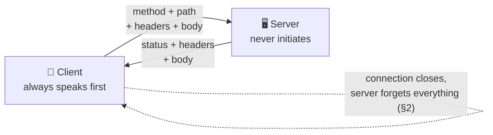

# HTTP & HTTPS

> **Phase:** Networking Deep Dives → **Topic:** 2 of 7 → **Read time:** ~60 minutes

---

## Before You Begin

**This document stands alone.** Unlike its neighbours, it assumes you have read nothing else — not the foundation series, not the phase before it, not the topic before it. Everything about HTTP and HTTPS is built here from zero: the message format, the methods, the status codes, statelessness, caching, all three protocol versions, TLS, and certificates. If you know only that "websites use HTTP" and that the `s` means something about security, you are exactly the reader this was written for.

Two consequences of that choice, stated up front so the shape of the document makes sense:

- **Terms get defined where they're used**, even ones a systems engineer would consider obvious — round trip, latency percentile, single point of failure. Skim past what you already know.
- **Neighbouring topics are named, not taught.** REST API design, idempotency keys, TCP's internals, reverse proxies, load balancers, and CDN strategy each have their own full treatment elsewhere in this curriculum. Where they touch HTTP, this document says so and points; it doesn't absorb them. *HTTP and HTTPS themselves are complete here.*

HTTP also appears as one of the six concepts in the **Top 30 Must-Know Concepts** foundation series, where it gets a short introduction. This is that concept's deep-dive.

Here is the question the document answers:

> **What actually happens between "your browser has an address" and "the page appears" — and why has the industry rewritten that answer three times in thirty years?**

Here's the trap it disarms. HTTP looks like the easy part of the stack. It's human-readable, its errors are famous enough to be jokes, and every engineer has typed a `200` and a `404` into a codebase. That familiarity produces a false model: **HTTP as a format** — a text shape with a verb, a path, and a number in it. If HTTP were a format, there would be nothing to say, and it certainly wouldn't have needed three major revisions.

The truth is that HTTP is where a request's real cost is decided. Not the format — the **conversation**: how many times the client and server must talk before useful data moves, whether a connection is reused or rebuilt, whether one slow response blocks nine fast ones, and what encryption adds to all of it. Two systems can speak identical HTTP and differ by a factor of ten in how long a page takes to appear.

> **The mindset shift:** stop reading HTTP as *a format* and start reading it as *a negotiation with a price*. Every version of HTTP — 1.1, 2, 3 — is an attack on the same enemy: **round trips**, the unavoidable there-and-back delay of talking to a machine far away. And every guarantee you add on top — encryption, identity, integrity — is paid for in that same currency, *before* your server does a single useful thing. Learn to count the round trips and you can predict a system's speed without measuring it.

---

## Table of Contents

1. [What HTTP Actually Is](#1-what-http-actually-is)
2. [Statelessness — and How the Web Fakes State](#2-statelessness--and-how-the-web-fakes-state)
3. [HTTP Caching](#3-http-caching)
4. [The Connection Underneath](#4-the-connection-underneath)
5. [HTTP/1.1 and Head-of-Line Blocking](#5-http11-and-head-of-line-blocking)
6. [HTTP/2 — Multiplexing, and the Blocking It Didn't Fix](#6-http2--multiplexing-and-the-blocking-it-didnt-fix)
7. [HTTP/3 and QUIC — Abandoning TCP](#7-http3-and-quic--abandoning-tcp)
8. [HTTPS — What TLS Guarantees, and What It Costs](#8-https--what-tls-guarantees-and-what-it-costs)
9. [Certificates — Chain of Trust and the Expiry Trap](#9-certificates--chain-of-trust-and-the-expiry-trap)
10. [Putting It All Together — A Commerce Team Goes HTTPS-Only](#10-putting-it-all-together--a-commerce-team-goes-https-only)
11. [Final Recap](#11-final-recap)

---

## 1. What HTTP Actually Is

**HTTP** — HyperText Transfer Protocol — is an agreement about the shape of messages. That's genuinely all it is at the base layer: two parties agree that a request looks *like this* and a response looks *like that*, and because everyone agreed, a browser written by one company can talk to a server written by another in a language neither knew about the other.

The agreement has one governing property, and it shapes everything downstream: **the client always speaks first.** A server never initiates. It waits, receives a request, answers, and goes back to waiting. This request–response cycle is the atom of the web, and its one-directionality is why "push" features — live notifications, chat, streaming updates — need either separate protocols or clever workarounds. HTTP has no vocabulary for "the server has something to say."

### A Request Is Four Parts

A raw HTTP request is text. You could type one by hand:

```
POST /orders HTTP/1.1
Host: shop.example.com
Content-Type: application/json
Authorization: Bearer abc123

{"item": "keyboard", "qty": 1}
```

Four components, in order:

| Part | This example | What it carries |
|---|---|---|
| **Method** | `POST` | The verb — what you want done |
| **Path** | `/orders` | Which resource you want it done to |
| **Headers** | `Host`, `Content-Type`, … | Metadata — auth, formats, caching, everything about the request that isn't the request |
| **Body** | `{"item": …}` | The payload. Optional — `GET` requests normally have none |

The blank line between headers and body is structural, not cosmetic: it's how the receiver knows the headers ended. That detail sounds trivial and becomes important in §5, when we look at what it costs to parse a protocol made of text.

### A Response Is Three Parts

```
HTTP/1.1 200 OK
Content-Type: application/json
Cache-Control: max-age=3600

{"orderId": 1042, "status": "confirmed"}
```

A **status code** and its reason phrase, then **headers**, then a **body**. Same blank-line rule.

### The Methods

Methods tell the server what kind of operation you intend. There are more, but these five carry almost all real traffic:

| Method | Intent | Has a body? |
|---|---|---|
| `GET` | Read a resource. Should never change anything | No |
| `POST` | Create something, or submit data for processing | Yes |
| `PUT` | Replace a resource entirely | Yes |
| `PATCH` | Modify part of a resource | Yes |
| `DELETE` | Remove a resource | Usually not |

Two properties of these methods matter enough to name now, because caching (§3) depends on them:

- **Safe** — the method doesn't change server state. `GET` is safe; it only reads. This is precisely why `GET` responses can be cached and `POST` responses generally cannot: you can reuse a stored answer to "what is it?" but never to "make one."
- **Idempotent** — doing it twice has the same effect as doing it once. `GET`, `PUT`, and `DELETE` are idempotent. **`POST` is not** — send it twice and you may create two orders. That asymmetry is why retrying a failed request is dangerous in a way most people discover the hard way.

How to *design* around that — resource naming, API conventions, idempotency keys that make retries safe — belongs to REST API design and is covered fully in Phase 04. Here we only need the property itself, because the protocol's own caching rules are built on it.

### Status Codes Are Five Conversations

The number's first digit is the real information; the rest is detail:

| Class | Means | Common members |
|---|---|---|
| **1xx** | Informational — hold on, still going | `101 Switching Protocols` |
| **2xx** | It worked | `200 OK`, `201 Created`, `204 No Content` |
| **3xx** | Look elsewhere | `301 Moved Permanently`, `304 Not Modified` |
| **4xx** | **You** made a mistake | `400`, `401 Unauthorized`, `403 Forbidden`, `404 Not Found`, `429 Too Many Requests` |
| **5xx** | **I** made a mistake | `500 Internal Server Error`, `502 Bad Gateway`, `503 Service Unavailable` |

The 4xx/5xx split is the one to internalise, because it assigns blame and therefore assigns the person who should be paged. A `404` means the client asked for something that isn't there — nothing is broken. A `500` means the server failed at something it should have handled. Monitoring that treats them alike will either wake you for typos or stay silent through outages.

Two members are worth flagging early. **`304 Not Modified`** is the backbone of §3's caching — a response whose entire purpose is to have no body. And **`429 Too Many Requests`** is the server telling you to slow down, which matters in §4 when we discuss connection reuse.



> 💡 **Key Insight**
>
> HTTP is a **strict turn-taking conversation the client always starts** — and that single constraint explains far more than it looks like it should. It's why real-time features need workarounds (the server can't speak first). It's why `GET` can be cached and `POST` can't (safety). It's why retries are dangerous (`POST` isn't idempotent). The format is trivia you can look up; the *shape of the conversation* is the part that determines what you can build.

### Quick Recap — What HTTP Actually Is

- HTTP is an agreed **message shape**: request = method + path + headers + body; response = status + headers + body.
- The **client always speaks first** and the server never initiates — which is why server-push features need separate mechanisms.
- Methods carry two properties that the rest of the protocol builds on: **safe** (`GET` changes nothing → cacheable) and **idempotent** (repeatable safely — `POST` is neither).
- Status codes matter mostly by **first digit**, and the `4xx`/`5xx` split assigns blame: client error versus server failure.
