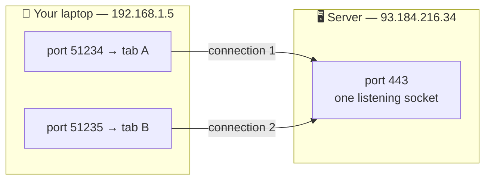
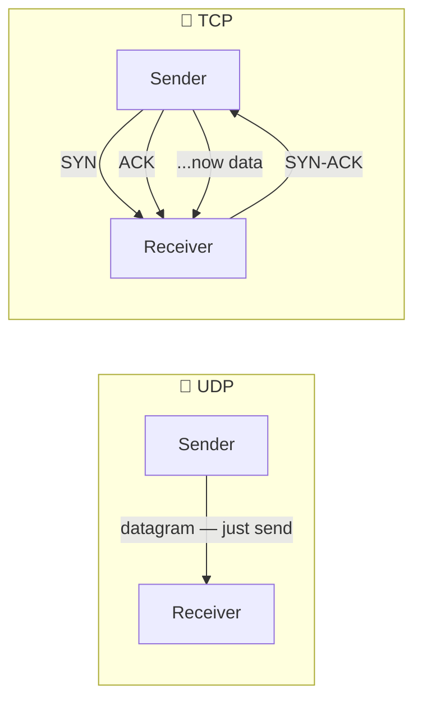
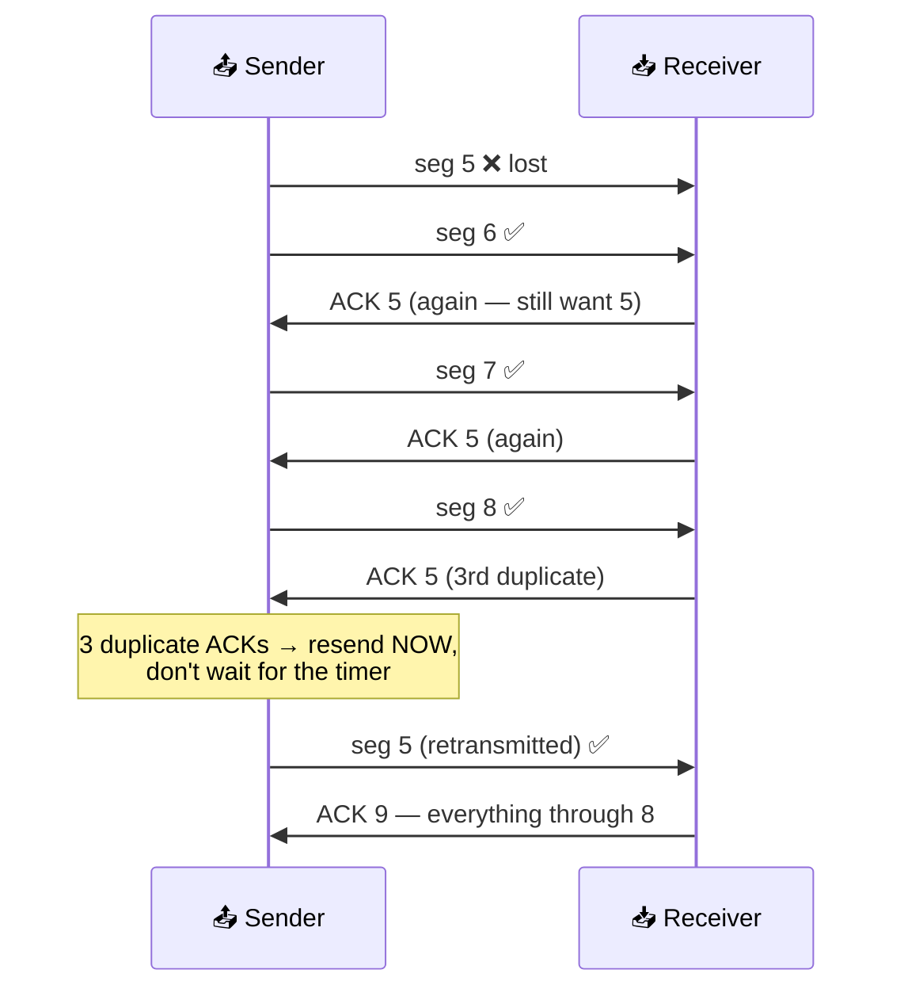
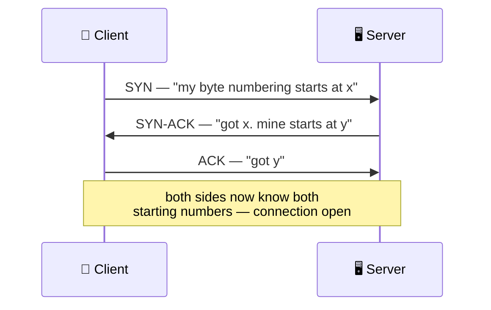
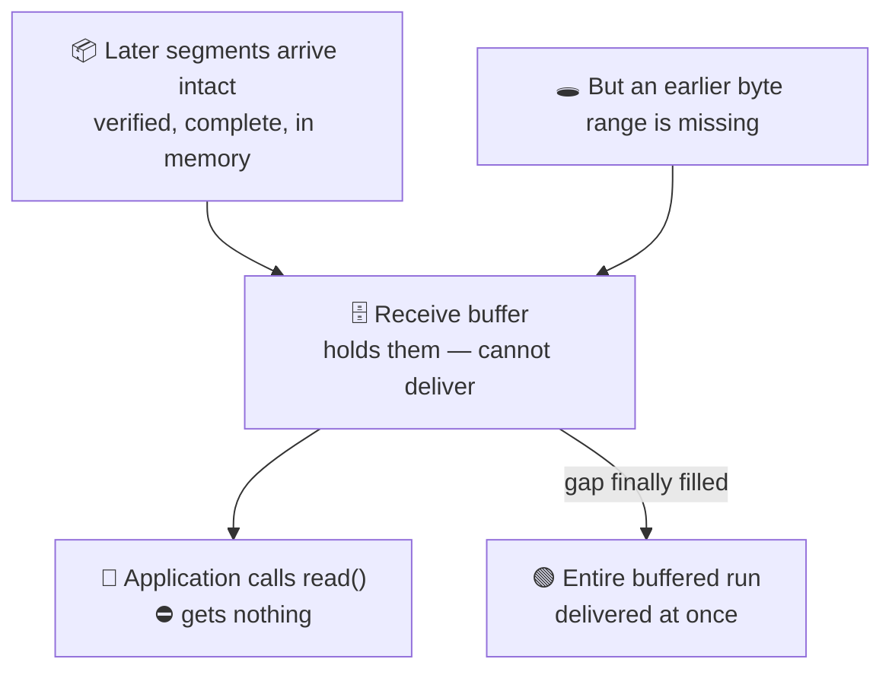
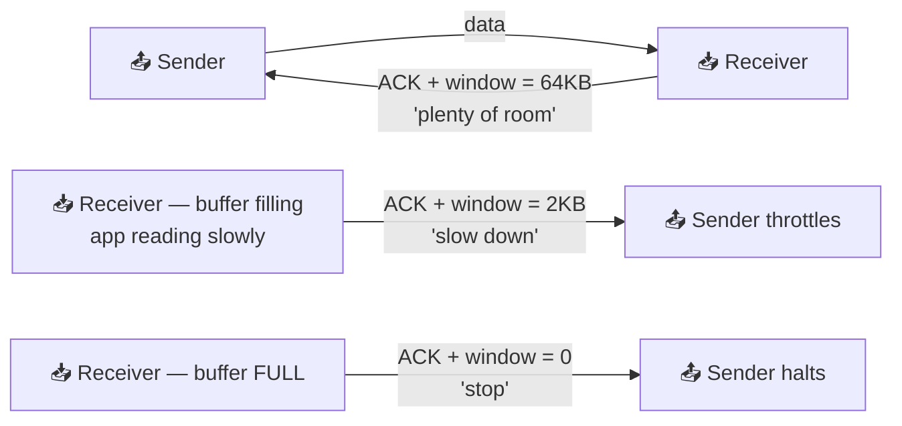
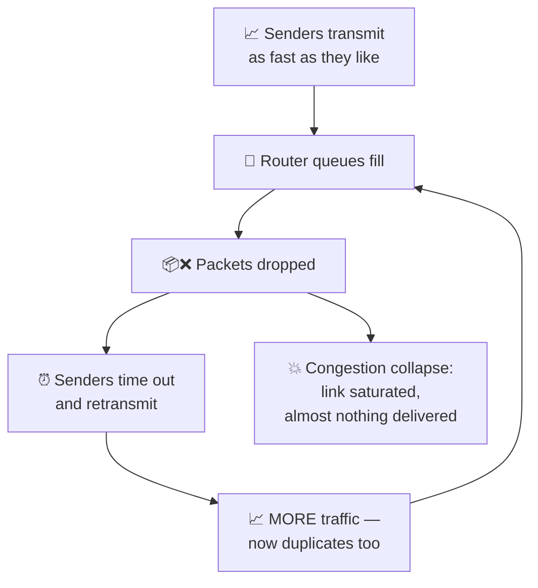
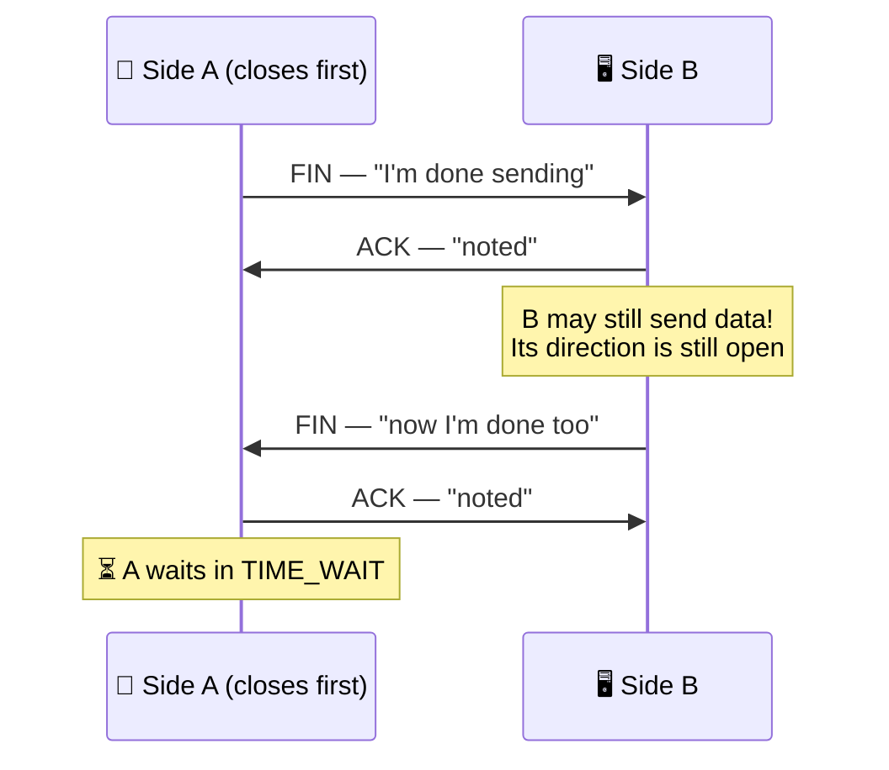

# TCP vs UDP

> **Phase:** Networking Deep Dives → **Topic:** 3 of 7 → **Read time:** ~60 minutes

---

## Before You Begin

**This document stands alone.** It assumes you have read nothing else — not the foundation series, not the phase before it, not the topics before it. Everything about the transport layer is built here from zero: ports and sockets, what UDP is, how TCP manufactures reliability out of a network that offers none, flow control, congestion control, the connection lifecycle, and why the newest protocol on the web threw TCP away. If you know only that "TCP is the reliable one," you are exactly the reader this was written for.

Two consequences of that choice:

- **Terms get defined where they're used** — port, socket, datagram, MTU, jitter, bufferbloat. Skim past what you already know.
- **Neighbouring topics are named, not taught.** HTTP's semantics, proxies, load balancers, checksums, and CDN strategy each have their own full treatment elsewhere in this curriculum. Where they touch transport, this document says so and points; it doesn't absorb them. *TCP and UDP themselves are complete here.*

TCP vs UDP is one of the concepts promised in the **Top 30 Must-Know Concepts** foundation series' opening. This is where that promise is paid in full.

Here is the question the document answers:

> **A network can lose your data, reorder it, duplicate it, or deliver it late — and it never tells you which. So how does anything work at all, and why do some of the most important systems on the internet deliberately refuse the machinery that fixes it?**

Here's the trap it disarms. TCP is introduced to nearly everyone as *the reliable one* and UDP as *the unreliable one*, which frames the whole subject as a quality ranking with an obvious winner. Under that framing, UDP is a legacy curiosity — something you'd only choose by accident.

Then you notice what actually runs on UDP: DNS, every video call you've ever made, live streaming, multiplayer games, most metrics pipelines, and — since HTTP/3 — an enormous and growing share of ordinary web traffic. Those aren't careless choices made by people who didn't know better. They are deliberate, and the reasoning behind them is the most useful thing in this document.

> **The mindset shift:** stop ranking transports as *reliable versus unreliable* and start reading them as **a decision about what happens when a packet goes missing.** TCP says: *everything stops and waits until I get it back.* UDP says: *it's gone — keep going.* Neither answer is correct in general. The right one falls out of a single question: **does this data still have value if it arrives late?** For a payment, yes — it's worth any delay to get it right. For the audio frame you should have heard 200 ms ago, no — it is now worthless, and waiting for it only damages what comes after. Reliability isn't a quality you want more of. It's a trade you make against time.

---

## Table of Contents

1. [What the Transport Layer Is For](#1-what-the-transport-layer-is-for)
2. [UDP — The Honest Minimum](#2-udp--the-honest-minimum)
3. [TCP — Building Reliability Out of Nothing](#3-tcp--building-reliability-out-of-nothing)
4. [Ordered Delivery and Head-of-Line Blocking](#4-ordered-delivery-and-head-of-line-blocking)
5. [Flow Control — Don't Overwhelm the Receiver](#5-flow-control--dont-overwhelm-the-receiver)
6. [Congestion Control — Don't Overwhelm the Network](#6-congestion-control--dont-overwhelm-the-network)
7. [The Connection Lifecycle](#7-the-connection-lifecycle)
8. [When UDP Wins](#8-when-udp-wins)
9. [QUIC — Rebuilding TCP on Top of UDP](#9-quic--rebuilding-tcp-on-top-of-udp)
10. [Putting It All Together — A Mobile-First Team Meets the Transport Layer](#10-putting-it-all-together--a-mobile-first-team-meets-the-transport-layer)
11. [Final Recap](#11-final-recap)

---

## 1. What the Transport Layer Is For

To understand what TCP and UDP do, you first have to appreciate how little the layer beneath them offers.

### IP Gives You Almost Nothing

The internet moves data using **IP** — the Internet Protocol. IP takes a chunk of data with a destination address on it and forwards it, router to router, toward that address. A chunk handled this way is a **packet**.

That's the entire service. IP's contract is *"I will try."* Specifically, IP does **not** guarantee:

| IP does not promise | What that means in practice |
|---|---|
| **Delivery** | The packet may vanish. A router's queue fills up, and it drops packets — that's normal operation, not a malfunction |
| **Ordering** | Packets 1, 2, 3 can arrive 3, 1, 2 — they may take different routes with different delays |
| **Uniqueness** | The same packet can arrive twice, if something upstream retransmitted |
| **Integrity notification** | Corruption may be detected and the packet quietly discarded — you aren't told |
| **Any notification at all** | Nothing reports the loss. There is no error message. The packet simply never appears |

That last row is the one that shapes everything else. **Failure in IP is silent.** A lost packet and a slow packet are indistinguishable to the sender — both look like "nothing has arrived yet." Every mechanism in this document exists because of that ambiguity.

This service is called **best-effort delivery**, and it's a deliberate design choice rather than a shortcoming. Keeping routers simple — no per-connection memory, no delivery tracking — is exactly what let the internet scale to billions of devices. The intelligence was pushed to the endpoints, which is where transport protocols live.

### The Missing Piece — Which Program?

There's a second gap, and it's more basic. An IP address identifies a *machine*. But a machine runs many programs at once — a web server, a database, an SSH daemon, your browser with forty tabs. A packet arrives at the address. **Which program gets it?**

IP has no answer. It addresses buildings, not apartments.

> **A port is a 16-bit number that identifies which program on a machine should receive a packet.** The IP address gets you to the machine; the port gets you to the process.

Ports run from 0 to 65535, with conventions worth knowing:

| Range | Name | Use |
|---|---|---|
| 0–1023 | Well-known | Standard services — 80 (HTTP), 443 (HTTPS), 53 (DNS), 22 (SSH). Usually require elevated privileges to bind |
| 1024–49151 | Registered | Assigned to specific applications — 5432 (PostgreSQL), 3306 (MySQL) |
| 49152–65535 | Ephemeral | Temporary, assigned automatically to client connections |

That last range explains something you may have wondered about. When your browser connects to a website, *it* also needs a port — so the reply knows where to come back to. The operating system assigns a random unused one from the ephemeral range. You never see it, and it's discarded when the connection ends.

### Sockets and the Four-Tuple

Combine an address and a port and you get an endpoint:

> **A socket is the combination of an IP address and a port — one specific communication endpoint on one specific machine.**

A single connection needs two of them, and the pair is what makes each connection distinguishable:



Both tabs talk to the *same* server IP and the *same* server port. They don't collide, because a connection is identified by **four** values together — the **four-tuple**:

```
source IP  +  source port  +  destination IP  +  destination port
```

Change any one of the four and it's a different connection. This is how one web server holds tens of thousands of simultaneous connections on port 443: every client contributes a distinct source IP and source port, so every four-tuple is unique.

It also has a consequence worth filing away for §7 and §9. Your **source IP is part of your connection's identity** — so if it changes, the connection isn't "moved," it's *gone*. That's exactly what happens when a phone leaves Wi-Fi for cellular.

### The Two Answers

So the transport layer inherits a network that loses things silently and can't tell programs apart. It must at minimum add ports. Everything beyond that is optional — and the two protocols represent opposite answers about how much of it to build:

| | **UDP** | **TCP** |
|---|---|---|
| Adds ports | ✅ | ✅ |
| Detects corruption | ✅ (checksum) | ✅ |
| Guarantees delivery | ❌ | ✅ |
| Guarantees ordering | ❌ | ✅ |
| Connection concept | ❌ | ✅ |
| Adapts to network conditions | ❌ | ✅ |
| Header size | 8 bytes | 20+ bytes |

UDP does the minimum required to be useful. TCP builds an entire reliability apparatus on top. The next two sections take each in turn.

> 💡 **Key Insight**
>
> The internet's foundation is **best-effort and silently unreliable** — packets are dropped, reordered, and duplicated as a matter of normal operation, and nothing reports it. That wasn't a compromise; keeping the middle of the network dumb is what let it scale. The consequence is that **every guarantee you have ever relied on was manufactured at the endpoints**, by software, out of a service that promises nothing. TCP is not "the network being reliable." It's an elaborate illusion of reliability, and §3 is how the trick is done.

### Quick Recap — What the Transport Layer Is For

- **IP is best-effort**: it may drop, reorder, or duplicate packets, and it reports none of it — loss and slowness look identical to the sender.
- A **port** (0–65535) identifies *which program* on a machine gets the data; a **socket** is one address-plus-port endpoint.
- A connection is identified by the **four-tuple** (source IP + source port + destination IP + destination port) — which is why thousands of clients share port 443 without collision, and why a changed IP kills a connection.
- **UDP adds almost nothing** to IP; **TCP adds an entire reliability layer** — the same raw network underneath, two opposite decisions about how much to fix.

---

## 2. UDP — The Honest Minimum

**UDP** — the User Datagram Protocol — is the smaller answer, and the easiest way to understand it is to look at everything it contains. The entire header is **8 bytes**, four fields:

| Field | Size | Purpose |
|---|---|---|
| Source port | 2 bytes | Which program sent it |
| Destination port | 2 bytes | Which program should receive it |
| Length | 2 bytes | How big this datagram is |
| Checksum | 2 bytes | Detect corruption in transit |

That's the whole protocol. Compare it against what §1 said the network lacks, and notice how little UDP repairs: it adds ports so the right program gets the data, and a checksum so corrupted data can be *detected*. Everything else on that list of failures — loss, reordering, duplication — passes straight through, untouched and unmentioned.

### "Unreliable" Is a Technical Term

The word *unreliable* attached to UDP is precise, not derogatory. It means one specific thing:

> **UDP makes no promise that data will arrive, and no promise about what order it arrives in. It does not retry, does not track what it sent, and does not tell you when something is lost.**

It does not mean UDP is buggy, flaky, or low-quality. On a healthy network, UDP datagrams arrive reliably in practice — the protocol simply refuses to *guarantee* it. And that refusal is the feature, because guaranteeing it is what costs time (§4, §6).

A **datagram** is UDP's unit of data, and it differs from TCP's model in a way that matters:

| | UDP: datagrams | TCP: a byte stream |
|---|---|---|
| Boundaries | **Preserved** — send 3 datagrams, receive 3 | **Erased** — send 3 writes, may read 1 blob or 5 |
| Receiver gets | Discrete messages | An undifferentiated flow of bytes |
| Framing work | None — the message *is* the unit | You must delimit messages yourself |

This is an underrated UDP advantage. If your data is naturally message-shaped — one sensor reading, one game state update, one DNS query — UDP hands you exactly the message you sent. TCP gives you a stream of bytes and leaves you to work out where one message ends and the next begins, which is why TCP-based protocols all carry length prefixes or delimiters.

### What UDP Does Not Do — and What That Buys

The absences are the point. Each one removes a cost:

| Absent | The cost it removes |
|---|---|
| **No handshake** | No round trip before sending — the first datagram carries real data |
| **No acknowledgments** | No return traffic, no waiting to confirm receipt |
| **No retransmission** | Lost data stays lost — never delays what comes after |
| **No ordering** | Data is delivered the instant it arrives, not when its predecessor does |
| **No connection state** | A server holds no per-client memory — enormous scaling implications |
| **No congestion control** | Sends at whatever rate you choose (a double-edged property — §6) |



That "no connection state" row deserves emphasis, because it's invisible until it matters. A TCP server maintains a data structure for every open connection — buffers, sequence numbers, timers, window sizes. Ten thousand connections means ten thousand of those. A UDP server can serve ten thousand clients holding **nothing** per client; each datagram arrives self-contained, is handled, and is forgotten. For services fielding enormous numbers of brief, independent interactions — DNS being the definitive case (§8) — that difference is decisive.

### Building on UDP

Because UDP is nearly nothing, it's a *foundation* rather than a finished product. Applications that need some guarantee but not all of TCP's build exactly what they need on top:

- A game might retransmit *only* the player's own actions, letting other players' stale positions drop.
- A video protocol might add sequence numbers for reordering but never retransmit — a late frame is useless anyway.
- QUIC, as §9 shows, rebuilt nearly all of TCP's reliability on UDP, but with one crucial structural change TCP couldn't make.

This is the real reason UDP endures. It isn't a worse TCP; it's an **unopinionated substrate**. TCP hands you a comprehensive policy about failure. UDP hands you a blank page.

> 💡 **Key Insight**
>
> UDP's 8-byte header is the entire protocol, and its omissions are deliberate rather than unfinished. What it really provides is **the ability to decide for yourself what "failure" means** — because TCP's answer, *stop everything and retry until it arrives*, is a policy, and policies that are right for a file transfer are wrong for a live voice call. Choosing UDP isn't choosing unreliability. It's **declining a default** so you can define your own.

### Quick Recap — UDP

- UDP's entire header is **8 bytes** — source port, destination port, length, checksum. It adds addressing and corruption *detection* to IP, and nothing else.
- **"Unreliable" is precise, not pejorative**: no delivery promise, no ordering promise, no retries, no notification of loss.
- It preserves **message boundaries** (datagrams), holds **no per-client state**, and requires **no handshake** — so the first packet carries real data and servers scale without per-connection memory.
- Its emptiness makes it a **substrate**: applications build exactly the guarantees they need on top, which is precisely what QUIC did (§9).

---

## 3. TCP — Building Reliability Out of Nothing

**TCP** — the Transmission Control Protocol — takes the opposite position. On top of the same lossy, unordered, silent network from §1, it presents the application with a guarantee that sounds impossible given what it has to work with:

> **Every byte you send arrives, exactly once, in the order you sent it — or the connection fails and you are told.**

No packet is lost, from the application's point of view. Nothing arrives twice. Nothing arrives out of order. That is a remarkable thing to construct on a foundation that promises none of it, and this section is how the construction works.

### Sequence Numbers — Giving Every Byte an Address

The foundational trick is numbering. **Every byte in a TCP connection has a sequence number**, assigned in order.

Not every packet — every *byte*. If a segment carries 1,000 bytes starting at sequence 5,000, it covers bytes 5,000 through 5,999, and the next segment starts at 6,000.

(TCP's unit is called a **segment** rather than a packet, though people use the words interchangeably. A segment is the chunk of the byte stream TCP hands to IP.)

Numbering alone solves two of §1's three problems immediately:

- **Reordering** — segments arriving out of order can simply be sorted, because their numbers say where they belong.
- **Duplication** — a segment whose range has already been received is recognised and discarded.

The third problem, loss, needs more.

### Acknowledgments — Confirming What Arrived

The receiver continuously tells the sender what it has. An **ACK** carries a number meaning *"I have everything up to here; send me this next."*

This is **cumulative**: an ACK for 6,000 confirms every byte below 6,000 at once. A single ACK can therefore confirm many segments, and a lost ACK is often harmless — the next one covers the same ground.

Now the sender has what the raw network refused to give it: **feedback**. It knows what arrived. Anything it sent but hasn't seen acknowledged is still in doubt, and it keeps a copy precisely so it can send it again.

### Retransmission — Two Ways to Notice Loss

**The timer.** Every segment sent starts a countdown. If no acknowledgment arrives before it expires, TCP assumes loss and resends. The timeout is derived from measured round-trip time and adapts continuously — too short and you flood the network with needless duplicates; too long and recovery crawls.

**The duplicate-ACK trick.** Waiting for a timer is slow, so TCP watches for a distinctive pattern. Suppose segment 5 is lost but 6, 7, and 8 arrive. The receiver can only acknowledge through 4 — so it re-sends *the same ACK* each time something arrives out of order:



Three duplicate ACKs is treated as strong evidence of a specific loss, and TCP resends immediately. This is **fast retransmit**, and it recovers in roughly one round trip instead of waiting out a timeout.

There's a refinement worth naming: with plain cumulative ACKs, the receiver can't say *"I got 6, 7, and 8 — just missing 5."* **SACK** (selective acknowledgment) adds exactly that, letting the sender retransmit only the genuine gap instead of guessing. Without it, a sender may resend data that already arrived.

### The Handshake — What's Actually Being Exchanged

TCP opens a connection with three messages. The count is famous; the *reason* usually isn't.



The handshake exists to **synchronise sequence numbers** — that's what the SYN flag means, *synchronise*. Each side picks a starting number and must confirm it learned the other's, because every mechanism above depends on both parties agreeing where the numbering begins.

So why three messages and not two? Because each direction needs its own confirmed starting point, and confirmation requires a reply:

1. `SYN` — client states its start. *Server now knows it.*
2. `SYN-ACK` — server confirms the client's **and** states its own. *Client now knows both.*
3. `ACK` — client confirms the server's. *Server now knows the client knows.*

Cut it to two and the server would be sending data while unsure whether the client ever received its starting number. Three is the minimum for **both** sides to have confirmed knowledge — and, incidentally, for the server to have evidence the client can genuinely receive at the address it claims, which matters in §7.

Also note the starting numbers are chosen *randomly*, not started at zero. Predictable sequence numbers would let an attacker forge segments into someone else's connection.

> 💡 **Key Insight**
>
> TCP's reliability is not a network property — it is **bookkeeping**. Number every byte, have the receiver report what arrived, keep a copy of anything unconfirmed, and resend on either a timer or a suspicious pattern of duplicate ACKs. Every guarantee follows from those four moves. This is worth internalising because it reveals the cost: reliability requires the sender to **remember**, the receiver to **report**, and both to **wait** — and §4 is what that waiting does to everything queued behind a loss.

### Quick Recap — TCP's Reliability Machinery

- **Every byte gets a sequence number**, which alone solves reordering (sort by number) and duplication (discard known ranges).
- **Cumulative ACKs** report the highest contiguous byte received, giving the sender the feedback IP never provides.
- Loss is detected two ways: a **retransmission timer** (slow, adaptive) and **fast retransmit** on three duplicate ACKs (~1 RTT); **SACK** narrows resends to the actual gap.
- The **three-way handshake synchronises starting sequence numbers** — three messages because each direction needs its own start *confirmed*, and the numbers are random to prevent forgery.

---

## 4. Ordered Delivery and Head-of-Line Blocking

§3 built reliability and treated ordering as a pleasant side effect of numbering. It isn't a side effect. **In-order delivery is a promise TCP makes to the application**, and honouring it has a cost that nothing else in this document can work around.

### The Promise Lives in the Read Call

To see where the cost comes from, look at the interface TCP exposes. An application reads from a socket and receives *the next bytes in the stream*. There is no other option. The API has no way to express "give me whatever has arrived" or "skip ahead" — it hands over bytes in sequence order, always.

So consider what the receiving TCP must do when a gap opens. Later segments have arrived. They are intact, verified, sitting in kernel memory. The application is asking for data. And TCP cannot hand any of it over, because doing so would deliver bytes out of order and break the one guarantee the application is relying on.

Those later bytes go into the **receive buffer** — a holding area for data that has arrived but cannot yet be delivered:



The data is *there*. The application is *asking*. TCP says no — correctly. This is the protocol working exactly as designed.

> **Head-of-line blocking: data that has already arrived cannot be used, because something that arrived earlier in the sequence has not.**

### What It Costs, in Time

The delay is not the loss — it's the *recovery*, and recovery is priced in round trips. A **round trip** is one message out plus its reply back; on a mobile network that's commonly 50–100 ms, cross-ocean 150 ms or more.

| Recovery path | Cost |
|---|---|
| Fast retransmit (3 duplicate ACKs, §3) | ~1 round trip |
| Retransmission timer | The full timeout — often several hundred ms |

During that entire window, everything behind the gap is frozen. On a 100 ms link, a single lost segment recovered by fast retransmit stalls the stream for roughly 100 ms — and if the retransmission is *itself* lost, you wait again.

Note the asymmetry that makes this painful: **the stall is caused by one segment, but paid by all of them.** A hundred segments may be sitting ready behind a single missing one, and none can be used.

### The Guarantee Is Connection-Wide

Here is the property that matters most, and the one that eventually forces a redesign.

TCP's ordering guarantee applies to **the entire connection as a single sequence**. It has no concept of independent substreams. A TCP connection is one numbered stream of bytes, start to finish — and *any* gap blocks *everything* after it, regardless of whether the blocked data has any logical relationship to the missing data.

If you multiplex several independent things over one TCP connection — several files, several requests, several logical channels — TCP cannot know they're independent. It sees one byte stream. A loss affecting one of them stalls all of them, because they share a sequence space:

| | Data behind the gap | Blocked? |
|---|---|---|
| Same logical message | Yes | ✅ Correct — it genuinely depends on the missing bytes |
| A *different*, unrelated message | Yes | ❌ Needless — nothing about it depends on the gap |

That second row is pure waste, and it is unavoidable within TCP. The protocol lacks the vocabulary to say "these bytes are independent of those bytes."

This is why the problem cannot be solved by any layer above TCP. A higher-level protocol can label its own messages as independent, but it hands everything to a transport that erases the distinction the moment it enters the byte stream. **You cannot restore independence above a layer that has already discarded it.** Fixing this requires a transport whose ordering is per-substream rather than per-connection — which is §9.

### Why Not Just Turn Ordering Off

You can't, and the reason is instructive: ordering isn't a separable feature. It's entangled with reliability itself. Detecting loss depends on noticing a gap in the sequence — which is the same mechanism that enforces order. Remove in-order delivery and you remove the machinery that knows something is missing.

Which leaves exactly one alternative, and you already met it in §2: a transport that never promised ordering, so nothing is ever held back. UDP delivers each datagram the instant it arrives, gaps and all. Head-of-line blocking is structurally impossible there — not because UDP solved it, but because UDP never took on the obligation that creates it.

> ⚠️ **Head-of-line blocking is not a TCP bug, and no amount of tuning removes it.** It is the direct, unavoidable cost of the in-order guarantee — the same guarantee that makes TCP worth using. Any transport that promises ordered delivery over a lossy network *must* stall on gaps; that's what the promise means. The only escapes are to drop the guarantee (UDP) or to make its scope narrower than the whole connection (§9). Everything else is rearranging where the stall happens.

### Quick Recap — Ordered Delivery and Head-of-Line Blocking

- The socket API can only hand the application **the next bytes in sequence** — so arrived-but-early data must wait in the **receive buffer**, unusable.
- **Head-of-line blocking**: one missing range freezes everything behind it for a full recovery cycle — ~1 round trip via fast retransmit, far longer on a timeout.
- TCP's ordering is **connection-wide**, with no notion of independent substreams — so multiplexing unrelated data over one connection makes them share each other's stalls needlessly.
- Ordering **can't simply be disabled** — gap detection is how loss is detected. The only escapes are abandoning the guarantee (UDP, §2) or narrowing its scope (§9).

---

## 5. Flow Control — Don't Overwhelm the Receiver

TCP now delivers reliably and in order. One question remains unanswered: **how fast should it send?**

There are two separate answers, and conflating them is the most common confusion in this subject. This section covers the first.

| | **Flow control** (§5) | **Congestion control** (§6) |
|---|---|---|
| Protects | The **receiver** | The **network** in between |
| Problem | A fast sender drowning a slow reader | Everyone collectively overloading shared links |
| Signal | The receiver states its capacity explicitly | Inferred — nobody reports it |
| Mechanism | Receive window | Congestion window |

Flow control is the easy one, because the constrained party can simply *say so*.

### The Receiver Has a Finite Buffer

Data arriving at a machine lands in the receive buffer (§4) and waits for the application to read it. That buffer has a fixed size — and the application drains it at its own pace, which may be far slower than the network delivers.

A server on a fast connection can transmit far faster than a phone with a busy CPU can consume. Without a brake, the buffer fills, and every subsequent segment is discarded — forcing retransmissions of data that *did* arrive, wasting bandwidth to re-send bytes the receiver already had but couldn't store.

### The Receive Window — Advertised Capacity

The fix is direct. Every TCP segment carries a **window** field, and the receiver uses it to state exactly how much buffer space remains:

> **The receive window is the receiver telling the sender: "I can accept this many more bytes right now." The sender may never have more than that amount unacknowledged and in flight.**

It updates continuously. As the application reads and frees space, the window grows; as data piles up unread, it shrinks.



This is a **sliding window**: as bytes are acknowledged and space frees, the window advances over the stream. It also serves a second purpose worth noting — it lets the sender keep *multiple* segments in flight without waiting for each to be acknowledged individually. Sending one segment and waiting a full round trip before the next would cap throughput at one segment per RTT, which on a 100 ms link is catastrophically slow. The window is what allows a whole batch to be outstanding at once.

### The Zero Window and Its Deadlock

When the buffer is completely full, the receiver advertises a window of **zero** — *stop sending entirely*. The sender halts.

Now a subtle problem appears. The sender is waiting for an update saying space is available. That update travels in an ACK. But the sender isn't transmitting anything, so the receiver has nothing to acknowledge — and if the window-update message is itself lost, both sides wait forever. The sender waits for permission; the receiver believes it already gave it.

TCP breaks the deadlock with the **window probe**: a sender facing a zero window periodically sends a tiny segment purely to elicit a fresh reply. If the window has reopened, the reply says so. It's a small piece of paranoia guarding against a lost message causing a permanent stall — the kind of detail that distinguishes a protocol that works in a lab from one that works for decades.

### What a Zero Window Actually Tells You

Diagnostically, this is valuable. A persistently zero or tiny receive window means **the receiving application isn't reading fast enough** — the network is fine, TCP is fine, and the bottleneck is the code draining the socket.

That distinction matters when something is slow. If windows are healthy but throughput is poor, look at the network or at congestion (§6). If the window is collapsing toward zero, the problem is on the receiving machine — a consumer that can't keep up, blocked on disk, or starved of CPU. It's one of the few places where a transport-layer number points directly at an application-layer bug.

> 💡 **Key Insight**
>
> Flow control is the **easy** rate-limiting problem, and it's easy for exactly one reason: **the constrained party can announce its own capacity.** The receiver knows its buffer state and states it in every ACK, so the sender never has to guess. Hold onto that, because §6 tackles the same question — how fast to send — with that advantage removed. The network in between has no voice, no window field, and no way to tell you it's overloaded. Everything difficult about congestion control follows from that missing channel.

### Quick Recap — Flow Control

- **Flow control protects the receiver**; congestion control protects the network (§6) — same question, different constrained party.
- The **receive window** is advertised in every ACK: "I can accept this many more bytes." The sender may never exceed it in unacknowledged data.
- The **sliding window** also enables multiple segments in flight — without it, throughput would be capped at one segment per round trip.
- A **zero window** halts the sender, protected from deadlock by periodic **window probes** — and a chronically small window is a direct signal that the *receiving application* is too slow, not the network.

---

## 6. Congestion Control — Don't Overwhelm the Network

Flow control asked the receiver how much it could take. Now the harder question: **how much can the network in between take?**

Nobody will tell you. The routers along the path have no channel to the sender, no window field, no way to report strain. They have exactly one way to express that they're overloaded, and it's brutally indirect: **they drop packets.**

So the sender must infer the state of a network it cannot see, from the absence of acknowledgments, and adjust continuously — while millions of other senders do the same thing on the same shared links, each invisible to the others. That's the problem this section is about, and the internet once failed catastrophically for want of a solution.

### The Collapse That Forced the Fix

In the mid-1980s, a research network's throughput fell by roughly a thousandfold — from its normal capacity to a trickle — without any hardware failing. Nothing broke. The network simply stopped doing useful work.

The mechanism is a feedback loop that turns congestion into more congestion:



> **Congestion collapse: the network is fully occupied, yet almost nothing useful gets through — because most of what it carries is retransmissions of data already dropped.**

The cruelty is that every participant is behaving reasonably. A sender that loses a packet *should* retransmit — that's reliability (§3). But when everyone retransmits into an already-saturated network, the retries become the load. The system does maximum work and delivers minimum value.

The fix, added to TCP in the late 1980s, is one of the most consequential pieces of engineering in the internet's history: senders would voluntarily limit their own rate based on inferred network conditions. **TCP became a good citizen** — and because effectively everyone runs TCP, that voluntary restraint is what keeps the internet functioning.

### The Congestion Window

Alongside the receive window (§5), the sender maintains a second, private limit: the **congestion window**. It is the sender's own estimate of how much the *network* will tolerate.

The actual amount in flight is governed by whichever is smaller:

```
in flight  ≤  min(receive window, congestion window)
                     ↑                    ↑
              receiver's stated       sender's guess about
                capacity (§5)         the network — never told
```

The receive window is *known*. The congestion window is *estimated*, constantly, from evidence.

### Slow Start — Probing Upward

A new connection knows nothing about the path. Rather than guess, TCP starts small and doubles.

The congestion window begins at a handful of segments and **doubles every round trip** as acknowledgments confirm data is getting through. That's exponential growth — "slow start" describes the starting point, not the rate, which is one of networking's more misleading names.

This continues until something signals a limit: a loss, or a configured threshold. The connection has found roughly where the ceiling is by climbing until it hit one.

Slow start has a visible consequence. **A new connection is slow at first, regardless of available bandwidth** — a gigabit link still starts at a few segments and needs several round trips to ramp up. On short transfers, the connection may finish before it ever reaches full speed. This is a large part of why connection reuse matters so much: a warm connection has already done its climbing.

### AIMD — The Sawtooth

After slow start, TCP switches to a more cautious rule, and its shape is worth recognising:

- **Additive increase** — with each successful round trip, grow the window by *one* segment. Cautious, linear probing for more capacity.
- **Multiplicative decrease** — on detecting loss, *halve* the window immediately.

Grow slowly, back off hard. This is **AIMD**, and it produces the characteristic sawtooth of a TCP connection's sending rate — a gradual climb, a sharp drop, repeat.

The asymmetry is deliberate. Being too aggressive risks collapse (the catastrophic outcome); being too conservative merely wastes some capacity (the recoverable one). AIMD is tuned to fail in the safe direction. It also has an elegant property: when multiple connections share a bottleneck, AIMD drives them toward an even split of the available bandwidth without any of them communicating.

### Loss as a Signal, and Where That Breaks

The whole scheme rests on one inference:

> **TCP treats packet loss as evidence of congestion.**

For decades that was sound — on wired links, packets were dropped almost exclusively because a queue overflowed.

On wireless, it's wrong. Radio interference, a weak signal, a moment of physical obstruction — these lose packets for reasons having nothing to do with congestion. TCP sees the loss, concludes the network is overloaded, and halves its window. The link was perfectly capable; the sender throttled anyway. This is a real and persistent cause of poor throughput on mobile and Wi-Fi networks: **TCP misreading interference as congestion and punishing itself.**

### Bufferbloat — When Bigger Buffers Made Things Worse

A final failure mode, and a genuinely counterintuitive one.

Memory got cheap, so network equipment shipped with large buffers — reasoning that a bigger queue drops fewer packets, and dropping packets is bad. It backfired.

TCP's congestion signal *is* packet loss. A very large buffer absorbs the excess instead of dropping it, so the loss signal never arrives. TCP concludes there's room, keeps increasing its rate, and fills the enormous buffer. Everything is now delivered — after sitting in a queue for hundreds of milliseconds, sometimes seconds.

> **Bufferbloat: oversized network buffers destroy latency by suppressing the loss signal that congestion control depends on.**

The symptom is distinctive and widely experienced: a large download starts, and suddenly video calls stutter, games become unplayable, and typing in a terminal lags — while the download itself proceeds at full speed. Throughput is excellent. Latency is ruined. Nothing is "broken," and no packet was lost — which is precisely the problem. The mitigations (smarter queue management that drops or marks packets *early*, deliberately, to restore the signal) amount to reintroducing the loss that the buffers were added to prevent.

> ⚠️ **The most common misdiagnosis in this area is blaming bandwidth for a latency problem.** Slow start means a new connection can't use available bandwidth immediately. Loss-based inference means wireless interference throttles you for no reason. Bufferbloat means a saturated link ruins interactive latency while reporting perfect throughput. In all three the pipe is big enough — the sender's *inference about the pipe* is what's wrong. Buying more bandwidth fixes none of them.

> 💡 **Key Insight**
>
> Congestion control is TCP inferring the state of an invisible, shared network from a single crude signal — **missing acknowledgments** — and voluntarily restraining itself on that basis. It's the internet's most important piece of unenforced cooperation: nothing compels a sender to back off, and the network functions because essentially everyone's TCP does it anyway. That framing also exposes the risk in §2's freedom — **a UDP application has no congestion control unless its author writes some.** Choosing UDP means inheriting this responsibility, not escaping it.

### Quick Recap — Congestion Control

- Routers can't report overload; they only **drop packets**, so the sender must *infer* network state from missing ACKs.
- **Congestion collapse** — a saturated network delivering almost nothing because retransmissions became the load — nearly killed the early internet and forced congestion control into TCP.
- **Slow start** doubles the window each round trip (so new connections are slow regardless of bandwidth); **AIMD** then grows by one segment and **halves on loss** — cautious up, sharp down, converging on a fair share.
- The loss-means-congestion inference **breaks on wireless** (interference read as congestion) and is **defeated by bufferbloat** (huge buffers suppress the signal, trading ruinous latency for throughput).

---

## 7. The Connection Lifecycle

A TCP connection is not an abstraction — it's **state**, held in kernel memory on both machines: sequence numbers, buffers, timers, window sizes. It's created, it lives, and it must be destroyed. Each of those transitions has failure modes that show up in production as symptoms nobody attributes to TCP.

### Closing Takes Four Messages, Not Three

Opening took three (§3). Closing takes four, and the reason is that a TCP connection is really **two independent streams** — one in each direction. Each must be shut down separately.



This is a **half-close**: after A sends `FIN`, it will send no more — but B can keep sending, and A must keep receiving. The connection is genuinely half-open, legitimately, and only fully closed once both directions have said `FIN` and been acknowledged.

### TIME_WAIT — The State That Accumulates

After the final ACK, the side that closed first doesn't free the connection. It enters **TIME_WAIT** and sits there — typically for one to four minutes.

This looks like waste, and it is the single most commonly "optimised away" TCP behaviour by people who don't know what it prevents. It exists for two reasons:

1. **The final ACK might be lost.** If it is, the other side retransmits its `FIN`, and something must remain alive to answer. Free the state immediately and that retransmission gets a confusing rejection instead of an acknowledgment.
2. **Stray segments from this connection may still be wandering the network.** A delayed duplicate could arrive minutes late. If the same four-tuple (§1) were immediately reused, that ancient segment would be delivered into a *brand-new* connection — corrupting it with data from a dead one. TIME_WAIT holds the four-tuple hostage until any stragglers have certainly expired.

The operational consequence bites at scale. **A server that closes many short connections accumulates TIME_WAIT entries** — tens or hundreds of thousands of them — each consuming a small amount of memory and, more importantly, occupying a four-tuple. Since the client side of that tuple draws from the ephemeral port range (§1), which holds only ~16,000 usable ports per destination, a machine making many rapid outbound connections to the *same* destination can genuinely run out.

The symptom is memorable: connections start failing not because anything is down, but because the machine has no unused four-tuple left. It looks like a network outage and is actually an accounting limit.

The correct fixes are architectural, not a shortened timer: **reuse connections** rather than opening and closing them (keep-alive and connection pooling), and note *which side closes first* — whoever closes first pays the TIME_WAIT cost, which is why having clients close is often preferable to having servers do it.

### SYN Floods — Attacking the Half-Open State

The handshake (§3) creates an asymmetry that can be weaponised.

When a server receives a `SYN`, it must allocate state to remember the pending connection, then reply `SYN-ACK` and wait for the final `ACK`. That connection is now **half-open** — resources committed, handshake incomplete.

An attacker sends `SYN` after `SYN`, never completing any of them, often from forged source addresses so the `SYN-ACK` goes nowhere. Each costs the attacker almost nothing — a single small packet — and costs the server a state allocation plus a timeout period. The queue of half-open connections fills, and legitimate handshakes are refused.

This is a **SYN flood**, and its shape is worth generalising: *any protocol that commits resources before verifying the other party is real is vulnerable to this class of attack.*

The clever defence, **SYN cookies**, turns the problem inside out. Instead of storing state on `SYN`, the server *encodes* the state into the sequence number it sends back — cryptographically, so it can be verified later. It keeps nothing. If a legitimate `ACK` returns, the server reconstructs the connection state from the number in that ACK. Half-open connections now cost the server **zero memory**, and the flood loses its leverage.

### Connections as a Finite Resource

Pulling these together: a TCP connection consumes memory for buffers, a slot in the kernel's connection table, and a four-tuple that stays reserved through TIME_WAIT after it closes. Servers hit limits on all three.

This is the hidden cost behind UDP's "no connection state" from §2. A UDP server fielding a hundred thousand clients allocates nothing per client — no table entry, no buffers, no TIME_WAIT. There's no lifecycle to manage because there's no connection to have one. For services handling enormous volumes of brief, independent exchanges, that isn't a minor efficiency; it's the difference between feasible and not (§8).

> ⚠️ **TIME_WAIT is not a bug, and disabling it is the classic dangerous "fix."** Every symptom it causes — accumulating sockets, ephemeral-port exhaustion, connection failures at high churn — is real, and the temptation is to shorten or bypass it. But it exists to stop delayed segments from a dead connection being delivered into a live one that reused the same four-tuple, which corrupts data in ways almost impossible to diagnose. The real fix is to **stop churning connections** — reuse them — not to remove the protection against the churn.

### Quick Recap — The Connection Lifecycle

- Closing takes **four messages** because each direction shuts down independently — a **half-close** lets one side finish sending while still receiving.
- **TIME_WAIT** holds the four-tuple for minutes after close, so a lost final ACK can be answered and delayed segments can't poison a reused tuple.
- At high connection churn it causes **socket accumulation and ephemeral-port exhaustion** — failures that mimic a network outage but are really an accounting limit. Fix by reusing connections, not by shortening the timer.
- **SYN floods** exploit resources committed to half-open connections; **SYN cookies** defeat them by encoding state into the sequence number and storing nothing.
