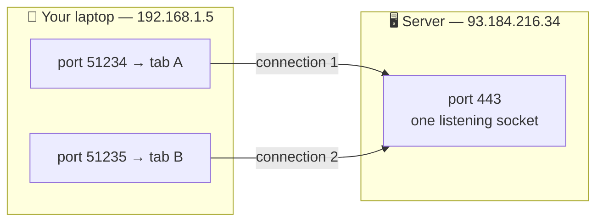

# TCP vs UDP

> **Phase:** Networking Deep Dives → **Topic:** 3 of 7 → **Read time:** ~60 minutes

---

## Before You Begin

**This document stands alone.** It assumes you have read nothing else — not the foundation series, not the phase before it, not the topics before it. Everything about the transport layer is built here from zero: ports and sockets, what UDP is, how TCP manufactures reliability out of a network that offers none, flow control, congestion control, the connection lifecycle, and why the newest protocol on the web threw TCP away. If you know only that "TCP is the reliable one," you are exactly the reader this was written for.

Two consequences of that choice:

- **Terms get defined where they're used** — port, socket, datagram, MTU, jitter, bufferbloat. Skim past what you already know.
- **Neighbouring topics are named, not taught.** HTTP's semantics, proxies, load balancers, checksums, and CDN strategy each have their own full treatment elsewhere in this curriculum. Where they touch transport, this document says so and points; it doesn't absorb them. *TCP and UDP themselves are complete here.*

TCP vs UDP is one of the concepts promised in the **Top 30 Must-Know Concepts** foundation series' opening. This is where that promise is paid in full.

Here is the question the document answers:

> **A network can lose your data, reorder it, duplicate it, or deliver it late — and it never tells you which. So how does anything work at all, and why do some of the most important systems on the internet deliberately refuse the machinery that fixes it?**

Here's the trap it disarms. TCP is introduced to nearly everyone as *the reliable one* and UDP as *the unreliable one*, which frames the whole subject as a quality ranking with an obvious winner. Under that framing, UDP is a legacy curiosity — something you'd only choose by accident.

Then you notice what actually runs on UDP: DNS, every video call you've ever made, live streaming, multiplayer games, most metrics pipelines, and — since HTTP/3 — an enormous and growing share of ordinary web traffic. Those aren't careless choices made by people who didn't know better. They are deliberate, and the reasoning behind them is the most useful thing in this document.

> **The mindset shift:** stop ranking transports as *reliable versus unreliable* and start reading them as **a decision about what happens when a packet goes missing.** TCP says: *everything stops and waits until I get it back.* UDP says: *it's gone — keep going.* Neither answer is correct in general. The right one falls out of a single question: **does this data still have value if it arrives late?** For a payment, yes — it's worth any delay to get it right. For the audio frame you should have heard 200 ms ago, no — it is now worthless, and waiting for it only damages what comes after. Reliability isn't a quality you want more of. It's a trade you make against time.

---

## Table of Contents

1. [What the Transport Layer Is For](#1-what-the-transport-layer-is-for)
2. [UDP — The Honest Minimum](#2-udp--the-honest-minimum)
3. [TCP — Building Reliability Out of Nothing](#3-tcp--building-reliability-out-of-nothing)
4. [Ordered Delivery and Head-of-Line Blocking](#4-ordered-delivery-and-head-of-line-blocking)
5. [Flow Control — Don't Overwhelm the Receiver](#5-flow-control--dont-overwhelm-the-receiver)
6. [Congestion Control — Don't Overwhelm the Network](#6-congestion-control--dont-overwhelm-the-network)
7. [The Connection Lifecycle](#7-the-connection-lifecycle)
8. [When UDP Wins](#8-when-udp-wins)
9. [QUIC — Rebuilding TCP on Top of UDP](#9-quic--rebuilding-tcp-on-top-of-udp)
10. [Putting It All Together — A Mobile-First Team Meets the Transport Layer](#10-putting-it-all-together--a-mobile-first-team-meets-the-transport-layer)
11. [Final Recap](#11-final-recap)

---

## 1. What the Transport Layer Is For

To understand what TCP and UDP do, you first have to appreciate how little the layer beneath them offers.

### IP Gives You Almost Nothing

The internet moves data using **IP** — the Internet Protocol. IP takes a chunk of data with a destination address on it and forwards it, router to router, toward that address. A chunk handled this way is a **packet**.

That's the entire service. IP's contract is *"I will try."* Specifically, IP does **not** guarantee:

| IP does not promise | What that means in practice |
|---|---|
| **Delivery** | The packet may vanish. A router's queue fills up, and it drops packets — that's normal operation, not a malfunction |
| **Ordering** | Packets 1, 2, 3 can arrive 3, 1, 2 — they may take different routes with different delays |
| **Uniqueness** | The same packet can arrive twice, if something upstream retransmitted |
| **Integrity notification** | Corruption may be detected and the packet quietly discarded — you aren't told |
| **Any notification at all** | Nothing reports the loss. There is no error message. The packet simply never appears |

That last row is the one that shapes everything else. **Failure in IP is silent.** A lost packet and a slow packet are indistinguishable to the sender — both look like "nothing has arrived yet." Every mechanism in this document exists because of that ambiguity.

This service is called **best-effort delivery**, and it's a deliberate design choice rather than a shortcoming. Keeping routers simple — no per-connection memory, no delivery tracking — is exactly what let the internet scale to billions of devices. The intelligence was pushed to the endpoints, which is where transport protocols live.

### The Missing Piece — Which Program?

There's a second gap, and it's more basic. An IP address identifies a *machine*. But a machine runs many programs at once — a web server, a database, an SSH daemon, your browser with forty tabs. A packet arrives at the address. **Which program gets it?**

IP has no answer. It addresses buildings, not apartments.

> **A port is a 16-bit number that identifies which program on a machine should receive a packet.** The IP address gets you to the machine; the port gets you to the process.

Ports run from 0 to 65535, with conventions worth knowing:

| Range | Name | Use |
|---|---|---|
| 0–1023 | Well-known | Standard services — 80 (HTTP), 443 (HTTPS), 53 (DNS), 22 (SSH). Usually require elevated privileges to bind |
| 1024–49151 | Registered | Assigned to specific applications — 5432 (PostgreSQL), 3306 (MySQL) |
| 49152–65535 | Ephemeral | Temporary, assigned automatically to client connections |

That last range explains something you may have wondered about. When your browser connects to a website, *it* also needs a port — so the reply knows where to come back to. The operating system assigns a random unused one from the ephemeral range. You never see it, and it's discarded when the connection ends.

### Sockets and the Four-Tuple

Combine an address and a port and you get an endpoint:

> **A socket is the combination of an IP address and a port — one specific communication endpoint on one specific machine.**

A single connection needs two of them, and the pair is what makes each connection distinguishable:



Both tabs talk to the *same* server IP and the *same* server port. They don't collide, because a connection is identified by **four** values together — the **four-tuple**:

```
source IP  +  source port  +  destination IP  +  destination port
```

Change any one of the four and it's a different connection. This is how one web server holds tens of thousands of simultaneous connections on port 443: every client contributes a distinct source IP and source port, so every four-tuple is unique.

It also has a consequence worth filing away for §7 and §9. Your **source IP is part of your connection's identity** — so if it changes, the connection isn't "moved," it's *gone*. That's exactly what happens when a phone leaves Wi-Fi for cellular.

### The Two Answers

So the transport layer inherits a network that loses things silently and can't tell programs apart. It must at minimum add ports. Everything beyond that is optional — and the two protocols represent opposite answers about how much of it to build:

| | **UDP** | **TCP** |
|---|---|---|
| Adds ports | ✅ | ✅ |
| Detects corruption | ✅ (checksum) | ✅ |
| Guarantees delivery | ❌ | ✅ |
| Guarantees ordering | ❌ | ✅ |
| Connection concept | ❌ | ✅ |
| Adapts to network conditions | ❌ | ✅ |
| Header size | 8 bytes | 20+ bytes |

UDP does the minimum required to be useful. TCP builds an entire reliability apparatus on top. The next two sections take each in turn.

> 💡 **Key Insight**
>
> The internet's foundation is **best-effort and silently unreliable** — packets are dropped, reordered, and duplicated as a matter of normal operation, and nothing reports it. That wasn't a compromise; keeping the middle of the network dumb is what let it scale. The consequence is that **every guarantee you have ever relied on was manufactured at the endpoints**, by software, out of a service that promises nothing. TCP is not "the network being reliable." It's an elaborate illusion of reliability, and §3 is how the trick is done.

### Quick Recap — What the Transport Layer Is For

- **IP is best-effort**: it may drop, reorder, or duplicate packets, and it reports none of it — loss and slowness look identical to the sender.
- A **port** (0–65535) identifies *which program* on a machine gets the data; a **socket** is one address-plus-port endpoint.
- A connection is identified by the **four-tuple** (source IP + source port + destination IP + destination port) — which is why thousands of clients share port 443 without collision, and why a changed IP kills a connection.
- **UDP adds almost nothing** to IP; **TCP adds an entire reliability layer** — the same raw network underneath, two opposite decisions about how much to fix.
