# Proxy vs Reverse Proxy

> **Phase:** Networking Deep Dives → **Topic:** 4 of 7 → **Read time:** ~55 minutes

---

## Before You Begin

**This document stands alone.** It assumes you have read nothing else — not the foundation series, not the phase before it, not the topics before it. Everything is built here from zero: what an intermediary is, what forward and reverse proxies actually do, what a proxy can and cannot see at each layer, where encryption ends, and why the server at the end of the chain no longer knows who its own users are.

Two consequences of that choice:

- **Terms get defined where they're used** — intermediary, upstream, downstream, Layer 4, Layer 7, TLS termination, trust boundary, NAT. Skim past what you already know.
- **Neighbouring topics are named, not taught.** Load balancer mechanics, balancing algorithms, cache strategy, API gateways, and service meshes each have their own full treatment elsewhere in this curriculum. Where they touch proxies, this document says so and points; it doesn't absorb them. *Proxies themselves are complete here.*

Proxy vs Reverse Proxy is one of the concepts in the **Top 30 Must-Know Concepts** foundation series, where it gets a short introduction. This is that concept's deep-dive.

Here is the question the document answers:

> **When you send a request to a server, how many machines actually handle it before it arrives — and what is each of them allowed to see, change, or decide?**

Here's the trap it disarms. Proxies are usually taught as a naming quiz: *forward proxy sits near the client, reverse proxy sits near the server, memorise which is which.* Learn it that way and you retain a piece of trivia that never once helps you.

The real subject is considerably more unsettling. Every request you have ever traced — every diagram you've drawn with an arrow from a client to a server — almost certainly ended somewhere other than where you thought. Something in between accepted the connection, decrypted it, decided where it should go, possibly answered it outright, and forwarded what remained under its own name. The server you think you're talking to frequently never sees your address, your connection, or your encryption.

> **The mindset shift:** stop asking *"what is a proxy?"* and start asking two questions instead — **who is this intermediary acting for, and how deep can it read?** *Whose agent* separates a forward proxy from a reverse one, and it's the only distinction that matters. *How deep it reads* determines everything else: whether it can route on a URL, whether it must decrypt your traffic first, what it can log, and what it can silently change. Proxies aren't a category of software. They're a **position on the wire** — and the interesting questions are always about what that position lets you do, and what it costs to be there.

---

## Table of Contents

1. [The Request Path Is Never Two Machines](#1-the-request-path-is-never-two-machines)
2. [Forward Proxy — Acting for the Client](#2-forward-proxy--acting-for-the-client)
3. [Reverse Proxy — Acting for the Server](#3-reverse-proxy--acting-for-the-server)
4. [The Same Box Pointing Opposite Ways](#4-the-same-box-pointing-opposite-ways)
5. [L4 vs L7 — What the Proxy Can See](#5-l4-vs-l7--what-the-proxy-can-see)
6. [TLS Termination — Where the Encryption Ends](#6-tls-termination--where-the-encryption-ends)
7. [The Identity Problem — Who Was the Client?](#7-the-identity-problem--who-was-the-client)
8. [What Else the Front Door Does](#8-what-else-the-front-door-does)
9. [The Front Door as Trust Boundary and Failure Point](#9-the-front-door-as-trust-boundary-and-failure-point)
10. [Putting It All Together — Retiring a Monolith Behind a Reverse Proxy](#10-putting-it-all-together--retiring-a-monolith-behind-a-reverse-proxy)
11. [Final Recap](#11-final-recap)

---

## 1. The Request Path Is Never Two Machines

Every introduction to networking draws the same picture: a client on the left, a server on the right, an arrow between them. It's a useful fiction and it is almost never true.

### The Fiction and the Reality

A request from a laptop to a public web service typically passes through several machines that are not the destination. Each one accepts the traffic, does something with it, and passes it on:

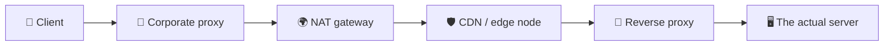

The arrow in the textbook diagram is *five machines*, and only the last one runs the code anyone wrote on purpose. Everything in between is what this document is about.

> **An intermediary is any machine that accepts a request not addressed to it in spirit, and forwards it toward something else — usually changing something along the way.**

The phrase *"not addressed to it in spirit"* is doing real work there. A packet arriving at a proxy is genuinely addressed to that proxy at the network level — that's how it got there. But the *intent* is to reach something behind it. That gap between the address and the intent is the whole idea.

### Upstream and Downstream

Two words you'll meet constantly, and they trip people up because their meaning depends on where you stand:

- **Upstream** — toward the origin, the thing that ultimately answers. From a proxy's view, its upstream is the server it forwards to.
- **Downstream** — toward the client, the thing that asked.

A proxy always sits between a downstream and an upstream. Chain several and each is upstream of the one before it. The **origin** (or origin server) is the machine at the very end that actually produces the response rather than relaying it.

### Proxies You Already Use Without the Name

Intermediaries are not exotic infrastructure. Several are so common they're rarely called proxies at all:

| Thing | What it really is |
|---|---|
| **Home router** | Rewrites your private address to one public address for the whole household |
| **Corporate network** | Forces outbound traffic through a filtering gateway |
| **CDN** | Answers on behalf of a server that may be thousands of kilometres away |
| **Firewall / middlebox** | Inspects and sometimes rewrites traffic in transit |
| **VPN** | Relays all your traffic through an operator you chose |

The router deserves a moment, because it's the intermediary nearly everyone owns. **NAT** — Network Address Translation — is what lets many devices share one public address: the router rewrites the source address on the way out, remembers the mapping, and reverses it on the way back. Every device in the house appears to the internet as the same single address.

That's a proxy in every meaningful sense — it terminates, rewrites, forwards, and maintains state about who asked what. It also produces this document's central consequence in miniature: **a server receiving that traffic cannot distinguish the four people in the house from each other.** §7 is that problem at internet scale.

### Why Put Anything in the Middle

Every intermediary adds a hop, a failure point, and a machine to operate. They persist because a position between two parties lets you do things neither party can do alone — enforce a policy without modifying either side, cache an answer for many askers, hide what's behind you, or change where traffic goes without touching a line of application code.

That last one is the deep reason. An intermediary is **a place to make decisions that would otherwise require changing software you may not control.** §10 is an extended example: a team rerouting traffic away from a monolith without editing the monolith.

> 💡 **Key Insight**
>
> The client→server arrow is a teaching simplification, and treating it as literal is where confusion about proxies starts. Real requests pass through a sequence of machines that each terminate and re-originate the traffic — meaning **the connection your client opened is virtually never the connection your server accepts.** Once you internalise that, the questions in this document stop being abstract: something in the middle decrypted your request, and it had to, or it could not have decided where to send it.

### Quick Recap — The Request Path

- The client→server arrow is a fiction; real requests cross several **intermediaries** that accept traffic and forward it onward.
- **Upstream** points toward the origin, **downstream** toward the client, and the **origin** is whatever finally produces a response instead of relaying one.
- Many familiar things are proxies under other names — home routers doing **NAT**, corporate gateways, CDNs, VPNs.
- Intermediaries earn their cost by being **a place to make decisions without modifying either endpoint** — the property everything else in this document builds on.

---

## 2. Forward Proxy — Acting for the Client

> **A forward proxy is an intermediary that acts on behalf of clients. It sits at the edge of *their* network, receives their outbound requests, and makes those requests to the internet in its own name.**

The defining consequence is what the destination sees. It does not see the client. It sees the proxy — the proxy's address, the proxy's connection. As far as the destination is concerned, the proxy *is* the client.

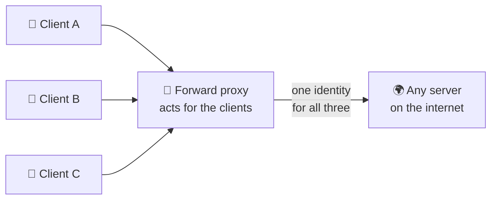

Note the shape: **one proxy, many destinations.** A forward proxy doesn't know or care what's on the other side — today it fetches a news site, tomorrow an API, next an update server. It's bound to its *clients*, not to any particular destination. That asymmetry is what distinguishes it from §3's reverse proxy, which is bound to particular servers and serves any client on Earth.

### Who Deploys One, and Why

Almost always someone with authority over the client machines, wanting a policy enforced without installing anything on each device:

| Motive | What the proxy does |
|---|---|
| **Control** | Blocks categories of destination; enforces acceptable-use policy |
| **Visibility** | Logs every outbound request — a compliance and audit requirement in many industries |
| **Shared caching** | One copy of a common download serves the whole office |
| **Bandwidth** | Compresses or strips content before it reaches a constrained network |
| **Egress identity** | All traffic leaves from one known address, so partners can allow-list it |
| **Privacy** | The user's own address is hidden from the sites they visit |

That last row is the one most people meet first, and it's worth being precise: **the destination no longer knows who you are, but the proxy operator knows exactly who you are and everything you asked for.** You haven't removed the observer; you've *chosen* it. Whether that's a privacy improvement depends entirely on who runs the proxy — which is why "use a proxy for privacy" is advice that means nothing without naming the operator.

### Explicit vs Transparent

A distinction with real operational consequences, and one that's rarely stated plainly:

**Explicit** — the client is configured to use the proxy and *knows* it exists. Browser settings, a system-wide proxy setting, an environment variable. The client deliberately addresses its requests to the proxy.

**Transparent** (or *intercepting*) — the client knows nothing. The network silently redirects outbound traffic to the proxy, which handles it and forwards it on. Nothing was configured on the device; the client believes it's talking directly to the destination.

| | Explicit | Transparent |
|---|---|---|
| Client configuration | Required on every device | **None** |
| Client awareness | Knows the proxy exists | No idea |
| Deployment | Config management, per-device | Network-level, applies to everything |
| Bypassable | Yes — change the setting | No — it's the path itself |
| Debugging | Straightforward | **Confusing** — behaviour with no visible cause |

That last row costs real hours. When a transparent proxy misbehaves, the symptom appears at the application with no indication that an intermediary exists at all — a request that works from one network and fails from another, with identical code and identical configuration. The infamous version is a captive portal in a hotel or airport: your request for one site returns a login page from somewhere else entirely, because something intercepted it.

### The Encryption Wall

Here is the limit that reshaped forward proxies, and it follows directly from HTTPS being everywhere.

When a client wants an encrypted connection through a proxy, it can't simply ask the proxy to fetch a page — the whole point is that only the client and the destination hold the keys. Instead it issues a `CONNECT` request: *open a raw tunnel to this host and port, and relay bytes without interpreting them.*

The proxy complies and becomes a **blind pipe**. Encrypted bytes flow through it in both directions. It can see:

- **The destination hostname** — required to open the tunnel at all
- **Byte counts and timing** — how much, how long, how often

and it cannot see the path requested, the headers, the cookies, the content, or the response. Its filtering degrades from *"block this article"* to *"block this entire domain, or don't."*

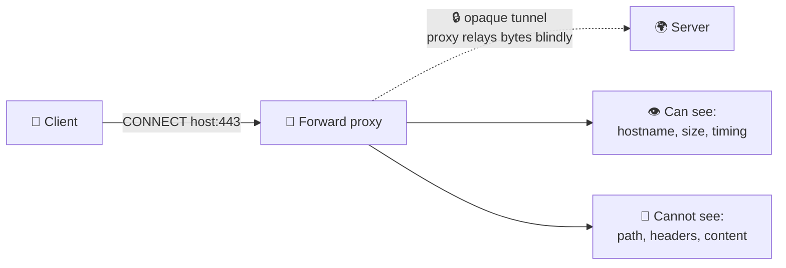

Organisations that need deeper inspection respond by **intercepting TLS**: the proxy terminates the encryption itself, inspects the plaintext, and re-encrypts toward the destination using its own certificate — which it can only do because the organisation installed that certificate as trusted on every managed device. It works, and it means the proxy operator reads everything, including traffic the user believes is private end-to-end. §6 covers the mechanics of terminating encryption and the trust boundary it moves.

> ⚠️ **A forward proxy is a deliberate concentration of visibility.** Every request every client makes flows through one machine that can log all of it. That's precisely the point when it's your organisation's compliance requirement — and precisely the risk when it's an anonymous free proxy you found online. The traffic didn't become unobserved; the observer changed from "each site you visit" to "one operator who sees every site you visit." Always ask who runs it.

### Quick Recap — Forward Proxy

- A **forward proxy acts for clients**: it makes their outbound requests in its own name, so destinations see the proxy rather than the client.
- Its shape is **one proxy, many destinations** — bound to its clients, indifferent to what's on the other side.
- **Explicit** proxies are configured on the client; **transparent** ones intercept silently and produce failures with no visible cause.
- HTTPS turns it into a **blind pipe** via `CONNECT` — hostname, size, and timing only — unless the operator intercepts TLS with a certificate installed on every device (§6).

---

## 3. Reverse Proxy — Acting for the Server

> **A reverse proxy is an intermediary that acts on behalf of servers. It receives incoming requests from the internet, and forwards them to servers behind it that clients never address directly.**

Flip every property of §2 and you have it. The forward proxy served many clients reaching any destination; the reverse proxy serves **any client reaching a particular set of servers.** It's bound to its upstreams, indifferent to who's asking.

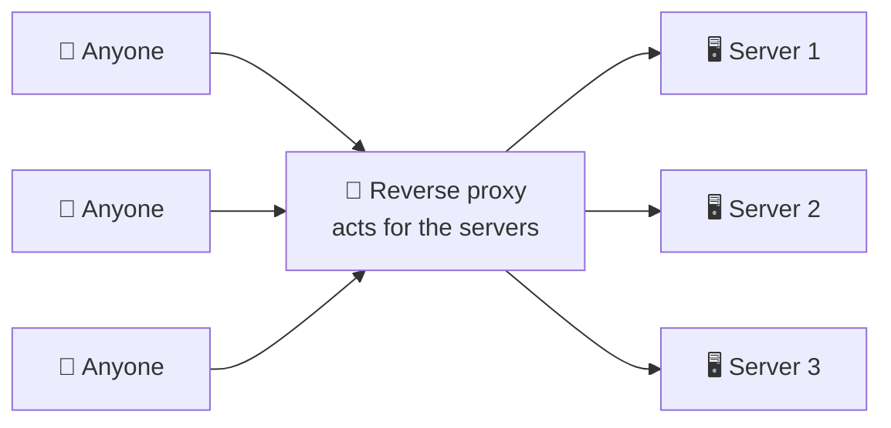

The diagrams for §2 and §3 are mirror images, and that is genuinely the whole distinction — §4 makes it precise.

### The Public Address Is the Point

Here is the structural fact underneath everything a reverse proxy does: **it is the only machine in the system with a publicly reachable address.** The servers behind it hold private addresses, unreachable from the internet. There is no route to them from outside — not blocked by policy, but *nonexistent as a path*.

That single arrangement produces a cascade of consequences:

| Consequence | Why it follows |
|---|---|
| **The fleet is invisible** | Clients cannot address, scan, or attack what has no route |
| **Servers become fungible** | Add, remove, or replace them without anyone outside noticing |
| **One address, many services** | Different paths and hostnames route to entirely different systems |
| **One place for policy** | TLS, authentication, rate limiting applied once at the door |
| **Deploys stop being visible** | Traffic shifts between versions behind a stable public identity |

The second row is the one with the largest downstream effect. Because clients hold no reference to any individual server, the set behind the proxy can change continuously — which is the precondition for running many interchangeable copies of an application at all. Distributing traffic across them is **Topic 05 — Load Balancers**, and choosing *which* one receives each request is **Topic 06 — Load Balancing Algorithms**. This document stops at the position; those two cover the machinery.

### What It Absorbs

Work placed at the reverse proxy is work every server behind it stops doing, and it's the same work every one of them would otherwise duplicate:

- **Encryption** — decrypt once at the door rather than in every application process (§6).
- **Slow clients** — a request arriving over a poor mobile connection can take seconds to fully deliver. The proxy absorbs that trickle and hands the origin a complete request instantly, so an expensive application process isn't held open waiting for bytes.

  The asymmetry here is larger than it sounds. An application worker — a thread or process with a database connection and application memory attached — is a scarce resource, often numbering in the dozens or low hundreds per server. A proxy connection is cheap enough that a single proxy commonly holds **tens of thousands** of them concurrently. Letting a client on a slow connection occupy a worker for two seconds instead of two milliseconds is the difference between a server handling its rated load and collapsing under a fraction of it. This is also the mechanism behind a class of denial-of-service attack that deliberately sends requests as slowly as possible, purely to exhaust worker slots — an attack a buffering proxy absorbs almost entirely.
- **Static content** — served directly, never troubling the application.
- **Malformed and hostile traffic** — rejected before it reaches code that would have to handle it.
- **Connection management** — many short client connections consolidated into a small pool of reused upstream ones.

That third-to-last point is why a reverse proxy improves capacity even with a single server behind it. The application process is the expensive resource; the proxy exists partly to stop it being occupied by work that isn't application work.

### The Naming Confusion, Resolved

Two things share the word *proxy* and point in opposite directions, which is a genuine and lasting source of confusion. One convention helps: **the bare word, spoken without a qualifier, has come to mean the reverse kind.** Reverse proxies are so much more common in production that the client-side variety is the one people bother to label — "forward proxy," "egress proxy," "corporate proxy." If nobody attached an adjective, assume the front door.

> 💡 **Key Insight**
>
> A reverse proxy's power comes from one structural fact: **it holds the only public address, so nothing behind it is reachable or even nameable from outside.** Every benefit follows from that — the fleet is hidden because it's unaddressable, servers are replaceable because no client holds a reference to any of them, and policy has one enforcement point because there's exactly one door. It isn't a load-balancing feature or a caching feature. It's a **position**, and the features are what that position makes possible.

### Quick Recap — Reverse Proxy

- A **reverse proxy acts for servers**: any client reaches it, and it forwards to upstreams that are never addressed directly — the exact mirror of §2.
- It holds the **only public address**; the servers behind it are unreachable from outside, which is what makes them hidden and interchangeable.
- It **absorbs work every server would otherwise duplicate** — decryption, slow clients, static content, hostile traffic, connection churn.
- The **bare word "proxy" has come to mean the reverse kind** — the client-side variety is the one people bother to label.

---

## 4. The Same Box Pointing Opposite Ways

Sections 2 and 3 described two components. It's worth being clear that they may be **the same software, running the same way, doing the same job.** The popular proxy servers are all capable of either role; which one you have is determined entirely by where you put it and whose traffic it handles.

### One Question Decides It

> **Whose agent is it?** A forward proxy acts for the **clients** in front of it. A reverse proxy acts for the **servers** behind it.

Everything else follows from that answer:

| | Forward proxy | Reverse proxy |
|---|---|---|
| Acts for | The **clients** | The **servers** |
| Deployed by | Whoever controls the clients | Whoever controls the servers |
| Bound to | Its clients (any destination) | Its upstreams (any client) |
| Hides | The client, from the destination | The servers, from the client |
| Client knows it exists? | Sometimes (explicit) or never (transparent) | **Never** — it looks like the server |
| Shape | Many clients → one proxy → the internet | The internet → one proxy → many servers |

The row worth pausing on is the second-to-last. A reverse proxy is not merely unannounced; **to the client it is indistinguishable from the origin.** It answers on the origin's hostname, presents the origin's certificate, and returns the origin's responses. There is no reliable way for an outside client to determine whether it's talking to the real server or something in front of it — and that indistinguishability is the entire design goal.

### The Taxonomy — What Else Is a Reverse Proxy

Once you have the definition, a large amount of infrastructure resolves into the same pattern wearing different job descriptions. Each of these accepts traffic on behalf of servers behind it — they differ only in what they emphasise:

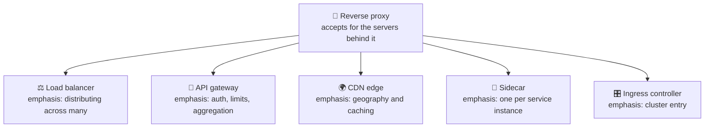

| Specialisation | What it adds | Covered in |
|---|---|---|
| **Load balancer** | Distributes across many upstreams; tracks their health | Topics 05–06 |
| **API gateway** | Authentication, rate limiting, request aggregation, versioning | Phase 04 |
| **CDN edge** | Geographic distribution; caches near users | Phase 06 |
| **Sidecar** | One proxy per service instance, handling all its traffic | Phase 09 |
| **Ingress controller** | The entry point into a container cluster | Phase 09 |

This resolves a question that otherwise recurs indefinitely — *"is a load balancer a proxy? is an API gateway a load balancer?"* They're all the same position on the wire, with different features foregrounded. A load balancer is a reverse proxy whose emphasis is distribution. An API gateway is a reverse proxy whose emphasis is policy. A CDN edge is a reverse proxy whose emphasis is geography.

Real deployments blur them further: one component often plays several of these roles simultaneously, and a request may pass through three of them before reaching an origin. Arguing about the labels is unproductive. Asking **"whose agent is this, and what does it emphasise?"** always works.

> 💡 **Key Insight**
>
> Forward and reverse proxies are **the same mechanism aimed in opposite directions**, distinguished only by whose agent they are — and once you see that, a whole category of infrastructure collapses into one idea. Load balancers, API gateways, CDN edges, sidecars, and ingress controllers are not five things to learn separately; they're **one position on the wire with different emphases.** The vocabulary is genuinely confusing, and the confusion is entirely in the naming rather than in the concept.

### Quick Recap — The Same Box, Opposite Ways

- The same software is a forward or reverse proxy depending on **placement and whose traffic it carries** — the distinction is deployment, not implementation.
- One question settles it: **whose agent is it** — the clients in front, or the servers behind?
- A reverse proxy is **indistinguishable from the origin** to any outside client, by design.
- **Load balancers, API gateways, CDN edges, sidecars, and ingress controllers are all specialized reverse proxies** — one position, different emphases, each covered in its own topic.

---

## 5. L4 vs L7 — What the Proxy Can See

We've established *whose agent* a proxy is. Now the second question, and the one that determines what it can actually do: **how deep does it read?**

### Two Layers, Two Kinds of Information

Network traffic is layered — each layer wraps the one above it, adding its own information. Two of those layers matter here:

- **Layer 4, the transport layer.** Carries addresses and port numbers, and delivers a stream of bytes between two machines. It has no idea what those bytes mean. To Layer 4, a web request, a database query, and a video stream are all identical: bytes to move from a port here to a port there.
- **Layer 7, the application layer.** Where the bytes have *meaning* — an HTTP request with a method, a path, headers, and a body. This is the layer that knows the difference between fetching a product page and submitting a payment.

The numbers come from a standard layering model. What matters isn't the numbering but the **information available at each level**, because a proxy can only make decisions using information it can actually see.

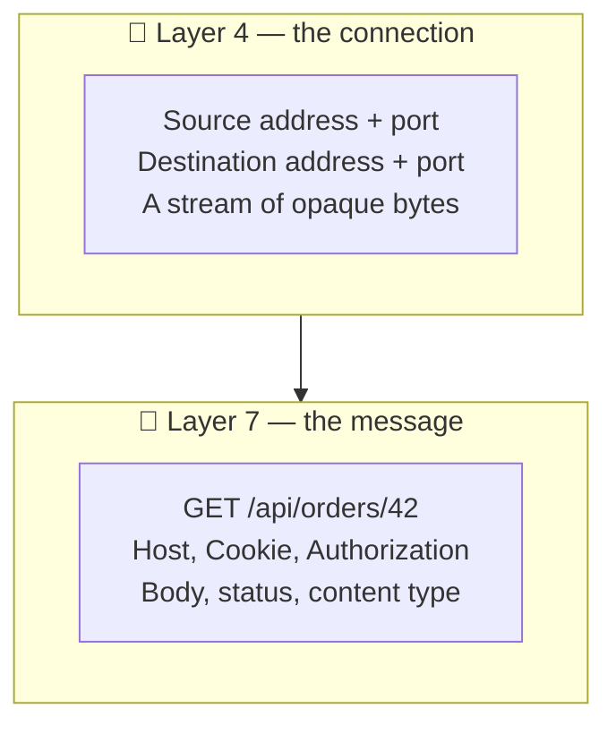

### What Each Kind of Proxy Can Do

An **L4 proxy** operates on connections. It sees where a connection came from and where it's headed, picks an upstream, and then shovels bytes between the two sides without interpreting any of them.

An **L7 proxy** operates on messages. It reads the request, understands it as a structured object, and can route, modify, or answer based on anything inside it.

| | **L4 — connection level** | **L7 — message level** |
|---|---|---|
| Sees | Addresses, ports, byte counts | Method, path, headers, cookies, body |
| Routes on | Destination port; source address | **Anything in the request** |
| Understands protocol | No — any protocol works | Yes — must speak HTTP specifically |
| Per-request decisions | ❌ One decision per *connection* | ✅ Every request decided independently |
| Can modify content | ❌ | ✅ Headers, paths, bodies |
| Can cache | ❌ — doesn't know what a response is | ✅ |
| Cost | Very low | Parsing, buffering, re-emitting |
| Works with encrypted traffic | ✅ — doesn't need to read it | ❌ **Must decrypt first (§6)** |

Two rows carry most of the practical weight.

**Per-request decisions.** Modern connections carry many requests — a browser will send dozens over one connection. An L4 proxy chooses an upstream when the *connection* opens, and every request on it goes to the same place, whatever they are. An L7 proxy decides *per request*: one to a static-content server, the next to an API service, the next to a legacy system, all over the same client connection. §10's migration depends entirely on this.

**Encryption.** An L4 proxy is indifferent to encryption because it never looks inside — encrypted bytes forward exactly as well as plain ones. An L7 proxy is helpless against it. You cannot route on a URL path you cannot read. This is the causal link that makes §6 necessary rather than optional: **terminating encryption is the precondition for Layer 7 routing.** It isn't a separate feature you might also want; it's the thing that has to happen first.

### What L7 Buys, Concretely

Reading the message enables a category of things impossible at L4:

- **Path routing** — `/api/*` to one system, `/static/*` to another, everything else to a third. One hostname, many backends.
- **Header and cookie routing** — send a fraction of users to a new version; route by tenant, region, or account.
- **Rewriting** — change a path or add a header before the origin ever sees it. §7's mechanism is exactly this.
- **Caching** — impossible at L4, because caching requires knowing what a response *is* and whether it's reusable.
- **Selective retries** — a failed idempotent read can be retried against a different upstream; L4 can only fail the connection.

### What L4 Buys

L4 isn't the primitive option — it's the correct one whenever you don't need to read the message:

- **Protocol independence.** L7 proxying means implementing the protocol. An L4 proxy carries databases, message queues, custom binary protocols, or anything else without knowing what they are.
- **Cost.** No parsing, no buffering, no re-emitting. Minimal work per byte and less to go wrong. The gap is real but frequently overstated in architecture discussions: L7 proxying typically adds well under a millisecond of processing to a request, which is negligible against the tens of milliseconds a cross-region round trip costs. At very high connection volumes the difference matters; for most systems, choosing L4 for performance while giving up routing is optimising the wrong quantity.
- **End-to-end encryption preserved.** Traffic passes through still encrypted; the proxy never has the keys and never sees the content. When that's a requirement, L4 isn't a compromise — it's the only acceptable answer.

> 💡 **Key Insight**
>
> L4 and L7 aren't a quality ranking, they're a **visibility choice, and visibility costs both work and trust.** L4 sees a connection and forwards bytes cheaply, protocol-agnostically, without ever decrypting anything. L7 sees the message and can do far more with it — route per request, rewrite, cache — but only by parsing every request and, crucially, only by **first decrypting traffic the client encrypted end-to-end.** Every L7 capability is purchased with that decryption, which is why the next section is about where the encryption ends and what moves when it does.

### Quick Recap — L4 vs L7

- **Layer 4** carries addresses, ports, and opaque bytes; **Layer 7** carries the message — method, path, headers, body.
- An **L4 proxy decides once per connection** and forwards blindly; an **L7 proxy decides per request** and can route, rewrite, cache, or answer.
- **L7 requires decryption** — you cannot route on a path you cannot read — which makes TLS termination (§6) a precondition, not an extra.
- **L4 is the right choice** when you need protocol independence, minimal cost, or genuinely untouched end-to-end encryption.

---

## 6. TLS Termination — Where the Encryption Ends

§5 ended on a dependency: Layer 7 routing requires reading the request, and encrypted requests can't be read. So something has to decrypt. Where that happens is one of the most consequential decisions in a system's architecture, and it's usually made by default rather than deliberately.

### The Definition

Encrypted web traffic uses **TLS** — a layer that encrypts everything between two parties so anyone in between sees only unintelligible bytes. Establishing it involves the server proving its identity with a **certificate** and both sides agreeing on keys.

> **TLS termination is the point in the path where the encrypted connection ends and is decrypted. Whatever terminates TLS holds the certificate, holds the keys, and sees the plaintext.**

The word *terminate* is precise and slightly counterintuitive: it doesn't mean the traffic stops, it means *this encrypted connection* stops. What continues onward is a different connection — possibly plaintext, possibly separately encrypted, but not the client's original one.

### Three Arrangements

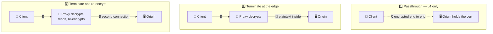

| | Proxy sees plaintext | Encrypted to origin | L7 routing possible |
|---|---|---|---|
| **Passthrough** | ❌ Never | ✅ | ❌ |
| **Terminate** | ✅ | ❌ | ✅ |
| **Re-encrypt** | ✅ | ✅ | ✅ |

**Passthrough** keeps the client's encryption genuinely end-to-end — the proxy can only forward bytes, so it's an L4 proxy by necessity. Maximum confidentiality, minimum capability.

**Termination** is the common arrangement. The proxy decrypts, and everything §5 described becomes available. Traffic continues to the origin as plaintext across the internal network.

**Re-encryption** decrypts to inspect and route, then encrypts again for the trip to the origin. Full L7 capability with no plaintext on the wire, at the cost of a second encryption operation on every request.

### Why Terminate at the Edge at All

Beyond enabling L7, centralising encryption solves a set of problems that are genuinely painful when distributed:

- **Certificates live in one place.** Renewal, rotation, and expiry monitoring happen once instead of on every server. Certificates expire, and an expired one rejects every connection instantly and completely — a well-known and recurring cause of total outages at organisations that were otherwise excellent at redundancy. One renewal process is dramatically easier to get right than fifty. The pressure here has increased: certificate lifetimes have fallen from years to **90 days** as the common default, and the industry is moving shorter still, which makes manual renewal untenable and automation mandatory rather than advisable.
- **Cryptographic work is concentrated** where it can be optimised or hardware-accelerated, instead of consuming capacity in every application process.
- **Policy is uniform.** Protocol versions and cipher choices are set once. No server drifts onto an outdated configuration because someone forgot it existed.
- **Applications stop handling encryption.** They speak plain HTTP and never manage a key.

### The Trust Boundary Moves

Here's the consequence that deserves the most attention, and it's often noticed only after something goes wrong.

Before termination, the encrypted channel ran from the client all the way to the origin. Everything in between was untrusted by construction — it couldn't read anything, so it didn't need to be trusted.

After termination, that guarantee ends at the proxy. Beyond it, traffic travels in a network you have declared trustworthy:

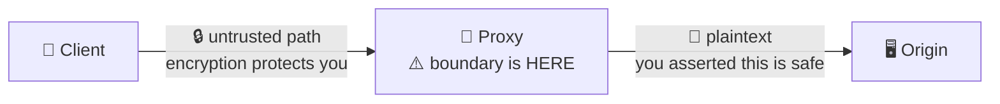

That assertion is a real security claim, and it's frequently made implicitly by whoever configured the proxy rather than deliberately by anyone weighing it. It holds up well inside a single tightly-controlled network segment. It holds up considerably less well when "inside" means a shared cloud network, traffic crossing between availability zones, or a path that grew over time to include hops nobody remembers adding.

Two properties follow, and both matter:

- **The proxy sees everything.** Passwords, tokens, personal data, payment details — all of it, in the clear, on one machine. That machine is now the highest-value target in the system, and §9 returns to what that means.
- **"We use HTTPS" becomes ambiguous.** It's true at the edge and may be false everywhere behind it. The precise question is always *"encrypted to where?"*

> ⚠️ **Terminating TLS is a security decision disguised as a performance configuration.** It is usually enabled because someone needed path-based routing or certificate management — both excellent reasons — and the trust boundary silently relocates as a side effect. The right time to ask *"what exactly am I asserting is trustworthy behind this point?"* is when you turn it on, not during the incident review. Re-encryption exists precisely for when the honest answer is "less than I'd like."

### Quick Recap — TLS Termination

- **TLS termination** is where the encrypted connection ends; whatever terminates it holds the certificate and **sees all plaintext**.
- Three arrangements: **passthrough** (end-to-end, L4 only), **terminate** (plaintext inside, full L7), **re-encrypt** (L7 plus a protected internal hop).
- Terminating at the edge centralises **certificates, cryptographic cost, and protocol policy** — and certificate expiry is a classic total-outage cause, so one renewal process beats fifty.
- It **moves the trust boundary**: everything behind the proxy is now asserted trustworthy, and the proxy becomes the machine that sees every secret in the system (§9).

---

## 7. The Identity Problem — Who Was the Client?

Every section so far has described a proxy accepting a connection and making a *new* one to its upstream. That detail, stated plainly in §1 and mostly ignored since, has a consequence that breaks more production systems than anything else in this document.

### The Origin Sees the Proxy

The connection your origin server accepts was opened by the proxy. Its source address is the proxy's. The client's address is nowhere in it — not hidden or stripped, simply **not part of a connection the client didn't open.**

So every request arriving at the origin appears to come from the same place:

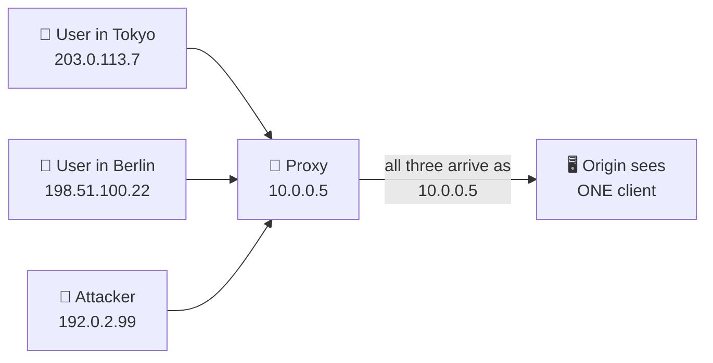

This is §1's home-router observation at internet scale. The router made four family members indistinguishable; the proxy makes your entire user base indistinguishable.

### What Breaks

The failures are diverse and share one cause — anything using the client's address is now using the proxy's:

| Breaks | How it presents |
|---|---|
| **Access logs** | Every entry shows one address. Traffic analysis becomes impossible |
| **Rate limiting** | All users share one bucket — either everyone is throttled together, or nobody is |
| **Geolocation** | Every user appears to be wherever the proxy lives |
| **Security tooling** | Cannot identify or block an individual actor; blocking the address blocks everyone |
| **Audit trails** | "Who performed this action?" has no answer beyond "the proxy" |
| **Address allow-lists** | Silently permit everyone, since only the proxy's address is ever checked |

That last row is the dangerous one, because it fails *open* and silently. A rule intended to permit a handful of office addresses now permits anyone who can reach the proxy — and nothing errors, nothing logs, and the control appears to be working.

The rate-limiting failure is the most commonly hit. A limit of 100 requests per minute per address, with all traffic arriving from one address, becomes 100 requests per minute *for the entire user base* — a self-inflicted outage that arrives the moment the proxy is deployed.

### The Fix, and Its Flaw

Since the address can't survive in the connection, the proxy records it **in the message** instead. This is L7 work (§5) — it requires reading and modifying the request:

```
X-Forwarded-For: 203.0.113.7
```

The origin reads that header instead of the connection's source address. With multiple proxies in the path, each appends, producing a chain in original-first order:

```
X-Forwarded-For: 203.0.113.7, 70.41.3.18, 150.172.238.178
                 ↑ original     ↑ proxy 1    ↑ proxy 2
```

A standardised `Forwarded` header does the same job with richer structure; `X-Real-IP` is a common simpler variant carrying only the original address. `X-Forwarded-For` remains the most widely used.

Now the flaw, and it is serious:

> ⚠️ **`X-Forwarded-For` is just a header, and a client can set it to anything.**

Nothing prevents someone sending `X-Forwarded-For: 1.2.3.4` with their request. If your proxy appends to what arrived rather than replacing it, and your origin trusts the first entry, then **the client controls the address your system believes it is talking to.** Every mechanism from the table above is now attacker-controlled: rate limits evaded by rotating the header, allow-lists defeated by claiming a permitted address, audit logs recording whatever the attacker chose.

### Doing It Correctly

The rule is short:

> **The header is trustworthy only for the hops you operate. Everything before your edge is client input.**

Which means:

1. **Your edge proxy overwrites, never appends.** The outermost proxy — the one clients reach directly — must *replace* any incoming `X-Forwarded-For` with the address it actually observed. Anything a client sent is discarded there.
2. **Internal proxies append.** Behind the edge, each hop adds its own observation, building a chain your infrastructure produced.
3. **The origin counts from the right.** With a known number of trusted proxies, the real client address is at a known position counting *inward* from the last entry — never simply "the first one," which is the entry an attacker controls.
4. **Trust is configured explicitly.** Proxy and application frameworks want to know how many hops to trust, or which addresses count as trusted proxies. Getting this number wrong in either direction breaks something: too high and you trust client input, too low and you rate-limit your own infrastructure.

The recurring mistake is deploying a proxy, discovering the logging problem, enabling `X-Forwarded-For`, and reading the first entry — which works perfectly in testing and is exploitable the day it ships.

> 💡 **Key Insight**
>
> A proxy doesn't hide the client's identity as a side effect — **it structurally cannot preserve it**, because the origin's connection was opened by the proxy and never carried the client's address at all. The recovery is to move that identity from the connection into a *header*, and that relocation changes its nature completely: connection addresses are asserted by the network and hard to forge, while headers are asserted by whoever sent them and trivial to forge. Every `X-Forwarded-For` bug is the same mistake — treating recovered identity as though it had the authority of the original.

### Quick Recap — The Identity Problem

- The origin's connection was opened by the **proxy**, so the client's address isn't in it — every user appears to come from one place.
- This breaks **logging, rate limiting, geolocation, security tooling, audit trails**, and address allow-lists, which fail *open* and silently.
- **`X-Forwarded-For`** carries the original address in the message instead, appending a chain when several proxies are involved.
- It is **client-settable and therefore forgeable**: the edge must **overwrite** it, internal hops append, and the origin counts inward from the last entry — never trusting the first.

---

## 8. What Else the Front Door Does

Once something sits at the entrance reading every request (§5) with the plaintext available (§6), a long list of jobs becomes possible there. Most systems accumulate several without ever deciding to.

This section is a **map, not a manual** — each item gets full treatment in its own topic, named as we go. The value here is recognising *why they cluster at the proxy*: they're all things that would otherwise be implemented identically in every service behind it.

### Serving Instead of Forwarding

A proxy that understands responses can keep a copy and answer the next identical request itself, without troubling the origin at all.

The property that makes this different from caching inside an application is **position**: the proxy is *shared*. One stored copy serves every user who asks, which is why an intermediary cache is far more effective than each client caching separately — the first request warms it for everyone.

This creates a distinction that matters: content identical for everyone can be cached at a shared proxy, while anything personalised must not be. Store one user's account page in a cache that answers everybody, and the next visitor receives it. Sharing is exactly what makes the cache valuable and exactly what makes this failure possible — the same property, pointed at the wrong content.

Cache strategy — what to store, for how long, how to invalidate, how to distribute geographically — is **Phase 06**. The point here is only that the proxy is a *position* where caching becomes shared rather than per-client.

### Changing Requests and Responses in Flight

L7 access means the proxy can rewrite what passes through:

- **Path rewriting** — an external `/api/v2/orders` becomes an internal `/orders`, so public URLs stay stable while internal structure changes freely.
- **Header injection** — §7's `X-Forwarded-For` is exactly this; so are request IDs for tracing.
- **Header removal** — stripping headers that reveal server software or versions.
- **Compression** — compressing responses once at the edge rather than in every application.
- **Redirects** — answering with a redirect outright, never involving an origin.

Path rewriting is quietly one of the most useful. It decouples your public interface from your internal layout, which is what makes §10's migration possible without changing a single client.

### Absorbing Client Behaviour

Some of the proxy's most valuable work is protecting origins from *how* clients behave rather than what they ask:

- **Slow clients**, introduced in §3 — the proxy accepts a trickling request in full, then hands the origin a complete one. An expensive application process is never held open waiting on a poor connection.
- **Connection consolidation** — thousands of short-lived client connections become a small pool of reused upstream ones, so origins spend their capacity on requests rather than connection setup.
- **Malformed requests** — rejected at the door by software built to handle hostile input, rather than by application code that assumed well-formed input.

### Policy at the Entrance

Because every request passes through, the proxy is the natural place to enforce rules uniformly:

| Job | What the proxy does | Covered in |
|---|---|---|
| **Rate limiting** | Rejects excess requests before they consume capacity | Phase 10 |
| **Authentication** | Verifies identity once at the edge | Phase 04 / Phase 10 |
| **Access control** | Blocks by path, method, or origin | Phase 10 |
| **Request logging** | One consistent record of all traffic | Phase 10 |
| **Distributing load** | Chooses among many upstreams | Topics 05–06 |

Note the dependency running through the first four: each needs to identify *who* is asking, which is §7's problem. Rate limiting keyed on the wrong address throttles everyone as one user — the failure §10 runs into.

### The Temptation

There's a pattern worth naming. Because the front door is such a convenient place to put things, it accumulates them — routing, then auth, then rate limits, then rewriting, then a special case for one legacy client, then another.

Eventually the proxy configuration holds a meaningful amount of the system's behaviour, expressed in a configuration language, typically untested, and understood by fewer people than the application code. It's genuinely the right place for cross-cutting concerns; it is not a good place for business logic. The line is blurry and worth watching, because nothing about the configuration file announces when you've crossed it.

> 💡 **Key Insight**
>
> Everything clustering at the front door shares one property: it's work that would otherwise be **duplicated identically in every service behind it.** Decryption, compression, rate limiting, authentication, logging — implement each once at the door or fifty times in the fleet. That's the real argument for a reverse proxy, and it's also the warning: the same convenience that makes it the correct home for cross-cutting concerns makes it an *attractive* home for things that aren't, and configuration accretes far more quietly than code.

### Quick Recap — What Else the Front Door Does

- Proxy caching's distinguishing property is **position** — one shared copy serves everyone, which is why personalised content must never be cached there. Strategy is Phase 06.
- **Rewriting** requests and responses decouples the public interface from internal structure, which is what makes migrations like §10 possible.
- It **absorbs client behaviour** — slow connections, connection churn, malformed input — so origins spend capacity on real work.
- Policy jobs (rate limiting, auth, logging) belong at the door because they'd otherwise be duplicated everywhere — but they all depend on §7's identity, and configuration accretes quietly.

---

## 9. The Front Door as Trust Boundary and Failure Point

Every advantage in this document comes from the same arrangement: one machine that all traffic passes through, holding the only public address, seeing every request in plaintext. This section is the bill for that arrangement.

### Everything Depends On It

There's a two-condition test for identifying the components whose failure is catastrophic rather than merely inconvenient:

> **A single point of failure is a component satisfying two conditions at once: nothing works without it, and there is exactly one of it.** Either alone is harmless. Something indispensable but duplicated survives losing a copy; something solitary but inessential can be lost without consequence. Only the overlap — indispensable *and* solitary — takes a system down.

A reverse proxy satisfies the first condition perfectly, and by design. It is *the* entrance. If it stops, every server behind it is unreachable — all healthy, all running, all invisible. Its failure isn't a degradation, it's total: the system doesn't get slower, it disappears.

Which leaves the second condition as the only thing standing between you and an outage. Running exactly one proxy means everything you built behind it inherits the availability of that single box. **Making the front door redundant — running several, detecting failure, moving traffic — is Topic 05's subject**, along with the health checking that makes it work. What matters here is recognising the shape: the component that makes your fleet replaceable is itself the thing that must not be singular.

### It Sees Everything

The security consequence of §6 deserves stating directly.

The proxy holds the certificate and terminates encryption, so **every secret entering your system passes through it in plaintext**: credentials, session tokens, personal data, payment details. Not some of it — all of it, on one machine.

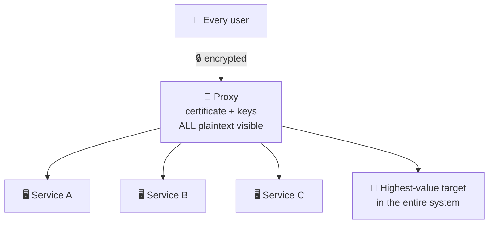

That makes it the single highest-value target you operate. Compromise any individual service and an attacker gets that service's data; compromise the proxy and they get **everything, continuously, as it arrives** — with no need to break anything else. It's also the ideal position for an attacker to remain quiet in: traffic keeps flowing normally, nothing errors, and nothing in the application logs looks unusual.

The practical implications are ordinary and worth stating anyway: the proxy warrants stricter access control than the services behind it, its configuration deserves the same review discipline as application code, and its certificates and keys are among the most sensitive material in the system.

### The Failures That Are Distinctive

Some failure modes belong specifically to being an intermediary:

| Failure | What happens |
|---|---|
| **Misrouting** | A configuration change sends traffic to the wrong upstream. Users see another system's responses — sometimes another *tenant's* data |
| **Trusting client headers** | §7's forgery: rate limits evaded, allow-lists defeated, audit logs falsified |
| **Cached personalisation** | One user's private page served to another from a shared cache (§8) |
| **Stale upstream list** | Traffic sent to servers that no longer exist, or withheld from ones that do |
| **Certificate expiry** | Every connection rejected at once, globally, instantly (§6) |
| **Configuration drift** | The config accretes until nobody can predict routing from reading it |

The first two share a property that makes them worse than an outage: **they fail silently and successfully.** Misrouted requests return `200 OK` with the wrong content. A forged header produces a perfectly normal-looking log entry. No error fires, no alert triggers, and the problem is discovered by a user or an auditor rather than by monitoring — which is precisely the class of failure that runs longest before anyone notices.

### The Honest Accounting

None of this argues against reverse proxies. Nearly every production system has one, and the alternative — every server publicly addressable, each managing its own certificate, each implementing its own rate limiting — is worse in every dimension including security.

The accounting is simply this: you are **concentrating** risk in exchange for **eliminating** duplication. Concentrated risk is easier to manage precisely because it's in one place — one certificate to renew, one config to review, one machine to harden. That's a genuinely good trade, and it's only good if you know you made it.

> ⚠️ **The component that makes everything behind it replaceable is the one thing that isn't.** A reverse proxy exists to make servers interchangeable and hidden — and in doing so it becomes the single machine that must not fail, holding the only public address, terminating every connection, and reading every secret. That's an acceptable and normal design. It stops being acceptable when it's *accidental* — when nobody decided the front door was the most critical and most sensitive machine in the system, it simply became so while everyone was configuring routes.

### Quick Recap — Trust Boundary and Failure Point

- A single point of failure needs **both** conditions: on the critical path *and* no redundancy. A reverse proxy satisfies the first by design, leaving only the second — **redundancy mechanics are Topic 05**.
- Its failure is **total, not partial**: every server behind it is healthy and simultaneously unreachable.
- It terminates encryption, so **every secret in the system passes through it in plaintext** — making it the highest-value target and an ideal quiet foothold.
- Its distinctive failures — **misrouting and trusted client headers** — return `200 OK`, so they're found by users and auditors rather than by monitoring.

---

## 10. Putting It All Together — Retiring a Monolith Behind a Reverse Proxy

A team runs a single large application — six years old, one deployable unit, handling everything from the marketing site to checkout. It works. It is also increasingly difficult to change, and they want to move functionality out of it a piece at a time without a rewrite and without asking any client to change a URL.

Their application is currently addressed directly: it holds the public address, terminates its own TLS, and serves every path.

Watch each section of this document arrive as a step.

### Step 1 — Put Something in Front (§3)

Before moving anything, they place a reverse proxy at the entrance. The public address moves to the proxy; the application moves to a private address, reachable only from inside.

Nothing changes for users — same hostname, same URLs, same responses. The proxy forwards everything to the one upstream it has. It looks pointless, and it's the step everything else depends on: **clients now hold a reference to the proxy rather than to the application.** What's behind it has become theirs to rearrange.

### Step 2 — Terminate TLS at the Edge (§6)

The certificate moves to the proxy. It decrypts incoming connections and forwards plaintext to the application inside the private network.

Two things they gain immediately: the application stops managing certificates, and — the part that matters for what follows — **the proxy can now read requests.** Path routing is impossible without this (§5). They note explicitly that the trust boundary has moved to the proxy, and record that the internal segment is now assumed trustworthy.

### Step 3 — Route by Path (§5)

The first extraction: search functionality becomes a separate service. Rather than changing any client, they add one L7 routing rule:

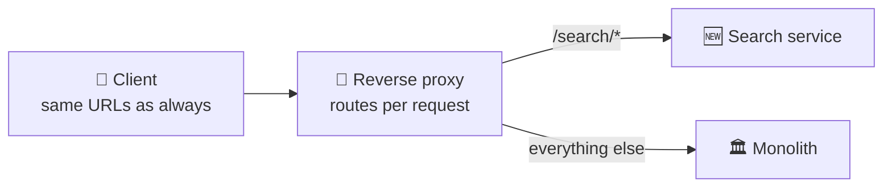

Requests to `/search/*` go to the new service; everything else continues to the monolith. From outside, nothing happened — same hostname, same paths, same responses.

This is precisely what L4 could not do. An L4 proxy chooses an upstream per *connection*, and a browser sends many requests over one connection — a page load would need its search request and its checkout request on the same connection to reach different services. Only reading each request makes that possible.

Over the following months they peel off more: `/api/orders/*`, then `/api/users/*`. Each is one routing rule. The monolith shrinks by attrition and no client ever learns anything changed.

### Step 4 — The Incident (§7)

Six weeks in, a customer reports being rate-limited while barely using the product. Then several more. Then the rate limiter starts rejecting traffic broadly, and the on-call engineer finds every log entry showing the same source address: `10.0.0.5`. The proxy.

The application's rate limiter allows 100 requests per minute per address. Since Step 1, every request has arrived from the proxy — so **the entire customer base has been sharing one bucket.** It didn't fail immediately because traffic was below the limit; growth crossed it, and the limiter began throttling the company as though it were a single abusive user.

Access logs have been useless for six weeks and nobody noticed, because nobody had reason to read them closely.

They fix it with `X-Forwarded-For`: the proxy records the address it observed, the application reads that instead of the connection's source.

### Step 5 — The Fix's Own Bug (§7)

During review, someone asks what happens if a client sends its *own* `X-Forwarded-For`.

The initial configuration appended to whatever arrived, and the application read the first entry. So any client could send `X-Forwarded-For: 1.2.3.4`, land in whatever bucket it liked, and evade the limit entirely by varying the value — a rate limiter defeated by a header the attacker controls. Worse, an internal tool used address allow-listing, which the same trick would defeat while looking completely normal in the logs.

The correction follows §7's rule: **the edge overwrites rather than appends.** Whatever a client sends is discarded and replaced with the address the proxy actually observed. Internal hops append. The application is configured with the number of trusted hops and counts inward from the last entry, never trusting the first.

Both bugs came from the same step, and the second was more dangerous: the first caused a visible outage that forced a fix, while the second would have failed silently and successfully (§9), returning `200 OK` to every forged request.

### Step 6 — Notice What the Front Door Became (§9)

A year later the picture has changed. The monolith handles a fraction of what it did. Six services sit behind the proxy. The proxy configuration holds the routing table for the entire system, terminates all TLS, enforces rate limits, and adds request IDs.

It is now the most critical machine they operate — and nobody ever decided that. It happened one routing rule at a time.

So they treat it accordingly: a second proxy so the entrance isn't singular (the mechanics are Topic 05), config changes reviewed like application code after a near-miss where a misrouting rule sent a fraction of traffic to the wrong service and returned confident, wrong `200 OK`s, certificate renewal automated with expiry alerting, and access to the proxy restricted more tightly than to any service behind it — because it sees every token and every payment detail in the clear.

### The Payoff

The monolith was retired incrementally with no rewrite, no client change, and no coordinated migration. Each extraction was a routing rule, reversible by removing it.

What made it possible wasn't microservices or any particular technology. It was **a position on the wire.** Once something sits between clients and servers and can read requests, the mapping from URL to implementation becomes a configuration decision instead of an architectural commitment.

And the incidents share one root: **the proxy was adopted for what it enabled, and its consequences arrived unbidden.** The identity problem, the trust boundary, the concentration of criticality — none were chosen, and all were inevitable from Step 1. Their real lesson is that the day you put something in front of your application, you have already accepted every consequence in this document; the only question is whether you find out on your terms or during an incident.

---

## 11. Final Recap

| Concept | Core Insight | Biggest Tradeoff |
|---|---|---|
| **Intermediaries** | The client→server arrow is a fiction; real requests cross several machines that terminate and re-originate traffic | Every hop is a failure point and a machine to operate |
| **Forward proxy** | Acts for **clients** — destinations see the proxy, not the user | Concentrates visibility: one operator sees every request everyone makes |
| **Reverse proxy** | Acts for **servers** — holds the only public address, so the fleet is unreachable and replaceable | The one machine that must not fail |
| **The distinction** | Same software, opposite directions; the only question is **whose agent is it** | The vocabulary confuses; the concept doesn't |
| **The taxonomy** | Load balancers, API gateways, CDN edges, sidecars, ingress controllers are all **specialized reverse proxies** | Labels blur in practice — ask what it emphasises |
| **L4** | Sees addresses and ports; forwards opaque bytes cheaply and protocol-agnostically | One decision per connection; can't route, rewrite, or cache |
| **L7** | Reads the message; routes per request on path, header, or cookie | Costs parsing — and **requires decrypting first** |
| **TLS termination** | Where encryption ends and plaintext begins; the precondition for all L7 routing | Moves the trust boundary and concentrates every secret on one machine |
| **Client identity** | The origin's connection came from the proxy, so the client's address was never in it | `X-Forwarded-For` recovers it as **forgeable client input** |
| **Front door duties** | Caching, rewriting, compression, rate limiting, auth — work otherwise duplicated in every service | Configuration accretes into untested business logic |
| **Concentration** | One entrance means one place for policy, certificates, and control | Total failure, and the highest-value target you run |

### The One Thing to Remember

> **A proxy is not a kind of software — it is a position on the wire, and everything follows from two questions: whose agent is it, and how deep can it read? *Whose agent* separates forward from reverse and is the only distinction that matters. *How deep it reads* determines whether it can route on a URL, which in turn requires decrypting traffic the client encrypted end-to-end — so every Layer 7 capability is purchased by moving the trust boundary inward. That position is the highest-leverage place in a system: it makes servers hidden and replaceable, and turns the mapping from URL to implementation into a configuration decision. It is also the machine that sees every secret, cannot preserve the identity of the client that connected to it, and takes everything down when it stops. You will almost certainly want one. Decide what you are accepting before it decides for you.**

---

## What's Next

> **Topic 05 — Load Balancers**

This document kept stopping at the same edge. The reverse proxy makes servers hidden and interchangeable — and then something has to actually spread traffic across them, notice when one stops answering, and stop sending work to a machine that can no longer do it. Every time that came up, it was deferred.

Next it's the subject. A **load balancer** is the specialization of the reverse proxy whose entire emphasis is distribution: how it tracks which upstreams are alive, what a health check really proves (and what it only appears to prove), how servers are added and drained without dropping requests, and how the front door itself is made redundant — the question §9 raised and left open.

You've learned what the position on the wire *is*. Next you find out how it handles many servers instead of one.

---
