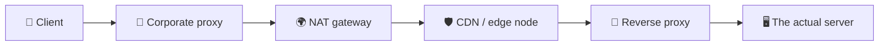

# Proxy vs Reverse Proxy

> **Phase:** Networking Deep Dives → **Topic:** 4 of 7 → **Read time:** ~55 minutes

---

## Before You Begin

**This document stands alone.** It assumes you have read nothing else — not the foundation series, not the phase before it, not the topics before it. Everything is built here from zero: what an intermediary is, what forward and reverse proxies actually do, what a proxy can and cannot see at each layer, where encryption ends, and why the server at the end of the chain no longer knows who its own users are.

Two consequences of that choice:

- **Terms get defined where they're used** — intermediary, upstream, downstream, Layer 4, Layer 7, TLS termination, trust boundary, NAT. Skim past what you already know.
- **Neighbouring topics are named, not taught.** Load balancer mechanics, balancing algorithms, cache strategy, API gateways, and service meshes each have their own full treatment elsewhere in this curriculum. Where they touch proxies, this document says so and points; it doesn't absorb them. *Proxies themselves are complete here.*

Proxy vs Reverse Proxy is one of the concepts in the **Top 30 Must-Know Concepts** foundation series, where it gets a short introduction. This is that concept's deep-dive.

Here is the question the document answers:

> **When you send a request to a server, how many machines actually handle it before it arrives — and what is each of them allowed to see, change, or decide?**

Here's the trap it disarms. Proxies are usually taught as a naming quiz: *forward proxy sits near the client, reverse proxy sits near the server, memorise which is which.* Learn it that way and you retain a piece of trivia that never once helps you.

The real subject is considerably more unsettling. Every request you have ever traced — every diagram you've drawn with an arrow from a client to a server — almost certainly ended somewhere other than where you thought. Something in between accepted the connection, decrypted it, decided where it should go, possibly answered it outright, and forwarded what remained under its own name. The server you think you're talking to frequently never sees your address, your connection, or your encryption.

> **The mindset shift:** stop asking *"what is a proxy?"* and start asking two questions instead — **who is this intermediary acting for, and how deep can it read?** *Whose agent* separates a forward proxy from a reverse one, and it's the only distinction that matters. *How deep it reads* determines everything else: whether it can route on a URL, whether it must decrypt your traffic first, what it can log, and what it can silently change. Proxies aren't a category of software. They're a **position on the wire** — and the interesting questions are always about what that position lets you do, and what it costs to be there.

---

## Table of Contents

1. [The Request Path Is Never Two Machines](#1-the-request-path-is-never-two-machines)
2. [Forward Proxy — Acting for the Client](#2-forward-proxy--acting-for-the-client)
3. [Reverse Proxy — Acting for the Server](#3-reverse-proxy--acting-for-the-server)
4. [The Same Box Pointing Opposite Ways](#4-the-same-box-pointing-opposite-ways)
5. [L4 vs L7 — What the Proxy Can See](#5-l4-vs-l7--what-the-proxy-can-see)
6. [TLS Termination — Where the Encryption Ends](#6-tls-termination--where-the-encryption-ends)
7. [The Identity Problem — Who Was the Client?](#7-the-identity-problem--who-was-the-client)
8. [What Else the Front Door Does](#8-what-else-the-front-door-does)
9. [The Front Door as Trust Boundary and Failure Point](#9-the-front-door-as-trust-boundary-and-failure-point)
10. [Putting It All Together — Retiring a Monolith Behind a Reverse Proxy](#10-putting-it-all-together--retiring-a-monolith-behind-a-reverse-proxy)
11. [Final Recap](#11-final-recap)

---

## 1. The Request Path Is Never Two Machines

Every introduction to networking draws the same picture: a client on the left, a server on the right, an arrow between them. It's a useful fiction and it is almost never true.

### The Fiction and the Reality

A request from a laptop to a public web service typically passes through several machines that are not the destination. Each one accepts the traffic, does something with it, and passes it on:

The arrow in the textbook diagram is *five machines*, and only the last one runs the code anyone wrote on purpose. Everything in between is what this document is about.

> **An intermediary is any machine that accepts a request not addressed to it in spirit, and forwards it toward something else — usually changing something along the way.**

The phrase *"not addressed to it in spirit"* is doing real work there. A packet arriving at a proxy is genuinely addressed to that proxy at the network level — that's how it got there. But the *intent* is to reach something behind it. That gap between the address and the intent is the whole idea.

### Upstream and Downstream

Two words you'll meet constantly, and they trip people up because their meaning depends on where you stand:

- **Upstream** — toward the origin, the thing that ultimately answers. From a proxy's view, its upstream is the server it forwards to.
- **Downstream** — toward the client, the thing that asked.

A proxy always sits between a downstream and an upstream. Chain several and each is upstream of the one before it. The **origin** (or origin server) is the machine at the very end that actually produces the response rather than relaying it.

### Proxies You Already Use Without the Name

Intermediaries are not exotic infrastructure. Several are so common they're rarely called proxies at all:

| Thing | What it really is |
|---|---|
| **Home router** | Rewrites your private address to one public address for the whole household |
| **Corporate network** | Forces outbound traffic through a filtering gateway |
| **CDN** | Answers on behalf of a server that may be thousands of kilometres away |
| **Firewall / middlebox** | Inspects and sometimes rewrites traffic in transit |
| **VPN** | Relays all your traffic through an operator you chose |

The router deserves a moment, because it's the intermediary nearly everyone owns. **NAT** — Network Address Translation — is what lets many devices share one public address: the router rewrites the source address on the way out, remembers the mapping, and reverses it on the way back. Every device in the house appears to the internet as the same single address.

That's a proxy in every meaningful sense — it terminates, rewrites, forwards, and maintains state about who asked what. It also produces this document's central consequence in miniature: **a server receiving that traffic cannot distinguish the four people in the house from each other.** §7 is that problem at internet scale.

### Why Put Anything in the Middle

Every intermediary adds a hop, a failure point, and a machine to operate. They persist because a position between two parties lets you do things neither party can do alone — enforce a policy without modifying either side, cache an answer for many askers, hide what's behind you, or change where traffic goes without touching a line of application code.

That last one is the deep reason. An intermediary is **a place to make decisions that would otherwise require changing software you may not control.** §10 is an extended example: a team rerouting traffic away from a monolith without editing the monolith.

> 💡 **Key Insight**
>
> The client→server arrow is a teaching simplification, and treating it as literal is where confusion about proxies starts. Real requests pass through a sequence of machines that each terminate and re-originate the traffic — meaning **the connection your client opened is virtually never the connection your server accepts.** Once you internalise that, the questions in this document stop being abstract: something in the middle decrypted your request, and it had to, or it could not have decided where to send it.

### Quick Recap — The Request Path

- The client→server arrow is a fiction; real requests cross several **intermediaries** that accept traffic and forward it onward.
- **Upstream** points toward the origin, **downstream** toward the client, and the **origin** is whatever finally produces a response instead of relaying one.
- Many familiar things are proxies under other names — home routers doing **NAT**, corporate gateways, CDNs, VPNs.
- Intermediaries earn their cost by being **a place to make decisions without modifying either endpoint** — the property everything else in this document builds on.
