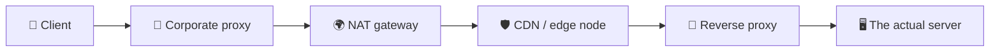
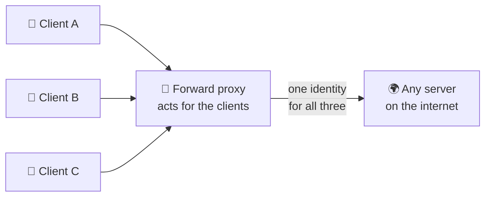
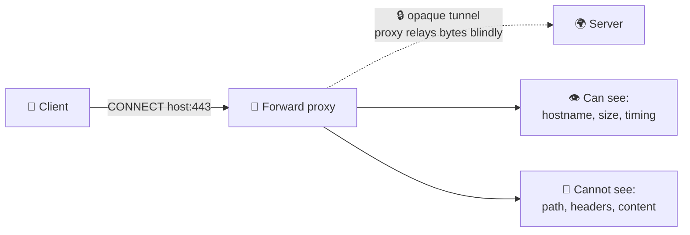
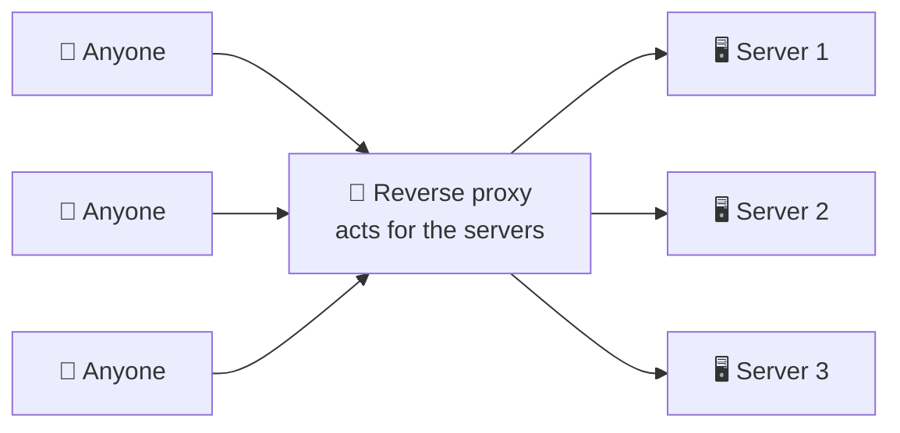
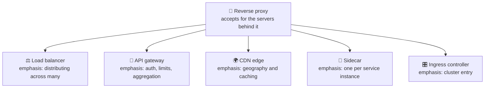
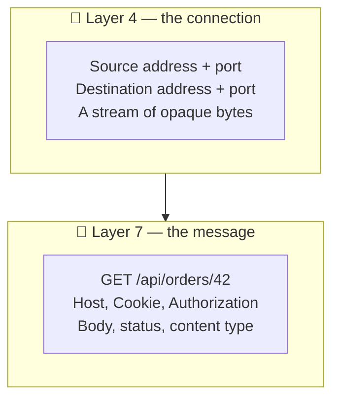

# Proxy vs Reverse Proxy

> **Phase:** Networking Deep Dives → **Topic:** 4 of 7 → **Read time:** ~55 minutes

---

## Before You Begin

**This document stands alone.** It assumes you have read nothing else — not the foundation series, not the phase before it, not the topics before it. Everything is built here from zero: what an intermediary is, what forward and reverse proxies actually do, what a proxy can and cannot see at each layer, where encryption ends, and why the server at the end of the chain no longer knows who its own users are.

Two consequences of that choice:

- **Terms get defined where they're used** — intermediary, upstream, downstream, Layer 4, Layer 7, TLS termination, trust boundary, NAT. Skim past what you already know.
- **Neighbouring topics are named, not taught.** Load balancer mechanics, balancing algorithms, cache strategy, API gateways, and service meshes each have their own full treatment elsewhere in this curriculum. Where they touch proxies, this document says so and points; it doesn't absorb them. *Proxies themselves are complete here.*

Proxy vs Reverse Proxy is one of the concepts in the **Top 30 Must-Know Concepts** foundation series, where it gets a short introduction. This is that concept's deep-dive.

Here is the question the document answers:

> **When you send a request to a server, how many machines actually handle it before it arrives — and what is each of them allowed to see, change, or decide?**

Here's the trap it disarms. Proxies are usually taught as a naming quiz: *forward proxy sits near the client, reverse proxy sits near the server, memorise which is which.* Learn it that way and you retain a piece of trivia that never once helps you.

The real subject is considerably more unsettling. Every request you have ever traced — every diagram you've drawn with an arrow from a client to a server — almost certainly ended somewhere other than where you thought. Something in between accepted the connection, decrypted it, decided where it should go, possibly answered it outright, and forwarded what remained under its own name. The server you think you're talking to frequently never sees your address, your connection, or your encryption.

> **The mindset shift:** stop asking *"what is a proxy?"* and start asking two questions instead — **who is this intermediary acting for, and how deep can it read?** *Whose agent* separates a forward proxy from a reverse one, and it's the only distinction that matters. *How deep it reads* determines everything else: whether it can route on a URL, whether it must decrypt your traffic first, what it can log, and what it can silently change. Proxies aren't a category of software. They're a **position on the wire** — and the interesting questions are always about what that position lets you do, and what it costs to be there.

---

## Table of Contents

1. [The Request Path Is Never Two Machines](#1-the-request-path-is-never-two-machines)
2. [Forward Proxy — Acting for the Client](#2-forward-proxy--acting-for-the-client)
3. [Reverse Proxy — Acting for the Server](#3-reverse-proxy--acting-for-the-server)
4. [The Same Box Pointing Opposite Ways](#4-the-same-box-pointing-opposite-ways)
5. [L4 vs L7 — What the Proxy Can See](#5-l4-vs-l7--what-the-proxy-can-see)
6. [TLS Termination — Where the Encryption Ends](#6-tls-termination--where-the-encryption-ends)
7. [The Identity Problem — Who Was the Client?](#7-the-identity-problem--who-was-the-client)
8. [What Else the Front Door Does](#8-what-else-the-front-door-does)
9. [The Front Door as Trust Boundary and Failure Point](#9-the-front-door-as-trust-boundary-and-failure-point)
10. [Putting It All Together — Retiring a Monolith Behind a Reverse Proxy](#10-putting-it-all-together--retiring-a-monolith-behind-a-reverse-proxy)
11. [Final Recap](#11-final-recap)

---

## 1. The Request Path Is Never Two Machines

Every introduction to networking draws the same picture: a client on the left, a server on the right, an arrow between them. It's a useful fiction and it is almost never true.

### The Fiction and the Reality

A request from a laptop to a public web service typically passes through several machines that are not the destination. Each one accepts the traffic, does something with it, and passes it on:

The arrow in the textbook diagram is *five machines*, and only the last one runs the code anyone wrote on purpose. Everything in between is what this document is about.

> **An intermediary is any machine that accepts a request not addressed to it in spirit, and forwards it toward something else — usually changing something along the way.**

The phrase *"not addressed to it in spirit"* is doing real work there. A packet arriving at a proxy is genuinely addressed to that proxy at the network level — that's how it got there. But the *intent* is to reach something behind it. That gap between the address and the intent is the whole idea.

### Upstream and Downstream

Two words you'll meet constantly, and they trip people up because their meaning depends on where you stand:

- **Upstream** — toward the origin, the thing that ultimately answers. From a proxy's view, its upstream is the server it forwards to.
- **Downstream** — toward the client, the thing that asked.

A proxy always sits between a downstream and an upstream. Chain several and each is upstream of the one before it. The **origin** (or origin server) is the machine at the very end that actually produces the response rather than relaying it.

### Proxies You Already Use Without the Name

Intermediaries are not exotic infrastructure. Several are so common they're rarely called proxies at all:

| Thing | What it really is |
|---|---|
| **Home router** | Rewrites your private address to one public address for the whole household |
| **Corporate network** | Forces outbound traffic through a filtering gateway |
| **CDN** | Answers on behalf of a server that may be thousands of kilometres away |
| **Firewall / middlebox** | Inspects and sometimes rewrites traffic in transit |
| **VPN** | Relays all your traffic through an operator you chose |

The router deserves a moment, because it's the intermediary nearly everyone owns. **NAT** — Network Address Translation — is what lets many devices share one public address: the router rewrites the source address on the way out, remembers the mapping, and reverses it on the way back. Every device in the house appears to the internet as the same single address.

That's a proxy in every meaningful sense — it terminates, rewrites, forwards, and maintains state about who asked what. It also produces this document's central consequence in miniature: **a server receiving that traffic cannot distinguish the four people in the house from each other.** §7 is that problem at internet scale.

### Why Put Anything in the Middle

Every intermediary adds a hop, a failure point, and a machine to operate. They persist because a position between two parties lets you do things neither party can do alone — enforce a policy without modifying either side, cache an answer for many askers, hide what's behind you, or change where traffic goes without touching a line of application code.

That last one is the deep reason. An intermediary is **a place to make decisions that would otherwise require changing software you may not control.** §10 is an extended example: a team rerouting traffic away from a monolith without editing the monolith.

> 💡 **Key Insight**
>
> The client→server arrow is a teaching simplification, and treating it as literal is where confusion about proxies starts. Real requests pass through a sequence of machines that each terminate and re-originate the traffic — meaning **the connection your client opened is virtually never the connection your server accepts.** Once you internalise that, the questions in this document stop being abstract: something in the middle decrypted your request, and it had to, or it could not have decided where to send it.

### Quick Recap — The Request Path

- The client→server arrow is a fiction; real requests cross several **intermediaries** that accept traffic and forward it onward.
- **Upstream** points toward the origin, **downstream** toward the client, and the **origin** is whatever finally produces a response instead of relaying one.
- Many familiar things are proxies under other names — home routers doing **NAT**, corporate gateways, CDNs, VPNs.
- Intermediaries earn their cost by being **a place to make decisions without modifying either endpoint** — the property everything else in this document builds on.

---

## 2. Forward Proxy — Acting for the Client

> **A forward proxy is an intermediary that acts on behalf of clients. It sits at the edge of *their* network, receives their outbound requests, and makes those requests to the internet in its own name.**

The defining consequence is what the destination sees. It does not see the client. It sees the proxy — the proxy's address, the proxy's connection. As far as the destination is concerned, the proxy *is* the client.

Note the shape: **one proxy, many destinations.** A forward proxy doesn't know or care what's on the other side — today it fetches a news site, tomorrow an API, next an update server. It's bound to its *clients*, not to any particular destination. That asymmetry is what distinguishes it from §3's reverse proxy, which is bound to particular servers and serves any client on Earth.

### Who Deploys One, and Why

Almost always someone with authority over the client machines, wanting a policy enforced without installing anything on each device:

| Motive | What the proxy does |
|---|---|
| **Control** | Blocks categories of destination; enforces acceptable-use policy |
| **Visibility** | Logs every outbound request — a compliance and audit requirement in many industries |
| **Shared caching** | One copy of a common download serves the whole office |
| **Bandwidth** | Compresses or strips content before it reaches a constrained network |
| **Egress identity** | All traffic leaves from one known address, so partners can allow-list it |
| **Privacy** | The user's own address is hidden from the sites they visit |

That last row is the one most people meet first, and it's worth being precise: **the destination no longer knows who you are, but the proxy operator knows exactly who you are and everything you asked for.** You haven't removed the observer; you've *chosen* it. Whether that's a privacy improvement depends entirely on who runs the proxy — which is why "use a proxy for privacy" is advice that means nothing without naming the operator.

### Explicit vs Transparent

A distinction with real operational consequences, and one that's rarely stated plainly:

**Explicit** — the client is configured to use the proxy and *knows* it exists. Browser settings, a system-wide proxy setting, an environment variable. The client deliberately addresses its requests to the proxy.

**Transparent** (or *intercepting*) — the client knows nothing. The network silently redirects outbound traffic to the proxy, which handles it and forwards it on. Nothing was configured on the device; the client believes it's talking directly to the destination.

| | Explicit | Transparent |
|---|---|---|
| Client configuration | Required on every device | **None** |
| Client awareness | Knows the proxy exists | No idea |
| Deployment | Config management, per-device | Network-level, applies to everything |
| Bypassable | Yes — change the setting | No — it's the path itself |
| Debugging | Straightforward | **Confusing** — behaviour with no visible cause |

That last row costs real hours. When a transparent proxy misbehaves, the symptom appears at the application with no indication that an intermediary exists at all — a request that works from one network and fails from another, with identical code and identical configuration. The infamous version is a captive portal in a hotel or airport: your request for one site returns a login page from somewhere else entirely, because something intercepted it.

### The Encryption Wall

Here is the limit that reshaped forward proxies, and it follows directly from HTTPS being everywhere.

When a client wants an encrypted connection through a proxy, it can't simply ask the proxy to fetch a page — the whole point is that only the client and the destination hold the keys. Instead it issues a `CONNECT` request: *open a raw tunnel to this host and port, and relay bytes without interpreting them.*

The proxy complies and becomes a **blind pipe**. Encrypted bytes flow through it in both directions. It can see:

- **The destination hostname** — required to open the tunnel at all
- **Byte counts and timing** — how much, how long, how often

and it cannot see the path requested, the headers, the cookies, the content, or the response. Its filtering degrades from *"block this article"* to *"block this entire domain, or don't."*

Organisations that need deeper inspection respond by **intercepting TLS**: the proxy terminates the encryption itself, inspects the plaintext, and re-encrypts toward the destination using its own certificate — which it can only do because the organisation installed that certificate as trusted on every managed device. It works, and it means the proxy operator reads everything, including traffic the user believes is private end-to-end. §6 covers the mechanics of terminating encryption and the trust boundary it moves.

> ⚠️ **A forward proxy is a deliberate concentration of visibility.** Every request every client makes flows through one machine that can log all of it. That's precisely the point when it's your organisation's compliance requirement — and precisely the risk when it's an anonymous free proxy you found online. The traffic didn't become unobserved; the observer changed from "each site you visit" to "one operator who sees every site you visit." Always ask who runs it.

### Quick Recap — Forward Proxy

- A **forward proxy acts for clients**: it makes their outbound requests in its own name, so destinations see the proxy rather than the client.
- Its shape is **one proxy, many destinations** — bound to its clients, indifferent to what's on the other side.
- **Explicit** proxies are configured on the client; **transparent** ones intercept silently and produce failures with no visible cause.
- HTTPS turns it into a **blind pipe** via `CONNECT` — hostname, size, and timing only — unless the operator intercepts TLS with a certificate installed on every device (§6).

---

## 3. Reverse Proxy — Acting for the Server

> **A reverse proxy is an intermediary that acts on behalf of servers. It receives incoming requests from the internet, and forwards them to servers behind it that clients never address directly.**

Flip every property of §2 and you have it. The forward proxy served many clients reaching any destination; the reverse proxy serves **any client reaching a particular set of servers.** It's bound to its upstreams, indifferent to who's asking.

The diagrams for §2 and §3 are mirror images, and that is genuinely the whole distinction — §4 makes it precise.

### The Public Address Is the Point

Here is the structural fact underneath everything a reverse proxy does: **it is the only machine in the system with a publicly reachable address.** The servers behind it hold private addresses, unreachable from the internet. There is no route to them from outside — not blocked by policy, but *nonexistent as a path*.

That single arrangement produces a cascade of consequences:

| Consequence | Why it follows |
|---|---|
| **The fleet is invisible** | Clients cannot address, scan, or attack what has no route |
| **Servers become fungible** | Add, remove, or replace them without anyone outside noticing |
| **One address, many services** | Different paths and hostnames route to entirely different systems |
| **One place for policy** | TLS, authentication, rate limiting applied once at the door |
| **Deploys stop being visible** | Traffic shifts between versions behind a stable public identity |

The second row is the one with the largest downstream effect. Because clients hold no reference to any individual server, the set behind the proxy can change continuously — which is the precondition for running many interchangeable copies of an application at all. Distributing traffic across them is **Topic 05 — Load Balancers**, and choosing *which* one receives each request is **Topic 06 — Load Balancing Algorithms**. This document stops at the position; those two cover the machinery.

### What It Absorbs

Work placed at the reverse proxy is work every server behind it stops doing, and it's the same work every one of them would otherwise duplicate:

- **Encryption** — decrypt once at the door rather than in every application process (§6).
- **Slow clients** — a request arriving over a poor mobile connection can take seconds to fully deliver. The proxy absorbs that trickle and hands the origin a complete request instantly, so an expensive application process isn't held open waiting for bytes.
- **Static content** — served directly, never troubling the application.
- **Malformed and hostile traffic** — rejected before it reaches code that would have to handle it.
- **Connection management** — many short client connections consolidated into a small pool of reused upstream ones.

That third-to-last point is why a reverse proxy improves capacity even with a single server behind it. The application process is the expensive resource; the proxy exists partly to stop it being occupied by work that isn't application work.

### The Naming Confusion, Resolved

Two things share the word *proxy* and point in opposite directions, which is a genuine and lasting source of confusion. One convention helps: **in an architecture discussion, an unqualified "proxy" almost always means a reverse proxy.** It's overwhelmingly the more common production component, and people qualify the other kind — "forward proxy," "egress proxy," "corporate proxy" — precisely because it's the exception.

> 💡 **Key Insight**
>
> A reverse proxy's power comes from one structural fact: **it holds the only public address, so nothing behind it is reachable or even nameable from outside.** Every benefit follows from that — the fleet is hidden because it's unaddressable, servers are replaceable because no client holds a reference to any of them, and policy has one enforcement point because there's exactly one door. It isn't a load-balancing feature or a caching feature. It's a **position**, and the features are what that position makes possible.

### Quick Recap — Reverse Proxy

- A **reverse proxy acts for servers**: any client reaches it, and it forwards to upstreams that are never addressed directly — the exact mirror of §2.
- It holds the **only public address**; the servers behind it are unreachable from outside, which is what makes them hidden and interchangeable.
- It **absorbs work every server would otherwise duplicate** — decryption, slow clients, static content, hostile traffic, connection churn.
- Unqualified **"proxy" in a design discussion means reverse proxy** — the other kind gets qualified because it's the exception.

---

## 4. The Same Box Pointing Opposite Ways

Sections 2 and 3 described two components. It's worth being clear that they may be **the same software, running the same way, doing the same job.** The popular proxy servers are all capable of either role; which one you have is determined entirely by where you put it and whose traffic it handles.

### One Question Decides It

> **Whose agent is it?** A forward proxy acts for the **clients** in front of it. A reverse proxy acts for the **servers** behind it.

Everything else follows from that answer:

| | Forward proxy | Reverse proxy |
|---|---|---|
| Acts for | The **clients** | The **servers** |
| Deployed by | Whoever controls the clients | Whoever controls the servers |
| Bound to | Its clients (any destination) | Its upstreams (any client) |
| Hides | The client, from the destination | The servers, from the client |
| Client knows it exists? | Sometimes (explicit) or never (transparent) | **Never** — it looks like the server |
| Shape | Many clients → one proxy → the internet | The internet → one proxy → many servers |

The row worth pausing on is the second-to-last. A reverse proxy is not merely unannounced; **to the client it is indistinguishable from the origin.** It answers on the origin's hostname, presents the origin's certificate, and returns the origin's responses. There is no reliable way for an outside client to determine whether it's talking to the real server or something in front of it — and that indistinguishability is the entire design goal.

### The Taxonomy — What Else Is a Reverse Proxy

Once you have the definition, a large amount of infrastructure resolves into the same pattern wearing different job descriptions. Each of these accepts traffic on behalf of servers behind it — they differ only in what they emphasise:

| Specialisation | What it adds | Covered in |
|---|---|---|
| **Load balancer** | Distributes across many upstreams; tracks their health | Topics 05–06 |
| **API gateway** | Authentication, rate limiting, request aggregation, versioning | Phase 04 |
| **CDN edge** | Geographic distribution; caches near users | Phase 06 |
| **Sidecar** | One proxy per service instance, handling all its traffic | Phase 09 |
| **Ingress controller** | The entry point into a container cluster | Phase 09 |

This resolves a question that otherwise recurs indefinitely — *"is a load balancer a proxy? is an API gateway a load balancer?"* They're all the same position on the wire, with different features foregrounded. A load balancer is a reverse proxy whose emphasis is distribution. An API gateway is a reverse proxy whose emphasis is policy. A CDN edge is a reverse proxy whose emphasis is geography.

Real deployments blur them further: one component often plays several of these roles simultaneously, and a request may pass through three of them before reaching an origin. Arguing about the labels is unproductive. Asking **"whose agent is this, and what does it emphasise?"** always works.

> 💡 **Key Insight**
>
> Forward and reverse proxies are **the same mechanism aimed in opposite directions**, distinguished only by whose agent they are — and once you see that, a whole category of infrastructure collapses into one idea. Load balancers, API gateways, CDN edges, sidecars, and ingress controllers are not five things to learn separately; they're **one position on the wire with different emphases.** The vocabulary is genuinely confusing, and the confusion is entirely in the naming rather than in the concept.

### Quick Recap — The Same Box, Opposite Ways

- The same software is a forward or reverse proxy depending on **placement and whose traffic it carries** — the distinction is deployment, not implementation.
- One question settles it: **whose agent is it** — the clients in front, or the servers behind?
- A reverse proxy is **indistinguishable from the origin** to any outside client, by design.
- **Load balancers, API gateways, CDN edges, sidecars, and ingress controllers are all specialized reverse proxies** — one position, different emphases, each covered in its own topic.

---

## 5. L4 vs L7 — What the Proxy Can See

We've established *whose agent* a proxy is. Now the second question, and the one that determines what it can actually do: **how deep does it read?**

### Two Layers, Two Kinds of Information

Network traffic is layered — each layer wraps the one above it, adding its own information. Two of those layers matter here:

- **Layer 4, the transport layer.** Carries addresses and port numbers, and delivers a stream of bytes between two machines. It has no idea what those bytes mean. To Layer 4, a web request, a database query, and a video stream are all identical: bytes to move from a port here to a port there.
- **Layer 7, the application layer.** Where the bytes have *meaning* — an HTTP request with a method, a path, headers, and a body. This is the layer that knows the difference between fetching a product page and submitting a payment.

The numbers come from a standard layering model. What matters isn't the numbering but the **information available at each level**, because a proxy can only make decisions using information it can actually see.

### What Each Kind of Proxy Can Do

An **L4 proxy** operates on connections. It sees where a connection came from and where it's headed, picks an upstream, and then shovels bytes between the two sides without interpreting any of them.

An **L7 proxy** operates on messages. It reads the request, understands it as a structured object, and can route, modify, or answer based on anything inside it.

| | **L4 — connection level** | **L7 — message level** |
|---|---|---|
| Sees | Addresses, ports, byte counts | Method, path, headers, cookies, body |
| Routes on | Destination port; source address | **Anything in the request** |
| Understands protocol | No — any protocol works | Yes — must speak HTTP specifically |
| Per-request decisions | ❌ One decision per *connection* | ✅ Every request decided independently |
| Can modify content | ❌ | ✅ Headers, paths, bodies |
| Can cache | ❌ — doesn't know what a response is | ✅ |
| Cost | Very low | Parsing, buffering, re-emitting |
| Works with encrypted traffic | ✅ — doesn't need to read it | ❌ **Must decrypt first (§6)** |

Two rows carry most of the practical weight.

**Per-request decisions.** Modern connections carry many requests — a browser will send dozens over one connection. An L4 proxy chooses an upstream when the *connection* opens, and every request on it goes to the same place, whatever they are. An L7 proxy decides *per request*: one to a static-content server, the next to an API service, the next to a legacy system, all over the same client connection. §10's migration depends entirely on this.

**Encryption.** An L4 proxy is indifferent to encryption because it never looks inside — encrypted bytes forward exactly as well as plain ones. An L7 proxy is helpless against it. You cannot route on a URL path you cannot read. This is the causal link that makes §6 necessary rather than optional: **terminating encryption is the precondition for Layer 7 routing.** It isn't a separate feature you might also want; it's the thing that has to happen first.

### What L7 Buys, Concretely

Reading the message enables a category of things impossible at L4:

- **Path routing** — `/api/*` to one system, `/static/*` to another, everything else to a third. One hostname, many backends.
- **Header and cookie routing** — send a fraction of users to a new version; route by tenant, region, or account.
- **Rewriting** — change a path or add a header before the origin ever sees it. §7's mechanism is exactly this.
- **Caching** — impossible at L4, because caching requires knowing what a response *is* and whether it's reusable.
- **Selective retries** — a failed idempotent read can be retried against a different upstream; L4 can only fail the connection.

### What L4 Buys

L4 isn't the primitive option — it's the correct one whenever you don't need to read the message:

- **Protocol independence.** L7 proxying means implementing the protocol. An L4 proxy carries databases, message queues, custom binary protocols, or anything else without knowing what they are.
- **Cost.** No parsing, no buffering, no re-emitting. Minimal work per byte and less to go wrong.
- **End-to-end encryption preserved.** Traffic passes through still encrypted; the proxy never has the keys and never sees the content. When that's a requirement, L4 isn't a compromise — it's the only acceptable answer.

> 💡 **Key Insight**
>
> L4 and L7 aren't a quality ranking, they're a **visibility choice, and visibility costs both work and trust.** L4 sees a connection and forwards bytes cheaply, protocol-agnostically, without ever decrypting anything. L7 sees the message and can do far more with it — route per request, rewrite, cache — but only by parsing every request and, crucially, only by **first decrypting traffic the client encrypted end-to-end.** Every L7 capability is purchased with that decryption, which is why the next section is about where the encryption ends and what moves when it does.

### Quick Recap — L4 vs L7

- **Layer 4** carries addresses, ports, and opaque bytes; **Layer 7** carries the message — method, path, headers, body.
- An **L4 proxy decides once per connection** and forwards blindly; an **L7 proxy decides per request** and can route, rewrite, cache, or answer.
- **L7 requires decryption** — you cannot route on a path you cannot read — which makes TLS termination (§6) a precondition, not an extra.
- **L4 is the right choice** when you need protocol independence, minimal cost, or genuinely untouched end-to-end encryption.
