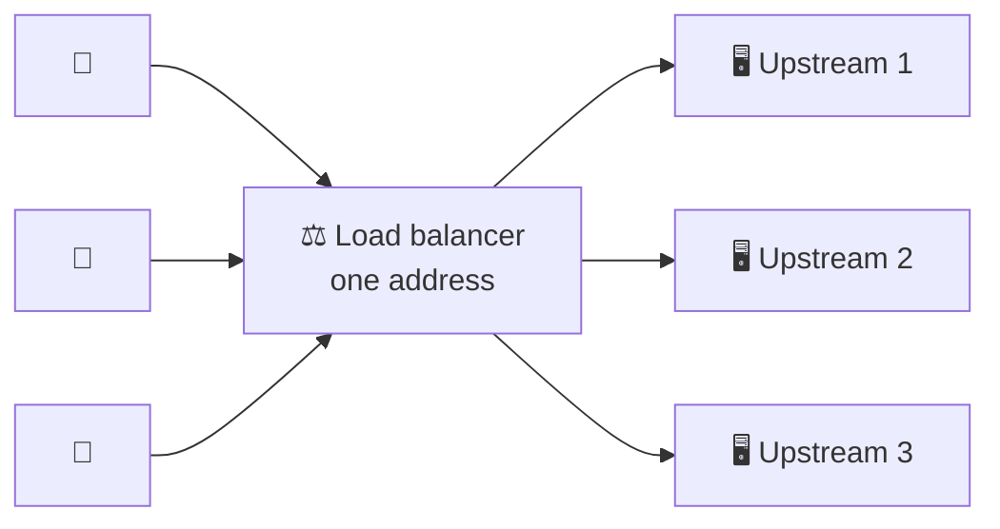
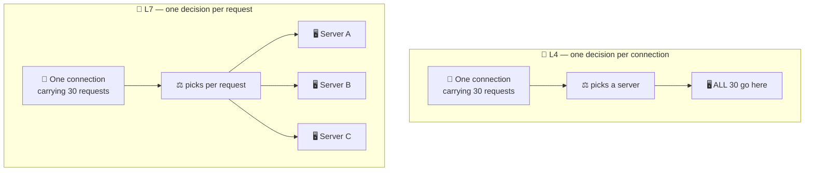

# Load Balancers

> **Phase:** Networking Deep Dives → **Topic:** 5 of 7 → **Read time:** ~55 minutes

---

## Before You Begin

**This document stands alone.** It assumes you have read nothing else — not the foundation series, not the phase before it, not the topics before it. Everything is built here from zero: why one address has to serve many machines, where the balancing decision happens, how a balancer decides which servers are alive, how servers join and leave without losing work, and how the balancer itself avoids being the thing that takes you down.

Two consequences of that choice:

- **Terms get defined where they're used** — pool, upstream, health check, draining, session affinity, virtual IP, single point of failure. Skim past what you already know.
- **Neighbouring topics are named, not taught.** The specific algorithms for choosing a server, consistent hashing, autoscaling, service discovery, and CDN strategy each have their own full treatment elsewhere in this curriculum. Where they touch balancing, this document says so and points; it doesn't absorb them. *Load balancers themselves are complete here.*

Load balancing is one of the concepts in the **Top 30 Must-Know Concepts** foundation series, where it gets a short introduction. This is that concept's deep-dive.

Here is the question the document answers:

> **When many machines can serve a request, how does anything decide where to send it — and how does it know that machine is still capable of answering?**

Here's the trap it disarms. A load balancer looks like a solved problem. It spreads requests across servers; the concept takes one sentence; every cloud provider offers one as a checkbox with sensible defaults. Nothing about it invites study.

Then you meet the outages. And what's striking about load-balancer outages is that they are almost never caused by the balancer failing to spread traffic. They're caused by it **doing precisely what it was configured to do** — removing servers that were perfectly healthy, keeping servers that had stopped working, discarding requests it was already holding during a routine deploy, or concluding that every machine in the fleet had died at the same instant. In each case the configuration was followed exactly. The configuration encoded a belief that turned out to be wrong.

> **The mindset shift:** stop thinking of a load balancer as *the thing that spreads requests* and start thinking of it as **the thing that continuously decides which servers exist.** Distribution is the easy half, and it is largely solved. The hard half is the judgement running underneath it, re-evaluated every few seconds: *is this machine alive? is it ready yet? is it still ready? should I stop sending it work — and what about the requests it is holding right now?* Every serious load-balancer failure is a wrong answer to one of those four questions. And wrong answers are dangerous precisely because they don't look like failures — they look exactly like the system working as designed.

---

## Table of Contents

1. [Many Servers, One Address](#1-many-servers-one-address)
2. [Where the Balancing Happens](#2-where-the-balancing-happens)
3. [Health Checking — Knowing What's Alive](#3-health-checking--knowing-whats-alive)
4. [What a Health Check Actually Proves](#4-what-a-health-check-actually-proves)
5. [Adding and Removing Servers](#5-adding-and-removing-servers)
6. [Session Affinity — When Requests Must Come Back](#6-session-affinity--when-requests-must-come-back)
7. [Making the Front Door Redundant](#7-making-the-front-door-redundant)
8. [When Balancing Makes Things Worse](#8-when-balancing-makes-things-worse)
9. [What a Load Balancer Cannot Do](#9-what-a-load-balancer-cannot-do)
10. [Putting It All Together — The Health Check That Caused the Outage](#10-putting-it-all-together--the-health-check-that-caused-the-outage)
11. [Final Recap](#11-final-recap)

---

## 1. Many Servers, One Address

Start with a mismatch that has no obvious resolution.

**A client can only address one thing.** It has a name, it resolves that name to an address, it connects. Whatever answers is the system, as far as the client is concerned.

**Capacity requires many things.** One machine has a ceiling — a finite number of requests per second, a finite amount of memory, and a hard limit past which adding work only makes everything slower. Serving more than one machine can handle means running several.

So: clients can hold one address, and you need many machines. Something has to reconcile that.

> **A load balancer is a component that accepts requests at a single address and distributes them across a group of servers, any of which can produce the answer. That group is the pool; each member is an upstream.**

Two words worth fixing now, because they recur throughout: **upstream** means toward the machines that do the work — from the balancer's view, its upstreams are the servers it forwards to. **Downstream** means toward the client that asked.

### The Precondition Nobody States

There's a requirement hiding in that diagram, and it's the one that makes everything else possible:

> **Any server in the pool must be able to answer any request.**

If server 2 knows something server 1 doesn't — a logged-in user's shopping cart, a partially uploaded file, a cached computation — then "send it anywhere" stops being true, and the balancer's freedom to choose evaporates. Every request from that user must now return to server 2 specifically.

This property is called being **stateless**: the server holds nothing between requests that a later request depends on. Anything that must persist lives somewhere shared — a database, a cache, a token the client carries.

Statelessness is what makes machines **interchangeable**, and interchangeability is the entire foundation of this document. It's why you can add a server and immediately use it, remove one and lose nothing, and replace a failed one without any client noticing. §6 is what happens when you can't have it.

### What "Balancing" Actually Means

The name suggests equalising load, and that's the aspiration rather than the mechanism. A balancer doesn't measure load and equalise it; it applies a **selection rule** to each incoming request and hopes the result distributes work evenly.

That distinction matters because the rule can be wrong. Sending requests to servers in rotation distributes *requests* evenly — which distributes *work* evenly only if all requests cost the same and all servers are equally capable. Neither is reliably true.

**The specific rules — rotation, fewest-connections, weighted, hash-based — and how each behaves under load are Topic 06.** This document treats the choice as a black box: *something* picks an upstream. What matters here is everything around that choice, which turns out to be where the difficulty lives.

### Three Things You Get Beyond Capacity

Capacity is the obvious motivation. Three others come along with it, and in practice they're often the reason a balancer is deployed in front of a *single* server:

| Benefit | What it means |
|---|---|
| **Survives failure** | A machine dies; the others absorb its traffic. Nobody outside notices |
| **Deploys without downtime** | Update servers a few at a time while the rest serve (§5) |
| **The fleet is invisible** | Clients hold one address; what's behind it can grow, shrink, or be entirely replaced |

The middle row is worth flagging as the one teams underestimate. Deploying without dropping requests isn't an application capability — it's something the balancer provides by controlling which servers receive traffic and when. §5 is how.

> 💡 **Key Insight**
>
> A load balancer exists to resolve an unavoidable mismatch — **clients can address one thing, capacity requires many** — and the entire arrangement rests on one precondition that's easy to state and hard to keep: **any server must be able to answer any request.** Notice that distribution, the thing the component is named after, is the part that's essentially solved. Everything genuinely difficult is adjacent to it: knowing which servers are capable of answering, and changing that set safely while traffic is flowing.

### Quick Recap — Many Servers, One Address

- Clients can hold **one address**; capacity requires **many machines**. A load balancer reconciles that, distributing across a **pool** of **upstreams**.
- The precondition is **statelessness** — any server must answer any request — which is what makes machines **interchangeable**.
- "Balancing" is really applying a **selection rule** and hoping work distributes evenly; the rules themselves are **Topic 06**.
- Beyond capacity it buys **failure survival, zero-downtime deploys, and an invisible fleet** — and the deploy benefit is a balancer feature, not an application one (§5).

---

## 2. Where the Balancing Happens

§1 treated the selection rule as a black box. Before opening anything else, there's a prior question: **at what granularity does the balancer get to choose?**

The answer depends on how much of the traffic it interprets, and it produces two quite different components that share a name.

### Connections Versus Requests

Network traffic arrives in layers. A **connection** is the lower-level thing — two machines establish a channel identified by addresses and ports, and bytes flow through it. A **request** is the higher-level thing — a structured message with a destination path, headers, and a body, carried inside that channel.

The distinction matters enormously here, because **one connection carries many requests.** A browser opens a connection and sends dozens of requests over it. So a balancer that decides per *connection* makes one decision covering all of them, while a balancer that decides per *request* makes a fresh decision each time.

That single difference is what separates the two kinds:

| | **Connection-level (L4)** | **Request-level (L7)** |
|---|---|---|
| Decides once per | **Connection** | **Request** |
| Can distribute on | Source address, destination port | Path, headers, cookies, method, host |
| Interprets traffic | No — bytes are opaque | Yes — must parse each message |
| Works with encrypted traffic | ✅ Never needs to read it | ❌ Must decrypt first |
| Protocol support | Anything — databases, queues, custom | The protocol it implements (usually HTTP) |
| Cost per request | Minimal | Parsing and re-emitting |

The layer numbers come from a standard network model — **Layer 4** being the transport layer that moves bytes between ports, **Layer 7** the application layer where those bytes have meaning. The numbering is conventional shorthand; the substance is entirely in the first row of that table.

### What Each Granularity Costs You

The consequences run deeper than "L7 is more flexible."

**A long-lived connection pins its traffic.** With connection-level balancing, a client that keeps a connection open for an hour sends an hour of traffic to whichever server it was assigned. If that server is overloaded, nothing corrects it until the connection closes. Distribution that looked even at connection time drifts arbitrarily far from even as connections age — and the busiest clients, holding the most persistent connections, are exactly the ones least likely to be redistributed.

**Removing a server is harder at L4.** When a server must be taken out of service (§5), a request-level balancer simply stops choosing it and existing requests finish naturally. A connection-level balancer has connections *bound* to that server, and must either wait for them to close on their own or break them.

**Encryption forces the choice.** Reading a path or header means the traffic must be decrypted first. A connection-level balancer never reads anything, so it forwards encrypted traffic untouched and never needs a certificate. A request-level balancer must terminate the encryption to see inside — which means it holds the certificate and sees all content in plaintext. That's a security decision embedded in what looks like a routing choice.

**Health checking gets sharper at L7.** A connection-level balancer can generally establish that a port accepts connections. A request-level one can issue a real request and evaluate the response — which is where §3 and §4 live, and it's the more consequential difference than routing flexibility.

### Two Other Places Balancing Can Happen

A dedicated balancer isn't the only option, and both alternatives are worth recognising:

- **Name-resolution balancing.** The name-to-address lookup returns different addresses to different clients, spreading them before any connection is made. It's the only approach that distributes across *separate locations*, since a single balancer necessarily lives in one of them. Its weakness is that the answers are cached by machines you don't control, so removing a failed address doesn't take effect until those caches expire — which makes it poor at reacting to failure. §7 returns to this.
- **Client-side balancing.** The client holds the server list and chooses directly, with no middle component. This removes an entire hop and its failure mode, at the cost of every client needing the current list and the selection logic. Common inside systems where you control all the callers; impractical when the callers are browsers. *How clients obtain and refresh that list is service discovery, which belongs to Phase 09.*

> 💡 **Key Insight**
>
> The real question isn't which layer a balancer operates at — it's **how often it gets to decide.** Connection-level balancing makes one choice and lives with it for the life of that connection, which means a long-lived connection is effectively a long-term assignment that nothing revisits. Request-level balancing re-decides continuously, so the distribution self-corrects and servers can be removed cleanly. Everything else — routing flexibility, encryption handling, health-check depth — follows from that difference in decision frequency.

### Quick Recap — Where the Balancing Happens

- **One connection carries many requests**, so the decisive question is whether the balancer chooses per **connection** (L4) or per **request** (L7).
- Connection-level balancing **pins long-lived connections** to one server, so distribution drifts and removal is disruptive; request-level balancing re-decides and self-corrects.
- **Encryption forces the choice**: reading paths and headers requires terminating it, which means holding the certificate and seeing plaintext.
- **Name-resolution balancing** spreads across locations but reacts slowly to failure; **client-side balancing** removes the hop but requires every client to hold the server list.
