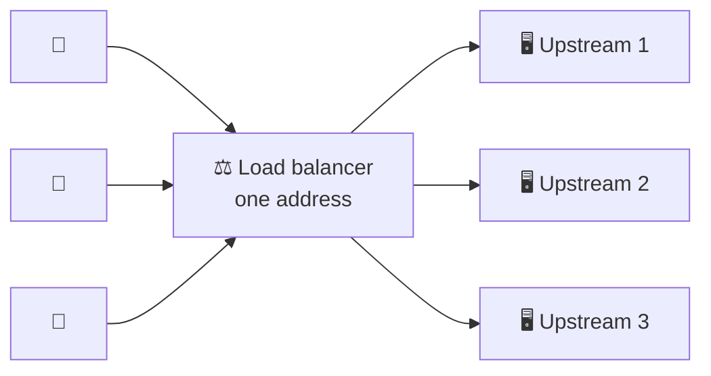
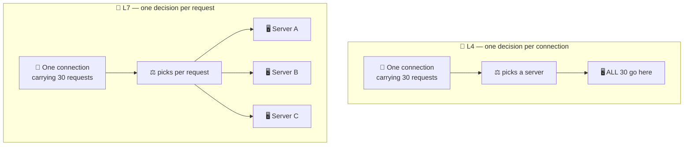
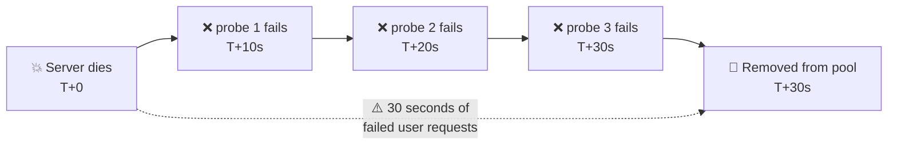
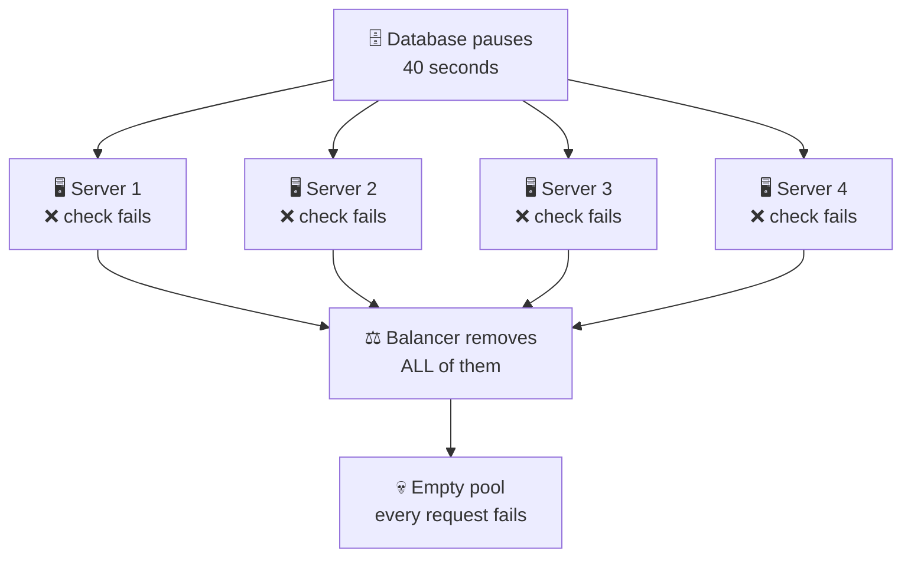
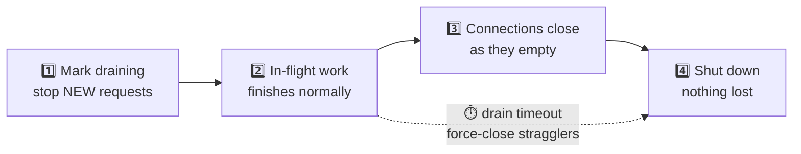
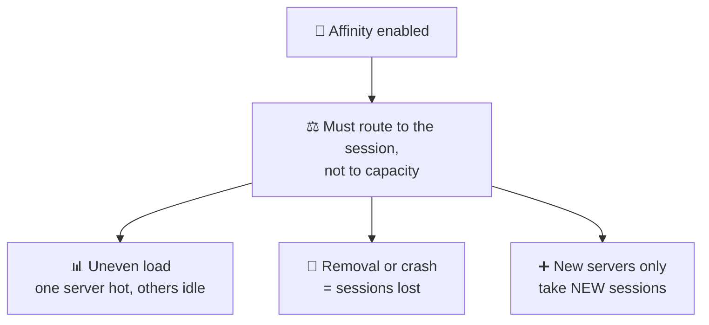
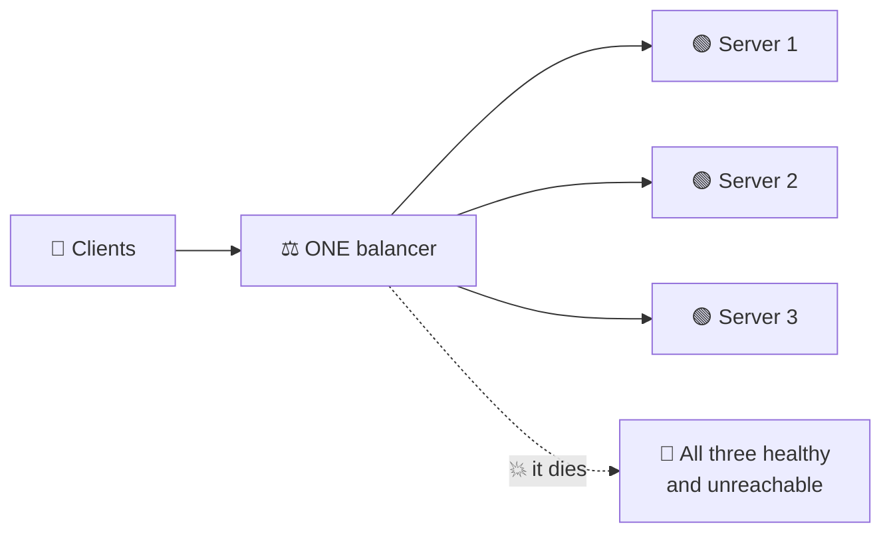
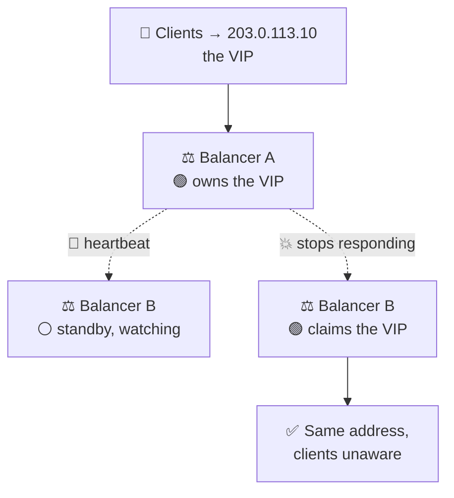
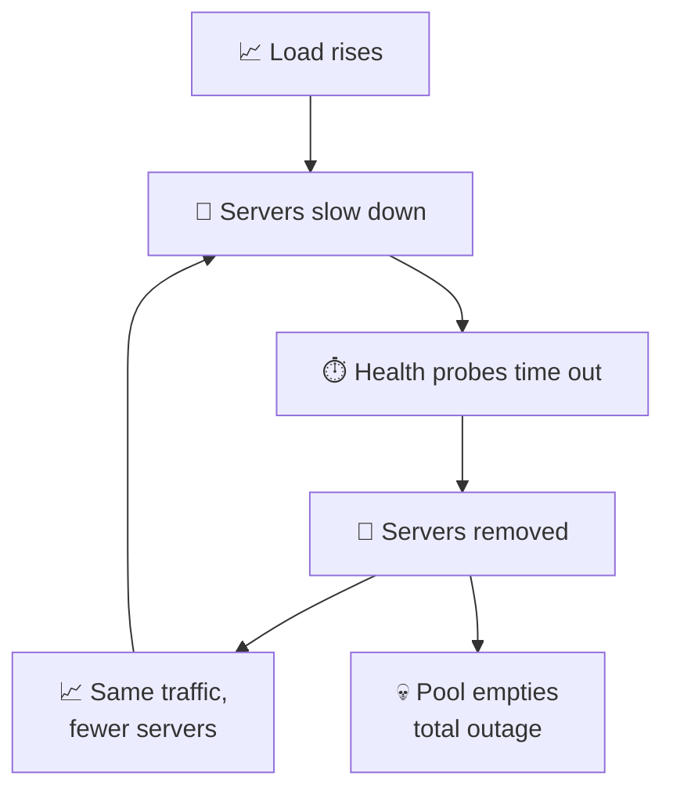
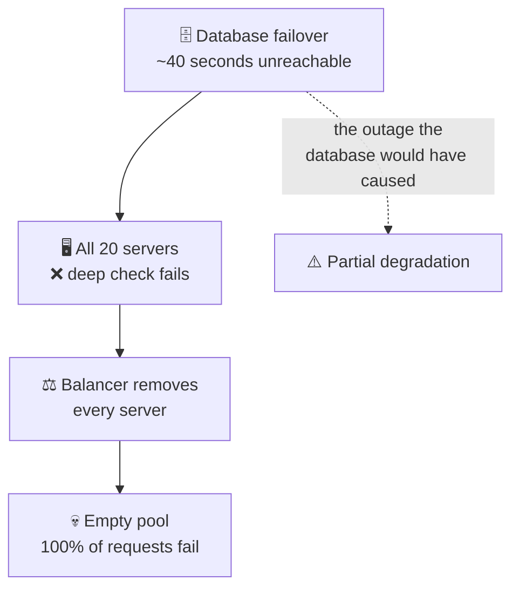

# Load Balancers

> **Phase:** Networking Deep Dives → **Topic:** 5 of 7 → **Read time:** ~55 minutes

---

## Before You Begin

**This document stands alone.** It assumes you have read nothing else — not the foundation series, not the phase before it, not the topics before it. Everything is built here from zero: why one address has to serve many machines, where the balancing decision happens, how a balancer decides which servers are alive, how servers join and leave without losing work, and how the balancer itself avoids being the thing that takes you down.

Two consequences of that choice:

- **Terms get defined where they're used** — pool, upstream, health check, draining, session affinity, virtual IP, single point of failure. Skim past what you already know.
- **Neighbouring topics are named, not taught.** The specific algorithms for choosing a server, consistent hashing, autoscaling, service discovery, and CDN strategy each have their own full treatment elsewhere in this curriculum. Where they touch balancing, this document says so and points; it doesn't absorb them. *Load balancers themselves are complete here.*

Load balancing is one of the concepts in the **Top 30 Must-Know Concepts** foundation series, where it gets a short introduction. This is that concept's deep-dive.

Here is the question the document answers:

> **When many machines can serve a request, how does anything decide where to send it — and how does it know that machine is still capable of answering?**

Here's the trap it disarms. A load balancer looks like a solved problem. It spreads requests across servers; the concept takes one sentence; every cloud provider offers one as a checkbox with sensible defaults. Nothing about it invites study.

Then you meet the outages. And what's striking about load-balancer outages is that they are almost never caused by the balancer failing to spread traffic. They're caused by it **doing precisely what it was configured to do** — removing servers that were perfectly healthy, keeping servers that had stopped working, discarding requests it was already holding during a routine deploy, or concluding that every machine in the fleet had died at the same instant. In each case the configuration was followed exactly. The configuration encoded a belief that turned out to be wrong.

> **The mindset shift:** stop thinking of a load balancer as *the thing that spreads requests* and start thinking of it as **the thing that continuously decides which servers exist.** Distribution is the easy half, and it is largely solved. The hard half is the judgement running underneath it, re-evaluated every few seconds: *is this machine alive? is it ready yet? is it still ready? should I stop sending it work — and what about the requests it is holding right now?* Every serious load-balancer failure is a wrong answer to one of those four questions. And wrong answers are dangerous precisely because they don't look like failures — they look exactly like the system working as designed.

---

## Table of Contents

1. [Many Servers, One Address](#1-many-servers-one-address)
2. [Where the Balancing Happens](#2-where-the-balancing-happens)
3. [Health Checking — Knowing What's Alive](#3-health-checking--knowing-whats-alive)
4. [What a Health Check Actually Proves](#4-what-a-health-check-actually-proves)
5. [Adding and Removing Servers](#5-adding-and-removing-servers)
6. [Session Affinity — When Requests Must Come Back](#6-session-affinity--when-requests-must-come-back)
7. [Making the Front Door Redundant](#7-making-the-front-door-redundant)
8. [When Balancing Makes Things Worse](#8-when-balancing-makes-things-worse)
9. [What a Load Balancer Cannot Do](#9-what-a-load-balancer-cannot-do)
10. [Putting It All Together — The Health Check That Caused the Outage](#10-putting-it-all-together--the-health-check-that-caused-the-outage)
11. [Final Recap](#11-final-recap)

---

## 1. Many Servers, One Address

Start with a mismatch that has no obvious resolution.

**A client can only address one thing.** It has a name, it resolves that name to an address, it connects. Whatever answers is the system, as far as the client is concerned.

**Capacity requires many things.** One machine has a ceiling — a finite number of requests per second, a finite amount of memory, and a hard limit past which adding work only makes everything slower. Serving more than one machine can handle means running several.

So: clients can hold one address, and you need many machines. Something has to reconcile that.

> **A load balancer is a component that accepts requests at a single address and distributes them across a group of servers, any of which can produce the answer. That group is the pool; each member is an upstream.**

Two words worth fixing now, because they recur throughout: **upstream** means toward the machines that do the work — from the balancer's view, its upstreams are the servers it forwards to. **Downstream** means toward the client that asked.

### The Precondition Nobody States

There's a requirement hiding in that diagram, and it's the one that makes everything else possible:

> **Any server in the pool must be able to answer any request.**

If server 2 knows something server 1 doesn't — a logged-in user's shopping cart, a partially uploaded file, a cached computation — then "send it anywhere" stops being true, and the balancer's freedom to choose evaporates. Every request from that user must now return to server 2 specifically.

This property is called being **stateless**: the server holds nothing between requests that a later request depends on. Anything that must persist lives somewhere shared — a database, a cache, a token the client carries.

Statelessness is what makes machines **interchangeable**, and interchangeability is the entire foundation of this document. It's why you can add a server and immediately use it, remove one and lose nothing, and replace a failed one without any client noticing. §6 is what happens when you can't have it.

### What "Balancing" Actually Means

The name suggests equalising load, and that's the aspiration rather than the mechanism. A balancer doesn't measure load and equalise it; it applies a **selection rule** to each incoming request and hopes the result distributes work evenly.

That distinction matters because the rule can be wrong. Sending requests to servers in rotation distributes *requests* evenly — which distributes *work* evenly only if all requests cost the same and all servers are equally capable. Neither is reliably true.

**The specific rules — rotation, fewest-connections, weighted, hash-based — and how each behaves under load are Topic 06.** This document treats the choice as a black box: *something* picks an upstream. What matters here is everything around that choice, which turns out to be where the difficulty lives.

### Three Things You Get Beyond Capacity

Capacity is the obvious motivation. Three others come along with it, and in practice they're often the reason a balancer is deployed in front of a *single* server:

| Benefit | What it means |
|---|---|
| **Survives failure** | A machine dies; the others absorb its traffic. Nobody outside notices |
| **Deploys without downtime** | Update servers a few at a time while the rest serve (§5) |
| **The fleet is invisible** | Clients hold one address; what's behind it can grow, shrink, or be entirely replaced |

The middle row is worth flagging as the one teams underestimate. Deploying without dropping requests isn't an application capability — it's something the balancer provides by controlling which servers receive traffic and when. §5 is how.

> 💡 **Key Insight**
>
> A load balancer exists to resolve an unavoidable mismatch — **clients can address one thing, capacity requires many** — and the entire arrangement rests on one precondition that's easy to state and hard to keep: **any server must be able to answer any request.** Notice that distribution, the thing the component is named after, is the part that's essentially solved. Everything genuinely difficult is adjacent to it: knowing which servers are capable of answering, and changing that set safely while traffic is flowing.

### Quick Recap — Many Servers, One Address

- Clients can hold **one address**; capacity requires **many machines**. A load balancer reconciles that, distributing across a **pool** of **upstreams**.
- The precondition is **statelessness** — any server must answer any request — which is what makes machines **interchangeable**.
- "Balancing" is really applying a **selection rule** and hoping work distributes evenly; the rules themselves are **Topic 06**.
- Beyond capacity it buys **failure survival, zero-downtime deploys, and an invisible fleet** — and the deploy benefit is a balancer feature, not an application one (§5).

---

## 2. Where the Balancing Happens

§1 treated the selection rule as a black box. Before opening anything else, there's a prior question: **at what granularity does the balancer get to choose?**

The answer depends on how much of the traffic it interprets, and it produces two quite different components that share a name.

### Connections Versus Requests

Network traffic arrives in layers. A **connection** is the lower-level thing — two machines establish a channel identified by addresses and ports, and bytes flow through it. A **request** is the higher-level thing — a structured message with a destination path, headers, and a body, carried inside that channel.

The distinction matters enormously here, because **one connection carries many requests.** A browser opens a connection and sends dozens of requests over it. So a balancer that decides per *connection* makes one decision covering all of them, while a balancer that decides per *request* makes a fresh decision each time.

That single difference is what separates the two kinds:

| | **Connection-level (L4)** | **Request-level (L7)** |
|---|---|---|
| Decides once per | **Connection** | **Request** |
| Can distribute on | Source address, destination port | Path, headers, cookies, method, host |
| Interprets traffic | No — bytes are opaque | Yes — must parse each message |
| Works with encrypted traffic | ✅ Never needs to read it | ❌ Must decrypt first |
| Protocol support | Anything — databases, queues, custom | The protocol it implements (usually HTTP) |
| Cost per request | Minimal | Parsing and re-emitting |

The layer numbers come from a standard network model — **Layer 4** being the transport layer that moves bytes between ports, **Layer 7** the application layer where those bytes have meaning. The numbering is conventional shorthand; the substance is entirely in the first row of that table.

### What Each Granularity Costs You

The consequences run deeper than "L7 is more flexible."

**A long-lived connection pins its traffic.** With connection-level balancing, a client that keeps a connection open for an hour sends an hour of traffic to whichever server it was assigned. If that server is overloaded, nothing corrects it until the connection closes. Distribution that looked even at connection time drifts arbitrarily far from even as connections age — and the busiest clients, holding the most persistent connections, are exactly the ones least likely to be redistributed.

**Removing a server is harder at L4.** When a server must be taken out of service (§5), a request-level balancer simply stops choosing it and existing requests finish naturally. A connection-level balancer has connections *bound* to that server, and must either wait for them to close on their own or break them.

**Encryption forces the choice.** Reading a path or header means the traffic must be decrypted first. A connection-level balancer never reads anything, so it forwards encrypted traffic untouched and never needs a certificate. A request-level balancer must terminate the encryption to see inside — which means it holds the certificate and sees all content in plaintext. That's a security decision embedded in what looks like a routing choice.

**Health checking gets sharper at L7.** A connection-level balancer can generally establish that a port accepts connections. A request-level one can issue a real request and evaluate the response — which is where §3 and §4 live, and it's the more consequential difference than routing flexibility.

### Two Other Places Balancing Can Happen

A dedicated balancer isn't the only option, and both alternatives are worth recognising:

- **Name-resolution balancing.** The name-to-address lookup returns different addresses to different clients, spreading them before any connection is made. It's the only approach that distributes across *separate locations*, since a single balancer necessarily lives in one of them. Its weakness is that the answers are cached by machines you don't control, so removing a failed address doesn't take effect until those caches expire — which makes it poor at reacting to failure. §7 returns to this.
- **Client-side balancing.** The client holds the server list and chooses directly, with no middle component. This removes an entire hop and its failure mode, at the cost of every client needing the current list and the selection logic. Common inside systems where you control all the callers; impractical when the callers are browsers. *How clients obtain and refresh that list is service discovery, which belongs to Phase 09.*

> 💡 **Key Insight**
>
> The real question isn't which layer a balancer operates at — it's **how often it gets to decide.** Connection-level balancing makes one choice and lives with it for the life of that connection, which means a long-lived connection is effectively a long-term assignment that nothing revisits. Request-level balancing re-decides continuously, so the distribution self-corrects and servers can be removed cleanly. Everything else — routing flexibility, encryption handling, health-check depth — follows from that difference in decision frequency.

### Quick Recap — Where the Balancing Happens

- **One connection carries many requests**, so the decisive question is whether the balancer chooses per **connection** (L4) or per **request** (L7).
- Connection-level balancing **pins long-lived connections** to one server, so distribution drifts and removal is disruptive; request-level balancing re-decides and self-corrects.
- **Encryption forces the choice**: reading paths and headers requires terminating it, which means holding the certificate and seeing plaintext.
- **Name-resolution balancing** spreads across locations but reacts slowly to failure; **client-side balancing** removes the hop but requires every client to hold the server list.

---

## 3. Health Checking — Knowing What's Alive

A balancer distributing across a pool needs to know what's in the pool. Not the configured list — the *currently working* list. Servers crash, hang, run out of memory, get rebooted, and lose network connectivity, and none of them announce it.

> **A health check is a periodic test the balancer runs against each upstream to decide whether it should keep receiving traffic.**

This is the mechanism that turns a static configuration into a live view of reality, and it's where most of this document's difficulty concentrates.

### Two Ways to Find Out

**Active checking** — the balancer independently contacts each server on a schedule and evaluates the response. Every few seconds, every server, whether or not real traffic is flowing.

**Passive checking** — the balancer watches real traffic and draws conclusions. A server returning errors or timing out repeatedly gets marked bad, with no separate probe.

| | Active | Passive |
|---|---|---|
| Cost | Constant background traffic | Free — uses requests already happening |
| Detects a problem | Even with no traffic | Only by **failing real user requests** |
| Idle servers | Covered | Invisible until traffic arrives |
| Realism | Tests what the probe tests (§4) | Tests exactly what users experience |

The tradeoff is stark: passive checking is free and perfectly realistic, but it learns a server is broken by **letting real users hit it**. Active checking costs constant probing but finds problems before a user does. Most production setups run both — active checks as the primary signal, passive observation as a faster-reacting supplement.

### The Four Numbers

Active checking is configured almost entirely by four values, and their interaction is more consequential than any of them alone:

| Setting | Meaning | Typical |
|---|---|---|
| **Interval** | How often to probe | 5–30 s |
| **Timeout** | How long to wait before calling a probe failed | 1–5 s |
| **Unhealthy threshold** | Consecutive failures before removing the server | 2–3 |
| **Healthy threshold** | Consecutive successes before returning it | 2–5 |

The thresholds exist because a single failed probe means very little. Packets are lost, servers pause briefly, networks hiccup. Removing a server on one missed probe would produce constant churn from noise. Requiring several consecutive failures filters that out.

But the filtering isn't free, and this is the number that actually matters:

> **Detection budget = interval × unhealthy threshold (+ up to one timeout).** This is how long a dead server keeps receiving traffic before the balancer notices.

With a 10-second interval and a threshold of 3, a server that dies at any moment continues receiving requests for **up to 30 seconds**. Every request routed to it during that window fails.

### Why Not Just Check Constantly

The obvious response is to shrink the interval and threshold. Both directions cost something:

- **A short interval** multiplies probe traffic across the fleet — a hundred servers checked every second is a hundred requests per second of pure overhead, and each probe consumes a connection and a worker slot. With redundant balancers (§7) each one probes independently, so the cost multiplies again; a pair checking a hundred servers every second is 200 probes per second before a single user request is served.
- **A low threshold** makes the balancer twitchy. One lost packet removes a healthy server, its traffic redistributes onto the others, and it returns moments later. Under load this produces **flapping**: servers cycling in and out of the pool while traffic sloshes back and forth. §8 explains why flapping is genuinely worse than a clean failure.

There's also an asymmetry worth exploiting deliberately: **removing a server should be fast, returning it should be slow.** Removing a healthy server briefly costs a little capacity; returning a broken server costs failed requests. So a low unhealthy threshold with a higher healthy threshold is usually the right shape — quick to doubt, slow to re-trust.

### The Probe Is Not the Traffic

One structural caveat that §4 develops fully. A health check is a *separate* request the balancer makes on its own behalf. It is not the user's request, it doesn't follow the same path through the application, and it may succeed under exactly the conditions where real requests fail.

A server can pass every probe while being useless — its thread pool exhausted, its dependency unreachable, its responses wrong. The probe answered because answering the probe was cheap.

> ⚠️ **The detection budget is the most under-examined number in a load-balancer configuration.** Teams tune intervals and thresholds independently, without multiplying them, and are then surprised that a crashed server took half a minute to leave the pool. Every configuration contains that answer already — `interval × threshold` — and it directly determines how many user requests a sudden failure costs you. It is worth knowing before an incident rather than calculating during one.

### Quick Recap — Health Checking

- A **health check** converts a static server list into a live one; **active** checks probe on a schedule, **passive** checks infer from real traffic (learning by failing real users).
- Four settings govern it — **interval, timeout, unhealthy threshold, healthy threshold** — and the thresholds exist to filter transient noise.
- **Detection budget = interval × unhealthy threshold**: how long a dead server keeps receiving traffic. A 10 s interval with a threshold of 3 means **30 seconds of failed requests**.
- Tighten it and you get **flapping**; the right shape is asymmetric — **quick to remove, slow to restore** (§8).

---

## 4. What a Health Check Actually Proves

§3 ended on a caveat that deserves its own section, because it is the source of the most damaging load-balancer failures there are.

A health check answers exactly one question: **did this specific probe succeed?** Everything else — *is this server working, is it fast enough, can it serve users* — is inference. The gap between what the probe proves and what you believe it proves is where systems break.

### The Spectrum

Health checks range from trivially shallow to dangerously deep:

| Depth | The probe | Proves | Misses |
|---|---|---|---|
| **Connection** | Can I open a connection to the port? | Something is listening | A hung process still holds the port open |
| **Shallow** | `GET /health` → does it return OK? | The web layer answers | The application may be unable to do real work |
| **Deep** | `GET /health` → checks the database, cache, dependencies | The server can genuinely serve | **Failures shared across the whole fleet (below)** |
| **Synthetic** | Perform a representative real operation | Closest to user reality | Expensive; may have side effects |

Reading down that table, deeper looks strictly better. Each level catches failures the one above misses. The natural conclusion is to make health checks as deep as possible.

**That conclusion causes outages.**

### The Trap — Shared Dependencies

Consider a deep health check that verifies the database is reachable. It looks obviously correct: a server that can't reach the database genuinely cannot serve requests, so it shouldn't receive traffic.

Now the database has a brief problem. Not an outage — a 40-second pause from a failover, a lock, a network blip.

Every server in the fleet checks the same database. So every server fails its health check. **Simultaneously.**

The balancer, following its configuration exactly, empties the entire pool. There are no healthy servers left, so every request now fails — including requests that don't touch the database at all, and including any request that might have succeeded while the database recovered.

A **degraded** system became a **dead** one, and the load balancer is what killed it. The database recovered after 40 seconds; the outage lasted far longer, because now the fleet has to pass its healthy threshold (§3) and the backlog of waiting clients arrives all at once (§8).

The failure mode generalises past databases: **any health check that tests a dependency shared by the whole fleet converts a partial failure of that dependency into a total failure of your service.** The check that was supposed to protect users from broken servers instead removed every working server they had.

### What Health Checks Are Actually For

The resolution comes from being precise about the question a health check answers:

> **A health check should answer: "is this server, specifically, worse than its peers?" — not "is the system healthy?"**

Health checking is a **comparative** mechanism. Its purpose is choosing among servers, and it only helps when servers can differ. A condition affecting every server equally carries no information for that decision — removing them all is never the right response, because there is nowhere better to send the traffic.

That gives a usable rule:

| Check for things that are… | Because |
|---|---|
| **Local to one server** — process alive, threads available, disk usable, warm-up finished | Some servers can be worse than others; removal helps |
| **Not** shared by the whole fleet — the database, a downstream API, a shared cache | Removal cannot help; there's nowhere better to route |

Shared dependencies still need monitoring — they just need *alerting*, not *traffic removal*. Those are different mechanisms with different consequences, and conflating them is precisely the trap.

### Practical Shapes

Two patterns that resolve most of this in practice:

**Separate the questions.** Expose two endpoints: one answering *"is this process alive and able to serve?"* for the balancer, another answering *"are my dependencies reachable?"* for monitoring dashboards. The balancer reads the first; humans and alerting read the second.

**Fail open at the fleet level.** Some balancers support a safety rule: if more than a set fraction of the pool is unhealthy, treat them all as healthy again. The reasoning is blunt and correct — if 90% of your servers report unhealthy, the far more likely explanation is that the *check* is wrong, and sending traffic to possibly-degraded servers beats sending it nowhere. It's a valuable last-resort guard against exactly the cascade above.

> 💡 **Key Insight**
>
> A health check is a **comparative** instrument, not a diagnostic one: its only job is deciding whether *this* server is worse than its peers. The moment a check tests something every server shares, it stops discriminating and starts synchronising — every server fails together, the pool empties, and a dependency hiccup becomes a total outage caused by the machinery meant to prevent one. The correct depth isn't "as deep as possible," it's **exactly as deep as the things that can differ between one server and the next.**

### Quick Recap — What a Health Check Proves

- A check proves only that **one probe succeeded**; "the server works" is inference, and the gap is where outages live.
- Depth ranges from **connection → shallow → deep → synthetic**, and deeper is *not* strictly better.
- **A deep check on a shared dependency fails the whole fleet at once**, converting a brief dependency problem into a total outage — the balancer emptying the pool exactly as configured.
- Check **only what can differ between servers**; monitor shared dependencies with alerting instead, and consider a **fail-open** rule when most of the pool reports unhealthy.

---

## 5. Adding and Removing Servers

§3 and §4 covered servers leaving the pool *involuntarily*, because something broke. This section covers the deliberate case — deploys, scaling, maintenance — where you control the timing and can therefore do it without losing a single request.

The naive approach loses requests, and understanding exactly why is the whole section.

### Removal Is Not Instant

A server is handling live traffic. You want it out of the pool. Stop sending it new requests and shut it down — and you've just discarded every request it was in the middle of processing.

The problem is that "currently serving traffic" isn't a single instant. At any moment a server holds:

- Requests it has received but not finished
- Responses partially written back to clients
- Open connections that will carry more requests
- Background work triggered by requests already accepted

Killing the process abandons all of it. Users see failures for requests that were seconds from succeeding.

### Draining

> **Draining is the process of removing a server from rotation while allowing its in-flight work to finish: stop sending it new requests, wait for existing ones to complete, then shut it down.**

The sequence:

The critical distinction is between **new** and **existing** work. A draining server is in an intermediate state that neither "in the pool" nor "out of the pool" describes — it accepts no new requests but is still actively serving.

The **drain timeout** bounds the wait. Some requests never finish on their own — a long-running upload, a streaming response, a stuck handler. The timeout is the point at which the balancer stops waiting and closes anyway, and it's a straightforward trade: too short and you cut off legitimate slow requests, too long and every deploy crawls. It should exceed your realistic slowest request and no more. Anything genuinely long-running — batch jobs, large exports — shouldn't be holding a request open in the first place.

At connection level (§2) draining is harder, because connections are bound to the server rather than individual requests being routed. The balancer must wait for whole connections to close, which a client holding a persistent connection may not do for a long time.

### Arrival Has Its Own Problem

Adding a server looks like it should be trivial: it's healthy, put it in the pool. But a freshly started server is frequently **slower than its peers for its first minutes of life**, for reasons that have nothing to do with correctness:

- **Caches are empty.** In-process caches, connection pools, and prepared statements are all cold; every request does the expensive version of its work.
- **Runtimes optimise over time.** Many language runtimes interpret code first and compile hot paths later, so early requests run substantially slower.
- **Connections aren't established.** Pools to databases and downstream services fill on demand, and the first requests pay setup costs.

A server passing its health check is therefore *correct* but not yet *fast*. Send it a full share of traffic immediately and it responds slowly for a minute, which shows up as a latency spike after every deploy — and worse, under some selection rules a slow server *attracts* additional traffic, which §8 covers.

**Slow start** (or warm-up) fixes this: the new server receives a deliberately small fraction of traffic that ramps up over a configured period, giving it real requests to warm its caches without being responsible for a full share while cold.

### Why This Is the Deploy Story

Combining both directions gives zero-downtime deployment, and it's worth seeing that it's entirely a load-balancer capability rather than an application one:

1. Drain one server; wait for its work to finish.
2. Shut it down, update it, start it again.
3. Wait for it to pass its healthy threshold (§3), ramping traffic in via slow start.
4. Repeat for the next server.

At every moment, some servers are serving. No request is dropped, no user sees an error, and the application needed no special deployment logic — it only needed to be interchangeable (§1) and to shut down gracefully when asked.

That last requirement is the one applications routinely fail. Draining depends on the server actually *finishing* its work when told to stop, which means handling the shutdown signal, refusing new work, completing what it holds, and exiting. An application that exits immediately on that signal defeats draining entirely — the balancer stopped sending new requests, and the process threw away the old ones anyway.

> ⚠️ **Draining is a contract between the balancer and the application, and it silently fails if either side doesn't honour it.** The balancer's half is stopping new traffic and waiting; the application's half is catching the shutdown signal and finishing in-flight work. Configure a perfect drain timeout in front of an application that exits instantly, and you get exactly the dropped requests you were trying to avoid — with no error anywhere in the balancer's logs, because from its side everything went correctly.

### Quick Recap — Adding and Removing Servers

- Removal isn't instant: a server holds **in-flight requests, partial responses, and open connections**, all discarded by an abrupt shutdown.
- **Draining** stops new work while letting existing work finish, bounded by a **drain timeout** set just above your realistic slowest request.
- Arrival needs **slow start** — a new server is correct but cold (empty caches, unoptimised runtime, unestablished pools), so traffic should ramp rather than arrive at full share.
- **Zero-downtime deploys are a balancer capability**, but draining is a **two-sided contract**: an application that ignores the shutdown signal drops requests silently.

---

## 6. Session Affinity — When Requests Must Come Back

§1 established the precondition: any server must be able to answer any request. Sometimes that isn't true, and the balancer has to accommodate it.

> **Session affinity — also called sticky sessions — is the balancer consistently routing a particular client's requests to the same server, rather than choosing freshly each time.**

### Why Anyone Needs It

Affinity exists because a server is holding something the others don't have:

- **In-memory session state.** The user logged in, and their session lives in that process's memory. Another server has never heard of them.
- **A local cache** built up for that user, expensive to rebuild elsewhere.
- **An open long-lived connection** — a real-time channel established with that specific process.
- **Multi-step operations** where partial progress lives on one machine, like a chunked upload.

In every case the same shape: **a server knows something that the pool doesn't share.** Affinity is the balancer working around a property of the application.

### How It's Done

Two common mechanisms, with meaningfully different behaviour:

| | **Client-address based** | **Cookie based** |
|---|---|---|
| Pins on | The client's network address | A value the balancer sets and reads |
| Works at | Connection level (§2) | Request level — must read the message |
| Breaks when | The client's address changes | Cookies are cleared or unsupported |
| Fairness | **Poor** — many users can share one address | Good — genuinely per-client |

The address-based approach has a specific failure worth knowing. Many users frequently share one visible address — an entire office behind a shared gateway, a mobile network aggregating subscribers. Pinning by address sends *all* of them to a single server, which can concentrate a substantial fraction of traffic onto one machine while the rest of the pool idles.

Cookie-based affinity avoids that by identifying the client rather than the network path, at the cost of requiring request-level balancing and a client that keeps cookies.

### What It Costs

Affinity is a workaround, and it charges for itself in four ways:

**Distribution degrades.** The balancer can no longer send requests where capacity is; it must send them where the session is. Long-lived sessions accumulate unevenly, and a server can be overloaded while its peers are idle — with the balancer *correctly* continuing to overload it.

**Removal loses state.** §5's draining assumed in-flight requests finish and the server leaves cleanly. With affinity, the sessions pinned to that server are also gone. Every affected user is logged out, loses their cart, or has their upload fail — during a routine deploy.

**Failure is worse.** A crash (§3) doesn't just cost the requests in flight; it costs every session on that machine. The blast radius of losing one server is no longer proportional to its share of traffic — it's the whole population that happened to be pinned there.

**Scaling out helps less.** Adding a server only helps *new* sessions. Existing ones stay where they are, so a fleet under load doesn't rebalance when you add capacity — it just gets somewhere to put future users.

### The Better Answer

Affinity treats the symptom. The cause is server-held state, and removing it is almost always preferable:

- **Move sessions to a shared store** — a cache or database every server can reach. Any server then serves any user, and §1's precondition is restored for real.
- **Give the state to the client** — a signed token carrying what's needed, presented with each request. Nothing to look up and nothing to share.

Both convert "this server knows you" into "any server can find out about you," which is the property that makes the entire pool work. The trade is a lookup on each request, or a larger request — usually a good exchange for even distribution, clean deploys, and failures that cost only what was in flight.

The honest exception: genuinely long-lived connections, where a real-time channel is established with one process and cannot meaningfully be moved. There, affinity isn't a workaround — it's inherent, and the design question becomes how to lose those connections gracefully rather than how to avoid pinning.

> 💡 **Key Insight**
>
> Session affinity is a **load balancer compensating for an application that broke the interchangeability rule**, and the compensation is expensive: distribution stops following capacity, deploys start costing user sessions, a crash takes down everyone pinned to that machine, and new servers only help future users. It works, and it is almost always the second-best answer. The first is to **relocate the state** — into a shared store or into the client — so that any server can serve anyone and the balancer is free to route by capacity again.

### Quick Recap — Session Affinity

- **Affinity** pins a client to one server, needed when that server holds something the pool doesn't share — session memory, a local cache, a live connection, partial progress.
- **Address-based** pinning is connection-level and unfair when many users share one address; **cookie-based** is per-client but needs request-level balancing.
- It costs four things: **uneven distribution, sessions lost on drain or crash, larger blast radius, and scaling that only helps new users**.
- The better fix is **removing server-held state** — shared store or client-carried token — restoring the interchangeability affinity was working around (§1).

---

## 7. Making the Front Door Redundant

Every section so far has been about the balancer protecting you from server failures. This one is about the question that produces: **what protects you from the balancer?**

### The Uncomfortable Arithmetic

Some components can fail without anyone noticing. Others take the entire system with them. What separates the two is a pair of properties that must be present together:

> **A single point of failure is something the system cannot operate without, that exists in quantity one.** Take away either property and the danger goes with it. Duplicate the indispensable thing and losing one copy is a non-event; leave the solitary thing unimportant and losing it costs nothing. The lethal combination is *required* and *unique* in the same component.

A load balancer is required by construction — it owns the address clients connect to, and every request travels through it. That property isn't incidental; it's the entire reason the component exists.

So a single balancer means the whole arrangement — every redundant server, every health check, every careful drain — inherits the availability of one machine. You built a fleet that survives any server failing, and placed in front of it a box that survives nothing.

That's the arithmetic teams miss: **redundancy behind a non-redundant component doesn't produce a redundant system.** It produces a system whose failure mode moved.

So uniqueness is the only property left that you can change. Everything below is how.

### The Problem With Two Balancers

Adding a second balancer is obvious. Making clients *use* it is not.

Clients connect to an address. A second balancer has a *different* address, which no client knows about — so the spare sits there, fully functional, receiving nothing. Redundancy requires not just a spare but a way for traffic to reach it, and that's the hard part.

Three approaches, with genuinely different costs.

### Approach 1 — A Floating Address

The most direct solution decouples the address from the machine.

> **A virtual IP (VIP), or floating IP, is an address not permanently bound to any one machine. Whichever balancer currently owns it receives traffic sent there — and ownership can move.**

Two balancers run as a pair. One holds the VIP and serves; the other stands by, monitoring it. When the active one stops responding, the standby **claims the address** — announcing to the local network that this address now belongs to it — and traffic follows within seconds.

What makes this work is that **clients never learn anything**. The address they hold is still correct; a different machine answers to it now. No name lookup, no cache to expire, no client-side change.

The costs are real: it requires both machines on a network segment where address takeover is permitted, which is straightforward in a datacentre and often restricted in cloud environments. You are also paying full price for a second machine that serves nothing on an ordinary day. And the pair must agree on who is active — if a network partition leaves both believing the other is dead, both claim the address and traffic splits unpredictably between two machines each convinced it is the only one.

### Approach 2 — Name-Level Distribution

Publish several balancer addresses under one name; clients receive one of them.

This spreads load across balancers and survives one failing — but reacting to a failure is slow. The answers clients received are cached on machines you don't control, and those caches keep handing out a dead address until they expire. Failover takes as long as the cached answer lives, which is frequently minutes.

Its real strength is different: it's the only approach that works across **separate locations**. A VIP requires both machines on one network; name-level distribution can point at balancers in different regions entirely. So it's usually the outer layer — coarse distribution across sites — with something faster handling failure inside each one.

### Approach 3 — Announcing the Same Address From Many Places

Several machines in different locations announce the *same* address to the wider internet, and the network routes each client to whichever is nearest. If one stops announcing, routing shifts to another within seconds.

This gives both geographic distribution and fast failover, without cached answers to wait out. It requires the ability to participate in internet routing — realistic for large providers and cloud platforms, generally not something a single team operates directly. In practice you consume it by using a provider whose front door already works this way.

### Comparing Them

| | **Floating address** | **Name-level** | **Same-address-many-places** |
|---|---|---|---|
| Failover time | **Seconds** | Minutes (cache-bound) | **Seconds** |
| Spans locations | ❌ One network segment | ✅ | ✅ |
| Clients need to change | ❌ | ❌ | ❌ |
| Uses spare capacity | ❌ Standby idles | ✅ | ✅ |
| Who can run it | Anyone with the network control | Anyone | Providers, mostly |

Most production systems layer these: name-level distribution across regions, and within each region a pair or cluster of balancers using a floating address.

### The Failure Nobody Rehearses

One warning that applies to all three. A redundancy mechanism you have never triggered on purpose is a guess, not a guarantee. The standby that has never carried traffic, the failover script that stopped working three changes ago, the address takeover depending on a permission someone revoked last quarter — each is discovered broken during the one event it existed to handle. Until then it is perfectly invisible, because a working system produces no evidence about whether its spare works.

Failover is also never instantaneous. The budget breaks down roughly as: heartbeats between the pair every **1–2 seconds**, a failure declared after **2–3 missed** ones, then a second or two for the address takeover to be announced and accepted by the local network. Call it **3–10 seconds** end to end for a floating address — against minutes for the name-level approach, where you additionally wait out cached answers.

During that window every request fails, and in-flight connections at the moment of the switch are lost regardless, because the new machine has no knowledge of connections established with the old one. Redundancy converts a total outage into a brief one — a large improvement, and not the same as zero. It's the same detection-budget arithmetic as §3, now applied to the balancer itself.

> ⚠️ **The component that makes your servers redundant is the one most likely to be left singular.** It's easy to see that servers need duplicating — that's what the balancer is *for* — and correspondingly easy to treat the balancer as infrastructure rather than as a machine that fails. Every health check, drain, and pool in this document assumes something is in front doing the routing. If that something is one box, the entire apparatus is a single machine's uptime wearing a fleet's clothing.

### Quick Recap — Making the Front Door Redundant

- A balancer meets the first SPOF condition **by design** — everything passes through it — so **redundancy behind a single balancer doesn't produce a redundant system**.
- The difficulty isn't the spare, it's **getting traffic to it**: a second balancer has a different address no client knows.
- **A floating address (VIP)** moves between a pair and fails over in seconds with no client change, but needs one network segment, idles a standby, and can split-brain under a partition.
- **Name-level** distribution spans locations but is cache-bound and slow to react; **same-address-many-places** gives both, and is usually consumed via a provider. All of them are fiction until **actually rehearsed**.

---

## 8. When Balancing Makes Things Worse

A load balancer sits between every user and every server, reacting continuously to conditions. That position makes it capable of taking a bad situation and making it considerably worse — not by malfunctioning, but by responding to a problem in a way that amplifies it.

These are the pathologies worth recognising, because each one looks like correct behaviour while it happens.

### Removing Capacity Exactly When You Need It

Traffic rises. Servers slow under the load. Response times stretch past the health-check timeout (§3), so probes start failing. The balancer removes those servers.

Their traffic redistributes onto the remaining servers, which are now *more* loaded, so they slow down too, and fail their checks, and are removed.

Every step is the configuration working. The result is a system that had *degraded* performance converted into *no* service, by machinery that removed every server for the crime of being busy.

The distinction the balancer can't draw is between **slow** and **broken** — and under load, healthy servers look exactly like failing ones. Mitigations exist: health-check timeouts generously above normal response times, checks on a separate path from user traffic so they aren't queued behind it, and the fail-open rule from §4 that ignores health status when most of the pool is failing. All of them amount to making the balancer *less* eager to act on a signal that becomes unreliable precisely when load is highest.

### Retries That Multiply Load

Balancers often retry a failed request against a different server, which is genuinely useful — one server hiccups, another answers, the user never knows.

Under partial failure it becomes an amplifier. Requests fail, so each is retried, perhaps twice. Traffic to the surviving servers is now **triple** the real demand. They fail under it, generating more retries.

Worse, retries frequently stack. The client retries, the balancer retries, and an internal service retries — three layers each multiplying by three, turning one user request into up to twenty-seven. A modest failure becomes a self-sustaining flood that continues after the original cause is fixed.

The arithmetic is worth doing once, because it's more violent than intuition suggests. A service handling 1,000 requests per second loses a quarter of its capacity. The 250 requests per second that now fail are retried by each of three layers:

| Layer | Requests generated |
|---|---|
| Original demand | 1,000/s |
| + client retries (×3) | 1,750/s |
| + balancer retries (×3) | 3,250/s |
| + service retries (×3) | 7,750/s |

Losing 25% of capacity produced nearly **8× the traffic** against the 75% that remains. The surviving servers were never going to withstand that, so they fail too — and the amplification factor climbs as they do. This is why a small failure can take down a system with substantial headroom, and why the retries continue hammering the service long after the original fault is repaired.

The controls are a **retry budget** (retries capped as a fraction of total requests, so they can't dominate traffic), retrying only idempotent requests where a duplicate is harmless, and retrying at exactly one layer rather than every layer. *Circuit breakers — a client-side pattern that stops sending to a failing dependency entirely — are covered in the architecture phase.*

### Everyone Returning at Once

A server is removed and comes back. Or a dependency recovers. Or a balancer fails over (§7).

At that instant, everything that was waiting arrives simultaneously — retried requests, queued work, reconnecting clients. This is a **thundering herd**: a recovery that immediately re-breaks what recovered, because the load arriving at the healed component is far above steady state.

Slow start (§5) is the direct defence for a returning server — ramping traffic rather than restoring a full share instantly. For clients reconnecting, the standard answer is randomised backoff, so retries spread over time instead of synchronising.

The synchronisation is the danger. If a thousand clients all retry after exactly one second, they arrive together and fail together, then retry together — a herd that stays a herd indefinitely. Randomising the wait breaks the lockstep.

### Slow Servers Attracting More Work

A pathology that surprises people because it inverts the intent.

Some selection rules favour the server with the fewest active connections. Under normal conditions that's sensible — fewer connections means more spare capacity.

But consider a server that has started failing *fast*: it errors immediately rather than doing work. Its connections close quickly, so its active count is the lowest in the pool, so it looks like the most available server, so it receives **more** traffic — which it fails, faster, keeping its count lowest.

The broken server draws a growing share of traffic toward itself specifically because it's broken. *The selection rules and their individual pathologies are Topic 06's subject; what matters here is the shape — a metric that means "healthy" in normal conditions can invert during failure.*

### Flapping

§3 mentioned it; here's why it earns a place among the pathologies.

A flapping server oscillates between healthy and unhealthy — passing checks, failing checks, passing again. Each transition costs real work: traffic redistributes, connections re-establish, caches on other servers shift, and with affinity (§6) sessions move or break.

**A consistently dead server is better than a flapping one.** The dead one is removed and the system reaches a stable state with reduced capacity. The flapping one keeps the whole pool in permanent churn, and the churn itself consumes capacity. This is why the healthy threshold should be higher than the unhealthy threshold (§3) — slow re-admission damps oscillation, and a server that keeps failing should stay out until someone looks at it.

> ⚠️ **The load balancer's reactions are tuned for the failure of *one* server among many — and every pathology here is that machinery meeting a failure that isn't shaped that way.** Removing a server is correct when one is broken and catastrophic when all are merely busy. Retrying is correct when a failure is isolated and an amplifier when it's widespread. The judgement to add is that **the balancer's response should get more conservative as the fraction of the pool affected goes up** — because past a certain point, the problem is no longer something moving traffic can solve.

### Quick Recap — When Balancing Makes Things Worse

- Under load, **slow and broken look identical**: probes time out, servers are removed, remaining servers get more load — a spiral that empties the pool.
- **Retries amplify**, especially stacked across client, balancer, and service layers; bound them with a **retry budget** and retry at one layer only.
- Recovery triggers a **thundering herd**; **slow start** protects the returning server and **randomised backoff** breaks client lockstep.
- A **fast-failing server can attract traffic** by looking idle, and a **flapping server is worse than a dead one** — which is why re-admission should be slower than removal.

---

## 9. What a Load Balancer Cannot Do

A load balancer is often the first thing reached for when a system is struggling, and frequently it's the right instrument. But it's a **distribution** device, and problems that aren't distribution problems don't respond to it. Knowing the boundary saves a great deal of wasted effort.

### It Cannot Create Capacity

The most common misplaced expectation. A balancer moves work between machines; it never reduces the work or increases what the machines can do.

If demand exceeds the total capacity of the pool, balancing perfectly changes only *which* requests fail. Ten servers each capable of 100 requests per second serve 1,000 requests per second, and no distribution strategy makes them serve 1,500. Perfect balancing means everything is uniformly slow rather than some servers being fine and others drowning — genuinely better, and not more capacity.

The actual answers are more servers, faster servers, less work per request, or serving fewer requests. *Adding servers automatically in response to demand is autoscaling, covered in the scaling phase — note that it's a separate system that changes the pool, not something the balancer does.*

### It Cannot Fix a Shared Bottleneck

This is §4's lesson from the other direction. Spreading requests across ten servers that all query one database gives that database exactly the same load — you've distributed the *application* tier while the constraint sits somewhere else entirely.

The characteristic symptom: adding servers doesn't help, and may hurt as more machines compete for the same limited resource. It's a genuinely confusing failure, because every dashboard for the thing you scaled looks healthy while performance doesn't improve.

The rule generalises: **a balancer helps only when the constrained resource is the thing being balanced across.** If the bottleneck is downstream and shared, distribution changes nothing about it.

### It Cannot Make Stateful Servers Interchangeable

§6 covered the workaround; here's the limit. When servers hold state that others lack, the balancer can pin clients to them — but it cannot *move* that state, reconstruct it after a crash, or share it.

Affinity manages the constraint without removing it. A pinned server dying still loses everything on it. Only an architectural change — relocating state to a shared store or into the client — actually solves it, and that's application work no balancer configuration substitutes for.

### It Cannot Tell Slow From Broken

Worth stating plainly as a limit, since §8 showed the damage.

A balancer observes response times and success rates. Both are ambiguous. A server responding slowly might be failing, or overloaded, or doing legitimately expensive work. A server returning errors might be broken, or correctly rejecting invalid requests.

The balancer has no way to distinguish these, so it applies thresholds — and thresholds are guesses that hold under normal conditions and stop holding during unusual ones. Every §8 pathology traces back to this ambiguity.

### It Cannot Fix a Bad Deploy

If a new version is broken, distributing it evenly means everyone gets the broken version. The balancer will faithfully spread a defect across the entire fleet.

What it *can* do is control **how much** traffic reaches a version — routing a small share to the new one, comparing behaviour, and rolling forward or back. That's a genuinely powerful capability that turns the balancer into a deployment safety mechanism. But it requires deliberately configured routing; nothing about default balancing provides it.

### What It Is Actually Good At

The honest positive list, from everything above:

| A load balancer is the right tool for | Not for |
|---|---|
| Spreading load across interchangeable servers | Creating capacity that doesn't exist |
| Removing individual failed machines | Failures affecting the whole fleet |
| Deploying and scaling without dropped requests | Making a broken version work |
| Presenting one address for a changing fleet | Bottlenecks downstream of the pool |
| Controlling what fraction of traffic sees what | Turning stateful servers stateless |

> 💡 **Key Insight**
>
> A load balancer is a **distribution** instrument, and distribution only helps when the constraint is *where work goes* rather than *how much there is* or *what happens after it arrives*. That's why the reflex to "add a load balancer" so often disappoints: it's usually applied to capacity shortfalls, shared downstream bottlenecks, or stateful designs, none of which are distribution problems. Ask first **what is actually constrained** — and if the honest answer isn't "which machine gets this request," the fix lives somewhere else.

### Quick Recap — What a Load Balancer Cannot Do

- It **cannot create capacity** — perfect balancing changes which requests fail, not how many the pool can serve.
- It **cannot fix a shared bottleneck**: ten servers querying one database give that database identical load, and adding servers may worsen it.
- It **cannot make stateful servers interchangeable** — affinity manages that constraint, only relocating state removes it.
- It **cannot distinguish slow from broken**, which is the root of every §8 pathology, and it will faithfully distribute a **bad deploy** unless routing is deliberately configured to limit exposure.

---

## 10. Putting It All Together — The Health Check That Caused the Outage

A team runs twenty application servers behind one load balancer. It has worked without incident for two years. Nobody has changed the balancer configuration in about that long, and nobody currently at the company wrote it.

Then, on an ordinary Tuesday, the entire service goes down for eleven minutes — and every server stays healthy throughout.

### Step 1 — The Trigger (§4)

The database performs a routine failover. A standby is promoted; the primary is unreachable for **about 40 seconds**. Unpleasant, entirely survivable, and something the application handles: requests that need the database would fail or retry, while cached reads and static paths would continue.

That's not what happens.

The health check, written years earlier by someone being thorough, is a deep one (§4). Its endpoint verifies the process is alive, checks the cache, **and runs a query against the database**. Any failure returns unhealthy.

Every one of the twenty servers checks the same database. So during the failover, every one of them fails its health check — **at the same time**, because they're all checking the same thing.

The balancer removes all twenty and the pool is empty. Every request now fails — including requests that never touch the database, which would have succeeded perfectly well. **A partial degradation became a total outage, and the load balancer is what converted it.**

### Step 2 — Why It Lasted Longer Than 40 Seconds (§3, §8)

The database recovers on schedule. The outage does not end on schedule.

First, the healthy threshold (§3): servers need **three consecutive successful checks at a 10-second interval** before returning. That's 30 more seconds minimum, and they don't all cross it together.

Then the herd (§8). Eleven minutes of clients have been retrying. The instant the first few servers return, all of that accumulated demand lands on a fraction of the fleet — which promptly slows, fails checks, and gets removed again. The pool oscillates. Recovery takes several minutes longer than the failure did.

Total user-visible outage: **eleven minutes**, from a 40-second database event.

### Step 3 — The Fix (§4)

The correction is small and the reasoning matters more than the change.

They split the endpoint in two:

- **`/health`** — used by the balancer. Answers one question: *is this process alive and able to serve?* Checks nothing shared.
- **`/ready`** — used by monitoring and dashboards. Checks the database, cache, and downstream dependencies, and alerts humans when something is wrong.

This is §4's rule applied directly: **check only what can differ between servers.** The database can't differ between them — it's the same database — so its state carries no information about which server should receive traffic. It needs alerting, not traffic removal.

They also enable the fail-open rule (§4): if more than half the pool reports unhealthy, treat them all as healthy. If ten of twenty servers fail simultaneously, the overwhelming probability is that the check is wrong, and degraded servers beat no servers.

### Step 4 — What the Incident Review Turned Up (§5)

Reviewing the configuration properly for the first time in two years, they find a second problem nobody had noticed.

There is no connection draining (§5). Deploys work by stopping a server, updating it, and starting it again. Every deploy has been discarding whatever requests those servers held — a small number each time, appearing in dashboards as a brief error blip that everyone had come to read as "normal deploy noise."

It was never noise. It was users, several times a week, for two years.

They configure a **30-second drain timeout** — above their slowest realistic request — and discover the second half of the contract: the application exits immediately on the shutdown signal, so draining changes nothing until the application is fixed to finish in-flight work first. The balancer's half was necessary and insufficient.

They add **slow start** (§5) too, having noticed the latency spike after every deploy: freshly started servers with cold caches were taking full traffic while still warming.

### Step 5 — The Thing They'd Been Ignoring (§7)

One more finding, and it's the one that had been visible the whole time: **there is one load balancer.**

Twenty redundant servers, health checks, careful draining — behind a single box whose failure takes everything down (§7). It had never failed, which is precisely why nobody had thought about it.

They deploy a second balancer as an active-standby pair sharing a **floating address** (§7), so failover moves the address in seconds without any client noticing. Then they do the part that's usually skipped: they **test it**, deliberately failing the active balancer during a maintenance window to confirm the standby actually takes over. It doesn't, the first time — a permission needed for the address takeover had never been granted. They'd have discovered that during an outage otherwise.

### The Payoff

Four months later the database fails over again. Requests that need it fail for about thirty seconds; everything else keeps serving. Monitoring pages someone about the database. The load balancer does nothing at all, because nothing about that event concerns which server should receive traffic.

The lesson the team writes down is not about health checks specifically:

> **Every one of these was the load balancer doing exactly what it was told.** It removed servers that failed their check. It didn't drain, because draining wasn't configured. It was a single point of failure because only one was deployed. There was no bug, no misbehaviour, nothing to fix in the software — just a configuration written years ago encoding beliefs that were never quite right, running faithfully ever since.

Load balancer configuration ages badly precisely because it *keeps working*. Nothing forces you to revisit a health check that passes every day, and its worst assumption stays invisible until the one day conditions expose it.

---

## 11. Final Recap

| Concept | Core Insight | Biggest Tradeoff |
|---|---|---|
| **The mismatch** | Clients hold one address; capacity needs many machines | Requires servers to be interchangeable — statelessness is the precondition |
| **Decision granularity** | The real question is *how often it decides*: per connection (L4) or per request (L7) | Per-connection pins long-lived clients; per-request needs decryption and parsing |
| **Health checking** | Turns a static list into a live one, via interval, timeout, and thresholds | **Detection budget = interval × threshold** — how long a dead server keeps getting traffic |
| **What checks prove** | Only that one probe succeeded; checks are **comparative**, not diagnostic | A deep check on a shared dependency fails the whole fleet at once |
| **Draining** | Stop new work, let in-flight work finish, then shut down | A two-sided contract — useless if the application exits instantly |
| **Slow start** | A new server is correct but cold; ramp traffic instead of full share | Without it, every deploy shows a latency spike |
| **Session affinity** | Pins clients when a server holds state the pool doesn't share | Uneven load, sessions lost on drain or crash, scaling that only helps new users |
| **Front-door redundancy** | The balancer meets the first SPOF condition by design | Getting traffic to the spare is the hard part — VIP, name-level, or anycast, each with a failover cost |
| **Amplification** | Removing "slow" servers, retrying, and herds can convert degradation into outage | The response should get *more conservative* as more of the pool is affected |
| **The limits** | It distributes; it doesn't create capacity or fix shared bottlenecks | If the constraint isn't "which machine gets this request," the fix is elsewhere |

### The One Thing to Remember

> **A load balancer is not the thing that spreads requests — it is the thing that continuously decides which servers exist. Distribution is the solved half. The unsolved half is the judgement running underneath it every few seconds: is this machine alive, is it ready, is it still ready, and what happens to the work it is holding right now? Every serious load-balancer failure is a wrong answer to one of those questions, and the wrong answers are uniquely dangerous because they are indistinguishable from correct operation — the pool empties, the deploy drops requests, the spare never takes over, and the configuration was followed exactly the whole time. Its most important setting is not the algorithm. It is what the health check believes, because that belief silently decides whether you have a fleet or nothing at all.**

---

## What's Next

> **Topic 06 — Load Balancing Algorithms**

This document treated one thing as a black box throughout. Something picks an upstream — and *which* one it picks was deliberately left unopened, because everything around that choice turned out to matter more.

Now the choice itself. **Round-robin** and its assumption that all requests cost the same. **Least-connections** and the inversion §8 hinted at, where a fast-failing server looks like the most available one. **Weighted** distribution for fleets of unequal machines. **Hash-based** routing that sends the same key to the same server every time — and what happens to those assignments when the pool changes size.

Each is a few lines to describe and behaves very differently under real load. You've learned what surrounds the decision. Next you find out what the decision is.

---
