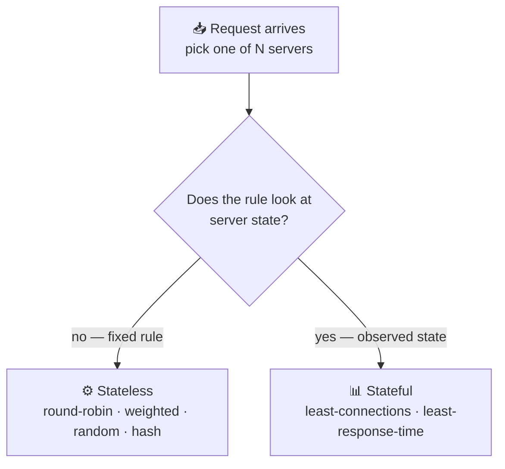
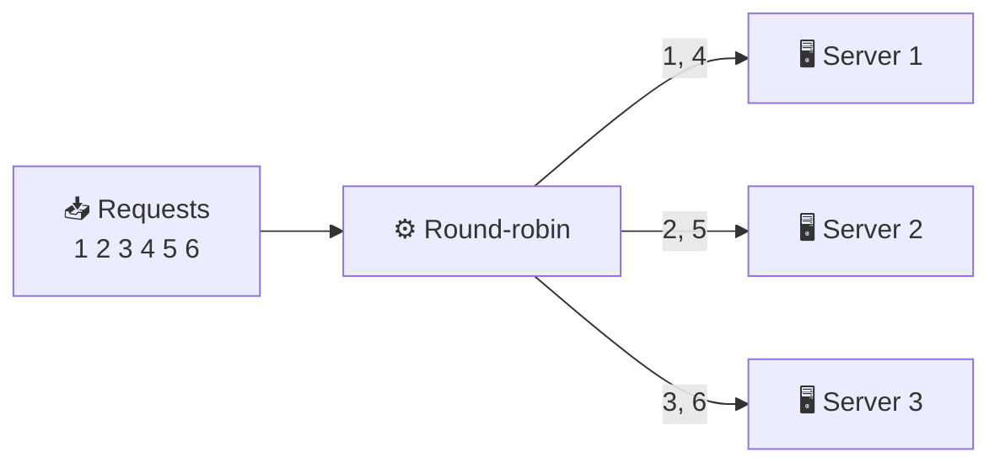
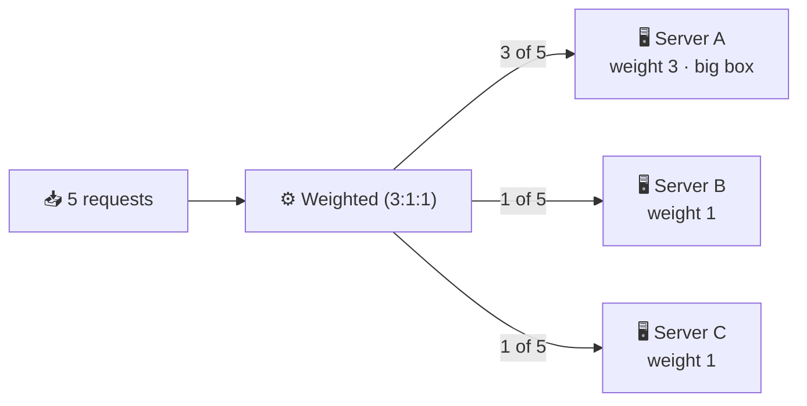
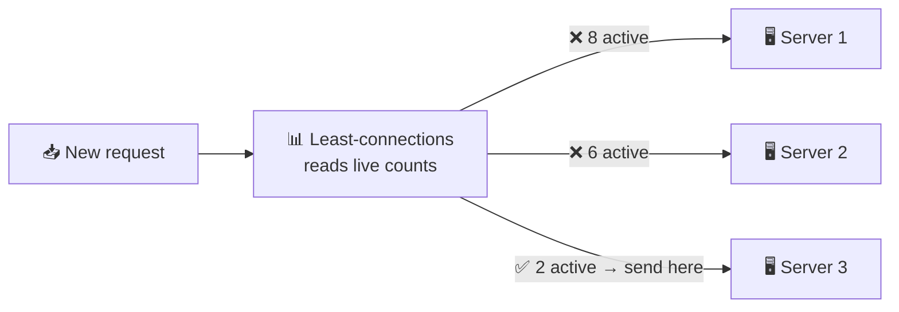
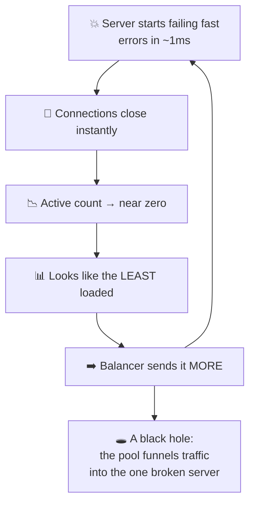

# Load Balancing Algorithms

> **Phase:** Networking Deep Dives → **Topic:** 6 of 7 → **Read time:** ~50 minutes

---

## Before You Begin

**This document stands alone.** It assumes you have read nothing else — not the foundation series, not the phase before it, not the topics before it. Everything is built here from zero: what the selection decision actually is, each algorithm that makes it, the assumption each one hides, and what happens to each when that assumption breaks.

Two consequences of that choice:

- **Terms get defined where they're used** — pool, upstream, stateless and stateful selection, rehashing. Skim past what you already know.
- **Neighbouring topics are named, not taught.** How a server comes to be added or removed, how the balancer knows a server is alive, consistent hashing's internals, and autoscaling each have their own full treatment elsewhere in this curriculum. Where they touch the selection decision, this document says so and points; it doesn't absorb them. *The algorithms themselves are complete here.*

Load balancing is one of the concepts in the **Top 30 Must-Know Concepts** foundation series, where it gets a short introduction. This document is the deep-dive on the one decision at its heart: given several servers that could all answer, which one gets the request.

Here is the question the document answers:

> **When any of several servers could handle a request, what rule decides — and why does the "obvious" rule quietly ruin performance for most real workloads?**

Here's the trap it disarms. The selection algorithm looks like the whole substance of load balancing, and it's the part most people give the least thought to. Every reference offers the same four names — round-robin, least-connections, weighted, hashing — a sentence each, presented as interchangeable defaults you pick between by taste. So teams take the default, it works in testing, and they never think about it again.

Then a latency tail appears that no dashboard explains, or an incident makes one server melt while its neighbours sit idle, and the cause turns out to be the selection rule doing exactly what it was designed to do — under conditions where its central assumption had quietly stopped being true.

> **The mindset shift:** stop asking *"which algorithm spreads requests most evenly?"* and start asking **"what does this algorithm assume, and what happens the moment that assumption is false?"** Every balancing algorithm is a bet about the world: that all requests cost roughly the same, that a server's connection count reflects its real load, that a server which answers is a server that works. On an ordinary day every bet pays off and the algorithms are genuinely hard to tell apart. The choice only becomes visible when a bet loses — and that is precisely the moment, under load or during failure, when you can least afford to have bet wrong.

---

## Table of Contents

1. [The Decision, Isolated](#1-the-decision-isolated)
2. [Round-Robin — Rotation and Its One Assumption](#2-round-robin--rotation-and-its-one-assumption)
3. [Weighted — When Servers Aren't Equal](#3-weighted--when-servers-arent-equal)
4. [Least-Connections — Reacting to Real State](#4-least-connections--reacting-to-real-state)
5. [The Trouble With Counting Connections](#5-the-trouble-with-counting-connections)
6. [Random and the Power of Two Choices](#6-random-and-the-power-of-two-choices)
7. [Hashing — Sending the Same Key to the Same Server](#7-hashing--sending-the-same-key-to-the-same-server)
8. [When the Pool Changes Size](#8-when-the-pool-changes-size)
9. [Choosing — There Is No Default](#9-choosing--there-is-no-default)
10. [Putting It All Together — The Algorithm That Wasn't the Problem](#10-putting-it-all-together--the-algorithm-that-wasnt-the-problem)
11. [Final Recap](#11-final-recap)

---

## 1. The Decision, Isolated

Strip everything else away and look at the one moment this document is about.

A request arrives at a component that fronts a group of servers. Several of those servers — maybe all of them — could produce the answer. The component must pick exactly one and forward the request to it. Then the next request arrives, and it picks again.

That group of interchangeable servers is the **pool**; each member is an **upstream**; the component doing the picking is a load balancer. Everything about *how servers join the pool, how the balancer knows they're alive, and how they leave* is a separate subject with its own treatment. This document assumes a pool exists and asks only: **how is the one server chosen?**

It sounds trivial. It is not, and the reason is that the balancer is choosing with far less information than the choice deserves.

### The Balancer Is Nearly Blind

When a request arrives, what does the balancer actually know about it? Almost nothing. It has not run the request. It does not know whether this one will finish in a millisecond or tie up a server for thirty seconds. It cannot see how loaded each server truly is — only, at best, some indirect signal. It is deciding *before* the information that would make the decision easy exists.

So every algorithm is a strategy for choosing well under ignorance. They differ in **what signal they lean on**, and that single difference sorts them into two families that the rest of this document follows.

### Two Families

**Stateless selection** applies a fixed rule that ignores what the servers are currently doing. Rotate through them in order; pick one at random; compute a server from a key. The balancer needs to know nothing about server load — it just follows the rule. Cheap, simple, and predictable, at the cost of being unable to react to anything.

**Stateful selection** watches the servers and decides from what it observes — usually how many requests each is currently handling. It can react to real conditions, sending work away from a busy server toward an idle one. More powerful, and it introduces a new hazard: the observed signal can be **misleading**, and a rule that acts confidently on a wrong signal fails worse than one that never looked (§4, §5).

That tension is the whole subject:

| | Stateless | Stateful |
|---|---|---|
| Decides from | A fixed rule | Observed server state |
| Reacts to load | No | Yes |
| Cost to run | Minimal | Tracks state per server |
| Failure mode | Blind to trouble | Can be **misled** by a bad signal |

### Why the Choice Is Usually Invisible

One more thing to establish, because it explains why this decision is so widely neglected. When requests all cost about the same and servers are all about equal, *every* algorithm distributes work well. Round-robin, random, least-connections — they converge on the same even spread, and you genuinely cannot tell them apart.

Real workloads are not like that. Requests vary enormously in cost — a cached lookup versus a report that scans millions of rows. Servers drift apart in capacity. Some requests hold a connection open for a second, others for an hour. The algorithms diverge exactly in proportion to how *un*-uniform the workload is — which means the choice is invisible right up until the workload makes it decisive.

> 💡 **Key Insight**
>
> The load balancer chooses **before it knows anything useful** about the request it's routing — not how expensive it will be, not how loaded each server truly is. Every algorithm is therefore a bet placed under ignorance, and they divide by which signal they trust: **stateless** rules trust a fixed pattern and can't react; **stateful** rules trust observed state and can be deceived by it. Hold onto that division — most of what follows is a specific algorithm's bet, and the specific day that bet comes due.

### Quick Recap — The Decision, Isolated

- The whole subject is one moment: several servers in the **pool** could answer, and the balancer must pick exactly one **upstream** — repeatedly, with little information.
- The balancer is nearly **blind**: it doesn't know a request's cost or a server's true load when it decides, so every algorithm chooses under ignorance.
- Algorithms split into **stateless** (fixed rule, can't react) and **stateful** (reads server state, can be misled) — the division the rest of the document follows.
- The choice is **invisible under uniform load** and grows decisive exactly as requests and servers become uneven.

---

## 2. Round-Robin — Rotation and Its One Assumption

Round-robin is the default nearly everywhere, and it's the right place to start because it's the simplest possible answer to §1's question.

> **Round-robin hands each incoming request to the next server in a fixed rotation: server 1, server 2, server 3, back to server 1, forever.**

No state, no measurement, no randomness. Keep a counter, increment it, wrap around. Over any run of requests each server receives an exactly equal *count* — with three servers, precisely one-third of requests each. It is stateless selection in its purest form, and its even division of request count is genuinely perfect.

### The Assumption Hiding in "Equal Count"

Round-robin distributes *requests* equally. What you actually care about is distributing *work* equally. Those are the same thing only if one sentence is true:

> **Every request costs the same, and every server is equally able to handle it.**

That is the bet round-robin makes, silently, on every single request. When it holds, equal request count *is* equal work, and round-robin is unimprovable. When it doesn't, round-robin keeps dealing requests out in perfect rotation while the actual load piles up wherever the expensive requests happened to land.

And it holds far less often than it looks. Two ways it breaks, both common.

### Break One — Requests Don't Cost the Same

Imagine most requests are cheap 5-millisecond lookups, but one endpoint runs a 500-millisecond report. Round-robin doesn't know the difference — a request is a request. If the expensive requests happen to fall to server 1 several times in a row, server 1 is now doing vastly more work than servers 2 and 3, and round-robin *keeps sending it every third request anyway*, because its counter says server 1 is due.

The balancer has no feedback loop. It cannot notice that server 1 is drowning, because noticing would require looking at server state, which round-robin by definition does not do. It will deal server 1 into the rotation at its regular turn even as that server falls over.

This is the single most common way round-robin disappoints, and §10 is an extended example of exactly it.

### Break Two — Servers Aren't Equal

Fleets are rarely uniform. A cloud pool accumulates a mix of instance types over time; some machines are simply older or busier with other work. Round-robin sends a machine with half the capacity the same number of requests as its strongest peer, so the weak one saturates while the strong one coasts.

The fix for *this* break is §3. The fix for the first break — variable request cost — needs a fundamentally different approach, and that's §4.

### Where Round-Robin Is Genuinely Right

None of this makes it a bad algorithm. When its assumption holds — uniform requests across uniform servers, which describes plenty of stateless web tiers serving similar work — round-robin is the correct choice. It is predictable, it needs no state, it can't be misled by a bad signal because it reads no signal, and it distributes perfectly. Reaching for something cleverer when round-robin's bet actually holds just adds cost and failure modes for no benefit.

The mistake is not *using* round-robin. It's using it *without checking whether its assumption is true for your workload* — which, because it's the default, is what usually happens.

> ⚠️ **Round-robin's evenness is a measurement of the wrong thing.** It equalises how many requests each server receives, and reports that as balance — but a server handling ten expensive requests is far more loaded than one handling ten cheap ones, and round-robin cannot tell them apart. When someone says "traffic is evenly balanced" and means "request counts are equal," that's the gap to probe. Equal counts are only equal load when every request costs the same.

### Quick Recap — Round-Robin

- **Round-robin** rotates through servers in fixed order — pure stateless selection, needing no state and distributing request *count* perfectly.
- Its silent bet is that **every request costs the same and every server is equal**; equal count is equal work only when that holds.
- It breaks when **requests vary in cost** (expensive ones pile up unnoticed, with no feedback loop to correct it) or when **servers vary in capacity** (§3 addresses the latter).
- It remains the **right choice for genuinely uniform workloads** — the error is using it by default without confirming its assumption holds.

---

## 3. Weighted — When Servers Aren't Equal

Round-robin's second break was unequal servers. Weighting is the direct repair, and it's still stateless — it just makes the fixed rule aware that the servers behind it differ.

> **Weighted selection assigns each server a number reflecting its relative capacity, and distributes requests in proportion to those numbers rather than equally.**

Give server A a weight of 3 and servers B and C a weight of 1 each, and out of every 5 requests, A receives 3 while B and C receive 1 apiece. A machine with triple the capacity does triple the work.

It's usually a layer on top of another stateless rule rather than a separate algorithm: **weighted round-robin** rotates but visits the heavier server more often per cycle; **weighted random** (§6) picks randomly with the odds tilted by weight. The weight changes the proportions; the underlying rule still decides the order.

### What the Weights Should Reflect

The obvious input is raw hardware — core count, memory, network capacity — and for a fleet of deliberately mixed machine sizes that's often enough. But capacity isn't only hardware. A server running other work has less to give. A server in a busier availability zone may have higher latency to shared dependencies. Weights are meant to capture *effective* capacity, which is hardware minus whatever else is competing for it.

That's also the source of the trouble.

### The Maintenance Trap

Weights are a **static snapshot of a moving target.** You set them based on the fleet as it is today, and then the fleet changes: instances are replaced with different types, background jobs shift, load patterns move across zones, a dependency slows down for some servers and not others. The weights don't change with any of it, because nothing updates them — they're configuration someone typed once.

So weighted distribution decays. The numbers that perfectly matched capacity at setup slowly stop matching it, and because the mismatch is gradual and silent, nobody notices until a server that's now over-weighted starts struggling. The failure looks like a capacity problem on one machine; the cause is a weight that describes a machine that no longer exists.

This is the recurring weakness of *any* static configuration reacting to a dynamic system, and you have already seen its shape if you've configured anything by hand: the value was right when written and wrong by the time it mattered. Weights need periodic review against reality, or they need to be generated from real capacity data rather than typed — and the moment you're generating them from live measurement, you're partway toward the stateful algorithms of §4, which skip the snapshot entirely and read the current state directly.

### When Weighting Earns Its Keep

Weighting is the right tool when server capacity is **genuinely unequal and reasonably stable** — a fleet of intentionally different instance sizes, a gradual migration where old and new hardware run side by side, or steering a deliberately small share of traffic to a canary. In all of these the inequality is real and changes slowly enough that a periodically-reviewed weight tracks it well.

It's the wrong tool for inequality that shifts *fast* — a server that's slow right now because of a transient spike. A static weight can't react to "right now"; by the time you'd re-weight, the condition has passed. Fast-changing load is what stateful selection is for.

> 💡 **Key Insight**
>
> Weighting fixes round-robin's *unequal servers* break while keeping everything stateless — but it fixes it with a **number that's true the day you set it and drifts from then on.** That makes weighting excellent for inequality that is real and slow (mixed hardware, canaries) and useless for inequality that is real and fast (a server briefly overloaded now). The dividing line between weighted and the stateful algorithms ahead is exactly this: *does the imbalance you're correcting change slowly enough to describe in advance, or must it be observed as it happens?*

### Quick Recap — Weighted

- **Weighted** distributes in proportion to per-server capacity numbers rather than equally, usually layered onto round-robin or random.
- Weights should reflect **effective** capacity — hardware minus competing work — not raw specs alone.
- They are a **static snapshot** that silently drifts as the fleet changes, so they decay and need periodic review or generation from live data.
- Right for **real, slow-changing** inequality (mixed fleets, canaries); wrong for **fast-changing** load, which needs the stateful algorithms of §4.

---

## 4. Least-Connections — Reacting to Real State

Round-robin and weighted are blind by design — they follow a fixed rule and never look at what the servers are doing. Least-connections is the first algorithm that opens its eyes.

> **Least-connections sends each request to the server currently handling the fewest active connections.**

Instead of a fixed rotation, the balancer keeps a live count of how many requests each server is still working on, and routes each new request to whichever count is lowest. This is stateful selection: the decision comes from *observed state*, not a predetermined pattern.

### Why This Fixes Round-Robin's Worst Break

Recall round-robin's first failure: expensive requests pile onto a server and it keeps receiving its regular share anyway, because nothing looks at load. Least-connections closes exactly that gap.

A server stuck with several slow requests has a *high* active-connection count — those requests haven't finished, so they're still counted. So least-connections naturally routes new requests *away* from it and toward servers whose counts are low because their work is completing quickly. The algorithm adapts to variable request cost without ever being told which requests are expensive — it infers it from the fact that costly requests linger and cheap ones clear.

That's a real improvement, and it's why least-connections is the standard recommendation the moment request costs vary. It turns the connection count into a rough, self-maintaining proxy for how busy each server actually is.

### The Bet It's Making

Least-connections trades round-robin's assumption for a subtler one:

> **A server's active-connection count reflects how loaded it is.**

Usually true, and more often true than round-robin's "all requests cost the same." A busy server does tend to accumulate connections; an idle one doesn't. But "reflects load" is an *inference*, not a measurement — and there's one situation where the inference doesn't just weaken, it flips to the exact opposite of the truth.

### The Inversion — When Broken Looks Idle

Here is the failure that makes least-connections dangerous, and it's the most important paragraph in this section.

A server starts failing *fast*. Not hanging — failing quickly: it hits an error and returns immediately, rejecting each request in a millisecond instead of doing the second of real work a healthy server would.

Fast rejection means its connections close almost instantly. Which means its active-connection count drops to nearly zero. Which means, to least-connections, it looks like **the most available server in the pool** — so the algorithm sends it *more* traffic. Which it also fails, instantly, keeping its count lowest, pulling still more traffic toward itself.

The broken server becomes a **black hole**, attracting a growing share of the pool's traffic *specifically because it's broken*. The signal least-connections trusts — low connection count means available — has inverted: here, low count means *failing*. A server that answered every request with an instant error would, under pure least-connections, draw the entire pool's traffic toward itself and fail all of it.

This is the sharp edge of stateful selection from §1: an algorithm that acts on an observed signal fails badly when the signal lies, and it fails *worse* than a blind algorithm would, because it's confidently steering in the wrong direction. Round-robin would have kept sending the black hole only its regular one-third share; least-connections escalates.

The defence isn't in the algorithm — it's that the balancer must know the fast-failing server is *unhealthy* and remove it from the pool entirely, so its connection count stops being consulted. That detection is a separate mechanism from selection, covered in its own topic; the point here is that **least-connections cannot save itself from this, because the very signal it relies on is the one that's compromised.**

> ⚠️ **A stateful algorithm is only as trustworthy as the signal it reads, and connection count inverts under fast failure.** Low connections normally means "available" — but a server erroring out in a millisecond also has near-zero connections, so least-connections reads "broken" as "most available" and funnels traffic into it. The improvement over round-robin is real and so is this new failure mode; they're the same coin. Reading server state lets you react to reality, and it lets you react to a lie.

### Quick Recap — Least-Connections

- **Least-connections** routes to the server with the fewest active connections — the first **stateful** algorithm, deciding from observed load rather than a fixed rule.
- It **fixes round-robin's worst break**: slow requests raise a server's count, so new traffic naturally flows away from busy servers — adapting to variable cost without being told costs.
- Its bet is that **connection count reflects load**, which **inverts under fast failure**: a server erroring in ~1ms looks idle, so the algorithm funnels traffic into it — a **black hole**.
- The inversion can't be fixed within the algorithm; it needs **health detection** (a separate mechanism) to remove the failing server so its count is no longer trusted.
