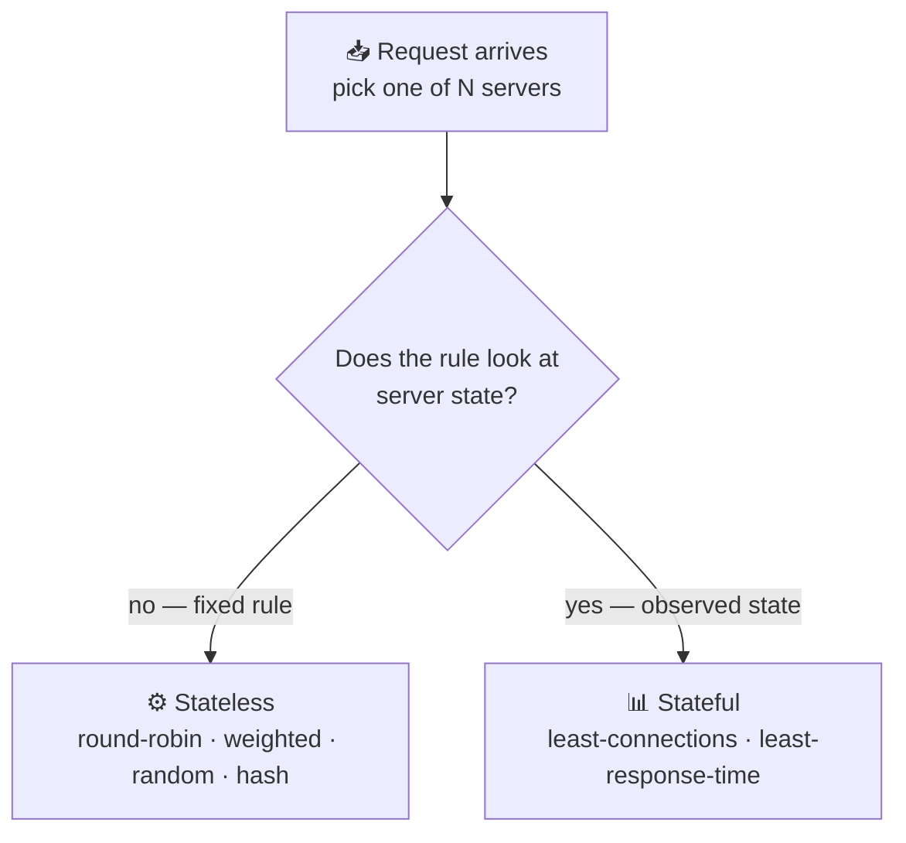
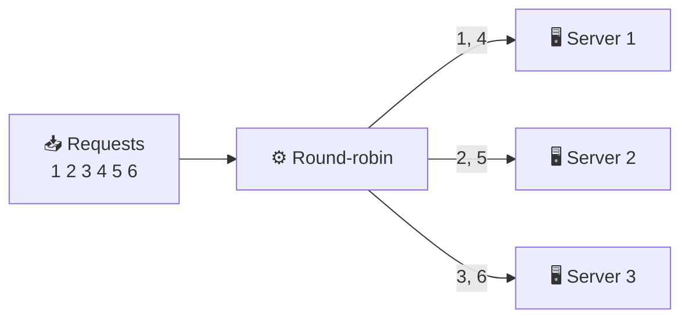
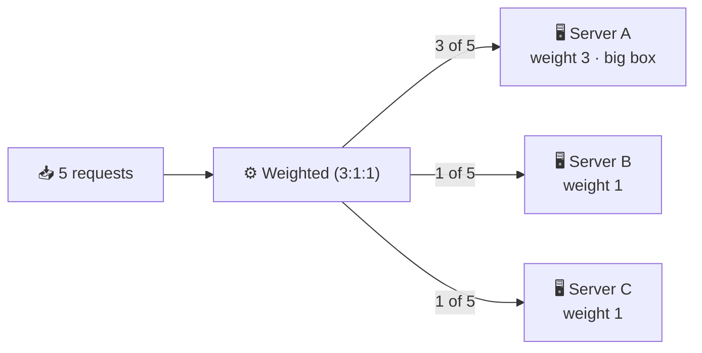
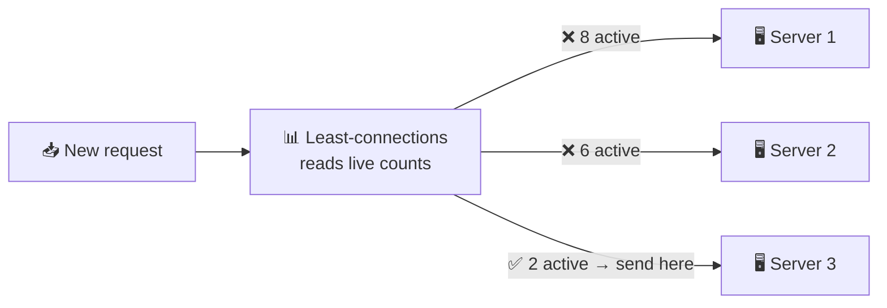
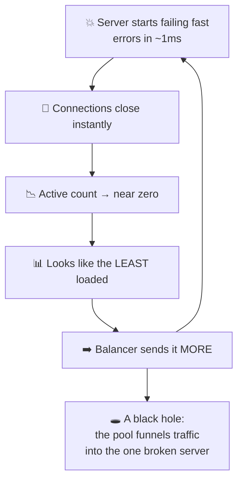
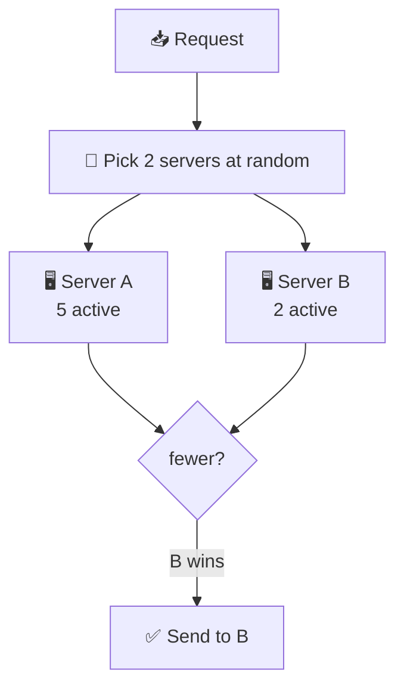
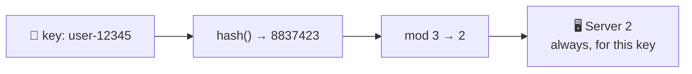
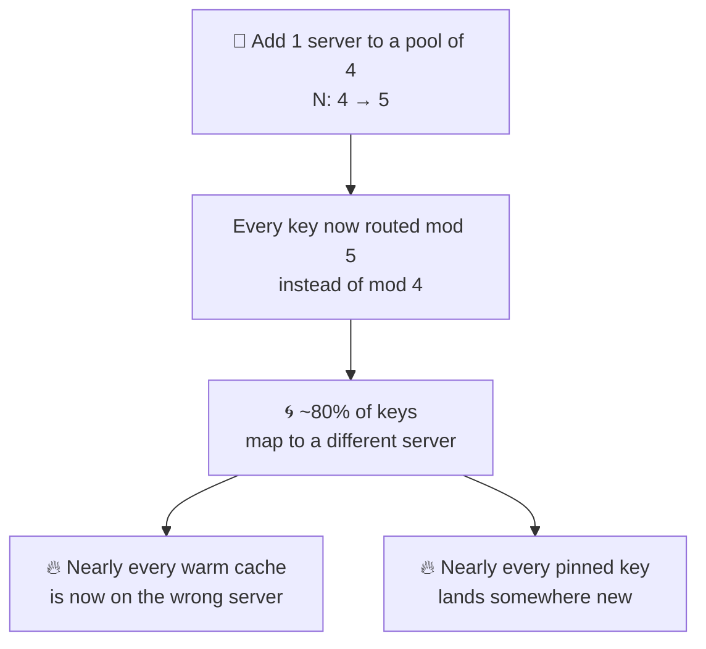
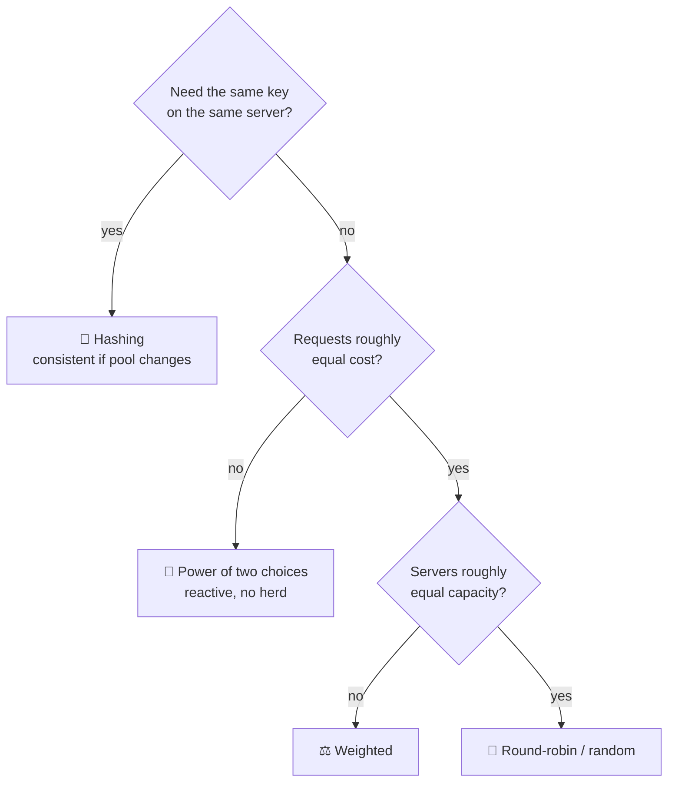

# Load Balancing Algorithms

> **Phase:** Networking Deep Dives → **Topic:** 6 of 7 → **Read time:** ~50 minutes

---

## Before You Begin

**This document stands alone.** It assumes you have read nothing else — not the foundation series, not the phase before it, not the topics before it. Everything is built here from zero: what the selection decision actually is, each algorithm that makes it, the assumption each one hides, and what happens to each when that assumption breaks.

Two consequences of that choice:

- **Terms get defined where they're used** — pool, upstream, stateless and stateful selection, rehashing. Skim past what you already know.
- **Neighbouring topics are named, not taught.** How a server comes to be added or removed, how the balancer knows a server is alive, consistent hashing's internals, and autoscaling each have their own full treatment elsewhere in this curriculum. Where they touch the selection decision, this document says so and points; it doesn't absorb them. *The algorithms themselves are complete here.*

Load balancing is one of the concepts in the **Top 30 Must-Know Concepts** foundation series, where it gets a short introduction. This document is the deep-dive on the one decision at its heart: given several servers that could all answer, which one gets the request.

Here is the question the document answers:

> **When any of several servers could handle a request, what rule decides — and why does the "obvious" rule quietly ruin performance for most real workloads?**

Here's the trap it disarms. The selection algorithm looks like the whole substance of load balancing, and it's the part most people give the least thought to. Every reference offers the same four names — round-robin, least-connections, weighted, hashing — a sentence each, presented as interchangeable defaults you pick between by taste. So teams take the default, it works in testing, and they never think about it again.

Then a latency tail appears that no dashboard explains, or an incident makes one server melt while its neighbours sit idle, and the cause turns out to be the selection rule doing exactly what it was designed to do — under conditions where its central assumption had quietly stopped being true.

> **The mindset shift:** stop asking *"which algorithm spreads requests most evenly?"* and start asking **"what does this algorithm assume, and what happens the moment that assumption is false?"** Every balancing algorithm is a bet about the world: that all requests cost roughly the same, that a server's connection count reflects its real load, that a server which answers is a server that works. On an ordinary day every bet pays off and the algorithms are genuinely hard to tell apart. The choice only becomes visible when a bet loses — and that is precisely the moment, under load or during failure, when you can least afford to have bet wrong.

---

## Table of Contents

1. [The Decision, Isolated](#1-the-decision-isolated)
2. [Round-Robin — Rotation and Its One Assumption](#2-round-robin--rotation-and-its-one-assumption)
3. [Weighted — When Servers Aren't Equal](#3-weighted--when-servers-arent-equal)
4. [Least-Connections — Reacting to Real State](#4-least-connections--reacting-to-real-state)
5. [The Trouble With Counting Connections](#5-the-trouble-with-counting-connections)
6. [Random and the Power of Two Choices](#6-random-and-the-power-of-two-choices)
7. [Hashing — Sending the Same Key to the Same Server](#7-hashing--sending-the-same-key-to-the-same-server)
8. [When the Pool Changes Size](#8-when-the-pool-changes-size)
9. [Choosing — There Is No Default](#9-choosing--there-is-no-default)
10. [Putting It All Together — The Algorithm That Wasn't the Problem](#10-putting-it-all-together--the-algorithm-that-wasnt-the-problem)
11. [Final Recap](#11-final-recap)

---

## 1. The Decision, Isolated

Strip everything else away and look at the one moment this document is about.

A request arrives at a component that fronts a group of servers. Several of those servers — maybe all of them — could produce the answer. The component must pick exactly one and forward the request to it. Then the next request arrives, and it picks again.

The interchangeable servers are collectively the **pool**, an individual one is an **upstream**, and the component choosing between them is a load balancer. Everything about *how servers join the pool, how the balancer knows they're alive, and how they leave* is a separate subject with its own treatment. This document assumes a pool exists and asks only: **how is the one server chosen?**

It sounds trivial. It is not, and the reason is that the balancer is choosing with far less information than the choice deserves.

### The Balancer Is Nearly Blind

When a request arrives, what does the balancer actually know about it? Almost nothing. It has not run the request. It does not know whether this one will finish in a millisecond or tie up a server for thirty seconds. It cannot see how loaded each server truly is — only, at best, some indirect signal. It is deciding *before* the information that would make the decision easy exists.

So every algorithm is a strategy for choosing well under ignorance. They differ in **what signal they lean on**, and that single difference sorts them into two families that the rest of this document follows.

### Two Families

**Stateless selection** applies a fixed rule that ignores what the servers are currently doing. Rotate through them in order; pick one at random; compute a server from a key. The balancer needs to know nothing about server load — it just follows the rule. Cheap, simple, and predictable, at the cost of being unable to react to anything.

**Stateful selection** watches the servers and decides from what it observes — usually how many requests each is currently handling. It can react to real conditions, sending work away from a busy server toward an idle one. More powerful, and it introduces a new hazard: the observed signal can be **misleading**, and a rule that acts confidently on a wrong signal fails worse than one that never looked (§4, §5).

That tension is the whole subject:

| | Stateless | Stateful |
|---|---|---|
| Decides from | A fixed rule | Observed server state |
| Reacts to load | No | Yes |
| Cost to run | Minimal | Tracks state per server |
| Failure mode | Blind to trouble | Can be **misled** by a bad signal |

### Why the Choice Is Usually Invisible

One more thing to establish, because it explains why this decision is so widely neglected. When requests all cost about the same and servers are all about equal, *every* algorithm distributes work well. Round-robin, random, least-connections — they converge on the same even spread, and you genuinely cannot tell them apart.

Real workloads are not like that. Requests vary enormously in cost — a cached lookup versus a report that scans millions of rows. Servers drift apart in capacity. Some requests hold a connection open for a second, others for an hour. The algorithms diverge exactly in proportion to how *un*-uniform the workload is — which means the choice is invisible right up until the workload makes it decisive.

> 💡 **Key Insight**
>
> The load balancer chooses **before it knows anything useful** about the request it's routing — not how expensive it will be, not how loaded each server truly is. Every algorithm is therefore a bet placed under ignorance, and they divide by which signal they trust: **stateless** rules trust a fixed pattern and can't react; **stateful** rules trust observed state and can be deceived by it. Hold onto that division — most of what follows is a specific algorithm's bet, and the specific day that bet comes due.

### Quick Recap — The Decision, Isolated

- The whole subject is one moment: several servers in the **pool** could answer, and the balancer must pick exactly one **upstream** — repeatedly, with little information.
- The balancer is nearly **blind**: it doesn't know a request's cost or a server's true load when it decides, so every algorithm chooses under ignorance.
- Algorithms split into **stateless** (fixed rule, can't react) and **stateful** (reads server state, can be misled) — the division the rest of the document follows.
- The choice is **invisible under uniform load** and grows decisive exactly as requests and servers become uneven.

---

## 2. Round-Robin — Rotation and Its One Assumption

Round-robin is the default nearly everywhere, and it's the right place to start because it's the simplest possible answer to §1's question.

> **Round-robin hands each incoming request to the next server in a fixed rotation: server 1, server 2, server 3, back to server 1, forever.**

No state, no measurement, no randomness. Keep a counter, increment it, wrap around. Over any run of requests each server receives an exactly equal *count* — with three servers, precisely one-third of requests each. It is stateless selection in its purest form, and its even division of request count is genuinely perfect.

### The Assumption Hiding in "Equal Count"

Round-robin distributes *requests* equally. What you actually care about is distributing *work* equally. Those are the same thing only if one sentence is true:

> **Every request costs the same, and every server is equally able to handle it.**

That is the bet round-robin makes, silently, on every single request. When it holds, equal request count *is* equal work, and round-robin is unimprovable. When it doesn't, round-robin keeps dealing requests out in perfect rotation while the actual load piles up wherever the expensive requests happened to land.

And it holds far less often than it looks. Two ways it breaks, both common.

### Break One — Requests Don't Cost the Same

Imagine most requests are cheap 5-millisecond lookups, but one endpoint runs a 500-millisecond report — a 100× cost difference, which is entirely ordinary between a cached read and a heavy query. Round-robin doesn't know the difference — a request is a request. If the expensive requests happen to fall to server 1 several times in a row, server 1 is now doing vastly more work than servers 2 and 3, and round-robin *keeps sending it every third request anyway*, because its counter says server 1 is due. Just a handful of those 500ms requests landing together builds a queue that every subsequent cheap request on that server now waits behind — so a 5ms lookup unlucky enough to sit behind three reports takes over 1.5 seconds, and that is the tail latency, manufactured entirely by the selection rule.

The balancer has no feedback loop. It cannot notice that server 1 is drowning, because noticing would require looking at server state, which round-robin by definition does not do. It will deal server 1 into the rotation at its regular turn even as that server falls over.

This is the single most common way round-robin disappoints, and §10 is an extended example of exactly it.

### Break Two — Servers Aren't Equal

Fleets are rarely uniform. A cloud pool accumulates a mix of instance types over time; some machines are simply older or busier with other work. Round-robin sends a machine with half the capacity the same number of requests as its strongest peer, so the weak one saturates while the strong one coasts.

The fix for *this* break is §3. The fix for the first break — variable request cost — needs a fundamentally different approach, and that's §4.

### Where Round-Robin Is Genuinely Right

None of this makes it a bad algorithm. When its assumption holds — uniform requests across uniform servers, which describes plenty of stateless web tiers serving similar work — round-robin is the correct choice. It is predictable, it needs no state, it can't be misled by a bad signal because it reads no signal, and it distributes perfectly. Reaching for something cleverer when round-robin's bet actually holds just adds cost and failure modes for no benefit.

The mistake is not *using* round-robin. It's using it *without checking whether its assumption is true for your workload* — which, because it's the default, is what usually happens.

> ⚠️ **Round-robin's evenness is a measurement of the wrong thing.** It equalises how many requests each server receives, and reports that as balance — but a server handling ten expensive requests is far more loaded than one handling ten cheap ones, and round-robin cannot tell them apart. When someone says "traffic is evenly balanced" and means "request counts are equal," that's the gap to probe. Equal counts are only equal load when every request costs the same.

### Quick Recap — Round-Robin

- **Round-robin** rotates through servers in fixed order — pure stateless selection, needing no state and distributing request *count* perfectly.
- Its silent bet is that **every request costs the same and every server is equal**; equal count is equal work only when that holds.
- It breaks when **requests vary in cost** (expensive ones pile up unnoticed, with no feedback loop to correct it) or when **servers vary in capacity** (§3 addresses the latter).
- It remains the **right choice for genuinely uniform workloads** — the error is using it by default without confirming its assumption holds.

---

## 3. Weighted — When Servers Aren't Equal

Round-robin's second break was unequal servers. Weighting is the direct repair, and it's still stateless — it just makes the fixed rule aware that the servers behind it differ.

> **Weighted selection assigns each server a number reflecting its relative capacity, and distributes requests in proportion to those numbers rather than equally.**

Give server A a weight of 3 and servers B and C a weight of 1 each, and out of every 5 requests, A receives 3 while B and C receive 1 apiece. A machine with triple the capacity does triple the work.

It's usually a layer on top of another stateless rule rather than a separate algorithm: **weighted round-robin** rotates but visits the heavier server more often per cycle; **weighted random** (§6) picks randomly with the odds tilted by weight. The weight changes the proportions; the underlying rule still decides the order.

### What the Weights Should Reflect

The obvious input is raw hardware — core count, memory, network capacity — and for a fleet of deliberately mixed machine sizes that's often enough. But capacity isn't only hardware. A server running other work has less to give. A server in a busier availability zone may have higher latency to shared dependencies. Weights are meant to capture *effective* capacity, which is hardware minus whatever else is competing for it.

That's also the source of the trouble.

### The Maintenance Trap

Weights are a **static snapshot of a moving target.** You set them based on the fleet as it is today, and then the fleet changes: instances are replaced with different types, background jobs shift, load patterns move across zones, a dependency slows down for some servers and not others. The weights don't change with any of it, because nothing updates them — they're configuration someone typed once.

So weighted distribution decays. The numbers that perfectly matched capacity at setup slowly stop matching it, and because the mismatch is gradual and silent, nobody notices until a server that's now over-weighted starts struggling. The failure looks like a capacity problem on one machine; the cause is a weight that describes a machine that no longer exists.

This is the recurring weakness of *any* static configuration reacting to a dynamic system, and you have already seen its shape if you've configured anything by hand: the value was right when written and wrong by the time it mattered. Weights need periodic review against reality, or they need to be generated from real capacity data rather than typed — and the moment you're generating them from live measurement, you're partway toward the stateful algorithms of §4, which skip the snapshot entirely and read the current state directly.

### When Weighting Earns Its Keep

Weighting is the right tool when server capacity is **genuinely unequal and reasonably stable** — a fleet of intentionally different instance sizes, a gradual migration where old and new hardware run side by side, or steering a deliberately small share of traffic to a canary. In all of these the inequality is real and changes slowly enough that a periodically-reviewed weight tracks it well.

It's the wrong tool for inequality that shifts *fast* — a server that's slow right now because of a transient spike. A static weight can't react to "right now"; by the time you'd re-weight, the condition has passed. Fast-changing load is what stateful selection is for.

> 💡 **Key Insight**
>
> Weighting fixes round-robin's *unequal servers* break while keeping everything stateless — but it fixes it with a **number that's true the day you set it and drifts from then on.** That makes weighting excellent for inequality that is real and slow (mixed hardware, canaries) and useless for inequality that is real and fast (a server briefly overloaded now). The dividing line between weighted and the stateful algorithms ahead is exactly this: *does the imbalance you're correcting change slowly enough to describe in advance, or must it be observed as it happens?*

### Quick Recap — Weighted

- **Weighted** distributes in proportion to per-server capacity numbers rather than equally, usually layered onto round-robin or random.
- Weights should reflect **effective** capacity — hardware minus competing work — not raw specs alone.
- They are a **static snapshot** that silently drifts as the fleet changes, so they decay and need periodic review or generation from live data.
- Right for **real, slow-changing** inequality (mixed fleets, canaries); wrong for **fast-changing** load, which needs the stateful algorithms of §4.

---

## 4. Least-Connections — Reacting to Real State

Round-robin and weighted are blind by design — they follow a fixed rule and never look at what the servers are doing. Least-connections is the first algorithm that opens its eyes.

> **Least-connections sends each request to the server currently handling the fewest active connections.**

Instead of a fixed rotation, the balancer keeps a live count of how many requests each server is still working on, and routes each new request to whichever count is lowest. This is stateful selection: the decision comes from *observed state*, not a predetermined pattern.

### Why This Fixes Round-Robin's Worst Break

Recall round-robin's first failure: expensive requests pile onto a server and it keeps receiving its regular share anyway, because nothing looks at load. Least-connections closes exactly that gap.

A server stuck with several slow requests has a *high* active-connection count — those requests haven't finished, so they're still counted. So least-connections naturally routes new requests *away* from it and toward servers whose counts are low because their work is completing quickly. The algorithm adapts to variable request cost without ever being told which requests are expensive — it infers it from the fact that costly requests linger and cheap ones clear.

That's a real improvement, and it's why least-connections is the standard recommendation the moment request costs vary. It turns the connection count into a rough, self-maintaining proxy for how busy each server actually is.

### The Bet It's Making

Least-connections trades round-robin's assumption for a subtler one:

> **A server's active-connection count reflects how loaded it is.**

Usually true, and more often true than round-robin's "all requests cost the same." A busy server does tend to accumulate connections; an idle one doesn't. But "reflects load" is an *inference*, not a measurement — and there's one situation where the inference doesn't just weaken, it flips to the exact opposite of the truth.

### The Inversion — When Broken Looks Idle

Here is the failure that makes least-connections dangerous, and it's the most important paragraph in this section.

A server starts failing *fast*. Not hanging — failing quickly: it hits an error and returns immediately, rejecting each request in a millisecond instead of doing the second of real work a healthy server would.

Fast rejection means its connections close almost instantly. Which means its active-connection count drops to nearly zero. Which means, to least-connections, it looks like **the most available server in the pool** — so the algorithm sends it *more* traffic. Which it also fails, instantly, keeping its count lowest, pulling still more traffic toward itself.

The broken server becomes a **black hole**, attracting a growing share of the pool's traffic *specifically because it's broken*. The signal least-connections trusts — low connection count means available — has inverted: here, low count means *failing*. A server that answered every request with an instant error would, under pure least-connections, draw the entire pool's traffic toward itself and fail all of it.

This is the sharp edge of stateful selection from §1: an algorithm that acts on an observed signal fails badly when the signal lies, and it fails *worse* than a blind algorithm would, because it's confidently steering in the wrong direction. Round-robin would have kept sending the black hole only its regular one-third share; least-connections escalates.

The defence isn't in the algorithm — it's that the balancer must know the fast-failing server is *unhealthy* and remove it from the pool entirely, so its connection count stops being consulted. That detection is a separate mechanism from selection, covered in its own topic; the point here is that **least-connections cannot save itself from this, because the very signal it relies on is the one that's compromised.**

> ⚠️ **A stateful algorithm is only as trustworthy as the signal it reads, and connection count inverts under fast failure.** Low connections normally means "available" — but a server erroring out in a millisecond also has near-zero connections, so least-connections reads "broken" as "most available" and funnels traffic into it. The improvement over round-robin is real and so is this new failure mode; they're the same coin. Reading server state lets you react to reality, and it lets you react to a lie.

### Quick Recap — Least-Connections

- **Least-connections** routes to the server with the fewest active connections — the first **stateful** algorithm, deciding from observed load rather than a fixed rule.
- It **fixes round-robin's worst break**: slow requests raise a server's count, so new traffic naturally flows away from busy servers — adapting to variable cost without being told costs.
- Its bet is that **connection count reflects load**, which **inverts under fast failure**: a server erroring in ~1ms looks idle, so the algorithm funnels traffic into it — a **black hole**.
- The inversion can't be fixed within the algorithm; it needs **health detection** (a separate mechanism) to remove the failing server so its count is no longer trusted.

---

## 5. The Trouble With Counting Connections

§4's inversion was the dramatic failure. This section is the quieter, more pervasive problem: even when nothing is broken, **a connection count is a rough proxy for load, and the gap between the proxy and the truth causes trouble in ordinary operation.**

Least-connections is genuinely good. But its whole value rests on the equation *one connection ≈ one unit of load*, and that equation leaks.

### A Connection Is Not a Unit of Work

Count connections and you're assuming each represents roughly the same amount of server effort. Several common situations break that:

- **A connection carries many requests.** Modern connections stay open and carry request after request. A server with 10 long-lived connections each sending constant requests is far busier than a server with 50 connections sitting mostly idle — but by connection count, the first looks *less* loaded. The balancer sends it more, exactly backwards.
- **Requests within a connection vary wildly.** One open connection might be streaming a large file for minutes; another might be firing off instant cached reads. Both count as "one connection," and they are nowhere near one unit of load apiece.
- **Idle connections count as load that isn't there.** A connection held open but not currently doing anything still increments the count, so a server holding many idle keep-alive connections looks busy while doing nothing.

In each case the count and the reality diverge, and least-connections acts on the count. It's not wrong often enough to abandon — but it's wrong often enough that "least connections" and "least loaded" must not be treated as synonyms.

### The Layer Matters

There's a structural version of this problem that depends on *what* the balancer is counting. A balancer operating on raw connections and one operating on individual requests are counting different things:

| Counting | "One unit" is | Trouble |
|---|---|---|
| **Connections** | A whole client connection | One connection may carry 1 or 10,000 requests |
| **Requests** | A single request | Closer to real load, but needs to read each request |

A balancer that only sees connections cannot count requests — it never looks inside the connection to know a request is happening. So on a fleet where connections carry very different request volumes, connection-counting is a coarse instrument, and the finer one requires a balancer that reads individual requests. Which instrument you have is a property of *where* the balancer operates, decided well before the algorithm is chosen, and it silently bounds how good "least-connections" can be.

### Least-Response-Time — A Sharper Signal

If connection count is an imperfect proxy for load, why not measure something closer to what you actually care about? **Least-response-time** does: it routes to the server with the best combination of few active requests and fast recent responses.

Response time is a more direct signal of a struggling server — a machine slowing down reveals it in rising latency before its connection count necessarily shows anything. So least-response-time reacts to degradation that least-connections misses.

But every added signal is another thing that can mislead. Response times must be measured over a window, and the window is a tradeoff: too short and normal variance makes it jumpy, routing on noise; too long and it reacts slowly to real change. A server that's fast because it's *failing fast* (§4) scores well on response time too — the inversion follows the signal. Reading more state buys sharper reactions and adds more ways for the reading to be wrong, which is §1's tension restated: **stateful selection's power and its fragility are the same property.**

### The General Lesson

Step back and a pattern connects §2 through §5. Round-robin reads *nothing* and can't react. Least-connections reads *one* signal and reacts, but the signal is a rough proxy. Least-response-time reads a *richer* signal and reacts better, and has more failure modes. Every step toward a more responsive algorithm is a step toward more dependence on a measurement being honest — and measurements of a system under stress are least honest exactly when stress is highest.

This is why the next section takes a genuinely different route. Instead of reading a better signal, it asks: how well can you do while reading *almost none*?

> 💡 **Key Insight**
>
> Connection count is a **proxy**, and the distance between the proxy and true load is where least-connections quietly errs even with nothing broken — long-lived connections, variable request sizes, and idle keep-alives all decouple "connections" from "work." Chasing a better proxy (least-response-time) sharpens the reaction and multiplies the ways to be fooled. That recurring cost of reading state is what makes the almost-stateless approach of §6 so surprising: it competes with these algorithms while trusting almost no signal at all.

### Quick Recap — The Trouble With Counting Connections

- A connection count is a **proxy for load**, and it leaks: one connection may carry many requests, requests vary hugely in cost, and idle keep-alives inflate the count.
- What the balancer can count depends on **where it operates** — raw connections versus individual requests — which bounds how accurate "least-connections" can be, before any algorithm choice.
- **Least-response-time** reads a sharper signal (latency) and catches degradation sooner, at the price of window-tuning and yet more ways to be misled.
- The through-line of §2–§5: **more reactivity means more dependence on an honest measurement** — and measurements are least honest under stress, motivating §6.

---

## 6. Random and the Power of Two Choices

Everything so far has traded simplicity for reactivity and paid for reactivity with fragility. This section breaks that trade with an idea that is almost too simple to believe works — and it's the one to remember from the whole document.

### Pure Random Is Better Than It Sounds

Start with the crudest possible rule: **pick a server uniformly at random.** No counter, no state, no coordination.

It feels like it should distribute badly, and over a handful of requests it does — randomness is lumpy at small scale. But over many requests it evens out, and it arrives at roughly equal *request count*, the same thing round-robin guarantees. With enough volume, random and round-robin are nearly indistinguishable in how evenly they spread requests.

Random also has a quiet advantage round-robin lacks: **it needs no shared state.** Round-robin's rotation counter has to be coordinated — if ten balancers each keep their own counter, they can march in lockstep and all send request N to the same server. Random has nothing to coordinate; every decision is independent, which is why it scales cleanly across many balancers making decisions at once.

What random shares with round-robin is the core weakness: it's blind. It can send a request to a server that's already the most loaded in the pool, because it isn't looking.

### The Trap of "Just Pick the Least Loaded"

The obvious fix is least-connections from §4: don't pick randomly, pick the *globally* least-loaded server. And for a single balancer with a perfect view, that's good.

At scale it develops a vicious failure. Suppose many balancers all route to the globally least-loaded server. They all see the *same* least-loaded server at the same moment — and they all send it their next request simultaneously. The server that was least loaded is instantly swarmed by every balancer at once, becomes the *most* loaded, and now the next-lowest server gets the same treatment. The "best" choice, chosen by everyone at once, becomes the worst.

This is a **herd** aimed by the algorithm itself: perfect information, used greedily and in parallel, actively creates the imbalance it was trying to prevent. Chasing the single best option is exactly what makes it stop being the best.

### The Power of Two Choices

Here is the resolution, and it is startling how small it is:

> **Pick two servers at random. Send the request to whichever of those two has fewer active connections.**

Not the best of all. The better of *two random samples*. That's the entire algorithm.

The result is not a small improvement over random — it's dramatic and mathematically established. The classic result puts numbers on it: with `n` items placed into `n` bins, pure random leaves the busiest bin holding on the order of `log n / log log n` items — which for a large pool is a meaningful pileup. Sampling **two** and taking the emptier drops the busiest bin to on the order of `log log n` items. That double-logarithm is, for any realistic pool size, essentially a small constant: whether you have 100 servers or 100,000, the worst-loaded one sits barely above average.

Concretely, going from one choice to two takes the worst-case overload from "grows noticeably with fleet size" to "flat regardless of fleet size." And the improvement is front-loaded: a *third* sample shaves the constant a little further, a fourth barely moves it. Almost the entire benefit is captured by the single step from one sample to two — which is what makes it such a bargain.

And it keeps random's virtues while fixing least-connections' herd:

- **It reads almost no state** — just the counts of the two it sampled, not a global view.
- **It doesn't herd** — two balancers rarely sample the same pair, so they don't converge on one victim. There is no single "best" for everyone to swarm, because each is choosing between its own random pair.
- **It scales cleanly** — decisions stay independent, like random, so it works across many balancers with no coordination.

It is, for large stateless fleets, close to the best of every world: nearly the balance of global-least-connections, nearly the simplicity and scalability of random, without the herd of the first or the blindness of the second. This is why it has become a default in modern large-scale balancers, and why "use power of two choices" is rarely a wrong answer.

### Why This Is the One to Remember

The deeper lesson generalises past load balancing. The jump from "one random pick" to "the better of two random picks" is one of the highest-leverage small changes in systems design: a second sample, almost free, converts a mediocre distribution into a near-optimal one. And it gets there *without* the thing every §4–§5 algorithm needed — a trustworthy global signal. It sidesteps §5's entire problem by never trying to find the single best server, only to avoid the clearly-worse of two.

> 💡 **Key Insight**
>
> **Two random choices beat both pure random and greedy global-least, and it isn't close.** Random is blind; picking the global best makes every balancer swarm the same server and manufactures the imbalance it meant to fix; sampling two and taking the better one avoids both — near-optimal balance, almost no state, no coordination, no herd. The counterintuitive core is that **a little bit of choice captures almost all the benefit of total information**, so the winning move is usually not a better global signal but a second cheap sample.

### Quick Recap — Random and the Power of Two Choices

- **Pure random** matches round-robin's evenness at scale and needs no shared state, but is blind and can pick an already-loaded server.
- **Greedy "pick the global least"** herds — many balancers swarm the same least-loaded server at once and make it the most loaded.
- **Power of two choices** — sample two at random, take the less loaded — collapses worst-case imbalance dramatically while staying stateless-ish, coordination-free, and herd-free.
- Almost all the gain is in the **second** sample; it's a default for large fleets and the single most useful idea in this document.

---

## 7. Hashing — Sending the Same Key to the Same Server

Every algorithm so far has tried to *spread requests evenly*. Hashing sets out to do something different — sometimes the opposite. It tries to send **the same request to the same server, every time.**

> **Hash-based selection computes a number from some attribute of the request — a key — and uses that number to pick a server, so that identical keys always land on the same server.**

The key is whatever you choose to route by: the client's address, a user ID, a cache key, a session identifier. The rule is deterministic — the same key run through the same computation always yields the same server, with no state kept and no randomness. It's stateless selection, but where round-robin ignores the request entirely, hashing looks at one attribute of it and routes *by* that.

### Why You'd Deliberately Not Spread Evenly

Even distribution is usually the goal, so wanting the same key on the same server needs justifying. The reason is that a specific server may hold something valuable for that key:

- **A warm cache.** If user 12345 always lands on the same server, that server keeps their data hot in memory, and their requests are fast. Spread them across ten servers and you get ten cold caches and ten times the misses.
- **Locally-held state.** A server maintaining an in-progress session or a partial operation for a key can only continue it if the key's requests keep arriving there.
- **Deduplicated work.** If identical requests reliably reach one server, that server can cache or coalesce the result instead of every server recomputing it.

In each case, *locality* is worth more than perfect balance. Hashing trades some evenness for the payoff of a request reliably reaching the server that's ready for it.

### Plain Modulo Hashing

The simplest implementation, and the one whose behaviour you must understand before §8:

1. Compute a number from the key — a hash function turns "user-12345" into a large, well-scrambled integer.
2. Take that number **modulo the server count** — the remainder when divided by N gives a server index from 0 to N−1.
3. Route to that server.

With a good hash function the keys scatter evenly across the servers, so you get *approximately* even distribution **and** the guarantee that each key sticks to one server. For a fixed pool it works well: fast, stateless, deterministic, no coordination.

### Even Hashing Doesn't Mean Even Load

One caveat before the big one. Hashing spreads *keys* evenly; it does not spread *load* evenly, because keys are not equally active. If one user, one tenant, or one cache key is dramatically busier than the rest — a **hot key** — every request for it lands on one server by design, and no amount of good hashing relieves that server, because sending the hot key elsewhere would break the very locality hashing exists to provide. Hashing concentrates a hot key by construction; it's the price of determinism, and it's why hashing suits workloads where load per key is fairly even.

### The Assumption Waiting to Break

Modulo hashing has a bet buried in step 2, and it's easy to miss because it's about the *arithmetic*, not the traffic:

> **The server count, N, never changes.**

Every key's destination is computed *modulo N*. The whole scheme assumes N is stable — that "mod 3" today is "mod 3" tomorrow. For a fixed pool, fine. But pools are not fixed: servers are added under load, removed on failure, replaced on deploy. The moment N changes, every `mod N` computation changes with it — and §8 is what that does.

> 💡 **Key Insight**
>
> Hashing is the one family that pursues **locality over balance** — deliberately routing each key back to whichever server already holds something for it, so a warm cache, local state, or deduplicated work pays off. Plain modulo hashing delivers that cheaply and deterministically, but on **two** assumptions, not one: that load per key is fairly even (a hot key concentrates by design), and — the load-bearing one — that the server count never changes. That second assumption is false in every real system, and the consequence is severe enough to be its own section.

### Quick Recap — Hashing

- **Hash-based selection** routes by a key so identical keys always reach the same server — pursuing **locality**, not even spread.
- It's worth trading balance for when a server holds something per-key: a **warm cache, local session state, or deduplicated work**.
- **Plain modulo hashing** (`hash(key) mod N`) is fast, stateless, and deterministic, and scatters keys evenly — but **even key spread isn't even load**, since a **hot key** concentrates on one server by design.
- Its load-bearing assumption is that **N, the server count, never changes** — false in every real system, and the subject of §8.

---

## 8. When the Pool Changes Size

§7 ended on modulo hashing's buried assumption: N never changes. Here is what happens when it does — and it's dramatic enough that avoiding it is the entire reason a more sophisticated technique exists.

### The Rehashing Catastrophe

Take a pool of 4 servers, so keys route by `hash(key) mod 4`. Now one server is added — a routine scaling event — and the pool is 5, so keys route by `hash(key) mod 5`.

Watch what happens to where keys land. The hash of each key hasn't changed at all; only the divisor did. But changing the divisor changes almost every remainder:

| Key's hash | `mod 4` (old) | `mod 5` (new) | Moved? |
|---|---|---|---|
| 100 | 0 | 0 | — |
| 101 | 1 | 1 | — |
| 102 | 2 | 2 | — |
| 103 | 3 | 3 | — |
| 104 | 0 | 4 | ✅ |
| 105 | 1 | 0 | ✅ |
| 106 | 2 | 1 | ✅ |
| 107 | 3 | 2 | ✅ |

After the first few, nearly every key maps somewhere new. Adding one server to a pool of four doesn't move one-fifth of the keys — it moves **roughly 80% of them.** In general, going from N to N+1 servers leaves only about `1/(N+1)` of keys in place and remaps the rest: growing a 10-server pool to 11 keeps roughly 9% of keys and moves ~91%; growing 100 to 101 keeps ~1% and moves ~99%. The bigger the pool, the *worse* the churn from adding a single machine — the opposite of what intuition expects. The arithmetic doesn't care that you only added one machine; `mod 5` is a completely different function from `mod 4`.

### Why That's a Catastrophe, Not an Inconvenience

Remember *why* you were hashing (§7): so each key reaches the server holding something for it — a warm cache, local state. Rehashing detonates exactly that.

When ~80% of keys suddenly point at different servers:

- **The caches are all cold.** Almost every key now lands on a server that has never seen it. Every one of those requests misses its cache and falls through to the slow path — the database, the origin, the expensive computation — all at once.
- **The backend gets hit by everything simultaneously.** A cache that was absorbing most reads suddenly passes nearly all of them through, in a single moment. That surge frequently overwhelms whatever is behind the cache — a **stampede** that can take the backend down.
- **Locally-held state is stranded.** Any key relying on reaching its specific server for in-progress work now reaches a stranger.

The trigger for all of this was a single routine event: one server added, or one server failing. In a system that scales or that ever loses a machine — which is every real system — modulo hashing turns ordinary pool changes into fleet-wide cache wipeouts. **The very determinism that made hashing valuable is what makes its failure total.**

### The Fix, Named

The problem is sharply defined: when N changes, you want *almost all* keys to stay put and only a small, proportional fraction to move. Adding a 5th server to 4 should relocate about one-fifth of the keys — the share the new server ought to take — and leave the other four-fifths exactly where they are.

There is a well-established technique that achieves precisely this. It's called **consistent hashing**, and its defining property is that adding or removing a server remaps only about `1/N` of the keys instead of nearly all of them — turning a catastrophic reshuffle into a proportional, survivable one.

How it works — the ring of hash values, placing servers and keys on it, virtual nodes for even distribution — is a mechanism in its own right, and it earns a full treatment in the scaling phase (`06-scaling`) rather than a rushed paragraph here. What matters for *this* document, about *this* decision, is the boundary:

- **Plain modulo hashing** gives you locality cheaply, and is correct only when the pool is genuinely fixed.
- **Consistent hashing** gives you the same locality while surviving a changing pool, at the cost of more machinery.

If you need key-to-server stickiness *and* your pool ever changes size — the common case — consistent hashing is the tool, and this is the point at which to reach for it.

> ⚠️ **Plain modulo hashing is a trap in any system that scales or heals.** It looks perfect in testing, where the pool is fixed, and then the first time a server is added or lost in production it remaps ~80% of keys at once — cold caches everywhere, a stampede onto the backend, stranded state — all from one routine event. The rule is simple: if you hash to route *and* the pool can ever change, you do not want `mod N`, you want consistent hashing. Reserve plain modulo for pools that are truly, permanently fixed — which is far rarer than it first appears.

### Quick Recap — When the Pool Changes Size

- Modulo hashing routes by `hash(key) mod N`, so changing **N** changes almost every remainder: adding one server to four remaps **~80% of keys**, not one-fifth.
- That's a **catastrophe** because it detonates the locality hashing existed for — near-total cache wipeout, a **stampede** onto the backend, and stranded local state — all from one routine scaling or failure event.
- **Consistent hashing** is the named fix: it remaps only about **1/N** of keys when the pool changes, keeping the rest in place. Its mechanism is covered in the scaling phase.
- The boundary: **plain modulo only for permanently fixed pools; consistent hashing whenever you need stickiness and the pool can change** — which is most of the time.

---

## 9. Choosing — There Is No Default

Seven sections of algorithms, each with a bet and a way that bet loses. The natural question — *so which one?* — has an answer, and the answer is not a name. It's a method.

### Match the Algorithm to the Workload's Shape

Every algorithm assumed something about the workload (§1). Choosing well is just identifying which assumptions your workload actually satisfies. Four questions settle almost every case:

| Ask | If yes | If no |
|---|---|---|
| Do all requests cost about the same? | Round-robin / random are fine | Need load-reactive: least-connections or power-of-two |
| Are all servers equal? | Any even rule | **Weighted**, or a reactive rule that notices |
| Does a key need the same server each time? | **Hashing** (consistent, if the pool moves) | Spread freely |
| Are there many balancers deciding at once? | **Power of two choices** (no herd, no coordination) | A single balancer can afford global-least |

Notice these compose. A large fleet serving variable-cost requests with no stickiness need points at power-of-two. A mixed-hardware fleet of uniform requests points at weighted. A cache tier points at consistent hashing. The workload picks the algorithm; you just have to read the workload honestly.

### Why "Round-Robin Because It's the Default" Is the Common Mistake

Round-robin is the default in most tools, and defaults have gravity. The result is that enormous numbers of systems run round-robin not because their workload is uniform, but because nobody chose. When the workload happens to be uniform, that's harmless. When it isn't — variable request costs, which is *most* real systems — round-robin is quietly the wrong bet, distributing request counts evenly while load piles up unevenly (§2), and the symptom is a latency tail nobody connects back to the selection rule.

The fix is rarely exotic. It's usually to notice that the default was never matched to the workload, and to move to a load-reactive algorithm. Which raises the modern shortcut.

### The Safe Modern Pick

If §6 landed, you can see why **power of two choices** has become many teams' default-of-choice rather than default-by-inertia. It reacts to real load, so it handles variable request costs that break round-robin. It doesn't herd, so it scales across many balancers where global-least fails. It needs almost no state, so it's cheap and hard to mislead. It has no single dramatic failure mode of its own to design around.

It isn't universal — it does nothing for the *stickiness* that hashing provides, and for a small pool behind a single balancer with uniform requests, plain round-robin is simpler and just as good. But as a starting point for a large stateless fleet with realistic, varied traffic, it's the choice least likely to be wrong, which is the most you can ask of a default.

### The Honest Summary

There is no algorithm that is best everywhere, because each is optimal exactly when its assumption holds and harmful when it doesn't. "There is no default" is not a dodge — it's the actual finding. The competent move is not memorising which algorithm to use, but knowing what each one *assumes*, so that when you look at a workload you can see which assumptions it satisfies and which it violates.

> 💡 **Key Insight**
>
> Choosing a balancing algorithm is not picking a favourite — it's **matching an algorithm's assumption to your workload's actual shape**, and the four questions (equal request cost? equal servers? need stickiness? many balancers?) settle nearly every case. The most common real-world error isn't picking the wrong clever algorithm; it's **never choosing at all** and inheriting round-robin against a workload that violates its one assumption. When in genuine doubt on a large fleet, **power of two choices** is the pick least likely to betray you.

### Quick Recap — Choosing

- There is **no universally best algorithm** — each is optimal when its assumption holds and harmful when violated, so choosing means reading the workload.
- Four questions decide most cases: **equal request cost, equal servers, key stickiness, and many concurrent balancers**.
- The most common mistake is **not choosing** — inheriting round-robin against variable-cost traffic and paying in an unexplained latency tail.
- For a large stateless fleet with varied traffic, **power of two choices** is the safest starting point; hashing when you need stickiness, round-robin when the workload is genuinely uniform.

---

## 10. Putting It All Together — The Algorithm That Wasn't the Problem

A team runs a dozen servers behind a balancer set to round-robin — the default, never revisited. For two years it's been fine. Then, gradually, a problem appears that no dashboard explains.

### The Symptom

Overall metrics look healthy. Average response time is good. CPU across the fleet is moderate. But the **latency tail** — the slowest few percent of requests — is bad and getting worse, and it's not confined to any one endpoint. Users complain of occasional multi-second waits at random, and every investigation into the *slow requests themselves* comes up empty, because the requests aren't the problem.

### Step 1 — What Round-Robin Was Actually Doing (§2)

Someone finally looks not at the slow requests but at the *servers*, and finds the fleet wildly uneven. At any moment two or three servers are pinned near capacity while others idle — and which servers are hot keeps moving. Round-robin, supposedly the fairest algorithm, has produced a strikingly *unfair* distribution of load.

The cause is §2's break. One reporting endpoint costs about **50× a normal request** — hundreds of milliseconds versus a few. Round-robin deals every server an equal *count* of requests, so each server receives the same number of these expensive ones — but they arrive at random moments, and whenever two or three land on the same server close together, that server is buried while round-robin keeps dealing it more at its regular turn. The tail latency is requests queued behind an expensive one on a momentarily-overloaded server.

Round-robin wasn't malfunctioning. Its one assumption — equal request cost — was false by a factor of fifty, and it had no way to notice.

### Step 2 — The Obvious Fix, and Its Surprise (§4)

The diagnosis points straight at §4: switch to **least-connections**, so traffic flows away from servers stuck on expensive requests. They do, and it works — the tail drops sharply, load evens out, and for weeks it's clearly better. The expensive requests raise their servers' connection counts, new traffic routes elsewhere, exactly as intended.

Then an incident. One server develops a fault and starts **failing fast** — erroring out in a millisecond. And the balancer, on least-connections, starts sending it *more and more* traffic, because its instant failures keep its connection count near zero and it looks like the most available server in the pool (§4's inversion). A single faulty server pulls a growing share of the fleet's traffic into itself and errors all of it. What had been one broken machine becomes a fleet-wide error spike.

Health detection eventually removes the server and the incident ends, but the lesson lands hard: least-connections fixed the round-robin problem and introduced a new failure mode, exactly the tradeoff §4 described — the signal it trusts inverted under fast failure.

### Step 3 — Landing on Power of Two (§6)

Reviewing both — round-robin blind to load, least-connections vulnerable to the black-hole inversion and, at their scale of multiple balancers, prone to herding on the "least" server — they move to **power of two choices** (§6).

It handles the expensive endpoint, because it reacts to real load like least-connections. It doesn't create a black hole, because no single server is "the least" that every balancer swarms — each decision samples its own random pair. And with several balancers running, it needs no shared counter to coordinate. The tail stays low, and the next fast-failure incident doesn't escalate the same way, because no balancer is greedily funnelling toward the apparently-idle broken server.

### The Lesson

The team spent weeks investigating slow requests, then broken servers — and the through-line was never any of those. It was the **selection algorithm meeting a workload that violated its assumption**, three times in a row:

- Round-robin assumed equal request cost. One endpoint was 50× the rest.
- Least-connections assumed connection count reflects load. Fast failure inverted it.
- Power of two fit because it assumed the *least* — only that sampling two and taking the better avoids both the blindness and the herd.

Nobody had ever chosen an algorithm. They'd inherited round-robin, then reacted to each failure with the next obvious option, until they understood the workload well enough to match it. Written down afterward:

> **The workload had been telling us which algorithm it needed the whole time. A 50×-cost endpoint demands load-awareness; a fleet of many balancers demands no herd; fast failure demands not trusting a single greedy signal. We weren't choosing between algorithms — we were slowly learning to read what we already had.**

That is §9's finding in narrative form: there was no default that would have been right, only a workload whose shape determined the answer once someone looked.

---

## 11. Final Recap

| Algorithm | How It Decides | Assumption It Makes | Fails When |
|---|---|---|---|
| **Round-robin** | Next server in fixed rotation | Every request costs the same, every server equal | Requests vary in cost; servers vary in capacity |
| **Weighted** | In proportion to per-server capacity numbers | The weights still match reality | The fleet drifts and the static weights decay |
| **Least-connections** | Fewest active connections | Connection count reflects true load | A fast-failing server looks idle — the black-hole inversion |
| **Least-response-time** | Best mix of few connections and low latency | Recent latency predicts current load | Noise over a short window; fast-failure still fools it |
| **Random** | Uniformly at random | Volume evens it out; nothing needs coordination | Small scale; blind to actual load |
| **Power of two choices** | Better of two random samples | A little choice ≈ near-optimal balance | Almost nowhere — needs a load signal for the two |
| **Hashing (modulo)** | `hash(key) mod N` | The key's load is even *and* N never changes | A hot key; or the pool changes and ~80% remaps |
| **Consistent hashing** | Key placed on a ring of servers | You need stickiness across a changing pool | (The fix for modulo — mechanism in the scaling phase) |

### The One Thing to Remember

> **Every load balancing algorithm is a bet about your workload — that requests cost the same, that connection count means load, that the server count never changes — and each is excellent right up until its bet loses, which is exactly when load or failure is highest and you can least afford it. So the skill is not memorising which algorithm to pick; it is knowing what each one assumes, so you can look at a real workload and see which assumptions it honours and which it breaks. Two ideas carry most of the practical weight: the most common mistake is inheriting round-robin without ever checking that its equal-cost assumption holds, and the most reliable escape from having to be clever is the power of two choices — because a single extra random sample buys almost all the benefit of perfect information, without the herd, the coordination, or the lie.**

---

## What's Next

> **Phase 04 — APIs & Communication Deep Dives**

This completes the networking deep-dives. Trace the arc: a name became an address (DNS), a protocol gave the conversation structure and cost (HTTP/HTTPS), a transport carried the bytes across an unreliable network (TCP/UDP), intermediaries reshaped the path (proxies), and the last two topics covered how traffic is spread across many servers and how the one server is chosen. The wire is now fully accounted for — from *where do I send this* down to *which exact machine answers.*

Phase 03 also lists a seventh topic, **Checksums**, as a future idea rather than a scoped document; the wire-level arc above stands complete without it.

What comes next moves up a layer. **Phase 04 — APIs & Communication** is about the *contracts* that ride on top of everything here: REST and its constraints, GraphQL, gRPC, the data formats they exchange, and the patterns — versioning, pagination, idempotency, gateways — that make an interface something other teams can build on. You've spent five topics on how bytes reach the right machine. Next: what those bytes are *agreeing to say.*

---
