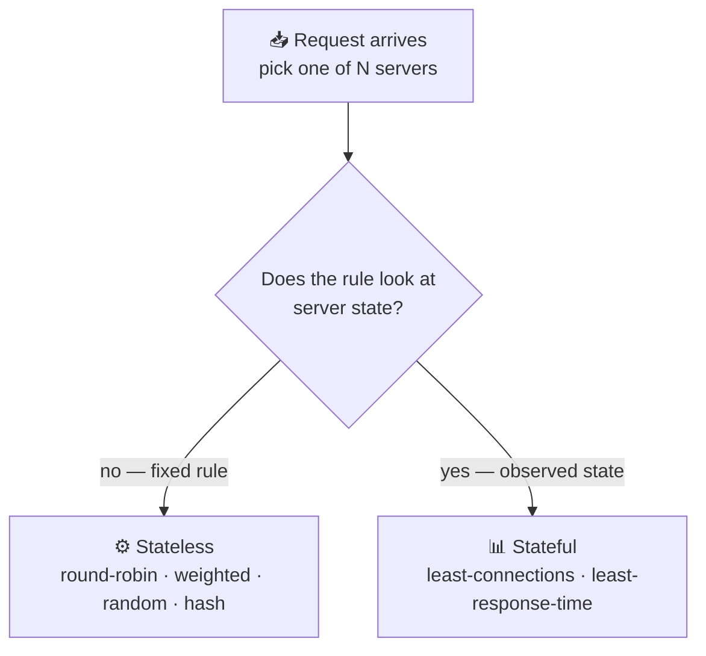

# Load Balancing Algorithms

> **Phase:** Networking Deep Dives → **Topic:** 6 of 7 → **Read time:** ~50 minutes

---

## Before You Begin

**This document stands alone.** It assumes you have read nothing else — not the foundation series, not the phase before it, not the topics before it. Everything is built here from zero: what the selection decision actually is, each algorithm that makes it, the assumption each one hides, and what happens to each when that assumption breaks.

Two consequences of that choice:

- **Terms get defined where they're used** — pool, upstream, stateless and stateful selection, rehashing. Skim past what you already know.
- **Neighbouring topics are named, not taught.** How a server comes to be added or removed, how the balancer knows a server is alive, consistent hashing's internals, and autoscaling each have their own full treatment elsewhere in this curriculum. Where they touch the selection decision, this document says so and points; it doesn't absorb them. *The algorithms themselves are complete here.*

Load balancing is one of the concepts in the **Top 30 Must-Know Concepts** foundation series, where it gets a short introduction. This document is the deep-dive on the one decision at its heart: given several servers that could all answer, which one gets the request.

Here is the question the document answers:

> **When any of several servers could handle a request, what rule decides — and why does the "obvious" rule quietly ruin performance for most real workloads?**

Here's the trap it disarms. The selection algorithm looks like the whole substance of load balancing, and it's the part most people give the least thought to. Every reference offers the same four names — round-robin, least-connections, weighted, hashing — a sentence each, presented as interchangeable defaults you pick between by taste. So teams take the default, it works in testing, and they never think about it again.

Then a latency tail appears that no dashboard explains, or an incident makes one server melt while its neighbours sit idle, and the cause turns out to be the selection rule doing exactly what it was designed to do — under conditions where its central assumption had quietly stopped being true.

> **The mindset shift:** stop asking *"which algorithm spreads requests most evenly?"* and start asking **"what does this algorithm assume, and what happens the moment that assumption is false?"** Every balancing algorithm is a bet about the world: that all requests cost roughly the same, that a server's connection count reflects its real load, that a server which answers is a server that works. On an ordinary day every bet pays off and the algorithms are genuinely hard to tell apart. The choice only becomes visible when a bet loses — and that is precisely the moment, under load or during failure, when you can least afford to have bet wrong.

---

## Table of Contents

1. [The Decision, Isolated](#1-the-decision-isolated)
2. [Round-Robin — Rotation and Its One Assumption](#2-round-robin--rotation-and-its-one-assumption)
3. [Weighted — When Servers Aren't Equal](#3-weighted--when-servers-arent-equal)
4. [Least-Connections — Reacting to Real State](#4-least-connections--reacting-to-real-state)
5. [The Trouble With Counting Connections](#5-the-trouble-with-counting-connections)
6. [Random and the Power of Two Choices](#6-random-and-the-power-of-two-choices)
7. [Hashing — Sending the Same Key to the Same Server](#7-hashing--sending-the-same-key-to-the-same-server)
8. [When the Pool Changes Size](#8-when-the-pool-changes-size)
9. [Choosing — There Is No Default](#9-choosing--there-is-no-default)
10. [Putting It All Together — The Algorithm That Wasn't the Problem](#10-putting-it-all-together--the-algorithm-that-wasnt-the-problem)
11. [Final Recap](#11-final-recap)

---

## 1. The Decision, Isolated

Strip everything else away and look at the one moment this document is about.

A request arrives at a component that fronts a group of servers. Several of those servers — maybe all of them — could produce the answer. The component must pick exactly one and forward the request to it. Then the next request arrives, and it picks again.

That group of interchangeable servers is the **pool**; each member is an **upstream**; the component doing the picking is a load balancer. Everything about *how servers join the pool, how the balancer knows they're alive, and how they leave* is a separate subject with its own treatment. This document assumes a pool exists and asks only: **how is the one server chosen?**

It sounds trivial. It is not, and the reason is that the balancer is choosing with far less information than the choice deserves.

### The Balancer Is Nearly Blind

When a request arrives, what does the balancer actually know about it? Almost nothing. It has not run the request. It does not know whether this one will finish in a millisecond or tie up a server for thirty seconds. It cannot see how loaded each server truly is — only, at best, some indirect signal. It is deciding *before* the information that would make the decision easy exists.

So every algorithm is a strategy for choosing well under ignorance. They differ in **what signal they lean on**, and that single difference sorts them into two families that the rest of this document follows.

### Two Families

**Stateless selection** applies a fixed rule that ignores what the servers are currently doing. Rotate through them in order; pick one at random; compute a server from a key. The balancer needs to know nothing about server load — it just follows the rule. Cheap, simple, and predictable, at the cost of being unable to react to anything.

**Stateful selection** watches the servers and decides from what it observes — usually how many requests each is currently handling. It can react to real conditions, sending work away from a busy server toward an idle one. More powerful, and it introduces a new hazard: the observed signal can be **misleading**, and a rule that acts confidently on a wrong signal fails worse than one that never looked (§4, §5).

That tension is the whole subject:

| | Stateless | Stateful |
|---|---|---|
| Decides from | A fixed rule | Observed server state |
| Reacts to load | No | Yes |
| Cost to run | Minimal | Tracks state per server |
| Failure mode | Blind to trouble | Can be **misled** by a bad signal |

### Why the Choice Is Usually Invisible

One more thing to establish, because it explains why this decision is so widely neglected. When requests all cost about the same and servers are all about equal, *every* algorithm distributes work well. Round-robin, random, least-connections — they converge on the same even spread, and you genuinely cannot tell them apart.

Real workloads are not like that. Requests vary enormously in cost — a cached lookup versus a report that scans millions of rows. Servers drift apart in capacity. Some requests hold a connection open for a second, others for an hour. The algorithms diverge exactly in proportion to how *un*-uniform the workload is — which means the choice is invisible right up until the workload makes it decisive.

> 💡 **Key Insight**
>
> The load balancer chooses **before it knows anything useful** about the request it's routing — not how expensive it will be, not how loaded each server truly is. Every algorithm is therefore a bet placed under ignorance, and they divide by which signal they trust: **stateless** rules trust a fixed pattern and can't react; **stateful** rules trust observed state and can be deceived by it. Hold onto that division — most of what follows is a specific algorithm's bet, and the specific day that bet comes due.

### Quick Recap — The Decision, Isolated

- The whole subject is one moment: several servers in the **pool** could answer, and the balancer must pick exactly one **upstream** — repeatedly, with little information.
- The balancer is nearly **blind**: it doesn't know a request's cost or a server's true load when it decides, so every algorithm chooses under ignorance.
- Algorithms split into **stateless** (fixed rule, can't react) and **stateful** (reads server state, can be misled) — the division the rest of the document follows.
- The choice is **invisible under uniform load** and grows decisive exactly as requests and servers become uneven.
