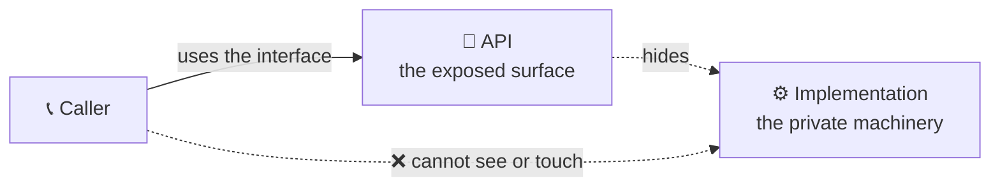
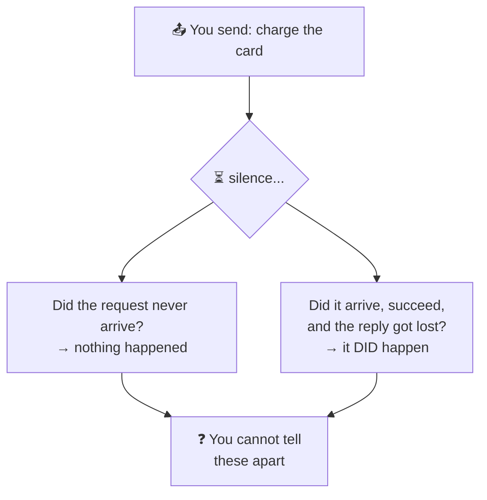

# What Is an API?

> **Phase:** APIs & Communication Deep Dives → **Topic:** 1 of 15 → **Read time:** ~50 minutes

---

## Before You Begin

**This document stands alone.** It assumes you have read nothing else — not the foundation series, not the phases before it. Everything is built here from zero: what an API is, what a contract actually consists of, and — the heart of it — what changes the moment that contract is served across a network instead of called inside one program.

Two consequences of that choice:

- **Terms get defined where they're used** — interface, implementation, contract, encapsulation, backward compatibility, idempotency. Skim past what you already know.
- **Neighbouring topics are named, not taught.** The specific *styles* an API can take (REST, GraphQL, gRPC, WebSockets, webhooks), the *formats* it serializes to (JSON, Protobuf), and the *mechanisms* it relies on (versioning, idempotency, rate limiting, gateways) each have their own full treatment later in this phase. This document is about what all of them have in common — the thing they are all versions of.

APIs are one of the concepts in the **Top 30 Must-Know Concepts** foundation series, where they get a short introduction. This is the deep-dive.

Here is the question the document answers:

> **Everyone knows an API is "the thing you call to get data." So why is designing one hard enough to have an entire phase of this curriculum devoted to it?**

Here's the trap it disarms. The word "API" feels fully understood the moment you've used one — you send a request, you get JSON back, done. That familiarity is exactly what hides the subject. Calling an API *looks* identical to calling a function in your own code: a name, some arguments, a return value. It reads the same on the page.

It is not the same, and the entire difficulty of APIs lives in the difference. The function in your code shares your fate — if it's there, it runs; if it's broken, your program is broken with it, immediately and obviously. The API across the network shares nothing with you. It belongs to someone else, runs on a machine you don't control, and can be slow, absent, overloaded, or a version you've never seen — while your code keeps running and has to somehow cope.

> **The mindset shift:** stop picturing an API as *a thing you call to get data* and start seeing it as **a contract between two parties who fail independently.** A local function call has one fate, shared between caller and callee. A network call splits that fate in two: the other side can vanish while you continue, and now every hard thing about APIs — timeouts, retries, duplicate requests, versioning, backward compatibility — becomes unavoidable. None of them are about the data or the format. All of them are consequences of the two sides being able to fail apart from each other.

---

## Table of Contents

1. [What an API Actually Is](#1-what-an-api-actually-is)
2. [The Leap — Local Calls vs Remote Calls](#2-the-leap--local-calls-vs-remote-calls)
3. [The Contract and Its Parts](#3-the-contract-and-its-parts)
4. [Encapsulation — The Whole Point](#4-encapsulation--the-whole-point)
5. [The Contract Must Survive Change](#5-the-contract-must-survive-change)
6. [Failure Is Now a First-Class Case](#6-failure-is-now-a-first-class-case)
7. [Boundaries Are Control Points](#7-boundaries-are-control-points)
8. [Public, Private, and Partner APIs](#8-public-private-and-partner-apis)
9. [The Shapes a Contract Can Take](#9-the-shapes-a-contract-can-take)
10. [Putting It All Together — Turning an Internal Function Into a Public API](#10-putting-it-all-together--turning-an-internal-function-into-a-public-api)
11. [Final Recap](#11-final-recap)

---

## 1. What an API Actually Is

Start somewhere unglamorous and completely familiar: a function you call in your own code.

```
balance = get_account_balance(account_id)
```

You call `get_account_balance`. You pass an account ID. You get a balance back. And here is the part that matters: **you have no idea how it works, and you don't need to.** Maybe it reads a variable. Maybe it queries a database. Maybe it performs a calculation across a dozen tables. You know its *name*, what to *give* it, and what you *get* — and nothing else. You couldn't describe its internals if asked, and your code works anyway.

That is already an API.

> **An API — Application Programming Interface — is the set of operations one piece of software exposes for others to use, together with the rules for using them, deliberately separated from how those operations actually work.**

The word doing the heavy lifting is **interface**. An interface is the *surface* of something — the parts you're meant to touch — as distinct from its **implementation**, the machinery behind that surface. `get_account_balance` is an interface: a name, an expected input, a promised output. Everything inside it is implementation, and the whole point is that you are kept on the outside of it.

### Interface Versus Implementation

This split is the foundational idea, so it's worth stating sharply. Every API draws a line with two sides:

| The interface (the API) | The implementation (behind it) |
|---|---|
| What you call and how | How the work is actually done |
| Fixed — others depend on it | Free to change |
| The promise | The fulfilment of the promise |
| Small, deliberate, documented | Large, private, whatever it needs to be |

The value is entirely in keeping these apart. Because callers depend only on the interface, the implementation behind it can be rewritten, optimised, or replaced completely, and as long as the interface keeps behaving the same, nothing that depends on it notices. That freedom — **change the inside without disturbing the outside** — is what an API buys, and everything else in this document is a consequence or a complication of it.

### APIs Are Everywhere, at Every Scale

"API" gets used most often for the web kind — a service you reach over a network. But the concept is far broader, and seeing that is what makes the network case's difficulty visible by contrast:

- A **function** is an API to the code that calls it.
- A **library** is an API — a set of functions exposing capability while hiding its internals.
- An **operating system** exposes an API so programs can open files without knowing how the disk works.
- A **service across a network** exposes an API so other systems can use it without sharing its code or database.



All four are the same idea: a stable surface over a hidden interior. The difference — the *entire* difference this phase is built on — is what sits between the caller and the interface. For a function, nothing. For a network service, a network. And a network changes everything, which is §2.

> 💡 **Key Insight**
>
> An API is the deliberate separation of **interface** (what you expose) from **implementation** (how it works), and its whole value is that the two can change independently — you can rewrite the inside freely as long as the outside keeps its promise. A function already is one. That's worth holding onto, because it means the hard parts of APIs that follow are *not* inherent to the idea of an interface — they're what happens when you take this simple, safe local concept and stretch it across a network that can fail.

### Quick Recap — What an API Actually Is

- An **API** is the exposed set of operations plus the rules for using them, kept separate from how they actually work.
- The core split is **interface** (the fixed, public surface) versus **implementation** (the private, changeable machinery).
- Its value is that the two move independently — **the inside can change freely while the outside keeps its promise**.
- The concept spans every scale — function, library, OS, network service — and the network case is hard not because of the interface but because of what sits under it (§2).

---

## 2. The Leap — Local Calls vs Remote Calls

Here is the center of the entire subject. Put the two calls side by side:

```
balance = get_account_balance(account_id)        # a function in your program
balance = accounts_api.get_balance(account_id)    # a service across a network
```

They look the same. In many systems they're *written* to look deliberately identical — the whole point of some frameworks is to make a remote call read like a local one. That resemblance is a trap, because underneath they could hardly be more different.

### What the Local Call Guarantees

When `get_account_balance` runs in your own program, a set of things are true so reliably you never think about them:

- **It returns essentially instantly** — nanoseconds to microseconds. Fast enough to treat as free.
- **It either runs or it doesn't, with you.** If the function is present, it executes. If it's broken, your whole program is broken too — there's no world where it half-happens or vanishes while you keep going.
- **You always know the outcome.** It returns a value or it raises an error. There is no third state.
- **It's the exact version you compiled against.** The code you call is the code you shipped.

Every one of these quietly disappears when the call crosses a network.

### What the Remote Call Actually Faces

The remote version travels out of your process, across a network, to a machine owned by someone else, and back. Each of those guarantees inverts:

| | Local call | Remote call |
|---|---|---|
| Time | Nanoseconds | Milliseconds to seconds — and unpredictable |
| Failure | Shares your fate | **Fails independently of you** |
| Outcome | Always known | Can be **genuinely unknowable** |
| Version | Exactly yours | Whatever they've deployed |
| The other side | Always there | May be down, moved, or overloaded |

The second and third rows are the ones that reshape everything.

**Independent failure** is the heart of it. Your code is running fine, and the service you called is on fire — those are now separate facts. The callee can crash, restart, get overloaded, or be cut off by a network fault entirely on its own, while your program keeps executing and has to decide what to do about a call that isn't coming back. A local function can't do this to you; a remote one does it routinely.

**The unknowable outcome** is the strangest and most consequential. Consider what happens when you send a request and hear nothing back:



A lost request and a lost *response* look identical from where you stand — silence. In the first case nothing happened; in the second the work completed and you'll never know. This is not a rare edge case; it is a fundamental property of talking over a network, and it is why "did it work?" can have no answer. Everything in §6 grows out of this single fact.

### The Comforting Lie

There's a famous set of false assumptions that people bring from local programming to networked systems — that the network is reliable, that latency is zero, that bandwidth is infinite, that the far end is always up. Each is true *enough* locally to be invisible, and each is false over a network in a way that eventually causes an outage. The remote call that was written to look local carries all of these assumptions silently until the day the network makes one of them false.

The deep lesson: **making a remote call look like a local call hides the difference but does not remove it.** The convenience is real and so is the danger — the code reads simply while quietly depending on a network behaving like local memory, which it never will.

> ⚠️ **A remote call is not a slow function call — it is a different thing wearing the same syntax.** The identical-looking line hides that the callee now fails on its own, answers on its own schedule, runs a version you didn't choose, and can leave you unable to know whether your request took effect. Treat the resemblance as a convenience for *writing* the call and a liability for *reasoning* about it. Every later section of this document is a consequence that a local call never forced you to consider.

### Quick Recap — The Leap

- A local call and a remote call can look identical in code and are fundamentally different underneath — the resemblance is a trap.
- A local call **shares your fate**; a remote call **fails independently** — the callee can be down, slow, or overloaded while your code runs on.
- A network makes the outcome **genuinely unknowable**: a lost request and a lost response both appear as silence, so "did it work?" may have no answer (→ §6).
- The assumptions that hold locally — reliable, instant, always-up — are all **false over a network**, and making the call *look* local hides that without removing it.
