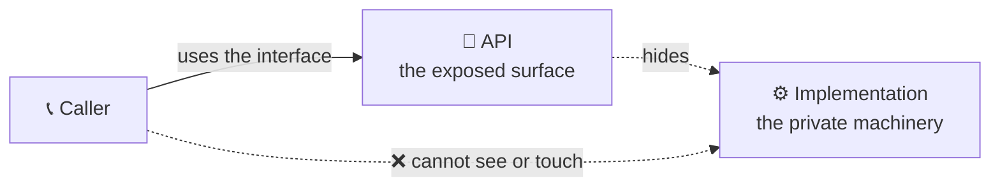
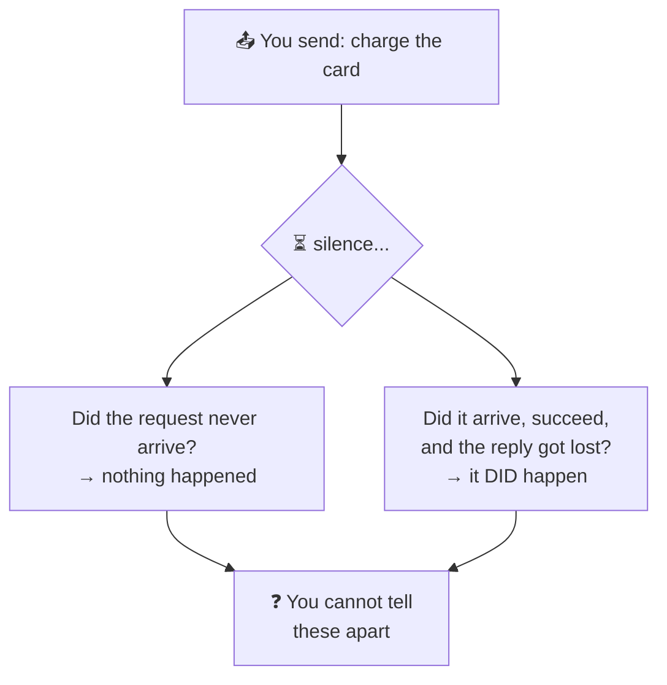
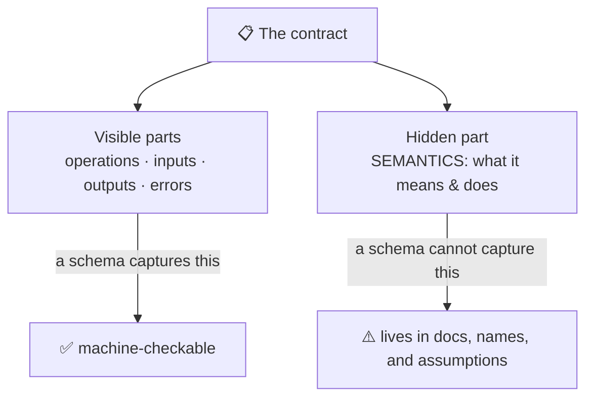
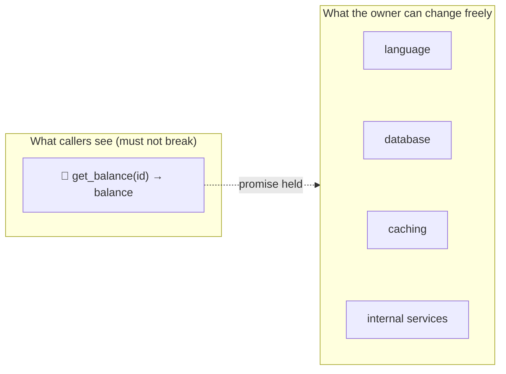
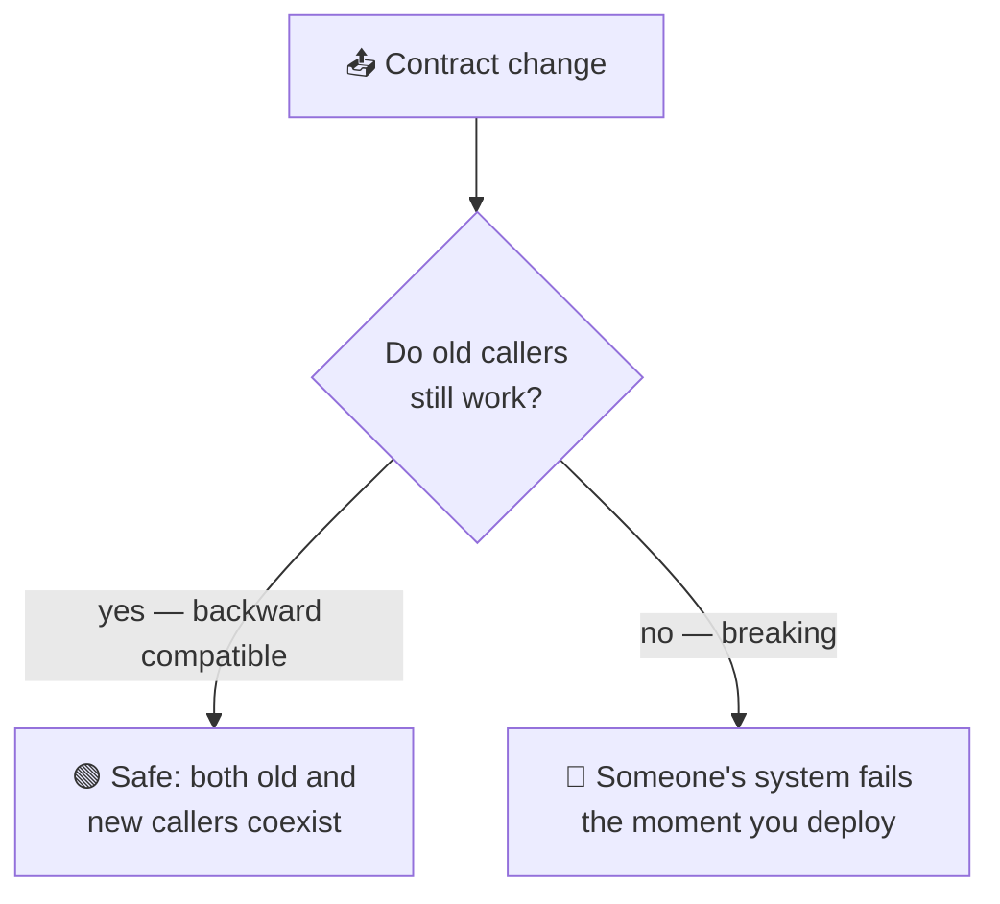
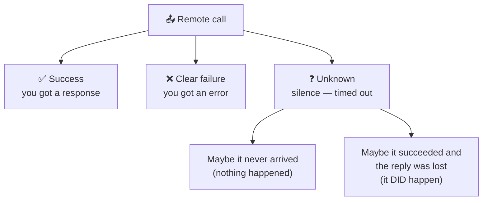
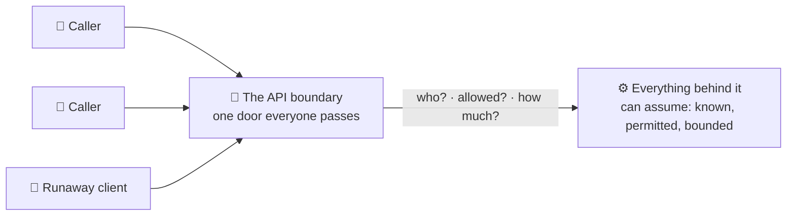

# What Is an API?

> **Phase:** APIs & Communication Deep Dives → **Topic:** 1 of 15 → **Read time:** ~50 minutes

---

## Before You Begin

**This document stands alone.** It assumes you have read nothing else — not the foundation series, not the phases before it. Everything is built here from zero: what an API is, what a contract actually consists of, and — the heart of it — what changes the moment that contract is served across a network instead of called inside one program.

Two consequences of that choice:

- **Terms get defined where they're used** — interface, implementation, contract, encapsulation, backward compatibility, idempotency. Skim past what you already know.
- **Neighbouring topics are named, not taught.** The specific *styles* an API can take (REST, GraphQL, gRPC, WebSockets, webhooks), the *formats* it serializes to (JSON, Protobuf), and the *mechanisms* it relies on (versioning, idempotency, rate limiting, gateways) each have their own full treatment later in this phase. This document is about what all of them have in common — the thing they are all versions of.

APIs are one of the concepts in the **Top 30 Must-Know Concepts** foundation series, where they get a short introduction. This is the deep-dive.

Here is the question the document answers:

> **Everyone knows an API is "the thing you call to get data." So why is designing one hard enough to have an entire phase of this curriculum devoted to it?**

Here's the trap it disarms. The word "API" feels fully understood the moment you've used one — you send a request, you get JSON back, done. That familiarity is exactly what hides the subject. Calling an API *looks* identical to calling a function in your own code: a name, some arguments, a return value. It reads the same on the page.

It is not the same, and the entire difficulty of APIs lives in the difference. The function in your code shares your fate — if it's there, it runs; if it's broken, your program is broken with it, immediately and obviously. The API across the network shares nothing with you. It belongs to someone else, runs on a machine you don't control, and can be slow, absent, overloaded, or a version you've never seen — while your code keeps running and has to somehow cope.

> **The mindset shift:** stop picturing an API as *a thing you call to get data* and start seeing it as **a contract between two parties who fail independently.** A local function call has one fate, shared between caller and callee. A network call splits that fate in two: the other side can vanish while you continue, and now every hard thing about APIs — timeouts, retries, duplicate requests, versioning, backward compatibility — becomes unavoidable. None of them are about the data or the format. All of them are consequences of the two sides being able to fail apart from each other.

---

## Table of Contents

1. [What an API Actually Is](#1-what-an-api-actually-is)
2. [The Leap — Local Calls vs Remote Calls](#2-the-leap--local-calls-vs-remote-calls)
3. [The Contract and Its Parts](#3-the-contract-and-its-parts)
4. [Encapsulation — The Whole Point](#4-encapsulation--the-whole-point)
5. [The Contract Must Survive Change](#5-the-contract-must-survive-change)
6. [Failure Is Now a First-Class Case](#6-failure-is-now-a-first-class-case)
7. [Boundaries Are Control Points](#7-boundaries-are-control-points)
8. [Public, Private, and Partner APIs](#8-public-private-and-partner-apis)
9. [The Shapes a Contract Can Take](#9-the-shapes-a-contract-can-take)
10. [Putting It All Together — Turning an Internal Function Into a Public API](#10-putting-it-all-together--turning-an-internal-function-into-a-public-api)
11. [Final Recap](#11-final-recap)

---

## 1. What an API Actually Is

Start somewhere unglamorous and completely familiar: a function you call in your own code.

```
balance = get_account_balance(account_id)
```

You call `get_account_balance`. You pass an account ID. You get a balance back. And here is the part that matters: **you have no idea how it works, and you don't need to.** Maybe it reads a variable. Maybe it queries a database. Maybe it performs a calculation across a dozen tables. You know its *name*, what to *give* it, and what you *get* — and nothing else. You couldn't describe its internals if asked, and your code works anyway.

That is already an API.

> **An API — Application Programming Interface — is the set of operations one piece of software exposes for others to use, together with the rules for using them, deliberately separated from how those operations actually work.**

The word doing the heavy lifting is **interface**. An interface is the *surface* of something — the parts you're meant to touch — as distinct from its **implementation**, the machinery behind that surface. `get_account_balance` is an interface: a name, an expected input, a promised output. Everything inside it is implementation, and the whole point is that you are kept on the outside of it.

### Interface Versus Implementation

This split is the foundational idea, so it's worth stating sharply. Every API draws a line with two sides:

| The interface (the API) | The implementation (behind it) |
|---|---|
| What you call and how | How the work is actually done |
| Fixed — others depend on it | Free to change |
| The promise | The fulfilment of the promise |
| Small, deliberate, documented | Large, private, whatever it needs to be |

The value is entirely in keeping these apart. Because callers depend only on the interface, the implementation behind it can be rewritten, optimised, or replaced completely, and as long as the interface keeps behaving the same, nothing that depends on it notices. That freedom — **change the inside without disturbing the outside** — is what an API buys, and everything else in this document is a consequence or a complication of it.

### APIs Are Everywhere, at Every Scale

"API" gets used most often for the web kind — a service you reach over a network. But the concept is far broader, and seeing that is what makes the network case's difficulty visible by contrast:

- A **function** is an API to the code that calls it.
- A **library** is an API — a set of functions exposing capability while hiding its internals.
- An **operating system** exposes an API so programs can open files without knowing how the disk works.
- A **service across a network** exposes an API so other systems can use it without sharing its code or database.



All four are the same idea: a stable surface over a hidden interior. The difference — the *entire* difference this phase is built on — is what sits between the caller and the interface. For a function, nothing. For a network service, a network. And a network changes everything, which is §2.

> 💡 **Key Insight**
>
> An API is the deliberate separation of **interface** (what you expose) from **implementation** (how it works), and its whole value is that the two can change independently — you can rewrite the inside freely as long as the outside keeps its promise. A function already is one. That's worth holding onto, because it means the hard parts of APIs that follow are *not* inherent to the idea of an interface — they're what happens when you take this simple, safe local concept and stretch it across a network that can fail.

### Quick Recap — What an API Actually Is

- An **API** is the exposed set of operations plus the rules for using them, kept separate from how they actually work.
- The core split is **interface** (the fixed, public surface) versus **implementation** (the private, changeable machinery).
- Its value is that the two move independently — **the inside can change freely while the outside keeps its promise**.
- The concept spans every scale — function, library, OS, network service — and the network case is hard not because of the interface but because of what sits under it (§2).

---

## 2. The Leap — Local Calls vs Remote Calls

Here is the center of the entire subject. Put the two calls side by side:

```
balance = get_account_balance(account_id)        # a function in your program
balance = accounts_api.get_balance(account_id)    # a service across a network
```

They look the same. In many systems they're *written* to look deliberately identical — the whole point of some frameworks is to make a remote call read like a local one. That resemblance is a trap, because underneath they could hardly be more different.

### What the Local Call Guarantees

When `get_account_balance` runs in your own program, a set of things are true so reliably you never think about them:

- **It returns essentially instantly** — nanoseconds to microseconds. Fast enough to treat as free.
- **It either runs or it doesn't, with you.** If the function is present, it executes. If it's broken, your whole program is broken too — there's no world where it half-happens or vanishes while you keep going.
- **You always know the outcome.** It returns a value or it raises an error. There is no third state.
- **It's the exact version you compiled against.** The code you call is the code you shipped.

Every one of these quietly disappears when the call crosses a network.

### What the Remote Call Actually Faces

The remote version travels out of your process, across a network, to a machine owned by someone else, and back. Each of those guarantees inverts:

| | Local call | Remote call |
|---|---|---|
| Time | Nanoseconds | Milliseconds to seconds — and unpredictable |
| Failure | Shares your fate | **Fails independently of you** |
| Outcome | Always known | Can be **genuinely unknowable** |
| Version | Exactly yours | Whatever they've deployed |
| The other side | Always there | May be down, moved, or overloaded |

The second and third rows are the ones that reshape everything.

**Independent failure** is the heart of it. Your code is running fine, and the service you called is on fire — those are now separate facts. The callee can crash, restart, get overloaded, or be cut off by a network fault entirely on its own, while your program keeps executing and has to decide what to do about a call that isn't coming back. A local function can't do this to you; a remote one does it routinely.

**The unknowable outcome** is the strangest and most consequential. Consider what happens when you send a request and hear nothing back:



A lost request and a lost *response* look identical from where you stand — silence. In the first case nothing happened; in the second the work completed and you'll never know. This is not a rare edge case; it is a fundamental property of talking over a network, and it is why "did it work?" can have no answer. Everything in §6 grows out of this single fact.

### The Comforting Lie

There's a famous set of false assumptions that people bring from local programming to networked systems — that the network is reliable, that latency is zero, that bandwidth is infinite, that the far end is always up. Each is true *enough* locally to be invisible, and each is false over a network in a way that eventually causes an outage. The remote call that was written to look local carries all of these assumptions silently until the day the network makes one of them false.

The deep lesson: **making a remote call look like a local call hides the difference but does not remove it.** The convenience is real and so is the danger — the code reads simply while quietly depending on a network behaving like local memory, which it never will.

> ⚠️ **A remote call is not a slow function call — it is a different thing wearing the same syntax.** The identical-looking line hides that the callee now fails on its own, answers on its own schedule, runs a version you didn't choose, and can leave you unable to know whether your request took effect. Treat the resemblance as a convenience for *writing* the call and a liability for *reasoning* about it. Every later section of this document is a consequence that a local call never forced you to consider.

### Quick Recap — The Leap

- A local call and a remote call can look identical in code and are fundamentally different underneath — the resemblance is a trap.
- A local call **shares your fate**; a remote call **fails independently** — the callee can be down, slow, or overloaded while your code runs on.
- A network makes the outcome **genuinely unknowable**: a lost request and a lost response both appear as silence, so "did it work?" may have no answer (→ §6).
- The assumptions that hold locally — reliable, instant, always-up — are all **false over a network**, and making the call *look* local hides that without removing it.

---

## 3. The Contract and Its Parts

If an API is a promise between two parties, it's worth being exact about what, specifically, is being promised. People reach for the word **contract**, and it's the right word — but the contract is bigger than most people picture, and the parts they forget are the ones that cause the trouble.

### What Both Sides Are Agreeing To

A complete API contract has more terms than "here's the URL and the fields":

| Part of the contract | What it fixes | Example |
|---|---|---|
| **Operations** | What you're allowed to ask for | "Fetch a balance," "create an order" |
| **Inputs** | What you must supply, and in what shape | An account ID, as a string |
| **Outputs** | What comes back, and in what shape | A balance, as a number, with a currency |
| **Errors** | How failure is reported, and which failures exist | "Not found," "not allowed," "try later" |
| **Semantics** | What the operation actually *means* and *does* | Does "create order" also charge the card? |

The first three are the obvious ones, and they're the parts a schema or documentation captures well. The last two are where contracts quietly fail.

### Errors Are Part of the Promise

A contract that only describes success describes half of what callers depend on. Over a network, failure is common (§2), so *how* an API fails is as much a part of its interface as how it succeeds.

If callers can't tell "the account doesn't exist" from "you're not allowed to see it" from "the service is briefly overloaded," they can't respond correctly — and the natural wrong response to an ambiguous error is to retry, which turns a small problem into a bigger one. A well-designed error surface tells the caller not just *that* something failed but *which kind* of failure it was, so they can distinguish "give up, this will never work" from "wait and try again." Defining those categories is designing the contract, not an afterthought to it.

### Semantics — The Part No Schema Captures

Here is the subtlest and most important part. A schema can tell you an operation is called `create_order` and takes a cart ID and returns an order ID. It cannot tell you what `create_order` *means*:

- Does it also charge the customer's card, or just record intent?
- Does calling it twice make two orders, or is the second call ignored?
- Does it reserve inventory? Send an email? Nothing until a later step?

Two APIs with byte-for-byte identical inputs and outputs can behave completely differently, because the *meaning* of the operation lives in none of the visible parts. This is why reading an API's type signatures is never enough to use it correctly — the signature is the grammar, and the semantics are what the sentence means.



The semantics are carried in documentation, in careful naming, and — dangerously — in the caller's *assumptions* when the documentation is silent. An enormous share of integration bugs are semantic: both sides implemented the schema perfectly and disagreed about what an operation was supposed to do.

### The Contract Is the Real Product

Pulling this together: when you publish an API, the artifact other people build on is not your code and not your data — it's this contract. They depend on the operations existing, the shapes holding, the errors being distinguishable, and above all the *meaning* staying stable. That's why later topics in this phase exist at all: styles like REST and gRPC are different ways of *expressing* this contract, formats like JSON are ways of *serializing* its inputs and outputs, and versioning (§5) is how the contract is allowed to *change*. All of them are in service of this one thing — the agreement about what interacting looks like.

> 💡 **Key Insight**
>
> A contract is more than its schema. Operations, inputs, and outputs are the machine-checkable part, but **errors** and **semantics** — how it fails and what it actually means — are equally binding and largely uncheckable. Two APIs with identical signatures can do entirely different things, so the deepest part of the promise is the part no type system enforces. When integrations break between teams who both "followed the spec," the disagreement is almost always here: in meaning, not in shape.

### Quick Recap — The Contract and Its Parts

- An API contract has five parts: **operations, inputs, outputs, errors, and semantics** — not just the URL and fields.
- **Errors are part of the promise**: callers must be able to tell "never going to work" from "try again," or they retry blindly (→ §6).
- **Semantics** — what an operation means and does — are captured by *no schema*, so identical signatures can hide completely different behaviour.
- The contract, not the code or data, is **the actual product** others build on — which is why styles, formats, and versioning all exist to serve it.

---

## 4. Encapsulation — The Whole Point

§1 said an API's value is that the interface and the implementation move independently. This section is about *why* that's worth so much — and what it costs to get.

The technical name for hiding the implementation behind an interface is **encapsulation**, and it is not a side benefit of having an API. It is the reason to have one.

### The Freedom to Change the Inside

Consider what a caller of `get_balance` depends on: the operation exists, it takes an account ID, it returns a balance. That's all. So behind that interface, the team that owns it can do essentially anything:

- Rewrite it in a different language.
- Move the data from one database to another.
- Add a cache, shard the storage, split it into three services.
- Fix bugs, change algorithms, restructure everything.

None of it reaches the caller, **as long as the interface keeps its promise.** The implementation is free precisely because it is hidden. A team can improve, rewrite, or completely replace what's behind their API on their own schedule, and every consumer keeps working without knowing anything changed.

This is what lets large systems be built by many teams at once. Each team owns what's behind its APIs and can move independently, coordinating only when a *contract* changes rather than every time any code changes. Without encapsulation, every internal change would ripple into everyone who depends on you, and no large system could be worked on by more than a few people.



### Coupling — What You're Really Controlling

Underneath encapsulation is a deeper idea worth naming: **coupling**, how much one thing depends on the details of another. Two pieces of software are tightly coupled when a change to one forces a change to the other; loosely coupled when each can change alone.

An API is a **coupling-control device.** It lets callers couple to the *interface* — the small, stable, deliberately-designed surface — instead of to the *implementation* — the large, volatile interior. You can't eliminate the dependency (the caller genuinely needs the capability), but you can aim it at the part that's designed to hold still. Good API design is, in large part, the art of exposing the least surface that's still useful, so callers depend on as little as possible.

### The Cost — The Boundary Is Now Yours to Defend

Encapsulation isn't free, and the cost is the mirror of the benefit. The moment you draw that boundary and let others depend on it, **the boundary becomes a thing you must design deliberately and then defend indefinitely.**

- Whatever you expose, you're committed to. If you leak an internal detail into the interface — a database ID, an internal status code, an implementation quirk — callers will depend on it, and now it's part of your contract whether you meant it to be or not.
- The interface can no longer change as freely as the internals precisely *because* people depend on it. You've traded internal freedom for external stability, which is exactly the trade you wanted — but it means the boundary is where your freedom stops.

This is why an over-exposed API is a lasting liability. Every internal detail that escapes into the interface is a future constraint, because someone will build on it and you'll be unable to change it without breaking them (§5). The discipline of encapsulation is as much about what you *refuse* to expose as what you offer.

> 💡 **Key Insight**
>
> Encapsulation — hiding the implementation behind the interface — is not a feature of APIs, it *is* the point: it lets the inside change freely while the outside holds still, which is the only reason many teams can build one system without constantly breaking each other. But it works by moving your freedom to a boundary and then freezing that boundary. So the craft is exposing the **least** surface that's still useful — because everything you expose, you have promised to keep, and every internal detail that leaks out becomes a constraint you can't take back.

### Quick Recap — Encapsulation

- **Encapsulation** — hiding the implementation behind the interface — is the reason to have an API, not a side effect of one.
- It lets the owner **change the entire inside freely** while the promise holds, which is what allows many teams to build one system in parallel.
- An API is a **coupling-control device**: it points callers at the small, stable interface instead of the large, volatile implementation.
- The cost is that the **boundary must be designed and defended** — everything you expose becomes a commitment, so exposing the least useful surface is the discipline (→ §5).

---

## 5. The Contract Must Survive Change

§4 ended on a tension: the interface has to hold still so callers can depend on it, but no interface stays right forever. Requirements change, mistakes need fixing, new capabilities arrive. So the contract must *change* — while somehow not breaking the people depending on it. That balance is one of the hardest things about running an API, and it starts from a fact about who you can control.

### You Cannot Force an Upgrade

With a local function, changing it is trivial: you edit it and its callers in the same change, compile, done. Everyone is on the new version instantly because there *is* only one version.

An API has callers you don't control and can't update. A public API might be called by thousands of applications written by people you've never met. Even a private API inside your own company is called by other teams on their own schedules. When you change the contract, **you cannot make anyone adopt the change** — you can announce it, you can beg, but their software keeps calling the old contract until they choose to update it, which may be never.

This is the constraint that makes API evolution its own discipline: **the old callers don't go away when you ship the new version.** Both must work at once.

### Breaking vs Non-Breaking Change

The line that governs everything here is whether a change breaks existing callers:

| Non-breaking (safe) | Breaking (dangerous) |
|---|---|
| Adding a new optional field | Removing a field |
| Adding a new operation | Renaming a field or operation |
| Adding an optional input | Making an optional input required |
| A new value callers can ignore | Changing a type, or an operation's meaning |

The pattern underneath: **additions are usually safe; removals and changes usually break.** A caller that ignores fields it doesn't recognise is unaffected when you add one — but any caller depending on something you removed or renamed shatters the moment you ship.

The subtle killer is the last row on the right: **changing what an operation means** (§3's semantics) is a breaking change that no schema check will catch. If `create_order` used to reserve inventory and quietly stops, every field is identical and every caller relying on the old behaviour is now wrong. Semantic breaks are the most dangerous because they're invisible to tooling.

### Backward Compatibility as an Obligation

The property you're protecting has a name: **backward compatibility** — new versions of the API continue to work for callers written against older versions. When you keep it, old callers keep running while new callers use the new capabilities, and the transition happens gradually and safely. When you break it, someone's system fails at the moment you deploy, through no action of their own.



For anything with real consumers, backward compatibility stops being a courtesy and becomes an obligation — the practical meaning of "the interface holds still" from §4. It's why mature APIs accrete rather than change: they add the new way beside the old one and leave the old one working, because removing it would break the callers they can't control.

### When You Genuinely Must Break It

Sometimes a change is necessary and cannot be made compatible. You can't hold every old contract forever, and occasionally the interface really does have to change in a breaking way. That situation — running the old and new contracts side by side, giving callers time to migrate, and eventually retiring the old one — is exactly what **API versioning** is for. It's a substantial topic in its own right, covered later in this phase; what matters here is *why* it has to exist at all: because you can't force an upgrade, so the only way to make a breaking change safely is to not break the old thing until everyone has voluntarily left it.

> ⚠️ **The callers you can't see are the ones the contract exists to protect.** Because you can't force anyone to upgrade, every change you publish must assume old callers are still out there calling the old way — which makes "is this backward compatible?" the first question about any API change, and makes semantic changes (§3) the most dangerous, since they break callers while passing every schema check. When a change genuinely can't be made compatible, that's not a failure of discipline — it's precisely the problem **versioning** exists to manage.

### Quick Recap — The Contract Must Survive Change

- You **cannot force callers to upgrade**, so old and new versions of the contract must work at the same time — the constraint that makes API evolution hard.
- **Additions are usually safe; removals and changes usually break** — and the worst breaks are **semantic**, invisible to any schema check (§3).
- **Backward compatibility** — old callers keep working against new versions — is an obligation for any API with real consumers, which is why mature APIs accrete rather than mutate.
- When a breaking change is truly unavoidable, running old and new side by side until callers migrate is what **API versioning** (a later topic) exists to handle.

---

## 6. Failure Is Now a First-Class Case

§2 established that a network call can fail independently and, worse, leave you unable to know whether it worked. This section follows that fact to its conclusion, because it forces a design obligation onto every API that changes anything.

With a local function, failure is simple: it works or it throws, and you know which. Over a network, failure is a whole landscape, and the API's contract has to account for all of it.

### The Three Outcomes of a Remote Call

A local call has two outcomes: success or error. A remote call has **three**, and the third is the problem:



The first two you can handle. The third — **the unknown** — is the one with no local equivalent. You sent a request, you waited, and nothing came back before your timeout. The operation may have completed, or may never have started, and *you cannot tell which.*

### Why the Unknown Forces Retries

Faced with silence, what does a caller do? It has to do *something*, and the only real options are give up or try again. For anything important, it tries again — retrying is the fundamental response to network failure, and it's usually correct.

But retrying collides directly with the unknown outcome. If the first attempt actually *succeeded* and only its response was lost, then retrying does the operation **a second time.** For a read, harmless. For anything that changes state, potentially a disaster:

- Retry a "charge the card" whose success reply was lost → the customer is charged twice.
- Retry a "create order" → two orders.
- Retry a "send message" → they get it twice.

So the caller is trapped between two bad options: don't retry and risk *losing* an operation that failed, or retry and risk *duplicating* one that secretly succeeded. Over a network, one of these risks is unavoidable — the unknown outcome guarantees it.

### Idempotency — The Escape

There is a way out, and naming it is the point of this section even though its mechanism belongs to a later topic. The trap only exists because a *second* execution has a *second* effect. Remove that, and the trap disappears:

> **An operation is idempotent when doing it more than once has the same effect as doing it once.**

If "charge the card" is idempotent, then retrying it after lost silence is *safe* — a duplicate attempt lands as a no-op, because the operation was built so that the second execution changes nothing. The caller can retry freely, the unknown outcome stops being dangerous, and reliability over an unreliable network becomes achievable.

This is why idempotency is one of the most important properties in networked systems, and why it recurs throughout this curriculum. Notice where it comes from: not from the data format, not from the API style, but straight from §2's unavoidable fact that a network can hide whether your request took effect. **Idempotency is the design response to the unknown outcome.** *How* you actually build it — idempotency keys, deduplication, designing operations to be naturally repeatable — is a substantial topic later in this phase; what matters here is seeing why every serious API that changes state is eventually forced to care about it.

### Failure Belongs in the Contract

Step back and the theme of §3 returns with force. Because failure is common and partly unknowable, an API's handling of failure isn't an implementation detail — it's part of the contract (§3's error surface) and part of the operation's design (whether it's safe to retry). An API that only specifies its happy path has left its callers to guess about the situation that matters most. Designing an API means designing what happens when it *doesn't* work, because over a network, that's not the edge case — it's a routine one.

> 💡 **Key Insight**
>
> A network call has three outcomes, not two, and the third — **success or failure, unknowable** — has no local equivalent and drives everything. It forces callers to retry, retries risk duplicating operations that secretly succeeded, and the only clean escape is **idempotency**: building operations so a second execution changes nothing. That property isn't a nicety bolted on later; it's the direct, necessary answer to a fact about networks, which is why "what happens when this is retried?" is a question every state-changing API must answer.

### Quick Recap — Failure Is a First-Class Case

- A remote call has **three** outcomes — success, clear failure, and **unknown** — and the unknown (silence) has no local equivalent.
- The unknown forces **retries**, but retrying an operation whose success reply was merely lost **duplicates** it — double charges, double orders.
- **Idempotency** — a repeated operation having the same effect as a single one — is the escape, making retries safe; its *mechanism* is a later topic.
- Failure is common and partly unknowable over a network, so **how an API fails and whether it's retry-safe are part of its contract**, not an afterthought.

---

## 7. Boundaries Are Control Points

So far the network has looked like nothing but trouble — independent failure, unknowable outcomes, contracts that must not break. This section is the compensation. The same boundary that creates all those problems is also the single place where you can *control* who reaches your system and how. A local function call has no such place; a network API has exactly one, and a great deal of a system's protection lives there.

### The Boundary Is Where Everyone Must Pass

When your capability is a local function, anyone with your code can call it however they like — there's no chokepoint. When it's a network API, every caller in the world reaches it through the same door. That door is a **control point**: a single location every request must pass through before touching anything behind it.

That turns out to be enormously valuable, because a set of concerns that would otherwise have to live in *every* piece of code behind the API can instead be enforced once, at the entrance.

### What Gets Enforced There

Three questions the boundary is the natural place to answer:

| Concern | The question it answers | Why it belongs at the boundary |
|---|---|---|
| **Authentication** | *Who* is calling? | Establish identity once, before any work happens |
| **Authorization** | What are they *allowed* to do? | Enforce permission uniformly, not per-feature |
| **Rate limiting** | *How much* may they call? | Protect everything behind it from abuse or a runaway client |

There are more — request logging, metrics, input validation, quota accounting — but the shape is the same for all of them: they are **cross-cutting**, meaning they apply to every operation rather than belonging to any one, and the boundary is the one place they can be applied to everything at once.

**Authentication and authorization** answer *who are you* and *what may you do* — and a network boundary is where they have to happen, because behind it you want code that can assume the caller is already known and permitted. Their full treatment (identity, tokens, permission models) is security's subject, later in the curriculum; here they're named as things the boundary exists to enforce.

**Rate limiting** answers *how much*. A local function can't be called too often in a way that threatens the system — it's your own code calling it. A public boundary can be hammered by a buggy client, a scraper, or an attacker, and without a limit a single caller can consume all the capacity meant for everyone. Limiting how much any one caller may consume is therefore a boundary concern by nature. How it's actually built is its own topic later in this phase; the point here is *why* it lives at the door.



### The Boundary Concentrates Control the Way It Concentrates Risk

There's a symmetry worth naming. Earlier phases of this kind of system design return again and again to the idea that a single point everything flows through is dangerous — it's a place that can fail for everyone at once. The API boundary is exactly such a point. But the same concentration that makes it a risk makes it powerful: because everything flows through it, it's the one place you can impose a rule on everything. You accept a concentrated point of control in exchange for concentrated protection — the same trade a front-line entrance always represents.

This is also why a whole category of infrastructure exists to sit *at* this boundary and enforce these concerns on behalf of the services behind it, so individual services don't each re-implement authentication, rate limiting, and logging. That infrastructure — the API gateway — is a topic later in this phase. What matters now is recognising that it's a natural consequence of the boundary being a control point: once you have one door doing this work, you build something purpose-made to stand in it.

> 💡 **Key Insight**
>
> The network boundary that causes every problem in this document is also the one thing a local call never gives you: **a single place every caller must pass, where you can enforce identity, permission, and limits once instead of everywhere.** Cross-cutting concerns cluster there because it's the only spot that touches every request. It's the same point that's dangerous for concentrating failure — and that's not a contradiction: concentrated flow is simultaneously your biggest risk and your best lever for control.

### Quick Recap — Boundaries Are Control Points

- A network API is a **single door every caller passes through** — a control point a local function call never provides.
- **Cross-cutting concerns** — authentication (who), authorization (what), rate limiting (how much), logging — belong there because they apply to every operation at once.
- Enforcing them at the boundary lets the code behind it **assume callers are already known, permitted, and bounded**, instead of re-checking everywhere.
- The boundary **concentrates control and risk together**; purpose-built infrastructure (the API gateway, a later topic) exists to stand in that door.
