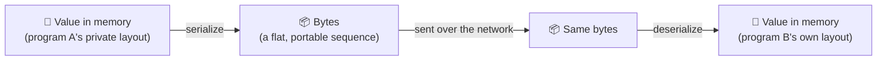

# Data Formats — JSON, XML, and Protocol Buffers

> **Phase:** APIs & Communication Deep Dives → **Topic:** 2 of 15 → **Read time:** ~50 minutes

---

## Before You Begin

**This document stands alone.** It assumes you have read nothing else — not the foundation series, not the topics before it. Everything is built here from zero: what serialization is, the two decisions every format makes, the three formats that dominate, and how a format lets you change your data's shape without breaking the programs already reading it.

Two consequences of that choice:

- **Terms get defined where they're used** — serialization, schema, text vs binary, field numbers, backward and forward compatibility. Skim past what you already know.
- **Neighbouring topics are named, not taught.** The RPC framework built on Protocol Buffers (gRPC), the styles that carry these formats (REST, GraphQL), and contract-level API versioning each have their own full treatment later in this phase. This document is about the formats themselves — the bytes on the wire.

Data formats are part of the APIs concept in the **Top 30 Must-Know Concepts** foundation series. This is the deep-dive on the specific question of how values become bytes.

Here is the question the document answers:

> **Two programs share no memory. One has a value — a number, a name, a nested object — and the other needs it. How does that value cross the gap, and why is "just use JSON" a decision with consequences most people never notice they made?**

Here's the trap it disarms. The data format feels like a settled, low-stakes choice — everyone uses JSON, you send it, it works, there's nothing to think about. That comfort hides that the format quietly decides four things that matter enormously later: whether you can read your own traffic when debugging, how many bytes every request costs, how much CPU is burned parsing them, and whether adding a field tomorrow breaks the clients you shipped today. None of those are visible on a good day. All of them arrive on a bad one.

> **The mindset shift:** stop asking *"which format is best?"* — there is no best — and start asking **"text or binary, schema or schemaless, for this data, read by whom, at what volume?"** Every format is a fixed set of answers to those two questions, and the answers that are perfect for a public API read by strangers are the wrong ones for a million-times-a-second internal call. The format isn't a default to inherit. It's a position on two axes, chosen — ideally on purpose — to fit who reads the bytes and how many of them there are.

---

## Table of Contents

1. [Serialization — The Problem Every Format Solves](#1-serialization--the-problem-every-format-solves)
2. [The First Axis — Text vs Binary](#2-the-first-axis--text-vs-binary)
3. [The Second Axis — Schema vs Schemaless](#3-the-second-axis--schema-vs-schemaless)
4. [JSON — Readable, Schemaless, Everywhere](#4-json--readable-schemaless-everywhere)
5. [XML — The Heritage Format](#5-xml--the-heritage-format)
6. [Protocol Buffers — Compact, Binary, Contract-First](#6-protocol-buffers--compact-binary-contract-first)
7. [Schema Evolution — Changing the Shape Without Breaking Readers](#7-schema-evolution--changing-the-shape-without-breaking-readers)
8. [Size and Speed — What the Wire Actually Costs](#8-size-and-speed--what-the-wire-actually-costs)
9. [Choosing — Match the Format to the Reader](#9-choosing--match-the-format-to-the-reader)
10. [Putting It All Together — One Payload, Three Formats, Three Outcomes](#10-putting-it-all-together--one-payload-three-formats-three-outcomes)
11. [Final Recap](#11-final-recap)

---

## 1. Serialization — The Problem Every Format Solves

Start with a value living inside a running program:

```
user = { name: "Ada", age: 36, admin: true }
```

Inside that program, `user` isn't really text. It's a structure in memory — bytes laid out in a way that only makes sense to *this* process: pointers to other locations, type tags the runtime understands, an arrangement the language chose. Another program, even an identical copy running next to it, cannot read those bytes. They mean nothing outside the process that made them.

So when one program needs to send `user` to another, the in-memory form is useless. It has to be turned into something both sides can agree on: a flat, self-contained sequence of bytes that means the same thing everywhere.

> **Serialization is turning an in-memory value into a byte sequence that can be stored or transmitted. Deserialization is turning it back into an in-memory value on the other side.**



Every data format is a specific, agreed-upon answer to one question: *what does that byte sequence look like?* JSON is one answer, XML another, Protocol Buffers a third. They all solve serialization; they just make different choices about how.

### The Agreement Is the Whole Thing

The byte sequence is worthless unless both sides interpret it identically. Serialization only works because the writer and the reader **agree in advance** on the rules — which bytes mean "a number starts here," how text is delimited, how nesting is represented. A format *is* that agreement, written down and implemented on both ends.

This is why you can't mix formats: bytes written as JSON are gibberish to an XML parser, not because the data is different but because the reader is applying the wrong rules. The format is a shared decoding key, and both sides must hold the same one.

### Fidelity — What Survives the Round Trip

The subtle problem in serialization is **fidelity**: does the value that comes out the far side mean exactly what went in? It often doesn't, and the gaps are quiet.

- A value might be a precise integer in memory and come back as a floating-point approximation, because the format didn't distinguish them.
- A date might go in as a real date type and arrive as a string, because the format has no date type — leaving the receiver to re-parse it and hope they guess the format right.
- A very large number might silently lose precision because the format's numeric type can't hold it.

None of these are network failures; the bytes arrive perfectly. The loss happens in translation, because the format couldn't represent the distinction the sender cared about. How faithfully a format preserves the *types and precision* of the original value is one of the real ways formats differ — and it's invisible until a rounding error shows up in someone's balance.

> 💡 **Key Insight**
>
> A value in memory is private to the process that holds it — its layout means nothing anywhere else — so crossing the gap between two programs *always* requires **serialization** into a byte sequence both sides decode by the same agreed rules. Every format is one such agreement, and they differ not only in size and readability but in **fidelity**: what types and precision survive the round trip. The bytes arriving intact is not the same as the value arriving intact.

### Quick Recap — Serialization

- A value in memory is in a **private layout** no other process can read; sending it requires **serialization** into a portable byte sequence, and **deserialization** back.
- A format is the **agreement** on what those bytes mean — both sides must apply the same rules, which is why formats can't be mixed.
- **Fidelity** is a real axis of difference: numbers, dates, and precision can be silently altered in translation even when every byte arrives.
- Every format in this document — JSON, XML, Protobuf — is a different answer to the one question serialization poses: *what does the byte sequence look like?*
