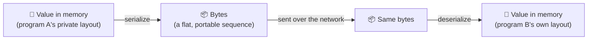
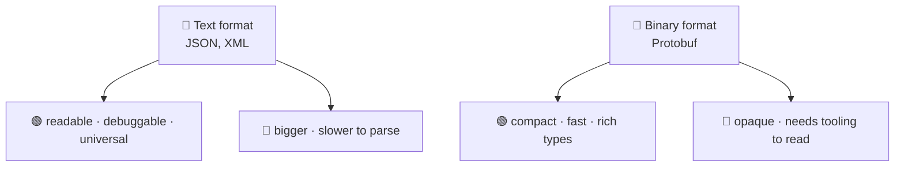
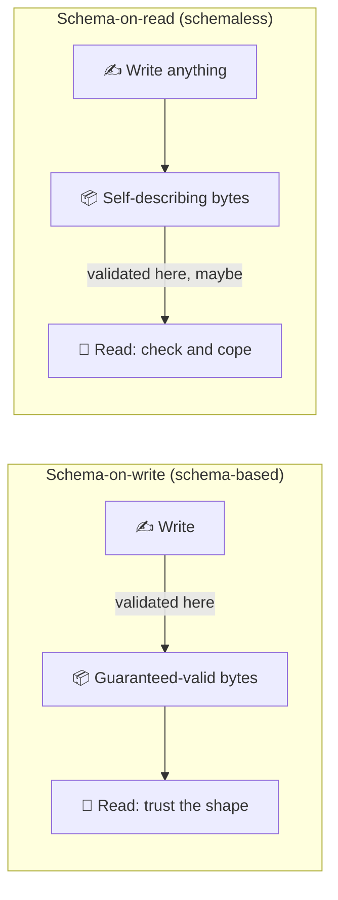

# Data Formats — JSON, XML, and Protocol Buffers

> **Phase:** APIs & Communication Deep Dives → **Topic:** 2 of 15 → **Read time:** ~50 minutes

---

## Before You Begin

**This document stands alone.** It assumes you have read nothing else — not the foundation series, not the topics before it. Everything is built here from zero: what serialization is, the two decisions every format makes, the three formats that dominate, and how a format lets you change your data's shape without breaking the programs already reading it.

Two consequences of that choice:

- **Terms get defined where they're used** — serialization, schema, text vs binary, field numbers, backward and forward compatibility. Skim past what you already know.
- **Neighbouring topics are named, not taught.** The RPC framework built on Protocol Buffers (gRPC), the styles that carry these formats (REST, GraphQL), and contract-level API versioning each have their own full treatment later in this phase. This document is about the formats themselves — the bytes on the wire.

Data formats are part of the APIs concept in the **Top 30 Must-Know Concepts** foundation series. This is the deep-dive on the specific question of how values become bytes.

Here is the question the document answers:

> **Two programs share no memory. One has a value — a number, a name, a nested object — and the other needs it. How does that value cross the gap, and why is "just use JSON" a decision with consequences most people never notice they made?**

Here's the trap it disarms. The data format feels like a settled, low-stakes choice — everyone uses JSON, you send it, it works, there's nothing to think about. That comfort hides that the format quietly decides four things that matter enormously later: whether you can read your own traffic when debugging, how many bytes every request costs, how much CPU is burned parsing them, and whether adding a field tomorrow breaks the clients you shipped today. None of those are visible on a good day. All of them arrive on a bad one.

> **The mindset shift:** stop asking *"which format is best?"* — there is no best — and start asking **"text or binary, schema or schemaless, for this data, read by whom, at what volume?"** Every format is a fixed set of answers to those two questions, and the answers that are perfect for a public API read by strangers are the wrong ones for a million-times-a-second internal call. The format isn't a default to inherit. It's a position on two axes, chosen — ideally on purpose — to fit who reads the bytes and how many of them there are.

---

## Table of Contents

1. [Serialization — The Problem Every Format Solves](#1-serialization--the-problem-every-format-solves)
2. [The First Axis — Text vs Binary](#2-the-first-axis--text-vs-binary)
3. [The Second Axis — Schema vs Schemaless](#3-the-second-axis--schema-vs-schemaless)
4. [JSON — Readable, Schemaless, Everywhere](#4-json--readable-schemaless-everywhere)
5. [XML — The Heritage Format](#5-xml--the-heritage-format)
6. [Protocol Buffers — Compact, Binary, Contract-First](#6-protocol-buffers--compact-binary-contract-first)
7. [Schema Evolution — Changing the Shape Without Breaking Readers](#7-schema-evolution--changing-the-shape-without-breaking-readers)
8. [Size and Speed — What the Wire Actually Costs](#8-size-and-speed--what-the-wire-actually-costs)
9. [Choosing — Match the Format to the Reader](#9-choosing--match-the-format-to-the-reader)
10. [Putting It All Together — One Payload, Three Formats, Three Outcomes](#10-putting-it-all-together--one-payload-three-formats-three-outcomes)
11. [Final Recap](#11-final-recap)

---

## 1. Serialization — The Problem Every Format Solves

Start with a value living inside a running program:

```
user = { name: "Ada", age: 36, admin: true }
```

Inside that program, `user` isn't really text. It's a structure in memory — bytes laid out in a way that only makes sense to *this* process: pointers to other locations, type tags the runtime understands, an arrangement the language chose. Another program, even an identical copy running next to it, cannot read those bytes. They mean nothing outside the process that made them.

So when one program needs to send `user` to another, the in-memory form is useless. It has to be turned into something both sides can agree on: a flat, self-contained sequence of bytes that means the same thing everywhere.

> **Serialization is turning an in-memory value into a byte sequence that can be stored or transmitted. Deserialization is turning it back into an in-memory value on the other side.**



Every data format is a specific, agreed-upon answer to one question: *what does that byte sequence look like?* JSON is one answer, XML another, Protocol Buffers a third. They all solve serialization; they just make different choices about how.

### The Agreement Is the Whole Thing

The byte sequence is worthless unless both sides interpret it identically. Serialization only works because the writer and the reader **agree in advance** on the rules — which bytes mean "a number starts here," how text is delimited, how nesting is represented. A format *is* that agreement, written down and implemented on both ends.

This is why you can't mix formats: bytes written as JSON are gibberish to an XML parser, not because the data is different but because the reader is applying the wrong rules. The format is a shared decoding key, and both sides must hold the same one.

### Fidelity — What Survives the Round Trip

The subtle problem in serialization is **fidelity**: does the value that comes out the far side mean exactly what went in? It often doesn't, and the gaps are quiet.

- A value might be a precise integer in memory and come back as a floating-point approximation, because the format didn't distinguish them.
- A date might go in as a real date type and arrive as a string, because the format has no date type — leaving the receiver to re-parse it and hope they guess the format right.
- A very large number might silently lose precision because the format's numeric type can't hold it.

None of these are network failures; the bytes arrive perfectly. The loss happens in translation, because the format couldn't represent the distinction the sender cared about. How faithfully a format preserves the *types and precision* of the original value is one of the real ways formats differ — and it's invisible until a rounding error shows up in someone's balance.

> 💡 **Key Insight**
>
> A value in memory is private to the process that holds it — its layout means nothing anywhere else — so crossing the gap between two programs *always* requires **serialization** into a byte sequence both sides decode by the same agreed rules. Every format is one such agreement, and they differ not only in size and readability but in **fidelity**: what types and precision survive the round trip. The bytes arriving intact is not the same as the value arriving intact.

### Quick Recap — Serialization

- A value in memory is in a **private layout** no other process can read; sending it requires **serialization** into a portable byte sequence, and **deserialization** back.
- A format is the **agreement** on what those bytes mean — both sides must apply the same rules, which is why formats can't be mixed.
- **Fidelity** is a real axis of difference: numbers, dates, and precision can be silently altered in translation even when every byte arrives.
- Every format in this document — JSON, XML, Protobuf — is a different answer to the one question serialization poses: *what does the byte sequence look like?*

---

## 2. The First Axis — Text vs Binary

Formats vary in a hundred small ways, but two decisions explain almost everything that matters, and the rest of this document is organized around them. This section is the first: **is the byte sequence text a human can read, or binary tuned for a machine?**

### What "Text" and "Binary" Actually Mean

A **text format** encodes everything as human-readable characters. The number 36 is written as the characters `3` and `6`; `true` is written as the letters `t-r-u-e`. Open the bytes in any text editor and you see something you can read.

A **binary format** encodes values directly as bytes with no readable representation. The number 36 might be a single byte with value `36`; a boolean might be one bit. Open the bytes in a text editor and you see garbage — because they were never meant for your eyes, only for a program that knows the layout.

```
Text (JSON):    {"age":36}          ← 10 characters you can read
Binary (proto): 08 24               ← 2 bytes: "field 1 = 36", unreadable
```

Both encode "age is 36." One is legible and ten bytes; the other is opaque and two.

### What Text Buys You

Readability is not a cosmetic nicety — it has real operational weight:

- **You can debug by looking.** Print the payload, read it, see the bug. No special tooling.
- **Anything can produce and consume it.** A text format works from any language, any shell, `curl`, a log grep, a copy-paste into a ticket.
- **It's self-explanatory.** A new engineer sees `{"status":"shipped"}` and understands it instantly.

The cost is everywhere and constant: text is **bigger** (the number 1000000 is 7 characters instead of a few bytes) and **slower to parse** (the reader must scan characters, find delimiters, and convert `"36"` the text into 36 the number, every field, every time).

### What Binary Buys You

Binary inverts every term:

- **Smaller** — values are stored directly, no characters, no quotes, no whitespace. Often several times fewer bytes for the same data.
- **Faster to parse** — the reader copies bytes into values rather than scanning and converting. No delimiter hunting, no text-to-number parsing.
- **Richer types natively** — a binary format can distinguish an integer from a float from a raw blob at the byte level, without the text-format tricks.

The cost is the mirror image: you **can't read it**, so debugging needs tooling that knows the format, and you usually need the schema (§3) even to decode it at all.



### The Trade Is Real and Has No Winner

Notice these are the *same* properties traded in opposite directions. Text spends bytes and CPU to buy human access; binary spends human access to buy bytes and CPU. Neither is better in the abstract — the right choice depends entirely on **who reads the bytes and how many there are**, which is exactly §9's question.

A public API called occasionally by developers integrating against it lives or dies on debuggability — text wins easily, and the size cost is noise. A service serializing the same structure a million times a second between machines that never need a human to read it — binary's size and parse savings are the difference between one server and ten, and the lost readability costs nothing because nobody was going to read it anyway. Same trade, opposite answers, because the reader and the volume differ.

> 💡 **Key Insight**
>
> Text versus binary is the same set of properties — size, parse speed, readability — sold in opposite directions: text pays bytes and CPU for human access; binary sells human access for bytes and CPU. There's no universal winner, only a fit to circumstance. The question that resolves it is never "which is better" but **"is a human going to read these bytes, and how many of them are there?"** — and that answer flips completely between a public API and a high-volume internal hop.

### Quick Recap — Text vs Binary

- **Text formats** encode values as readable characters; **binary formats** encode them directly as bytes with no readable form.
- Text buys **debuggability and universality** at the cost of **size and parse speed**; binary buys **size and speed** at the cost of **readability**.
- They are the same properties traded in opposite directions — **neither wins in the abstract**.
- The decider is **who reads the bytes and at what volume** — noise for a public API, decisive for a high-volume internal hop (§9).

---

## 3. The Second Axis — Schema vs Schemaless

The second decision is independent of the first and just as consequential: **is the shape of the data agreed on in advance, or discovered as you read it?**

A **schema** is a formal, separate definition of what the data must look like — which fields exist, what type each is, which are required. A format is **schema-based** when that definition exists apart from the data and both sides use it. A format is **schemaless** when it doesn't — the data carries its own structure inline, and you learn the shape only by parsing it.

### Schema-on-Write vs Schema-on-Read

The cleanest way to see the difference is *when* the shape is enforced:

- **Schema-on-write** (schema-based): the shape is checked when the data is *created*. You can't serialize a value that violates the schema — the wrong type or a missing required field fails up front, before anything is sent. The data that goes on the wire is guaranteed to match the agreed shape.
- **Schema-on-read** (schemaless): the shape is whatever the reader finds when parsing. Nothing was enforced at write time; the receiver takes what arrives and copes — checking fields exist, guessing types, handling surprises. Validity is the reader's problem, discovered at read time.



### What Each Buys

The trade parallels §2's but along a different dimension — **safety and self-description vs flexibility and independence**:

| | Schema-based | Schemaless |
|---|---|---|
| Shape enforced | At write time, guaranteed | At read time, if at all |
| The data is | Terse — field names may not even be in the bytes | Self-describing — names travel with values |
| Changing the shape | Coordinated through the schema (§7) | Just start sending the new field |
| A wrong/missing field | Caught early, by the format | Found late, by your code (or not) |
| You need the schema to | Decode the data at all (often) | Nothing — the data explains itself |

Schema-based formats catch mistakes early and can be extremely compact, because if both sides already know the shape, the bytes don't need to carry field names — position or a numeric tag is enough. The cost is coordination: there's a separate definition to manage, share, and keep in sync, and you generally can't read the data without it.

Schemaless formats are flexible and self-contained: the data describes itself, so you can send new fields without anyone agreeing first, and you can read it with nothing but the bytes. The cost is that nothing protects you — a typo'd field name, a string where a number was expected, a missing value all sail through serialization and become the reader's problem at runtime.

### The Two Axes Make the Map

Text/binary (§2) and schema/schemaless are independent, so together they place every format on a grid — and that grid is the whole point of this document:

|  | **Schemaless** | **Schema-based** |
|---|---|---|
| **Text** | JSON | XML (with XSD) |
| **Binary** | *(rare)* | Protocol Buffers |

JSON is text and schemaless — readable and flexible, unsafe and verbose. XML is text and can be schema-based — readable and validated, but heavy. Protocol Buffers is binary and schema-based — compact and safe, but opaque and coordination-heavy. Three corners of the grid, three different sets of answers, and the sections that follow are each corner in turn.

> 💡 **Key Insight**
>
> The second axis is *when the shape is enforced*: **schema-on-write** guarantees valid, terse data at the cost of a shared definition you must coordinate; **schema-on-read** gives flexibility and self-describing data at the cost of catching every mistake late, in your own code. Combined with text-vs-binary, these two independent axes place JSON, XML, and Protobuf at three different corners of a grid — which is why they aren't ranked but *positioned*, and why the right one is wherever your needs land on the two axes.

### Quick Recap — Schema vs Schemaless

- A **schema** is a separate, formal definition of the data's shape; **schema-based** formats use one, **schemaless** formats carry structure inline.
- **Schema-on-write** validates when data is created (guaranteed shape, needs coordination); **schema-on-read** leaves validity to the receiver (flexible, mistakes found late).
- Schema-based data can be **terse** (no field names needed on the wire) but usually **needs the schema to decode**; schemaless data is **self-describing** but unprotected.
- Combined with **text vs binary**, this axis maps the three formats to three grid corners: **JSON** (text/schemaless), **XML** (text/schema), **Protobuf** (binary/schema).

---

## 4. JSON — Readable, Schemaless, Everywhere

JSON sits at the text-and-schemaless corner (§2, §3), and it is the default format of the modern web by an enormous margin. Understanding *why* it won, and what that win costs, is the point of this section.

Here is the value from §1, as JSON:

```json
{
  "name": "Ada",
  "age": 36,
  "admin": true,
  "roles": ["dev", "ops"]
}
```

You can read it without knowing anything about JSON. That legibility is most of its appeal.

### Why It Took Over

JSON's dominance isn't an accident of fashion — it's a stack of advantages that compound:

- **It's readable and self-describing.** Field names travel with the data, so the payload explains itself (§3). Debugging is looking.
- **It maps onto how programmers already think.** Objects (key–value pairs) and arrays (ordered lists) are the two structures every language already has, so JSON feels native everywhere.
- **It's native to the browser.** Web front-ends are JavaScript, JSON *is* JavaScript object notation, and that made it the frictionless choice for web APIs — which is where most public APIs live.
- **It's simple.** The entire specification is tiny. There's very little to learn, misimplement, or argue about.

The combination — readable, universal, browser-native, dead simple — is why "we'll use JSON" is the default that needs no defending for a public web API.

### What Simplicity Costs

Every one of JSON's strengths has a matching cost, and they're the reasons you'd ever leave it:

- **It's verbose.** Field names repeat in *every* object — send a thousand users and the strings `"name"`, `"age"`, `"admin"` ship a thousand times each. Text encoding (§2) adds its overhead on top.
- **It's schemaless by default.** Nothing enforces shape (§3). A misspelled field, a missing value, a string where you expected a number — all valid JSON, all discovered at read time by your code. (There are add-on schema languages, but they're optional bolt-ons, not part of JSON itself.)
- **Its type system is thin, and that bites.** JSON has objects, arrays, strings, one number type, booleans, and null. That's it. The consequences are real:
  - **No integer/float distinction** — one `number` type, and large integers can silently lose precision when a parser treats them as floating-point. Identifiers and money are the classic casualties.
  - **No date type** — dates travel as strings, and the sender and receiver must agree on the string format out-of-band or one of them guesses wrong.
  - **No raw-bytes type** — binary data has to be encoded into text (inflating it), because JSON can only carry characters.

These are §1's fidelity problem made concrete: the bytes arrive, but "a big integer" or "a date" may not survive as what it was.

> ⚠️ **JSON's forgiving, schemaless nature is a benefit at small scale and a liability at large scale.** When a few developers integrate against a readable API, "just send the fields" is a feature — flexible, fast to build, easy to debug. When hundreds of services exchange JSON at volume, the absence of an enforced schema means shape mismatches are found in production instead of at build time, the precision traps surface as corrupted IDs and money, and the verbosity becomes a real bandwidth and CPU bill (§8). Nothing about JSON breaks as you grow; it just quietly stops being free.

### Where JSON Is Right

For a **public, web-facing API** read by developers you'll never meet, JSON is close to unbeatable: its readability is exactly the property that matters most (§9), its universality means every caller can consume it, and the size cost is usually noise on a human-triggered request. The rule of thumb worth carrying: JSON's weaknesses are all about *scale and strictness*, so it's the right default precisely where scale is modest and flexibility helps — which describes a large share of all APIs.

> 💡 **Key Insight**
>
> JSON won because *readable, universal, browser-native, and simple* is an unbeatable combination for the public web — and every one of those strengths is also its ceiling. Simple means a thin type system that mangles big integers and has no dates; schemaless means shape errors surface in production; text means verbose. None of it matters at small scale, and all of it matters at large scale, which is why JSON is simultaneously the correct default for most APIs and the thing high-volume internal systems eventually move off of.

### Quick Recap — JSON

- JSON is **text and schemaless** — readable, self-describing, and the default of the web.
- It won on **readability, a native fit to objects/arrays, browser support, and simplicity**.
- Those strengths cost **verbosity, no enforced schema, and a thin type system** — no int/float distinction, no date type, no raw bytes — which surface as precision bugs and late-caught shape errors.
- It's the right default where **scale is modest and flexibility helps** (public web APIs); its weaknesses are all about scale and strictness (§8, §9).

---

## 5. XML — The Heritage Format

Before JSON, the default was **XML** — text, and capable of being rigorously schema-based (§3). It's easy to dismiss as obsolete, but that misreads it: XML is a different set of tradeoffs that were dominant for good reasons and still fit some niches. Understanding it sharpens the axes, because XML is text like JSON but sits on the *opposite* end of the schema axis.

The same value, as XML:

```xml
<user>
  <name>Ada</name>
  <age>36</age>
  <admin>true</admin>
  <roles>
    <role>dev</role>
    <role>ops</role>
  </roles>
</user>
```

Readable, like JSON — and visibly heavier, every field wrapped in an opening and closing tag.

### What XML Got Right

XML's capabilities were genuinely ahead of what replaced it, and they're why it anchored enterprise systems for two decades:

- **Real schemas.** XML has a mature schema language (XSD) that defines exactly what a document must contain — types, required fields, allowed values, nesting rules — and validates a document against it (§3's schema-on-write, done thoroughly). This was serious contract enforcement long before JSON had any.
- **Namespaces.** XML can combine vocabularies from different sources in one document without name collisions — a real need in large, composed enterprise data.
- **Mixed content.** It represents text-with-markup naturally (a paragraph with emphasis inside it), which is why document formats and publishing systems use it.
- **Mature tooling.** Decades of validators, transformers (XSLT), and query languages (XPath) grew up around it.

For a large organization needing strict, validated, richly-typed contracts across many teams, XML offered in the 2000s what nothing else did.

### Why It Faded

XML lost the web not because it was wrong but because it was **heavy**, and the web valued light:

- **Verbosity.** Every element is wrapped in `<tag>...</tag>`, and closing tags repeat the name. The example above is markedly larger than the JSON for the same data, and most of the extra bytes are structure, not content.
- **Complexity.** The full XML ecosystem — namespaces, schemas, transformations, entities, processing instructions — is large and intricate. Powerful for those who need it, heavy overhead for those who don't, and most APIs don't.
- **Awkward fit to code.** XML documents don't map cleanly onto the objects and arrays programming languages use, so working with XML often means a translation layer that JSON simply doesn't need.
- **The browser chose JSON.** As the web moved to JavaScript front-ends, JSON's native fit (§4) made it the obvious choice, and the default shifted with the web's center of gravity.

The pattern: XML's power *is* its weight, and when the web wanted the opposite of weight, a lighter format won the mainstream even though it gave up real capabilities.

### Where XML Still Lives — Legitimately

XML isn't a museum piece; it's entrenched where its strengths still pay:

- **Enterprise, banking, government, healthcare** — systems built when XML was the standard, where the cost of rewriting working integrations dwarfs any benefit, and where XSD's strict validation is genuinely valued.
- **Document formats** — office documents and publishing pipelines, where mixed content and mature transformation tooling matter.
- **SOAP-based services** — an older XML-based service protocol still present in those same enterprise niches.

Meeting XML in a new system is unusual; meeting it in an existing one is routine, and "it's old" is not the same as "it's wrong for what it does."

> 💡 **Key Insight**
>
> XML is the proof that a format is a *set of tradeoffs*, not a point on a quality line. It sits at text-and-schema-based (§3) — the same text axis as JSON, the opposite schema axis — and everything about it follows: strict validation, namespaces, and rich tooling on the plus side; verbosity and complexity on the minus. It didn't lose because it was bad; it lost the *web* because the web wanted lightness and XML's power is weight. Where strict contracts and mature tooling outweigh bytes, it's still the right answer.

### Quick Recap — XML

- XML is **text and schema-capable** — the same text axis as JSON, the opposite end of the schema axis.
- Its strengths are real: **rigorous schemas (XSD), namespaces, mixed content, and mature tooling** — serious contract enforcement before JSON had any.
- It faded on the web for being **verbose and complex** and a poor fit to code, as the browser pulled the default toward JSON.
- It remains correct in **enterprise, government, document, and SOAP** systems where strict validation and entrenchment outweigh its weight — old is not the same as wrong.
