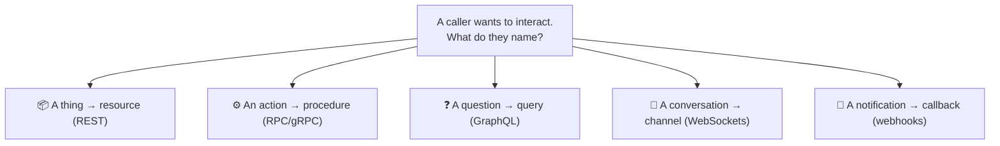
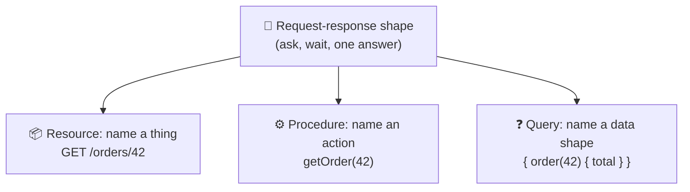
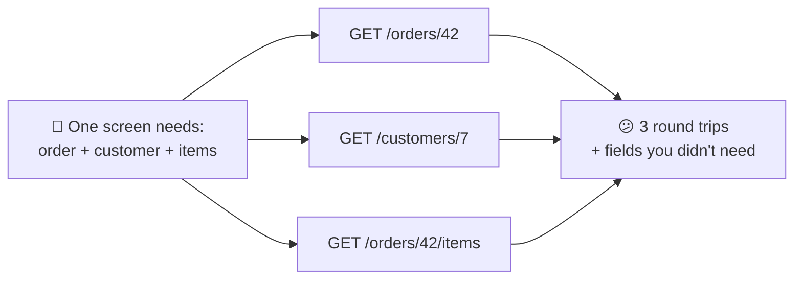
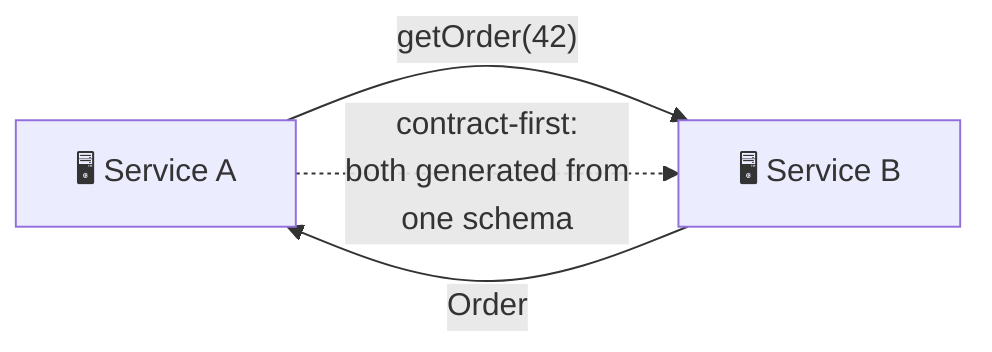
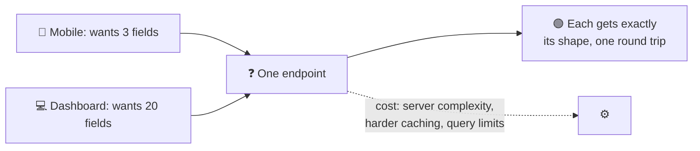
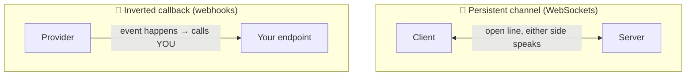
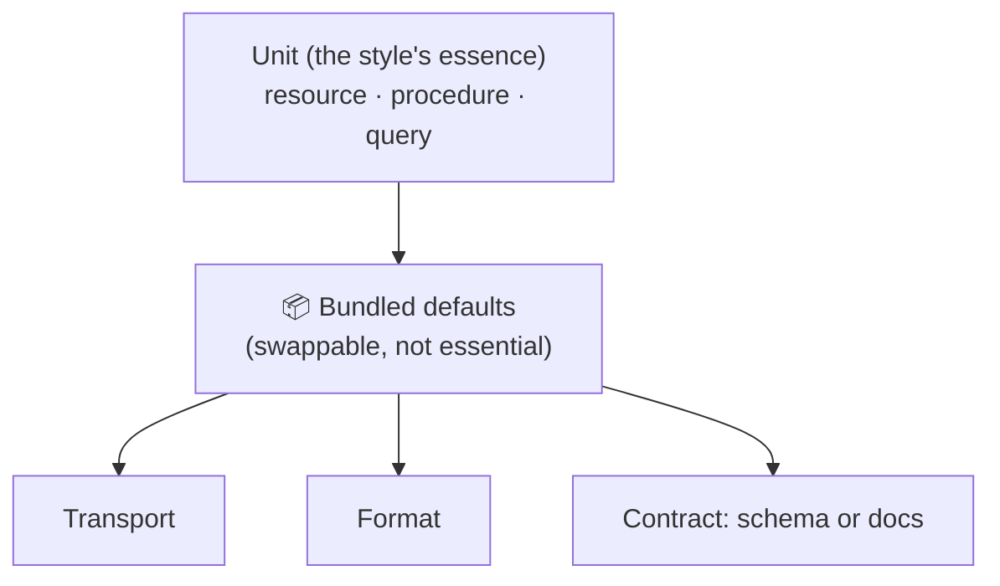
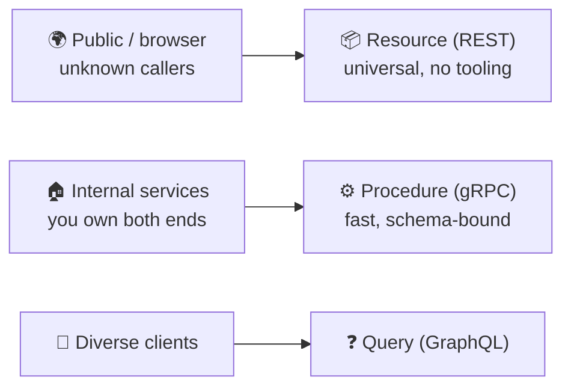
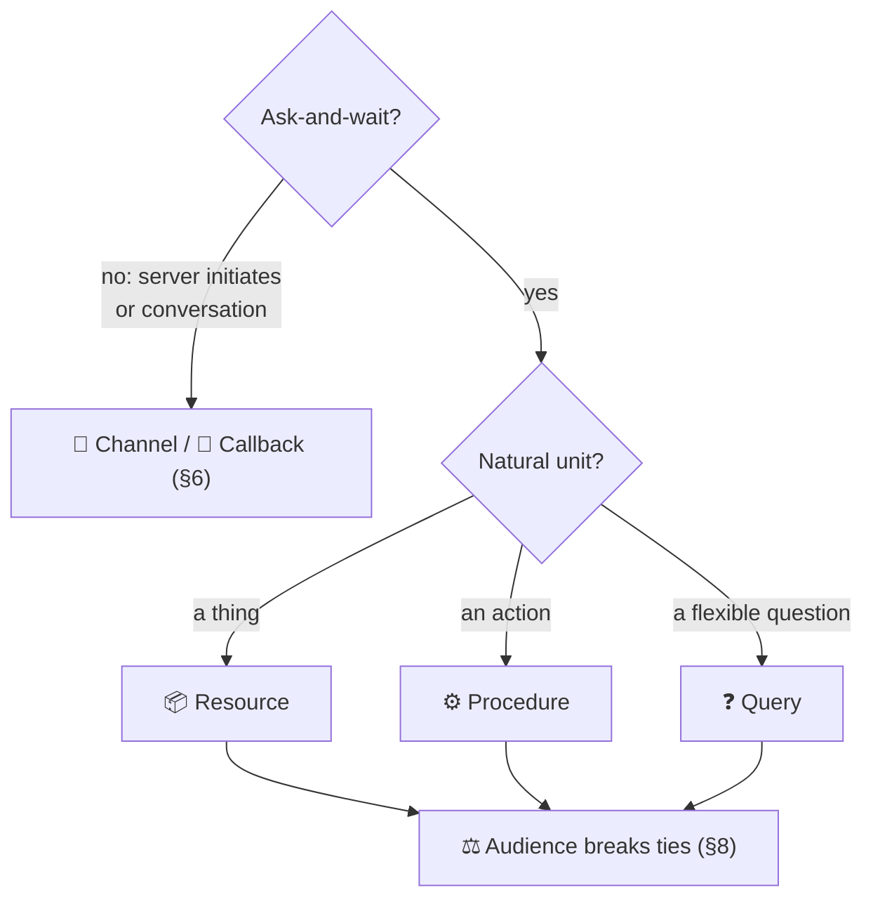
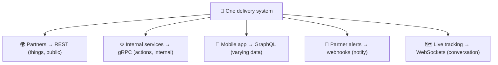

# API Architectural Styles

> **Phase:** APIs & Communication Deep Dives → **Topic:** 3 of 15 → **Read time:** ~50 minutes

---

## Before You Begin

**This document stands alone.** It assumes you have read nothing else — not the foundation series, not the topics before it. Everything is built here from zero: what an architectural style is, the small set of styles that dominate real systems, what each one fundamentally organizes an API *around*, and how to choose between them.

Two consequences of that choice:

- **Terms get defined where they're used** — style, resource, procedure, query, persistent channel, callback. Skim past what you already know.
- **Neighbouring topics are named, not taught.** REST design, the REST-versus-GraphQL comparison, GraphQL internals, gRPC, WebSockets, and webhooks each have their own full treatment later in this phase. This document is the **map** — enough of each style to choose a direction, and a pointer to the topic that goes deep. It deliberately teaches none of them in full.

API styles are part of the APIs concept in the **Top 30 Must-Know Concepts** foundation series. This is the deep-dive on the question that comes *before* picking any specific technology.

Here is the question the document answers:

> **REST, gRPC, GraphQL, WebSockets, webhooks — these get argued about like sports teams. Underneath the tribalism, what actually distinguishes them, and how would you choose without already having a favorite?**

Here's the trap it disarms. Architectural style is usually inherited, not chosen. A team is "a REST shop" or "a gRPC shop," and every new API gets the house style regardless of what it's for. That works until it doesn't — a REST API contorted into carrying real-time updates, a gRPC service that a browser can't call, a resource model bent around an operation that was never a resource. The style was picked by habit, and the mismatch shows up as friction in every later decision.

The styles aren't competing products where one wins. They're different answers to a single design question, and the answer that's obviously right for one interaction is obviously wrong for another.

> **The mindset shift:** stop asking *"which API style is best?"* and start asking **"what is the natural unit of this interaction?"** Every style is organized around a different unit — a *thing* you act on, an *action* you invoke, a *question* you pose, a *conversation* you hold open, a *notification* you send. Name the unit the interaction actually wants, and the style stops being a matter of taste and becomes a matter of fit. Pick the unit wrong and no amount of good implementation rescues it; pick it right and the style falls out on its own.

---

## Table of Contents

1. [What a "Style" Actually Is](#1-what-a-style-actually-is)
2. [The Request-Response Family — One Shape, Three Paradigms](#2-the-request-response-family--one-shape-three-paradigms)
3. [Resource-Oriented — Acting on Things](#3-resource-oriented--acting-on-things)
4. [Procedure-Oriented — Calling Functions](#4-procedure-oriented--calling-functions)
5. [Query-Oriented — Describing What You Want](#5-query-oriented--describing-what-you-want)
6. [Beyond Request-Response — Persistent and Inverted](#6-beyond-request-response--persistent-and-inverted)
7. [The Orthogonal Choices — Transport, Format, Contract](#7-the-orthogonal-choices--transport-format-contract)
8. [Public vs Internal — The Audience Bends the Choice](#8-public-vs-internal--the-audience-bends-the-choice)
9. [Choosing — Match the Style to the Unit](#9-choosing--match-the-style-to-the-unit)
10. [Putting It All Together — One System, Several Styles](#10-putting-it-all-together--one-system-several-styles)
11. [Final Recap](#11-final-recap)

---

## 1. What a "Style" Actually Is

Before comparing styles, it helps to be precise about what kind of thing a style *is* — because it's often confused with two neighbouring decisions that are genuinely separate.

> **An architectural style is a consistent set of conventions for organizing how an API is called: what you address, how you ask, and what an interaction is shaped like.**

REST is a style. So is the RPC approach gRPC embodies. So is GraphQL. Each is a *pattern* for structuring interactions, not a single product — there are many REST APIs, all sharing the same conventions.

### Three Layers That Get Confused

A single API involves three decisions that people routinely blur into one word, and separating them is most of the clarity this document offers:

| Layer | The question it answers | Example choices |
|---|---|---|
| **Shape** | Who initiates, and does the caller wait? | ask-and-wait; stream; server-initiated; send-and-forget |
| **Style** | How is the interaction organized? | resource; procedure; query; channel; callback |
| **Format** | How are the values encoded as bytes? | JSON; XML; a compact binary format |

**Shape** is the coarsest: does the client ask and wait for one answer, or does data stream, or does the server initiate, or does the caller fire a message expecting nothing back? Most APIs are ask-and-wait (request-response), and §2–§5 live entirely inside that shape; §6 covers the ones that don't.

**Format** is the finest and is genuinely independent — the same style can carry JSON or binary, and choosing the encoding is its own subject (a separate topic in this phase). A style bundles a *default* format, which is why people conflate them ("REST is JSON") — but that's convention, not definition (§7).

**Style** sits in the middle, and it's this document's subject. Given that you're going to ask and wait, *how do you organize the asking?* That's where REST, RPC, and GraphQL diverge, and they diverge on one thing.

### The One Question a Style Answers

Strip away the tooling and the arguments, and every style is a different answer to a single question:

> **What is the unit of interaction — the fundamental thing a caller names when they interact with the API?**

The candidates are surprisingly few:

- A **resource** — a *thing*. You act on nouns: fetch this, update that, delete the other.
- A **procedure** — an *action*. You invoke verbs: do this, calculate that, run the other.
- A **query** — a *question*. You describe the exact data you want and get precisely that shape back.
- A **channel** — a *conversation*. You hold a connection open and both sides speak over time.
- A **callback** — a *notification*. You register interest, and the other side calls you when something happens.



Everything else about a style — its URLs or lack of them, its verbs, its tooling, its failure modes — follows from which unit it chose. That's why the unit is the right lens: it's the root decision, and the rest are consequences.

> 💡 **Key Insight**
>
> "Style" is one of three separable layers — **shape** (who initiates), **style** (how the interaction is organized), and **format** (how bytes are encoded) — and only the middle one is what REST, gRPC, and GraphQL actually differ on. Each is a different answer to *what is the unit of interaction*: a thing, an action, a question, a conversation, or a notification. Get in the habit of naming that unit first, because it's the decision every other property of the API inherits from.

### Quick Recap — What a Style Is

- A **style** is a consistent set of conventions for organizing API interactions — a pattern, not a product.
- It's distinct from **shape** (who initiates, does the caller wait) and **format** (how values become bytes); conflating the three is the root of most style confusion.
- Every style answers one question: **what is the unit of interaction** — a resource, a procedure, a query, a channel, or a callback.
- Everything else about a style **follows from its chosen unit**, which is why naming the unit is the first and most decisive step.

---

## 2. The Request-Response Family — One Shape, Three Paradigms

Most APIs you'll ever build or call share the same shape (§1): the client asks, waits, and gets one answer back. **Request-response** — ask-and-wait — is the default interaction of the web, and it's where three of the five units from §1 live. Before looking at the styles that break this shape (§6), it's worth seeing that the request-response world is not one thing but three, and they differ on the unit.

### Same Shape, Different Unit

Every request-response API does the same dance: one request out, one response back, then the exchange is over. What changes between styles is *what the request names* — and there are three answers, each a full paradigm:

| Paradigm | The unit | The request essentially says | Exemplar |
|---|---|---|---|
| **Resource-oriented** | A thing (noun) | "Here's a thing; do a standard action to it" | REST |
| **Procedure-oriented** | An action (verb) | "Run this specific operation with these arguments" | RPC / gRPC |
| **Query-oriented** | A question | "Here's the exact shape of data I want; fill it in" | GraphQL |

All three ask and wait. All three can carry the same data. They feel different to use because they've made different choices about the *unit* — and that single difference cascades into how you address them, how they're cached, how they fail, and which problems they make easy or awkward.



Notice those three lines express nearly the same intent — *get order 42* — and each names something different: a resource path, a procedure call, a query for specific fields. That's the whole divergence in miniature, and §3–§5 take each in turn.

There's a historical throughline worth noticing too. The procedure paradigm is the *oldest* — remote-procedure-call systems predate the web, because "call a function on another machine" was the first thing anyone wanted. The resource paradigm rose with the web itself, trading raw call-efficiency for the web's uniformity and reach. The query paradigm is the most recent, born specifically from the pain of assembling rich mobile screens out of many resource calls. Each arrived to fix something about its predecessor, which is why they coexist rather than supersede: they're answers to different eras' dominant problem, and all three problems are still around.

### Why the Family Dominates

Request-response is the default for good reasons, and they're worth naming so the exceptions in §6 stand out by contrast:

- **It matches how most interactions actually work** — a client needs something, asks, and uses the answer. Fetching a page, submitting a form, loading a profile: all naturally ask-and-wait.
- **It's simple to reason about.** One request, one response, a clear success or failure. The mental model is small.
- **It rides the web's existing machinery.** The request-response model is what the web's foundational protocol already speaks, so this family gets caching, proxies, and tooling essentially for free.

Because it fits so much and costs so little, request-response is the right default — and the interesting question is usually *which of its three paradigms*, not whether to leave the family at all. You leave it only when the interaction genuinely isn't ask-and-wait (§6).

### The Divergence Is About Fit, Not Quality

The three paradigms are not three quality tiers with REST at the bottom and GraphQL at the top, or any other ranking. They're three shapes of the same conversation, each fitting some interactions naturally and others awkwardly. A system built around *things* (users, orders, products) fits resources. A system built around *actions* (transcode this, recalculate that) fits procedures. A client that needs wildly varying slices of a data graph fits queries. The next three sections are each paradigm's natural home and its signature failure — the two things you need to place it on the map.

> 💡 **Key Insight**
>
> The request-response family is one *shape* — ask and wait — split into three *paradigms* by what the request names: a **resource** (REST), a **procedure** (RPC/gRPC), or a **query** (GraphQL). They dominate because ask-and-wait fits most interactions and rides the web's existing machinery for free. So the common choice isn't "which style" in the abstract — it's "which of these three units fits what I'm modeling," and you only leave the family when the interaction genuinely isn't ask-and-wait (§6).

### Quick Recap — The Request-Response Family

- **Request-response** (ask-and-wait) is the dominant shape; three full paradigms live inside it, differing only on the **unit**.
- **Resource** (REST) names a thing, **procedure** (RPC/gRPC) names an action, **query** (GraphQL) names a data shape — often expressing the same intent three ways.
- The family dominates because ask-and-wait **fits most interactions** and reuses the web's caching, proxies, and tooling for free.
- The three are a matter of **fit, not quality** — each has a natural home (things / actions / varying data) and a signature failure, covered next (§3–§5).

---

## 3. Resource-Oriented — Acting on Things

The first and most common paradigm organizes the API around **resources** — things, named by nouns — and a small, fixed set of actions you can take on any of them. Its exemplar is **REST**, and it's the default style of the public web.

*This section teaches the paradigm — the mental model and its fit. How to actually design a resource API well — naming, relationships, status codes, the maturity levels — is a topic of its own later in this phase.*

### The Core Idea

Instead of inventing an operation for every need, you model your domain as a set of **resources** and reuse the *same* handful of actions on all of them:

```
GET    /orders/42      → read order 42
POST   /orders         → create an order
PUT    /orders/42      → replace order 42
DELETE /orders/42      → remove order 42
```

The verbs are fixed and universal; only the noun changes. Every resource — orders, users, products — is addressed and manipulated the same way. That uniformity is the paradigm's defining bet: *if every thing behaves like every other thing, the whole API becomes predictable once you've learned one corner of it.*

### What It Optimizes For

The resource model buys a cluster of advantages, most flowing from that uniformity:

- **Predictability.** Learn the pattern once and you can guess the rest — `/products/7` works like `/orders/42` because everything is a resource with the same verbs.
- **It rides the web's machinery.** Reads map cleanly to the web's native "fetch this thing" operation, so resource reads are **cacheable** by the existing infrastructure with no extra work — a large, free performance win.
- **Evolvability.** New resources are new nouns; they don't disturb existing ones. The API grows by addition.
- **Universality.** Every language and tool can call it with no special client, because it's just addressed reads and writes over the web's default protocol.

This combination is why resource-oriented is the default for public APIs (§8): it's familiar, needs no tooling, and caches for free.

### The Signature Failure

The paradigm's weakness is the mirror of its strength: when the thing you want *isn't* one resource with a standard action, the model strains.

- **Over-fetching** — a resource returns its whole representation, but the caller needed three fields. The extra bytes ship anyway.
- **Under-fetching and chattiness** — the caller needs an order, its customer, and its line items, which are three resources, so it makes three (or more) round trips. A screen assembled from many resources becomes many requests.
- **Actions that aren't things** — "transcode this video," "recalculate the forecast." Forcing an inherently verb-shaped operation into a noun-and-standard-action model produces awkward contortions, and it's the clearest sign you may be reaching for the wrong paradigm (§4).



That over/under-fetching problem is exactly what the query paradigm (§5) was invented to solve — and comparing the two directly is common enough to be its own topic later in this phase.

> 💡 **Key Insight**
>
> Resource-orientation bets everything on **uniformity**: model the world as things, act on them all with the same fixed verbs, and the API becomes predictable and rides the web's caching for free. That bet pays beautifully when your domain really is a set of things — and strains exactly where it isn't: complex multi-resource reads turn chatty, and operations that are inherently *actions* rather than *things* have to be contorted into the noun model. When you notice that contortion, it's not a sign you're doing REST wrong — it's a sign the interaction's unit might be a procedure, not a resource.

### Quick Recap — Resource-Oriented

- Organizes the API around **resources (nouns)** with a small, fixed set of universal actions — REST is the exemplar.
- Optimizes for **predictability, free caching, evolvability, and universality** — which is why it's the public-web default (§8).
- Its signature failures are **over/under-fetching** (chatty multi-resource reads) and **actions that aren't things** contorted into nouns.
- Design mechanics are a later topic; the over-fetching problem motivates the **query paradigm** (§5), and the action mismatch motivates the **procedure paradigm** (§4).

---

## 4. Procedure-Oriented — Calling Functions

The second paradigm organizes the API around **procedures** — actions, named by verbs — and makes calling a remote service feel like calling a local function. The approach is **RPC** (Remote Procedure Call), and its dominant modern exemplar is **gRPC**.

*This section teaches the paradigm. gRPC's specific mechanics — how it runs over its transport, how its binary contract works — are a topic of its own later in this phase.*

### The Core Idea

Where the resource paradigm asks "what *thing* am I acting on?", the procedure paradigm asks "what *action* am I invoking?" You expose named operations and call them with arguments, exactly as you'd call a function in your own code:

```
getOrder(42)
transcodeVideo(fileId, "1080p")
recalculateForecast(regionId)
```

There are no resource paths and no fixed universal verbs. Each operation is its own named action with its own arguments and return type. The mental model is deliberately the one every programmer already has: **call a function, get a result** — the function just happens to run on another machine.

### What It Optimizes For

The procedure model trades the resource paradigm's uniformity for directness and performance:

- **Natural fit for actions.** Operations that were awkward as resources (§3) — "transcode," "recalculate," "send" — are just functions here. The model matches the intent instead of contorting it.
- **A tight, explicit contract.** RPC systems are typically **contract-first**: you define the available procedures and their exact types in a schema, and both sides generate code from it. The caller gets a real function to call, checked at build time, not a URL to assemble by hand.
- **Performance.** The modern exemplar pairs this with a compact binary format and an efficient transport, making calls small and fast — which is why it shines for **high-volume internal service-to-service** traffic where every millisecond and byte is multiplied across enormous call counts. Concretely: at a large service that fields, say, a million internal calls a second, shaving a few hundred microseconds and a few hundred bytes off each call isn't a micro-optimization — it's the difference between a modest fleet and a large one, and it's felt directly in the latency budget of anything that fans out across many internal hops.

This combination — action-shaped, strongly-typed, fast — is why procedure-oriented APIs dominate *inside* systems, between services a single organization controls on both ends.

### The Signature Failure

The paradigm's costs are the flip side of its directness:

- **Tighter coupling.** Because the caller invokes specific named procedures generated from a shared contract, caller and service are bound more tightly than in the resource model. The convenience of "just call the function" comes with a firmer dependency on that function's exact shape.
- **Less free web machinery.** Calls that look like function invocations don't map onto the web's native "fetch this thing" operation, so the automatic caching that resource reads enjoy (§3) mostly doesn't apply — you're not addressing cacheable things, you're invoking actions.
- **Poor fit for the open web and browsers.** The efficient binary transports that make RPC fast are often not directly usable from a browser and demand that callers adopt the schema and generated tooling. That's fine when you own both ends and a burden when your callers are strangers (§8).
- **No uniform surface.** Every procedure is bespoke, so the "learn one corner, guess the rest" predictability of resources (§3) is weaker — the API is a catalogue of individual functions.



> 💡 **Key Insight**
>
> The procedure paradigm makes a remote call feel like a local function — the unit is an **action**, not a thing — which fits operation-centric work naturally and, with a binary contract and efficient transport, makes it fast enough for heavy internal traffic. The price is exactly what the resource paradigm bought: tighter coupling, little free caching, and poor reach to browsers and strangers. That's why the two paradigms sort so cleanly by audience — resources face outward to the open web, procedures face inward between services you control (§8).

### Quick Recap — Procedure-Oriented

- Organizes the API around **procedures (verbs)** — call a named action with arguments, like a local function. RPC is the approach; **gRPC** the modern exemplar.
- Optimizes for **action-shaped operations, a contract-first typed interface, and performance** — ideal for high-volume internal service-to-service calls.
- Its costs are **tighter coupling, little free web caching, and poor browser/stranger reach** — the mirror of the resource paradigm's strengths.
- gRPC's mechanics are a later topic; the audience split it implies (internal vs public) is developed in §8.

---

## 5. Query-Oriented — Describing What You Want

The third request-response paradigm organizes the API around a **query** — the caller describes the exact data it wants, and the server returns precisely that shape. Its exemplar is **GraphQL**, and it exists largely to solve the over- and under-fetching that the resource paradigm struggles with (§3).

*This section teaches the paradigm. GraphQL's internals — schema, resolvers, the N+1 problem — are a later topic, and the direct REST-versus-GraphQL comparison is its own topic too. Here it's placed on the map, not dissected.*

### The Core Idea

With resources, the server decides what each endpoint returns and the caller takes it or makes several calls (§3). The query paradigm inverts that: there's typically **one endpoint**, and the *caller* sends a description of exactly the fields it wants, however nested, across whatever related data — in a single request.

```
{
  order(id: 42) {
    total
    customer { name }
    items { name price }
  }
}
```

That one query asks for an order's total, its customer's name, and each line item's name and price — data that was three resources and three round trips in §3 — and gets back exactly those fields, nothing more, in one response shaped to match the request. The unit is neither a thing nor an action but a **question**: "give me this specific slice of the data graph."

### What It Optimizes For

The query model targets the resource paradigm's exact weaknesses:

- **No over-fetching.** The caller lists the fields it wants, so the response carries those and no others. The wasted bytes of §3 disappear.
- **No under-fetching.** Related data that would be many resource calls is assembled server-side and returned in one round trip. One request fills a whole screen.
- **Client independence.** Different clients — a mobile app, a web dashboard, a partner integration — each ask for the slice they need from the *same* API, without the server building a custom endpoint per client. This is the paradigm's strongest fit: **many clients with divergent, evolving data needs.**

For a product with varied front-ends over a rich, interconnected data model, this is a genuinely different capability, not a marginal improvement. The paradigm's own origin makes the point: it came out of the problem of rendering data-dense mobile screens, where a single view might need a dozen related pieces of data and the resource approach meant a dozen sequential round trips over a slow mobile connection — the collapse from *N requests* to *one* is the entire reason the paradigm exists.

### The Signature Failure

The flexibility the client gains becomes the server's burden, and that trade is the paradigm's whole character:

- **Server complexity moves up sharply.** The server must resolve arbitrary combinations of nested fields the client composes on the fly — far more involved than returning a fixed resource.
- **Caching is harder.** The resource paradigm cached for free because each URL named a fixed thing (§3). When every request is a unique query shape against one endpoint, the web's "cache this address" machinery no longer applies cleanly, and caching must be rebuilt at another layer.
- **Cost control becomes a real concern.** Because a client can request deeply nested, expensive data in one query, the server has to guard against queries that are accidentally or deliberately too costly — a class of problem the fixed-response paradigms simply don't have.



Whether that trade is worth it versus the resource paradigm is the most common real API debate — common enough that this curriculum gives the head-to-head its own dedicated topic. Here the point is only to place the query paradigm: it moves power and shape-decisions to the client, and moves complexity and cost-control to the server.

> 💡 **Key Insight**
>
> The query paradigm inverts who decides the response shape: the **client** describes the exact slice of the data graph it wants, killing the over- and under-fetching that resources suffer (§3) and letting many different clients share one API. The bill for that flexibility lands entirely on the server — more complexity, harder caching, and new query-cost defenses. It's the paradigm to reach for when you have **diverse clients with divergent data needs over a rich graph**, and overkill when you don't, because you'd take on all that server-side cost to solve a problem you didn't have.

### Quick Recap — Query-Oriented

- Organizes the API around a **query**: one endpoint, the client describes the exact data shape it wants, the server returns precisely that. GraphQL is the exemplar.
- Optimizes away **over- and under-fetching** (§3) and lets **many divergent clients** share one API — its strongest fit.
- The cost moves to the server: **more complexity, harder caching, and the need for query-cost limits**.
- Internals and the direct REST-vs-query comparison are later topics; here it's placed as the paradigm that **trades server simplicity for client flexibility**.

---

## 6. Beyond Request-Response — Persistent and Inverted

The three paradigms so far all share the ask-and-wait shape (§2): the client speaks first, the server answers, the exchange ends. Some interactions don't fit that shape at all, and no amount of resource, procedure, or query modeling fixes it — the mismatch is in the shape itself. Two styles break out of request-response in different directions.

*This section teaches why these styles exist and what their unit is. Their mechanics — connection handshakes, delivery guarantees, retries, security — are their own dedicated topics later in this phase.*

### When Ask-and-Wait Doesn't Fit

Request-response has a built-in assumption: the client knows when it wants something and asks. That breaks whenever the *server* is the one who knows something happened and the client needs to learn about it:

- A message arrives in a chat the user is viewing.
- A stock price ticks; a live dashboard must update.
- A long-running job finishes, minutes after it was started.
- A payment a partner is waiting on finally settles.

In pure request-response, the only way for a client to learn about a server-side event is to **poll** — ask over and over, "anything new? anything new?" — which is wasteful (most polls return nothing), laggy (the update waits for the next poll), and worse at scale (more clients means more empty polls). Polling is the tell that you've forced a server-initiated interaction into a client-initiated shape. Two styles fix it properly, by changing who can speak and when.

### Persistent Channel — Holding the Line Open

The first breaks the one-request-one-response rule by keeping the connection **open**. Instead of a fresh exchange per message, client and server establish a long-lived **channel** and then *either side* can send messages over it, any time, until it's closed.

The unit here is a **conversation**, not a transaction. Once the channel is up, the server can push a message the instant an event occurs, with no poll and no new connection — and the client can send too, making it genuinely bidirectional. This is the natural fit for chat, live feeds, collaborative editing, multiplayer state: anything where both sides talk continuously and latency matters. **WebSockets** is the dominant style here.

The cost is that a persistent connection is a different operational animal — the server now holds open state for every connected client, and a long-lived stateful connection is harder to scale and load-balance than a stateless request. That's why this style is reached for when real-time genuinely requires it, not by default.

### Inverted Callback — The Server Calls You

The second breaks a different assumption: that *you* are always the caller. With a **callback**, you register a destination once, and when the relevant event happens, the other system makes a request *to you*. The roles invert — the provider becomes the client, and your endpoint becomes the server.

The unit is a **notification**. It's how one system tells another "this happened" without the receiver polling — a payment provider notifying your backend that a charge settled, a code host notifying a build system that code was pushed. **Webhooks** are the exemplar. Crucially, this is server-to-server: it works when the receiver has a reachable address to be called back at, which is why it's common between backends and unnatural for browsers (which aren't callable servers).



Both styles answer the same underlying need — the server has something to say and shouldn't wait to be asked — in two different ways: hold a live connection open (channel), or call back on an event (callback). Which fits depends on whether the interaction is a continuous conversation or discrete notifications, and whether a live connection is warranted.

> 💡 **Key Insight**
>
> When the *server* is the one who knows an event happened, request-response can only fake it by polling — wasteful, laggy, and worse at scale. Two styles fix the shape itself: a **persistent channel** (WebSockets) holds a live bidirectional line open for continuous conversation, and an **inverted callback** (webhooks) has the provider call *you* when an event occurs. Reaching for either is a signal that you've left the ask-and-wait family entirely — and the tell you needed to is almost always that you found yourself polling.

### Quick Recap — Beyond Request-Response

- Request-response can't express **server-initiated** events except by **polling**, which is wasteful, laggy, and scales badly — the sign you've outgrown the shape.
- A **persistent channel** (WebSockets) keeps a long-lived, bidirectional connection open; the unit is a **conversation** — chat, live feeds, collaboration.
- An **inverted callback** (webhooks) has the provider call *your* endpoint on an event; the unit is a **notification**, and it's inherently server-to-server.
- Both let the server speak unprompted; their mechanics (connections, delivery, retries, security) are dedicated later topics.

---

## 7. The Orthogonal Choices — Transport, Format, Contract

So far a "style" has been treated as one decision — pick your unit, get your style. In reality a style is a *bundle*, and three of the things it bundles are separable choices that people mistake for part of the style itself. Untangling them removes most of the confusion in style debates.

### A Style Bundles More Than a Unit

Choosing resource, procedure, or query settles the unit (§1). But a working API also has to answer three further questions, and each has more than one possible answer:

| Choice | The question | Common answers |
|---|---|---|
| **Transport** | What carries the bytes? | The web's default protocol; a newer multiplexed one; a raw persistent connection |
| **Format** | How are values encoded? | Human-readable text; compact binary (a separate topic in this phase) |
| **Contract** | Is the shape machine-defined? | A formal schema both sides generate from; convention and documentation only |

None of these is fixed by the unit. A resource API is *usually* text over the web's default protocol with a documentation-only contract — but none of that is required by "resource." A procedure API *usually* pairs with a binary format, an efficient transport, and a strict generated contract — but again, that's the common bundle, not a law.

### Why the Bundling Causes Confusion

Because each style ships with a *default* bundle, people fuse the defaults into the style's identity and then get confused when the defaults don't hold:

- **"REST is JSON."** It usually is, but that's **convention, not definition** — the resource paradigm is about units and uniform actions, and nothing stops a resource API from using a different format. The format is a separate axis (its own topic).
- **"gRPC is fast because it's RPC."** Its speed comes mostly from its *format and transport* choices — a compact binary encoding and an efficient multiplexed protocol — not from the procedure paradigm itself. The paradigm and the performance are different axes that happen to travel together.
- **"GraphQL is a database / a technology."** It's a query *paradigm* with a bundled contract (its schema); it isn't tied to any particular storage or transport underneath.

Each confusion is the same mistake: treating a *default in the bundle* as if it were the *essence of the style*. Once you separate the axes, the essence is just the unit (§1); everything else is a swappable choice.



### Why It Matters Practically

Separating the axes isn't just tidiness — it changes what's possible:

- You can keep a paradigm and swap an axis: a resource API can adopt a binary format for a high-volume path without stopping being resource-oriented.
- You can reason about the *real* source of a property: if you want gRPC-like performance, the lever is the format and transport, which can sometimes be applied without adopting the full procedure paradigm.
- You can read a style debate correctly: much of "REST vs gRPC" is really *text-with-docs vs binary-with-schema* — a format-and-contract argument wearing a paradigm costume.

The **contract** axis deserves a last note because it recurs across this phase. A machine-readable schema (as procedure and query styles bundle) buys generated clients, build-time checking, and a precise source of truth — at the cost of coordination and tooling. A documentation-only contract (as resource APIs often use) is looser and more universal but catches shape mismatches later. That's the same schema-vs-schemaless trade seen in data formats, applied one level up at the interaction contract.

> 💡 **Key Insight**
>
> A style's essence is only its **unit**; the transport, format, and contract it "comes with" are **separable defaults**, not part of the definition. Most style confusion — "REST is JSON," "gRPC is fast because RPC" — comes from mistaking a bundled default for the essence. Pull the axes apart and two things follow: you can keep a paradigm while swapping an axis to fit a need, and you can see that many style arguments are really format-and-contract arguments in disguise.

### Quick Recap — Transport, Format, Contract

- A style **bundles** a unit with default choices of **transport, format, and contract** — but only the unit is essential; the rest are swappable.
- Treating a bundled default as the style's essence causes the classic confusions (**"REST is JSON," "gRPC is fast because it's RPC"**).
- Separating the axes lets you **keep a paradigm while swapping an axis**, and see the *real* source of a property like performance (format + transport).
- The **contract** axis — machine schema vs documentation — is the schema-vs-schemaless trade one level up, buying generated tooling and safety at the cost of coordination.

---

## 8. Public vs Internal — The Audience Bends the Choice

The unit is the first thing a style choice depends on (§1), but there's a powerful second force that often decides between two units that would both technically work: **who is going to call this API?** The same interaction can want a different style depending on whether its callers are strangers on the open web or your own services on a private network.

### Why Audience Pushes So Hard

Recall the core fact about a public API: its callers are unknown, unreachable, and can't be forced to adopt anything (an idea developed in this phase's first topic). That single fact filters styles hard:

- A public caller might be a browser, a script in any language, or a third party you'll never meet. The style has to work **with no special tooling** — anything they already have must be able to call it.
- You can't ask the world to install your schema, generate a client, or speak your binary protocol. Whatever the style bundles (§7) has to be universally available.
- Public contracts are near-permanent, so styles whose evolution story is gentle and additive are safer.

An internal API inverts every one of those: the callers are your own services, on both ends of which you control the code, the deploy, and the tooling. You *can* mandate a schema and a generated client, *can* use a binary protocol, and *can* coordinate changes across teams. The constraint that dominates public choice simply lifts.

### How the Styles Sort by Audience

Put those forces together and the styles fall into a clear gradient:

| Audience | Pulls toward | Because |
|---|---|---|
| **Public / browser-facing** | Resource (REST) | Universal, no tooling needed, cacheable, familiar to every developer |
| **Diverse clients, rich data** | Query (GraphQL) | Many client shapes served from one API without per-client endpoints |
| **Internal service-to-service** | Procedure (gRPC) | Performance and a strict generated contract, viable because you own both ends |
| **Real-time / event delivery** | Channel / callback | Driven by the interaction shape (§6) more than audience |

The top and bottom rows are the sharpest split, and it's the same split §3 and §4 hinted at from the paradigm side: **resources face outward, procedures face inward.** REST's universality is wasted effort inside a data center where you control both ends and want speed; gRPC's binary efficiency is unusable on a public web where callers are browsers and strangers. Each is optimal exactly where the other is impractical.



### Audience Doesn't Override the Unit — It Breaks Ties

The important subtlety: audience doesn't *replace* the unit question (§1), it refines it. If the natural unit is unmistakably a conversation, you need a channel regardless of audience (§6). But when two units would both serve — and they often would; plenty of interactions could reasonably be modeled as resources *or* procedures — audience is the tie-breaker. "It's genuinely a thing *and* it's public" points firmly at resources; "it's genuinely a thing but it's a hot internal path" may point at procedures for the performance. Unit first, audience to break the tie.

> 💡 **Key Insight**
>
> Audience is the second great force on style, and it sorts the paradigms cleanly: **public and browser-facing pulls toward resources** (universal, no tooling, cacheable), **internal service-to-service opens procedures** (fast, schema-bound, viable only because you own both ends), and **diverse clients pull toward queries**. The mechanism is the public-caller fact from earlier in this phase — you can't make strangers adopt tooling — so the universality a public API *must* have is wasted inside a system that wants speed instead. Unit first; audience breaks the tie.

### Quick Recap — Public vs Internal

- **Audience** is the second major force on style: public callers are unknown and can't be made to adopt tooling, which filters styles hard.
- **Public/browser** pulls toward **resources** (universal, cacheable, no client needed); **internal service-to-service** opens **procedures** (fast, schema-bound, you own both ends).
- The split is sharp because each is impractical where the other is optimal — **resources face outward, procedures face inward**.
- Audience **breaks ties** between units that would both work; it doesn't override a unit the interaction clearly demands (§6).

---

## 9. Choosing — Match the Style to the Unit

Eight sections resolve into a decision procedure, and — as with most real design choices — the output isn't a favorite but a *method* for reading the situation. Everything so far reduces to a short ordered set of questions.

### The Decision Procedure

Ask these in order; each narrows the field, and the style usually falls out by the end:

1. **Is it ask-and-wait, or something else?** If the server needs to initiate, or the interaction is a continuous conversation, you're out of the request-response family entirely — go to a **channel** or **callback** (§6). Don't force it; the tell is that you're reaching for polling.
2. **If ask-and-wait, what's the natural unit?** A *thing* → resource; an *action* → procedure; a flexible *question* over rich data → query (§2–§5). Name what the interaction is really about.
3. **Who calls it?** Use audience to break ties (§8): public/browser leans resource, internal service-to-service opens procedure, diverse clients lean query.
4. **What are the orthogonal choices?** Then, and only then, pick transport, format, and contract (§7) to fit — these don't change the paradigm, they tune it.



### Why "One Style Everywhere" Is the Common Error

The mistake this document opened with — inheriting a house style and applying it to everything — is now diagnosable. It fails because a real system contains interactions with *different units and different audiences*, and one style can't be the natural fit for all of them:

- Force everything into resources and your internal hot paths are slower than they should be and your real-time features are faked with polling.
- Force everything into gRPC and your public API is unreachable from a browser.
- Force everything into GraphQL and simple internal calls carry needless server complexity.

The symptom is always the same: **contortion.** When you find yourself fighting the style — modeling an action as a fake resource, polling to fake real-time, building a custom endpoint per client — the style is mismatched to that interaction's unit, and the fix is a different style *for that surface*, not more cleverness within the wrong one.

### Mixing Is Normal and Correct

The corollary is that mature systems **mix styles by surface**, and that's a sign of good fit, not inconsistency. A single product legitimately runs a public REST API for third parties, gRPC between its internal services, GraphQL for a data-hungry app, webhooks to notify partners, and a WebSocket channel for a live feature — each chosen by *its* unit and audience. The consistency that matters isn't "one style everywhere"; it's "every surface uses the style that fits it," applied deliberately. §10 walks exactly such a system.

> 💡 **Key Insight**
>
> Choosing a style is a short ordered procedure, not a preference: **is it ask-and-wait** (else channel/callback), **what's the unit** (thing/action/question → resource/procedure/query), **who calls it** (audience breaks ties), **then** the orthogonal axes. The recurring error is one house style forced onto every interaction, and its symptom is always **contortion** — a faked resource, a poll standing in for push, a per-client endpoint. The fix is never more cleverness inside the wrong style; it's the right style for that surface, which is why real systems correctly mix several.

### Quick Recap — Choosing

- Choose by an ordered procedure: **ask-and-wait?** → **unit?** → **audience?** → **orthogonal axes** — the style falls out, it isn't a favorite.
- **One style everywhere** is the common error; it guarantees a mismatch somewhere, and the symptom is always **contortion** (fake resources, polling, per-client endpoints).
- When you're fighting the style, the fix is a **different style for that surface**, not more cleverness within the wrong one.
- Mature systems **mix styles by surface** deliberately — the consistency that matters is "each surface fits," not "everything is the same."

---

## 10. Putting It All Together — One System, Several Styles

A team builds a food-delivery product. It's a single system, and by the time it's mature it speaks *five* styles — not from indecision, but because it has five kinds of interaction with five different units and audiences. Walk the surfaces and watch the decision procedure (§9) produce each one.

### Surface 1 — The Public API (Resource)

Third-party partners — restaurants, analytics tools — need to read and manage orders, menus, and deliveries. Run the procedure: ask-and-wait (yes), unit (these are *things* — orders, menus), audience (public, unknown callers). Every arrow points at **resources / REST** (§3, §8). The partners are strangers on the open web; REST's universality and zero-tooling reach are exactly what a public surface needs, and menu reads cache for free.

### Surface 2 — Between Internal Services (Procedure)

Behind the API, a dozen services talk constantly — the order service calls pricing, dispatch, inventory, millions of times a day. Run the procedure: ask-and-wait (yes), unit (these are *actions* — "price this cart," "assign a courier"), audience (internal, both ends owned). This is **procedure / gRPC** territory (§4, §8): the operations are verb-shaped, the volume makes the binary format's size and speed savings compound, and a generated contract is an asset when you control every caller. REST's universality here would be paying for reach nobody needs at the cost of speed everybody feels.

### Surface 3 — The Mobile App (Query)

The customer app has many screens — order tracking, restaurant browse, profile, history — each needing a different slice of a rich, interconnected data model, and the app ships updates faster than the backend wants to add endpoints. Run the procedure: ask-and-wait (yes), unit (a flexible *question* over a data graph), audience (one first-party client, diverse needs). This is **query / GraphQL** (§5): each screen asks for exactly its fields in one round trip, and new screens need no new endpoints. The over-fetching that plagued the idea of doing this with resources (§3) is gone.

### Surface 4 — Notifying Partners (Callback)

When an order's status changes, partner systems need to know — but they're not going to poll the API every second. Run the procedure: ask-and-wait (**no** — the *server* knows the event, §6), unit (a *notification*), audience (server-to-server). This is an **inverted callback / webhooks** (§6): the delivery system calls the partner's endpoint when status changes. Polling would have been the tell that this wasn't ask-and-wait; the team recognized it and left the request-response family.

### Surface 5 — Live Order Tracking (Channel)

While an order is out for delivery, the customer watches the courier move on a map in real time. Run the procedure: ask-and-wait (**no** — continuous updates, §6), unit (a *conversation*), audience (the app). This is a **persistent channel / WebSockets** (§6): a live connection pushes location updates as they happen. They accept the operational cost of holding connections open (§6) because the feature genuinely requires real-time.



### The Payoff

Five surfaces, five styles, and not one of them chosen by tribe. Each came from the same two questions — *what's the unit, and who calls it* — sometimes landing inside request-response and sometimes outside it. A team that was "a REST shop" would have shipped a slower internal tier, a polling hack for tracking, and a mobile app fighting over- and under-fetching on every screen — all correct-looking REST, all quietly mismatched.

The lesson the team writes down:

> **"What style?" was never a system-wide decision with one answer. It's a decision per surface, and our five surfaces genuinely wanted five different units — things, actions, questions, notifications, a conversation. The styles we'd have argued about in the abstract sorted themselves the moment we asked what each interaction was actually about and who was on the other end. We didn't choose styles; we identified units, and the styles followed.**

That's this document in one system: name the unit, check the audience, and the style stops being a matter of allegiance and becomes a matter of fit — surface by surface.

---

## 11. Final Recap

| Style | Unit of Interaction | Optimizes For | Signature Cost |
|---|---|---|---|
| **Resource (REST)** | A thing (noun) | Uniformity, free caching, universality, public reach | Over/under-fetching; actions contorted into nouns |
| **Procedure (RPC/gRPC)** | An action (verb) | Action-fit, performance, strict generated contract | Tighter coupling; little free caching; poor browser reach |
| **Query (GraphQL)** | A question | No over/under-fetch; many clients, one API | Server complexity; harder caching; query-cost limits |
| **Channel (WebSockets)** | A conversation | Real-time, bidirectional, low-latency | Stateful open connections; harder to scale |
| **Callback (webhooks)** | A notification | Server-initiated events without polling | Server-to-server only; delivery/retry complexity |

| Idea | Core Insight |
|---|---|
| **Style vs shape vs format** | Three separable layers; styles differ on *how the interaction is organized*, not who initiates or how bytes are encoded |
| **The unit** | Every style is one answer to *what does the caller name* — thing, action, question, conversation, notification |
| **Orthogonal axes** | Transport, format, and contract are bundled defaults, not the style's essence — most confusion mistakes a default for the definition |
| **Audience** | Public pulls to resources, internal opens procedures, diverse clients pull to queries — a tie-breaker, not an override |
| **Choosing** | Ask-and-wait? → unit? → audience? → axes; the error is one house style, and its symptom is contortion |

### The One Thing to Remember

> **API styles get argued about like allegiances, but every one of them is just a different answer to a single question: what is the unit of interaction — a thing, an action, a question, a conversation, or a notification? Name the unit the interaction actually wants and the style follows on its own: things become resources (REST), actions become procedures (gRPC), flexible questions become queries (GraphQL), conversations become channels (WebSockets), notifications become callbacks (webhooks). Audience breaks ties — public reach pulls toward resources, internal performance opens procedures — and transport, format, and contract are swappable tuning, not the essence. There is no best style, only a fit per surface, which is why a healthy system speaks several. When you find yourself fighting a style — faking a resource, polling for push, building an endpoint per client — you haven't chosen the wrong technology, you've named the wrong unit.**

---

## What's Next

> **Topic 04 — REST API Design**

This document mapped the styles and argued that when the unit is a *thing* and the audience is the open web, the resource paradigm — REST — is the natural fit. That's most public APIs, which is why it earns the next and deepest treatment.

Knowing REST is *right* for a surface is not the same as designing it *well*. The next topic goes from paradigm to practice: how to model resources and their relationships, how to use the uniform actions correctly, what the status codes really mean, how to handle collections and errors and evolution — the craft that separates a REST API that's a pleasure to build against from one that's technically REST and miserable to use. You've placed the style on the map. Next: how to do it properly.

---
