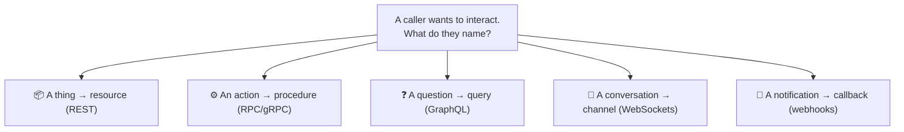
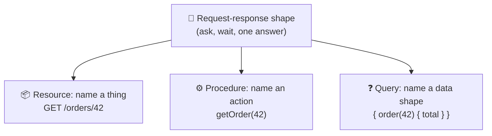

# API Architectural Styles

> **Phase:** APIs & Communication Deep Dives → **Topic:** 3 of 15 → **Read time:** ~50 minutes

---

## Before You Begin

**This document stands alone.** It assumes you have read nothing else — not the foundation series, not the topics before it. Everything is built here from zero: what an architectural style is, the small set of styles that dominate real systems, what each one fundamentally organizes an API *around*, and how to choose between them.

Two consequences of that choice:

- **Terms get defined where they're used** — style, resource, procedure, query, persistent channel, callback. Skim past what you already know.
- **Neighbouring topics are named, not taught.** REST design, the REST-versus-GraphQL comparison, GraphQL internals, gRPC, WebSockets, and webhooks each have their own full treatment later in this phase. This document is the **map** — enough of each style to choose a direction, and a pointer to the topic that goes deep. It deliberately teaches none of them in full.

API styles are part of the APIs concept in the **Top 30 Must-Know Concepts** foundation series. This is the deep-dive on the question that comes *before* picking any specific technology.

Here is the question the document answers:

> **REST, gRPC, GraphQL, WebSockets, webhooks — these get argued about like sports teams. Underneath the tribalism, what actually distinguishes them, and how would you choose without already having a favorite?**

Here's the trap it disarms. Architectural style is usually inherited, not chosen. A team is "a REST shop" or "a gRPC shop," and every new API gets the house style regardless of what it's for. That works until it doesn't — a REST API contorted into carrying real-time updates, a gRPC service that a browser can't call, a resource model bent around an operation that was never a resource. The style was picked by habit, and the mismatch shows up as friction in every later decision.

The styles aren't competing products where one wins. They're different answers to a single design question, and the answer that's obviously right for one interaction is obviously wrong for another.

> **The mindset shift:** stop asking *"which API style is best?"* and start asking **"what is the natural unit of this interaction?"** Every style is organized around a different unit — a *thing* you act on, an *action* you invoke, a *question* you pose, a *conversation* you hold open, a *notification* you send. Name the unit the interaction actually wants, and the style stops being a matter of taste and becomes a matter of fit. Pick the unit wrong and no amount of good implementation rescues it; pick it right and the style falls out on its own.

---

## Table of Contents

1. [What a "Style" Actually Is](#1-what-a-style-actually-is)
2. [The Request-Response Family — One Shape, Three Paradigms](#2-the-request-response-family--one-shape-three-paradigms)
3. [Resource-Oriented — Acting on Things](#3-resource-oriented--acting-on-things)
4. [Procedure-Oriented — Calling Functions](#4-procedure-oriented--calling-functions)
5. [Query-Oriented — Describing What You Want](#5-query-oriented--describing-what-you-want)
6. [Beyond Request-Response — Persistent and Inverted](#6-beyond-request-response--persistent-and-inverted)
7. [The Orthogonal Choices — Transport, Format, Contract](#7-the-orthogonal-choices--transport-format-contract)
8. [Public vs Internal — The Audience Bends the Choice](#8-public-vs-internal--the-audience-bends-the-choice)
9. [Choosing — Match the Style to the Unit](#9-choosing--match-the-style-to-the-unit)
10. [Putting It All Together — One System, Several Styles](#10-putting-it-all-together--one-system-several-styles)
11. [Final Recap](#11-final-recap)

---

## 1. What a "Style" Actually Is

Before comparing styles, it helps to be precise about what kind of thing a style *is* — because it's often confused with two neighbouring decisions that are genuinely separate.

> **An architectural style is a consistent set of conventions for organizing how an API is called: what you address, how you ask, and what an interaction is shaped like.**

REST is a style. So is the RPC approach gRPC embodies. So is GraphQL. Each is a *pattern* for structuring interactions, not a single product — there are many REST APIs, all sharing the same conventions.

### Three Layers That Get Confused

A single API involves three decisions that people routinely blur into one word, and separating them is most of the clarity this document offers:

| Layer | The question it answers | Example choices |
|---|---|---|
| **Shape** | Who initiates, and does the caller wait? | ask-and-wait; stream; server-initiated; send-and-forget |
| **Style** | How is the interaction organized? | resource; procedure; query; channel; callback |
| **Format** | How are the values encoded as bytes? | JSON; XML; a compact binary format |

**Shape** is the coarsest: does the client ask and wait for one answer, or does data stream, or does the server initiate, or does the caller fire a message expecting nothing back? Most APIs are ask-and-wait (request-response), and §2–§5 live entirely inside that shape; §6 covers the ones that don't.

**Format** is the finest and is genuinely independent — the same style can carry JSON or binary, and choosing the encoding is its own subject (a separate topic in this phase). A style bundles a *default* format, which is why people conflate them ("REST is JSON") — but that's convention, not definition (§7).

**Style** sits in the middle, and it's this document's subject. Given that you're going to ask and wait, *how do you organize the asking?* That's where REST, RPC, and GraphQL diverge, and they diverge on one thing.

### The One Question a Style Answers

Strip away the tooling and the arguments, and every style is a different answer to a single question:

> **What is the unit of interaction — the fundamental thing a caller names when they interact with the API?**

The candidates are surprisingly few:

- A **resource** — a *thing*. You act on nouns: fetch this, update that, delete the other.
- A **procedure** — an *action*. You invoke verbs: do this, calculate that, run the other.
- A **query** — a *question*. You describe the exact data you want and get precisely that shape back.
- A **channel** — a *conversation*. You hold a connection open and both sides speak over time.
- A **callback** — a *notification*. You register interest, and the other side calls you when something happens.

Everything else about a style — its URLs or lack of them, its verbs, its tooling, its failure modes — follows from which unit it chose. That's why the unit is the right lens: it's the root decision, and the rest are consequences.

> 💡 **Key Insight**
>
> "Style" is one of three separable layers — **shape** (who initiates), **style** (how the interaction is organized), and **format** (how bytes are encoded) — and only the middle one is what REST, gRPC, and GraphQL actually differ on. Each is a different answer to *what is the unit of interaction*: a thing, an action, a question, a conversation, or a notification. Get in the habit of naming that unit first, because it's the decision every other property of the API inherits from.

### Quick Recap — What a Style Is

- A **style** is a consistent set of conventions for organizing API interactions — a pattern, not a product.
- It's distinct from **shape** (who initiates, does the caller wait) and **format** (how values become bytes); conflating the three is the root of most style confusion.
- Every style answers one question: **what is the unit of interaction** — a resource, a procedure, a query, a channel, or a callback.
- Everything else about a style **follows from its chosen unit**, which is why naming the unit is the first and most decisive step.

---

## 2. The Request-Response Family — One Shape, Three Paradigms

Most APIs you'll ever build or call share the same shape (§1): the client asks, waits, and gets one answer back. **Request-response** — ask-and-wait — is the default interaction of the web, and it's where three of the five units from §1 live. Before looking at the styles that break this shape (§6), it's worth seeing that the request-response world is not one thing but three, and they differ on the unit.

### Same Shape, Different Unit

Every request-response API does the same dance: one request out, one response back, then the exchange is over. What changes between styles is *what the request names* — and there are three answers, each a full paradigm:

| Paradigm | The unit | The request essentially says | Exemplar |
|---|---|---|---|
| **Resource-oriented** | A thing (noun) | "Here's a thing; do a standard action to it" | REST |
| **Procedure-oriented** | An action (verb) | "Run this specific operation with these arguments" | RPC / gRPC |
| **Query-oriented** | A question | "Here's the exact shape of data I want; fill it in" | GraphQL |

All three ask and wait. All three can carry the same data. They feel different to use because they've made different choices about the *unit* — and that single difference cascades into how you address them, how they're cached, how they fail, and which problems they make easy or awkward.

Notice those three lines express nearly the same intent — *get order 42* — and each names something different: a resource path, a procedure call, a query for specific fields. That's the whole divergence in miniature, and §3–§5 take each in turn.

### Why the Family Dominates

Request-response is the default for good reasons, and they're worth naming so the exceptions in §6 stand out by contrast:

- **It matches how most interactions actually work** — a client needs something, asks, and uses the answer. Fetching a page, submitting a form, loading a profile: all naturally ask-and-wait.
- **It's simple to reason about.** One request, one response, a clear success or failure. The mental model is small.
- **It rides the web's existing machinery.** The request-response model is what the web's foundational protocol already speaks, so this family gets caching, proxies, and tooling essentially for free.

Because it fits so much and costs so little, request-response is the right default — and the interesting question is usually *which of its three paradigms*, not whether to leave the family at all. You leave it only when the interaction genuinely isn't ask-and-wait (§6).

### The Divergence Is About Fit, Not Quality

The three paradigms are not three quality tiers with REST at the bottom and GraphQL at the top, or any other ranking. They're three shapes of the same conversation, each fitting some interactions naturally and others awkwardly. A system built around *things* (users, orders, products) fits resources. A system built around *actions* (transcode this, recalculate that) fits procedures. A client that needs wildly varying slices of a data graph fits queries. The next three sections are each paradigm's natural home and its signature failure — the two things you need to place it on the map.

> 💡 **Key Insight**
>
> The request-response family is one *shape* — ask and wait — split into three *paradigms* by what the request names: a **resource** (REST), a **procedure** (RPC/gRPC), or a **query** (GraphQL). They dominate because ask-and-wait fits most interactions and rides the web's existing machinery for free. So the common choice isn't "which style" in the abstract — it's "which of these three units fits what I'm modeling," and you only leave the family when the interaction genuinely isn't ask-and-wait (§6).

### Quick Recap — The Request-Response Family

- **Request-response** (ask-and-wait) is the dominant shape; three full paradigms live inside it, differing only on the **unit**.
- **Resource** (REST) names a thing, **procedure** (RPC/gRPC) names an action, **query** (GraphQL) names a data shape — often expressing the same intent three ways.
- The family dominates because ask-and-wait **fits most interactions** and reuses the web's caching, proxies, and tooling for free.
- The three are a matter of **fit, not quality** — each has a natural home (things / actions / varying data) and a signature failure, covered next (§3–§5).
