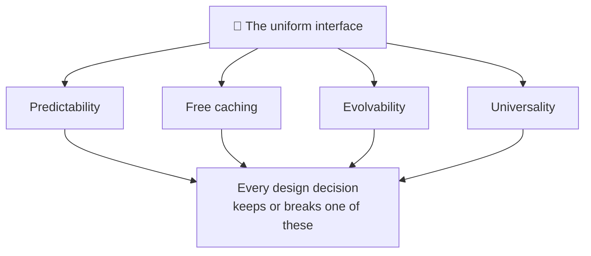
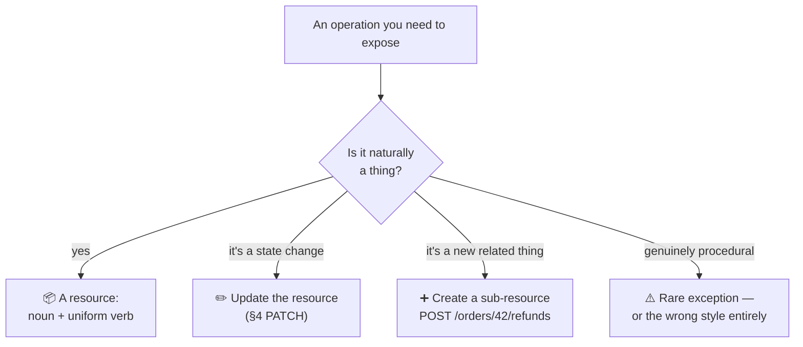
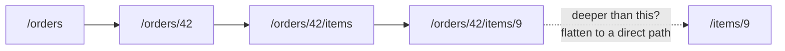
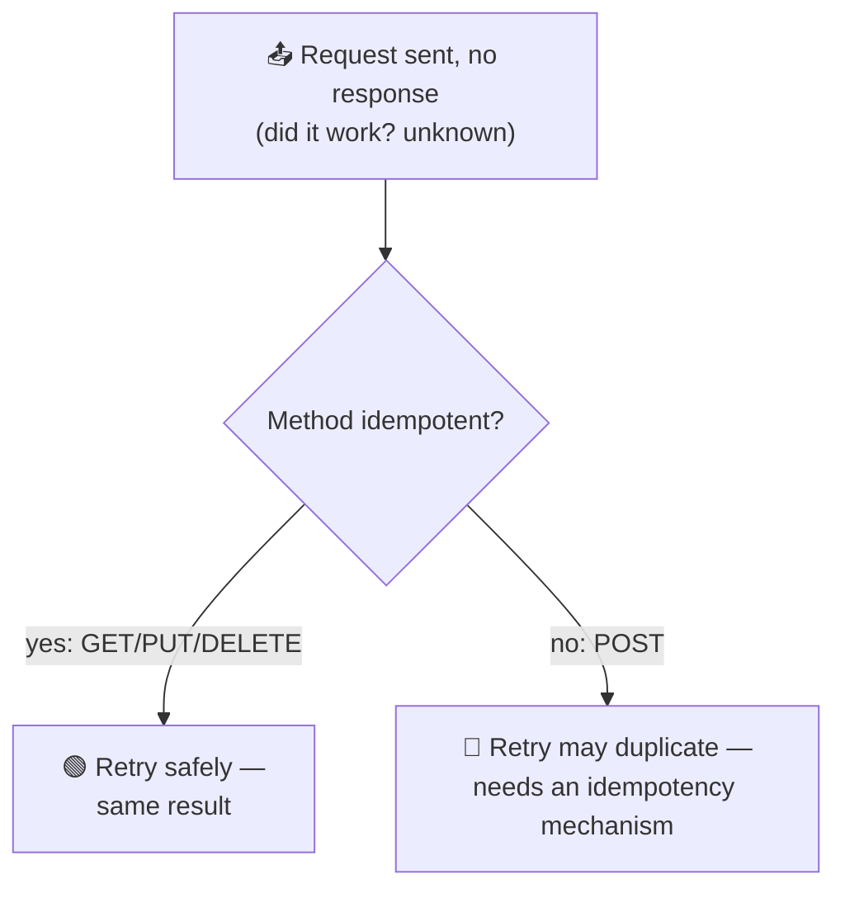
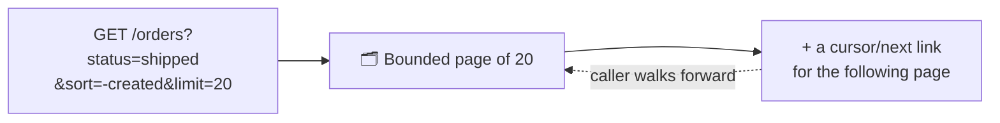
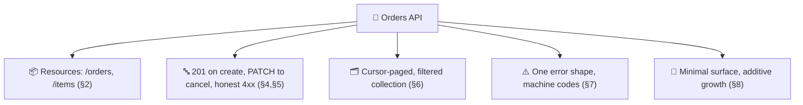

# REST API Design

> **Phase:** APIs & Communication Deep Dives → **Topic:** 4 of 15 → **Read time:** ~55 minutes

---

## Before You Begin

**This document stands alone.** It assumes you have read nothing else — not the foundation series, not the topics before it. Everything is built here from zero: what REST actually promises, how to model resources, how to choose methods and status codes, how to design collections and errors, and how to let an API change without breaking the people using it.

Two consequences of that choice:

- **Terms get defined where they're used** — resource, uniform interface, safe and idempotent methods, pagination. Terms that belong to the underlying protocol are recalled in a clause, not re-taught; this document is about *design decisions*, not the mechanics of HTTP.
- **Neighbouring topics are named, not taught.** The direct REST-versus-GraphQL comparison, GraphQL itself, the mechanism for making retries safe, and the full treatment of API versioning each have their own later topic. Where this document reaches them, it says so and points.

REST is part of the APIs concept in the **Top 30 Must-Know Concepts** foundation series. This is the deep-dive on designing one *well* — which is a different skill from knowing what REST is.

Here is the question the document answers:

> **REST has famous, simple-sounding rules — nouns in the URL, use the right verb, return the right status. So why are so many APIs technically RESTful and genuinely miserable to build against?**

Here's the trap it disarms. REST looks like a set of surface rules you either follow or don't, so people follow the rules — plural nouns, `GET` for reads, `404` for missing — and still produce APIs that are inconsistent, chatty, impossible to evolve, and maddening to debug. Following the rules isn't the same as keeping the *promises the rules exist to protect*. An API can pass every stylistic checklist and still break the properties that made REST worth choosing in the first place.

> **The mindset shift:** stop asking *"is this endpoint RESTful?"* and start asking **"which promise of the uniform interface does this decision keep or break?"** REST's value — that callers can predict it, that reads cache for free, that it can grow without breaking anyone — isn't magic; it comes from a small set of promises the design makes to its callers. Every good decision keeps one; every classic mistake breaks one. Design REST well and you're not memorizing conventions — you're protecting the properties that make the conventions worth having.

---

## Table of Contents

1. [REST as a Set of Promises](#1-rest-as-a-set-of-promises)
2. [Modeling Resources — Nouns, Not Actions](#2-modeling-resources--nouns-not-actions)
3. [URL Structure and Relationships](#3-url-structure-and-relationships)
4. [Choosing the Right Method](#4-choosing-the-right-method)
5. [Choosing the Right Status Code](#5-choosing-the-right-status-code)
6. [Designing Collections — Pagination, Filtering, Sorting](#6-designing-collections--pagination-filtering-sorting)
7. [Designing Errors — The Half of the Contract People Forget](#7-designing-errors--the-half-of-the-contract-people-forget)
8. [Evolving Without Breaking — Compatibility by Design](#8-evolving-without-breaking--compatibility-by-design)
9. [How RESTful Is Enough? — Maturity and Hypermedia](#9-how-restful-is-enough--maturity-and-hypermedia)
10. [Putting It All Together — Designing an Orders API](#10-putting-it-all-together--designing-an-orders-api)
11. [Final Recap](#11-final-recap)

---

## 1. REST as a Set of Promises

Before any rule about URLs or verbs, it's worth asking what REST is actually *for* — because every rule that follows exists to protect something, and you can't design well if you only know the rules and not what they defend.

### What REST Gives You When It's Done Right

**REST** — Representational State Transfer — is a style for designing web APIs around **resources** (the things your system is about — orders, users, products) acted on through a small, uniform set of operations. When it's designed well, a REST API has four properties that make it a pleasure to build against:

- **Predictability.** Once a caller learns how one part works, they can guess the rest. `/orders/42` behaves like `/products/7`; the same verbs mean the same things everywhere.
- **Free caching.** Reads map onto the web's native "fetch this thing" operation, so the existing infrastructure — browsers, proxies, content networks — can cache them with no extra work on your part.
- **Evolvability.** The API can grow and change over years without breaking the callers already depending on it.
- **Universality.** Any language, any tool, a browser, a command-line client can call it with nothing special installed.

These are the reasons to choose REST at all. Lose them and you have the ceremony of REST without the payoff.

### The Reframe — These Are Promises

Here's the shift that turns a pile of rules into a design skill. Each of those four properties is a **promise the API makes to its callers**, and each promise rests on the design honoring a specific constraint:

| Promise | What the caller relies on | Kept by |
|---|---|---|
| **Predictability** | "If I learn one endpoint, I can guess the others" | Consistent resources, verbs, and conventions (§2–§5) |
| **Free caching** | "Reads are cheap and safe to repeat" | Reads that never change state — the *safe* method promise (§4) |
| **Evolvability** | "My integration won't break when they improve the API" | Additive change, no leaked internals (§8) |
| **Universality** | "I can call this from anything, and outcomes are clear" | Standard methods and honest status codes (§4–§5) |

Every rule this document teaches is a way of keeping one of these promises. And — more usefully — every classic REST mistake is a way of *breaking* one:

- Putting a verb in a URL (`POST /createOrder`) breaks **predictability** — now callers can't guess your endpoints, because they're bespoke actions, not uniform resources.
- Returning `200 OK` with an error inside the body breaks **universality** — the standard success signal now lies, so generic clients and caches believe a failure succeeded.
- A `GET` that changes state breaks **free caching** — a cache or a retry will happily repeat it, and now reads have side effects.
- Removing or renaming a field breaks **evolvability** — every caller depending on it shatters at once.



### Why This Framing Beats a Checklist

A checklist tells you *what* to do; it can't tell you what to do when the checklist is silent or two rules seem to conflict. The promises can. Faced with any design question — should this be a `PUT` or a `POST`? one endpoint or two? what status code? — the productive question is *which promise am I protecting, and does this choice keep it?* That reasoning generalizes to decisions no checklist anticipated, which is the difference between following REST and designing it.

> 💡 **Key Insight**
>
> REST's value isn't the conventions — it's four **promises** the conventions protect: predictability, free caching, evolvability, and universality. Design well by asking of every decision *which promise does this keep or break?*, and the famous mistakes stop being arbitrary rule violations and become what they actually are — broken promises to the caller. A checklist tells you the rules; the promises tell you *why*, which is the only thing that helps when the rules run out.

### Quick Recap — REST as a Set of Promises

- REST, done well, delivers four properties: **predictability, free caching, evolvability, universality** — the reasons to choose it.
- Each is a **promise to the caller**, kept by a specific design constraint — and every classic mistake is one of those promises broken.
- Reframing rules as promises turns a checklist into **judgment**: ask *which promise does this decision keep or break?*
- That question generalizes to cases no checklist covers, which is the whole difference between following REST and **designing** it.

---

## 2. Modeling Resources — Nouns, Not Actions

The first and most consequential design decision in a REST API is also the one made earliest and revisited least: **what are the resources?** Get this right and the rest of the design flows naturally; get it wrong and you fight the model on every endpoint.

### A Resource Is a Thing Worth Naming

A **resource** is any thing in your system that a caller might want to address — an order, a user, a product, a shipment. The core discipline is that resources are **nouns**, and the operations on them come from the uniform set of verbs (§4), not from the URL.

The instinct to resist is turning *actions* into endpoints:

```
❌ POST /createOrder          ✅ POST /orders
❌ POST /getOrderById         ✅ GET  /orders/42
❌ POST /cancelOrder          ✅ (see below — this one is subtler)
❌ GET  /fetchAllUsers        ✅ GET  /users
```

The left column smuggles the verb into the path, which breaks predictability (§1): every action becomes its own bespoke name a caller has to learn, instead of a uniform verb-on-noun they can guess. The right column names the *thing* and lets the method carry the action. Once a caller knows `/orders`, they can guess `/products` and `/users` — that's the predictability promise being kept at the level of the URL itself.

### Finding the Resources

Resources usually fall out of the domain's nouns, but a few heuristics sharpen it:

- **Look for the things users talk about.** "I placed an *order*," "update my *profile*," "cancel the *subscription*." Those nouns are almost always your resources.
- **Resources aren't your database tables.** They're the *concepts you expose*, which may combine or hide tables. A `/dashboard` resource might assemble data from ten tables; a caller neither knows nor cares. (This is encapsulation — the API's shape is a deliberate contract, not a mirror of storage.)
- **Prefer collections and items.** Most resources come in two forms: the collection (`/orders`, all of them) and the item (`/orders/42`, one specific one). This pairing is so common it's a template (§3).

### When the Thing Is Really an Action

The honest hard case: some operations genuinely *are* actions and don't map cleanly to a noun with a standard verb. "Cancel an order," "publish an article," "retry a payment." Forcing these into pure resources produces contortions, and pretending otherwise is where REST dogma stops being useful. Two pragmatic resolutions:

- **Model the action as a state change on the resource.** Cancelling an order is often *updating* the order's status — a modification of the existing thing (§4's `PATCH`), not a new verb. This works when the action is really "the resource is now in a different state."
- **Model the action as a sub-resource you create.** When the action is a *thing* in its own right — a refund, a shipment, a publication event — create it: `POST /orders/42/refunds`. The action becomes a resource (a refund *is* a noun), and the model stays uniform.

Both keep the promise; the choice depends on whether the action is best understood as *the resource changing* or *a new related thing coming into being*. When neither fits — a genuinely procedural operation with no resource nature — that's a signal the interaction may not be resource-shaped at all, which is exactly the paradigm question a separate topic in this phase addresses. Reaching for a verb-in-URL should be the rare, deliberate exception, not the reflex.



> ⚠️ **The verb-in-URL reflex is the most common REST design mistake, and it's a broken predictability promise.** Every `POST /doSomethingSpecific` is an endpoint a caller can't guess and you can't make uniform — the API becomes a catalogue of bespoke actions wearing REST's clothing. Before adding one, check whether the action is really a *state change* (update the resource) or a *new thing* (create a sub-resource); one of those is almost always the honest model, and both keep the uniformity that makes the rest of the API predictable.

### Quick Recap — Modeling Resources

- Resources are **nouns** — the things your system is about — and the action comes from the uniform verb (§4), never from the URL.
- **Verb-in-URL** (`POST /createOrder`) is the signature mistake: it breaks predictability by making every action a bespoke, unguessable endpoint.
- Resources are the **concepts you expose**, not your database tables; most come as a **collection** and its **items**.
- Genuine actions resolve as a **state change** (update the resource) or a **new sub-resource** (create it) — a raw procedural verb should be a rare, deliberate exception.

---

## 3. URL Structure and Relationships

If resources are the nouns (§2), URLs are how callers *address* them — and a consistent URL structure is the most visible form the predictability promise takes. A caller reads your URLs before they read your docs; the structure teaches them how the whole API thinks.

### The Collection-and-Item Pattern

Almost every resource follows one template, and using it uniformly is most of good URL design:

```
/orders            → the collection (all orders)
/orders/42         → one item (order 42)
/orders/42/items   → a sub-collection (the items in order 42)
/orders/42/items/9 → one item within it
```

Two rules keep this predictable:

- **Collections are plural nouns.** `/orders`, not `/order` — the path names a set, and one member is that set plus an identifier. Consistency here matters more than which convention you pick: mixing `/orders` and `/user` forces callers to memorize each path instead of guessing it.
- **An item is a collection plus an identifier.** Once `/orders/42` is understood, `/products/7` needs no explanation. That guessability *is* the predictability promise, delivered through structure.

### Expressing Relationships

Resources relate to each other, and the URL can express containment through nesting — but nesting is a tool with a sharp edge.

**Nest to show that one resource lives within another:** `/orders/42/items` reads naturally as "the items belonging to order 42." The hierarchy communicates the relationship at a glance.

**Stop nesting before it gets deep.** A path like `/users/3/orders/42/items/9/discounts/2` is technically expressive and practically miserable — brittle, hard to read, and it forces a rigid hierarchy on data that may be reachable more than one way. The common guidance is to nest **at most one level** and then switch to addressing the deeper resource directly by its own identifier:

```
❌ /users/3/orders/42/items/9      (deep, brittle)
✅ /orders/42/items/9              (items belong to the order; that's enough)
✅ /items/9                        (if an item has a global id, address it directly)
```

The principle: nest to express a *genuine* containment the caller needs, flatten everything else. A resource with its own stable identifier can usually be reached directly, and should be.

### Identifiers and Consistency

A few smaller decisions that, made consistently, compound into a predictable surface:

- **Stable identifiers.** The ID in `/orders/42` should not change over the resource's life; callers store and reuse it. Human-readable slugs (`/articles/rest-design-guide`) are friendlier but riskier if the underlying text can change — a URL that changes is a broken bookmark and, at scale, a broken integration.
- **Consistent casing and separators.** Pick one convention (lowercase, hyphens between words) and hold it everywhere. This is pure predictability: the caller should never have to wonder whether it's `/orderItems`, `/order_items`, or `/order-items`.
- **The URL identifies; it doesn't parameterize behavior.** The path names *what* resource; how you filter, sort, or page it belongs in query parameters (§6), not in the path. `/orders/recent` blurs a resource with a query and should usually be `/orders?status=recent`.



> 💡 **Key Insight**
>
> URL structure is the predictability promise made visible: the **collection-and-item** pattern applied uniformly lets a caller who has seen one path guess every other, which is worth more than any single clever URL. Nest only to show a containment the caller genuinely needs, and flatten the moment a resource has its own identifier — deep nesting trades a little expressiveness for a lot of brittleness. Consistency in plurals, casing, and identifiers isn't fussiness; each inconsistency is a thing the caller has to memorize instead of predict.

### Quick Recap — URL Structure and Relationships

- The **collection-and-item** template (`/orders`, `/orders/42`) applied uniformly is most of good URL design — it makes paths guessable.
- Use **plural nouns** and keep casing/separators consistent; each inconsistency forces memorization and chips at predictability.
- **Nest at most one level** to show genuine containment, then address deeper resources directly by identifier — deep paths are brittle.
- The path **identifies the resource**; filtering, sorting, and paging go in query parameters (§6), not the path.

---

## 4. Choosing the Right Method

The URL names the resource; the **method** says what to do to it. There's a fixed, small set of methods, and REST's uniformity depends on using each for exactly what it promises. This section isn't about what the methods *are* — it's about *which one your design should choose*, and what breaks when you choose wrong.

Two properties, defined once because every method decision turns on them:

- **Safe** — the operation doesn't change anything. Calling it has no side effects; it only reads.
- **Idempotent** — calling it once and calling it many times leave the system in the same state. One delete and three identical deletes end with the resource equally gone.

These two properties are what the caching and reliability promises (§1) are built on, so choosing a method is really choosing which promises the endpoint keeps.

### The Design Meaning of Each Method

| Method | Choose it when the operation… | Safe? | Idempotent? |
|---|---|---|---|
| `GET` | reads a resource and changes nothing | ✅ | ✅ |
| `POST` | creates a resource, or does something not safely repeatable | ❌ | ❌ |
| `PUT` | replaces a resource entirely with what you send | ❌ | ✅ |
| `PATCH` | modifies part of a resource | ❌ | usually not |
| `DELETE` | removes a resource | ❌ | ✅ |

The design skill is matching the operation's real nature to the method whose promises fit it.

**`GET` must stay safe.** This is the highest-stakes method promise, because the whole ecosystem *assumes* it. Caches store `GET` responses; browsers prefetch them; clients retry them freely; crawlers follow them. A `GET` that changes state (`GET /orders/42/delete`) is a trap: a cache serves a stale result, or a prefetch deletes data nobody asked to delete. Keeping `GET` safe keeps the free-caching promise; breaking it can corrupt data through machinery you don't control.

**`PUT` vs `PATCH` — replace or modify.** `PUT` sends the *whole* resource and replaces it; send it twice and the resource is identical both times, which is why it's idempotent. `PATCH` sends a *partial* change ("set status to shipped"), and whether that's idempotent depends on the change — "set status to shipped" is, but "increment the counter" is not. Choose `PUT` when the caller owns the full representation, `PATCH` when they're adjusting part of a larger thing.

**`POST` is the non-idempotent creator.** `POST /orders` makes a new order each time, by design — which is exactly why it is *not* idempotent, and why it's the one method where retries are dangerous.

### The Idempotency Promise and Why Breaking It Bites

Here's where method choice meets the reliability promise. A network can lose a *response* even when the request succeeded, so callers retry when they hear nothing back (a fact developed in this phase's first topic). For an idempotent method, that retry is harmless — a repeated `PUT` or `DELETE` lands the same. For `POST`, the retry creates a *second* order, and the caller never meant to.

This isn't a reason to avoid `POST` — creation is genuinely non-idempotent and `POST` is the honest method for it. It's a reason to recognize that **any operation you put behind `POST` inherits the retry problem**, and that making a create *safe to retry* requires an added mechanism — an idempotency key that lets the server recognize the duplicate. That mechanism is a topic of its own later in this phase; the design-level point here is to know *which of your endpoints has the problem* (every non-idempotent one) so you know where that mechanism will be needed.



> ⚠️ **Choosing a method is choosing which promises an endpoint keeps, not just labeling it.** A `GET` that mutates breaks free caching in ways that surface as impossible-to-reproduce bugs (a cache or prefetch did it, not the user). A non-idempotent operation hidden behind a method callers *assume* is idempotent breaks reliability the first time a retry fires. Match the method to the operation's true safe/idempotent nature, and the ecosystem's assumptions work *for* you; mismatch them and the same machinery works against you.

### Quick Recap — Choosing the Right Method

- Method choice turns on two properties — **safe** (no change) and **idempotent** (repeatable with the same result) — which are what the caching and reliability promises rest on.
- **`GET` must stay safe**: caches, prefetchers, and retries all assume it, so a mutating `GET` corrupts data through machinery you don't control.
- **`PUT` replaces** (idempotent), **`PATCH` modifies** (idempotent only sometimes), **`POST` creates** (never idempotent — the method where retries duplicate).
- Every non-idempotent (`POST`) endpoint inherits the **retry-duplication** problem; making it retry-safe needs an idempotency mechanism, covered in its own later topic.

---

## 5. Choosing the Right Status Code

Every response carries a **status code** — a three-digit number that tells the caller, before they read the body, what happened. The families are fixed (`2xx` success, `3xx` redirect, `4xx` the caller's fault, `5xx` the server's fault), and the design task is choosing the *right* code so the caller can react correctly. Like methods, this isn't trivia — the status code is a promise, and picking a lazy one breaks it.

### The Status Code Is a Machine-Readable Outcome

The point of a status code is that a caller — often a program, not a person — can branch on it *without parsing the body*. A retry library retries `5xx` and `429` but not `400`. A cache stores `2xx` and never `4xx`. Monitoring pages on a `5xx` spike and ignores `404`s. All of that depends on the code being *honest*: the number must mean what the ecosystem thinks it means.

The most important split is **who is at fault**, because it decides who should act:

- **`4xx` — the caller made a mistake.** The request was malformed, unauthorized, or asked for something that isn't there. Retrying unchanged won't help; the *caller* must fix something.
- **`5xx` — the server failed.** The request was fine; the server couldn't fulfill it. Retrying *might* help; the *server* owner should be alerted.

Confuse these and everything downstream misfires: a real server failure hidden as `4xx` never pages anyone, and a caller's bad input reported as `5xx` wakes the on-call team for a problem they can't fix.

### The Codes That Actually Matter for Design

You don't need all of them; you need to choose deliberately among the ones that carry distinct meaning:

| Code | Choose it when | The distinction it makes |
|---|---|---|
| `200 OK` | a read or update succeeded | the generic success |
| `201 Created` | a `POST` created a resource | tells the caller a *new thing exists* (with its location) |
| `202 Accepted` | you took the request but haven't finished | work is async; not done yet |
| `400 Bad Request` | the request is malformed | the caller can't even be understood |
| `401 Unauthorized` | the caller isn't authenticated | "who are you?" — log in |
| `403 Forbidden` | authenticated but not allowed | "I know you; you still can't" — different from `401` |
| `404 Not Found` | the resource doesn't exist | distinct from `403` — reveals nothing about what exists |
| `409 Conflict` | the request collides with current state | e.g. editing a stale version |
| `422` | the request is well-formed but semantically invalid | parsed fine, but the values are wrong |
| `429 Too Many Requests` | the caller is rate-limited | back off and retry later |
| `500` / `503` | the server failed / is temporarily down | `503` signals "try again," `500` "something broke" |

Two distinctions are worth dwelling on because they're routinely muddled:

- **`401` vs `403`.** `401` means *not authenticated* ("I don't know who you are"); `403` means *authenticated but not permitted* ("I know you, and no"). Collapsing both into one confuses callers about whether logging in would help.
- **`400` vs `422`.** `400` is *I can't parse this*; `422` is *I parsed it fine but the content is invalid* (a negative quantity, a date in the past). The split lets a caller tell a syntax bug from a business-rule violation.

### The Anti-Pattern — `200 OK` With an Error Inside

The single most damaging status-code mistake is returning `200 OK` and putting the real outcome in the body:

```
❌ 200 OK   { "success": false, "error": "order not found" }
✅ 404 Not Found   { "error": "order not found" }
```

This breaks the **universality** promise (§1) directly. The whole point of status codes is that generic machinery — caches, retry logic, monitoring, API gateways — can act on the outcome without understanding your body. Say `200` when you failed and you've lied to all of it at once: the cache stores the "success," the retry logic never retries, the dashboards show everything green while callers are failing. Every client is now forced to parse a bespoke body to discover the truth the status code was supposed to tell them — which is exactly the universality REST was meant to provide, thrown away.

> ⚠️ **A status code is a promise to machines, and the lazy `200`-with-error-body breaks it for all of them at once.** Caches, retriers, gateways, and dashboards all act on the code without reading your body — that's the universality that makes REST callable from anything. Return an honest code (`4xx` for the caller's fault, `5xx` for yours) and that machinery works for free; return `200` on failure and it silently does the wrong thing everywhere, while your monitoring insists nothing is wrong.

### Quick Recap — Choosing the Right Status Code

- A status code is a **machine-readable outcome** callers branch on without reading the body — retriers, caches, and monitoring all depend on it being honest.
- The load-bearing split is **fault**: `4xx` means the caller must fix something; `5xx` means the server failed and should be alerted — confusing them misroutes every reaction.
- Choose deliberately among the codes that carry distinct meaning — especially **`401` vs `403`** (unauthenticated vs forbidden) and **`400` vs `422`** (unparseable vs invalid).
- **`200 OK` with an error in the body** breaks universality for every generic client at once — return the honest code instead.

---

## 6. Designing Collections — Pagination, Filtering, Sorting

Single resources are the easy case. The hard, high-stakes design work is in **collections** — `/orders`, `/users`, `/events` — because a collection grows without bound, and an endpoint that returns "all of them" is a latency and stability problem waiting to happen. This is where a lot of real-world API pain lives.

### Why "Return Everything" Is a Trap

`GET /orders` looks innocent when you have a hundred orders. At a million, the same endpoint tries to load a million rows, serialize megabytes, and ship it all in one response — slow for the caller, memory-punishing for the server, and a single expensive query that can drag down everything sharing that database. An unbounded collection endpoint is a design defect that stays invisible in testing and detonates in production, precisely when the data has grown.

The fix is that a collection endpoint must **never** return everything. It returns a bounded *page*, and gives the caller a way to ask for more.

### Pagination — Two Approaches

**Offset-based** pagination uses a position and a count: "skip 40, give me 20."

```
GET /orders?offset=40&limit=20
```

It's simple, it allows jumping to an arbitrary page, and it's the intuitive default. Its weaknesses are real: skipping a large offset gets *slower* the deeper you go (the server still has to count past everything skipped), and if items are inserted or deleted while a caller pages through, they can see duplicates or miss rows — the offsets shift under them.

**Cursor-based** pagination hands the caller an opaque pointer to "where you left off":

```
GET /orders?limit=20            → returns 20 + a "next" cursor
GET /orders?limit=20&cursor=eyJ… → the next 20
```

The cursor encodes a stable position (typically a sort key plus an id), so paging stays fast no matter how deep, and insertions/deletions don't shift the window. The cost is that you can't jump to "page 47" — you can only walk forward — and cursors are opaque, so callers can't construct them by hand.

| | Offset | Cursor |
|---|---|---|
| Jump to arbitrary page | ✅ | ❌ (sequential only) |
| Performance at depth | 🔴 degrades | 🟢 stays fast |
| Stable under inserts/deletes | 🔴 shifts | 🟢 stable |
| Simplicity for callers | 🟢 obvious | 🟠 opaque |

The design choice follows the use: offset for small, stable datasets a human pages through a UI; cursor for large or fast-changing datasets and for anything programmatic walking the whole set.

### Filtering and Sorting Belong in Query Parameters

Callers rarely want the *whole* collection — they want a slice of it. That slice is expressed in **query parameters**, keeping the path pointed at the resource (§3):

```
GET /orders?status=shipped&sort=-created&limit=20
```

`status=shipped` filters, `sort=-created` orders (a convention: `-` for descending), `limit` bounds the page. The design promises to protect here:

- **Filtering and sorting are query parameters, not new paths.** `/orders/shipped` looks tempting but breaks predictability — "shipped" isn't a resource, it's a filter on one. `/orders?status=shipped` keeps the resource singular and the variation in parameters.
- **Keep it cacheable.** Because these are `GET`s with the criteria in the URL, two identical queries produce identical URLs, so caches can store them. Putting filter criteria in a request *body* (which some designs reach for) breaks that — the URL no longer identifies the response, and the free-caching promise is gone.
- **Bound it by default.** Even with no `limit` given, apply a sane default page size. The endpoint should be impossible to call in a way that returns everything.



> 💡 **Key Insight**
>
> A collection endpoint that can return "everything" is a latency and stability defect that hides until the data grows — so the real design rule is that collections are **always bounded**, always paged, bounded even by default. Choose **offset** for small stable sets a human browses and **cursor** for large or changing sets walked programmatically; express filtering and sorting as **query parameters** so the URL still identifies the response and caches still work. The collection is where REST's promises are easiest to break by omission — you don't have to do anything wrong, just forget to set a limit.

### Quick Recap — Designing Collections

- An **unbounded collection endpoint** is a latency/stability trap that's invisible in testing; collections must always return a **bounded page**.
- **Offset** pagination is simple and allows page-jumps but degrades at depth and shifts under inserts; **cursor** pagination stays fast and stable but is forward-only.
- **Filtering and sorting go in query parameters** (`?status=shipped&sort=-created`), not new paths — keeping the resource singular and the response cacheable.
- **Bound by default**: even with no `limit`, apply a sane page size so the endpoint can never be asked to return everything.

---

## 7. Designing Errors — The Half of the Contract People Forget

Most API design effort goes into the success path — the resources, the happy responses. But callers spend a great deal of their time handling *failure*, and how your API fails is as much a part of the contract as how it succeeds. An API with a beautiful success design and a chaotic error design is genuinely hard to build against, because the caller can never write reliable failure-handling code.

### The Status Code Is Not Enough

§5 covered choosing the right status code — necessary, but not sufficient. `400 Bad Request` tells the caller *that* something was wrong with their request; it doesn't tell them *what*, so they can't show a useful message or fix the call programmatically. The error **body** carries the detail the code can't, and designing that body is the other half of the job.

The status code is the *category*; the body is the *specifics*. Callers need both: the code so generic machinery can react (§5), the body so their code and their users can understand and correct.

### A Consistent, Machine-Readable Error Shape

The single most valuable decision is that **every error in the API uses the same body shape.** When errors are consistent, a caller writes error handling *once* and it works for every endpoint. When each endpoint invents its own error format, the caller writes bespoke parsing for each — and usually gives up and shows "Something went wrong."

A workable shape carries a few things:

```
{
  "error": {
    "code": "insufficient_funds",
    "message": "The account balance is too low for this charge.",
    "field": "amount"
  }
}
```

- **A stable, machine-readable code** (`insufficient_funds`) the caller can branch on — distinct from the HTTP status, and more specific. Two different `422`s can carry different codes, letting the caller tell them apart programmatically.
- **A human-readable message** for logs and, carefully, for display. This is for people; the *code* is for programs — never make callers regex the message to detect a condition.
- **Enough structure to act** — which field was invalid, what the constraint was — so a client can highlight the right input or retry correctly.

The machine-code-plus-human-message split matters: messages get reworded, translated, and improved, so any caller that branches on message *text* breaks when you improve the wording. The stable `code` is the part they build logic on.

### Let the Caller Know What to Do

The most useful thing an error design can do is let the caller distinguish the three responses to failure (a framing from this phase's first topic, applied here):

| The error means | The caller should | Signaled by |
|---|---|---|
| "You did something wrong" | Fix the request and retry | `4xx` + a specific code |
| "Try again, it may work" | Retry, ideally with backoff | `429`, `503` |
| "This will never work" | Give up, surface the failure | `4xx` that won't change (e.g. `403`, `404`) |

An error surface that lets a caller tell "retry might help" from "retrying is pointless" is the difference between a resilient integration and one that either gives up too early or hammers a doomed request forever. That distinction lives in the status code and the error code together.

### Don't Leak the Internals

A final promise the error design must keep — this one about safety. An error body should describe *what the caller can act on*, not expose the server's guts:

- **No stack traces, no raw database errors, no internal hostnames** in responses callers can see. They help an attacker map your system and help a legitimate caller not at all.
- **Log the detail server-side, return the summary.** Attach an identifier the caller can quote (`"request_id": "abc123"`) so support can find the full detail in the logs without it ever crossing the boundary.

Leaking internals through errors is one of the most common ways a boundary that's otherwise well-designed quietly becomes an information disclosure.

> 💡 **Key Insight**
>
> Errors are half the contract, and they're the half that decides whether callers can write reliable code against you. Design **one consistent error shape** across the whole API so failure-handling is written once; carry a **stable machine code** (for logic) *and* a **human message** (for people), never conflating them; and shape errors so a caller can tell **retryable from hopeless**. Then keep the safety promise: describe what the caller can act on, log the internals rather than returning them. A gorgeous success path over an inconsistent error surface is still a painful API.

### Quick Recap — Designing Errors

- How an API fails is **part of the contract**; the status code gives the category (§5), the **error body** gives the specifics the caller needs to act.
- Use **one consistent error shape** everywhere so callers write failure-handling once — per-endpoint formats force bespoke parsing and get abandoned.
- Carry a **stable machine-readable code** (for branching) and a separate **human message** (for people) — never make callers parse message text.
- Let callers distinguish **retryable from hopeless**, and **never leak internals** — log detail server-side, return a summary plus a request id.

---

## 8. Evolving Without Breaking — Compatibility by Design

An API ships, callers build on it, and then requirements change — a field must be added, a behavior improved, a mistake corrected. The evolvability promise (§1) says you can do all of that *without breaking the callers already depending on you.* Whether you can keep that promise is decided largely by how you designed the API before you ever needed to change it.

### The Constraint — You Can't Force an Upgrade

The fact that makes evolution hard: a public API's callers are people you can't reach and can't compel. You ship a change; their code keeps calling the old contract until *they* choose to update, which may be never. So a change either has to keep working for existing callers, or it breaks them the moment it deploys — through no action of theirs.

This makes "will this break existing callers?" the first question about any change, and it splits every change into two kinds:

| Non-breaking (safe to ship) | Breaking (someone's integration fails) |
|---|---|
| Adding a new optional field to a response | Removing or renaming a field |
| Adding a new endpoint | Changing a field's type or meaning |
| Adding an optional query parameter | Making an optional parameter required |
| A new enum value callers can ignore | Tightening validation on existing input |

The pattern: **additions tend to be safe; removals, renames, and tightenings tend to break.** A caller ignoring fields it doesn't recognize is unharmed when you add one — but any caller depending on something you took away shatters.

### Designing So Change Stays Additive

Compatibility is mostly won *before* the change, by design choices that leave room to grow:

- **Expose the minimum (from §2's encapsulation).** Every field you publish is one you've promised to keep. Leak an internal database column into the response and you can never restructure that table without breaking callers. The less you expose, the more you can change freely later.
- **Build tolerant readers, and expect them.** A well-behaved client ignores fields it doesn't recognize rather than rejecting them — which is what makes adding a field safe. Design your responses assuming callers are tolerant, and document that they should be, because a strict client that rejects unknown fields turns your safe additions into breakage.
- **Prefer optional over required.** A new *required* input breaks every existing caller instantly; the same input made *optional with a sensible default* breaks no one and lets callers adopt it when ready.
- **Never reuse a name for a new meaning.** Changing what a field *means* while keeping its name is the most insidious break — it passes every schema check and silently corrupts every caller who relied on the old meaning. If the meaning changes, the name should too (a new field), leaving the old one intact.

### When You Genuinely Must Break — Versioning

Sometimes a change can't be made compatible: a fundamental restructuring, a mistake that has to be corrected. You can't hold every old contract forever, and occasionally the interface truly must change in a breaking way.

That situation is what **versioning** exists for — running the old and new contracts side by side, giving callers time to migrate, and eventually retiring the old one. The two common approaches are worth naming at the design level:

- **In the URL** (`/v1/orders` → `/v2/orders`) — visible, unmissable, easy to route; but coarse, and it pushes the version into every path.
- **In a header** — keeps URLs clean and version-free; but it's less visible and easy for a caller to forget.

Which to choose, how to run versions in parallel, and how to sunset the old one is a substantial topic in its own right, later in this phase. The design-level point here is that **versioning is the escape hatch, not the routine** — most change should be additive and never need a new version, and a new version is what you reach for only when a break is genuinely unavoidable. An API that bumps its version for every change has usually failed to design for compatibility.

> ⚠️ **Evolvability is designed in before the first change, not bolted on at the first break.** Because you can't force callers to upgrade, every change must assume old callers are still out there — so expose the minimum, keep additions optional, build for tolerant readers, and never reuse a name for a new meaning (the break that passes every check). Versioning is the escape hatch for the genuinely-unavoidable break, not the routine tool; reaching for it constantly is the symptom of an API that wasn't designed to grow.

### Quick Recap — Evolving Without Breaking

- You **can't force callers to upgrade**, so every change must keep working for old callers or it breaks them on deploy — making "will this break?" the first question.
- **Additions are usually safe; removals, renames, and tightenings break** — and the worst break is reusing a name for a new *meaning*, which passes every schema check.
- Compatibility is won by design: **expose the minimum, prefer optional, assume tolerant readers**, and grow the contract by addition.
- **Versioning** (URL or header) is the escape hatch for unavoidable breaks — a substantial later topic — not a routine to reach for on every change.

---

## 9. How RESTful Is Enough? — Maturity and Hypermedia

There's a spectrum of how fully an API commits to REST's ideas, and it's worth knowing — both because you'll hear people argue about it and because it clarifies which of REST's promises you're actually keeping. But it comes with a strong pragmatic caveat, so this section is as much about *where to stop* as about how far you can go.

### The Maturity Ladder

A well-known model describes REST adoption as a ladder of levels, each keeping more of the promises than the last:

| Level | What it does | Which promise it adds |
|---|---|---|
| **0** | One endpoint, everything is a `POST` with an action in the body | none — this is RPC wearing HTTP |
| **1** | Real resources with their own URLs | predictability starts (things are addressable) |
| **2** | Proper methods and status codes on those resources | free caching + universality (the ecosystem now understands you) |
| **3** | Responses include links to related actions and resources (hypermedia) | discoverability + evolvability (the API describes its own next steps) |

The ladder is a useful diagnostic: an API stuck at level 0 or 1 is REST in name only, and most of this document (§2–§5) is really about reaching **level 2** — which is where the caching and universality promises actually kick in. Level 2 is where the vast majority of good, successful REST APIs live.

### Level 3 — Hypermedia (HATEOAS)

The top rung has a name: **HATEOAS** — Hypermedia As The Engine Of Application State. The idea is that responses don't just carry data, they carry **links** telling the caller what they can do next:

```
{
  "id": 42,
  "status": "pending",
  "_links": {
    "self":   { "href": "/orders/42" },
    "cancel": { "href": "/orders/42", "method": "DELETE" },
    "pay":    { "href": "/orders/42/payment" }
  }
}
```

The order tells you, in the response itself, that it can be cancelled or paid — and *where*. Two genuine promises follow: **discoverability** (a caller can navigate the API by following links instead of hard-coding URLs) and **evolvability** (the server can change those URLs, and clients following links adapt without a code change — you're no longer bound by the URLs callers memorized).

This is, in the purest sense, "true REST" — the level the style's originator actually described.

### Why Most APIs Stop at Level 2 — and Are Right To

Here's the pragmatic truth the ladder can obscure: **the overwhelming majority of successful, respected REST APIs stop at level 2, deliberately, and are completely fine.** Hypermedia's promises are real but its costs are high and its payoff is often theoretical:

- **Clients rarely exploit it.** HATEOAS pays off only if clients actually navigate by links rather than hard-coding URLs — and in practice most clients hard-code anyway, because it's simpler and they were built against fixed documentation. The evolvability benefit goes unclaimed.
- **It adds real weight.** Every response carries link metadata; every client needs a hypermedia-aware way to consume it. That's ongoing cost for a benefit few callers use.
- **Documentation substitutes for discoverability.** In practice, callers discover an API by reading its docs, not by traversing links at runtime.

So the honest guidance is: **aim for a solid level 2** — proper resources, methods, and status codes, which is where the promises that matter in daily practice are kept — and reach for level 3 only when you have a specific reason: many clients you can't coordinate with, or a genuine need for the API to be self-describing and its URLs freely movable. Treating hypermedia as a mandatory bar every API must clear is dogma; treating it as a tool with a narrow, real payoff is design judgment.

> 💡 **Key Insight**
>
> The maturity ladder is a useful map — level 2 (real resources, proper methods, honest status codes) is where REST's caching and universality promises actually activate, and it's where most excellent APIs deliberately stop. **Hypermedia (level 3) offers real discoverability and evolvability, but only to clients that navigate by links — which most don't — so its payoff is usually theoretical.** "More RESTful" is not automatically "better." Aim for a solid level 2, and climb to hypermedia only when a concrete need justifies its concrete cost.

### Quick Recap — How RESTful Is Enough

- The **maturity ladder** runs from level 0 (RPC over HTTP) up through resources, proper methods, and finally hypermedia — each level keeping more promises.
- Most of good REST design targets **level 2** (resources + methods + status codes), which is where **free caching and universality** actually kick in.
- **Level 3 / HATEOAS** adds discoverability and evolvability via links, but pays off only for clients that navigate by them — which most don't.
- **More RESTful isn't automatically better**: aim for a solid level 2 and adopt hypermedia only when a specific need justifies its cost.

---

## 10. Putting It All Together — Designing an Orders API

A team is designing the public API for an order-management system: partners create orders, check their status, list them, and cancel them. Watch every section become a decision, each one framed as a promise kept.

### Step 1 — Model the Resources (§2)

They start with the nouns partners talk about: *orders*, and the *items* within an order. Resisting the verb-in-URL reflex, "create an order" doesn't become `POST /createOrder` — it becomes a `POST` to the orders collection. The domain has two resources, one nested in the other:

```
/orders            /orders/42            /orders/42/items
```

Cancellation is the interesting case (§2). "Cancel" is a verb, but they recognize it as a *state change* — a cancelled order is the same order in a different status — so it's a modification of the resource, not a new `/cancelOrder` endpoint. Predictability promise kept: every path is a guessable noun.

### Step 2 — Methods and Status Codes (§4, §5)

Each operation gets the method whose promises fit it:

- `GET /orders/42` — read, **safe**, cacheable.
- `POST /orders` — create; returns **`201 Created`** with the new order's location. They note this is non-idempotent (§4), flagging it as the endpoint that will later need an idempotency mechanism for safe retries.
- `PATCH /orders/42` — change status to cancelled; a partial modification, not a full replace.

For outcomes they choose honest codes (§5): `404` for an order that doesn't exist, `403` when a partner requests *another* partner's order (distinct from `404` — and here they pause, deciding to return `404` rather than `403` so the API doesn't reveal that someone else's order exists), `409` when cancelling an order that's already shipped. Crucially, no `200`-with-error-body anywhere — every failure carries a true status code (§5), keeping the universality promise.

### Step 3 — The Orders Collection (§6)

`GET /orders` is the dangerous one (§6). A busy partner has hundreds of thousands of orders, so the endpoint is **bounded from day one**: a default page size, cursor-based pagination (partners walk their whole order history programmatically, and cursors stay fast and stable as new orders arrive), and filtering/sorting in query parameters:

```
GET /orders?status=shipped&sort=-created&limit=50
```

The resource stays singular; the variation lives in parameters, so responses stay cacheable (§6). The "return everything" trap is designed out before it can appear in production.

### Step 4 — The Error Shape (§7)

They define one error shape used by every endpoint (§7): a stable machine `code`, a human `message`, and a `request_id` for support. `insufficient_inventory` and `order_already_shipped` become distinct codes partners can branch on, cleanly separating "fix and retry" from "this will never work" (§7). No stack traces cross the boundary; the detail is logged behind the request id.

### Step 5 — Room to Grow (§8)

Anticipating change, they expose only what partners need — not internal fields (§8) — and document that clients should ignore unknown fields. Months later, when they add an `estimated_delivery` field to the order response, it's a pure addition: tolerant clients ignore it, new clients use it, nobody breaks (§8). No version bump needed — exactly as evolvability-by-design intends.

### Step 6 — How Far Up the Ladder (§9)

They deliberately target **level 2** (§9): clean resources, correct methods, honest status codes. They skip hypermedia — their partners integrate against documentation and hard-code the handful of URLs they use, so link-driven discoverability would be cost without payoff. A deliberate stop, not an oversight.



### The Payoff

The result is an API a partner can learn in one sitting and integrate against confidently: paths they can guess, outcomes their code can branch on, failures they can handle uniformly, and a contract that won't break under them next quarter. Not one decision was made by consulting a style rulebook — each came from asking which promise it protected.

The lesson the team writes down:

> **Every decision reduced to the same question: which promise does this keep? Naming the resource kept predictability; the safe `GET` kept caching; the honest status code kept universality; the minimal surface kept evolvability. "Is it RESTful?" would have told us whether we followed the rules. "Which promise does this keep?" told us whether the API would actually be good to use — and those are not the same question.**

---

## 11. Final Recap

| Decision | The Promise It Protects | Common Way It's Broken |
|---|---|---|
| **Model as resources (nouns)** | Predictability | `POST /createOrder` — a verb in the URL |
| **Consistent URL structure** | Predictability | Mixed plurals, casing, deep nesting |
| **`GET` stays safe** | Free caching | A `GET` that mutates state |
| **Match method to operation** | Reliability | Non-idempotent op where callers expect idempotence |
| **Honest status codes** | Universality | `200 OK` with an error in the body |
| **Bounded, paged collections** | Predictability & stability | An endpoint that returns everything |
| **One consistent error shape** | Usable failure handling | Per-endpoint ad-hoc error formats |
| **Minimal surface, additive change** | Evolvability | Leaking internals; renaming/removing fields |
| **Target level 2, hypermedia by need** | Right cost/benefit | Dogmatic hypermedia, or RPC-in-disguise |

### The One Thing to Remember

> **REST's famous rules are not the point — they're the means. The point is a small set of promises the uniform interface makes to callers: that they can predict it, cache it for free, evolve against it without breaking, and call it from anything. Every good design decision keeps one of those promises and every classic mistake breaks one, so the question that actually makes you good at REST is never "is this RESTful?" but "which promise does this decision keep or break?" Model resources as nouns, keep GET safe, return honest status codes, bound your collections, design your errors as carefully as your successes, and expose the minimum you can — not because a rulebook says so, but because each is a promise someone is going to build their system on top of. Follow the rules and you get an API that passes review; keep the promises and you get one people are glad to build against.**

---

## What's Next

> **Topic 05 — REST vs GraphQL**

This document designed REST well and named, more than once, exactly where it strains: a collection that's chatty to assemble from many resources, responses that over-fetch fields a caller didn't want, a mobile screen that needs six related things and makes six round trips. Those aren't flaws in *your* design — they're the edges of the resource paradigm itself.

The next topic puts REST head to head with the style built specifically to attack those edges: **GraphQL**, where the client describes the exact data it wants in one request. It's the most common real architectural debate in API design, and now that you know what REST promises and where it strains, you can judge the comparison instead of taking a side. You've learned to design REST well; next, you learn when something else is the better tool.

---
