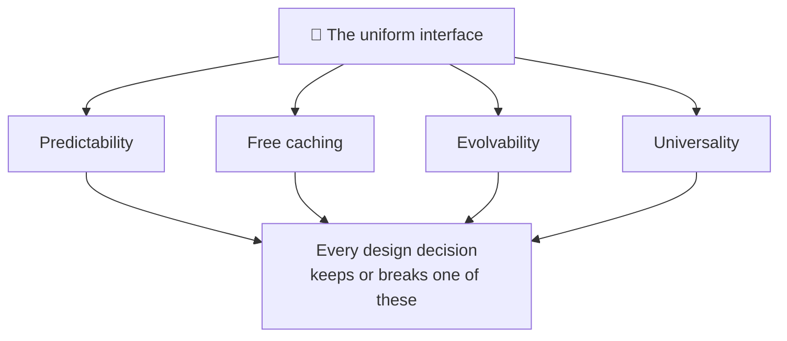
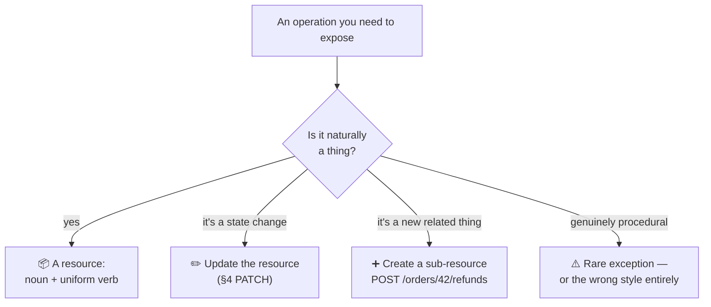
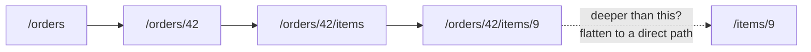

# REST API Design

> **Phase:** APIs & Communication Deep Dives → **Topic:** 4 of 15 → **Read time:** ~55 minutes

---

## Before You Begin

**This document stands alone.** It assumes you have read nothing else — not the foundation series, not the topics before it. Everything is built here from zero: what REST actually promises, how to model resources, how to choose methods and status codes, how to design collections and errors, and how to let an API change without breaking the people using it.

Two consequences of that choice:

- **Terms get defined where they're used** — resource, uniform interface, safe and idempotent methods, pagination. Terms that belong to the underlying protocol are recalled in a clause, not re-taught; this document is about *design decisions*, not the mechanics of HTTP.
- **Neighbouring topics are named, not taught.** The direct REST-versus-GraphQL comparison, GraphQL itself, the mechanism for making retries safe, and the full treatment of API versioning each have their own later topic. Where this document reaches them, it says so and points.

REST is part of the APIs concept in the **Top 30 Must-Know Concepts** foundation series. This is the deep-dive on designing one *well* — which is a different skill from knowing what REST is.

Here is the question the document answers:

> **REST has famous, simple-sounding rules — nouns in the URL, use the right verb, return the right status. So why are so many APIs technically RESTful and genuinely miserable to build against?**

Here's the trap it disarms. REST looks like a set of surface rules you either follow or don't, so people follow the rules — plural nouns, `GET` for reads, `404` for missing — and still produce APIs that are inconsistent, chatty, impossible to evolve, and maddening to debug. Following the rules isn't the same as keeping the *promises the rules exist to protect*. An API can pass every stylistic checklist and still break the properties that made REST worth choosing in the first place.

> **The mindset shift:** stop asking *"is this endpoint RESTful?"* and start asking **"which promise of the uniform interface does this decision keep or break?"** REST's value — that callers can predict it, that reads cache for free, that it can grow without breaking anyone — isn't magic; it comes from a small set of promises the design makes to its callers. Every good decision keeps one; every classic mistake breaks one. Design REST well and you're not memorizing conventions — you're protecting the properties that make the conventions worth having.

---

## Table of Contents

1. [REST as a Set of Promises](#1-rest-as-a-set-of-promises)
2. [Modeling Resources — Nouns, Not Actions](#2-modeling-resources--nouns-not-actions)
3. [URL Structure and Relationships](#3-url-structure-and-relationships)
4. [Choosing the Right Method](#4-choosing-the-right-method)
5. [Choosing the Right Status Code](#5-choosing-the-right-status-code)
6. [Designing Collections — Pagination, Filtering, Sorting](#6-designing-collections--pagination-filtering-sorting)
7. [Designing Errors — The Half of the Contract People Forget](#7-designing-errors--the-half-of-the-contract-people-forget)
8. [Evolving Without Breaking — Compatibility by Design](#8-evolving-without-breaking--compatibility-by-design)
9. [How RESTful Is Enough? — Maturity and Hypermedia](#9-how-restful-is-enough--maturity-and-hypermedia)
10. [Putting It All Together — Designing an Orders API](#10-putting-it-all-together--designing-an-orders-api)
11. [Final Recap](#11-final-recap)

---

## 1. REST as a Set of Promises

Before any rule about URLs or verbs, it's worth asking what REST is actually *for* — because every rule that follows exists to protect something, and you can't design well if you only know the rules and not what they defend.

### What REST Gives You When It's Done Right

**REST** — Representational State Transfer — is a style for designing web APIs around **resources** (the things your system is about — orders, users, products) acted on through a small, uniform set of operations. When it's designed well, a REST API has four properties that make it a pleasure to build against:

- **Predictability.** Once a caller learns how one part works, they can guess the rest. `/orders/42` behaves like `/products/7`; the same verbs mean the same things everywhere.
- **Free caching.** Reads map onto the web's native "fetch this thing" operation, so the existing infrastructure — browsers, proxies, content networks — can cache them with no extra work on your part.
- **Evolvability.** The API can grow and change over years without breaking the callers already depending on it.
- **Universality.** Any language, any tool, a browser, a command-line client can call it with nothing special installed.

These are the reasons to choose REST at all. Lose them and you have the ceremony of REST without the payoff.

### The Reframe — These Are Promises

Here's the shift that turns a pile of rules into a design skill. Each of those four properties is a **promise the API makes to its callers**, and each promise rests on the design honoring a specific constraint:

| Promise | What the caller relies on | Kept by |
|---|---|---|
| **Predictability** | "If I learn one endpoint, I can guess the others" | Consistent resources, verbs, and conventions (§2–§5) |
| **Free caching** | "Reads are cheap and safe to repeat" | Reads that never change state — the *safe* method promise (§4) |
| **Evolvability** | "My integration won't break when they improve the API" | Additive change, no leaked internals (§8) |
| **Universality** | "I can call this from anything, and outcomes are clear" | Standard methods and honest status codes (§4–§5) |

Every rule this document teaches is a way of keeping one of these promises. And — more usefully — every classic REST mistake is a way of *breaking* one:

- Putting a verb in a URL (`POST /createOrder`) breaks **predictability** — now callers can't guess your endpoints, because they're bespoke actions, not uniform resources.
- Returning `200 OK` with an error inside the body breaks **universality** — the standard success signal now lies, so generic clients and caches believe a failure succeeded.
- A `GET` that changes state breaks **free caching** — a cache or a retry will happily repeat it, and now reads have side effects.
- Removing or renaming a field breaks **evolvability** — every caller depending on it shatters at once.



### Why This Framing Beats a Checklist

A checklist tells you *what* to do; it can't tell you what to do when the checklist is silent or two rules seem to conflict. The promises can. Faced with any design question — should this be a `PUT` or a `POST`? one endpoint or two? what status code? — the productive question is *which promise am I protecting, and does this choice keep it?* That reasoning generalizes to decisions no checklist anticipated, which is the difference between following REST and designing it.

> 💡 **Key Insight**
>
> REST's value isn't the conventions — it's four **promises** the conventions protect: predictability, free caching, evolvability, and universality. Design well by asking of every decision *which promise does this keep or break?*, and the famous mistakes stop being arbitrary rule violations and become what they actually are — broken promises to the caller. A checklist tells you the rules; the promises tell you *why*, which is the only thing that helps when the rules run out.

### Quick Recap — REST as a Set of Promises

- REST, done well, delivers four properties: **predictability, free caching, evolvability, universality** — the reasons to choose it.
- Each is a **promise to the caller**, kept by a specific design constraint — and every classic mistake is one of those promises broken.
- Reframing rules as promises turns a checklist into **judgment**: ask *which promise does this decision keep or break?*
- That question generalizes to cases no checklist covers, which is the whole difference between following REST and **designing** it.

---

## 2. Modeling Resources — Nouns, Not Actions

The first and most consequential design decision in a REST API is also the one made earliest and revisited least: **what are the resources?** Get this right and the rest of the design flows naturally; get it wrong and you fight the model on every endpoint.

### A Resource Is a Thing Worth Naming

A **resource** is any thing in your system that a caller might want to address — an order, a user, a product, a shipment. The core discipline is that resources are **nouns**, and the operations on them come from the uniform set of verbs (§4), not from the URL.

The instinct to resist is turning *actions* into endpoints:

```
❌ POST /createOrder          ✅ POST /orders
❌ POST /getOrderById         ✅ GET  /orders/42
❌ POST /cancelOrder          ✅ (see below — this one is subtler)
❌ GET  /fetchAllUsers        ✅ GET  /users
```

The left column smuggles the verb into the path, which breaks predictability (§1): every action becomes its own bespoke name a caller has to learn, instead of a uniform verb-on-noun they can guess. The right column names the *thing* and lets the method carry the action. Once a caller knows `/orders`, they can guess `/products` and `/users` — that's the predictability promise being kept at the level of the URL itself.

### Finding the Resources

Resources usually fall out of the domain's nouns, but a few heuristics sharpen it:

- **Look for the things users talk about.** "I placed an *order*," "update my *profile*," "cancel the *subscription*." Those nouns are almost always your resources.
- **Resources aren't your database tables.** They're the *concepts you expose*, which may combine or hide tables. A `/dashboard` resource might assemble data from ten tables; a caller neither knows nor cares. (This is encapsulation — the API's shape is a deliberate contract, not a mirror of storage.)
- **Prefer collections and items.** Most resources come in two forms: the collection (`/orders`, all of them) and the item (`/orders/42`, one specific one). This pairing is so common it's a template (§3).

### When the Thing Is Really an Action

The honest hard case: some operations genuinely *are* actions and don't map cleanly to a noun with a standard verb. "Cancel an order," "publish an article," "retry a payment." Forcing these into pure resources produces contortions, and pretending otherwise is where REST dogma stops being useful. Two pragmatic resolutions:

- **Model the action as a state change on the resource.** Cancelling an order is often *updating* the order's status — a modification of the existing thing (§4's `PATCH`), not a new verb. This works when the action is really "the resource is now in a different state."
- **Model the action as a sub-resource you create.** When the action is a *thing* in its own right — a refund, a shipment, a publication event — create it: `POST /orders/42/refunds`. The action becomes a resource (a refund *is* a noun), and the model stays uniform.

Both keep the promise; the choice depends on whether the action is best understood as *the resource changing* or *a new related thing coming into being*. When neither fits — a genuinely procedural operation with no resource nature — that's a signal the interaction may not be resource-shaped at all, which is exactly the paradigm question a separate topic in this phase addresses. Reaching for a verb-in-URL should be the rare, deliberate exception, not the reflex.



> ⚠️ **The verb-in-URL reflex is the most common REST design mistake, and it's a broken predictability promise.** Every `POST /doSomethingSpecific` is an endpoint a caller can't guess and you can't make uniform — the API becomes a catalogue of bespoke actions wearing REST's clothing. Before adding one, check whether the action is really a *state change* (update the resource) or a *new thing* (create a sub-resource); one of those is almost always the honest model, and both keep the uniformity that makes the rest of the API predictable.

### Quick Recap — Modeling Resources

- Resources are **nouns** — the things your system is about — and the action comes from the uniform verb (§4), never from the URL.
- **Verb-in-URL** (`POST /createOrder`) is the signature mistake: it breaks predictability by making every action a bespoke, unguessable endpoint.
- Resources are the **concepts you expose**, not your database tables; most come as a **collection** and its **items**.
- Genuine actions resolve as a **state change** (update the resource) or a **new sub-resource** (create it) — a raw procedural verb should be a rare, deliberate exception.

---

## 3. URL Structure and Relationships

If resources are the nouns (§2), URLs are how callers *address* them — and a consistent URL structure is the most visible form the predictability promise takes. A caller reads your URLs before they read your docs; the structure teaches them how the whole API thinks.

### The Collection-and-Item Pattern

Almost every resource follows one template, and using it uniformly is most of good URL design:

```
/orders            → the collection (all orders)
/orders/42         → one item (order 42)
/orders/42/items   → a sub-collection (the items in order 42)
/orders/42/items/9 → one item within it
```

Two rules keep this predictable:

- **Collections are plural nouns.** `/orders`, not `/order` — the path names a set, and one member is that set plus an identifier. Consistency here matters more than which convention you pick: mixing `/orders` and `/user` forces callers to memorize each path instead of guessing it.
- **An item is a collection plus an identifier.** Once `/orders/42` is understood, `/products/7` needs no explanation. That guessability *is* the predictability promise, delivered through structure.

### Expressing Relationships

Resources relate to each other, and the URL can express containment through nesting — but nesting is a tool with a sharp edge.

**Nest to show that one resource lives within another:** `/orders/42/items` reads naturally as "the items belonging to order 42." The hierarchy communicates the relationship at a glance.

**Stop nesting before it gets deep.** A path like `/users/3/orders/42/items/9/discounts/2` is technically expressive and practically miserable — brittle, hard to read, and it forces a rigid hierarchy on data that may be reachable more than one way. The common guidance is to nest **at most one level** and then switch to addressing the deeper resource directly by its own identifier:

```
❌ /users/3/orders/42/items/9      (deep, brittle)
✅ /orders/42/items/9              (items belong to the order; that's enough)
✅ /items/9                        (if an item has a global id, address it directly)
```

The principle: nest to express a *genuine* containment the caller needs, flatten everything else. A resource with its own stable identifier can usually be reached directly, and should be.

### Identifiers and Consistency

A few smaller decisions that, made consistently, compound into a predictable surface:

- **Stable identifiers.** The ID in `/orders/42` should not change over the resource's life; callers store and reuse it. Human-readable slugs (`/articles/rest-design-guide`) are friendlier but riskier if the underlying text can change — a URL that changes is a broken bookmark and, at scale, a broken integration.
- **Consistent casing and separators.** Pick one convention (lowercase, hyphens between words) and hold it everywhere. This is pure predictability: the caller should never have to wonder whether it's `/orderItems`, `/order_items`, or `/order-items`.
- **The URL identifies; it doesn't parameterize behavior.** The path names *what* resource; how you filter, sort, or page it belongs in query parameters (§6), not in the path. `/orders/recent` blurs a resource with a query and should usually be `/orders?status=recent`.



> 💡 **Key Insight**
>
> URL structure is the predictability promise made visible: the **collection-and-item** pattern applied uniformly lets a caller who has seen one path guess every other, which is worth more than any single clever URL. Nest only to show a containment the caller genuinely needs, and flatten the moment a resource has its own identifier — deep nesting trades a little expressiveness for a lot of brittleness. Consistency in plurals, casing, and identifiers isn't fussiness; each inconsistency is a thing the caller has to memorize instead of predict.

### Quick Recap — URL Structure and Relationships

- The **collection-and-item** template (`/orders`, `/orders/42`) applied uniformly is most of good URL design — it makes paths guessable.
- Use **plural nouns** and keep casing/separators consistent; each inconsistency forces memorization and chips at predictability.
- **Nest at most one level** to show genuine containment, then address deeper resources directly by identifier — deep paths are brittle.
- The path **identifies the resource**; filtering, sorting, and paging go in query parameters (§6), not the path.
