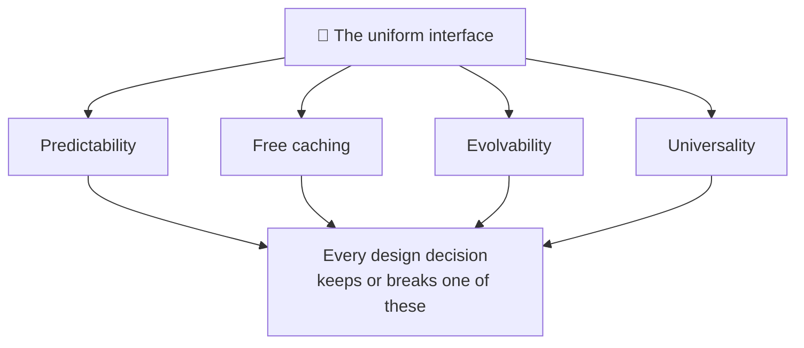

# REST API Design

> **Phase:** APIs & Communication Deep Dives → **Topic:** 4 of 15 → **Read time:** ~55 minutes

---

## Before You Begin

**This document stands alone.** It assumes you have read nothing else — not the foundation series, not the topics before it. Everything is built here from zero: what REST actually promises, how to model resources, how to choose methods and status codes, how to design collections and errors, and how to let an API change without breaking the people using it.

Two consequences of that choice:

- **Terms get defined where they're used** — resource, uniform interface, safe and idempotent methods, pagination. Terms that belong to the underlying protocol are recalled in a clause, not re-taught; this document is about *design decisions*, not the mechanics of HTTP.
- **Neighbouring topics are named, not taught.** The direct REST-versus-GraphQL comparison, GraphQL itself, the mechanism for making retries safe, and the full treatment of API versioning each have their own later topic. Where this document reaches them, it says so and points.

REST is part of the APIs concept in the **Top 30 Must-Know Concepts** foundation series. This is the deep-dive on designing one *well* — which is a different skill from knowing what REST is.

Here is the question the document answers:

> **REST has famous, simple-sounding rules — nouns in the URL, use the right verb, return the right status. So why are so many APIs technically RESTful and genuinely miserable to build against?**

Here's the trap it disarms. REST looks like a set of surface rules you either follow or don't, so people follow the rules — plural nouns, `GET` for reads, `404` for missing — and still produce APIs that are inconsistent, chatty, impossible to evolve, and maddening to debug. Following the rules isn't the same as keeping the *promises the rules exist to protect*. An API can pass every stylistic checklist and still break the properties that made REST worth choosing in the first place.

> **The mindset shift:** stop asking *"is this endpoint RESTful?"* and start asking **"which promise of the uniform interface does this decision keep or break?"** REST's value — that callers can predict it, that reads cache for free, that it can grow without breaking anyone — isn't magic; it comes from a small set of promises the design makes to its callers. Every good decision keeps one; every classic mistake breaks one. Design REST well and you're not memorizing conventions — you're protecting the properties that make the conventions worth having.

---

## Table of Contents

1. [REST as a Set of Promises](#1-rest-as-a-set-of-promises)
2. [Modeling Resources — Nouns, Not Actions](#2-modeling-resources--nouns-not-actions)
3. [URL Structure and Relationships](#3-url-structure-and-relationships)
4. [Choosing the Right Method](#4-choosing-the-right-method)
5. [Choosing the Right Status Code](#5-choosing-the-right-status-code)
6. [Designing Collections — Pagination, Filtering, Sorting](#6-designing-collections--pagination-filtering-sorting)
7. [Designing Errors — The Half of the Contract People Forget](#7-designing-errors--the-half-of-the-contract-people-forget)
8. [Evolving Without Breaking — Compatibility by Design](#8-evolving-without-breaking--compatibility-by-design)
9. [How RESTful Is Enough? — Maturity and Hypermedia](#9-how-restful-is-enough--maturity-and-hypermedia)
10. [Putting It All Together — Designing an Orders API](#10-putting-it-all-together--designing-an-orders-api)
11. [Final Recap](#11-final-recap)

---

## 1. REST as a Set of Promises

Before any rule about URLs or verbs, it's worth asking what REST is actually *for* — because every rule that follows exists to protect something, and you can't design well if you only know the rules and not what they defend.

### What REST Gives You When It's Done Right

**REST** — Representational State Transfer — is a style for designing web APIs around **resources** (the things your system is about — orders, users, products) acted on through a small, uniform set of operations. When it's designed well, a REST API has four properties that make it a pleasure to build against:

- **Predictability.** Once a caller learns how one part works, they can guess the rest. `/orders/42` behaves like `/products/7`; the same verbs mean the same things everywhere.
- **Free caching.** Reads map onto the web's native "fetch this thing" operation, so the existing infrastructure — browsers, proxies, content networks — can cache them with no extra work on your part.
- **Evolvability.** The API can grow and change over years without breaking the callers already depending on it.
- **Universality.** Any language, any tool, a browser, a command-line client can call it with nothing special installed.

These are the reasons to choose REST at all. Lose them and you have the ceremony of REST without the payoff.

### The Reframe — These Are Promises

Here's the shift that turns a pile of rules into a design skill. Each of those four properties is a **promise the API makes to its callers**, and each promise rests on the design honoring a specific constraint:

| Promise | What the caller relies on | Kept by |
|---|---|---|
| **Predictability** | "If I learn one endpoint, I can guess the others" | Consistent resources, verbs, and conventions (§2–§5) |
| **Free caching** | "Reads are cheap and safe to repeat" | Reads that never change state — the *safe* method promise (§4) |
| **Evolvability** | "My integration won't break when they improve the API" | Additive change, no leaked internals (§8) |
| **Universality** | "I can call this from anything, and outcomes are clear" | Standard methods and honest status codes (§4–§5) |

Every rule this document teaches is a way of keeping one of these promises. And — more usefully — every classic REST mistake is a way of *breaking* one:

- Putting a verb in a URL (`POST /createOrder`) breaks **predictability** — now callers can't guess your endpoints, because they're bespoke actions, not uniform resources.
- Returning `200 OK` with an error inside the body breaks **universality** — the standard success signal now lies, so generic clients and caches believe a failure succeeded.
- A `GET` that changes state breaks **free caching** — a cache or a retry will happily repeat it, and now reads have side effects.
- Removing or renaming a field breaks **evolvability** — every caller depending on it shatters at once.

### Why This Framing Beats a Checklist

A checklist tells you *what* to do; it can't tell you what to do when the checklist is silent or two rules seem to conflict. The promises can. Faced with any design question — should this be a `PUT` or a `POST`? one endpoint or two? what status code? — the productive question is *which promise am I protecting, and does this choice keep it?* That reasoning generalizes to decisions no checklist anticipated, which is the difference between following REST and designing it.

> 💡 **Key Insight**
>
> REST's value isn't the conventions — it's four **promises** the conventions protect: predictability, free caching, evolvability, and universality. Design well by asking of every decision *which promise does this keep or break?*, and the famous mistakes stop being arbitrary rule violations and become what they actually are — broken promises to the caller. A checklist tells you the rules; the promises tell you *why*, which is the only thing that helps when the rules run out.

### Quick Recap — REST as a Set of Promises

- REST, done well, delivers four properties: **predictability, free caching, evolvability, universality** — the reasons to choose it.
- Each is a **promise to the caller**, kept by a specific design constraint — and every classic mistake is one of those promises broken.
- Reframing rules as promises turns a checklist into **judgment**: ask *which promise does this decision keep or break?*
- That question generalizes to cases no checklist covers, which is the whole difference between following REST and **designing** it.
