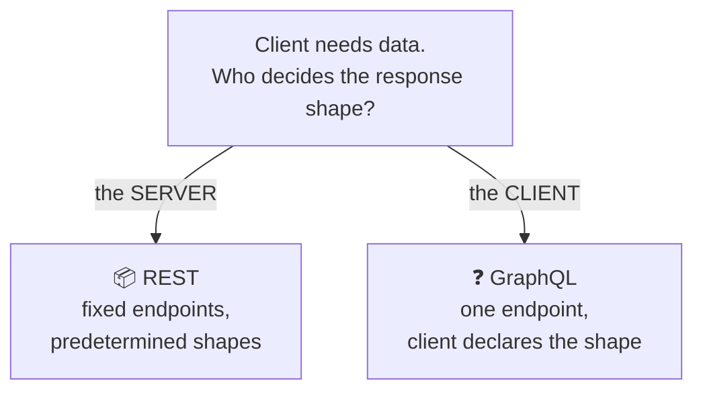
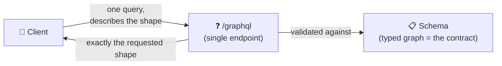

# REST vs GraphQL

> **Phase:** APIs & Communication Deep Dives → **Topic:** 5 of 15 → **Read time:** ~50 minutes

---

## Before You Begin

**This document stands alone.** It assumes you have read nothing else — not the foundation series, not the topics before it. It teaches enough of both REST and GraphQL to compare them honestly, and then does the comparison. If you've only ever built one of the two, this is written for you.

Two consequences of that choice:

- **Terms get defined where they're used** — over-fetching, under-fetching, the query model, partial responses. What you already know, skim.
- **This is a comparison, not a tutorial for either side.** REST's design craft and GraphQL's internals each have their own dedicated topics in this phase. This document teaches each *only to the depth needed to weigh it against the other* — enough to choose well, not enough to build either from scratch. Where it stops short, it says so and points.

REST and GraphQL both appear in the **Top 30 Must-Know Concepts** foundation series. This is the deep-dive on the decision *between* them.

Here is the question the document answers:

> **REST vs GraphQL is argued like a rivalry with a winner. Strip away the tribalism and it's a single design tradeoff — so what is the tradeoff actually about, and which side should you land on?**

Here's the trap it disarms. The debate is usually conducted as identity ("we're a GraphQL shop," "REST is dead," "GraphQL is overkill"), which produces heat and no decision procedure. But the two are not competing products where one is simply better. They are two answers to *one specific question*, and every difference people argue about — efficiency, caching, complexity, error handling — is a downstream consequence of which answer you pick. Once you see the question, the comparison stops being a matter of allegiance and becomes a matter of tracing consequences.

> **The mindset shift:** stop asking *"which is better, REST or GraphQL?"* and start asking **"who should decide the shape of each response — the server or the client — and what does that decision cost on each side?"** That single choice is the whole disagreement. REST lets the server decide what each endpoint returns; GraphQL lets the client declare exactly what it wants. Efficiency, caching, complexity, security — none of them are independent features to score. Each is a *result* of that one inversion, and once you can trace the results, you can choose on evidence instead of taste.

---

## Table of Contents

1. [The One Question Behind the Whole Debate](#1-the-one-question-behind-the-whole-debate)
2. [Enough GraphQL to Judge It](#2-enough-graphql-to-judge-it)
3. [Fetching — Over-, Under-, and Exactly-Right](#3-fetching--over--under--and-exactly-right)
4. [Caching — Where REST Quietly Wins](#4-caching--where-rest-quietly-wins)
5. [Complexity — Who Carries the Weight](#5-complexity--who-carries-the-weight)
6. [Errors, Status, and the Partial-Response Problem](#6-errors-status-and-the-partial-response-problem)
7. [Evolving the Contract](#7-evolving-the-contract)
8. [The Security and Cost Surface](#8-the-security-and-cost-surface)
9. [Choosing — REST by Default, GraphQL When](#9-choosing--rest-by-default-graphql-when)
10. [Putting It All Together — The Same App, Both Ways](#10-putting-it-all-together--the-same-app-both-ways)
11. [Final Recap](#11-final-recap)

---

## 1. The One Question Behind the Whole Debate

Every REST-versus-GraphQL argument you'll ever hear is downstream of a single design decision, and naming it collapses the whole debate into something you can actually reason about.

> **The question is: when a client asks for data, who decides the shape of what comes back — the server, or the client?**

That's it. That is the entire disagreement. The two styles are two answers:

- **REST — the server decides.** The API offers a set of fixed endpoints, each returning a predetermined shape. Ask for `/orders/42` and you get whatever the server decided an order looks like — every field, every time, take it or leave it.
- **GraphQL — the client decides.** The API offers one endpoint and a query language. The client sends a query describing *exactly* the fields it wants, however nested, and the server returns precisely that shape and nothing else.



### Why This Framing Beats a Feature List

The usual way to compare them is a scorecard: efficiency, caching, tooling, complexity, one row each, tally the checkmarks. That approach hides the thing that actually matters — that the rows are *not independent*. They all move together because they all descend from the one decision above.

Consider what follows the moment you hand shape-control to the client:

- The client can ask for exactly what it needs, so **over-fetching and under-fetching disappear** (§3) — a direct win for client-decides.
- But responses are now unique per query, so the **free caching REST gets from fixed, addressable reads collapses** (§4) — a direct loss for client-decides.
- The server must now resolve *any* shape the client composes, so **server complexity rises sharply** (§5) — another cost of client-decides.
- The client can now request something huge or deeply nested, so **a new security and cost surface opens** (§8) — again, straight from client-decides.

None of those are separate features to weigh in isolation. They are four consequences of one cause. That's why "which has better caching?" is the wrong question — caching isn't a feature either team chose, it's what *happens* to caching when you move the shape decision from server to client.

### The Debate Is a Tradeoff, Not a Contest

Seeing the single axis also explains why the argument never ends: there's no winner because the axis has no universally right point. Server-decides is simpler and caches for free but forces the client to take what it's given; client-decides is flexible and precise but pushes cost and complexity onto the server. Which is better depends entirely on whether the flexibility is worth the costs *for your situation* — a question §9 answers, and answers decisively, but only after the consequences are on the table.

The rest of this document is exactly that: walking each consequence of the one inversion, fairly, so the choice in §9 rests on evidence rather than allegiance.

> 💡 **Key Insight**
>
> REST and GraphQL differ on exactly one thing — **who decides the shape of the response, the server or the client** — and every other difference is a *consequence*, not an independent feature. Over-fetching, caching, server complexity, and the security surface all move together because they all descend from that single inversion. This is why scorecards mislead: they present as separate, weighable rows what are really four results of one cause. Find the cause, trace the consequences, and the "religious war" becomes an ordinary engineering tradeoff.

### Quick Recap — The One Question

- The entire debate reduces to one axis: **who decides the response shape** — REST says the **server** (fixed endpoints), GraphQL says the **client** (one endpoint + a query).
- Every other difference — fetching, caching, complexity, security — is a **downstream consequence** of that inversion, not an independent feature.
- This is why **scorecards mislead**: they score as separate what are really results of a single cause.
- There's no universal winner because the axis has no universally right point — it's a **tradeoff**, resolved decisively only against a specific situation (§9).

---

## 2. Enough GraphQL to Judge It

Most readers have used REST, even if they've never named its design rules. Fewer have used GraphQL, so a fair comparison needs a shared picture of what it actually is. This section builds exactly that — no more. GraphQL's full machinery (its type system, how servers resolve queries, its real-time and large-scale features) is a topic of its own; here we cover only what's needed to weigh it against REST.

### One Endpoint, a Query That Mirrors the Answer

A REST API is many endpoints, each a URL naming a resource. A GraphQL API is the opposite: **one endpoint**, and the request carries a *query* describing the data you want. The query's structure mirrors the response's structure — you write the shape you want, and you get that shape back:

```
Query the client sends:          Response the server returns:
{                                {
  order(id: 42) {                  "order": {
    total                            "total": 48.00,
    customer { name }                "customer": { "name": "Ada" },
    items { name price }             "items": [
  }                                    { "name": "Book", "price": 24.00 },
}                                      { "name": "Pen",  "price": 24.00 }
                                     ]
                                   }
                                 }
```

The caller asked for an order's total, its customer's name, and each item's name and price — across what would be three separate things in a resource model — and got precisely those fields, in one request, shaped like the query. Nothing more came back; there was no way to ask for "the whole order" and no way to accidentally receive fields nobody wanted.

### The Schema Is the Contract

GraphQL APIs are defined by a **schema**: a typed description of every object, every field, and how they connect. The client can only ask for what the schema declares, and the schema is what both sides agree on — the equivalent of REST's endpoint list, but expressed as a typed graph of what's available rather than a set of addressable URLs.

Two operation kinds are worth naming, because the comparison later touches both: **queries** read data (the example above), and **mutations** change it. The distinction parallels REST's read-versus-write split; the mechanics of how each is defined and executed belong to GraphQL's own topic.

### What This Section Deliberately Leaves Out

To keep the comparison honest, it's worth being explicit about what's *not* here, because these are exactly the things that make GraphQL substantial to operate — and they get their own full treatment later:

- **How the server fulfills a query** — the resolver layer that turns a requested shape into actual data fetches.
- **The performance trap** that flexibility creates on the server side (§5 names it as a cost; the *fix* is deferred).
- **Real-time and large-scale features** — live updates, combining many services into one graph, precompiled queries.

None of those are needed to answer *"is GraphQL the right choice versus REST?"* — they're needed to *build* a GraphQL server, which is a different question. What §1 established and this section fills in — client-declared shape, one endpoint, a typed schema — is the whole basis for the comparison that follows.



> 💡 **Key Insight**
>
> GraphQL, reduced to what the comparison needs, is three things: **one endpoint**, a **query whose structure mirrors the response** (so the client gets exactly the fields it named), and a **typed schema** that serves as the contract. That's enough to reason about every tradeoff ahead. Everything else about GraphQL — how queries are resolved, how it's scaled and secured in practice — is *operational depth*, not comparison material, and deferring it is what keeps this a fair fight rather than a tutorial wearing a comparison's clothes.

### Quick Recap — Enough GraphQL to Judge It

- GraphQL is **one endpoint** plus a **query** whose shape mirrors the response — the client names exactly the fields it wants and gets those and no others.
- The **schema** — a typed graph of available objects and fields — is the contract, GraphQL's equivalent of REST's endpoint list.
- **Queries** read and **mutations** write, paralleling REST's read/write split.
- Resolvers, the performance trap's *solution*, and real-time/scale features are **deferred** to GraphQL's own topic — not needed to *choose*, only to *build*.
