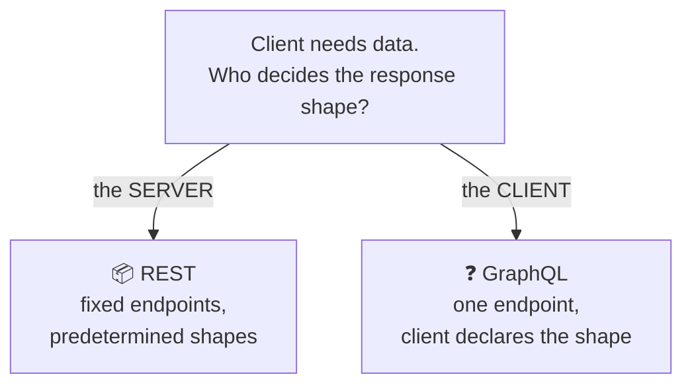
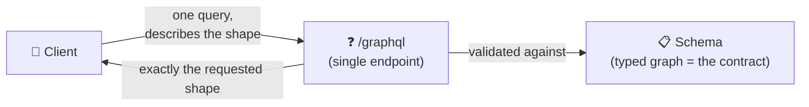
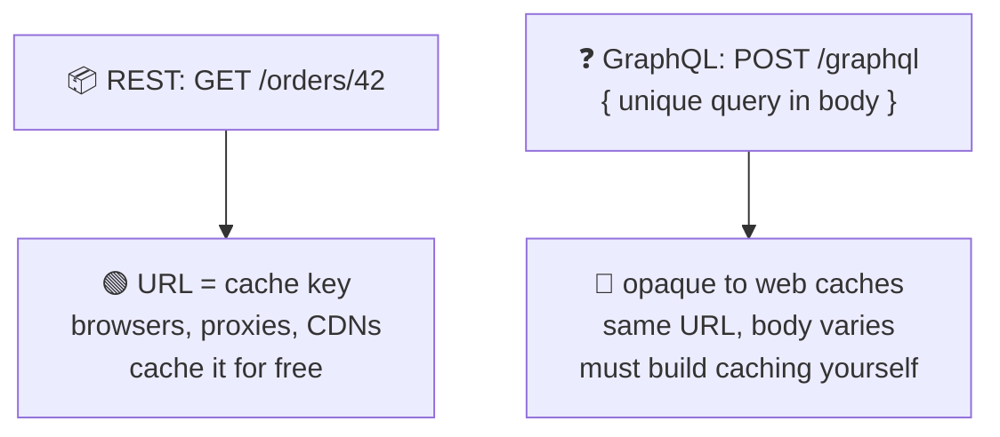
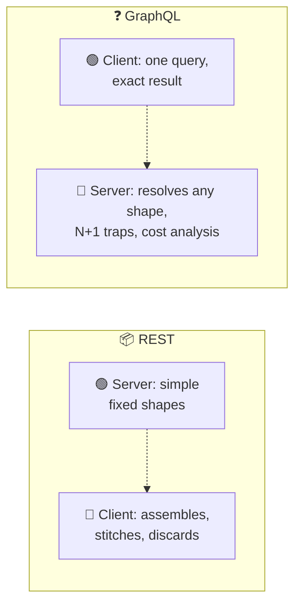
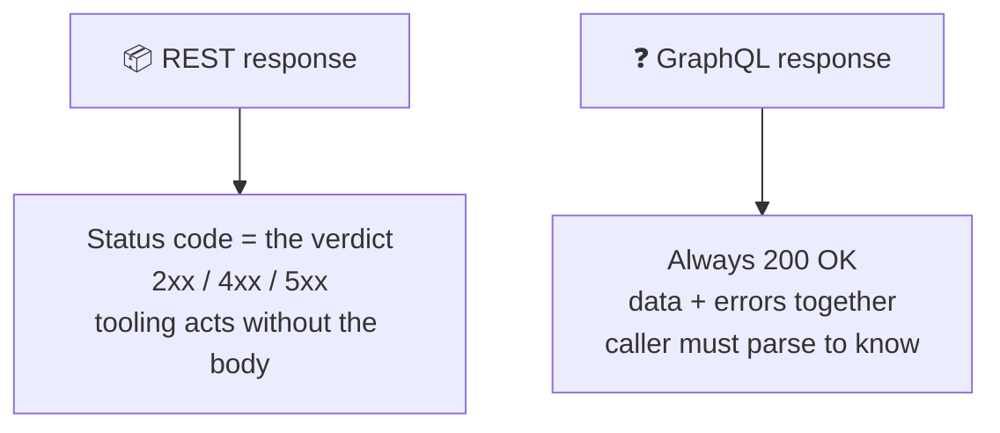
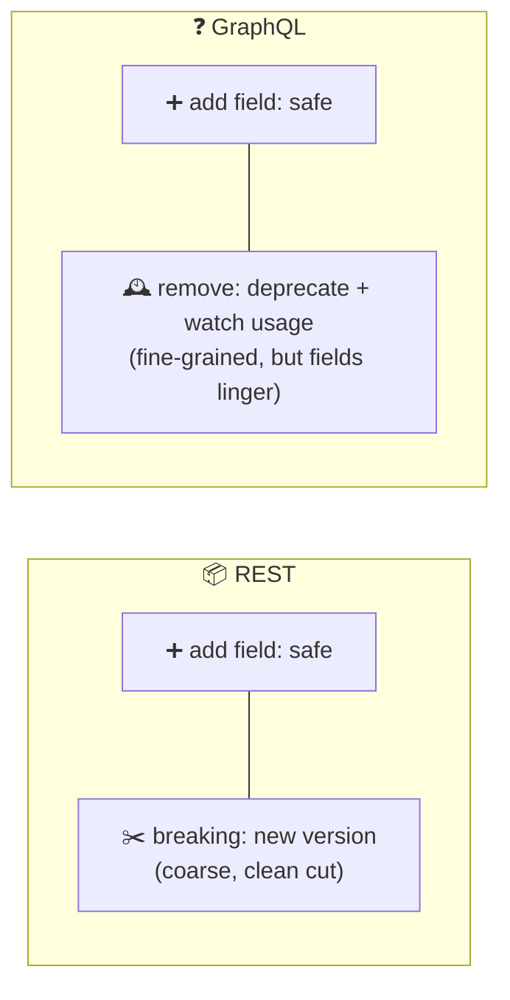

# REST vs GraphQL

> **Phase:** APIs & Communication Deep Dives → **Topic:** 5 of 15 → **Read time:** ~50 minutes

---

## Before You Begin

**This document stands alone.** It assumes you have read nothing else — not the foundation series, not the topics before it. It teaches enough of both REST and GraphQL to compare them honestly, and then does the comparison. If you've only ever built one of the two, this is written for you.

Two consequences of that choice:

- **Terms get defined where they're used** — over-fetching, under-fetching, the query model, partial responses. What you already know, skim.
- **This is a comparison, not a tutorial for either side.** REST's design craft and GraphQL's internals each have their own dedicated topics in this phase. This document teaches each *only to the depth needed to weigh it against the other* — enough to choose well, not enough to build either from scratch. Where it stops short, it says so and points.

REST and GraphQL both appear in the **Top 30 Must-Know Concepts** foundation series. This is the deep-dive on the decision *between* them.

Here is the question the document answers:

> **REST vs GraphQL is argued like a rivalry with a winner. Strip away the tribalism and it's a single design tradeoff — so what is the tradeoff actually about, and which side should you land on?**

Here's the trap it disarms. The debate is usually conducted as identity ("we're a GraphQL shop," "REST is dead," "GraphQL is overkill"), which produces heat and no decision procedure. But the two are not competing products where one is simply better. They are two answers to *one specific question*, and every difference people argue about — efficiency, caching, complexity, error handling — is a downstream consequence of which answer you pick. Once you see the question, the comparison stops being a matter of allegiance and becomes a matter of tracing consequences.

> **The mindset shift:** stop asking *"which is better, REST or GraphQL?"* and start asking **"who should decide the shape of each response — the server or the client — and what does that decision cost on each side?"** That single choice is the whole disagreement. REST lets the server decide what each endpoint returns; GraphQL lets the client declare exactly what it wants. Efficiency, caching, complexity, security — none of them are independent features to score. Each is a *result* of that one inversion, and once you can trace the results, you can choose on evidence instead of taste.

---

## Table of Contents

1. [The One Question Behind the Whole Debate](#1-the-one-question-behind-the-whole-debate)
2. [Enough GraphQL to Judge It](#2-enough-graphql-to-judge-it)
3. [Fetching — Over-, Under-, and Exactly-Right](#3-fetching--over--under--and-exactly-right)
4. [Caching — Where REST Quietly Wins](#4-caching--where-rest-quietly-wins)
5. [Complexity — Who Carries the Weight](#5-complexity--who-carries-the-weight)
6. [Errors, Status, and the Partial-Response Problem](#6-errors-status-and-the-partial-response-problem)
7. [Evolving the Contract](#7-evolving-the-contract)
8. [The Security and Cost Surface](#8-the-security-and-cost-surface)
9. [Choosing — REST by Default, GraphQL When](#9-choosing--rest-by-default-graphql-when)
10. [Putting It All Together — The Same App, Both Ways](#10-putting-it-all-together--the-same-app-both-ways)
11. [Final Recap](#11-final-recap)

---

## 1. The One Question Behind the Whole Debate

Every REST-versus-GraphQL argument you'll ever hear is downstream of a single design decision, and naming it collapses the whole debate into something you can actually reason about.

> **The question is: when a client asks for data, who decides the shape of what comes back — the server, or the client?**

That's it. That is the entire disagreement. The two styles are two answers:

- **REST — the server decides.** The API offers a set of fixed endpoints, each returning a predetermined shape. Ask for `/orders/42` and you get whatever the server decided an order looks like — every field, every time, take it or leave it.
- **GraphQL — the client decides.** The API offers one endpoint and a query language. The client sends a query describing *exactly* the fields it wants, however nested, and the server returns precisely that shape and nothing else.



### Why This Framing Beats a Feature List

The usual way to compare them is a scorecard: efficiency, caching, tooling, complexity, one row each, tally the checkmarks. That approach hides the thing that actually matters — that the rows are *not independent*. They all move together because they all descend from the one decision above.

Consider what follows the moment you hand shape-control to the client:

- The client can ask for exactly what it needs, so **over-fetching and under-fetching disappear** (§3) — a direct win for client-decides.
- But responses are now unique per query, so the **free caching REST gets from fixed, addressable reads collapses** (§4) — a direct loss for client-decides.
- The server must now resolve *any* shape the client composes, so **server complexity rises sharply** (§5) — another cost of client-decides.
- The client can now request something huge or deeply nested, so **a new security and cost surface opens** (§8) — again, straight from client-decides.

None of those are separate features to weigh in isolation. They are four consequences of one cause. That's why "which has better caching?" is the wrong question — caching isn't a feature either team chose, it's what *happens* to caching when you move the shape decision from server to client.

### The Debate Is a Tradeoff, Not a Contest

Seeing the single axis also explains why the argument never ends: there's no winner because the axis has no universally right point. Server-decides is simpler and caches for free but forces the client to take what it's given; client-decides is flexible and precise but pushes cost and complexity onto the server. Which is better depends entirely on whether the flexibility is worth the costs *for your situation* — a question §9 answers, and answers decisively, but only after the consequences are on the table.

The rest of this document is exactly that: walking each consequence of the one inversion, fairly, so the choice in §9 rests on evidence rather than allegiance.

> 💡 **Key Insight**
>
> REST and GraphQL differ on exactly one thing — **who decides the shape of the response, the server or the client** — and every other difference is a *consequence*, not an independent feature. Over-fetching, caching, server complexity, and the security surface all move together because they all descend from that single inversion. This is why scorecards mislead: they present as separate, weighable rows what are really four results of one cause. Find the cause, trace the consequences, and the "religious war" becomes an ordinary engineering tradeoff.

### Quick Recap — The One Question

- The entire debate reduces to one axis: **who decides the response shape** — REST says the **server** (fixed endpoints), GraphQL says the **client** (one endpoint + a query).
- Every other difference — fetching, caching, complexity, security — is a **downstream consequence** of that inversion, not an independent feature.
- This is why **scorecards mislead**: they score as separate what are really results of a single cause.
- There's no universal winner because the axis has no universally right point — it's a **tradeoff**, resolved decisively only against a specific situation (§9).

---

## 2. Enough GraphQL to Judge It

Most readers have used REST, even if they've never named its design rules. Fewer have used GraphQL, so a fair comparison needs a shared picture of what it actually is. This section builds exactly that — no more. GraphQL's full machinery (its type system, how servers resolve queries, its real-time and large-scale features) is a topic of its own; here we cover only what's needed to weigh it against REST.

### One Endpoint, a Query That Mirrors the Answer

A REST API is many endpoints, each a URL naming a resource. A GraphQL API is the opposite: **one endpoint**, and the request carries a *query* describing the data you want. The query's structure mirrors the response's structure — you write the shape you want, and you get that shape back:

```
Query the client sends:          Response the server returns:
{                                {
  order(id: 42) {                  "order": {
    total                            "total": 48.00,
    customer { name }                "customer": { "name": "Ada" },
    items { name price }             "items": [
  }                                    { "name": "Book", "price": 24.00 },
}                                      { "name": "Pen",  "price": 24.00 }
                                     ]
                                   }
                                 }
```

The caller asked for an order's total, its customer's name, and each item's name and price — across what would be three separate things in a resource model — and got precisely those fields, in one request, shaped like the query. Nothing more came back; there was no way to ask for "the whole order" and no way to accidentally receive fields nobody wanted.

### The Schema Is the Contract

GraphQL APIs are defined by a **schema**: a typed description of every object, every field, and how they connect. The client can only ask for what the schema declares, and the schema is what both sides agree on — the equivalent of REST's endpoint list, but expressed as a typed graph of what's available rather than a set of addressable URLs.

Two operation kinds are worth naming, because the comparison later touches both: **queries** read data (the example above), and **mutations** change it. The distinction parallels REST's read-versus-write split; the mechanics of how each is defined and executed belong to GraphQL's own topic.

### What This Section Deliberately Leaves Out

To keep the comparison honest, it's worth being explicit about what's *not* here, because these are exactly the things that make GraphQL substantial to operate — and they get their own full treatment later:

- **How the server fulfills a query** — the resolver layer that turns a requested shape into actual data fetches.
- **The performance trap** that flexibility creates on the server side (§5 names it as a cost; the *fix* is deferred).
- **Real-time and large-scale features** — live updates, combining many services into one graph, precompiled queries.

None of those are needed to answer *"is GraphQL the right choice versus REST?"* — they're needed to *build* a GraphQL server, which is a different question. What §1 established and this section fills in — client-declared shape, one endpoint, a typed schema — is the whole basis for the comparison that follows.



> 💡 **Key Insight**
>
> GraphQL, reduced to what the comparison needs, is three things: **one endpoint**, a **query whose structure mirrors the response** (so the client gets exactly the fields it named), and a **typed schema** that serves as the contract. That's enough to reason about every tradeoff ahead. Everything else about GraphQL — how queries are resolved, how it's scaled and secured in practice — is *operational depth*, not comparison material, and deferring it is what keeps this a fair fight rather than a tutorial wearing a comparison's clothes.

### Quick Recap — Enough GraphQL to Judge It

- GraphQL is **one endpoint** plus a **query** whose shape mirrors the response — the client names exactly the fields it wants and gets those and no others.
- The **schema** — a typed graph of available objects and fields — is the contract, GraphQL's equivalent of REST's endpoint list.
- **Queries** read and **mutations** write, paralleling REST's read/write split.
- Resolvers, the performance trap's *solution*, and real-time/scale features are **deferred** to GraphQL's own topic — not needed to *choose*, only to *build*.

---

## 3. Fetching — Over-, Under-, and Exactly-Right

The first consequence of the shape decision (§1) is about efficiency: how much unwanted data comes back, and how many round trips it takes to assemble what a screen actually needs. This is the dimension GraphQL was built to win, and it wins it cleanly — so it's worth stating fairly and in full before the costs arrive in later sections.

### The Two Failures of Server-Decided Shapes

When the server decides what each endpoint returns (REST), it returns the same fixed shape to everyone. Two mismatches follow, and every REST client lives with some of both:

- **Over-fetching** — the endpoint returns more than this caller needed. A mobile screen wants an order's total and status; `/orders/42` also ships the line items, addresses, timestamps, and internal flags. The extra bytes travel, get parsed, and get discarded. On a phone on a slow network, that waste is felt.
- **Under-fetching** — the endpoint returns less than the screen needs, so the client makes *more calls*. A screen showing an order, its customer, and its items hits three endpoints, often sequentially because one response feeds the next. One screen becomes a cascade of round trips, and round trips are the dominant cost over a network.

```
REST — assembling one screen:
  GET /orders/42            → order (plus fields you didn't want)
  GET /customers/7          → then the customer
  GET /orders/42/items      → then the items
  = 3 round trips, over-fetching on each
```

The two failures pull in opposite directions, which is what makes them hard to design away in REST. Make endpoints richer to cut round trips and you over-fetch more; trim them to stop over-fetching and you force more calls. You can tune the balance — this is real REST design work — but the resource model can't eliminate both at once, because the server is choosing one fixed shape for callers with different needs.

### How Client-Decided Shapes Erase Both

Hand the shape decision to the client and both failures vanish together, because the mismatch that caused them is gone:

```
GraphQL — the same screen:
  POST /graphql
  { order(id: 42) { total status
      customer { name }
      items { name price } } }
  = 1 round trip, exactly the fields named
```

No over-fetching, because the response carries only the requested fields. No under-fetching, because related data across the graph is gathered server-side and returned together. One round trip delivers exactly the screen's data. For a client with precise, varied needs — especially a mobile app over a constrained connection — this is a genuine, measurable improvement, not a marginal one.

| | REST (server-decided shape) | GraphQL (client-decided shape) |
|---|---|---|
| Unwanted fields | Common (over-fetch) | None — you name the fields |
| Round trips per screen | Often several | Typically one |
| Who tunes the balance | The API designer, imperfectly | The client, per query |

### Stating the Win Honestly

This is GraphQL's headline advantage and the reason it exists, so it deserves to be granted without hedging: **for assembling varied, specific data efficiently — especially many-screened frontends over slow networks — client-decided shape is simply better at fetching.** The later sections are not a rebuttal of this; they're the *bill* for it. Efficiency at fetching is exactly what §4 through §8 show you paying for elsewhere. A fair comparison names the win plainly here so the costs later read as tradeoffs, not as gotchas.

> 💡 **Key Insight**
>
> Server-decided shapes force every REST client to live with **over-fetching** (fields it didn't want) and **under-fetching** (extra round trips) — and the two pull in opposite directions, so the resource model can reduce but never eliminate both. Client-decided shapes erase both at once, which is GraphQL's genuine, headline win, most valuable for varied frontends on slow networks. Grant it fully: everything the following sections cost is the price *of* this efficiency, not evidence against it.

### Quick Recap — Fetching

- Server-decided shapes cause **over-fetching** (unwanted fields shipped) and **under-fetching** (many round trips to assemble a screen).
- The two **pull opposite ways**, so REST design can balance but not eliminate them — one fixed shape can't fit callers with different needs.
- Client-decided shapes **erase both together**: exactly the named fields, related data in one round trip — GraphQL's clean, headline advantage.
- The win is real and worth granting plainly; the later sections are the **bill for it**, not a rebuttal of it.

---

## 4. Caching — Where REST Quietly Wins

If §3 was GraphQL's dimension, this is REST's — and it's the mirror image, flowing from the very same inversion. The property that makes client-decided shapes so flexible is exactly what makes them hard to cache, and the fixed shapes that cause REST's over-fetching are exactly what make it cache almost for free.

### Why REST Caches Without Trying

A REST read has two properties that the web's entire caching infrastructure is built around: it's a `GET`, and it's addressed by a URL. `GET /orders/42` names a specific resource, it doesn't change anything, and the same URL means the same thing every time. That's all a cache needs:

- The **URL is the cache key.** Anyone — the browser, a proxy on the path, a content-delivery network at the edge — can store the response under that URL and serve it to the next caller who asks for it.
- Because the read changes nothing, **caching it is safe**, and the infrastructure knows that without understanding your data at all.

The result is layers of caching a REST API gets *for free*, without the application doing anything: a popular `GET` can be served from a cache close to the user and never reach the origin. That's a large performance and cost win, and it's inherited purely from using addressable, unchanging reads.

### Why GraphQL Forfeits It

Now apply the client-decides inversion. A GraphQL request is, by construction, poorly suited to that same machinery:

- It's typically a **`POST`** to a single endpoint (`/graphql`). To the web's caching layers, a `POST` is a write — they won't cache it, and every query hits the same URL, so the URL is useless as a cache key.
- Each query is **potentially unique.** Two clients asking for different field selections send different queries; the same infrastructure can't tell that one response is reusable for another request, because the distinguishing detail is inside the request body, not the URL.



So the free, layered, edge-level caching that REST gets by default is simply not available to GraphQL in the same way. What GraphQL offers instead is a *different* kind of caching — sophisticated client-side caches that understand the graph and cache individual objects by identity. That's genuinely powerful for a single application's own client, but it is application-level machinery you adopt and operate, not the free network-level caching that serves *every* caller from the edge. The two aren't equivalent: one is infrastructure you inherit, the other is a system you run.

### The Symmetry With §3

This is the same tradeoff §3 described, seen from the other side. Fixed server-decided shapes cause over-fetching (§3's cost) *and* enable free caching (this section's win) — both because the response for a given URL is always the same. Client-decided shapes eliminate over-fetching (§3's win) *and* forfeit free caching (this section's cost) — both because the response is now unique per query. You cannot keep the fixed-shape caching and the flexible-shape efficiency at once; they are two faces of the one decision.

That symmetry is the heart of the whole comparison: REST and GraphQL are not better and worse, they are *opposite bets on the same coin*, and caching versus fetching is where the coin shows both faces most clearly.

> 💡 **Key Insight**
>
> REST caches for free because a read is an **addressable, unchanging `GET`** — the URL is a cache key the whole web already knows how to use, from the browser to the edge. GraphQL forfeits that because a client-declared query is a **`POST` with the distinguishing detail in the body**, opaque to that same infrastructure; what it offers instead is powerful *application-level* caching you build and run, not free *network-level* caching you inherit. It's the exact mirror of §3: fixed shapes over-fetch but cache for free, flexible shapes fetch precisely but can't — two faces of the one inversion.

### Quick Recap — Caching

- REST reads are **addressable, unchanging `GET`s**, so the URL is a cache key browsers, proxies, and CDNs use to cache responses **for free**.
- GraphQL is a **`POST` to one endpoint with the query in the body**, opaque to that infrastructure — so free network-level caching is lost.
- GraphQL's answer is **application-level** client caching by object identity — powerful, but machinery you build and run, not free infrastructure you inherit.
- Caching is the exact **mirror of §3**: fixed shapes over-fetch yet cache freely; flexible shapes fetch precisely yet can't — two faces of the same bet.

---

## 5. Complexity — Who Carries the Weight

The shape decision doesn't just move data around — it moves *work* around. Both styles have irreducible complexity; they differ in **who carries it**, the client or the server. This is one of the most decision-relevant consequences, because it determines which team's life gets harder.

### REST Pushes Effort to the Client

With server-decided shapes, the server's job is comparatively simple: each endpoint returns one fixed, known shape, so it's straightforward to build, reason about, and optimize. The complexity lands on the *client*, which must:

- Call multiple endpoints and stitch the results together for a screen (§3's under-fetching).
- Discard the fields it didn't need (§3's over-fetching).
- Orchestrate the sequence when one call depends on another.

That's real work, but it's *distributed* — spread across the many clients, each handling its own assembly — and it's the kind of work client frameworks are good at. The server stays simple, which is a large part of why REST is cheap to operate.

### GraphQL Pulls Effort to the Server

Client-decided shapes invert this. The client's job becomes trivial — write one query, get exactly what you asked for — but that simplicity is *bought* by the server, which must now handle a much harder problem: fulfilling *any* shape the client composes, across the whole graph, in one request.

The server can no longer return one fixed shape. It has to resolve an arbitrary tree of fields the client assembled on the fly, pulling each piece from wherever it lives and assembling it into the requested structure. That flexibility is genuinely hard to implement well, and it introduces a signature performance trap:

> **The N+1 problem:** a single query for "10 orders, and each order's customer" can naïvely become 1 fetch for the orders plus 10 more for the customers — 11 data fetches hiding behind one innocent-looking query. Nest deeper and it multiplies. The client wrote one line; the server did eleven round trips to the database.

The N+1 problem is *named here as a cost*, because it's a real weight on the client-decides side of the ledger. Solving it — batching those fetches so the query stays efficient — is standard but non-trivial server engineering, and it (with GraphQL's other server-side machinery) belongs to GraphQL's own topic. What matters for the comparison is the shape of the trade: **the query that's effortless for the client is exactly the query the server has to work hard to answer safely.**



### Complexity Isn't Removed, It's Relocated

The honest framing: neither style is "simpler" in total. The complexity of turning scattered data into the exact shape a screen needs *has to live somewhere*. REST leaves it on the client (many clients each doing a little); GraphQL concentrates it on the server (one server doing a lot, once, for all clients).

That relocation is itself a real input to the decision. Concentrating the work server-side can be worth it when you have *many* clients — the server solves the assembly problem once instead of every client re-solving it — which is exactly the many-diverse-clients condition that later justifies GraphQL (§9). But when you have few clients, or a small team, you've taken on a hard server to spare clients work they could easily have done, which is a poor trade. Who *should* carry the weight depends on how many clients there are and who you'd rather make wait — which is the choosing question, not a universal answer.

> 💡 **Key Insight**
>
> The complexity of assembling scattered data into a screen's exact shape can't be deleted, only **relocated** — REST leaves it on the (many) clients, GraphQL concentrates it on the (one) server, complete with the N+1 trap that makes an easy query an expensive fetch. So "which is simpler?" has no absolute answer; the real question is *whose* simplicity you're buying and at *whose* expense. Concentrating it server-side pays off precisely when many clients would otherwise each re-solve it — and is a bad bet when few would.

### Quick Recap — Complexity

- The shape decision **relocates work**: REST keeps the server simple and makes the **client** stitch, discard, and orchestrate; GraphQL makes the **client** trivial and the **server** resolve any shape.
- GraphQL's flexibility carries the **N+1 problem** — one easy-looking query becoming many data fetches (named here as a cost; its solution is GraphQL's own topic).
- Neither is simpler overall — assembly complexity **must live somewhere**; the styles differ only in where.
- Concentrating it **server-side pays off with many clients** (solve it once) and is a poor trade with few — an input to the choice (§9), not a universal win.

---

## 6. Errors, Status, and the Partial-Response Problem

Here the two styles diverge in a way that surprises people, because it touches something REST callers rely on without thinking: the idea that a request either succeeded or failed, and the status code says which. Client-decided shapes quietly break that assumption, and the break is worth understanding because it changes how every caller writes error handling.

### REST — One Request, One Verdict

A REST request has a clean outcome model. The response carries a status code whose first digit is a verdict a machine can act on without reading the body: a `2xx` means it worked, a `4xx` means the caller erred, a `5xx` means the server failed. One request, one outcome, and the whole ecosystem — retry logic, monitoring, caches — branches on that code without understanding the payload.

Crucially, a REST response is **all-or-nothing**. You asked for an order; you either got the order (`2xx`) or you got an error (`4xx`/`5xx`). There's no "you got most of the order." That simplicity is why generic tooling can reason about REST failures at all.

### GraphQL — One Request, Many Outcomes

Now apply client-decided shape. A single GraphQL query can ask for many things at once — an order, its customer, its items, a recommendations block. What happens if the items resolve fine but recommendations fail?

The answer breaks the all-or-nothing model. GraphQL typically returns **`200 OK`** — even on failure — with the result carrying *both* a `data` field (the parts that succeeded) and an `errors` array (what didn't):

```
200 OK
{
  "data":   { "order": { "total": 48, "items": [...] , "recommendations": null } },
  "errors": [ { "message": "recommendations service timed out",
               "path": ["order","recommendations"] } ]
}
```

This is **partial response**: some of the query succeeded and some failed, in one answer. It's a genuine capability — one flaky field doesn't sink the whole screen, and the client can render what came back and handle the gap. For a complex screen assembled from many sources, that resilience is real and valuable.

### The Cost — The Status Code Stops Meaning Anything

But look at what it does to the outcome signal. Because a GraphQL response is `200 OK` whether it fully succeeded, partly succeeded, or entirely failed, **the HTTP status code no longer tells the caller what happened.** Everything that relied on that code now has to change:

- **Generic tooling is blinded.** Monitoring that alerts on `5xx` sees `200` during a real outage. Retry logic that retries `5xx` never fires. Caches see success. The entire class of machinery that made REST failures legible (a REST design principle: never return `200` with an error inside) is, in GraphQL, the *normal* behavior.
- **Every client must parse the body to know the truth.** "Did this work?" can only be answered by inspecting the `errors` array and checking which parts of `data` came back `null`. There's no shortcut through the status line.
- **"Success" becomes a spectrum.** Full success, partial success, and total failure all look identical from outside, and the caller has to distinguish them itself, per query, per field.



This isn't GraphQL being wrong — partial response genuinely needs a richer outcome model than a single status code can carry, and there's no clean way to express "half of this worked" in one HTTP status. It's a real consequence to weigh: **GraphQL trades the free legibility of status codes for the ability to return partial results,** and the caller pays for that trade in more sophisticated error handling and the loss of status-code-based tooling.

> ⚠️ **GraphQL turns REST's cardinal error sin into its default.** Returning `200 OK` on failure is exactly what a well-designed REST API must never do, because it blinds every generic client, cache, and monitor — yet it's how GraphQL works by design, because one query can partly succeed and a single status code can't express that. The capability (partial responses that survive a flaky field) is real; so is the price (status codes stop being the outcome signal, and every caller must parse the body to learn what happened). Neither is a bug — but if your ecosystem leans on status-code-based tooling, this is a cost you're taking on with eyes open, or should be.

### Quick Recap — Errors and Partial Responses

- REST outcomes are **all-or-nothing** with a machine-actionable status code — the whole ecosystem branches on it without reading the body.
- GraphQL supports **partial responses** — `data` and `errors` together — so one flaky field doesn't sink a complex screen; a genuine resilience win.
- The cost: GraphQL returns **`200 OK` even on failure**, so the status code stops being the outcome signal and generic tooling (monitoring, retries, caches) is blinded.
- It makes **REST's cardinal sin (200-with-error) the normal behavior** — not a bug, but a real trade of status-code legibility for partial-result capability.

---

## 7. Evolving the Contract

Every API has to change over time without breaking the callers already depending on it. The shape decision (§1) gives the two styles genuinely different evolution stories — and this is one dimension where GraphQL's model is often the *gentler* one, so it's worth crediting fairly.

### REST — Additive Change, Then Versioning

A REST endpoint returns a fixed shape to everyone, which shapes how it evolves:

- **Adding** a field to a response is safe — well-behaved clients ignore fields they don't recognize, so a new field disturbs no one.
- **Removing or renaming** a field is a breaking change, because a fixed shape is returned to *all* callers at once — you can't remove a field for the clients who stopped using it while keeping it for those who haven't.

So REST grows additively as long as it can, and when a genuinely breaking change is unavoidable, it reaches for **versioning** — running an old and new contract side by side (`/v1` and `/v2`) until callers migrate. Versioning is a substantial subject of its own later in this phase; what matters here is that REST's unit of change is the *whole endpoint shape*, so breaking changes tend to be handled at the coarse grain of a version.

### GraphQL — The Client Already Selects, So Removal Gets Gentler

GraphQL's evolution story is different in a way that flows straight from client-declared shape. Because each client explicitly *names the fields it uses*, the server knows — in principle — exactly which fields each query depends on. That enables a notably finer-grained evolution model:

- **Adding** types and fields to the schema is safe and routine, same as REST — existing queries don't select the new fields, so they're unaffected.
- **Removing** a field is handled by **deprecation** rather than a version bump: mark the field deprecated, observe (from the queries actually arriving) who still selects it, help those specific clients move off it, and remove it only once nobody asks for it. Clients that never used the field are never affected at any point.

The key difference: REST changes at the grain of an *endpoint version*; GraphQL changes at the grain of an *individual field*. Because the client's query already declares its exact dependencies, the server can evolve field-by-field and even measure real usage before removing anything — a genuinely gentler path than versioning a whole endpoint. Many GraphQL APIs run for years without ever cutting a "v2," because they never need the coarse tool.

### GraphQL's Evolution Cost — The Deprecation Graveyard

The gentler path has its own price, and honesty requires naming it. Because removal is gradual and depends on clients voluntarily migrating, deprecated fields tend to **accumulate**. A long-lived schema collects a sediment of fields marked deprecated years ago that some forgotten client still selects, so they can never quite be removed. The schema grows a graveyard: technically alive, practically dead, and cluttering the contract. REST's blunter versioning at least offers a clean cut — retire `/v1` entirely on a date — that GraphQL's field-by-field gentleness makes harder to ever fully achieve.



> 💡 **Key Insight**
>
> Because GraphQL clients **declare the exact fields they use**, the server can evolve the contract field-by-field — deprecate, watch who still selects it, remove only when unused — a genuinely gentler model than REST's coarse endpoint-versioning, and often reason enough alone to prefer it for a fast-moving product. The catch is symmetric: gentle, voluntary, usage-driven removal means deprecated fields **linger indefinitely**, so the schema accretes a graveyard REST's blunt "retire v1" can avoid. Finer-grained evolution, harder-to-ever-finish cleanup.

### Quick Recap — Evolving the Contract

- Both styles **add safely** (clients ignore/omit new fields); they differ on removal, which flows from the shape decision.
- **REST** changes at the grain of a whole **endpoint version** — breaking changes mean running `/v1` and `/v2` side by side (versioning is its own later topic).
- **GraphQL** changes **field-by-field**: because clients declare their fields, the server can deprecate, measure real usage, and remove only when unused — often gentler.
- GraphQL's cost is the **deprecation graveyard** — usage-driven removal lets dead fields linger forever, whereas REST's coarse versioning allows a clean cut.
