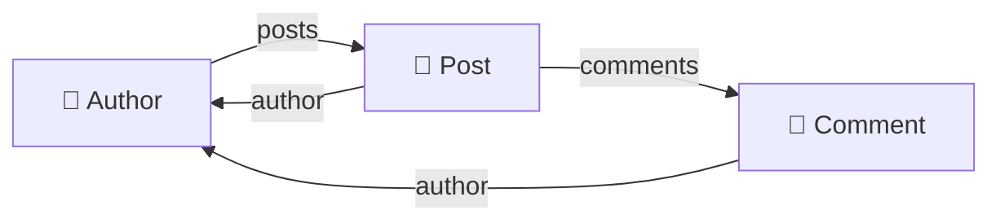
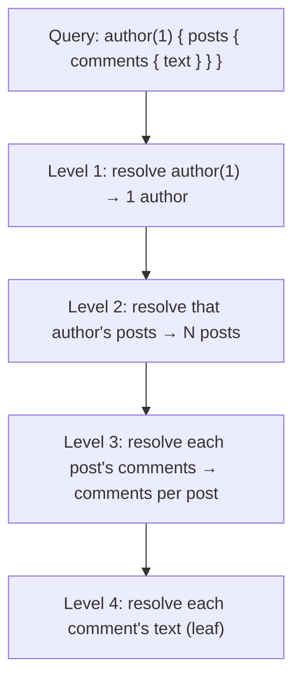
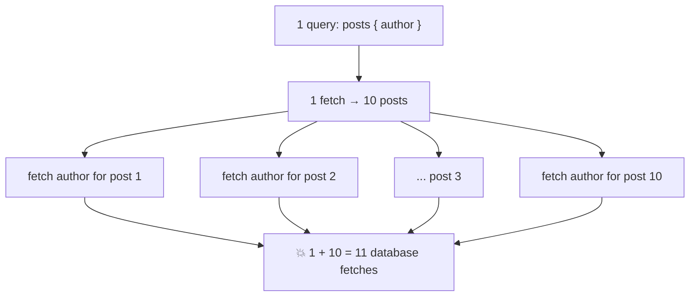
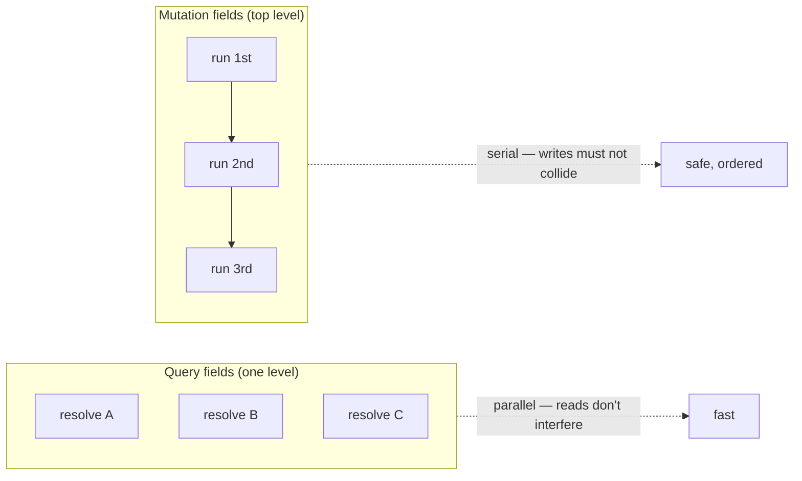
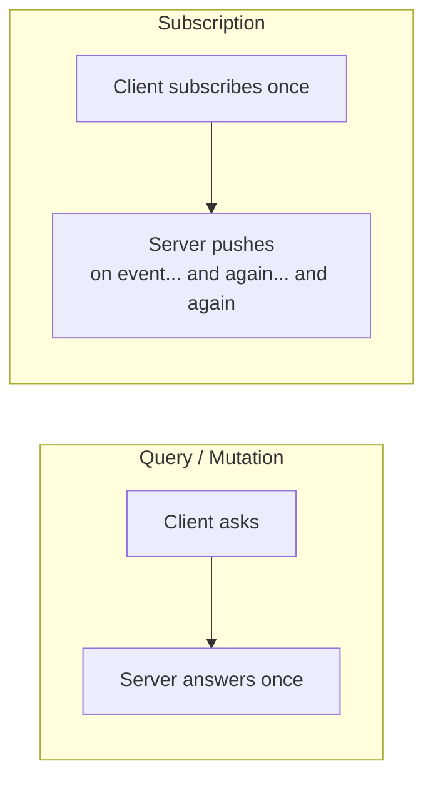
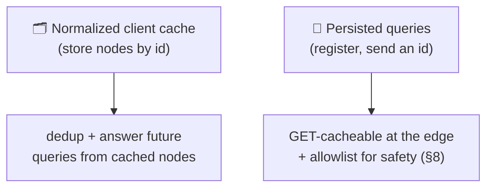
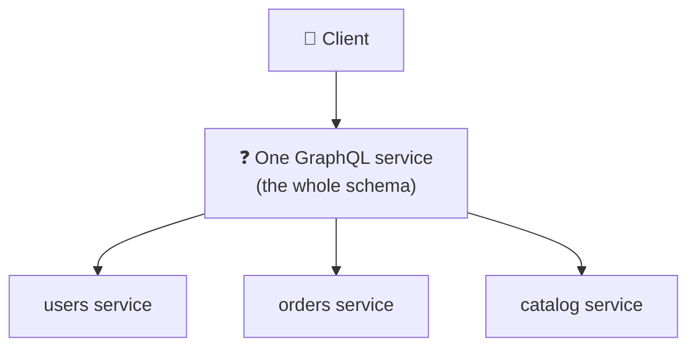
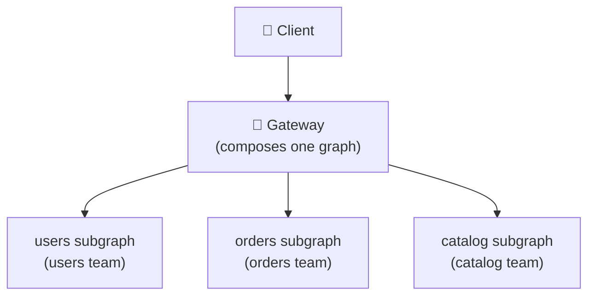
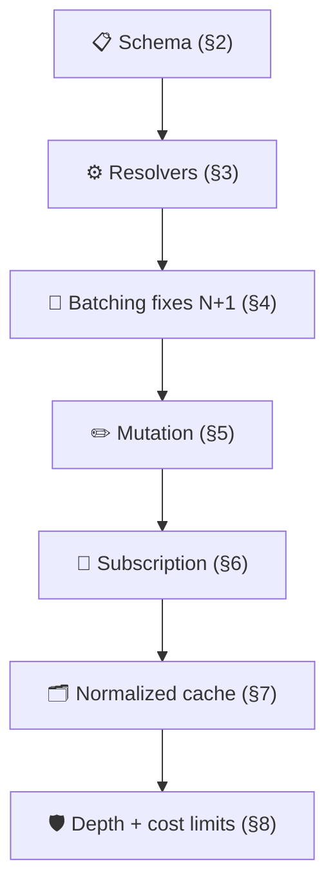

# GraphQL

> **Phase:** APIs & Communication Deep Dives → **Topic:** 6 of 15 → **Read time:** ~55 minutes

---

## Before You Begin

**This document stands alone.** It assumes you have read nothing else — not the foundation series, not the topics before it. It builds GraphQL from zero: what the schema actually is, how a query runs, where the data comes from, and every capability and cost that follows. If you've heard GraphQL is "REST but you pick the fields," this is written to replace that picture with a working one.

Two consequences of that choice:

- **Terms get defined where they're used** — schema, type, field, resolver, the N+1 problem, batching, subscription. Skim what you know.
- **Neighbouring topics are named, not taught.** When to choose GraphQL over REST is a comparison of its own; the persistent-connection transport that subscriptions ride on, and general authentication and rate limiting, each belong to their own topics. This document is about how GraphQL itself works.

GraphQL appears in the **Top 30 Must-Know Concepts** foundation series. This is the deep-dive on its machinery.

Here is the question the document answers:

> **A GraphQL query looks like you're just listing the fields you want. What is actually happening on the server to turn that list into data — and why do the hard parts (performance, caching, safety) all show up at once?**

Here's the trap it disarms. GraphQL is usually first met as *syntax* — a curly-brace query where you name fields, apparently "REST where you choose the response." Learn the syntax and you feel done. But the syntax is the easy ten percent. The actual subject is what the server does with that query: it is walking a **graph**, node by node, along a path the client drew — and schema design, the resolver model, the notorious performance traps, and the caching and safety problems are all consequences of that one fact. Miss it and GraphQL is a bag of disconnected features and gotchas; see it and they're one idea.

> **The mindset shift:** stop reading a GraphQL query as *a list of fields you want* and start reading it as **a path through a graph that the server walks one node at a time.** The schema defines a graph — types are nodes, fields are edges. A query is a traversal the client specifies. A resolver is how the server steps across a single edge. Once you hold that, everything else falls out of it: the N+1 problem is a naive traversal, batching is a smarter one, cost limits bound the traversal, caching remembers visited nodes, mutations are traversals that write, and subscriptions are traversals that re-run. The graph isn't a metaphor in the name — it's the execution model.

---

## Table of Contents

1. [GraphQL Is a Graph You Can Query](#1-graphql-is-a-graph-you-can-query)
2. [The Schema — Defining the Graph](#2-the-schema--defining-the-graph)
3. [Resolvers — Walking the Graph](#3-resolvers--walking-the-graph)
4. [The N+1 Problem — Naive Traversal](#4-the-n1-problem--naive-traversal)
5. [Mutations — Traversals That Change State](#5-mutations--traversals-that-change-state)
6. [Subscriptions — Traversals That Re-Run on Events](#6-subscriptions--traversals-that-re-run-on-events)
7. [Caching Without Free HTTP Caching](#7-caching-without-free-http-caching)
8. [Cost, Depth, and Keeping the Graph Safe](#8-cost-depth-and-keeping-the-graph-safe)
9. [GraphQL Across Many Teams — A Survey](#9-graphql-across-many-teams--a-survey)
10. [Putting It All Together — Building a Small GraphQL API](#10-putting-it-all-together--building-a-small-graphql-api)
11. [Final Recap](#11-final-recap)

---

## 1. GraphQL Is a Graph You Can Query

The name is the whole idea, and it's usually skipped over. GraphQL is not "a query language for JSON" or "REST with field selection" — it is a way of exposing your data *as a graph* and letting clients traverse it. Everything else in this document is a consequence of taking that literally.

### The Data Is a Graph

Think about how real data connects. An author *has* posts. A post *has* an author and *has* comments. A comment *has* an author, who *has* posts. Draw that out and you don't get a list of tables — you get a **graph**: things (nodes) joined by relationships (edges).



GraphQL's premise is to expose that graph directly. The server declares what nodes exist and how they're connected (that declaration is the *schema*, §2), and then a client can enter at some point and walk the connections it cares about.

### A Query Is a Path Through the Graph

Given a graph, a **query** is simply a description of *which path to walk and which fields to collect along the way*:

```
{
  author(id: 1) {          ← enter at this node
    name                   ← collect a field here
    posts {                ← walk the "posts" edge
      title                ← collect a field on each post
      comments {           ← walk the "comments" edge
        text               ← collect a field on each comment
      }
    }
  }
}
```

Read that as a route: *start at author 1, take their name, walk to their posts, take each title, walk to each post's comments, take each text.* The response comes back in exactly the shape of the path, because the path *is* the shape. The client drew a route through the graph and got back precisely what sat along it — nothing more, nothing less.

That's the single endpoint people mention: there's one way in (`POST /graphql`), and the query inside decides where you go. Unlike a set of fixed addresses each returning a fixed shape, there's one entrance to a graph the client then navigates.

### Why This Framing Explains Everything Downstream

Holding "query = graph traversal" makes the rest of the document a series of consequences rather than a list of features:

- **Resolvers** (§3) are *how the server walks a single edge* — the code that, standing on one node, produces the next.
- **The N+1 problem** (§4) is *naive traversal* — walking to each sibling node with a separate fetch.
- **Batching** (§4) is *smarter traversal* — walking a whole level of siblings in one fetch.
- **Cost limits** (§8) *bound the traversal* — because a client can draw an enormous path.
- **Caching** (§7) *remembers visited nodes* so the next traversal can skip re-fetching them.
- **Mutations** (§5) are *traversals that change a node* before reading back.
- **Subscriptions** (§6) are *traversals that re-run when a node changes.*

Every one of those is the same idea seen from a different angle. That's why this document leads with the graph: learn it once, and the "features" stop being separate things to memorize.

> 💡 **Key Insight**
>
> GraphQL exposes your data as a **graph** — types are nodes, fields are edges — and a query is a **path the client walks through it**, collecting fields along the route, so the response matches the path by construction. This isn't wordplay on the name; it's the literal execution model, and it's the key that turns every later topic (resolvers, N+1, batching, caching, cost, mutations, subscriptions) into a consequence of *how a traversal runs* rather than an unrelated feature to learn on its own.

### Quick Recap — GraphQL Is a Graph

- GraphQL exposes data as a **graph**: types are **nodes**, the fields that link them are **edges** — the way real data actually connects.
- A **query is a path** through that graph, collecting fields along the route; the response matches the path's shape by construction.
- There's **one entrance** (`POST /graphql`) and the query decides the route — versus fixed addresses each returning a fixed shape.
- "Query = traversal" is the **execution model**, and every later piece (resolvers, N+1, batching, caching, mutations, subscriptions) is a consequence of it.

---

## 2. The Schema — Defining the Graph

If a query is a traversal (§1), the **schema** is the map that says what can be traversed. It declares every node, every edge, and the type of everything — and it is the single source of truth that both server and client build against. Nothing exists in a GraphQL API unless the schema says it does.

### Types Are Nodes, Fields Are Edges

The schema is written in a small, readable type language. An **object type** is a node; its **fields** are either scalar values (a leaf — a string, a number) or links to other types (an edge to another node):

```graphql
type Author {
  id: ID!
  name: String!
  posts: [Post!]!      # edge: an author links to many posts
}

type Post {
  id: ID!
  title: String!
  author: Author!      # edge: back to the author
  comments: [Comment!]!
}

type Comment {
  id: ID!
  text: String!
  author: Author!
}
```

That's the graph from §1, written down. `name` and `title` are leaves; `posts`, `author`, `comments` are edges the client can walk. The `!` marks a field non-nullable (it will always be present); `[Post!]!` is a non-null list of non-null posts. The type system is doing real work here: it tells every client exactly what's available and what shape it has, before a single query runs.

### The Root Types Are the Entrances

A graph needs entry points — you can't traverse without somewhere to start. GraphQL defines three special **root types**, each an entrance for one kind of operation:

| Root type | The entrance for | What it starts |
|---|---|---|
| `Query` | reads | a traversal that only collects data (§1) |
| `Mutation` | writes | a traversal that changes state first (§5) |
| `Subscription` | live updates | a traversal that re-runs on events (§6) |

```graphql
type Query {
  author(id: ID!): Author      # enter the graph at an author
  posts: [Post!]!              # or at the list of posts
}
```

Every query in §1 started at a field of `Query`. These root fields are the doorways; the rest of the schema is the graph you walk once you're through one.

### The Schema Is the Contract

Because the schema fully describes what's available and its types, it plays the role a list of endpoints plays elsewhere — but richer, because it's a typed, introspectable graph rather than a set of addresses. Two consequences worth naming:

- **It's strongly typed and checkable.** A query can be validated against the schema *before* it runs — ask for a field that doesn't exist, or of the wrong type, and it's rejected up front. Tooling can autocomplete queries and generate typed client code directly from the schema.
- **It's introspectable.** A GraphQL server can be asked to describe its own schema, which is how the interactive explorers and documentation generators work — the API documents itself from the same source of truth clients build against.

### Who Writes It — Schema-First vs Code-First

One practical choice worth naming without dwelling on: teams either write the schema by hand as the starting artifact and make the code conform to it (**schema-first**), or write code with annotations and generate the schema from it (**code-first**). Both end at the same place — a schema that is the contract. Schema-first foregrounds the design and cross-team agreement; code-first keeps schema and implementation from drifting apart. It's a workflow preference, not a difference in how GraphQL runs.

> 💡 **Key Insight**
>
> The schema *is* the graph, written in a type language: object types are nodes, fields are leaves or edges, and three **root types** — Query, Mutation, Subscription — are the only entrances. Because it's a complete, strongly-typed, introspectable description, the schema is the contract clients build against and the thing queries are validated against before they run. Everything a client can ask is exactly what the schema declares — design the schema well and you've designed the API, because in GraphQL the schema is not documentation *of* the API, it *is* the API.

### Quick Recap — The Schema

- The **schema** is the map of the graph, written in a type language: **object types are nodes**, and **fields are leaves (scalars) or edges (links to other types)**.
- Three **root types** — `Query`, `Mutation`, `Subscription` — are the entrances for reads, writes, and live updates respectively.
- The schema is **strongly typed and introspectable**, so queries are validated before they run and tooling generates clients and docs from it.
- The schema **is the contract** (and effectively the API itself); **schema-first vs code-first** is a workflow choice about who writes it, not how it runs.

---

## 3. Resolvers — Walking the Graph

The schema (§2) says what edges *exist*; it says nothing about where the data actually lives. That's the resolver's job. If a query is a path through the graph (§1), a **resolver is the code that walks a single edge** — given one node, it produces the next. Understanding resolvers is understanding how GraphQL actually executes, and it's the piece the syntax hides completely.

### One Field, One Resolver

Every field in the schema has a **resolver**: a function whose job is to produce that field's value. When you're standing on an author node and the query asks for `posts`, the `posts` resolver runs and returns that author's posts. When the query then asks for each post's `title`, the `title` resolver runs for each post.

```
Author.posts    → resolver: given an author, fetch their posts
Post.title      → resolver: given a post, return its title
Post.comments   → resolver: given a post, fetch its comments
```

Crucially, the resolver is *where the data comes from*, and the schema deliberately hides that. A resolver might read a database, call another service, compute a value, or read a field already in memory. The client walking the graph has no idea which — it just sees `posts` linking to `Post`. This is the encapsulation payoff: the graph is a clean, uniform surface, and each resolver independently decides how to satisfy its one edge.

### Execution Walks the Query Level by Level

Here is the part that matters most for everything downstream. The server executes a query by walking it **top-down, level by level**, running the resolvers at each level before descending:



Start at the root: resolve `author(1)` → one author. Then, for that author, resolve `posts` → a list of posts. Then, *for each post*, resolve `comments`. Then, for each comment, resolve the leaf fields. The traversal fans out: one node at level 1, N at level 2, potentially many more at level 3. Each resolver only knows how to get from its node to the next; the engine orchestrates the walk.

This level-by-level, fan-out execution is elegant and it is the source of GraphQL's signature performance trap — because "for each post, resolve its comments" is doing work once per post, and if each does it naively, the fetches multiply. That's §4.

### Resolvers Compose the Whole API

Because each resolver is independent and only responsible for one edge, a GraphQL API is assembled from many small, focused functions rather than a few big endpoint handlers. This has real consequences:

- **The graph can span many data sources** invisibly — `author` from one database, `comments` from another service, a computed field from application logic — all stitched into one seamless traversal, because each resolver fetches from wherever it needs to.
- **Adding a field is adding a resolver**, not touching a monolithic endpoint. The graph grows edge by edge.
- **A field's cost is hidden in its resolver.** `title` might be free (already loaded) while `comments` is an expensive fetch — and the client can't tell from the query which fields are cheap. This invisibility of cost is exactly what §8's safety concerns address.

> 💡 **Key Insight**
>
> A **resolver is the code that walks one edge** — given a node, produce the field's value — and the server executes a query by running resolvers **level by level, fanning out** as the traversal widens. That single model explains GraphQL's power and its dangers at once: resolvers hide where data lives (so one graph can span many sources seamlessly), and the fan-out means work multiplies per node (so a naive resolver at a wide level is the N+1 trap of §4). The query names *what*; the resolvers, walked level by level, are the *how*.

### Quick Recap — Resolvers

- Every schema field has a **resolver**: the function that produces that field's value — and it's where the data actually comes from, hidden behind the edge.
- The server executes a query by walking it **top-down, level by level**, running each level's resolvers and **fanning out** as the traversal widens.
- Resolvers hiding their data source lets **one graph span many databases and services** seamlessly, and lets the API grow one edge at a time.
- The fan-out is the root of the performance trap (§4) and the cost-invisibility that §8 must defend — the same execution model that makes GraphQL powerful.

---

## 4. The N+1 Problem — Naive Traversal

This is GraphQL's most famous failure mode, and with §3's execution model in hand it's no longer a mysterious gotcha — it's the predictable result of walking a fan-out level naively. It's also the clearest proof that the graph framing pays off: the problem *and* its fix are both just facts about traversal.

### How One Query Becomes Many Fetches

Take an innocent query:

```
{
  posts {              # level 1: get the posts
    title
    author { name }    # level 2: for each post, get its author
  }
}
```

Recall the level-by-level fan-out (§3). The engine resolves `posts` once → say 10 posts. Then it descends a level and, *for each post*, runs the `author` resolver. If that resolver does the obvious thing — "given this post, fetch its author from the database" — it runs **ten separate fetches**, one per post.

So the total is **1 fetch for the posts + N fetches for the authors = 1 + N**. That's the name: the **N+1 problem**. One query the client wrote as a single innocent path became eleven trips to the database.



It compounds with depth. `posts { author { posts { comments } } }` fans out at every level, and a naive walk can turn one small query into hundreds or thousands of fetches — a genuine load spike hiding behind a query that reads as trivial. And it's *invisible*: the query text gives no hint of the cost, because cost lives in resolvers (§3), not in the query.

### Why It Happens — Naive Traversal

The root cause is precise: **the fan-out level resolves each sibling node in isolation.** The `author` resolver is called ten times, each knowing only about its own post, so each does its own fetch. Nothing is *wrong* with any single resolver — each correctly fetches one author. The problem is emergent: ten correct individual fetches that should have been one.

That framing points straight at the fix. The waste isn't that authors are fetched — they're needed — it's that they're fetched *one at a time* when they could be fetched *together*.

### Batching — Smarter Traversal

The solution is to walk the whole level at once. Instead of each `author` resolver immediately hitting the database, they **defer**: each says "I need the author for post *X*," the requests are collected across the level, and then a single batched fetch retrieves all the needed authors together.

```
Without batching:  10 resolvers → 10 queries ("author where id = 1", "= 2", …)
With batching:     10 resolvers → collect ids [1..10] → 1 query ("authors where id in [1..10]")
```

The standard implementation of this pattern — collect the keys requested during a tick of execution, then fetch them in one call, then hand each resolver its result — is widely known by the name of the library that popularized it (a "DataLoader"-style loader). The mechanics of a specific implementation belong to hands-on GraphQL work; the *idea* is what matters and it's pure traversal logic: **don't walk siblings one at a time — collect the level and walk it in one step.** A common refinement is to also cache within the request, so asking for the same author twice costs one fetch, not two.

Batching turns 1+N into 1+1: one fetch for the posts, one for all their authors, regardless of how many posts there are.

### It's a Standing Responsibility, Not a One-Time Fix

The important operational truth: N+1 isn't a bug you fix once. Every new edge a client can traverse is a *potential* new N+1, so batching is a discipline applied across the whole graph, not a patch. A GraphQL server is only as fast as its resolvers are batch-aware, and a resolver added without batching quietly reintroduces the trap on its edge. This is a large part of what "operating GraphQL well" actually means day to day.

> ⚠️ **The N+1 problem is the fan-out of §3 walked naively, and it hides in plain sight.** Because each sibling resolver runs in isolation and cost lives in resolvers rather than in the query text, a trivial-looking query can silently become hundreds of database fetches — invisible until the database feels it. The fix is not cleverness but a discipline: **batch every level** (collect the keys, fetch them together), applied to every edge, forever. A GraphQL API without batching isn't slightly slower — it's a load test its own clients can trigger by accident.

### Quick Recap — The N+1 Problem

- **N+1** is the level-by-level fan-out (§3) walked naively: resolving `posts` (1 fetch) then each post's `author` separately (N fetches) = **1 + N**, compounding with depth.
- It's **invisible in the query text** because cost lives in resolvers, not the query — a trivial-looking path can become hundreds of fetches.
- The cause is siblings resolved **in isolation**; the fix is **batching** — collect a level's keys and fetch them in one call (the "DataLoader" pattern), turning 1+N into 1+1.
- Batching is a **standing discipline across every edge**, not a one-time fix — each un-batched resolver silently reintroduces the trap.

---

## 5. Mutations — Traversals That Change State

Everything so far has been reading — walking the graph to collect data. But clients also need to *change* things, and GraphQL handles writes through **mutations**. In the graph framing, a mutation is a traversal that changes a node before reading back from it — write first, then walk.

### A Separate Entrance for Writes

Writes enter through the `Mutation` root type (§2), deliberately separate from `Query`:

```graphql
type Mutation {
  createPost(title: String!, body: String!): Post!
  publishPost(id: ID!): Post!
}
```

```
mutation {
  createPost(title: "GraphQL", body: "...") {
    id            # ← after the write, read back from the new node
    title
    author { name }
  }
}
```

The write happens (a post is created), and then — this is the elegant part — the mutation *returns a node in the graph*, and the client traverses it exactly like a query. So a single mutation both changes state and reads back whatever shape the client needs of the result, in one round trip. Create a post and get back its id, its title, and its author's name together; no follow-up read required.

### Why a Separate Root Type

The read/write split isn't cosmetic — it carries a real execution guarantee. Recall that query fields at the same level fan out and can be resolved *in parallel* (§3), because reads don't interfere. Writes can't be treated that way: if a client sends several mutations in one request, running them concurrently could let them stomp on each other.

So GraphQL makes one guarantee that queries don't have: **top-level mutations execute in series, in the order written.** Send `createPost` then `publishPost` in one request and the create is guaranteed to finish before the publish begins. Putting writes behind their own root type is what lets the engine apply this rule — reads parallelize, writes serialize — and it's why "why not just use a query field that happens to write?" has a real answer: the engine treats the two roots differently on purpose.



### Return the Changed Graph

The strong convention — and it flows straight from §1's "response matches the path" — is that a mutation **returns the part of the graph it changed**, so the client re-reads updated state in the same request. Create returns the created object; update returns the updated object; even a delete typically returns something useful (the deleted id, or the parent collection). This lets a client keep its own view consistent without a separate fetch, and it's how a normalized client cache (§7) stays current after a write.

A note on what mutations *don't* solve, kept brief because it belongs to other topics: a mutation is still a network call that changes state, so it inherits the ordinary hazards of any such call — a lost response can't tell the client whether the write happened, which is the retry-and-duplication problem general to all write APIs. GraphQL doesn't have a special answer here; the safe-retry mechanism is the same one any write endpoint needs, and it's covered where that concern lives rather than being GraphQL-specific.

> 💡 **Key Insight**
>
> A **mutation is a traversal that writes first, then reads back** — it changes a node and returns it, so one round trip both performs the change and fetches whatever shape of the result the client wants. Writes live behind their own root type for a concrete reason: it lets the engine **serialize top-level mutations** (in order, no collisions) while queries stay parallel. And the return-the-changed-graph convention is what keeps a client's local view consistent after a write without a follow-up fetch.

### Quick Recap — Mutations

- A **mutation** is a write that enters through the `Mutation` root type, then **reads back** from the changed node — one round trip changes state *and* returns the result shape.
- Writes get a **separate root type** so the engine can **run top-level mutations in series** (ordered, non-colliding), while query fields resolve in parallel.
- The convention is to **return the changed part of the graph**, letting the client refresh its view in the same request (and keep a client cache current, §7).
- A mutation is still a state-changing network call, so it inherits the general **retry/duplication** hazard — GraphQL has no special fix; that concern lives in its own topic.

---

## 6. Subscriptions — Traversals That Re-Run on Events

Queries and mutations are both request-response: the client asks, the server answers once, done. But some data changes and the client needs to *keep* seeing it — a live comment feed, a moving price, a notification. That's **subscriptions**, the third root type, and in the graph framing a subscription is a traversal that re-runs whenever a node changes.

### The Shape of a Subscription

A subscription looks almost exactly like a query — same field-selection traversal — but with a different meaning: instead of "walk this once and return," it's "walk this *every time the underlying thing changes* and push me the result."

```graphql
type Subscription {
  commentAdded(postId: ID!): Comment!
}
```

```
subscription {
  commentAdded(postId: 42) {
    text
    author { name }     # ← same graph traversal as a query
  }
}
```

The client subscribes once. Then, each time a new comment is added to post 42, the server runs that traversal for the new comment and **pushes** the result to the client — `text` and `author { name }`, shaped by the same path logic as any query. It's a query that fires repeatedly, triggered by events rather than by the client asking.

### Why This Needs Something Request-Response Doesn't Have

Queries and mutations work over an ordinary request-response exchange: one request, one response, connection done. A subscription can't — the whole point is the server sending data *later*, unprompted, possibly many times, over a long period. That requires a **persistent connection**: a channel held open so the server can push messages whenever events occur, rather than only answering when asked.



That persistent, server-pushes channel is its own substantial subject — how the connection is established, kept alive, scaled, and recovered — and it's the topic that comes next in this phase. Here the point is only the boundary: **GraphQL defines the subscription as a graph traversal triggered by events; the transport that carries the pushes is a separate mechanism** this document names and hands off rather than teaches.

### When Subscriptions Earn Their Cost

Subscriptions are powerful and genuinely more complex to operate than queries — a persistent connection per subscribed client is real state the server must hold and scale, unlike the stateless request-response of queries. So they're worth it under specific conditions, and wasteful otherwise:

- **Use them** when data genuinely changes and the client must reflect it *promptly without asking* — chat, live dashboards, collaborative editing, presence.
- **Don't use them** for data that changes rarely or where a short delay is fine; there, having the client simply re-query on an interval (polling) is far simpler and avoids the persistent-connection cost entirely.

The honest guidance mirrors the general rule for real-time features: reach for a pushed, persistent channel only when the interaction truly requires it, because the operational weight is real. A subscription that could have been an occasional poll is complexity you're paying for and not using.

> 💡 **Key Insight**
>
> A **subscription is a query that re-runs on an event and pushes the result** — the same graph traversal as a read, but triggered by change rather than by the client asking. That "server sends later, repeatedly" behavior is exactly what request-response can't do, so subscriptions require a **persistent connection**, which is a separate mechanism (and the next topic). Because that connection is real per-client state to hold and scale, subscriptions earn their cost only for genuinely live data — anything a periodic poll would serve is cheaper polled.

### Quick Recap — Subscriptions

- A **subscription** is the third root type: a query-shaped traversal that **re-runs on an event** and **pushes** the result to the client, rather than answering once.
- It needs what request-response lacks — a **persistent connection** so the server can send data later, repeatedly — which is its own mechanism and the **next topic** (named, not taught here).
- Subscriptions hold **real per-client state**, so they're heavier to operate than stateless queries.
- Use them for **genuinely live data** (chat, dashboards, collaboration); prefer **polling** when changes are rare or a short delay is acceptable.

---

## 7. Caching Without Free HTTP Caching

GraphQL gives up something REST gets for free, and it's worth being honest about the loss before showing what replaces it. A REST read is a `GET` at a stable URL, so the whole web — browsers, proxies, content networks — can cache it using the URL as the key, at no effort. GraphQL forfeits that entirely, and its answer is a *different kind* of caching that you build rather than inherit.

### Why the Free Caching Is Gone

Two facts from earlier sections combine to kill URL-based caching:

- Every GraphQL request hits **one endpoint** (§1), usually by `POST`. To caching infrastructure, one URL means no way to tell responses apart, and a `POST` reads as a write it won't cache anyway.
- Every query can be **unique** — different field selections, different arguments — so even if the infrastructure looked inside, two requests to "the same place" legitimately want different data.

The URL is no longer the cache key because the URL no longer identifies the response — the query does, and it's in the body. Whatever REST inherited from the network, GraphQL has to reconstruct itself. There are two answers, at two different layers.

### The Normalized Client Cache — Cache Nodes, Not Responses

The dominant answer works *with* the graph rather than against it, and it's a direct payoff of §1's framing. Instead of caching whole responses (which are all unique), the client caches **individual nodes by identity**.

The idea: give every object a globally unique identifier, and when a response comes back, the client cache **normalizes** it — it breaks the nested response apart into its individual objects and stores each one under its id, like rows in a table rather than a nested document.

```
Response:  { post(1) { title, author { id: 7, name: "Ada" } } }
Cache stores:   Post:1   → { title, author → ref(Author:7) }
                Author:7 → { name: "Ada" }
```

Now two payoffs follow. First, **deduplication**: if Author 7 appears in fifty different posts' responses, it's stored once, and every reference points at the same cached node. Second, and this is the elegant part, a *new* query can be **answered partly or entirely from cache** without hitting the server — if the client already holds every node the query's path visits, it can assemble the response from cached nodes alone. The cache isn't storing answers; it's storing the graph, and reassembling answers from it. That's caching that matches the execution model: remember visited nodes, and future traversals reuse them.

This is also why mutations return the changed node (§5): the mutation's result flows into the normalized cache by id, updating that node everywhere it's referenced at once — every view showing Author 7 refreshes from one write.

### Persisted Queries — Getting Some Network Caching Back

The second answer claws back a little of what was lost at the network layer. A **persisted query** registers a query with the server ahead of time under a short identifier; the client then sends just the identifier (and any variables) instead of the full query text.

That small change enables things the raw `POST`-with-body couldn't:

- The request becomes small and, crucially, can be sent as a **`GET` with the id in the URL** — which means network caches and content networks can cache it again, by that stable id. Some of REST's free edge caching returns.
- The server can maintain an **allowlist**: only pre-registered queries are permitted, so clients can't submit arbitrary (or arbitrarily expensive) queries — a safety benefit that §8 builds on.



### The Honest Trade

Both answers are real and effective, but note what they are: caching you **implement and operate**, not caching you **inherit**. REST's edge caching works with zero application code because the URL-as-key convention is baked into the web; GraphQL's normalized cache is a client-side system you adopt, and persisted queries are a build-and-registration step you set up. The capability is comparable — arguably richer, since node-level caching dedups in ways URL caching can't — but the effort is yours. This is the caching face of the recurring GraphQL trade: client flexibility is paid for in machinery you build.

> 💡 **Key Insight**
>
> GraphQL forfeits REST's free URL-based caching (one `POST` endpoint, unique queries) and replaces it with two things you build: a **normalized client cache** that stores *nodes by id* — deduplicating shared objects and answering future traversals from cached nodes, caching that matches the graph model — and **persisted queries** that register a query under an id so it can be `GET`-cached at the edge and allowlisted for safety. Richer than URL caching in some ways, but machinery you operate rather than infrastructure you inherit — the caching face of GraphQL's standing trade.

### Quick Recap — Caching

- GraphQL loses REST's **free URL-based caching** because it's one `POST` endpoint with the response identified by the query in the body, not the URL.
- The **normalized client cache** stores **nodes by global id** — deduplicating shared objects and answering future queries from cached nodes, and it's how mutation results (§5) refresh every view at once.
- **Persisted queries** register a query under an id, so it can be sent as a **`GET`** (edge-cacheable again) and **allowlisted** for safety (§8).
- Both are caching you **build and operate**, not inherit — richer than URL caching in places, but the effort is yours: GraphQL's standing "flexibility costs server-side machinery" trade.

---

## 8. Cost, Depth, and Keeping the Graph Safe

Handing the client control of the traversal (§1) is GraphQL's defining move, and it has a defining danger: **the client can draw a path far more expensive than you intended.** A REST endpoint's cost is fixed by the server that wrote it; a GraphQL query's cost is chosen by whoever writes the query. Left undefended, that's a denial-of-service surface built into the design — so bounding the traversal is not optional hardening, it's core operation.

### The Client Sets the Cost

Two properties from earlier sections combine into the risk. Cost lives in resolvers, invisibly (§3), and the client composes the traversal freely (§1). So a client can write a query whose *text* is short but whose *execution* is enormous:

- **Depth.** If the graph has cycles — an author has posts, a post has an author, who has posts — a client can nest the traversal arbitrarily deep: `author { posts { author { posts { author { … } } } } }`. Each level multiplies the work; a few dozen lines can demand astronomical execution.
- **Breadth.** A single query can select huge swaths of the graph — every field of thousands of objects — in one request that looks innocuous.

```
# short to write, potentially ruinous to run
{ authors { posts { comments { author { posts { comments { text }}}}}} }
```

The server that would never *write* such an expensive endpoint can be *asked* to perform one, because it delegated the query shape to the client. This is the flip side of every advantage in this document.

### Bounding the Traversal

The defenses are all forms of "limit how far and how much a traversal may go," and a production GraphQL API generally needs several together:

| Defense | What it does |
|---|---|
| **Depth limiting** | Reject queries nested beyond a set number of levels — kills the cyclic-nesting attack outright |
| **Complexity scoring** | Assign each field a cost, sum the query's total *before executing*, and reject anything over a budget |
| **Query timeouts** | Cap wall-clock execution, so a query that slips through other limits still can't run forever |
| **Persisted-query allowlists** | Only permit pre-registered queries (§7), so clients can't submit arbitrary shapes at all |

The most important idea is **complexity scoring before execution**: because the server can analyze a query's shape against the schema *without running it* (the schema is typed and the query is validated up front, §2), it can estimate cost and refuse an over-budget query before a single resolver fires. That pre-execution analysis is something GraphQL's typed, inspectable query model uniquely enables — the query plan is knowable in advance.

The strongest posture, where feasible, is the persisted-query allowlist (§7): if clients may *only* run queries you registered, the whole "arbitrary expensive query" surface closes — you've traded some of GraphQL's ad-hoc flexibility for the guarantee that every query is one you vetted. Many large GraphQL deployments do exactly this in production for that reason.

### What Belongs Elsewhere

Two adjacent concerns are worth placing, briefly, so the boundary is clear. **Authorization** — who may see which fields — is a real GraphQL concern (field-level access control is often needed, since one query can reach across the graph), but the general machinery of authentication and authorization is its own subject later in the curriculum; here it's enough to know the graph needs it *per field*, not just per endpoint. And general **rate limiting** by request count is the ordinary API defense every interface needs — GraphQL's twist is only that counting requests is insufficient (one query can equal a thousand REST calls' work), which is exactly why *cost*-based limiting above exists alongside it.

> ⚠️ **In GraphQL the client sets the query's cost, so an undefended graph is a denial-of-service surface by design.** A short query can nest through cycles or fan across the whole graph into astronomical execution, and it's invisible in the text because cost lives in resolvers. The defenses — depth limits, **complexity scoring before execution**, timeouts, and (strongest) persisted-query allowlists — are not optional hardening but core operation, because the very flexibility that makes GraphQL powerful is the thing that must be bounded. If you take away one rule: score query cost *before* you run it.

### Quick Recap — Cost, Depth, and Safety

- Because the **client composes the traversal** and cost hides in resolvers, a short query can be ruinously **deep** (through cycles) or **broad** — a built-in denial-of-service surface.
- The core defenses: **depth limiting, complexity scoring before execution, query timeouts, and persisted-query allowlists** — usually several together.
- **Scoring cost before executing** is the key move, enabled by GraphQL's typed, up-front-validated query model — refuse over-budget queries before any resolver runs.
- **Field-level authorization** is a genuine GraphQL need (one query reaches across the graph); general auth and count-based rate limiting are their own topics, with cost-based limiting the GraphQL-specific twist.

---

## 9. GraphQL Across Many Teams — A Survey

Everything so far assumed one graph, served by one system, owned by one team. That holds for a single service and it's where most of the value and all of the mechanics live. But GraphQL's biggest selling point — *one unified graph a client can traverse* — runs into an organizational wall at scale: in a large company, the data lives across dozens of services owned by dozens of teams. This section surveys how that's reconciled. It's a **map, not a manual** — the mechanics are a substantial subject of their own, and the goal here is to answer "how does this scale across teams?" honestly, not to teach the implementation.

### The Tension

A client wants one graph: enter anywhere, traverse everywhere, one request. But no single team owns "everything" — the users service owns users, the orders service owns orders, the catalog team owns products. If GraphQL's promise is a unified graph, *someone* has to compose those separately-owned pieces into one traversable whole. There are two broad answers, and they trade the same way most centralize-vs-distribute choices do.

### Approach 1 — One Monolithic Schema

The simplest answer: a single GraphQL service holds the whole schema, and its resolvers call out to the various backend services to fetch data.



It's straightforward and keeps the whole graph in one place — easy to reason about, one deployment. The cost is organizational: every team that wants to add or change part of the graph must go through that one service and its owners, which becomes a bottleneck and a coordination point as teams multiply. The graph is unified but its ownership is centralized, which fights how large orgs actually work.

### Approach 2 — Federation

The more sophisticated answer keeps the *client's* view of one unified graph while letting each team own and serve *its slice* independently. Each team runs a **subgraph** — a GraphQL service for its own types — and a **gateway** composes those subgraphs into one graph the client sees as seamless. A query that spans users and orders is planned by the gateway, split across the relevant subgraphs, and reassembled.



This is called **federation**, and its appeal is that it aligns the graph with the org: the client still gets one graph, but each team ships its part on its own schedule without a central bottleneck. The cost is real machinery — the gateway must plan cross-subgraph queries, the subgraphs must agree on how shared types link, and the whole thing is meaningfully more complex to operate than one service. Getting it right is a genuine specialty.

### Where This Document Stops

That's deliberately as far as this goes. Federation's mechanics — how subgraphs declare shared types, how the gateway plans and stitches a cross-service query, how it's versioned and operated — are a large topic in their own right, well beyond a single service's GraphQL. The honest summary a reader needs: **GraphQL scales across teams either by centralizing the schema in one service (simple, bottlenecked) or by federating subgraphs behind a gateway (aligned with team ownership, more complex).** Which to reach for follows the same logic as any centralize-vs-distribute decision — start centralized while it's small, move to federation when team-ownership bottlenecks justify the added machinery.

> 💡 **Key Insight**
>
> GraphQL's "one unified graph" collides with the reality that data is owned by many teams, and there are two answers: a **monolithic schema** (one service holds everything — simple, but a central bottleneck) or **federation** (each team owns a subgraph, a gateway composes them — aligned with ownership, but real added machinery). It's the familiar centralize-versus-distribute tradeoff wearing a GraphQL costume: start with one schema while it's small, federate when the coordination cost of a single owning team outweighs the operational cost of a gateway. The mechanics are their own subject; the choice is the point.

### Quick Recap — GraphQL Across Many Teams

- GraphQL promises **one unified graph**, but in a large org the data is owned by **many teams and services** — someone must compose the pieces.
- A **monolithic schema** (one service, calling backends) is simple but becomes a **central bottleneck** as teams multiply.
- **Federation** lets each team own a **subgraph** behind a composing **gateway** — aligned with ownership, at the cost of real added machinery.
- It's the standard **centralize-vs-distribute** tradeoff; the mechanics are a large subject of their own, surveyed here rather than taught.

---

## 10. Putting It All Together — Building a Small GraphQL API

A team builds a GraphQL API for a blog. Following the sections in order, watch the whole machine assemble — and watch each "feature" reveal itself as a fact about the graph.

### Step 1 — Design the Schema (§2)

They start where GraphQL always starts: the schema, because the schema *is* the API (§2). They write the graph — authors, posts, comments — as types (nodes) with fields that are either leaves or edges:

```graphql
type Author { id: ID!  name: String!  posts: [Post!]! }
type Post   { id: ID!  title: String!  author: Author!  comments: [Comment!]! }
type Comment { id: ID!  text: String!  author: Author! }
type Query  { post(id: ID!): Post  posts: [Post!]! }
```

The graph from §1, made concrete. A client can now enter at `post` or `posts` and traverse outward.

### Step 2 — Write Resolvers (§3)

Each field gets a resolver (§3) — the code that walks that edge. `Query.posts` fetches posts; `Post.author` fetches a post's author; `Post.comments` fetches its comments. The blog's data happens to live in one database, but the resolvers hide that: the client sees only a clean graph.

A query runs, and it works:

```
{ posts { title  author { name } } }
```

### Step 3 — Hit N+1, Fix With Batching (§4)

In testing with a handful of posts, it's fine. On the real blog with hundreds, the database lights up: that innocent query is running one `author` fetch *per post* — the N+1 problem (§4), the fan-out walked naively. They add a **batching loader** for `Post.author`: the ids are collected across the level and fetched in one query, turning 1+N into 1+1. The query text never changed; the traversal got smarter.

### Step 4 — Add a Mutation (§5)

Readers need to comment, so they add a write through the `Mutation` root (§5), returning the created comment so the client re-reads it in one round trip:

```
mutation { addComment(postId: 42, text: "Great post") { id  text  author { name } } }
```

### Step 5 — Add a Subscription for Live Comments (§6)

The blog wants comments to appear live. That's a subscription (§6) — a query-shaped traversal that re-runs when a comment is added and pushes the result. They implement it, noting that it needs a persistent connection, whose transport is the next topic — they'll lean on that mechanism, not build it here.

### Step 6 — Cache and Bound Before Launch (§7, §8)

Two things before going public. They add a **normalized client cache** (§7) so an author appearing across many posts is stored once and re-renders everywhere from a single mutation result. And they add **depth limiting and complexity scoring** (§8), because the moment the API is public, a client can write `post { author { posts { author { posts { … }}}}}` and the cyclic graph would let one query melt the database. The traversal must be bounded before strangers can draw it.



### The Payoff

The finished API is a graph clients can traverse precisely, backed by batch-aware resolvers, extended by mutations and a live subscription, cached by node identity, and bounded against abuse. Every step was the same underlying idea — the schema is a graph, a query walks it — seen from a different angle. The team never learned six unrelated features; they learned one model and met its consequences in order.

The lesson they write down:

> **We thought we were learning GraphQL's features — schema, resolvers, mutations, subscriptions, caching, security — and kept finding they were the same fact restated. The schema is the graph. A query walks it. A resolver is one step of the walk. N+1 is walking badly; batching is walking well; cost limits bound the walk; the cache remembers the walk; mutations walk and write; subscriptions re-walk on change. Once we stopped seeing a feature list and started seeing one traversable graph, GraphQL got small.**

---

## 11. Final Recap

| Piece | What it is | In graph terms |
|---|---|---|
| **Schema** (§2) | The typed definition of the API | The map: types are nodes, fields are edges |
| **Query** (§1) | A client's field selection | A path drawn through the graph |
| **Resolver** (§3) | Code that produces a field's value | How the server walks one edge |
| **N+1** (§4) | 1 + N fetches from a fan-out level | Walking siblings one at a time |
| **Batching** (§4) | Collect a level's keys, fetch once | Walking a whole level in one step |
| **Mutation** (§5) | A write that returns the result | A traversal that changes a node, then reads it |
| **Subscription** (§6) | A pushed, repeating result | A traversal that re-runs on an event |
| **Normalized cache** (§7) | Store objects by id | Remembering visited nodes |
| **Cost/depth limits** (§8) | Reject over-expensive queries | Bounding the traversal |
| **Federation** (§9) | Compose team-owned subgraphs | Many owners, one graph |

### The One Thing to Remember

> **GraphQL is not a query syntax with a pile of features — it is a typed graph you make executable, and one idea generates everything else: the schema defines the graph, a query is a path a client draws through it, and a resolver is how the server walks a single edge. Hold that and the whole subject collapses into consequences of a traversal. The N+1 problem is walking a level naively and batching is walking it in one step; caching is remembering the nodes you've visited; cost limits exist because the client, not you, draws the path and could draw an enormous one; mutations are traversals that write before they read; subscriptions are traversals that re-run when a node changes; federation is many teams owning slices of one graph. The power and every hazard come from the same source — the client controls the traversal — so learn the graph model first, and GraphQL stops being a bag of features and becomes a single thing you can reason about.**

---

## What's Next

> **Topic 07 — WebSockets**

This document kept reaching one edge it wouldn't cross. Subscriptions (§6) need the server to push data to the client, later and repeatedly, over a connection held open — and every time that came up, the transport underneath was named and deferred. Request-response, the model behind queries and mutations, simply can't do it.

That transport is the next topic. **WebSockets** is the persistent, bidirectional connection that real-time features — GraphQL subscriptions among them — are built on: how the connection is established from an ordinary web request, how it stays open, and what it costs to hold one per client. You've seen *what* wants to be pushed. Next you learn *how* the pushing actually works.

---
